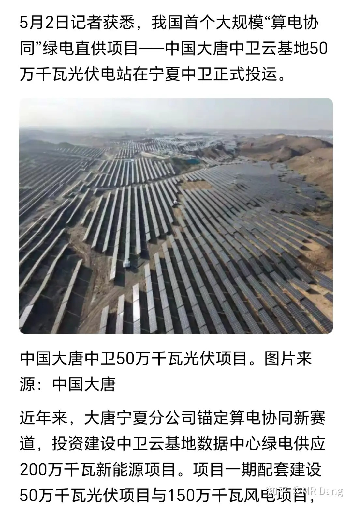
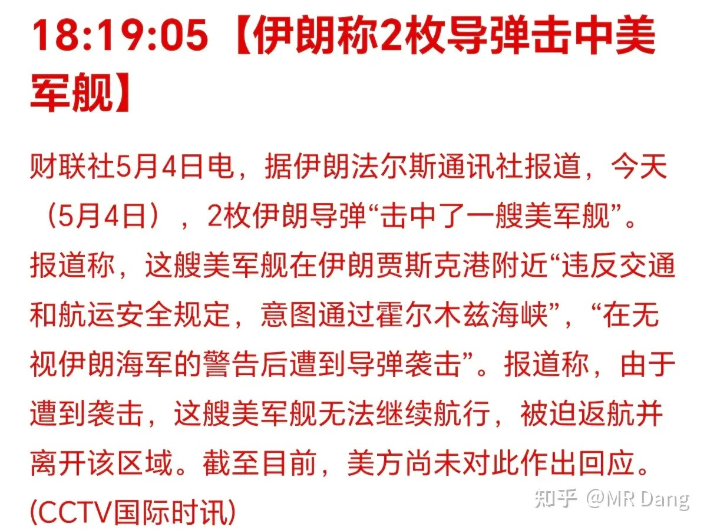
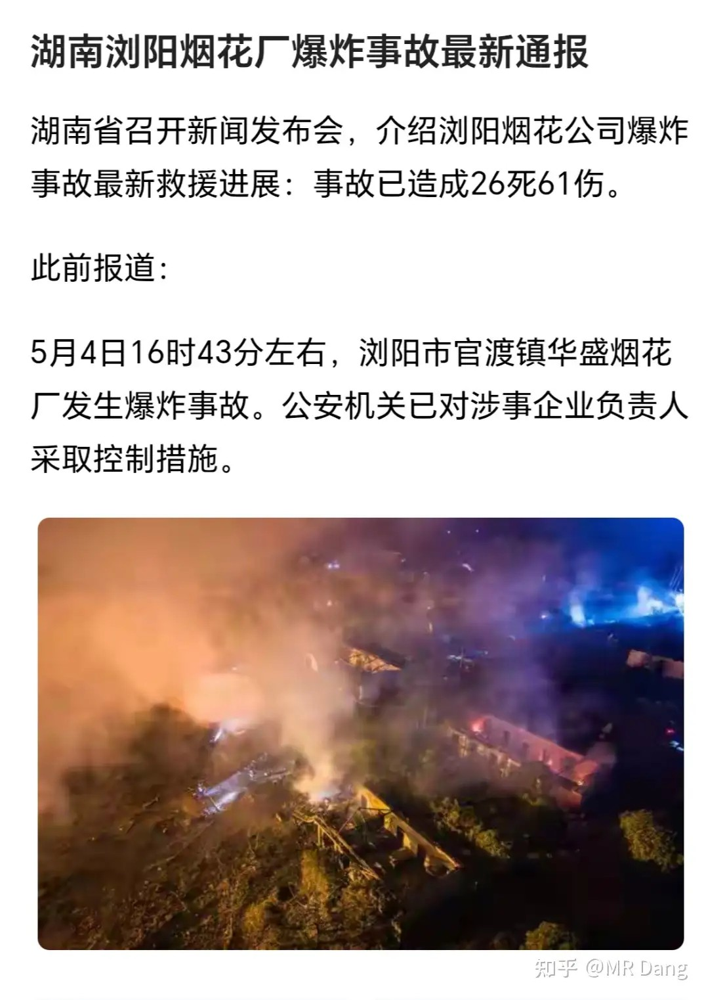
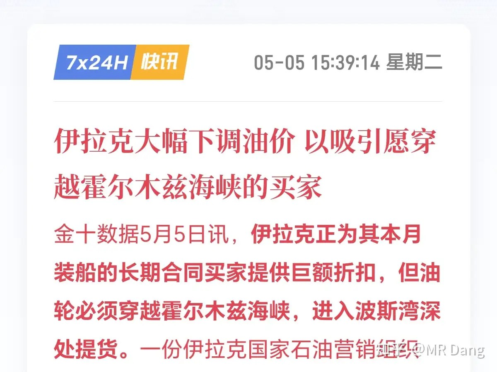
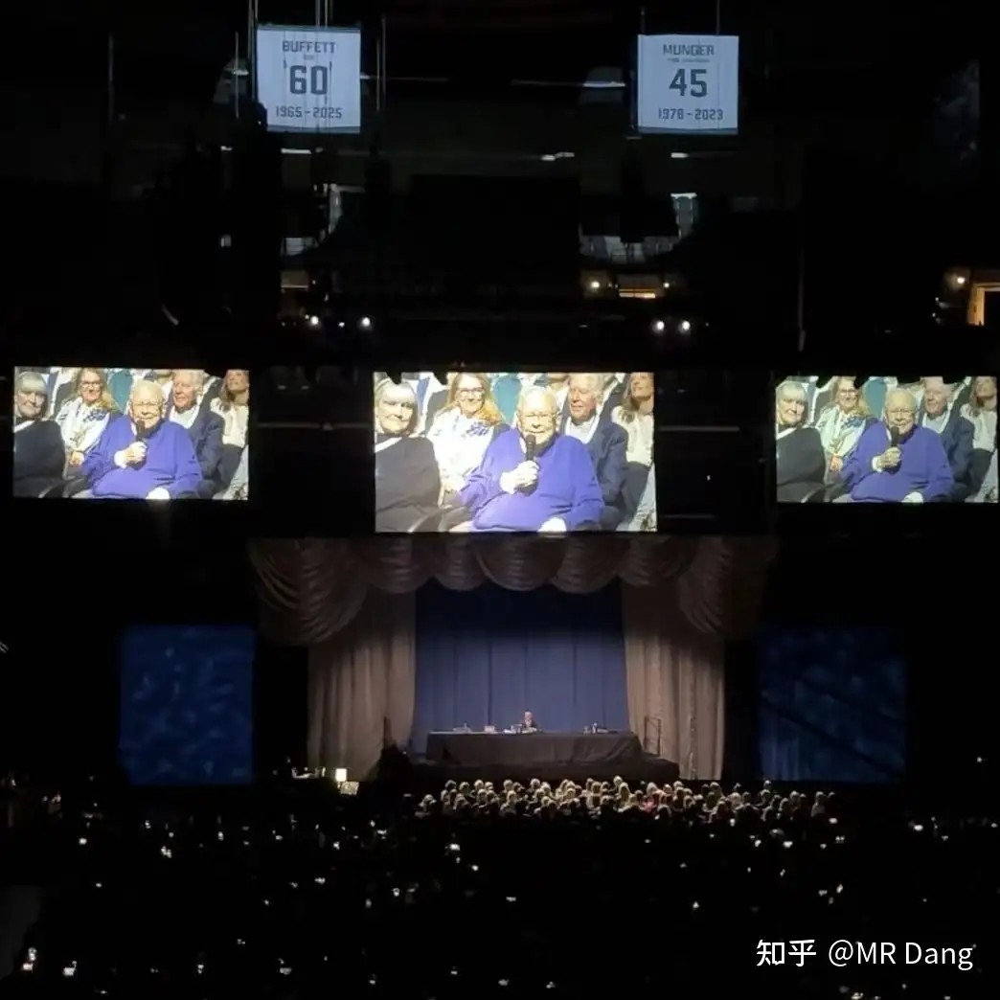
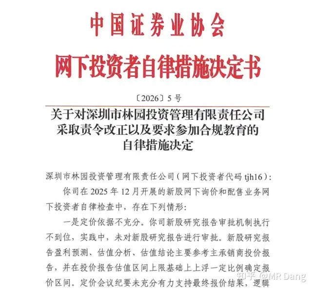
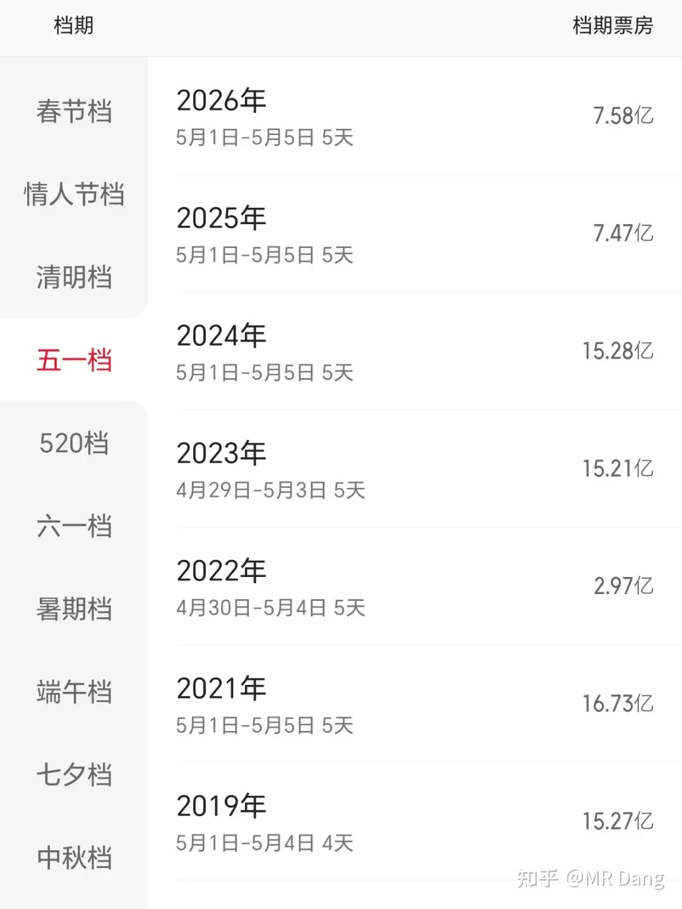
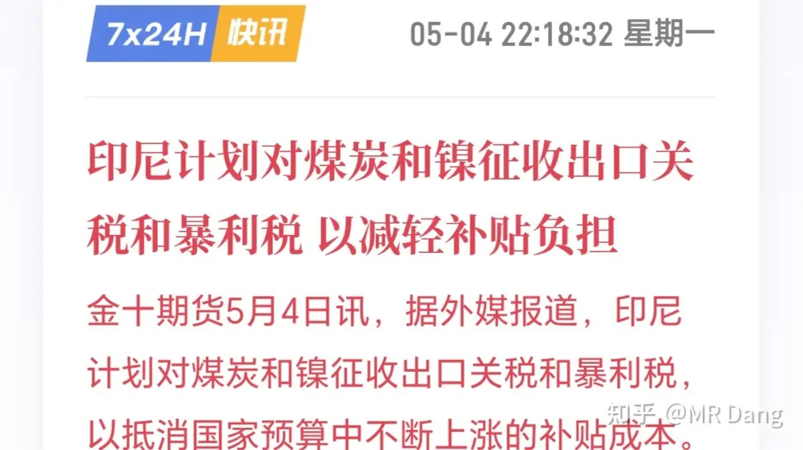
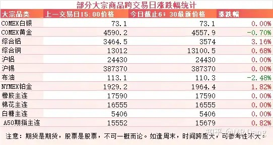

# 如何评价2026年5月6日A股行情？

---

**发布时间**: 2026-05-06 07:31  |  **原文链接**: https://www.zhihu.com/question/2033108906902303512/answer/2035260306658685024  |  **点赞数**: 371 人赞同

**作者信息**: MR Dang​​知势榜经济与管理领域影响力榜答主

---

## 正文内容

大家假期愉快，新的交易日又开始了，简单的把假期发生的事过一遍。

我国首个大规模“算电协同”项目落地：

有两家上市公司与这个新闻有关。

伊朗那边的脉络，有些变化：

虽然国会授权懂王的时间已经过了，但这只是程序上的一些制约，懂王和伊朗还在继续拉扯，谈的那些条款也是鸡同鸭讲，封锁实质上还在继续，另外这几天有一些摩擦：

每次碰到大A开盘就会自动刷新各种利空，已经习惯了，不过资本市场目前基本脱敏了，影响有限。

浏阳发生了一起重大安全生产事故：

以官方通报为准，对事故深表痛心。

伊拉克大幅下调油价，但是要自己拉：

一桶油便宜33美元，一艘普通的VLCC船算210万桶好了，这就是差不多7000万美元。

这个对本来过不去海峡的船吸引力可能有限，看得见吃不着。但是对那些能偷偷摸摸过海峡的船吸引力就太诱人了。

BRK召开了股东大会：

巴菲特还是露脸了，不过身体看着确实有明显下滑。

股神因为踏空了科技行情，收益率相对标普纳指来说比较一般，没少被群嘲。

其实投资这事，错过牛股或者暴富机会的情况天天都在发生，因为一段时间或者一波行情去否定人类历史上可能是收益率最高，持续时间最长的财富增长奇迹，多少有点短视了。

到了老巴这种体量的，关心的则根本不是什么暴富神话，高增长，更关心的是收益的稳定性，投资的确定性和财富的传承。

咱们是光脚的，他是穿鞋的，看待事物的角度自然不同。

酒老二的财报变脸事件：

浓眉大眼的酒企发布了一份让市场大跌眼镜的财报，推翻了之前的一些结论，财务上洗了个澡，然后又发布了一些安抚的措施。

对我个人的警示教育意义就是需要重新审视整个行业，包括依赖经销商制度的其他企业，这里的灵活操作空间还是太大了。

具体的就不展开了，假期圈内已经说过了。

另外林园投资也收到了处罚，不过原因是网下打新：

每个新股的定价都不是拍脑袋来的，而是网下打新的投资者在报价后，根据报价决定的。

网下打新的投资者不能报价太低，如果低于最后的发行价，那就直接淘汰。

也不能太高，每次都会直接pass掉出价最高一定比例的投资者（目前3％）。

所以这个游戏的玩法就是在不低于最后的发行价的前提下，尽量的贴近大家的平均数或者中位数的相对更低的那一个。

举个简单例子吧，比如有五个人，报了5，6，7，8，9。

9是最高价，直接淘汰，5678的平均数是6.5，中位数也是6.5，最后发行价就是6.5。

5和6低于6.5，也淘汰，最后有资格参与并且获得配售的就是报价7和8的两人。

这个规则的本意是让大家尽量高的出价，但是不能太离谱。

到了实际执行过程中，就变了样，因为某些第三方会发布指导的预期定价，比如6.66。

那基本上大家都报这个价，报了这个价的所有人都能获得配售，但是3％的淘汰比例依然在，所以策略就变成了谁手速快，谁先报这个6.66就挣钱，后来的只能吃土。

现在的网下打新基本就这个生态环境，你不按这个来，就是不专业，偏离的次数太多了就会被处罚。

假设报了个6.65，直接淘汰。

你标新立异，报了个6.67，就进入3％高价淘汰的区域。

普通投资者以为机构有多专业，什么现金流估值，同业对比估值，实际上就是一个拼手速比谁报价快的游戏。

五一档电影：档期票房7.58亿，比去年多了一点，但是和往年比起来还是远远不如

我不提，估计都没多少人还记得电影这茬。

票房是一年不如一年，口碑也是一崩再崩。

以前是没有投资价值，还多少有点互掏口袋的投机价值，现在连投机价值也没了。

和白酒属于难兄难弟了，时代的眼泪。

现在可替代的低成本娱乐方式太多了，电影也就剩下个仪式感了。

我个人的话，除了春节档如果机会合适考虑提前埋伏掏个口袋，其他任何时间段都不考虑这个行业了。

印尼拟对镍和煤炭加税：

这个消息之前也炒过几次，不过最后都没落地。

如果能落地，对镍价影响还是挺大的，目前商品市场没受到影响。

大宗商品

五一假期期间，商品市场也休假了，不过外面的部分商品价格波动比较大，比如西大的棉花，白糖，豆粕涨幅都挺大的。

这些开盘的品种里，铝的涨幅比较大，铜和铂金也都有一定的涨幅，黄金和原油整体回调。

外围市场：

美三大股指在A股休市期间表现：

道指节前48861，目前49298，涨幅一个点。

纳指节前24673，目前25326，涨幅两个多点。

标普节前7135，目前7259，涨幅一个多点。

港股在A股休市期间表现：

恒生指数收假前25776，目前25898，大概涨了半个点。

恒科节前4871，目前4929，涨了大概一个点。

这些市场里最热的就是存储板块，包括韩国，美国的资本市场，涨的最多的都是存储，假期涨了二三十个点是有的。

大A的话，没有特别正宗的标的，只有一些铲子股。

上个交易日个人组合净值大幅回撤，银行近5个点，资源一个半，消费两个半，电网1个，整体回撤三个多点，是更新以来回撤比例和绝对值都最大的一天。

稍微有点意外，因为其实银行的财报不错的，里子面子都过得去。市场给出这种反应更像是有点应激，担心利润都拿去充实拨备，影响接下来的派息。

这个见仁见智了，我自己没什么好纠结的，不会因为二级市场反应而改变之前的看法。不过现在银行里综合考虑性价比高的银行不只一两家，有五六家之多，趁着假期都更新在圈内了，可以根据自己的偏好选择更顺眼的。

银行业整体上一季度的净息差边际改善都不错，包括四大行，数据都挺好的，基本面没啥担心的。

主要还是流动性的问题，银行和科技股在短期内是跷跷板的两头。资金就这么多，如果有来钱快的路子，肯定有部分资金就会舍弃代表老登的银行，拥抱热点。

这种时候谈基本面意义不大，需要的是站队。如果说对手里拿的东西心里没底，也忍不了回撤，看着科技吃肉眼红的不行，那可以选择打不过就加入。

但是面对的风险需要考虑清楚，后视镜看很多东西一直创新高，但是真正拿在手里才知道能拿住也是需要充值信仰的。

最简单的例子就是老读者知道我买过两倍做多海力士的产品，最后按照原则止盈了。

如果不按照原则止盈，现在收益要翻好几倍。

但是中途会经历一次8个交易日就比腰斩还要多的回撤。

像我这种对科技没信仰的，即使抗住了这样的回撤，后面还会有一个单日46％涨幅的反弹在等着，这要是能忍住诱惑不卖，才有资格说什么翻倍的事。

我对有股息的东西是有信心的，拿的住，但是对这种高波动而且带时间磨损的东西是真没信心，所以看别人吃肉一点都不眼红，这是我认知外的钱，一分都赚不到的。

所以我参与这些高科技的东西依然是老登的传统打法，铜铝电网设备变压器这些铲子思维。

本周前瞻：

1，今天公布西大四月ADP就业人数。前值6.2，预期9.9，这个往往预期差距很大，影响有限。

2，今天公布西大EIA原油库存，上周超预期的减少后引发了原油的持续上涨，本周需要继续关注。

3，明天公布东大外汇储备。

4，明天公布西大周初请失业金人数。

5，本周五公布西大四月的失业率和非农。

6，本周末公布东大的贸易数据。

一个喜欢保护韭菜的博主，希望大家少少踩坑，多多赚钱！！！

> [!comment]- 点击展开评论
>
> | 用户 | 时间 | 内容 |
> | :--- | :--- | :--- |
> | 在下狐诌子 | 1 小时前 | 如何看待大盘4200我在这些股里躲牛市市值比3800的时候还低 |
> | &nbsp;&nbsp;&nbsp;&nbsp;烛龙 | 10 分钟前 | 早点清醒早点出来，除非资产跟他一个规模，拿生命换钱。 |
> | &nbsp;&nbsp;&nbsp;&nbsp;北上大人 | 34 分钟前 | 等回调的时候给dang票调到3000保卫战水平 |
> | 钱包鼓鼓 | 3 小时前 | 每日打卡第46天算电协同项目相关（大糖发电、美李云）存储板块假期暴涨二三十个点但大A缺正宗标的只有铲子股。华夏上交易日暴跌近5个点但一季报净息差改善基本面没问题。酒老二财报翻车需要重新审视整个经销商制度行业。电影行业除春节档外不再考虑。商品方面铝涨幅大、铜铂金也有涨，镍如果印尼加税落地是大利好 |
> | &nbsp;&nbsp;&nbsp;&nbsp;山石李 | 2 小时前 | 美李云？你确定吗？怎么说？ |
> | &nbsp;&nbsp;&nbsp;&nbsp;一条壁虎 | 2 小时前 | 利大唐是电他是算 |
> | 在下狐诌子 | 1 小时前 | 来搞笑的绿桥其他铝股都高开他只能平开，中国铝业都比不过了，5月不会还给我亏钱吧 |
> | &nbsp;&nbsp;&nbsp;&nbsp;在下狐诌子 | 1 小时前 | 还在新低，这要跌倒什么时候啊 |
> | &nbsp;&nbsp;&nbsp;&nbsp;海角孤帆 | 1 小时前 | 看到18 |
> | &nbsp;&nbsp;&nbsp;&nbsp;在下狐诌子 | 1 小时前 | 跌回4块算了 |
> | &nbsp;&nbsp;&nbsp;&nbsp;若星汉天空 | 1 小时前 | 23.6的缺口，仓位打的太高现在只能装死了 |
> | qqq123 | 2 小时前 | 有兄弟能讲讲5-6个银行吗 |
> | &nbsp;&nbsp;&nbsp;&nbsp;世界这么大 | 1 小时前 | 国有六大行都不错吧。最典型就是邮储银行了。 |
> | &nbsp;&nbsp;&nbsp;&nbsp;heytony | 2 小时前 | +1 |
> | 干饭闪电狼 | 3 小时前 | 铝啊铝红起来吧 |
> | 小特 | 1 小时前 | 今天大盘这么红，绿桥和啤酒加起来又跌我3个多点，天啊 |
> | 若星汉天空 | 2 小时前 | 绿桥跟跌不跟涨 |
> | 木秀于林 | 1 小时前 | 一片哀嚎，绿油油 |
> | 一叶知秋亦障目 | 1 小时前 | 菜百怎么会这个鬼样子 财报后跌了差不多20%了 |
> | michi | 3 小时前 | 今天早啊 |

---

*本文件从MR Dang知乎页面转载*

---

**作者**: MR Dang
**链接**: https://www.zhihu.com/question/2033108906902303512/answer/2035260306658685024
**来源**: 知乎

*著作权归作者所有。商业转载请联系作者获得授权，非商业转载请注明出处。*

## 相关阅读

**每日行情评价系列：**
- [[20260430-如何评价2026年4月30日A股行情？|4月30日行情]] - 美联储议息、原油库存、银行财报和节前风险控制。
- [[20260429-如何评价2026年4月29日A股行情？|4月29日行情]] - 非洲零关税、原材料成本、聚酯纤维和财报季风险。
- [[20260428-如何评价2026年4月28日A股行情？|4月28日行情]] - 工业增加值、化纤修复、有色和电子设备制造业绩线索。
- [[20260427-如何评价2026年4月27日A股行情？|4月27日行情]] - DeepseekV4、昇腾适配、交易规则变化和有色波动。
- [[20260424-如何评价2026年4月24日A股行情？|4月24日行情]] - 审计赔偿、铝企一季报和财报风险控制。
- [[20260423-对于2026年4月23日A股市场行情，大家有什么预测和看法？|4月23日行情]] - 碳达峰、算力能效和工业耦合方向的政策线索。
- [[20260422-对于2026年4月22日A股市场行情，大家有什么预测和看法？|4月22日行情]] - 利率表态、通胀框架和市场敏感点的拆解。

**算力、电力与节后变量：**
- [[20260423-对于2026年4月23日A股市场行情，大家有什么预测和看法？|算力能效]] - 单位算力能效、液冷材料和绿电直连方向可以对照阅读。
- [[20260427-如何评价2026年4月27日A股行情？|DeepseekV4]] - AI国产化、昇腾适配和算力叙事的另一条线索。
- [[20260409-如何看待 2026 年 4月 9日 A 股市场行情？|AI热点]] - AI视频模型、热点扩散和市场情绪的早期线索。
- [[20251024-怎么全面的分析一支股票？|系统分析框架]] - 把宏观、行业、公司和市场预期放在同一张图里看。

**财报、估值与风险控制：**
- [[20260404-如何分步骤快速看懂上市公司年报？|看懂年报]] - 年报和季报的阅读路径与重点抓取。
- [[20260401-读懂财报，看清基本面|读懂财报]] - 用基本面框架理解利润、现金流和估值预期。
- [[20251029-新手投资者避坑指南之不要赌财报|不要赌财报]] - 财报季后半段尤其适合回看，避免把业绩当短线押注。
- [[20251026-如何对企业进行估值？|估值入门]] - 题材、业绩和预期都要最终落回价格。
- [[20251103-高学历的人炒股，痛苦的根源是什么？|认知误区]] - 节后行情容易扰动心态，先回到决策框架。
