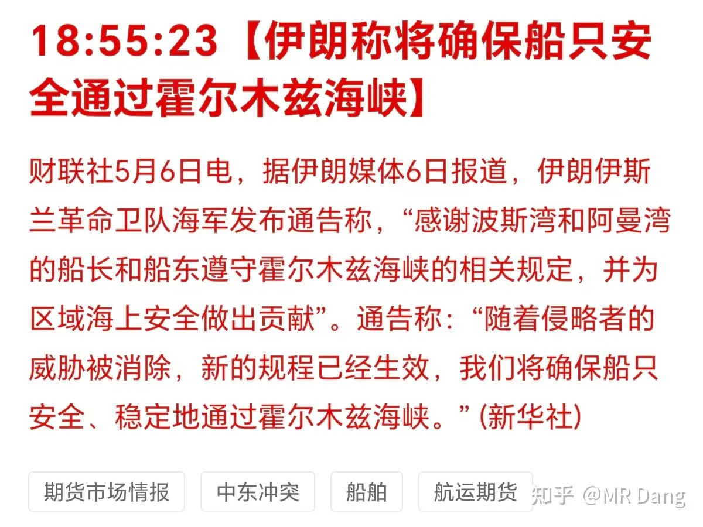
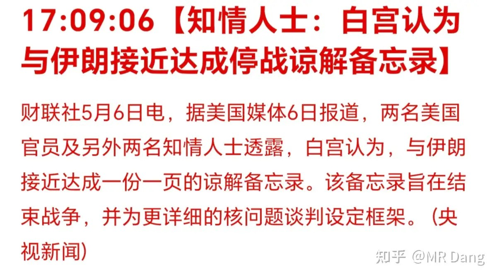
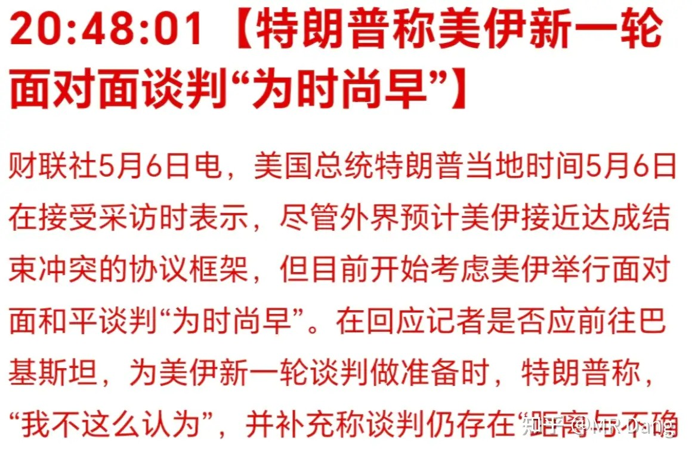
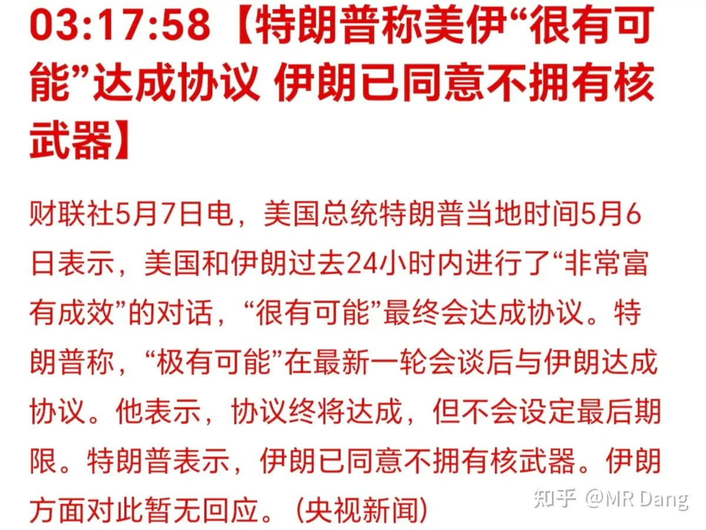
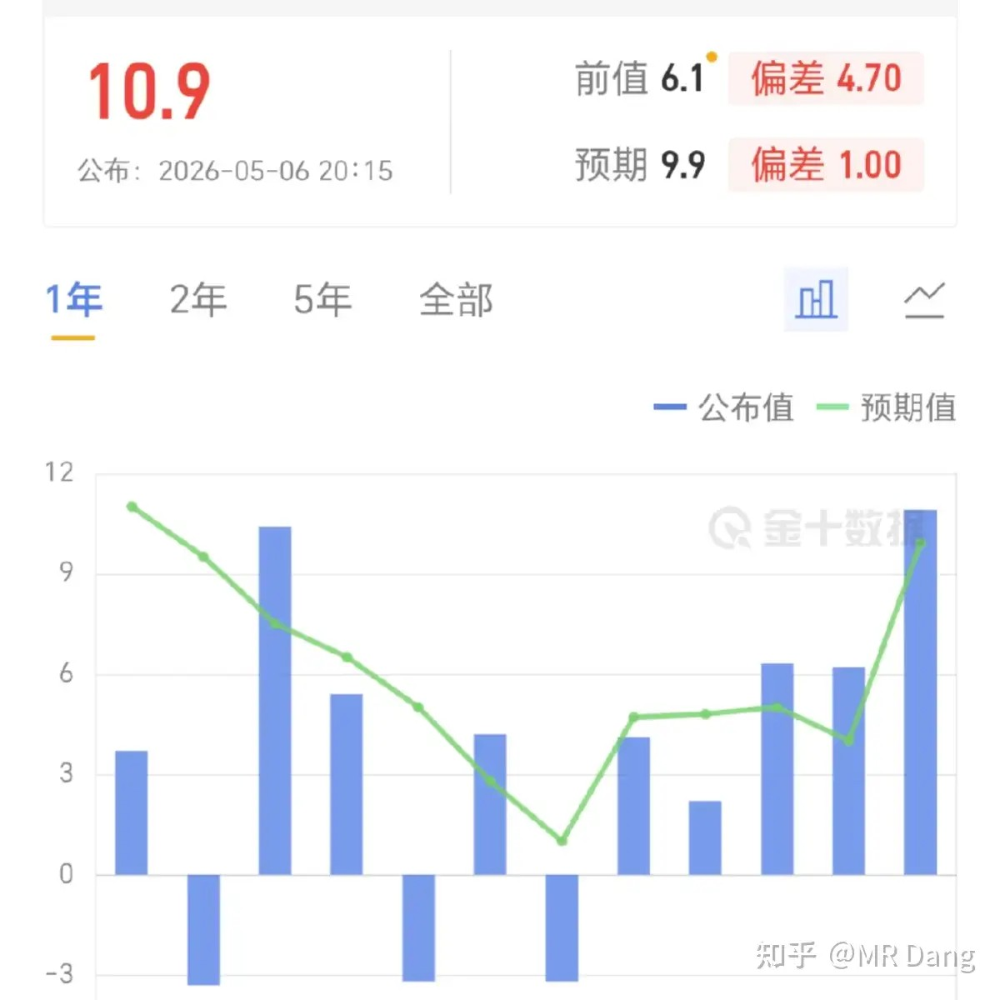
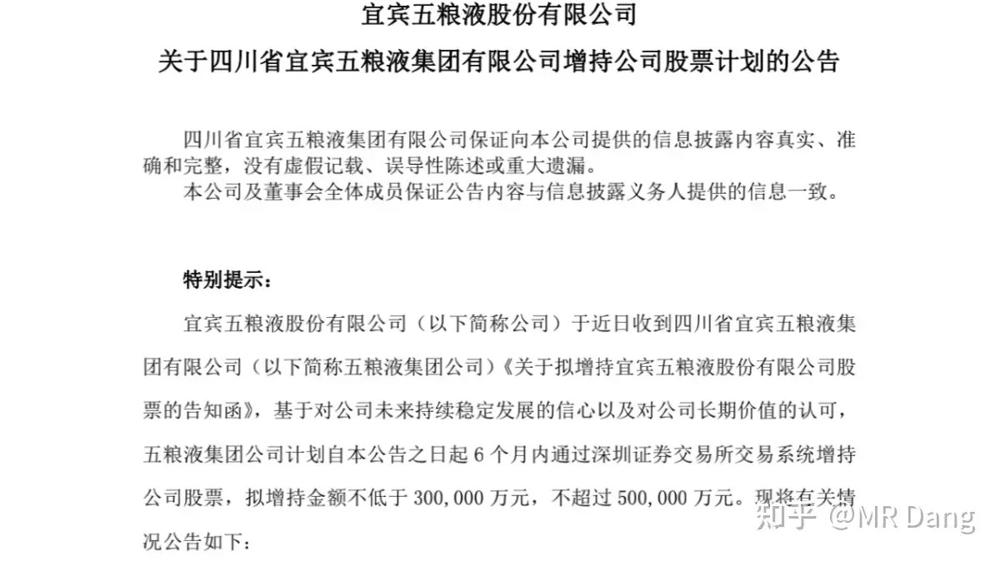
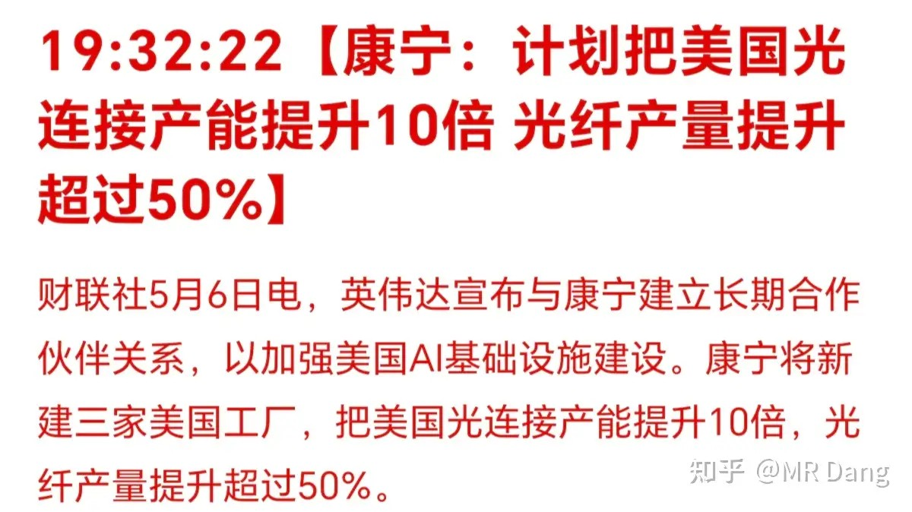
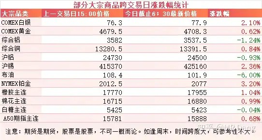
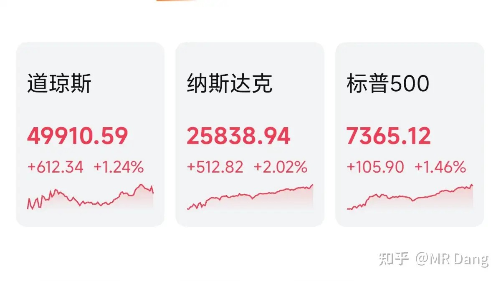
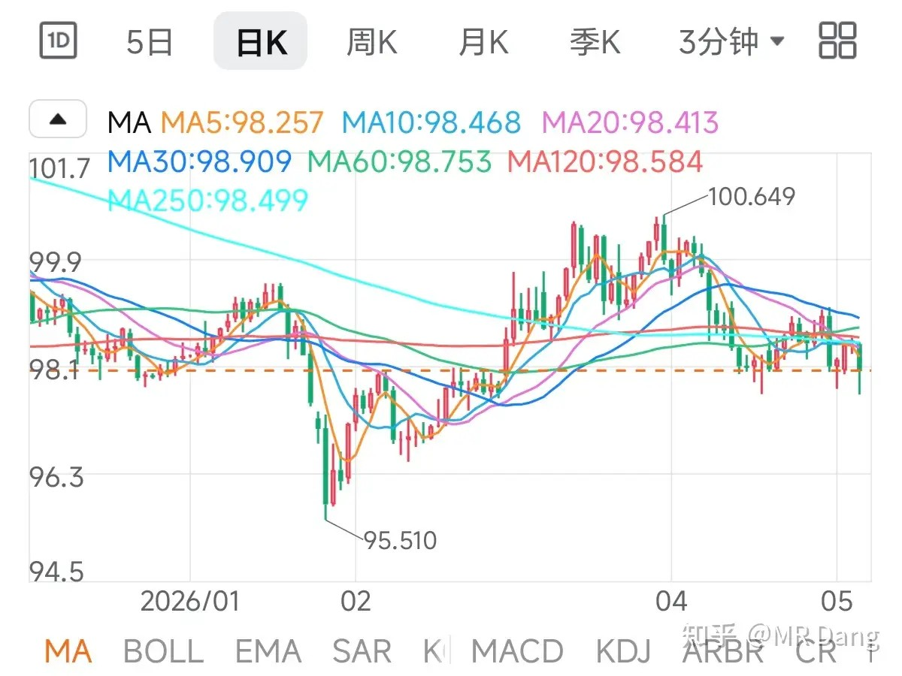

# 如何评价2026年5月7日A股行情？

---

**发布时间**: 2026-05-07 07:30  |  **原文链接**: https://www.zhihu.com/question/2034922634857727997/answer/2035622622457802895  |  **点赞数**: 337 人赞同

**作者信息**: MR Dang​​知势榜经济与管理领域影响力榜答主

---

## 正文内容

今天最大的头条还是有关海峡的口水仗，伊朗称要确保安全通行：

知情人士又透漏了，美伊接近达成停战谅解备忘录：

消息出来后原油价格跳水，金属价格拉升。

后来懂王出面否认，画风又有点变化，原油开始反弹，金属吐回部分涨幅。

不过过了几个小时，懂王表示很有可能达成协议：

不是我精神分裂左右脑互搏，消息确实就是这么个消息。

昨天还有个新闻是伊朗外长来咱们这边访问了，紧接着就来这么一出。新闻要串起来看，东大应该多多少少还是出力了的。

西大公布了ADP就业人数：新增10.9万人，比预期9.9万人更强劲一些

酒老二：发布了大股东增持公告

这个和之前公布的公司回购不是一回事，主体是上市公司的大股东，而不是上市公司本身。

至于金额30到50亿，对酒老二这种体量来说不算什么，也就是表明个态度，没啥太大的实际意义。

酒老二其实昨天跌的还比较克制，虽然信誉度和好感都被败完了，依然有很多投资者选择了原谅。

康宁：计划把美国光链接产能提升十倍

同时还发布了和英伟达的一些合作协议，消息出来后在二级市场冲高回落

大宗商品：

受消息面影响，金银铜铂等有色走强，黄金重返4700关口，白银上涨两个点，锡上涨两个点，铂金上涨三个点。

原油大幅回调6个点，铝回调一个点左右。

橡胶和棉花走强，天然橡胶逼近1万8的关口。

胶价两万对某些公司来说是一个很重要的位置，超过这个位置的话，盈利空间就会打开。

另外最近有两个农产品涨幅巨大，有二三十个点，一个是香蕉，不是橡胶，是吃的那个香蕉，还有一个是洋葱。

这两都没什么太直接的标的，有一家上市公司拥有大概10万吨级的洋葱产能，看着挺唬人，其实占总营收也就3%左右，影响十分有限。

外围市场：

美三大股指走强，纳指领涨。

AMD财报超预期，现在CPU也参与Ai里的算力分配也成为了共识，未来有比较稳定的需求增长预期，英特尔和AMD短短一个月已经翻倍了。

除了CPU板块，美股有色板块涨幅也不少。

大A对应的CPU标的相对来说就没那么纯正，和存储板块类似，都属于擦边或者概念，最近一段时间涨幅也不少，想投机的自己问Ai，反正我是没有。

中概股走强。

美元指数走弱：

美元代表信用货币，美元指数的对面就是黄金之类的天然货币。

昨天个人组合净值回撤半个点，银行绿两个，资源红两个半，消费绿1个，电网红4个半。

本来电网只能红4个的，不过开盘的时候调整了一下结构，加入了算力，当天表现还行，稍微提升了点收益，现在电网比较全面了，变成了一个简陋的算电协同组合，以后就改名叫算电了。

依然是看别人吃肉自己挨打的一天。

感觉成了科技板块的对手盘，那边一涨，这边就挨一巴掌，那边再一涨，就继续挨一巴掌。

也没太好的办法，静静等待看科技能涨到多少，希望别被打太多巴掌了。

唯一的好消息就是锡价大涨，昨天白天涨了三万多，锡价重返40万上方。

锡的逻辑是最硬的，但也只是模糊的方向，具体啥时候能爆发，能涨到多少，要涨多久，都是未知数。

现在摆在普通投资者面前最大的诱惑就是要不要追科技，不追吧，看着别人吃肉眼红，追了又怕套在山顶。

我自己是不会追的，主要是怕高处不胜寒，胆子比较小。

我能接受的最大尺度就是配置一些算电协同的打打助攻，电已经拿了很久了，所以最后又配置了一些算力。

这部分也不指望有什么太多的收益，仓位比例放在那里了，涨到天上去也就那样，主要是为了稳心态，体验一下科技牛市的氛围。

嗯。。。以上都是胡扯。。。

真实情况是前天晚上下了互掏口袋的隔夜单，昨天九点二十之前在圈子里回消息激情对线，给忘了这茬了，等九点半想起来的时候已经成交了。

最后结果虽然是好的，但是依然影响了睡眠质量，好久没犯过这种低级失误了，躺在床上反思了很久。

最后思来想去，将错就错，反正也是迷你仓，不影响什么，就当低成本试错了。

这部分我已经全额计提了，如果恰好买在山顶，就当花钱买了个教训。

所以。。。。如果真的忍不住诱惑，那像我这种小仓位试水也是可行的一个选项。

投资不是非黑即白的判断题，很多时候是存在灰度空间的，有欲望了就要发泄，堵是堵不住的，找到合适自己的比例和方向也是很重要的一部分。

但是如果想重仓参与，我个人依然是谨慎的，涨的太多了，风险不小。

一个喜欢保护韭菜的博主，希望大家少少踩坑，多多赚钱！！！

> [!comment]- 点击展开评论
>
> | 用户 | 时间 | 内容 |
> | :--- | :--- | :--- |
> | 快乐的脚丫 | 4 小时前 | 宏桥今天又是大跌 |
> | 加菲猫的屁股 | 2 小时前 | 我不炒股，但是我觉得看了这么多大V就是告诉我一个道理，人性和情绪和人设可以被利用，也可以利用。  刚开始都有干货知识，但是到了一定程度就会转化利润了，人都这样的，网红经济 |
> | &nbsp;&nbsp;&nbsp;&nbsp;Page | 47 分钟前 | 现在每天就是转发财联社 |
> | 钱包鼓鼓 | 6 小时前 | 每日打卡第47天美伊接近停火，中东局势可能缓和，原油暴跌6%，黄金重返4700，锡价重返40万上方。有色金属是当前逻辑最硬的方向，橡胶逼近18000，胶价破两万将打开盈利空间。科技股涨太多了不追，小仓位试水可以但重仓要谨慎。五粮液大股东增持30到50亿只是表态，实际意义不大。 |
> | 上善若水行远自弥 | 5 小时前 | 绿桥今天还会继续绿吗 |
> | &nbsp;&nbsp;&nbsp;&nbsp;空白wing | 4 小时前 | 是的 |
> | &nbsp;&nbsp;&nbsp;&nbsp;7391125 | 3 小时前 | 哪天不绿呢？在里面站岗几个月了 |
> | &nbsp;&nbsp;&nbsp;&nbsp;没流诗人 | 3 小时前 | 不多 绿了四个点 |
> | 喔喔喔 | 4 小时前 | 股神 |
> | 小秋 | 4 小时前 | 在市场支持偶像那得用真金白银，宗教入脑的受着就行了。慢慢学到自己怎么在市场生存才是关键，主力不挣钱韭菜挣钱本来就是倒反天罡 |
> | 在下狐诌子 | 3 小时前 | 好样的绿桥，今天来个跌停 |
> | 冬日旅人 | 4 小时前 | 评论区像个讨债集中营 |
> | 古之饿来 | 6 小时前 | 先赞后看，腰缠万贯 |
> | 知乎用户齐 | 4 小时前 | 宏桥已经把主力洗出去了 |
> | &nbsp;&nbsp;&nbsp;&nbsp;巴西总督 | 4 小时前 | 人推给你不是为了跑路还能是为了送饼给你吃啊 |
> | &nbsp;&nbsp;&nbsp;&nbsp;知乎用户齐 | 4 小时前 | 哈哈，我没所谓，亏不了多少 |

---

*本文件从MR Dang知乎页面转载*

---

**作者**: MR Dang
**链接**: https://www.zhihu.com/question/2034922634857727997/answer/2035622622457802895
**来源**: 知乎

*著作权归作者所有。商业转载请联系作者获得授权，非商业转载请注明出处。*

## 相关阅读

**每日行情评价系列：**
- [[20260506-如何评价2026年5月6日A股行情？|5月6日行情]] - 节后开盘、算电协同、伊朗局势和假期变量梳理。
- [[20260430-如何评价2026年4月30日A股行情？|4月30日行情]] - 美联储议息、原油库存、银行财报和节前风险控制。
- [[20260429-如何评价2026年4月29日A股行情？|4月29日行情]] - 非洲零关税、原材料成本、聚酯纤维和财报季风险。
- [[20260428-如何评价2026年4月28日A股行情？|4月28日行情]] - 工业增加值、化纤修复、有色和电子设备制造业绩线索。
- [[20260427-如何评价2026年4月27日A股行情？|4月27日行情]] - DeepseekV4、昇腾适配、交易规则变化和有色波动。
- [[20260424-如何评价2026年4月24日A股行情？|4月24日行情]] - 审计赔偿、铝企一季报和财报风险控制。
- [[20260423-对于2026年4月23日A股市场行情，大家有什么预测和看法？|4月23日行情]] - 碳达峰、算力能效和工业耦合方向的政策线索。

**原油、有色与外部变量：**
- [[20260506-如何评价2026年5月6日A股行情？|伊朗与油价]] - 假期后伊朗局势、油价折扣和海峡风险的前一日背景。
- [[20260429-如何评价2026年4月29日A股行情？|原油与通胀]] - 阿联酋退出欧佩克、原油供给和通胀压力。
- [[20260422-紫金矿业一季报实现净利润 200.79 亿元，同比大幅增长 97.50%，如何解读「矿茅」的Q1财报|紫金财报]] - 对照资源股、金属价格和盈利兑现。
- [[20251009-如何看待2025年10月9日a股有色板块暴动？是否还有低估值的投资机会？|有色板块暴动]] - 从板块层面理解有色行情、商品价格和估值切换。

**AI、算力与风险控制：**
- [[20260427-如何评价2026年4月27日A股行情？|DeepseekV4]] - AI国产化、昇腾适配和算力叙事的另一条线索。
- [[20260423-对于2026年4月23日A股市场行情，大家有什么预测和看法？|算力能效]] - 单位算力能效、液冷材料和绿电直连方向可以对照阅读。
- [[20251024-怎么全面的分析一支股票？|系统分析框架]] - 把宏观、行业、公司和市场预期放在同一张图里看。
- [[20251026-如何对企业进行估值？|估值入门]] - 科技股和资源股最终都要回到价格与预期。
- [[20251103-高学历的人炒股，痛苦的根源是什么？|认知误区]] - 追涨诱惑强的时候，先回到自己的仓位和决策框架。
