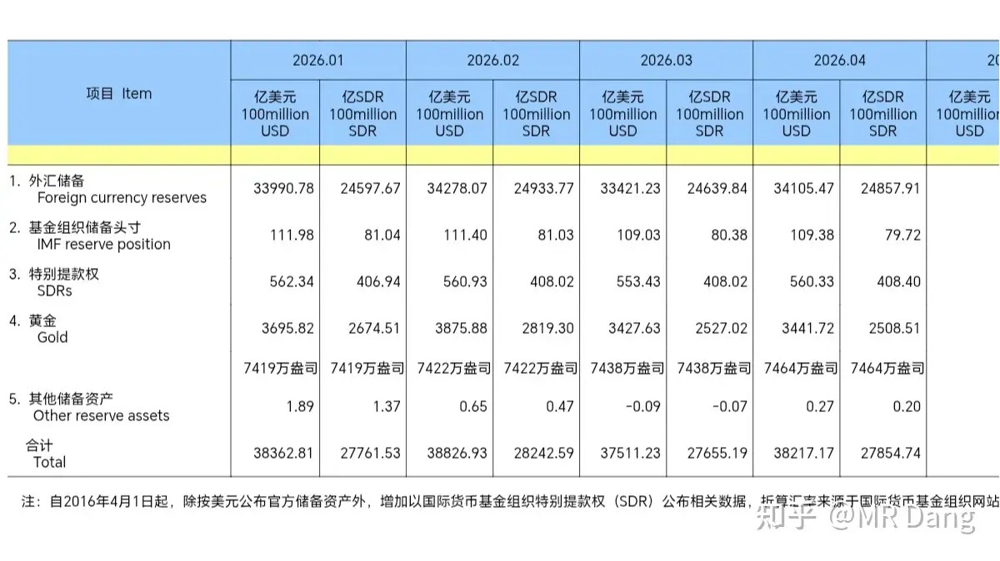
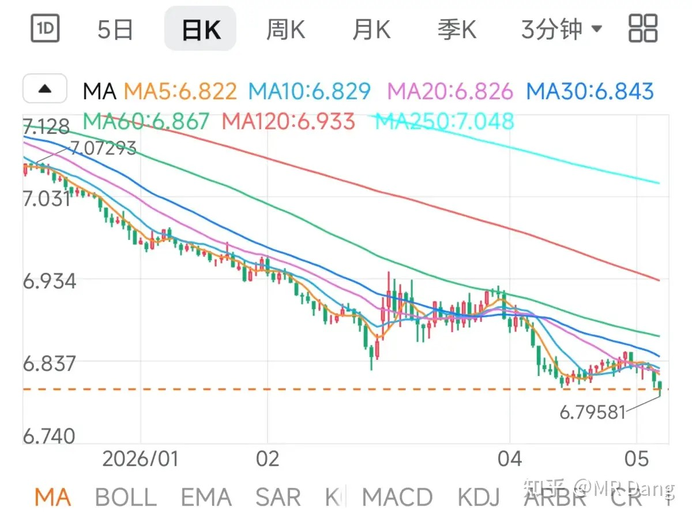
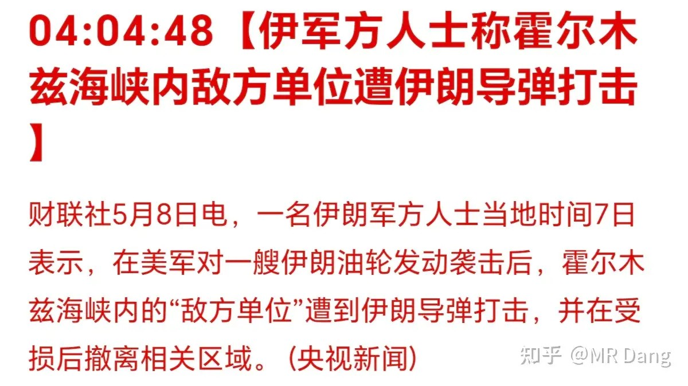
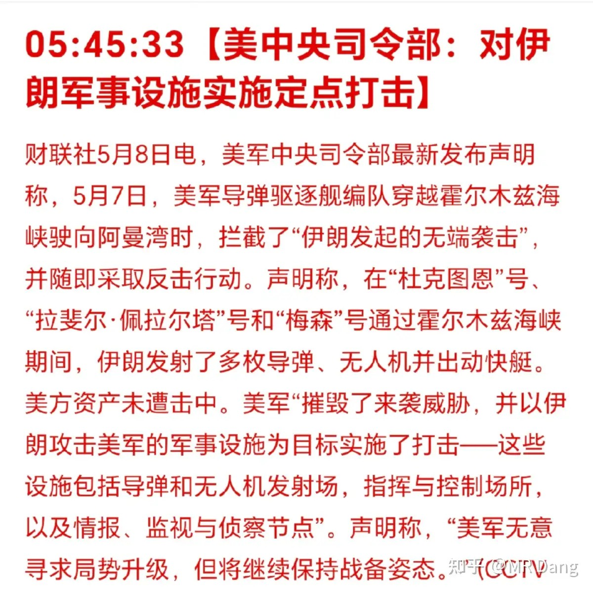
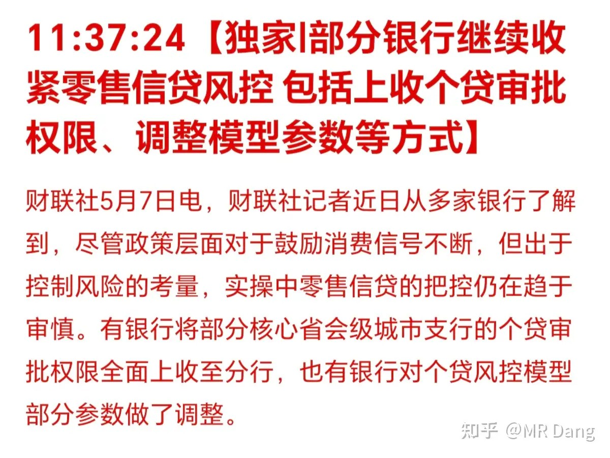
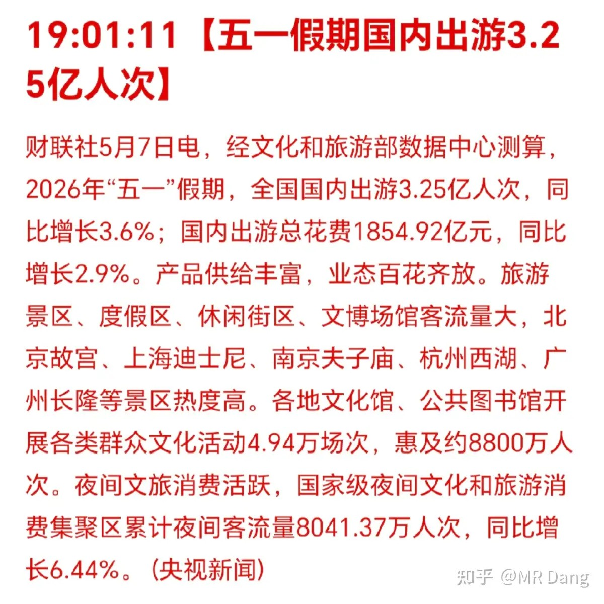
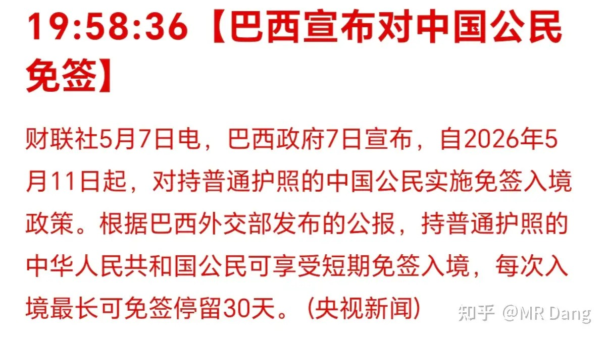
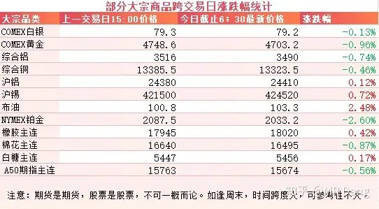
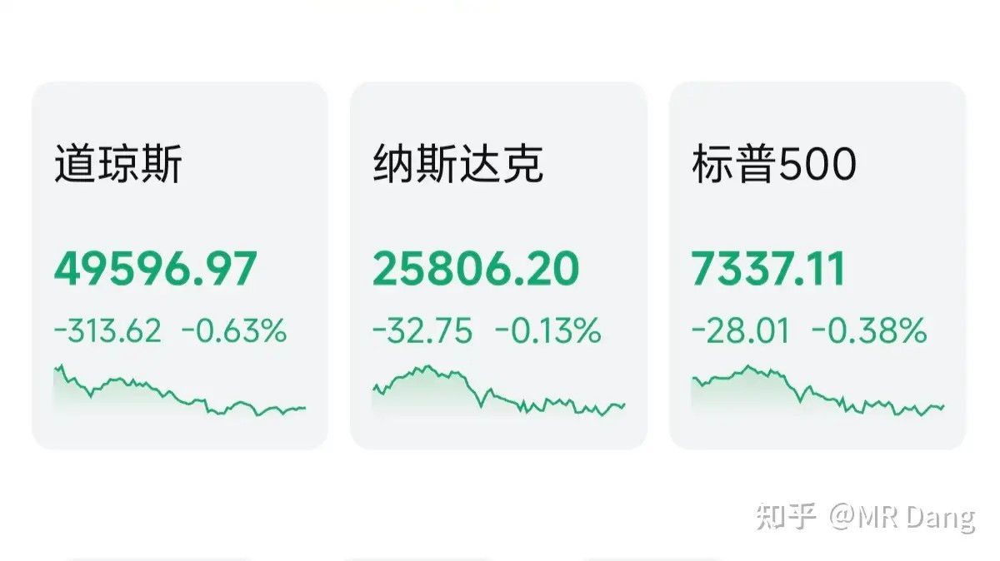

# 如何评价2026年5月8日A股行情？

---

**发布时间**: 2026-05-08 07:24  |  **原文链接**: https://www.zhihu.com/question/2035444869469050414/answer/2035983414092877845  |  **点赞数**: 402 人赞同

**作者信息**: MR Dang​​知势榜经济与管理领域影响力榜答主

---

## 正文内容

今天的头条是央行暴力买金：

昨天公布的外汇储备，四月份黄金多了26万盎司，买金速度相比之前每月两万三万盎司，快了一大截。

定投黄金的正确姿势还得看正规军，涨跌根本不是事，重要的是把红票子换成大黄鱼。

还是那句话，你不能只在上涨的时候才喜欢黄金。

汇率：红票子一度升破6.8的重要关口

新闻要连起来看，上面的官方储备外汇是增加的，也就是意味着汇率涨到现在这个程度，并不是官方自己买出来的，而是市场自由选择的结果。

汇率升值对一些美元债持有量大的行业或者企业是好事，意味着以红票子计价，债务压力更轻了。

这类企业一般是重资产类型的，比如一些出险的房企，城投公司，还有飞机租赁之类的。

同时对一些出口导向型的企业压力就会更大，不利于商品的出口。

伊朗局势：伊朗自称又发射了导弹

这个时间点在三个小时前，原油价格有些许反应。

美军对伊朗两个港口发动了打击。

两边声明一对比，事实还是挺清楚的，重合的部分就是真相，最大的差别就是伊朗导弹是否击中，不过这对投资并没啥影响。

懂王后来又补充了一句两边停火依然有效。

银行业：部分银行收紧零售业务风控

主要是底层银行操作都多少带点违规，特别是如果支行一把手决策失误或者有什么利益输送，就容易出坏账。

长期来看这个政策没毛病，权限收紧，有利于资产质量的提升。

但是短期来看可能会影响到部分业务的开展，特别是零售贷里的无抵押的信用贷，信用卡分期，无抵押的经营贷之类的。

而有一些银行，风险已经提前出清的，零售贷本身占比不高的，相对来说受到的影响就小一点。

至于各家银行零售业务占比，问下ai就清楚。

旅游业：五一旅游数据出炉

人次同比增长3.6％，消费同比增长2.9％，人均每次消费大约570元，比去年同期略有降低。

旅游板块也属于老登板块了，现在碳基生物都勒紧裤腰带给硅基生物砸钱，吃喝玩乐的标准一降再降。

吃的喝的对比的多了，大家对物价也越来越挑剔。

比如我经常刷视频刷到游客吐槽西安的羊肉泡馍贵。

我之前去别的地方旅游的时候也吃到过和羊肉泡馍类似的食物，大概定价都是15以内。

对比下来确实贵，而且贵不少。

但这不是今年才开始贵的，像密度这么大的吐槽我也是今年才刷到的，所以能从侧面说明大家对消费的眼光变得更加挑剔了。

另外巴西也放开了对中国游客的签证：

这个利好相关的航空公司，旅游服务企业。

不过影响没那么大就是了。

大宗商品：

受消息影响，原油走强，有色整体有点回调，幅度不大，锡和铝的夜盘有少许上涨。

农产品方面橡胶继续走强，站上了1万8的关口，白糖最近也比较强势。

外围市场：

美三大股指回调，热门科技股涨跌不一，存储板块回调。

昨天个人组合净值继续回撤近一个点，银行绿近一个半，资源绿一个半，消费绿半个，算电红3个。

最近的持股体验确实有点邪门，每天睡醒就自动扣费。

铝的持股体验更是有点一言难尽。

我自己给自己心理按摩的逻辑是铝的需求对gdp弹性最大，大概是1.5到2倍左右。

假设gdp增速5％，铝的需求就要增加7.5％到10％左右，而供应端已经接近天花板，非常刚性。

如果现在的铝价反应了目前的供需情况，以后随着gdp的增加，需求还会进一步增加，供求关系就会继续紧张。

所以和主流的铝价大周期看法不同，我个人认为铝价会在螺旋中上升，涨涨跌跌是肯定的，但是均价会上移，这也是我看好铝的原因之一，电解铝这个行业我觉得长期来看没问题。

但是这里有个现实的问题，就是按照gdp推测，需求增加应该导致库存降低，但现实是四月的国内铝持续累库，相比以前同期库存更高，似乎实际和理论存在差距。

我个人的看法是传统的铝需求结构以汽车和房地产为主，但是今年的房地产和汽车都一般，所以在传统的旺季，需求不旺。

但是现在新增的需求以光伏储能电网为主，大概占增量需求的7成以上，在时间上和传统的汽车建筑用铝分布不一致，导致需求的时间分布和以前不一样。

另外新增需求的弹性更大，比如同等gdp，光伏对铝的需求弹性系数是3，而房地产只有0.8。

同时在供应端，今年一季度的供应是增加了4.7％的，所以出现了累库的现象。

我个人更倾向于累库是一时的结构性问题，而不是总量上的需求不振，当然这些都需要数据支撑，需要跟踪五月下旬复工复产情况和备货618的情况，以及传统的9月10月旺季去库情况。

然后就又被埋了。。。。。。

人人都不看好你，偏偏你也不争气。

写到这里突然有点难过，在科技狂热的时候吐槽科技太贵，风险高，只会显得自己像个踏空的小丑。

同理，铝板块下挫的时候分析这些基本供需面，也只会被当做找补。

就这样吧，情绪的事交给情绪，理智的事交给理智，信也好，质疑也罢，时间是最好的答案。

一个喜欢保护韭菜的博主，希望大家少少踩坑，多多赚钱！！！

> [!comment]- 点击展开评论
>
> | 用户 | 时间 | 内容 |
> | :--- | :--- | :--- |
> | 陈陈陈 | 4 小时前 | 一般都不写文字评论 今天感受到D大的情绪变化还是说两句吧 很喜欢D大的一句话 你不能只在黄金上涨的时候喜欢黄金 适用于很多地方 加油 |
> | 都督中外诸军事 | 3 小时前 | 镁合金代铝这块我还算有点懂，听制造业和原料的长辈朋友们说的有点多。首先汽车是最好不要使用普通镁合金的，因为汽车碰撞的瞬时温度会超过普通镁合金的燃点，增加自燃风险，也有相关的国家标准。但是现在有阻燃镁合金，简单来说就是在镁合金里面加入一些稀土，能提升燃点，综合成本已经非常接近铝合金，未来可能成本会持平铝合金。等到未来成本降到约等于铝合金的时候等于可以在轻量化上获得一点优势。还有就是新能源的铝渗透率还没到极限，我看他们大概估算的是到30年，单车用铝会涨到350kg，用镁涨到60-70kg，就是大概铝涨100kg，镁涨两倍的样子。不过铝只要用电，发电是国内的长板，镁要用天然气，天然气更依赖外循环。目前镁合金在电网设备方面也只能做外壳或者微量掺入铜中做铜镁合金，而铝可以做核心导电部件，目前没有技术能在电网设备上进行镁代铝或者镁代铜的尝试。 |
> | &nbsp;&nbsp;&nbsp;&nbsp;爱美的丫 | 2 小时前 | 好专业啊 |
> | &nbsp;&nbsp;&nbsp;&nbsp;三哥数签签 | 55 分钟前 | 专业。当年读书实习的时候，在电厂看到那一排排手腕粗的铝排，觉得很震撼 |
> | 都督中外诸军事 | 4 小时前 | 打了7成证券，看好指数突破前高，最近一直靠证券给LV填坑，好歹算守住了。银行换证券也算秀了一把微操，银行基本是在高点出的。 |
> | &nbsp;&nbsp;&nbsp;&nbsp;Iris | 3 小时前 | 银行还准备入吗 |
> | &nbsp;&nbsp;&nbsp;&nbsp;都督中外诸军事 | 3 小时前 | 后面再说，要控温，银保证老登不可能一起涨的。 |
> | 钱包鼓鼓 | 4 小时前 | 每日打卡第48天央行四月黄金储备暴增26万盎司，买金速度环比快了十倍，跟着正规军定投黄金就对了人民币升破6.8是市场自发的不是央行硬拉，利好美元债大户（房企、城投），利空出口企业伊朗美军互相动手但懂王说停火有效，原油短期波动不影响大局银行收紧零售风控长期利好资产质量，短期信用贷和信用卡业务承压五一旅游人次涨3.6%但人均消费570元反而降了，消费降级继续，旅游板块别碰电解铝长期逻辑没变（需求GDP弹性1.5到2倍、供应见顶），四月累库是结构性错配不是需求崩，但需要跟踪五月下旬数据验证 |
> | &nbsp;&nbsp;&nbsp;&nbsp;Saint | 3 小时前 | 旅游板块还在持有等回本的怎么办啊？ |
> | &nbsp;&nbsp;&nbsp;&nbsp;姜小姐 | 2 小时前 | 我也是哈哈哈 |
> | &nbsp;&nbsp;&nbsp;&nbsp;呜呜呜 | 2 小时前 | 听说铝的供应还有一部分来自铝废料的回收,而且这个占比可能随着供应下降，占比上升， |
> | 吃俺一记咖喱棒 | 4 小时前 | 我是汽车行业的现在行业正在大规模推行镁代铝，以后汽车行业对铝的需求会持续下降 |
> | 倾听的喵 | 3 小时前 | “写到这里突然有点难过，在科技狂热的时候……”前面都面无表情地看着，看到这里突然愣了愣，原来D大也是人。 |
> | &nbsp;&nbsp;&nbsp;&nbsp;无痕 | 2 小时前 | 这话说的 |
> | 回答里不要放广告 | 4 小时前 | 铝的人太多了，二月跟着有色涨太多，就是这样，涨久了会跌，跌久了会涨，借用一句话，一只股票如果不打算持有十年，最好不要持有十分钟 |
> | &nbsp;&nbsp;&nbsp;&nbsp;一叶轻舟 | 3 小时前 | 你能看到10年以后？ |
> | &nbsp;&nbsp;&nbsp;&nbsp;momo | 3 小时前 | 巴菲特说的是美国股市，正规市场 |
> | &nbsp;&nbsp;&nbsp;&nbsp;pinklord | 2 小时前 | 笑死了还持有十年，十个月都难吧 |
> | &nbsp;&nbsp;&nbsp;&nbsp;回答里不要放广告 | 1 小时前 | 借来的信心，垮的会比较快，笑我说的十年干嘛 |
> | 慢变量 | 1 小时前 | 宏桥→绿桥→泪桥 |
> | &nbsp;&nbsp;&nbsp;&nbsp;在下狐诌子 | 1 小时前 | 心脏搭桥——奈何桥 |
> | &nbsp;&nbsp;&nbsp;&nbsp;一尔 | 35 分钟前 | 我今天手贱，今天入的都亏 |
> | adsasd | 1 小时前 | 哈哈，现在绿桥评论区都是d家军集合 |
> | 哈啰 | 3 小时前 | 老师早ﾉ☀，我是一名小白，10月份有幸遇到您，每天早报跟随学习至今，收获良多，持仓分布，仓位控制，都有很大进步，不同板块的标的，涨跌会有互补，所以心态比较稳定，这些收获是无价的，学生愚钝，到目前还是问不出什么专业的问题，但每天学习一点总归是好的，希望老师不改初心，带我们继续前行。 |

---

*本文件从MR Dang知乎页面转载*

---

**作者**: MR Dang
**链接**: https://www.zhihu.com/question/2035444869469050414/answer/2035983414092877845
**来源**: 知乎

*著作权归作者所有。商业转载请联系作者获得授权，非商业转载请注明出处。*
