# 如何评价2026年5月14日A股行情？

---

**发布时间**: 2026-05-14 07:33  |  **原文链接**: https://www.zhihu.com/question/2037848758654857950/answer/2038159976938607710  |  **点赞数**: 493 人赞同

**作者信息**: MR Dang​​知势榜经济与管理领域影响力榜答主

---

## 正文内容

昨天CPI，今天PPI：

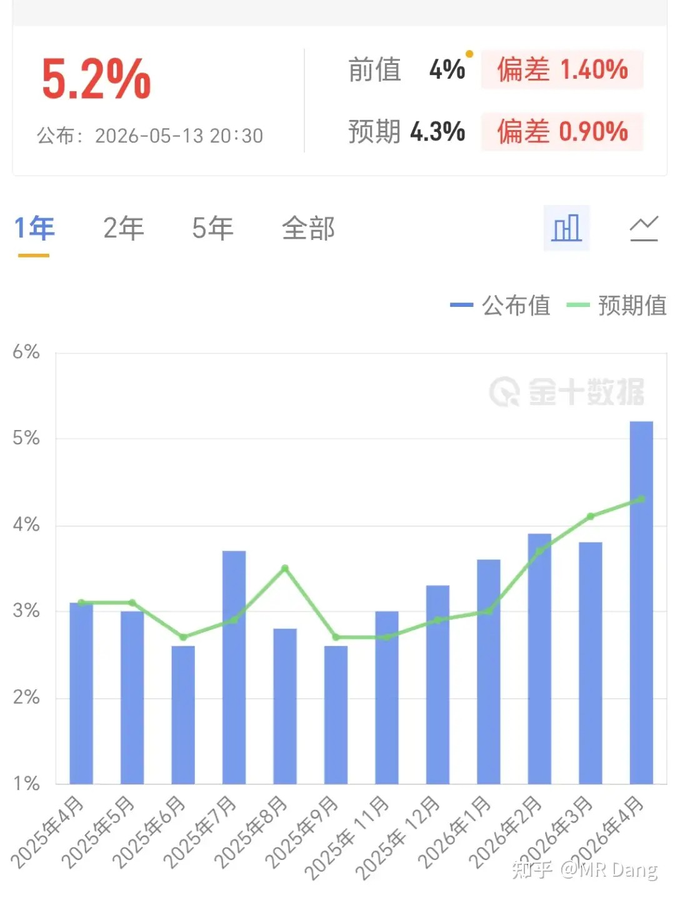

西大公布的核心PPI数据比CPI还超预期，达到了5.2％，比前值4％和预期4.3％都高了很多。

这还只是核心的，普通PPI更是达到了6％。

PPI是CPI的先行指标，大概领先三五个月。

这么炸的PPI会导致接下来的CPI持续升高，推高通胀，进一步降低降息预期，甚至带来加息的讨论。

对黄金不是好消息，对股市也不是好消息。

也就现在是牛市了，大家情绪亢奋，管你这的那的，先涨了再说。

要是放平时，这种利空会带动股市下跌。

工信部昨天发布了一个文件：

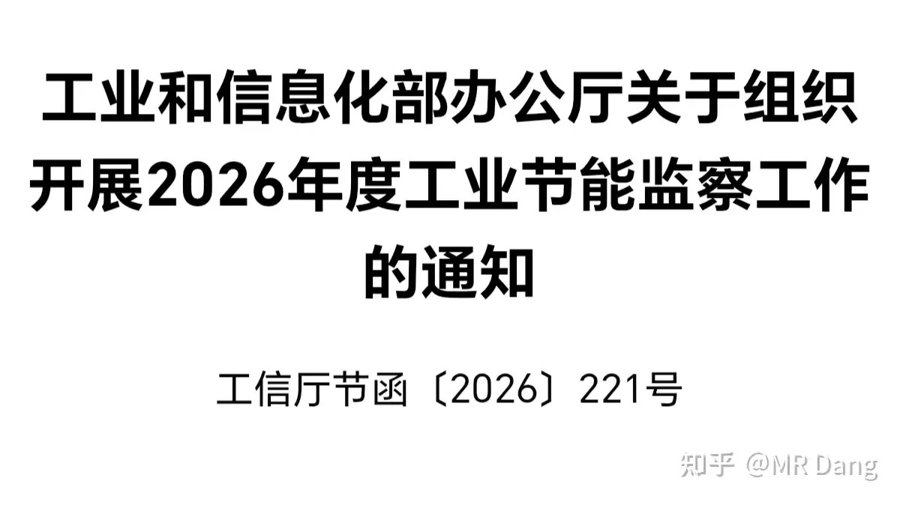

其中的目标：

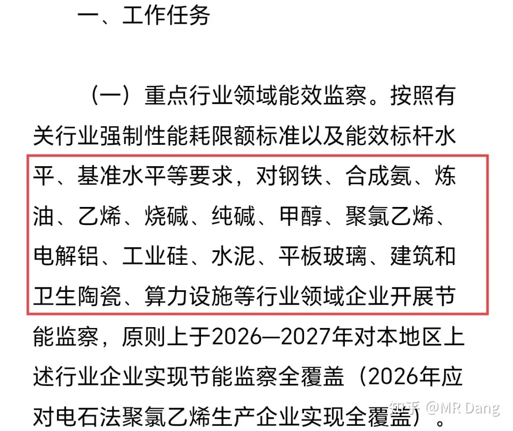

短短四行字，对这些行业的供应端都是不小的扰动。

很多读者可能觉得这就是一次例行检查，每年4到6月都会做，没什么大惊小怪的。

但是这次很多提法都是新提出的，比如原则上2026——2027全覆盖。

包括算力也是首次纳入，那算力价格会怎么走，不难预测。

全覆盖可不是抽查，和往年完全不一样的尺度，以后“上有政策，下有对策”的时代会渐行渐远，定了产能上限是多少，最后生产出来的东西就要是多少，这中间的差额会被压缩。

所以总体利好以上提到的这些行业的头部低能耗企业。

最近有一部电影挺火：

我还没看，但是有读者已经给我安利了，我打算周末有空了就去影院看一下。

口碑非常不错，观众自发宣传已经让票房逆跌了好几次，目前预测总票房已经超过7亿了，甚至有业内人士看到10亿。

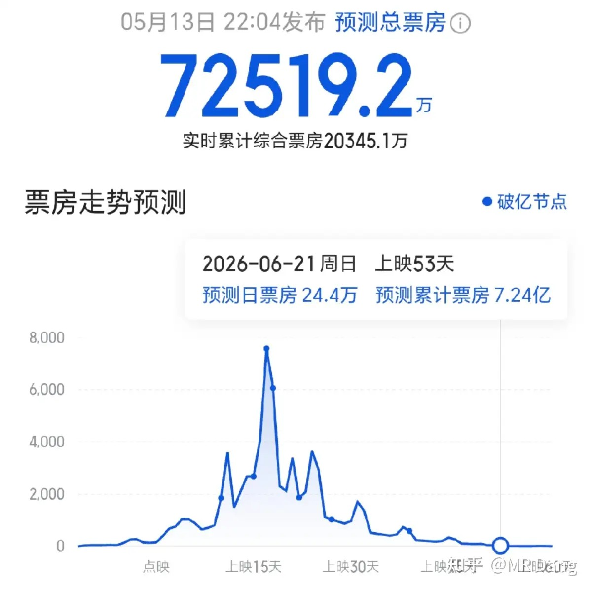

这是个小成本电影，宣发和演员阵容都很一般，所以肯定是有的赚了。

嗯，说到赚钱，有其他想法的可以自己问ai相关情况。

我个人对电影板块的互掏口袋已经没兴趣了，每年只固定在春节档前埋伏一次。

给昨天的早报打两个补丁：

第一个补丁是黄仁勋还是赶上末班机飞过来了，和懂王已经平稳落地。

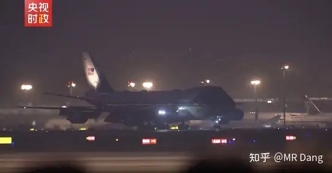

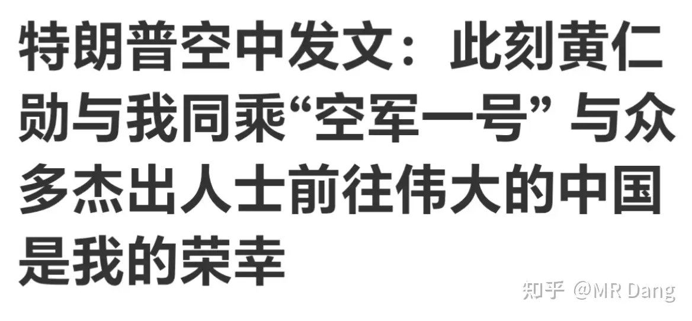

飞机加油的时候把他捎上了，懂王特地点了他的名字，意味深长啊。

马斯克说懂王自己乘坐的飞机上带的企业家一开始只有他自己，后来才加上了老黄。

昨天美股因为这个消息，特斯拉概念股涨的不错，FSD相关的也都是暴涨。

第二个补丁是韩国辟谣了分红的事情。

不是要拿企业利润分红，而是要用超额税收分红。

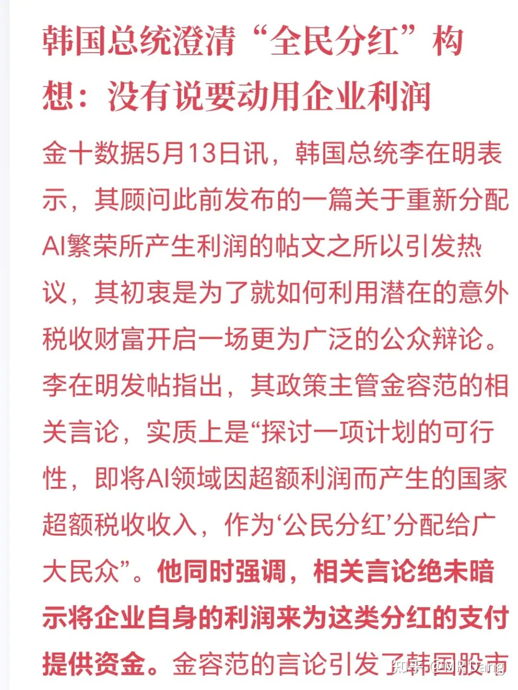

企鹅发布了财报：

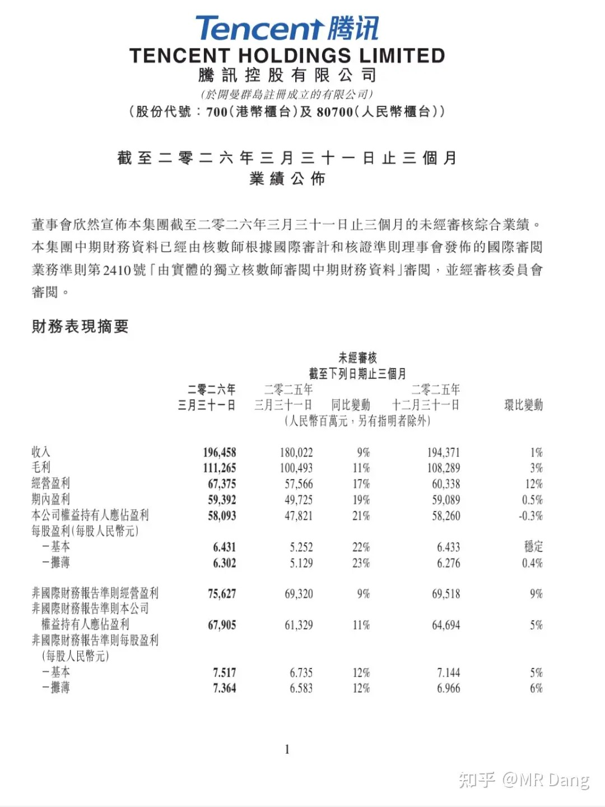

还不错，真的，没太大的毛病。

结构上的话，也就资本开支有点不及预期，意味着Ai时代可能就站不到领先集团了。

除此之外，游戏板块稍微差点事。

当然这是从挑刺的角度来说，整体很不错的一份财报，特别是配上拉胯的走势，就更有反差感啦。

量子消息：可编程量子计算原型机“九章四号”研发成功

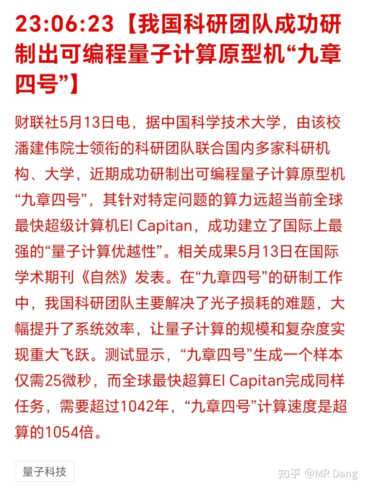

看到潘院士，就会让人想起某家量子企业。

“九章”和“祖冲之”都是源自潘院士团队的作品，一个偏学术，一个偏产业，技术路径不同。

“九章”系列并不在上市公司体系之内，它和上市公司的关系相当于同门师兄弟。

至于资本市场会不会借此炒作一些奇怪的预期，那就不好说了。

大宗商品：

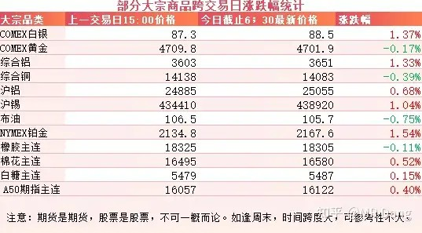

有色出现分化，白银和铂金，锡，铝表现较好，涨幅一个多点，伦铝在盘中创出最近四年来的新高。

黄金和铜小幅回调。

农产品表现不错，天胶价格再次站上一万八，逼近两万的企业景气周期分界线。

最近跟踪的这些农产品里，有两个品种相关的股票昨天都有点异动。

也不知道是巧合，还是市场正在交易厄尔尼诺的预期。

外围市场：

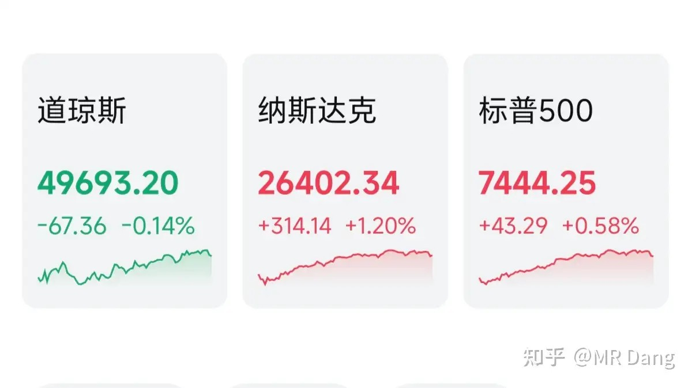

美三大股指涨跌不一，纳指领涨，道指回调。科技板块强势，存储不错，不过涨幅最大的还是FSD相关板块。

很多平时不关注科技行业的读者可能不知道什么是FSD。

这是特斯拉的智能驾驶系统，目前比国内的所有智驾系统都更强大，最接近它的可能是小鹏的VLA二代。

我经常用小鹏的VLA二代，不夸张的说，很好很强大。

之前因为政策审批原因，FSD在国内迟迟无法落地，这次马斯克和懂王一起飞过来，让这事开始变得有一些预期。

不过需要提醒的是，今天周四，明天周五，最早下周一就可能有确切消息传出，万一不及预期，风险还是挺大的。

这中间的交易窗口比较短，口袋掏起来难度有些大。

另外中概股久违大涨，阿里京东发布财报后携手并进，今天恒科的家人们要吃肉了。

昨天个人组合净值回血半个点，银行纳米绿，消费绿小半个，资源红小半个，算电红近四个。

最近一段时间全靠电网了，手头剩下的都是老登资产，天天挨打。

大A也是好起来了，科技都不用看美股脸色，自己都能支愣起来。

虽然没有，但是依然欣慰。

至于我的话，总算把自动扣费功能取消了，按照昨天的计划调整了一下比例，又恢复到了平衡状态。

多说一句某乎评论区的事，昨天上午不知道啥原因，发什么都会被吞，下午才冒出来一堆抢沙发的评论。

呃，平时送花花的时候人不多，怎么一看到沙发留言都这么积极。

再次重申不是关评论了，不要带节奏哈，这种情况时有发生。

一个喜欢保护韭菜的博主，希望大家少少踩坑，多多赚钱！！！

> [!comment]- 点击展开评论
>
> | 用户 | 时间 | 内容 |
> | :--- | :--- | :--- |
> | 狄仁杰 |  | 试试能不能评论 |
> | 干饭闪电狼 |  | 复活吧！我的心脏搭桥 |
> | &nbsp;&nbsp;&nbsp;&nbsp;joyboy |  | 坚持不住了 |
> | &nbsp;&nbsp;&nbsp;&nbsp;斯兮 |  | 搭的宏桥吗 |
> | 一个 |  | 烂银行还真是烂银行 |
> | Godyi |  | 铝累库还是没减少，铝水直供率还是这么低，铝板块又要向下震荡了 |
> | &nbsp;&nbsp;&nbsp;&nbsp;喝咖啡不放糖 |  | 减少了啊最新数据社会库存140万吨 |
> | &nbsp;&nbsp;&nbsp;&nbsp;输出 |  | 铝听他的就完了 一开始讲就跌 排练好的一样 跌了多少了都 |
> | &nbsp;&nbsp;&nbsp;&nbsp;joyboy |  | 减少了，只是减得有点少 |
> | &nbsp;&nbsp;&nbsp;&nbsp;wiseinfool |  | 跌成狗屎了哎 |
> | 成为六位数 |  | 28买的绿桥，今天22.7割肉了，备受折磨，结束 |
> | &nbsp;&nbsp;&nbsp;&nbsp;输出 |  | 早该卖的 还一直讲看好看好 主力资金不认 |
> | 热乎黏苞米 |  | 别人吃肉被吸血就算了，今天全挨打也得带上 |
> | 天天 |  | test |
> | 在人间 |  | 怎么没有评论区互动了？报个平安吧？ |
> | 无糖可乐加冰 |  | 急需心理按摩 |
> | 下夕烟 |  | 恒科咋了 |

---

*本文件从MR Dang知乎页面转载*

---

**作者**: MR Dang
**链接**: https://www.zhihu.com/question/2037848758654857950/answer/2038159976938607710
**来源**: 知乎

*著作权归作者所有。商业转载请联系作者获得授权，非商业转载请注明出处。*
