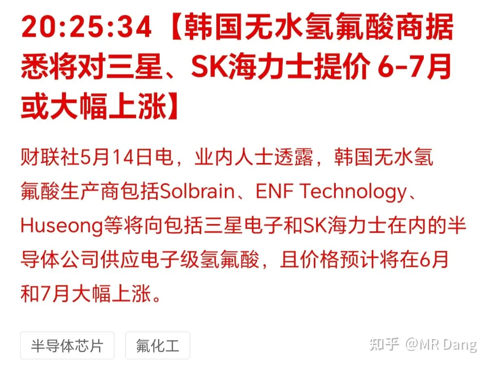
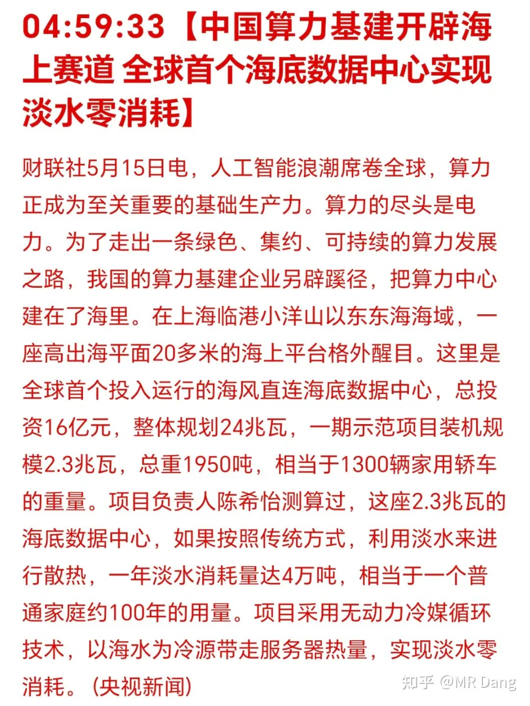
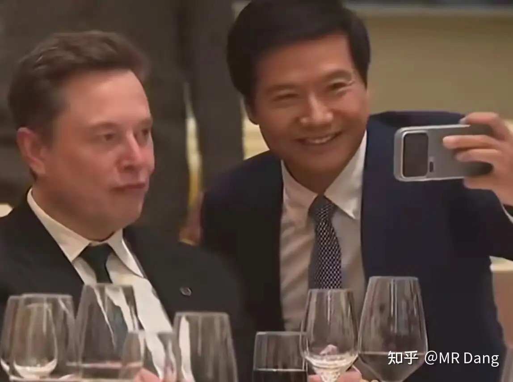
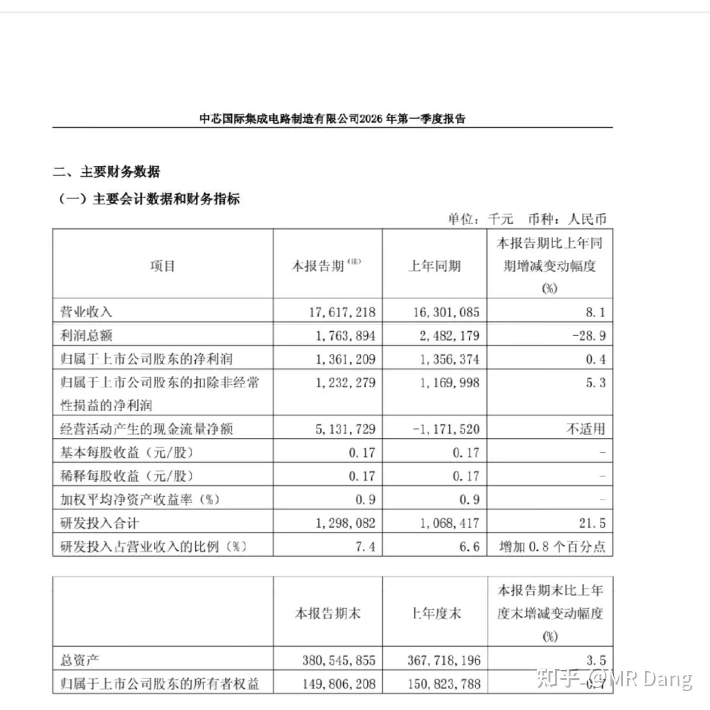
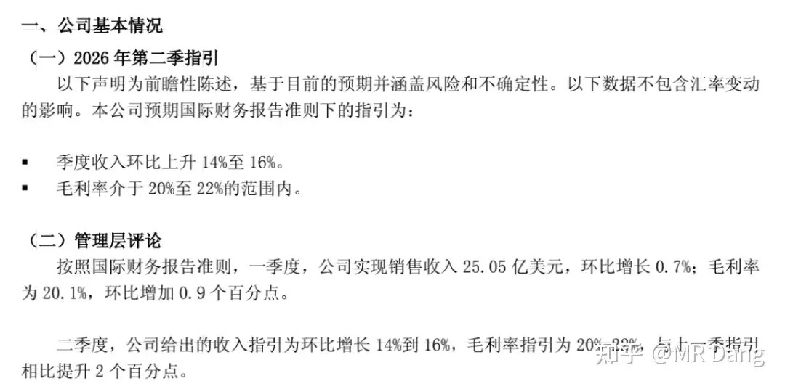
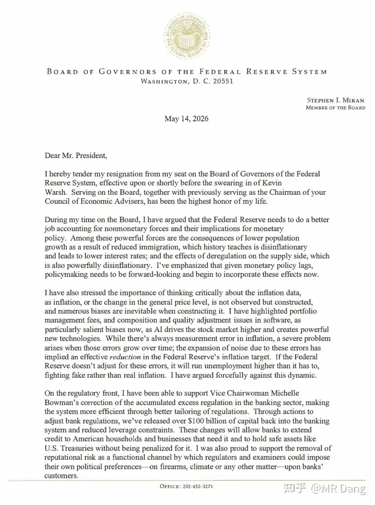
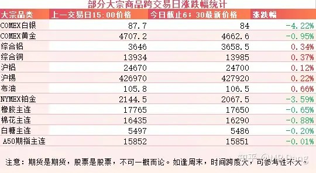
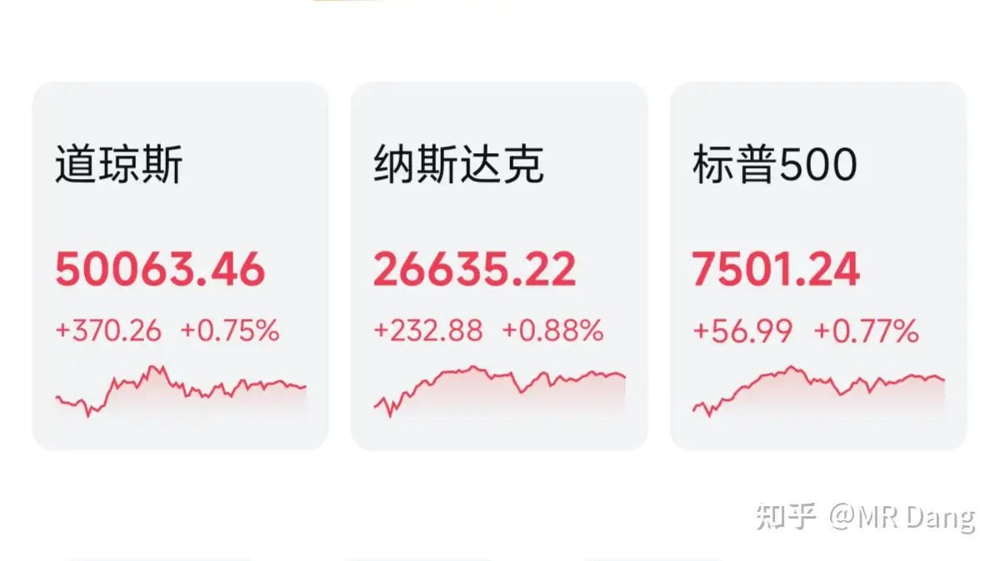

# 如何评价2026年5月15日A股行情？

---

**发布时间**: 2026-05-15 07:38  |  **原文链接**: https://www.zhihu.com/question/2038015454527140934/answer/2038523597044635062  |  **点赞数**: 515 人赞同

**作者信息**: MR Dang​​知势榜经济与管理领域影响力榜答主

---

## 正文内容

央行发布了4月的数据，正好明天圈内要写一份宏观数据解读的文章，拿来做例题了：

央行原文地址

第一段话讲的是社融，整体增长7.8%，一季度数据是7.9%，说明四月有所放缓。

实体发放贷款增速5.6%，一季度数据是5.8%，也说明四月实体经济贷款发放有所保守。

政府债券这块儿占比有所提升，一季度末是21.6%，提升到了21.7%。

从社融数据来说，相对中性偏保守一些。

第二段话讲社融增量，前四个月同期少8930亿，一季度数据是比同期少3545亿，说明四月份的社融增量增加的相对克制一些。

具体到结构上，对实体贷款同比少增1.29万亿，这个数据一季度是7960亿。

说明四月份实体经济还款意愿比较强烈。

第三段讲M2和M1，四月末的数据分别是8.6%和5%，剪刀差是3.6%。

而一季度的数据分别是8.5%和5.1%，剪刀差是3.4%。

剪刀差是一个很好的切入口，剪刀差越大越有利于资本市场的流动性。

第四段讲存款：

同比增加9%，一季度末这个数据是8.7%，大家更爱存钱了。

第五段讲贷款：

同比增长5.5%，一季度末这个数据是5.7%，大家不爱贷款了。

最需要关注的是住户中长期贷款，四月末这个数据增加了1199亿。

而一季度末是增加了4607亿，相对来说四月份这个数字应该是负的。

这是楼市的风向标，说明四月大家都在积极还房贷。

票据融资增加1429亿，一季度末是减少1.1万亿。

第六段话：

第六段话是告诉你市场的真实利率水平，大概就是1.3%左右，在往下走。

猪肉迎来利好：能繁母猪正常保有量下降到3750万头

这个是真的利好，限制供应端对稳定生猪价格还是挺有用的。

当然这个3750万头不是绝对的，按照3％的黄色区域阈值计算，3862.5万头以下都是绿色区域，3862.5万头到3975万头属于黄色区域。

目前大概就处于黄色区域，距离绿色区域还有大约100万头去化的空间。

电子级氢氟酸涨价：

国内和这个相关的也集中在氟化工领域，也有部分企业直接向韩国半导体企业供货。

海底算力：

算力的散热一直是个难题，所以目前有太空算力的解决构思，咱们国家更务实一点，建成了全球首个海底数据中心，已经开始正式运营。

有几家上市企业和这个消息有关系，问Ai即可。

不过要提醒大家的是，这不是什么新闻，因为建设的时候资本市场已经知道这个消息了，现在是正式运营，属于预期落地的阶段。

昨天一些细节在网上流出。

宴会用酒是长城和张裕。

滴酒不沾的懂王举杯庆贺，还做了一个相当得体的演讲，得体到熟悉他的人都感觉到满满的违和感。

和皮衣深度绑定的黄教主也穿着西服和擦的锃光瓦亮的皮鞋出现在宴会厅，我记得他去别的国家都是二郎腿一翘直接说事的。

马斯克带着儿子，非常松弛，很多国内的企业家都去找他合影，雷布斯也去了，贡献了又一张世界名画：

气氛十分到位，懂王的战歌YMCA都安排上了，不知道最后能不能谈出一些超预期的东西。

中芯国际发布了一季报：

很一般的数据，虽然估值给的很高，不过财务数据真不怎么样。

二季度给的指引数据比一季度数据要好。

所以也可以理解成未来预期更好，增长空间大。

美联储的米兰递交了辞呈：

这就是之前一直主张降息，投了几次反对票，特别渴望进步的那个哥们。

现在降息无望，进步空间也没了，打起了退堂鼓。

大宗商品：

有色整体分化严重，锚定降息预期的贵金属大幅回撤，白银和铂金回调三四个点，黄金一个点。

而锚定工业需求的工业金属比较强势，铝，铜，锡都有轻微上涨。

农产品也有部分回调。

外围市场：

美三大股指上涨，纳指领涨，英伟达又创新高，可能市场还是对这次的成果有一些期待。而前期热点板块表现一般，像存储之类的绿了不少。

中概股也是绿的。

昨天看到恒科也有点绷不住，高开三个点都能绿，家人们早晨还能吃到肉，下午就换成了面。

昨天个人组合净值回撤半个多点，银行纳米红，资源绿两个，消费纳米红，算电绿三个。

刚止住泄，又拉了一裤裆。

要不是某个氟化工表现还可以，绿的还要多一些。

美股不怕通胀，大A倒是敏感肌了。

我个人因为看好算电，所以给机会的时候没有彻底清仓，人的主观判断到底还是比不上原则。

可能也是有点侥幸心理，觉得科技这么强，自己手里一堆老登，好不容易拿些有科技含量的东西，得捂住了。

另外某乎最近应该是风声紧。

13号的帖子在我的视角看来还在，但是有读者反应不见了。

昨天的评论区也是管的比较严。

一个喜欢保护韭菜的博主，希望大家少少踩坑，多多赚钱！！！

> [!comment]- 点击展开评论
>
> | 用户 | 时间 | 内容 |
> | :--- | :--- | :--- |
> | 颗粒状 |  | 不能评论救了你 |
> | 到饭点了 |  | 冷知识：hq从高点至今回撤了36个点，相当于st股连续7个跌停板结合昨天的新库存数据，铝库不仅没去还增加了很多，下周继续抗压，这玩意儿现在的走势跟洲际 闻泰没啥区别了 |
> | &nbsp;&nbsp;&nbsp;&nbsp;乌鱼子酱 |  | 有区别  闻泰和洲际每天最多5个点 |
> | &nbsp;&nbsp;&nbsp;&nbsp;哭泣的菠萝 |  | 这哥两是眼睛一睁就亏钱绿桥心狠一点啥时候都能卖 |
> | &nbsp;&nbsp;&nbsp;&nbsp;乌鱼子酱 |  | 要是心狠，强行卖也能概率能卖出去。持仓体验其实挺不一样的，闻泰和洲际你基本上已经有预期了，它就是跌跌跌，心如止水，但绿桥就不一样了，那玩的可是一个心跳，让你猜猜猜 |
> | 静待昙花 |  | 一个绿桥就一堆人在这嘲讽，其他买对的也没见你说吧。关键是绿桥和电解铝很多人都看好，预算非常一致。结果他不争气。哎，还好我没买！ |
> | &nbsp;&nbsp;&nbsp;&nbsp;修行靠 |  | 其他的也有错的，就不提了。譬如刚开圈时候莫名其妙说了宠物。 |
> | &nbsp;&nbsp;&nbsp;&nbsp;Helios |  | 欧福蛋业，同力，都很差啊 |
> | 求道 |  | 别买大v荐股，往好了说越有名气越有影响力越被狙击，往坏了说遇到配合资本做局的大v更是十死无生 |
> | 朕非天也 |  | 我宏桥一路补仓，现在一共买了差不多五十万，亏了七万多，成本25左右，不过我不会怨D大，毕竟没有人能在股市永远赢，当初上车的逻辑没有错，我觉得就没问题。  然后尤其是人一多，感觉容易被狙击，我同时关注d大和奥特，俩人都推了南啤酒，散户太多了，我发现后面没人拉了....感觉被狙击了 |
> | &nbsp;&nbsp;&nbsp;&nbsp;王志嵩 |  | 还在铝里面吗？ |
> | &nbsp;&nbsp;&nbsp;&nbsp;不想丸辣 |  | 评论呢 |
> | 默然爱写作 |  | 我是特别崇拜当老的，我就问一下，那个宏桥控股现在还能加仓吗？现在已经亏25个点了，要加仓吗？ |
> | &nbsp;&nbsp;&nbsp;&nbsp;酸柠檬 |  | 当然要加了啊，你要相信你的崇拜！！！狠狠加！！！！梭哈！！！！ |
> | 胡汉三 |  | 还有活人吗？ |
> | 长坡厚雪 |  | 都放免责声明了，怎么你们还揪着不放 |
> | Darin |  | 今天的怎么还没出来 |

---

*本文件从MR Dang知乎页面转载*

---

**作者**: MR Dang
**链接**: https://www.zhihu.com/question/2038015454527140934/answer/2038523597044635062
**来源**: 知乎

*著作权归作者所有。商业转载请联系作者获得授权，非商业转载请注明出处。*
