# 怎么看待2026年5月19日A股行情？

---

**发布时间**: 2026-05-19 07:34  |  **原文链接**: https://www.zhihu.com/question/2039608659907433457/answer/2039972279577269850  |  **点赞数**: 452 人赞同

**作者信息**: MR Dang​​知势榜经济与管理领域影响力榜答主

---

## 正文内容

从统计数据说起：

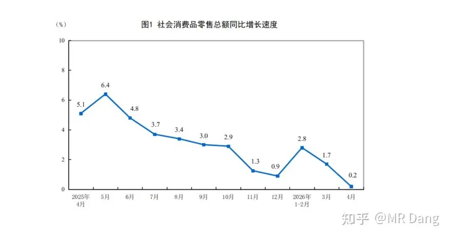

社零数据肉眼看着就有些一般，很一般，4月份是同比增长0.2%。

整个消费板块都承压，不管是必须消费还是可选消费。

从行业来看：

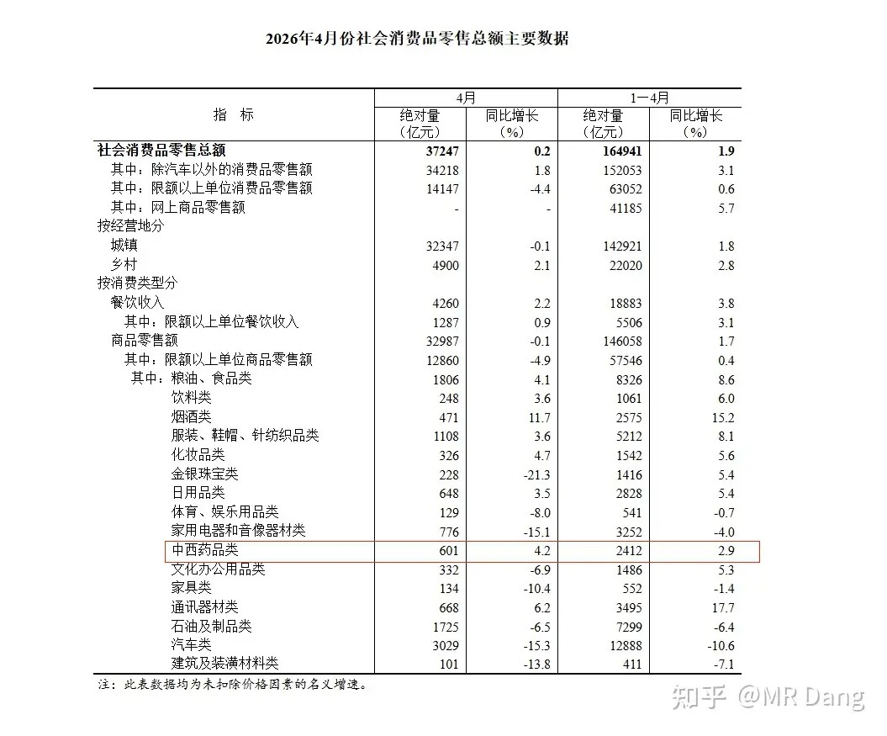

4月份单月数据比1-4月好的只有药品类。

4月同比增长4.2％，前4个月是2.9％

金银珠宝的数据比较差，前4月是同比增长5.4%，但是单4月是同比减少21.3%。

还有就是汽车类，内需不足，四月同比减少15.3％。

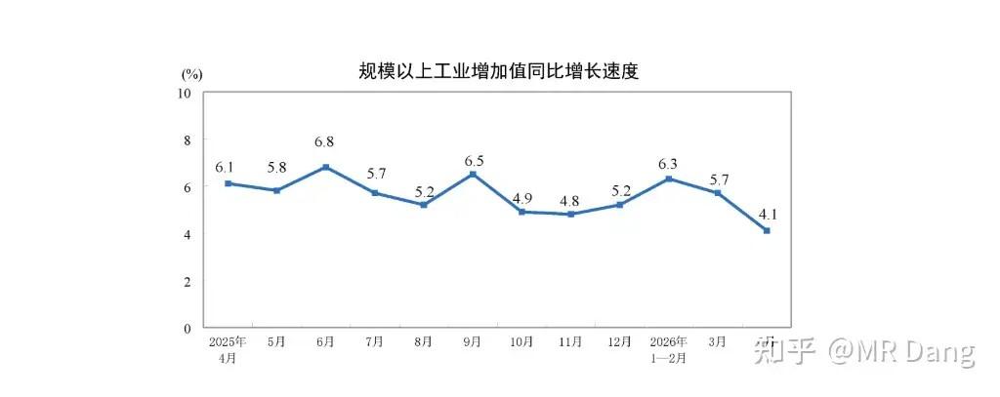

工业增加值是同比增加了4.1%，高增长态势有所回落。

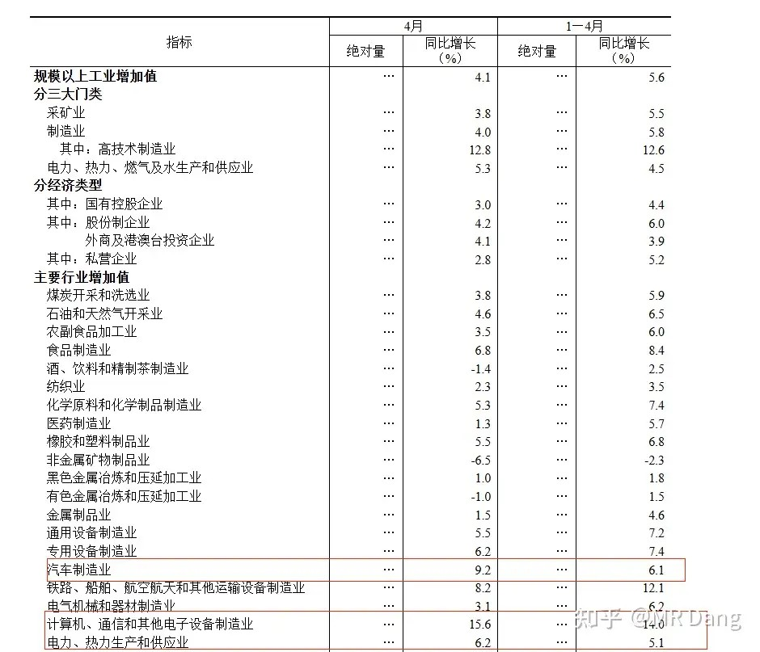

具体到行业上，单月数据好于前4个月的行业有汽车制造业，电子设备制造业和电热。

还有大家最关心的房子：

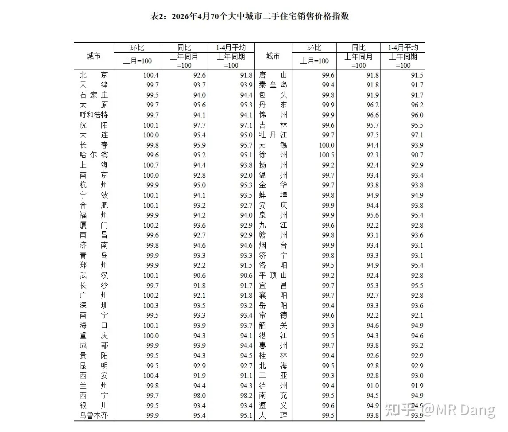

4月有16个城市环比破百，相当于止跌。

总共是70个城市，那就相当于表里23%的城市二手房价格止跌回暖。

上个月同口径下是17个城市。

有关房子的宏观数据，也是相对来说数据出入比较多的。

一方面，各种消息和报道，近期二手房的成交比较活跃，个别城市火爆。

另一方面，根据央行的统计数据，居民的长期贷款数据是减少的。

这么奇怪的数据，是非常反直觉的。

逐日工程：

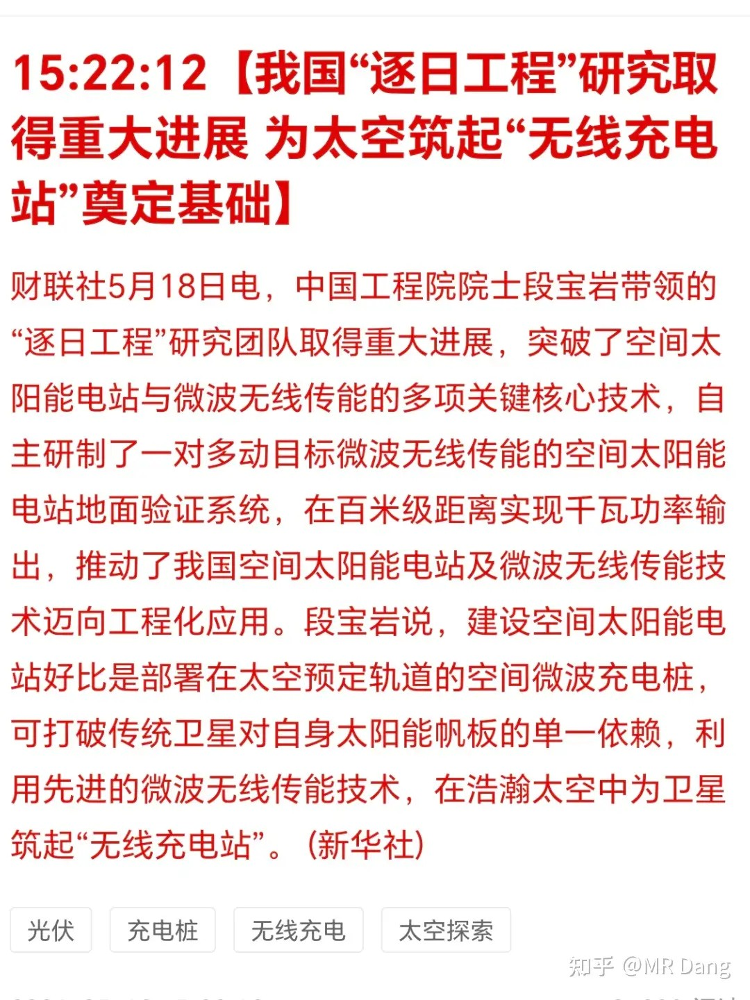

看到这个新闻的时候，我立马想到了游戏《戴森球计划》里的场景，查了一下相关资料。

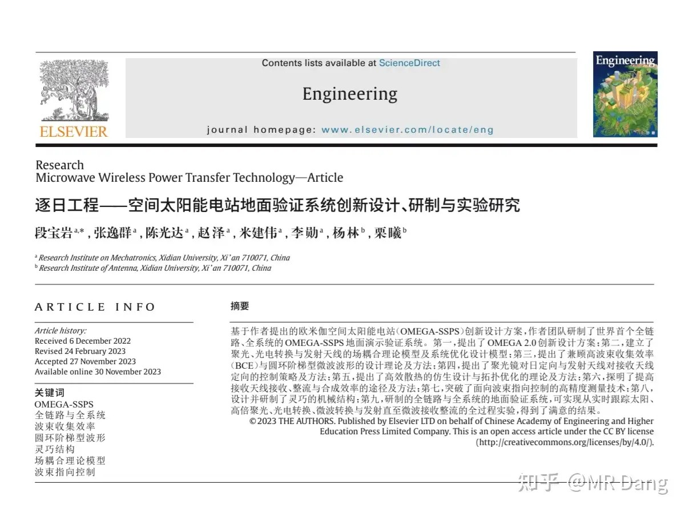

2022年6月已经有了突破，当时是55米距离，2081W的微波传输，直流-直流总效率15.05％。

这次是百米级1180W的微波传输，总效率20.8％。

接下来在2028还有发射计划，验证400公里太空到地面的微波电力传输。

看的我直接起了一身鸡皮疙瘩，像看科幻小说一样。

相关产业链的话，光伏，太阳能电池，地面接收设施，还有本次取得突破的微波无限传能器件。

我个人是觉得从百米级一下到400公里级，难度一下要升高好几个level。

这玩意儿要是能商用，简直就是人类福音，太空上获取太阳能，然后微波传输到地面，感觉一下子能源自由了。

美伊局势：

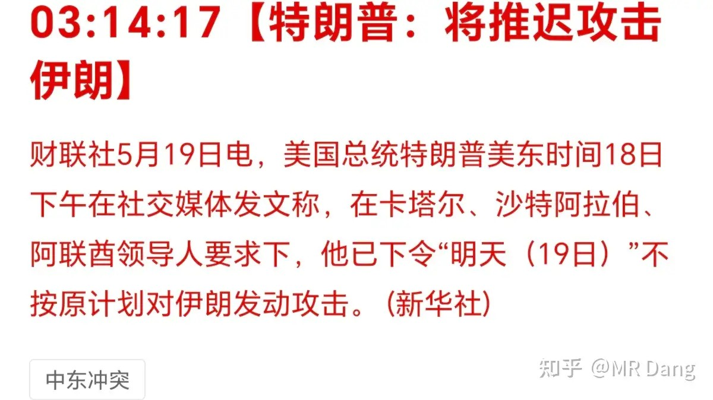

现在伊朗过一段时间就把协议涂涂改改，然后拿给懂王看，每次协议的要价都比较高，懂王看了直摇头。

钢铁业新动向：

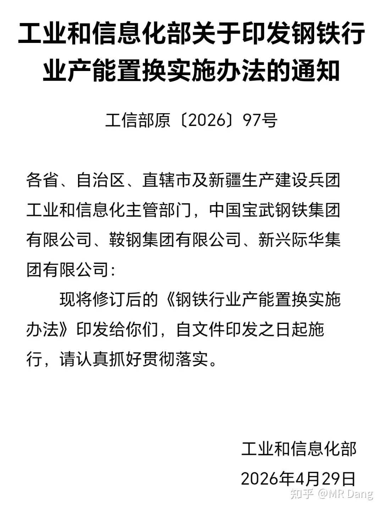

这个政策成文时间是4月29日，但是昨天才下发，所以对大多数人来说是新政策。

其中第十条比较超预期：

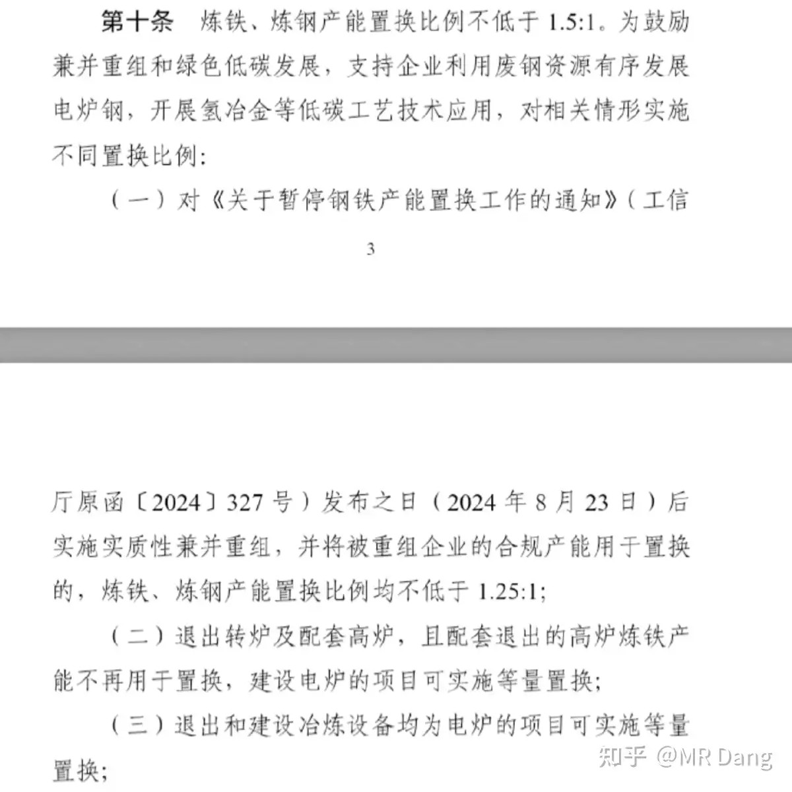

两组数据，一个是普通置换，置换比例1.5：1。

啥意思呢，比如你退出了1.5万吨的产能，最多可以再新建1万吨产能，相当于就少了0.5万吨的产能。

以前旧版的方案，这个数字是1.25：1。

另一个是先进工艺的置换比例是1.25：1，之前旧版的方案，这个数字是1：1。

也就是说，按照最新的方案，只要你发生产能置换，就一定会减少产能，哪怕你是先进的工艺。

那就有投资者问了，我干的好好的，为什么要产能置换呢？不置换不就行了？

这个还真不行，现在很多产能都是落后的不达标的，必须置换，而只要置换，就会变少。

所以钢铁业马上就要走出“产能越置换越多”的怪圈了。

以后钢铁业的发展格局逐渐会向电解铝看齐。

这种政策一般都是利好头部企业。

这里还有个细节是之前的跨企业产能置换是没有任何约束的，新规设定了两年的过渡期。

过渡期内，指标是可以自由买卖的，而过了这个期间，指标无法自由流动，只能通过重组获得。

所以接下来的两年，可能会有更多的小企业选择退出，把指标售卖给头部企业，头部企业的市占比会进一步提升。

至于钢铁价格，很难判断，因为房地产不景气，以后的格局是供需双减，属于比较难的题目，这种供需同向变动的行业我个人是比较谨慎的，只参与供需反向变动的简单题。

某头部券商发布了重组进展公告：

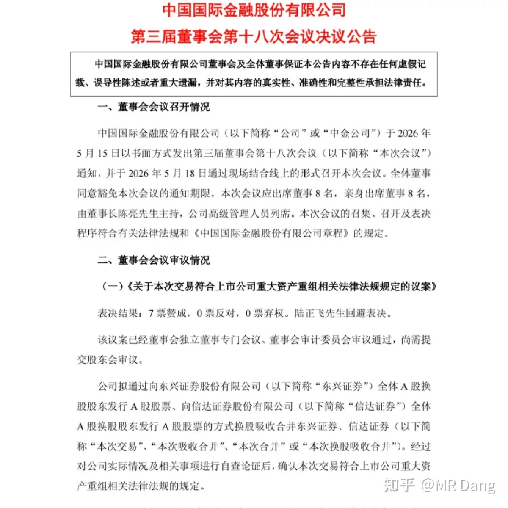

一般重组进展需要开两次董事会+一次股东会，这是第二次董事会了，下次股东会可能在6月初进行投票。

然后就是向上面申请，等待3到6个月以后正式获得批准，整个流程走下来大概到今年底左右了。

大宗商品：

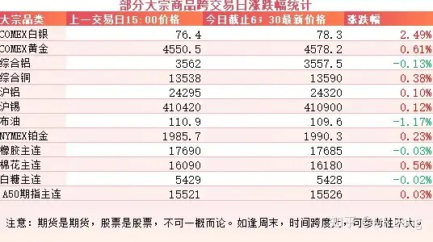

大宗商品除了白银和原油，波动幅度都不大，算是正常随机波动。

外围市场：

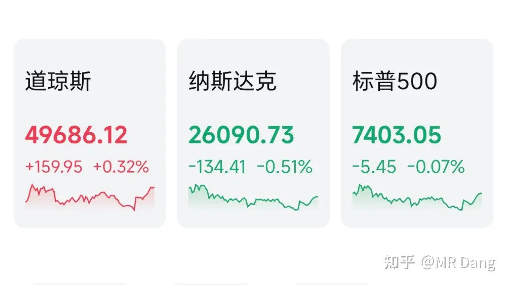

美三大股指涨跌不一，道指上涨，纳指回调。

前期大热的存储板块等科技热门概念回调。

美长债收益率持续上升，短债收益率下降，市场持续押注周末在圈内说的熊陡交易。

space x上市在即，商业航天表现不错。

美银行板块走强。

昨天个人组合净值微微绿，和大盘半斤八两。银行原地不动，消费绿两个，算电红两个半，资源绿一个半。

最近都这样，习惯了，这已经算不错的光景了。

现在市场的风格就是做空碳基生物，做多硅基生物。

手里没有硅基生物，所以挨打就是常态了。

上一轮炒消费的时候，我手里也没白酒，一睁眼一闭眼钱就不见了。

结果白酒还了几年债，到现在都没完。

一个喜欢保护韭菜的博主，希望大家少少踩坑，多多赚钱！！！

> [!comment]- 点击展开评论
>
> | 用户 | 时间 | 内容 |
> | :--- | :--- | :--- |
> | 知乎用户 | 23 小时前 | 绿桥没完没了是吧 |
> | 钱包鼓鼓 |  | 每日打卡第52天4月社零同比增长仅0.2%，消费板块全面承压，金银珠宝单月暴跌21.3%，汽车跌15.3%钢铁产能置换新规大幅收紧，置换比例从1.25:1提高到1.5:1，小企业可能加速退出利好头部企业百米级太空微波传电效率20.8%很炸裂，相关产业链光伏、太阳能电池、微波无限传能器件可关注但离商用还远目前市场风格是做空碳基生物做多硅基生物，手里没有科技/AI股只能挨打，跟当年踏空白酒那轮行情一个道理已有的事后必再有，已行的事后必再行 |
> | 弈人张 |  | 想不到能在这看到“逐日工程”，当时学校里搭了一个挺高的架子，好像就是为了这个工程 |
> | &nbsp;&nbsp;&nbsp;&nbsp;两江的雨季 | 21 小时前 | 也可能是哪个领导吃回扣 |
> | &nbsp;&nbsp;&nbsp;&nbsp;Crunch | 19 小时前 | 是的, 就是这个, 在食堂对面 |
> | 心之所向 | 23 小时前 | 所以绿桥大家都跑路了是吗 |
> | &nbsp;&nbsp;&nbsp;&nbsp;尼尔雅童 | 22 小时前 | 我还在，就扔着 |
> | &nbsp;&nbsp;&nbsp;&nbsp;尚飞 | 10 小时前 | 回本跑了 |
> | 穿越荒州的主角 | 20 小时前 | 嘿嘿嘿，紫金亏40%了，银行也到7了 |
> | 喔喔喔 | 23 小时前 | GGGF怎么办，股神 |
> | &nbsp;&nbsp;&nbsp;&nbsp;卡恩 | 23 小时前 | 他之前说的越跌股息越高他越高兴 |
> | &nbsp;&nbsp;&nbsp;&nbsp;九月笙 | 22 小时前 | 我割了，我成本高，14.5，最后在12.6左右断断续续割完，亏了有5000多，割完真的心情都愉悦多了 |
> | &nbsp;&nbsp;&nbsp;&nbsp;风起于青萍之末 | 11 小时前 | gggf我还在坚持拿着，-15%了。。。就等25号分红看看效果了 |
> | 韭菜成长记 |  | 昨天的重发呀 |
> | 若星汉天空 |  | 我的断头桥还能回本吗？ |
> | XXxX |  | 快了，快到全仓进银行的时候了 |
> | &nbsp;&nbsp;&nbsp;&nbsp;一燕成夏 |  | 请指点指点 |
> | &nbsp;&nbsp;&nbsp;&nbsp;达拉崩吧 | 23 小时前 | 今天就银行红 |
> | &nbsp;&nbsp;&nbsp;&nbsp;拉不拉猪 | 22 小时前 | 可以进了，我今天已经吃上了 |
> | 杏林 | 22 小时前 | 每天打卡，来问gggf 。还能拿么？ |
> | &nbsp;&nbsp;&nbsp;&nbsp;到饭点了 | 22 小时前 | 能拿十年就拿，拿不了就割 |

---

*本文件从MR Dang知乎页面转载*

---

**作者**: MR Dang
**链接**: https://www.zhihu.com/question/2039608659907433457/answer/2039972279577269850
**来源**: 知乎

*著作权归作者所有。商业转载请联系作者获得授权，非商业转载请注明出处。*
