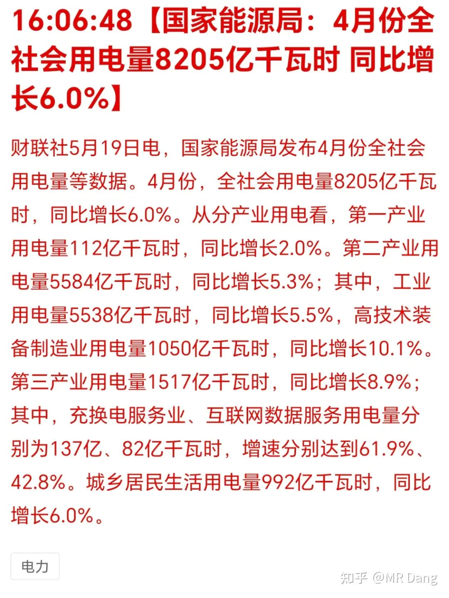
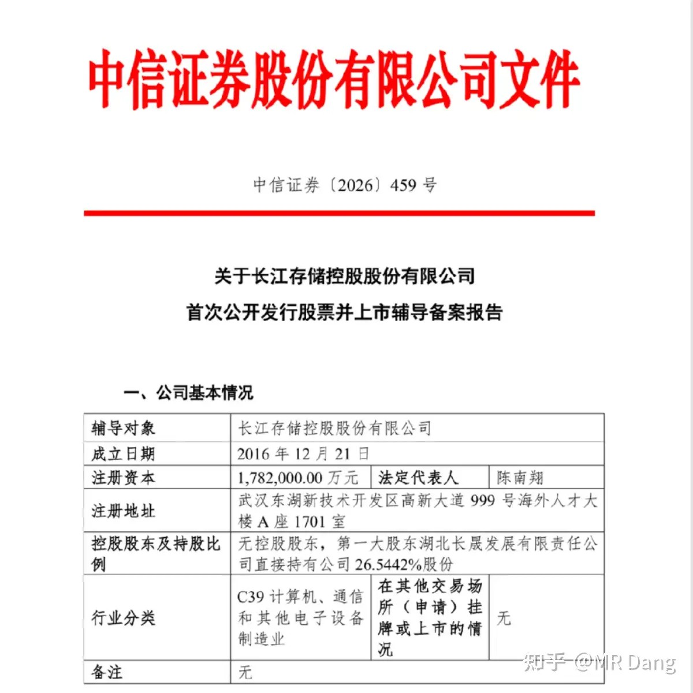
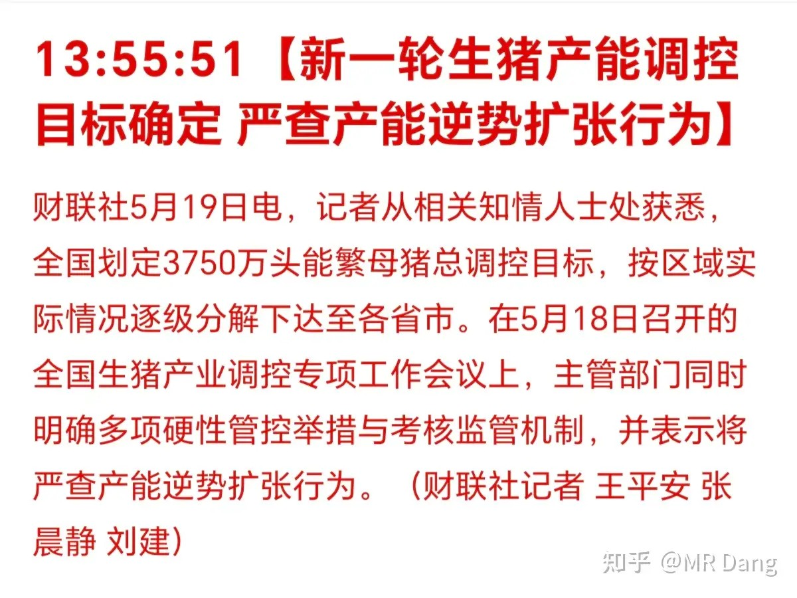
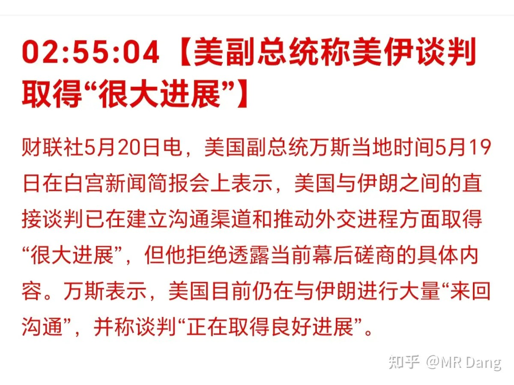
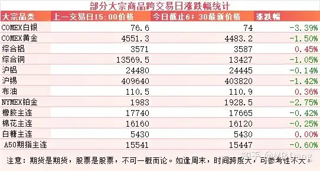
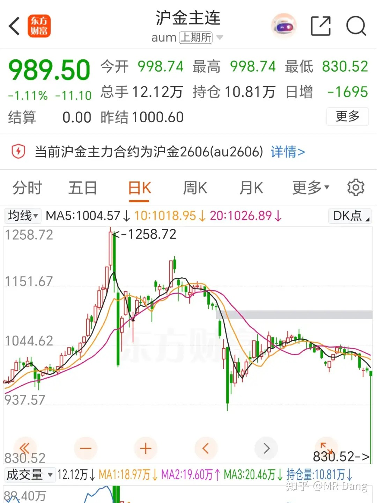
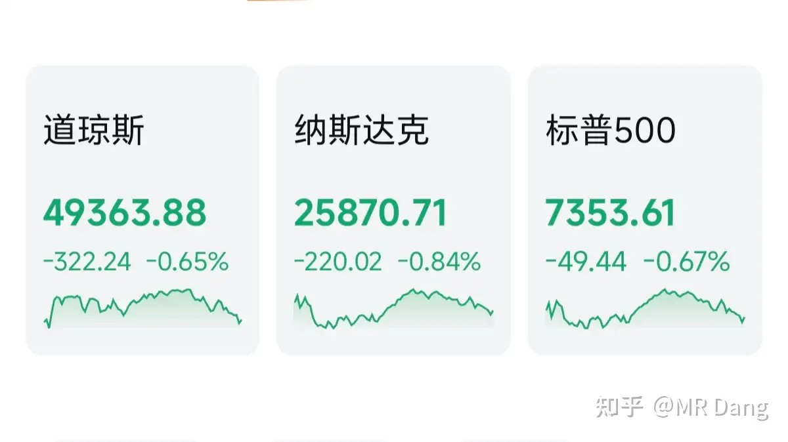
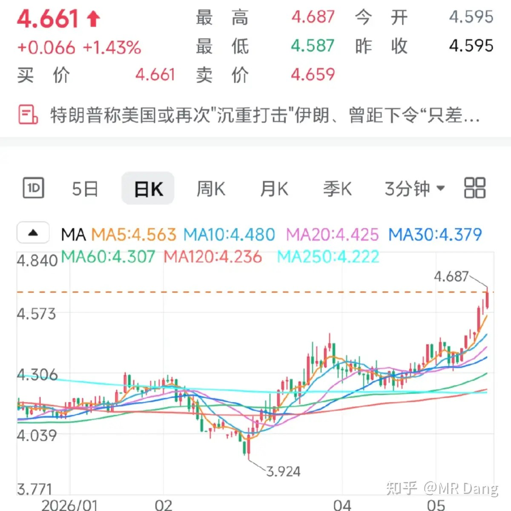
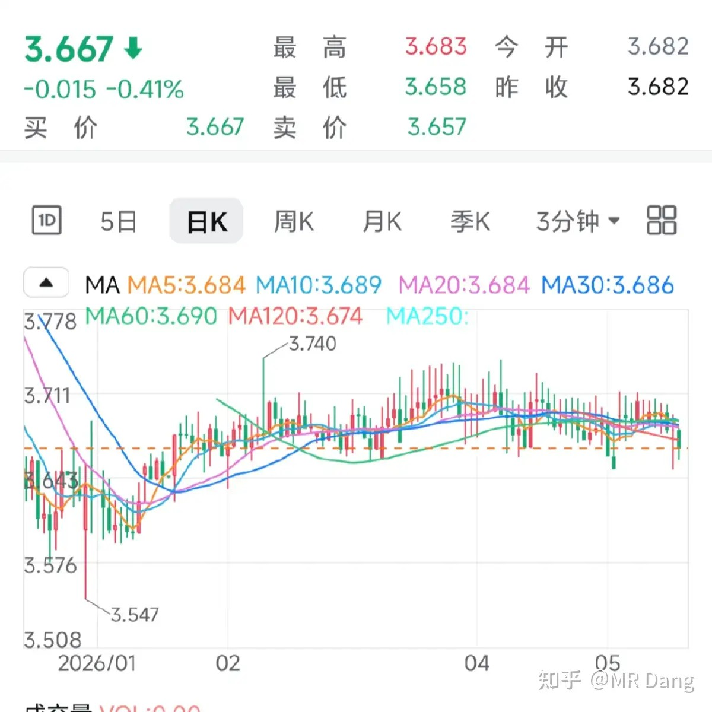

# 如何看待2026年5月20日A股行情？

---

**发布时间**: 2026-05-20 07:26  |  **原文链接**: https://www.zhihu.com/question/2038702714171962165/answer/2040332534114940506  |  **点赞数**: 243 人赞同

**作者信息**: MR Dang​​知势榜经济与管理领域影响力榜答主

---

## 正文内容

最近电比较火，从发电数据说起：

同比增长6%，比三月的7.3%回落一些。

基本上和工业增加值等数据的趋势吻合的。

看结构的话，充换电增速61.9%，数据很不错。

这个赛道有充电桩运营，超充桩设备等细分赛道，预期都挺好的。

另外就是以算力为代表的互联网数据服务方向，增速42.8%，也是比较景气的。

总量摆在这里了，这两个方向增速高也就意味着其他传统行业的增速比较一般。

又来一个巨无霸：

今年很多巨无霸科技企业上市，长江可能上市以后就是大几千亿甚至接近万亿级的，时间可能是今年底或者明年上半年。

这两个上来对市场的接纳能力也是一种考验，如果碰到牛市还好，碰到熊市的话，对其他股票的流动性就会造成一些影响。

头部的保荐券商持有很多战略配售股份，如果涨的好，账面浮盈也会挺多的。

所以我个人觉得头部券商是一个另类间接受益的方向。

生猪行业：

这个是之前就说过的新闻，3750万头是整体调控目标。

在这里不讨论这个新闻本身，而是想讨论一个很普遍的问题，大家觉得是农业的产能容易控制，还是工业的产能容易控制？

有没有投资者仔细思考过这个问题。

答案是非常肯定的，工业产能比农业产能容易控制得多。

因为工业需要大量集中的电，需要大量集中的地，需要大量集中的人，每个环节都需要审批核准监测。

而农业不是，农业更分散，需要的客观物质基础不需要审批即可取得，所以对产量的统计误差更大，控制起来也更难。

现在养猪散户已经少很多了，但是依然有1300万户以上，对应的存栏能繁母猪大约660万头。

每户大概半头左右，很大一部分散户已经不参与能繁母猪的养育了，只参与育肥环节。

这么大的一个群体，别说控制能繁母猪的总量了，就是统计猪的数量都是一个很大的工程。

美伊局势：

万斯称谈判取得“很大进展”。

北边邻居已经抵达。

大宗商品：

受美长债收益率走高的影响，有色整体回调，仅伦铝较为强势。

农产品表现也比较一般。

A50期指走弱，今日大盘可能承压。

昨晚的沪金合约出现了离奇一幕：

盘中出现了一个乌龙指事件，直接把金价打到地板价830了，波动太过于刺激。

这种走势在币圈容易看到，在黄金期货市场上非常罕见。

外围市场：

美三大股指回调，纳指领跌，存储板块走强，医药股走强，其他板块回调比较多。

美10年国债收益率：

美国10债收益率持续攀升，已经突破4.6%了。

收益率上升意味着投资者正在抛售债券，所以需要更高的收益率才能吸引投资者购买，类似于股价跌了，股息率就提升了。

而三月期美债收益：

短债收益率有点下行的意思在里面。

这是非常典型的熊陡交易，在美联储发出明确的信号前，这种交易逻辑很可能持续相当长一段时间，对有色的影响比较大，特别是贵金属。

昨天个人组合净值回血大半个点，银行大半个点，资源原地不动，消费微红，算电近三个。

手里没什么太热门的东西，算是躺平，等着下个月的分红了。

一个喜欢保护韭菜的博主，希望大家少少踩坑，多多赚钱！！！

> [!comment]- 点击展开评论
>
> | 用户 | 时间 | 内容 |
> | :--- | :--- | :--- |
> | 你曾拥有英雄的梦想 | 2 小时前 | 历史不会重复 但却惊人的相似 有色走下坡 但不影响需求在那 静待花开就好了 |
> | &nbsp;&nbsp;&nbsp;&nbsp;阿伟阿 | 1 小时前 | 开子的花开吗 |
> | &nbsp;&nbsp;&nbsp;&nbsp;卓不凡 | 58 分钟前 | 开子的花盆都翻了 |
> | 钱包鼓鼓 | 2 小时前 | 每日打卡第53天充换电增速61.9%和算力数据服务增速42.8%，这两个高增速方向在吃肉，意味着传统行业增速比较一般长江存储万亿级上市对流动性是考验，但头部券商拿战略配售股是间接受益，想布局的可以逢低拿着农业产能比工业难控，1300万散户在那，能繁母猪连统计清楚都费劲，猪周期反转别急着押美长债收益率突破4.6%，短债走低，典型的熊陡交易沪金出现乌龙指打到830，在黄金期货市场极为罕见 |
> | 对世界充满好奇心 | 2 小时前 | 抱着紫金的我，瑟瑟发抖 |
> | &nbsp;&nbsp;&nbsp;&nbsp;落渊 | 2 小时前 | 紫金好股，老哥你要继续拿吗 |
> | 搋膪 | 1 小时前 | dang大讲的一些原理和思考过程还是比较可取的，当每日早报看。 |
> | 石头的成长印记 | 2 小时前 | 铝加工订单暴涨，库存告急，铝板块要走一波吗 |
> | &nbsp;&nbsp;&nbsp;&nbsp;若星汉天空 | 1 小时前 | 走的是加工板块，库存低的也是加工板块，而铝板块去化库存又很慢，说明什么？说明下游不愿意采购 |
> | &nbsp;&nbsp;&nbsp;&nbsp;捕猹狂魔 | 1 小时前 | 铝加工和电解铝不一回事，谨防今天高开低走，高开就是可以解套的一个机会 |
> | &nbsp;&nbsp;&nbsp;&nbsp;逆天唯我 | 1 小时前 | 还能解套吗 |
> | &nbsp;&nbsp;&nbsp;&nbsp;捕猹狂魔 | 1 小时前 | 今天应该能高开，算是个解套的机会 |
> | qiner | 1 小时前 | 啤酒呢。。。负十多个点了 |
> | 知乎用户1SrzmpQD | 45 分钟前 | 宏桥先跑掉了，后续等19再回归 |
> | &nbsp;&nbsp;&nbsp;&nbsp;陈九条 | 45 分钟前 | D哥高强度冲浪吗 |
> | 长虹 | 53 分钟前 | D哥早 |
> | 亚索 | 1 小时前 | 黄金这样会被强平吗 |
> | &nbsp;&nbsp;&nbsp;&nbsp;MR Dang | 46 分钟前 | 可能会有倒霉蛋 |

---

*本文件从MR Dang知乎页面转载*

---

**作者**: MR Dang
**链接**: https://www.zhihu.com/question/2038702714171962165/answer/2040332534114940506
**来源**: 知乎

*著作权归作者所有。商业转载请联系作者获得授权，非商业转载请注明出处。*
