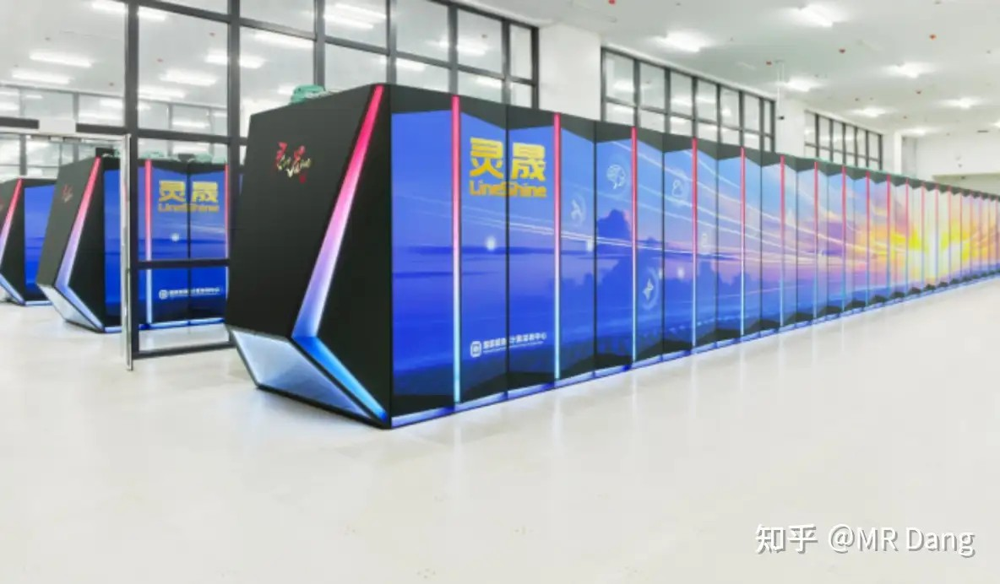
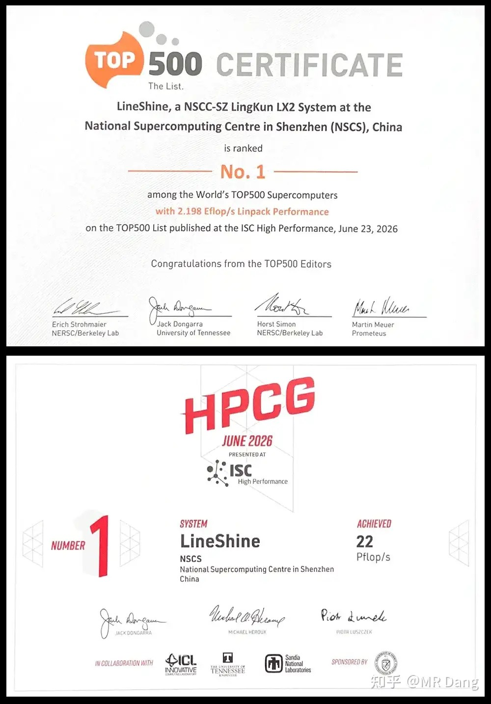
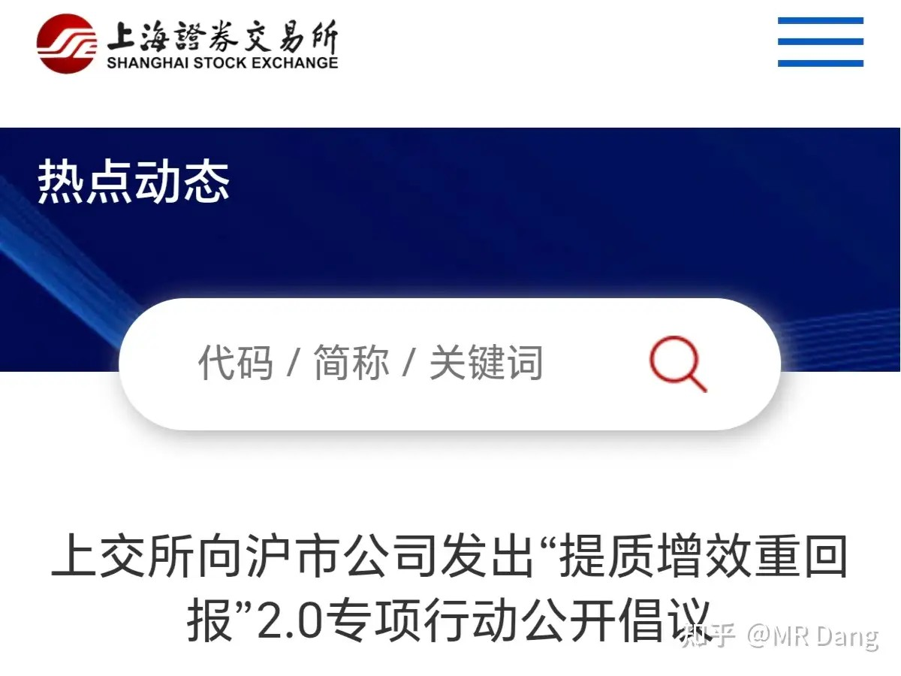
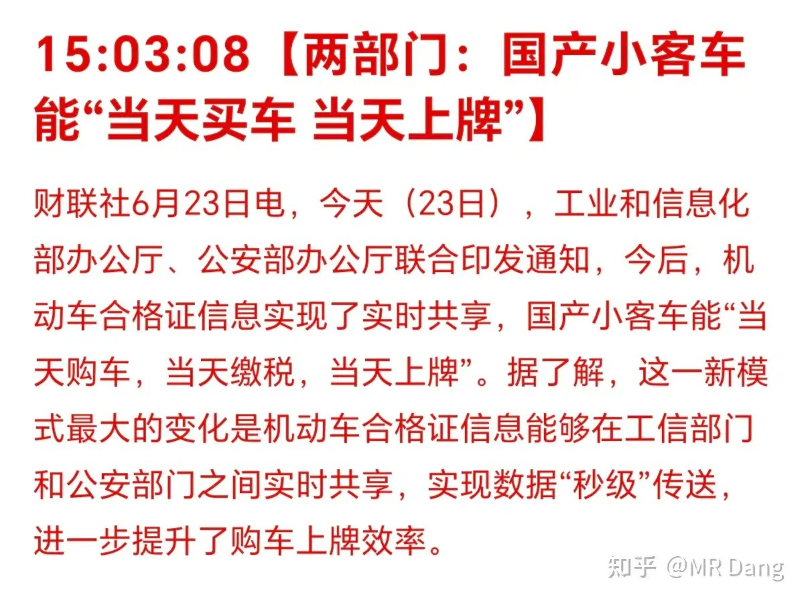
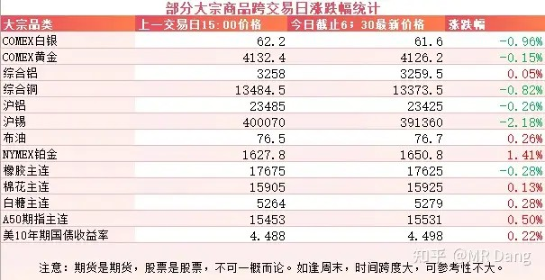
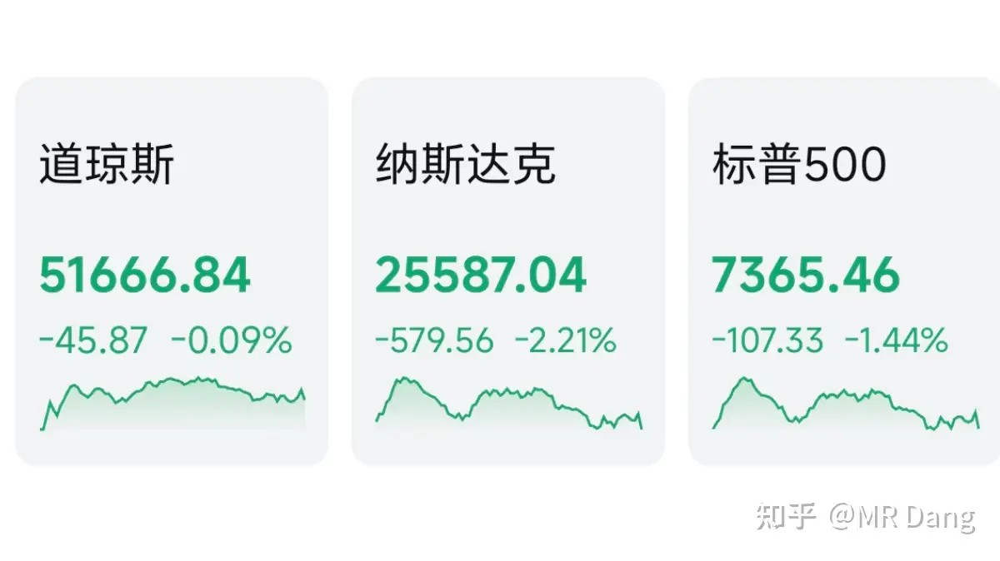
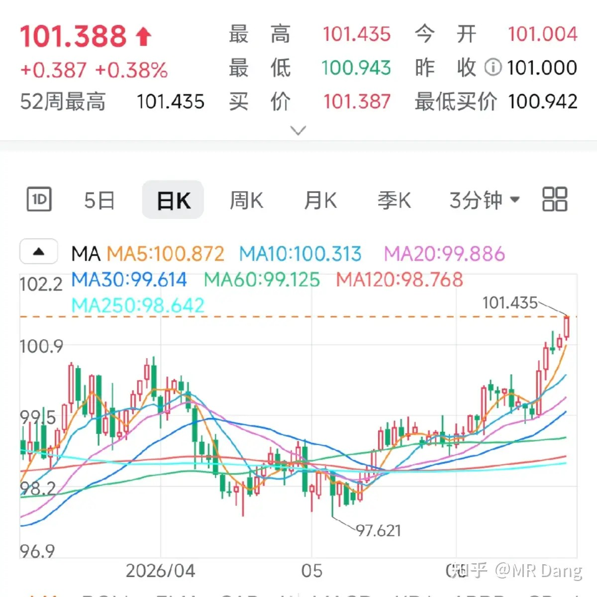

# 如何看待 2026 年 6月 24日 A 股行情走势？

---

**发布时间**: 2026-06-24 07:32  |  **原文链接**: https://www.zhihu.com/question/2052714727051212713/answer/2053017558584923183  |  **点赞数**: 185 人赞同

**作者信息**: MR Dang | 独立投资人，《价值投资功法》作者，小红圈同名，无其他小号。

---

## 正文内容

国产超算登顶权威排行榜：

这次登顶的灵晟系列是全国产的，背后有一系列华为系供应链的影子。

当然目前没有官宣是华为旗下的，只是通过供应链推测的，其中也有部分是上市公司。

首次采用了100%全液冷的计算机柜。

现在科技股普遍回调，所以可能算不上什么特大利好。

国产超算截至目前一共登顶过四次，前三次分别是天河一号，天河二号，太湖之光。

这三个名字不知道能不能勾起个别读者的回忆。

这次登顶距离上次已经过了9年。

上交所发出“提质增效重回报”2.0倡议：

作为一个夹头，我比较看重的是和分红相关的表述。

和1.0版本的专项行动相比，这次2.0版本增加了分红的及时性相关表述，鼓励企业增加分红频率，不但要分的多，还要分的快。

这真的是好事，如果更多的企业响应号召，那价值投资的获得感会大大增强，反过来推动高分红企业的估值水平。

像有些银行股息率有6%以上，如果变成季度分红，相当于每个季度1.5%，拿银行股一个季度相当于在银行存一年的利息，体验好的多。

这不是朝三暮四故事里的猴子，这是实实在在的获得感。

汽车业：

有报道称以后买车可以当天购车当天上牌，简化流程。

出发点挺好的，但是对汽车的销量可能影响有限，现在潜在的买车人群差的不是那一天的时间，差的是买车的票子。

大宗商品：

隔夜商品价格变化不明显，有色里锡回调比较多，跌破40万关口。

A50期指较昨天收盘时有所好转，恐慌情绪消散了一些。

农产品变化不大。

外围市场：

美三大股指集体回调，纳指领跌，前期大热的科技板块，比如存储大幅回调。

传统行业医药，保险，消费等表现不错。

昨天个人组合净值回撤半个点，银行红一个半，资源绿6个，消费绿1个，电网绿3个。

还好吧，已经挨打成习惯，这种疼痛不算什么，指数也没少跌，算是小亏当赢了。

比较惨的是资源类，绿油油一片。

如果重仓这个板块的话，体验就很差了，一天KTV，一天ICU的，大起大落。

多家投行下调了黄金的目标价，有下调到4300的，还有下调到4900的，进一步打击了有色板块。

下调到哪里不重要，下调这个动作本身会对市场信心造成影响。

市场正在逐步提前计价美元加息，美银声称要加三次息，一共75个基点。

根据现有数据分析，市场目前已经消化并且提前定价了大概40个基点的加息。

马上要公布的PCE数据就显得比较重要。

美元指数也连续走强，已经涨破了101，市场似乎已经觉得哪怕现在海峡就放开，还是需要加息来压通胀。

至于我个人的看法，依然不认为今年年内会加息，目前的美债是两头堵，加息虽然会压低通胀，但是利息怎么还是个大问题。

昨天的市场风格较以往也有比较大的变化，微盘股表现好于权重股，这说明抱团有瓦解的趋势，前期表现比较差的医药和消费板块都开始回暖。

至于这到底是回光返照还是市场风格开始切换，还需要再看一段时间，不好贸然下结论的。

比较难受的可能就是刚割了老登追科技的，没赶上趟。

择时真的太难了，我唯一的择时就是不看好六月的行情，提前超配了一些银行，目前看来，没啥超额收益，但是也没吃亏。

一个喜欢保护韭菜的博主，希望大家少少踩坑，多多赚钱！！！

> [!comment]- 点击展开评论
>
> | 用户 | 时间 | 内容 |
> | :--- | :--- | :--- |
> | 知乎用户齐 |  | 没有任何不好的意思，单纯想问主板宏桥按照他pe估值，股价应该对应几块 |
> | &nbsp;&nbsp;&nbsp;&nbsp;大鱼 |  | 为什么每天都要问宏桥 |
> | &nbsp;&nbsp;&nbsp;&nbsp;加州旅馆 |  | 亏多了呗 |
> | &nbsp;&nbsp;&nbsp;&nbsp;今晚回家吃饭 |  | 简单算下，一年2块每股收益，10到15倍，20到30。利空就是散户多，另外限额生产也有一些企业超额生产，最后是通缩…… |
> | &nbsp;&nbsp;&nbsp;&nbsp;一世相依 |  | 你别哪壶不开提哪壶 |
> | 北上大人 |  | 铝怎么办 不是说保护韭菜吗 |
> | xiaowaner |  | 银行股如果按季度分红，可真是太香啦。如果有哪家银行跟进，烦请广而告之 |
> | 热乎黏苞米 |  | 还是科技，就算分着买总有一个给你超额回报，当天买下午就红，绿了翻红，红了扩大，回撤非常少，我当时说服我自己就是，别跟账户较劲，几个月的阴跌都扛住了，几乎没让我亏过的科技为什么不拿着 |
> | &nbsp;&nbsp;&nbsp;&nbsp;xiaowaner |  | 是牛市的感觉 |
> | &nbsp;&nbsp;&nbsp;&nbsp;whyR2930 |  | 是啊 真的不应该头铁 拿着铝 憋得脑袋都绿了 |
> | &nbsp;&nbsp;&nbsp;&nbsp;热乎黏苞米 |  | 我倒是没在铝挨打，我是在铜和锡被抽蒙了 |
> | Mr loo |  | 一天KTV，一天ICU的，大起大落。 |
> | 开心的张同学 |  | 市场短期是一台投票机，长期是一台称重机。不要追逐选票的去向，要关注重量在哪里积累。找到那些能持续创造价值的事物，用合理的价格买入，然后保持耐心，把剩下的一切交给时间。稳，从来不是不波动，而是扛得住波动。 |
> | Wojtek |  | 今天明显cpo比较强，灵晟这个相关票有啥啊，长电科技？ |
> | &nbsp;&nbsp;&nbsp;&nbsp;知北游 |  | 长电是搞先进封装的，关联性不是那么大。 |

---

*本文件从MR Dang知乎页面转载*

---

**作者**: MR Dang
**链接**: https://www.zhihu.com/question/2052714727051212713/answer/2053017558584923183
**来源**: 知乎

*著作权归作者所有。商业转载请联系作者获得授权，非商业转载请注明出处。*
