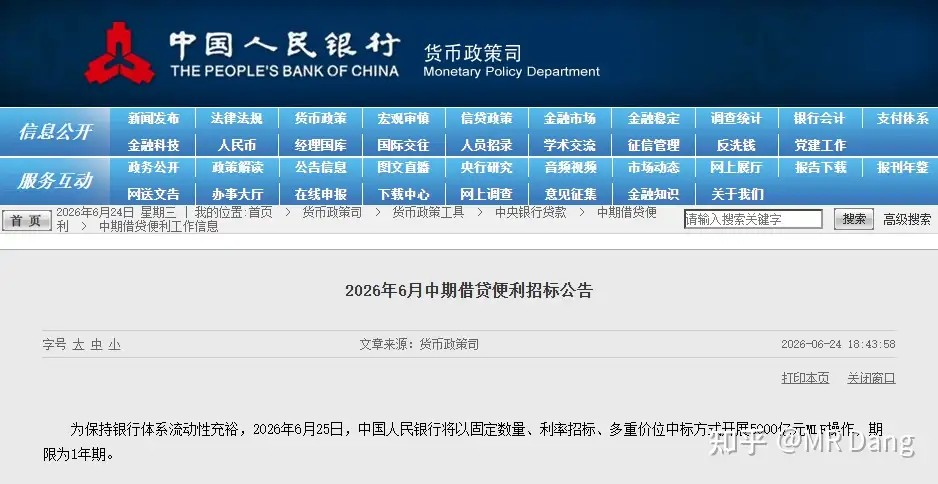
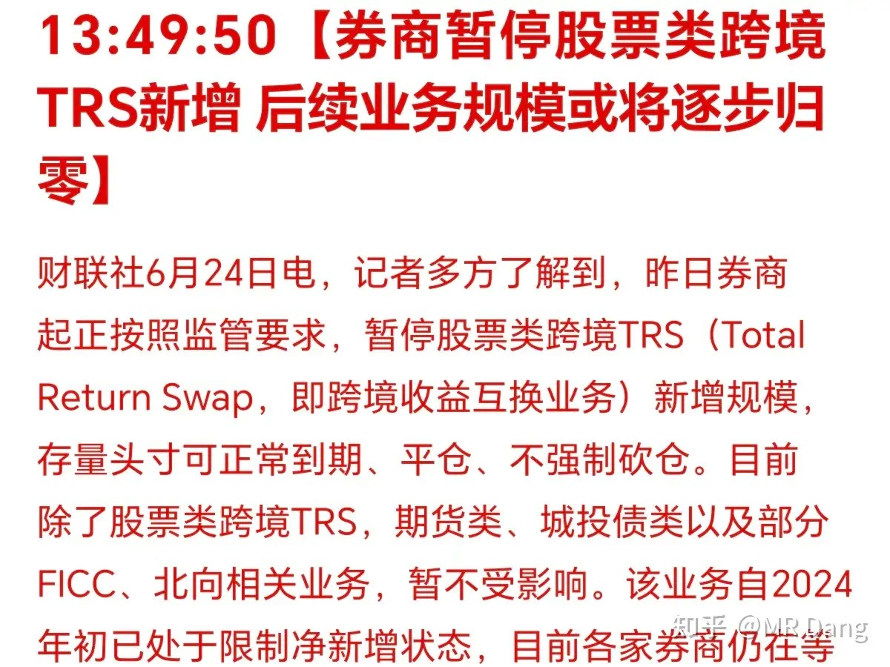
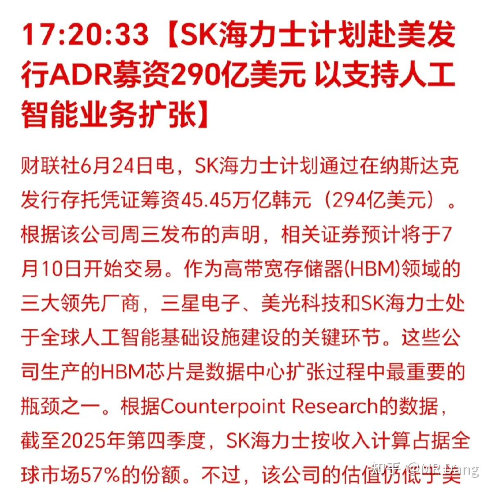
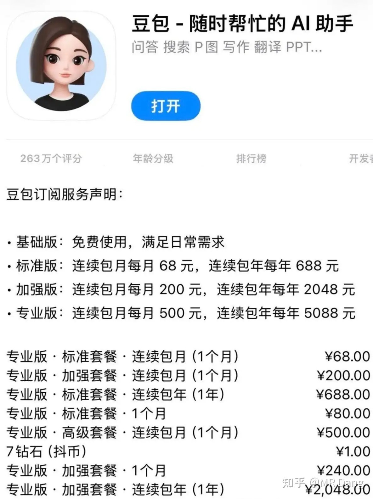
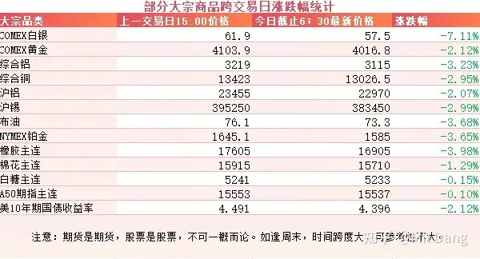
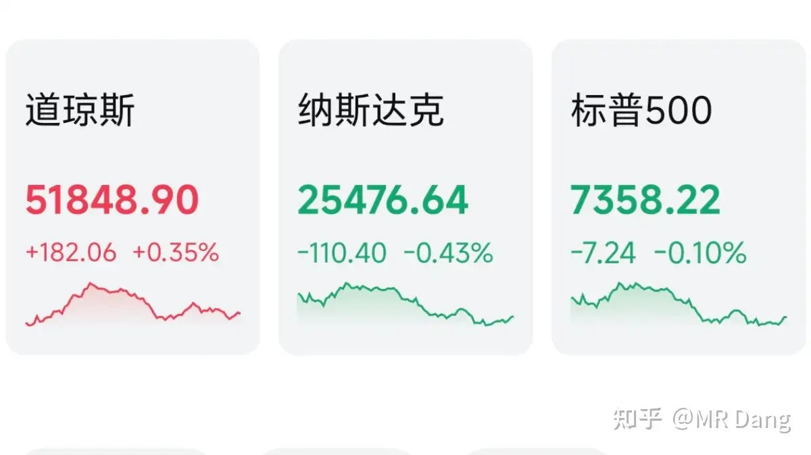

# 如何评价2026年6月25日A股市场行情？

---

**发布时间**: 2026-06-25 07:31  |  **原文链接**: https://www.zhihu.com/question/2052771188741496848/answer/2053379792293175406  |  **点赞数**: 356 人赞同

**作者信息**: MR Dang | 独立投资人，《价值投资功法》作者，小红圈同名，无其他小号。

---

## 正文内容

头条给到央行吧:

投放5000亿麻辣粉，六月到期是3000亿，相当于净投放2000亿流动性，对资本市场是好事。

股票类跨境TRS暂停：

所谓的TRS，就是收益互换。

比如我在境内看好某个美股，但是鉴于我是个五星好公民，没有境外渠道，我就和外面的机构定个合同，我每年给他固定的利息，他替我买美股，最后把差价一结算就行了。

这样也算曲线方案。

这是境内投资美股少有的合规途径，市场存量两三千亿左右，个人无法参与，一般都是私募的专属渠道。

这个业务暂停以后，相当于存量到期就不能续作了，按照1.5%通道费计算，整个券商行业可能会减少三四十亿的收入，属于轻微伤，以情绪影响为主。

对市场来说，更公平了，投资者保护面积进一步增加，不但要保护中小投资者，还要保护高净值人群不被境外金融市场收割。

海力士在美发ADR：

海力士是这轮科技牛的全球领头羊之一，本身估值低，业绩增速又高，给员工待遇好，这回又在美股融资294亿美元，属于是赢麻了，一家企业扛着一个国家往前走。

豆包正式推出付费版：

有68/月的，有200/月的，还有500/月的。

免费版不受影响，可以继续使用。

豆包其实使用体验还好，有点蠢萌蠢萌的感觉，生活常识类回答还算满意。

但是用来做投资决策就不太行，数据幻觉太严重了，会在关键数据上进行编撰，真的就硬编，很不严谨。

现在有很多Ai可以提高扒数据的效率，但是我还是坚持数据自己扒，投资这么重要的事情，我只相信自己。

大宗商品：

隔夜大宗商品全绿，有色整体回调两三个点左右。

白银盘后跌了7个点，跌破60关口，黄金一度跌破4000美元大关，沪铝也收在了23000下方。

原油跌破75关口，农产品也暴跌，橡胶直接跌破17000关口。

美债收益率跌到4.4以下。

非常明显的提前计价加息的信号，资金从商品类撤退，正在大举买入美债。

外围市场：

美三大股指涨跌不一，道指领涨，科技板块回调，传统板块表现较好。

美光盘后发布了财报，大大超过市场预期，股价应声而起。

昨天个人组合净值回撤一个半，银行绿两个半多，资源红一个半，电网打平，消费绿一个半。

最近银行板块感觉波动还蛮大的，每天上下波动都有两三个点。

而资源类也分化了，有些能在科技浪潮里发挥余热的资源一直很强势，另外的只能趴在地上一动不动，而可怜的消费又滚回了下水道。

又是熟悉的科技吸血老剧本，前天还说抱团有松动，只过了一天又抱到一起去了，1400多家上涨，另外四千多家待涨，市场中位数跌了足足两个点。

抽空的时候还瞄了一眼港股，港股也反弹了，稀罕。

港股趋势太强太强，涨的时候没有顶，跌的时候没有底，吃人不吐骨头。

但凡在港股吃过亏的，提到港股都是心有余悸。

我没恒科，但是有个别港股，每隔一两个星期看一次，差点认不出来。

每一次看的价格距离上一次差别都很大，如果不看前面的代码，根本不敢相信是同一只股，就是这么离谱。

昨天金融圈内有一件事情挺热的，著名投资基金宁泉发表了一封给客户的致歉信，里面有四段我深表赞同，分享给大家：

*中国的AI泡沫基本上围绕着AI基建这个主题，我们严重低估了这个主题能形成这么大的泡沫，因为相关制造业公司的商业模式大多非常一般，长期护城河几乎没有，同时需要不断的资本开支来维持增长。仅仅是一轮巨大的需求带来的景气，就能炒到这么高的估值、这么大的市值，我们确实没算过来。15年牛市的时候，有个词叫“无脑买入”，现在大约又是这种状态了。*

*每个行业都有景气的时候，有时因为政策、地缘冲突、自然灾害等原因，甚至会出现严重的供不应求，企业利润率飙升，供给迟早都会跟上来，尤其是暴利驱动下的供给增长速度往往会超乎预期。新能源行业前几年，一会儿光伏玻璃严重短缺，一会儿硅料涨到30万/吨以上，碳酸锂一度涨到60万/吨以上，相关企业都是暴利状态，光伏企业也曾经不断披露未来几年上百亿的采购大单，给市场留下景气期很长的印象，这些事情几年前我们才经历过，之后的教训依然历历在目。当然，每次都会有人强调这次不一样了，每次肯定也会有一些不一样，只是周期的韵律一直都在，人性的基本规律也从未改变。*

*这一次的泡沫是全球性质的。以巴菲特指数，也就是股票市值/GDP这个比值来说，互联网泡沫顶峰时这个比值达到了180多，而目前美国是240多，韩国、日本也差不多在200。所以这一次的泡沫基本上跟上世纪之交的美国互联网泡沫一样，已经属于超大型泡沫了；韩国股市目前的全民疯狂，我们也曾经历过。*

***A股大量的热门股票，未来极有可能跌掉八成乃至九成以上，我们不敢再参与了。因为我们没有能力火中取栗、还有把握毫发无伤地出来，冒这种风险是对持有人的不负责任。现在量化资金在市场上占比越来越大，加上互联网形成的信息传递非常快速，未来崩塌的时候会是什么样的形式、多快的速度，其实很难预料。以目前的泡沫程度和这种疯狂的分化演绎，我们担心崩溃的时点不会很远了，而且股价崩溃并不需要等到需求增长放缓或是供给大量涌现，仅仅因为股价过度透支就足以引发崩溃。***

**以上是宁泉基金致歉信里的内容，以下是我的一些想法：**

很多我的读者都被科技行情吸引，也有读者建议我多说科技，科技既挣钱，又有流量，大家都想看，何乐而不为呢？

死守老登的意义在哪里？

我个人是看好科技的，但是实话实说国内的科技企业挣钱能力和国外差距还挺大。

**创业板和科创板所有两千多家企业去年一年挣的钱加一起不到3200亿**，而美光刚发布的财报，一家公司一个季度赚了接近2000亿的净利润，美韩日这么能打的公司足足有三四家。

国外的科技企业上涨是业绩推动的戴维斯双击，而咱们的好多科技公司也跟着涨，完全没有业绩支撑，就硬提估值。

面对这样的市场，我也没有可以火中取栗并且全身而退的本领，如果这个时候冲科技，可能客观上也许短期内会取得一些收益，但是我主观上接受不了其中所蕴含的风险，这和我的价值观严重不符。

一个喜欢保护韭菜的博主，希望大家少少踩坑，多多赚钱！！！

> [!comment]- 点击展开评论
>
> | 用户 | 时间 | 内容 |
> | :--- | :--- | :--- |
> | 颗粒状 |  | 宏桥又要暴跌？ |
> | &nbsp;&nbsp;&nbsp;&nbsp;英格兰长弓手 |  | 不跌我们怎么买？跌了补不就完了。 |
> | &nbsp;&nbsp;&nbsp;&nbsp;颗粒状 |  | 那得无限子弹 |
> | &nbsp;&nbsp;&nbsp;&nbsp;英格兰长弓手 |  | 补的太频繁，这才腰斩。 |
> | &nbsp;&nbsp;&nbsp;&nbsp;大鱼 |  | 为什么天天都要提宏桥？已经道过歉了呀 |
> | &nbsp;&nbsp;&nbsp;&nbsp;知乎用户AYBDYgbY |  | 收了一千w吹票道个歉就完事了？ |
> | 顾晓诺 |  | 这是致歉信？引用的这几段里哪一个字表达了致歉的意思 |
> | &nbsp;&nbsp;&nbsp;&nbsp;健忘 |  | 是要Ai给道歉 |
> | &nbsp;&nbsp;&nbsp;&nbsp;阿曾呀 |  | 这种内容一般都很多吧，想看致歉的内容可以看全文吧，不至于全文都致歉撒 |
> | &nbsp;&nbsp;&nbsp;&nbsp;我可是正经人 |  | 总不能每段话前面都给你加对不起三个字吧 |
> | 提交 |  | 坦率讲，不管是分析师还是D佬，对科技持续保持这种看法我觉得有些偏颇，互联网也是在巨大的泡沫后走出来的，区别在于谁能走出来。泥沙俱下不代表没有真金！另外加一句，个人认为，绿桥的拐点要来了。不喜勿喷！ |
> | 杨幸福 |  | 等我们的业绩出来再说吧。我是相当看好咱们的中报，整天说别人有护城河，咱们都是代工，咱们的半导体追了10年，已经相当不错了 |
> | 我总是在奔波 |  | 金属人都自刎归天了吧 |
> | &nbsp;&nbsp;&nbsp;&nbsp;浮云长长长消 |  | 不知道啥时候止跌，有点心动了 |
> | 匡檀君 |  | 宏桥已经腰斩了，如何？ |
> | momo |  | 佬，昨天中国银行被罚款的事情，会影响今天的银行走势吗 |
> | &nbsp;&nbsp;&nbsp;&nbsp;星辰大海 |  | 预计不会，因为这个阶段很多央国企都补缴税，和行业是没有太大关系，本质上还是国家层面的工作。即便下杀，也是日内或者几天内的情绪行为。 |
> | 安安 |  | 港股etf已亏百分之四十的冒个泡 |
> | &nbsp;&nbsp;&nbsp;&nbsp;落渊 |  | 我50点 |
> | &nbsp;&nbsp;&nbsp;&nbsp;石多多 |  | +1 |
> | 京都月下 |  | dang大算是回应了关于科技的内容，我个人是不太认可。核心有以下几点：1，AI作为第四次工业革命的根基，已经没有什么争议了。我也是在5月份有数学家用ChatGPT攻克未解的数学难题后，决定梭哈科技股，而非别的。逻辑是这样的：当AI有了创造力，那么围绕AI的一切资本开支，一切资本泡沫都不是障碍，而是在AI大幅度提升生产力的必要亏损。2，我承认兴许在科技股我涨了1倍-2倍，最后崩盘的时候，可能回调20%-30%，但至少我仍然是正的收益。但如果在眼下的时刻，就提前否定科技，恐惧AI泡沫，我想说一句，你连进都没进去，怎么知道AI是不是真的改变了世界？真的能够大幅度提升生产力？从而促进生产关系的改变？ |
> | &nbsp;&nbsp;&nbsp;&nbsp;zscYHF |  | 人无法为自己认知以外的内容买单的，你理解科技这玩意觉得有未来就买入。跟当年区块链一样，你不能说巴菲特错过比特币几十万倍的涨幅就说他垃圾一个道理。 |
> | &nbsp;&nbsp;&nbsp;&nbsp;Benson |  | btc对普通人来说没任何作用，ai这块普通人体验感很好，至少繁琐的文字工作基本上都能完成，简单代码也能完成 |
> | &nbsp;&nbsp;&nbsp;&nbsp;孤独的灵魂 |  | 巴菲特的那一套价值投资无法运用到科技板块方向。很典型的案例就是，孙正义当年投资阿里巴巴，如果按照巴菲特的那套估值投资来做，阿里巴巴是不值得买入的，因为都是亏钱。但是后来阿里巴巴成了中国的龙头公司，甚至是世界的龙头公司 |
> | &nbsp;&nbsp;&nbsp;&nbsp;京都月下 |  | 你说的对，所以我说的是我的观点。如同dang大和我观点不一致，我并不会去谩骂和嘲讽，而是表达观点-表达支撑观点的论据。 人是无法为自己认知以外的内容买单，这句话没错，但人作为独立的个体，更不应该盲从，要学会独立思考，学会判断。而不是在未经论证就轻言否定 |
> | MR.duang |  | 你好 |

---

*本文件从MR Dang知乎页面转载*

---

**作者**: MR Dang
**链接**: https://www.zhihu.com/question/2052771188741496848/answer/2053379792293175406
**来源**: 知乎

*著作权归作者所有。商业转载请联系作者获得授权，非商业转载请注明出处。*
