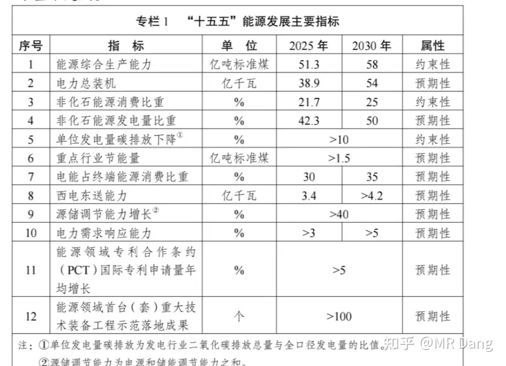
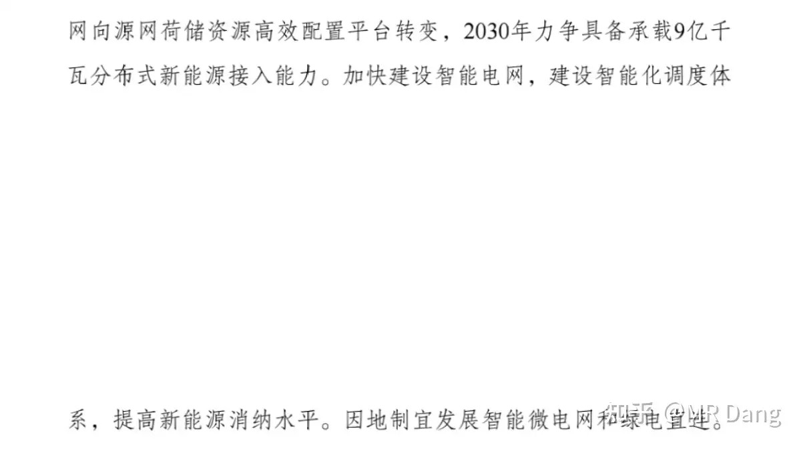
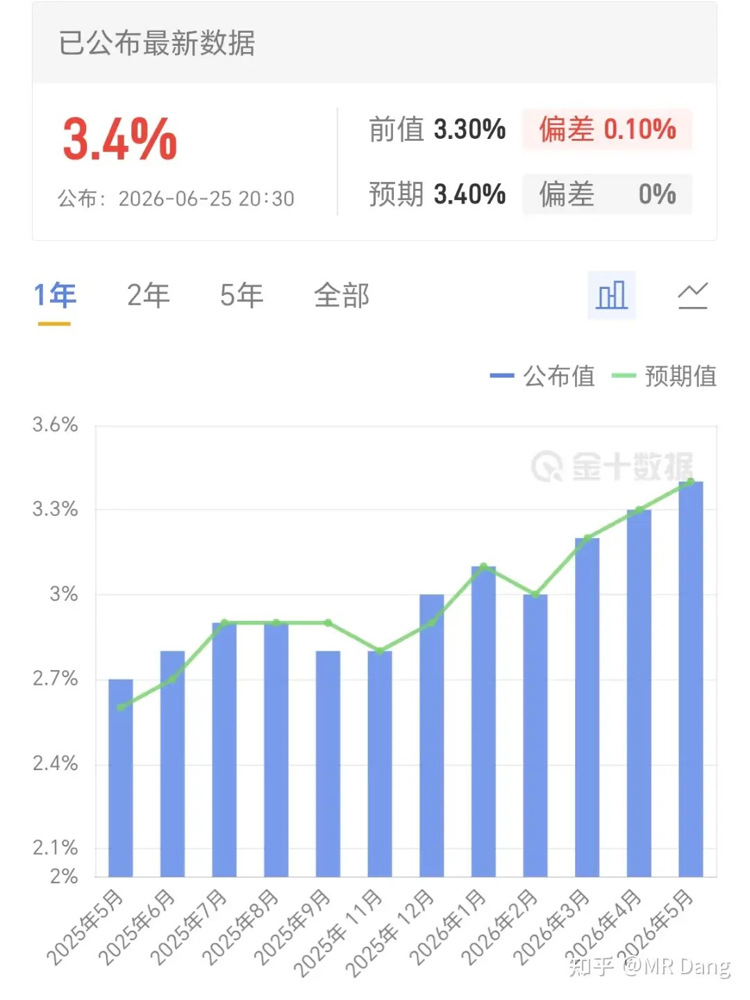
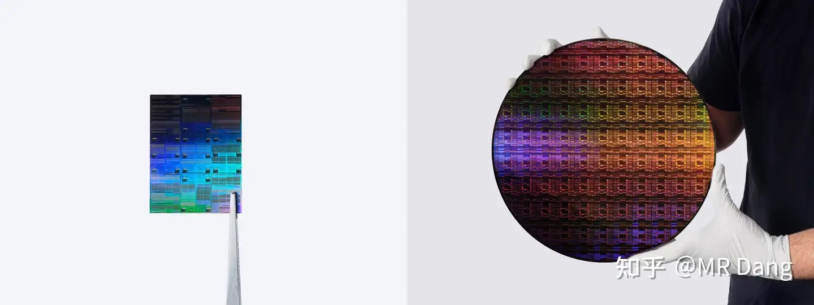
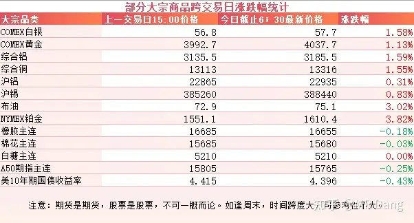
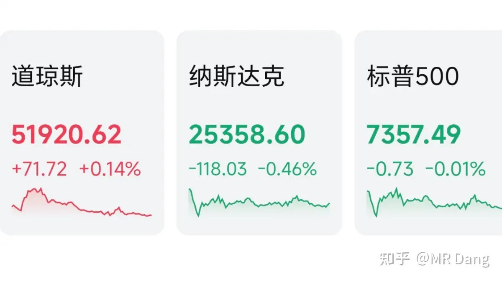
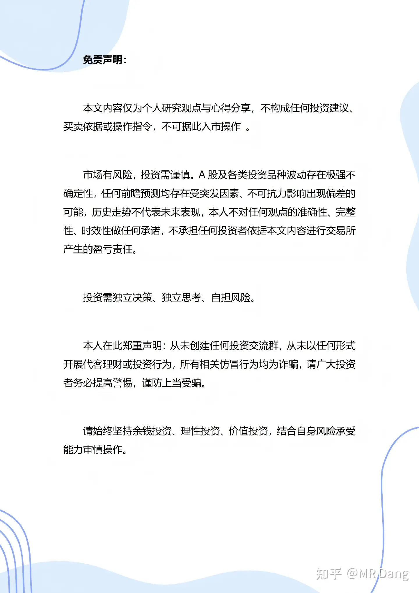

# 如何看待2026年6月26日A股行情？

---

**发布时间**: 2026-06-26 07:33  |  **原文链接**: https://www.zhihu.com/question/2053216573796749424/answer/2053742631738462645  |  **点赞数**: 159 人赞同

**作者信息**: MR Dang | 独立投资人，《价值投资功法》作者，小红圈同名，无其他小号。

---

## 正文内容

有关部门发布了《新型能源体系建设“十五五”规划》：

其中能源发展指标里，比较超预期的是非石化能源发电量比重这一指标，要在2030年超过50%。

这不是装机比重，而是实实在在的发电量比重，含金量要比装机比重高。

另外还有一个表述，是有关电网的：

2030年要力争具备承载9亿千瓦分布式新能源接入能力的电网。

大家可能对这个数字没概念，那我再说一个，目前并网的分布式新能源也就不到6亿千瓦，这中间的增长空间挺大的。

利好电网相关行业，电网在我这里也算是高频词汇了。

西大核心PCE数据发布：

3.4%符合市场预期，没有惊喜，也没什么惊吓，比前值3.3%提高了0.1%。

数据出来后，之前美银预测的三次加息纯属扯淡了，但是有机构把加息时间窗口的预期放在了大概今年9月份。

这种预期未必准的，如果后续通胀压下来了，随时会改变预期。

因为之前市场已经充分计价了加息的预期，所以现在9月份可能的加息反而不是什么大利空，有色金属在数据公布后出现了明显反弹。

IBM发布0.7纳米芯片：

0.7纳米，这真的是挑战物理极限了。

我对这方面不太懂，看了下大概的技术路径，也是从二维平面升级成了三维的晶体管堆叠。

感觉和前段时间华为的韬定律有点异曲同工的意思，不过IBM的制程显然领先很多。

大宗商品：

受消息面影响，隔夜大宗商品价格有所反弹，有色全面回暖，原油价格也有反弹。

农产品没什么波动，A50指数略显承压。

外围市场：

美三大股指涨跌不一，道指领涨，科技股分化，存储走强，美光财报超预期以后，美光闪迪携手并进。

苹果宣布旗下产品涨价，顶不住成本上涨的压力，整个消费电子板块回调。

现在科技火车头来到了韩国，纳指最近都在看韩国的脸色，纳指其实已经四连跌了。

另外昨晚中概股表现不佳，恒科继续承压。

昨天个人组合净值回撤不到半个点，银行纳米绿，消费红半个，电网红一个半，资源绿四个。

又是被科技吊起来打的一天，从开盘就戴上了痛苦面具，到收盘也没摘下来。

昨天三大股指都是红的，具体到个股是1200多家上涨，4200多家待涨，中位数跌了两个点。

感觉这种剧本已经重复很多次了。

不过也有一些老登板块也开始崛起，比如航空机场，头部券商，保险，都是前几天圈里提到的粪坑里的巧克力豆。

当时提的时候还有一些读者颇有微词，老登有什么好研究的，但是架不住有些投资者就好这一口。

而很多资源股已经跌回到了去年九月份的价格，那个时候铝价两万，铜价一万美元整，黄金3700。

算下来同样的价格，现在比那个时候资源价格高了10%左右，还免费赠送了三个季度的经营业绩。

这中间最主要的就是从降息预期到加息预期之间的差距。

而当时的降息预期没有兑现，现在的加息预期又是否会兑现也并不好说。

一个喜欢保护韭菜的博主，希望大家少少踩坑，多多赚钱！！！

> [!comment]- 点击展开评论
>
> | 用户 | 时间 | 内容 |
> | :--- | :--- | :--- |
> | 颗粒状 |  | 绿桥天天扣钱啊，都15块了 |
> | 抽筋馒头 |  | 今年最错误的操作是二十多块买了绿桥，最正确的操作也是二十多块卖了止损这一课叫止损，叫不盲从，每天看绿桥腰斩都很开心。 |
> | &nbsp;&nbsp;&nbsp;&nbsp;奔雷手 |  | 我在宁夏青铜峡的大型国有铝厂做期货观察的朋友说 这个股票还会到十块 |
> | &nbsp;&nbsp;&nbsp;&nbsp;抽筋馒头 |  | 有的兄弟，有的（指更低价） |
> | &nbsp;&nbsp;&nbsp;&nbsp;胡汉三 |  | 同29块买进，25块割肉，现在看到都15了。只能说幸亏跑了不然拿到现在不敢想象。 |
> | &nbsp;&nbsp;&nbsp;&nbsp;资本主义必将消亡 |  | 为什么呀？有说什么原因吗 |
> | yemin |  | 课代表辞职了吗 |
> | 天雷滚滚 |  | 绿桥警示着大家永远不要盲从 |
> | 承诺如过往云烟 |  | 人越来越少了 |
> | &nbsp;&nbsp;&nbsp;&nbsp;匡檀君 |  | 还有信徒在这看？ |
> | 北上大人 |  | 铝？ |
> | 天道酬勤我躺赢 |  | D大，新型能源这个文件应该也利好铜铝消费吧？ |
> | &nbsp;&nbsp;&nbsp;&nbsp;今晚回家吃饭 |  | bf的两个产品聚丙烯聚乙烯价格又开始跳水，快到战前了，看样子是和宏观经济息息相关的。虽然二季度业绩爆炸，但后面这俩价格也是跟随经济景气程度，悲观看空。 |
> | &nbsp;&nbsp;&nbsp;&nbsp;巷口的背影 |  | 亏成啥了，还D大呢 |
> | FLAME |  | 电网几天被砸成麻瓜了，暴跌五个点 |
> | &nbsp;&nbsp;&nbsp;&nbsp;胡扯都有人信 |  | ETF重仓前几的都是光通信，不然也不会这两年走的这么漂亮。 |
> | 朱解放 |  | 一般这种动荡的行情，保持不动是不是比较好的选择呢 |
> | 帅小伙 |  | 老师早 |

---

*本文件从MR Dang知乎页面转载*

---

**作者**: MR Dang
**链接**: https://www.zhihu.com/question/2053216573796749424/answer/2053742631738462645
**来源**: 知乎

*著作权归作者所有。商业转载请联系作者获得授权，非商业转载请注明出处。*
