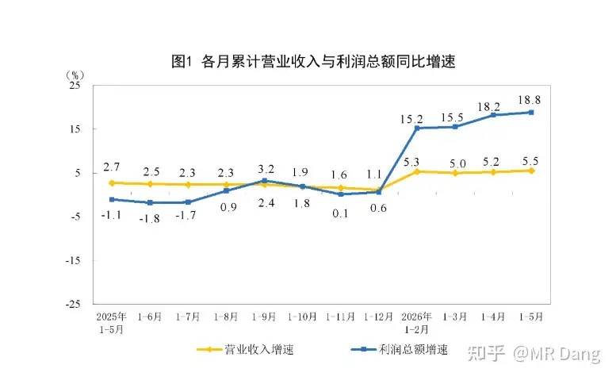
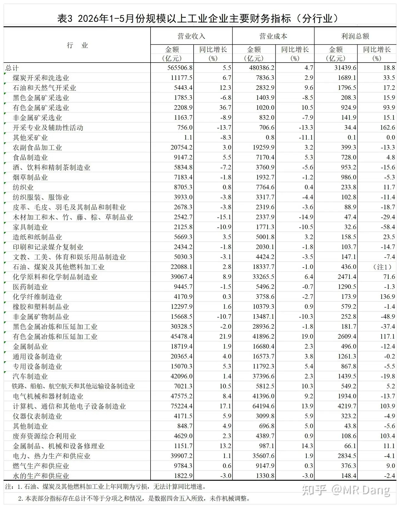
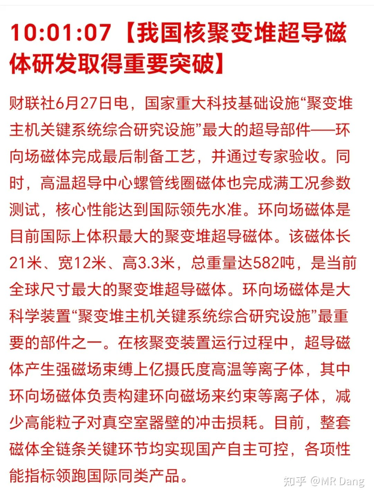
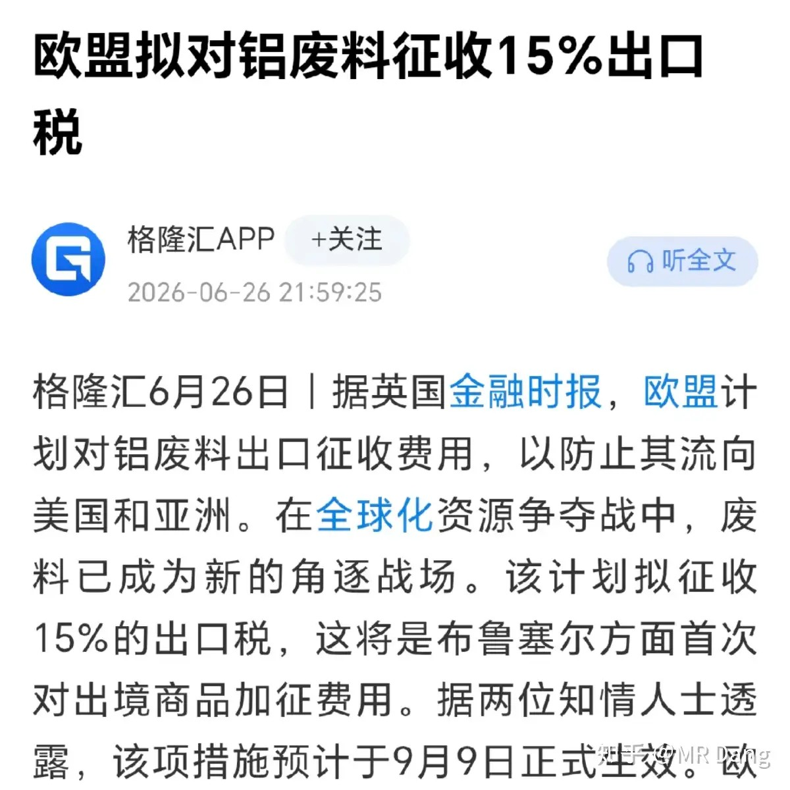
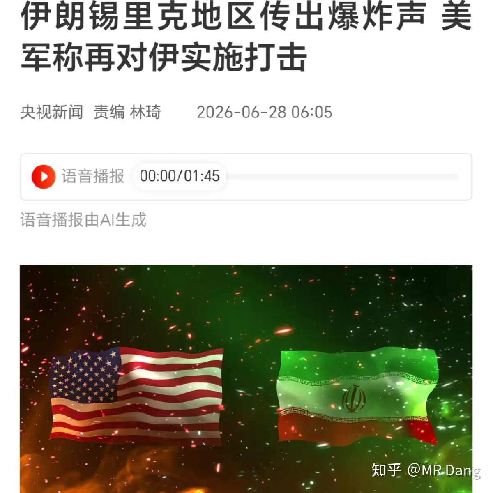
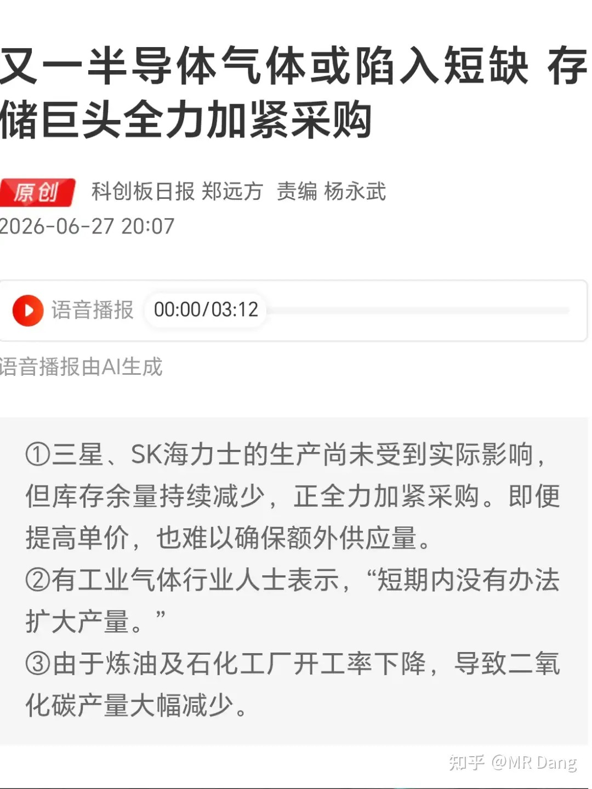
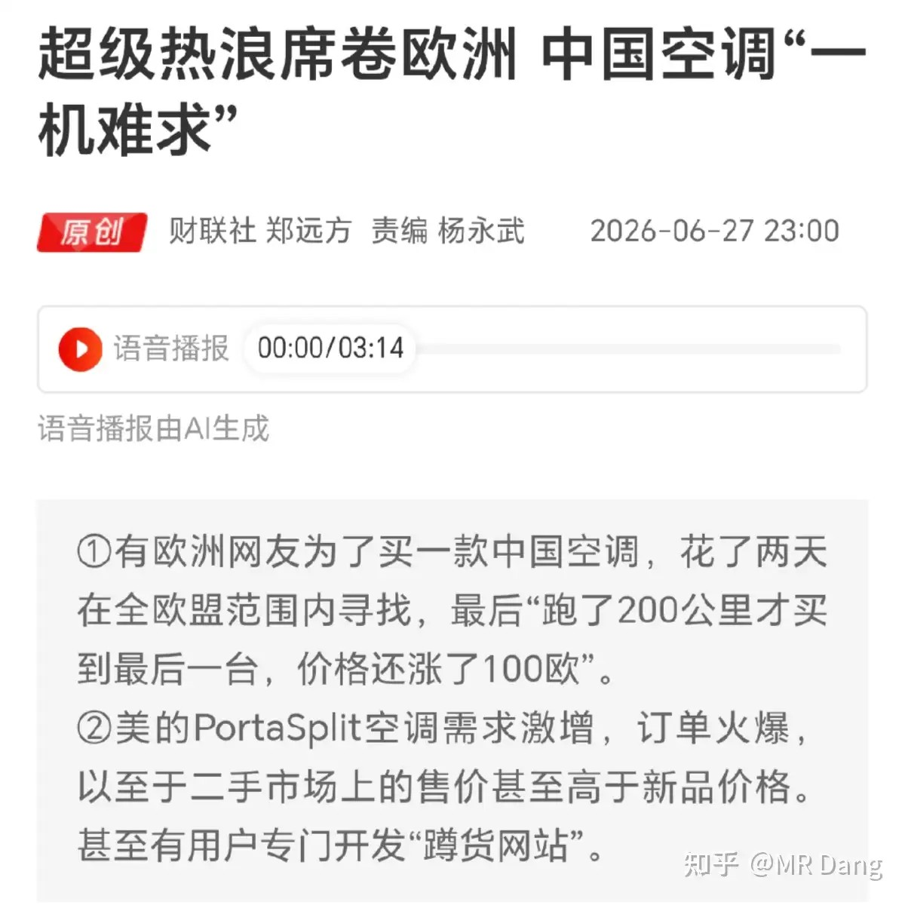
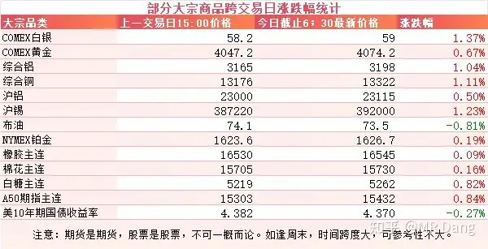
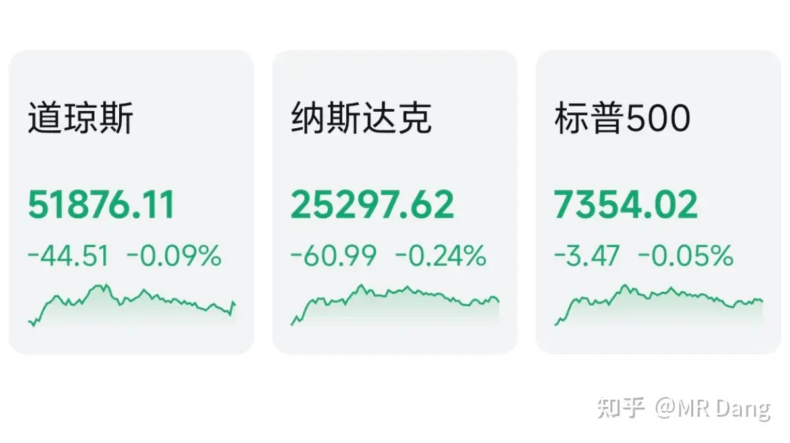
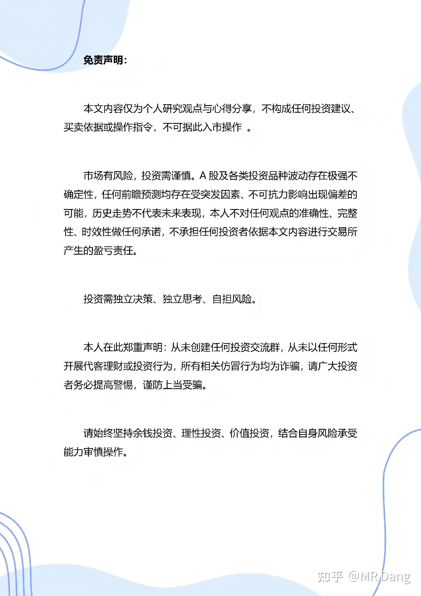

# 如何看待2026年6月29日A股行情？

---

**发布时间**: 2026-06-29 07:27  |  **原文链接**: https://www.zhihu.com/question/2053488521009182579/answer/2054828448171009308  |  **点赞数**: 217 人赞同

**作者信息**: MR Dang | 独立投资人，《价值投资功法》作者，小红圈同名，无其他小号。

---

## 正文内容

从统计局利润数据开始说起：

前五月工业企业利润总额增速18.8%，再创新高，数据很亮眼。

有四五个行业表现不错，集中在上游资源类行业。

很多行业和去年同期比起来，尚有不如。

东大核聚变突破：

核聚变就是太阳发光发热的原理，是未来可预见的范围内人类最浪漫的叙事之一。

但是核聚变有个问题，核心温度超过上亿度，任何物质都无法承受住，所以只能用磁场这种看不见摸不着的东西去禁锢它。

想产生这种磁场就需要非常大的电流，如果导体有电阻，就会产生大量的热，因此又需要超导技术的参与。

这次取得突破的部件之一就相当于洗脚盆外面的那圈铁箍，可以把等离子体圈住。

另外一个部件则类似于打火机，给等离子体点火用的。

好的说完了，说点现实的。

现在核聚变技术刚从实验室走出来，距离商用还非常非常遥远，想达到整个体系能量不亏损都很难，肉眼可见的未来内相关企业是产生不了什么利润的。

所以相关的投资只能停留在情绪和资金的博弈。

欧盟拟对铝废料加征出口关税：

欧盟地区是全世界铝加工成本最高的地区，所以在购买铝废料时企业出不了太高的价格，导致本地区加工产能空置，影响就业。

加了出口关税，可以把更多的铝废料留在本地。

东大每年进口废料铝大概是两百万吨级，其中从欧盟地区进口的大约60万吨上下。

回收铝在性能上和普通电解铝有一定差距，只能满足中低端一些的需求。

对铝产业链来说，这种几十万吨级的供应扰动不算什么重要事件，以情绪影响为主。

美伊局势：

两边又掐起来了。

二氧化碳紧缺：

我看了几遍，确认没看错，半导体气体紧缺，而这个半导体气体就是二氧化碳。

确认了原始信源，韩媒 The Elec，是一家半导体产业链的专业媒体。

整个逻辑其实也不复杂，半导体生产中需要高纯的二氧化碳进行清洗，对纯度要求很高，杂质多一点就容易让芯片报废。

而这么纯的二氧化碳，目前主流生产工艺还是从炼油厂的副产物里找原料，三星海力士这些厂商基本只从四大气体公司购买。

今年原油价格上涨，炼油厂开工率不足，副产物就少了，需求反而增加了，一来一回，高纯二氧化碳就开始紧缺了。

而且这玩意儿扩产还挺麻烦，没人会专门为了二氧化碳去搞个炼油厂，还需要通过严苛的认证环节才能给半导体厂供货。

国内也有[企业生产高纯度二氧化碳](/stocks/688106.SH)，不过是给韩国企业在中国的工厂供应，而不是出口到韩国，所以只能算间接受益。

欧洲空调热销：

算是周末比较有意思的一个社会话题，欧洲今年太热了，装空调的审批手续繁琐，在网上甚至被印度网友嘲讽吹不起空调。

[某国产品牌](/stocks/000333.SZ)的免安装空调解决了这个最大的痛点，得到了一众欧洲消费者的青睐。

甚至有德国老哥直接做了个空调库存实时更新的app，还收取一定的订阅费。

欧洲天气热，利好制冷剂和家电企业。

不过需要提醒投资者的是，对国内的相关企业来说，这个体量还是有些小，被抢购的型号去年卖了6万台，今年可能大概在20到30万台，看着不少，也就二十亿左右销售额。

大宗商品：

大宗整体都有些许涨幅，除了原油。

现在原油价格对美伊局势几乎已经完全脱敏了。

整体盘前氛围还不错。

外围市场：

上周五美三大股指回调，半导体领跌，其他板块表现尚可，传统行业相对更强势。

上个交易日个人组合净值又大幅回撤两个半点，银行绿两个，消费绿两个半，电网绿五个半，资源绿近三个。

体验很难受的一天，两市只有不到800家公司上涨，另外近4700只股票待涨，市场中位数是近三个点的暴击。

老登难受的点在于，涨的时候没有份，跌的时候一个不落。

很多投资者纷纷破防，眼一闭，手一抖，割以永治。

标准的熊市体验，更加诛心的是指数上整体还是牛市，所以落差感就更大了。

本周前瞻：

1，周二公布东大制造业PMI，上个月刚好到50的枯荣线，这个月能超过50就很好了。

2，周三公布西大PMI。

3，周四公布西大的非农就业数据。

4，长鑫存储ipo可能会有进展，打新的盯紧了。

一个喜欢保护韭菜的博主，希望大家少少踩坑，多多赚钱！！！

> [!comment]- 点击展开评论
>
> | 用户 | 时间 | 内容 |
> | :--- | :--- | :--- |
> | 陈羽 |  | 老师 您还持有宏桥吗？ |
> | 鱼拜拜 |  | 退小红圈不退钱了吗？ |
> | 余生 |  | 我也想问还有没有虹桥了，已经腰斩了 回本要翻倍了咋整 |
> | &nbsp;&nbsp;&nbsp;&nbsp;草长莺飞 |  | 不舍得割肉就删软件熬几年，等下一轮有色周期 |
> | 夏天 |  | 课代表呢 |
> | &nbsp;&nbsp;&nbsp;&nbsp;美工笔 |  | 课代表亏退市了 |
> | &nbsp;&nbsp;&nbsp;&nbsp;戒有为 |  | 课代表 st 了 |
> | &nbsp;&nbsp;&nbsp;&nbsp;sasasayounara |  | 亏得他话都不想说了，还看着别人在科技里吃撑了 |
> | 颗粒状 |  | 做好扣钱准备 |
> | 簌簌 |  | 早安，挨打的一周又来啦 |
> | 计算毒理学 |  | 坚持就是胜利 |
> | 安静 |  | 又打起来了，我的票还没脱敏 |
> | 初心已忘 |  | 比股灾还难绷这轮行情 |

---

*本文件从MR Dang知乎页面转载*

---

**作者**: MR Dang
**链接**: https://www.zhihu.com/question/2053488521009182579/answer/2054828448171009308
**来源**: 知乎

*著作权归作者所有。商业转载请联系作者获得授权，非商业转载请注明出处。*
