# 如何评价2026年6月30日A股行情？

---

**发布时间**: 2026-06-30 07:35  |  **原文链接**: https://www.zhihu.com/question/2055055781351929036/answer/2055192731971072445  |  **点赞数**: 200 人赞同

**作者信息**: MR Dang | 独立投资人，《价值投资功法》作者，小红圈同名，无其他小号。

---

## 正文内容

教育发展十五五规划印发：

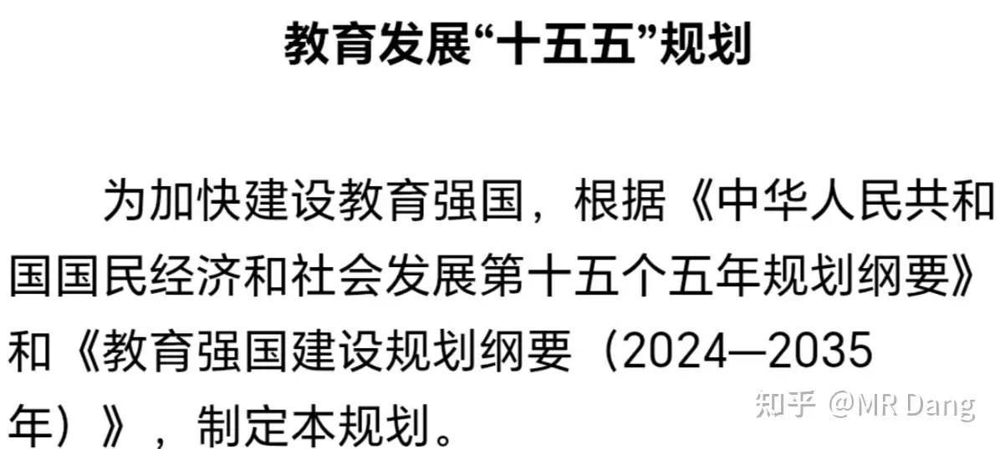

整体看下来，有几段表述比较超预期，比如有关职业教育的：

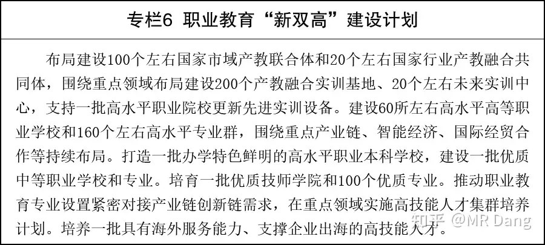

以前主要是着力点在高职，现在规划的有中职，高职，职业本科，再加上专硕的话，相当于齐全了。

而且还给出了具体的指标，比如60所高职院校，200个实训基地。

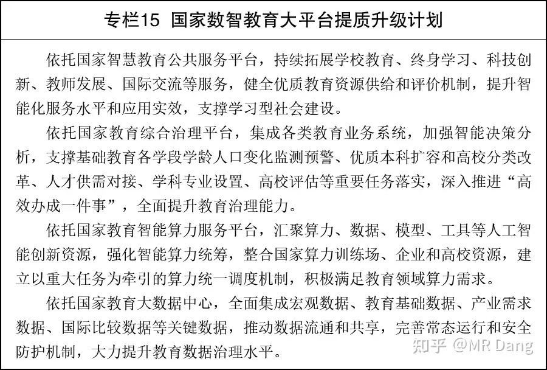

还有就是有关Ai+教育的表述也比较超预期。

这方面的投资机会主要分两类，一类是硬件，C端的学习机，G端的智慧黑板之类的。

今天被11.86万亿刷屏了：

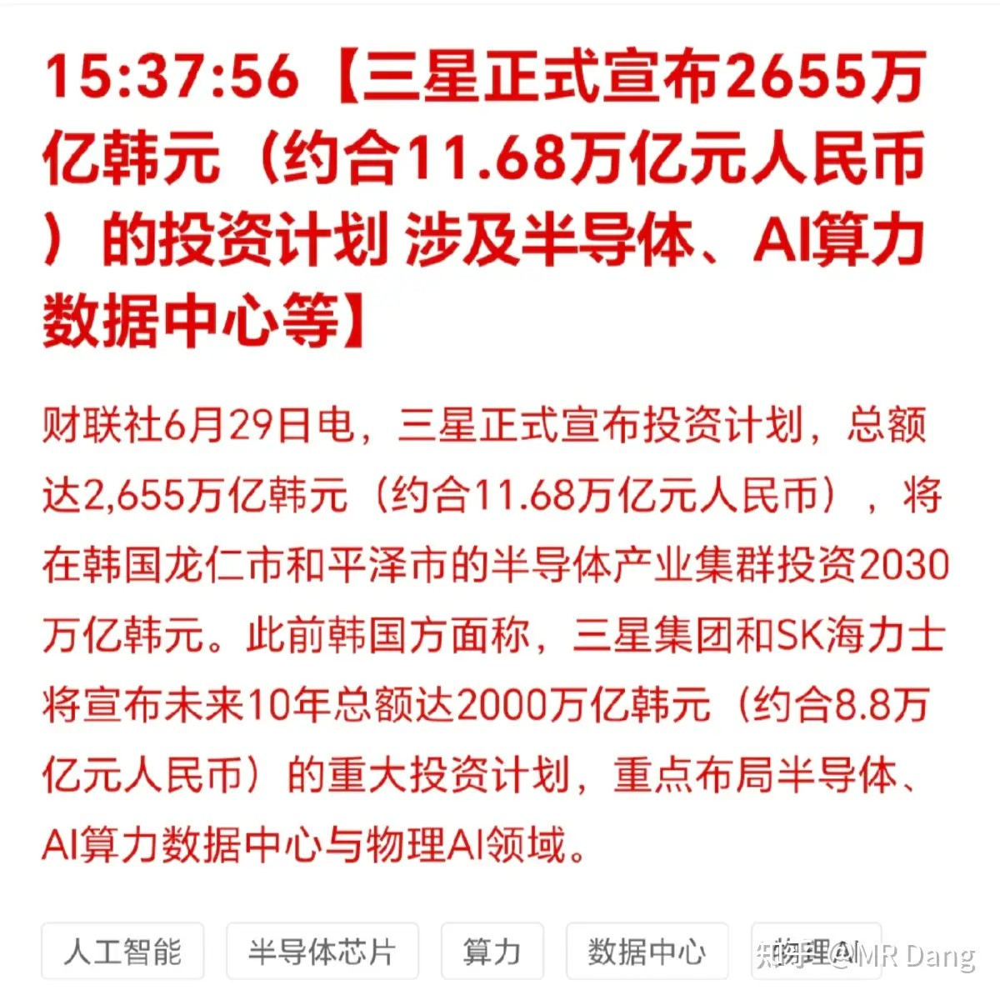

三星宣布11.86万亿的投资计划。

什么概念呢，韩国去年GDP差不多是13万亿左右。

相当于三星宣布未来十年再投一个韩国出来。

但是市场并没有买账，韩国股市昨天也没起飞。

市场希望的是投资是因为有利可图，是利润驱动，是公司自愿，而这个在外界干预下做出的投资决策，会让市场担忧投资回报率的问题。

不过不管怎样说，这个饼确实够大，得一段时间慢慢消化的。

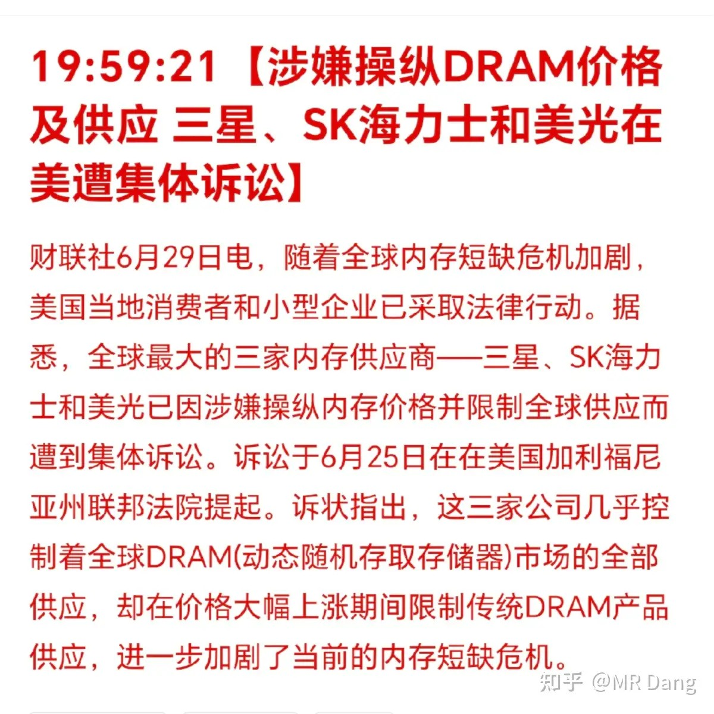

饼还没吃完，存储三巨头又在西大被集体诉讼了，事情变得有意思了起来。

医保谈判：

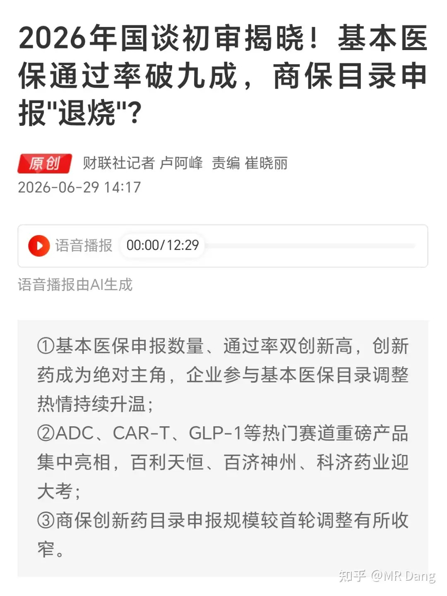

买过创新药的投资者都知道，往年一说医保谈判，新闻报道里就是灵魂砍价，让利x成，然后药企代表面露难色，其他人开始拍手称快，大呼过瘾，接下来的剧情就是一开盘药企股价就开始表演跳水。

今年的剧情因为医保谈判超预期，所以和往年画风明显不一样了。

为什么医保对医药股如此重要呢？

我说几个数字吧：去年医保支付规模超过三万亿，占医疗支出的一半以上，个人支付和商业医保加起来都比不上。

能不能进医保，对药企来说是云泥之别。

今年医保初审通过率92%，比去年的84%明显更高。

还有就是两个月前权威部门发布的《关于健全药品价格形成机制的若干意见》，明确提出了“创新不集采，集采非创新”，算是打消了这个行业最大的不确定性。

这行目前估值处于底部，基本面边际变好，看起来值搏率还是可以的。

但要说这些消息有多震撼，直接刺激板块大涨，那也不至于。

这就像一根被挤压了很久的弹簧，市场只要一松手，随时可能就出现短时间的反弹，但是猜测市场啥时候松手，是很难的。

普通投资者也根本没精力去盯着管线追踪，因此如果想参与可以考虑ETF，更稳妥一些。

我自己的话，对这行有些不太好的滤镜，所以没有纳入考虑。

西大修改核心PCE计算规则：

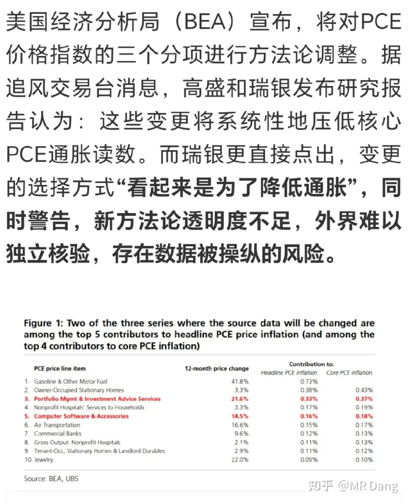

一共三项大修改，最主要的是其中一项有关资产管理服务费的修改：以前的计价方式里，如果美股走高，资产管理规模就会变大，资产管理服务费也会增加，就会推高通胀。

现在修改后，变成以工时进行衡量，也就是说虽然资产管理服务费增加了很多，但是管理人员上班打卡时间没变，那就不算通胀。

有投行分析师认为这些手段是压低通胀的捷径，可能会降低核心PCE约0.2%。

锂矿复产：

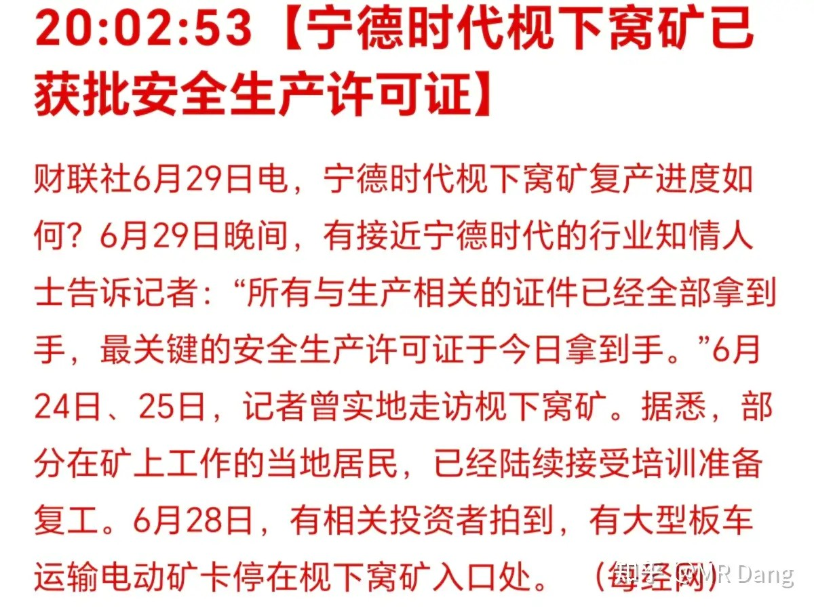

堪称锂矿界的霍尔木兹海峡，碳酸锂多头最严厉的父亲。

锂这个行业是供需最复杂的品种，数据不透明，而且供需双增，历史上波动又大的吓人，利益方还特别多，消息真真假假的，交易很难做。

之前普遍预测三季度开始复产，现在突然报道安全生产许可证已经齐全了，可能会引发市场对供应端宽松的担忧。

日元汇率破近四十年新低：

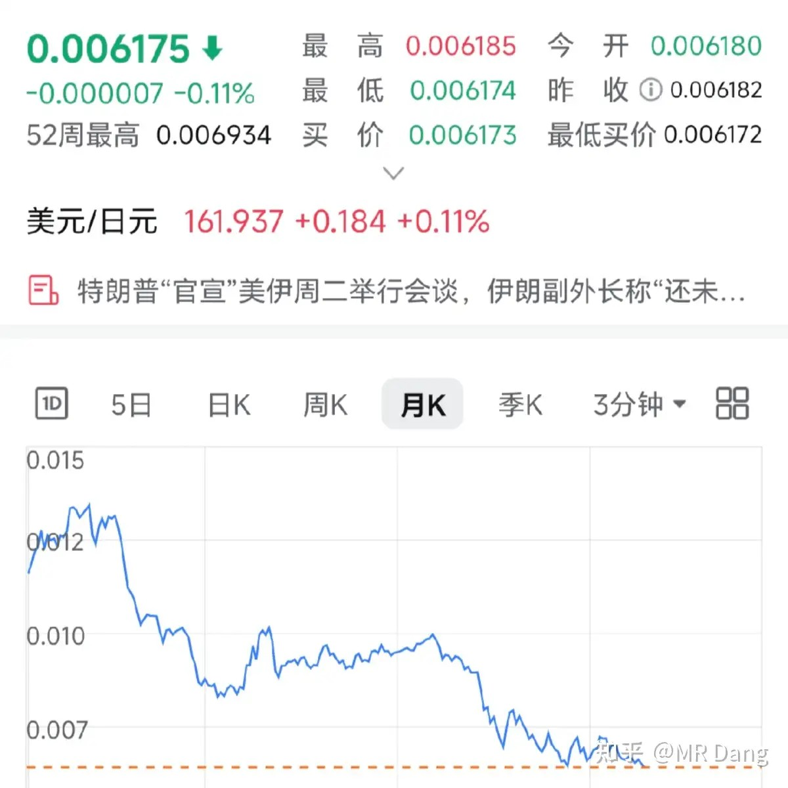

这说的是日元兑美元的汇率，由于红票子比绿票子更强势，以红票子计价的话，日元早就破新低了。

尽管日央行已经加息，但是因为贬值死亡螺旋的存在，所以效果不佳。

死亡螺旋大概的原理如下：

日元贬值 → 进口能源/粮食成本暴涨 → 贸易逆差扩大 → 日元进一步贬值 → 通胀加剧 → 央行不敢大幅加息 → 日元继续贬值

日元贬值大背景下，日股潜在受益，因为对外资来说，估值会变低，吸引力会增加。

对岛国车企也算利好，出口汽车价格会更便宜。

今年咱们国内油车二手车的估值体系都崩了，以前的高保值率神话车型直接玩了个高台跳水，和日元贬值压制新车售价也有关系。

[美的](/stocks/000333.SZ)空调后续：

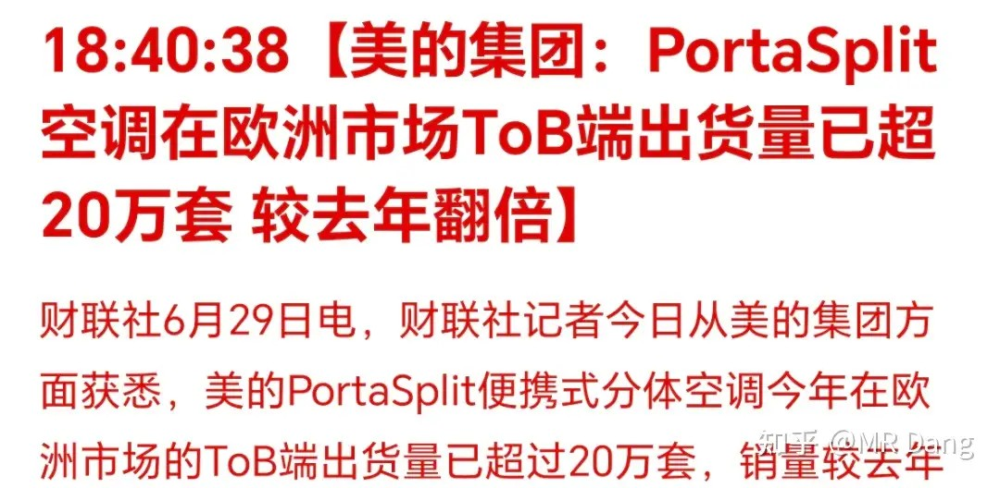

半年出货量超过20万套，全年简单的算40万套的话，比之前预期的20到30万套要多，贡献的营收可能达到30亿，相较于公司四五千亿级的营收来说，不是很明显。

大宗商品：

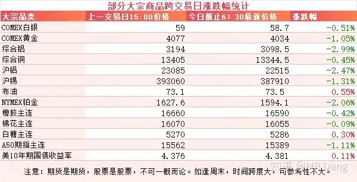

隔夜大宗商品表现不佳，原油小幅反弹，有色集体回调。

沪铝来到了2.25万，伦铝跌破3100美元，已经跌破南欧国家比如意大利和西班牙的成本线。

A50期指合约换月。

外围市场：

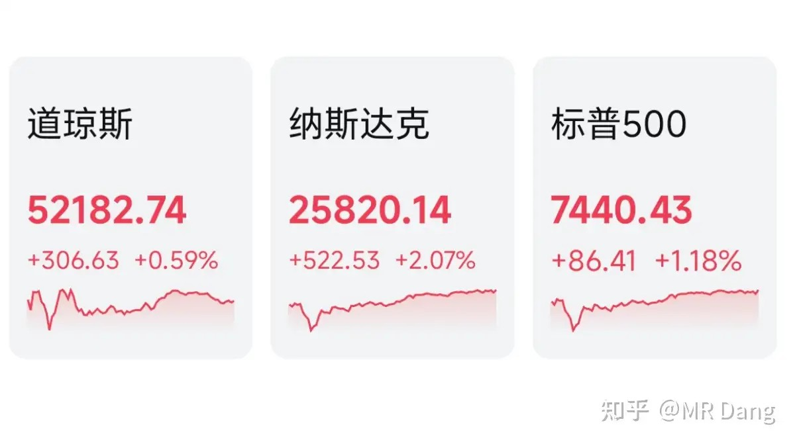

美三大股指收红，纳指领涨，科技股表现不错，软件硬件都在涨

昨天个人组合净值回血半个点，银行纳米红，资源三个点，消费两个点，电网绿一个。

三大指数都是红的，不过待涨企业有2900多家，而上涨的股票只有2400多家，意味着中位数是下跌的。

行业风格比较均衡，老登和小登都有所表现，恒科也支愣了起来。

一个喜欢保护韭菜的博主，希望大家少少踩坑，多多赚钱！！！

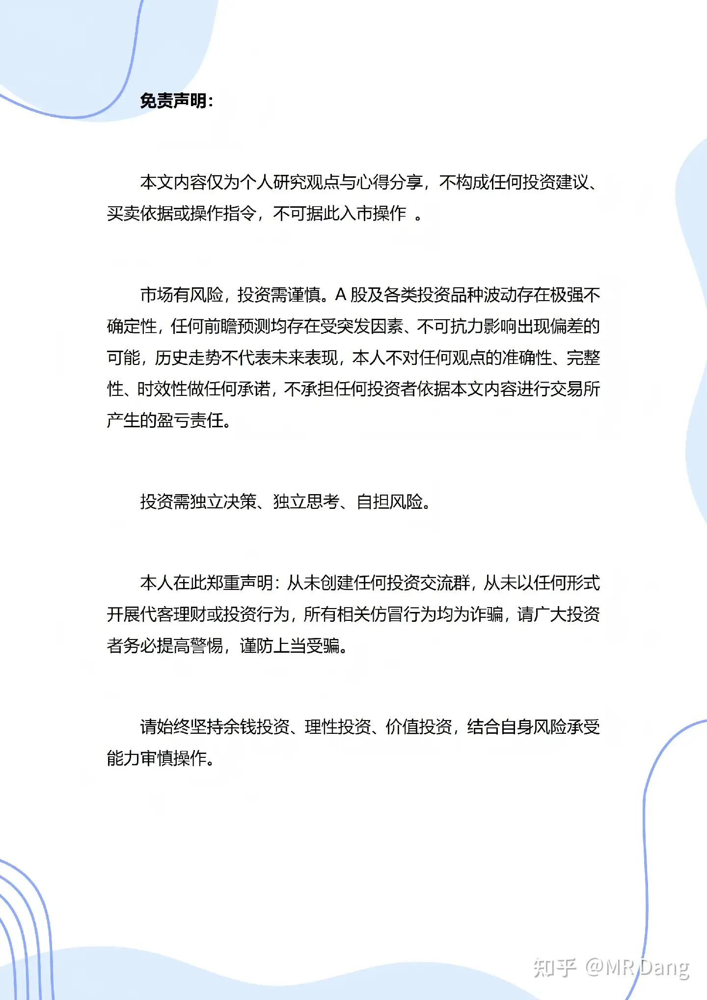

> [!comment]- 点击展开评论
>
> | 用户 | 时间 | 内容 |
> | :--- | :--- | :--- |
> | 在人间 |  | 宏桥破15了。。 |
> | 百忧解 |  | 大佬，您标榜喜欢保护韭菜，但是每天发新闻解读真的能保护韭菜吗？ |
> | &nbsp;&nbsp;&nbsp;&nbsp;雨饱饱 |  | 你家自己种的韭菜会让邻居来割吗？保护好自己家的韭菜，只能自己割 |
> | &nbsp;&nbsp;&nbsp;&nbsp;土豆爱吃糖醋鱼 |  | 还保护个屁， |
> | 若星汉天空 |  | 我的桥啊，15还不是底，难不成要5快 |
> | &nbsp;&nbsp;&nbsp;&nbsp;Fish |  | 跟老登股一个样了，看不到底的 |
> | &nbsp;&nbsp;&nbsp;&nbsp;半半梦半醒 |  | 还没卖呢，死拿着干嘛 |
> | 余幼时即嗜学 |  | 铝你还拿着不？ |
> | &nbsp;&nbsp;&nbsp;&nbsp;一叶知秋 |  | 他直接无视 |
> | &nbsp;&nbsp;&nbsp;&nbsp;世界这么大 |  | 我割了，因为发现自己心态不适合做左侧长线。宝丰能源我留着，毕竟还是有增长预期的，它不是纯粹的周期股。 |
> | &nbsp;&nbsp;&nbsp;&nbsp;世界这么大 |  | 但我留了一手，作为未来某一天，我回忆这段日子的车票 |
> | &nbsp;&nbsp;&nbsp;&nbsp;予安 |  | 早跑路了 周期股而已 |
> | 一世相依 |  | 孙宇晨：“拉开人与人差距的，不是努力，而是选择。” |
> | Pigeon |  | 有色和银行真是跌够了。 |
> | &nbsp;&nbsp;&nbsp;&nbsp;听劝来赚100万 |  | 4.8  4.9进，5开头出邮储银行生财之道 |
> | &nbsp;&nbsp;&nbsp;&nbsp;世界这么大 |  | 这方面真得夸夸邮储银行，早早就在底部坐牢，除了去年进去那批，其他时候进去想被套都不行 |
> | 颗粒状 |  | 十块的绿桥是底不？ |
> | &nbsp;&nbsp;&nbsp;&nbsp;Fish |  | 看不到底，不用问了，企稳都没有 |
> | 微信用户 |  | 股神牛逼，D家军雄起 |
> | minne |  | 奈何桥走吗，太痛了 |
> | 白垩纪的鳄鱼 |  | 都是好股啊 |

---

*本文件从MR Dang知乎页面转载*

---

**作者**: MR Dang
**链接**: https://www.zhihu.com/question/2055055781351929036/answer/2055192731971072445
**来源**: 知乎

*著作权归作者所有。商业转载请联系作者获得授权，非商业转载请注明出处。*
