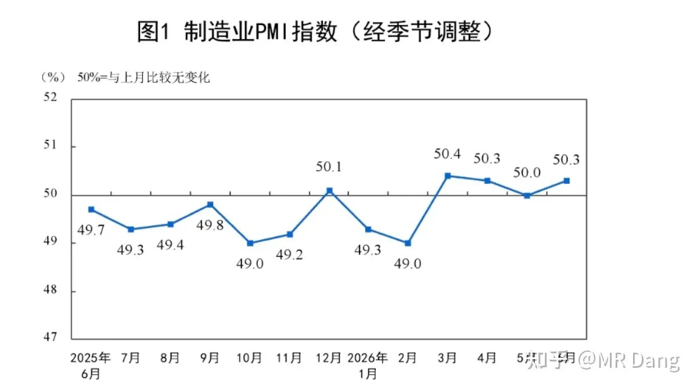
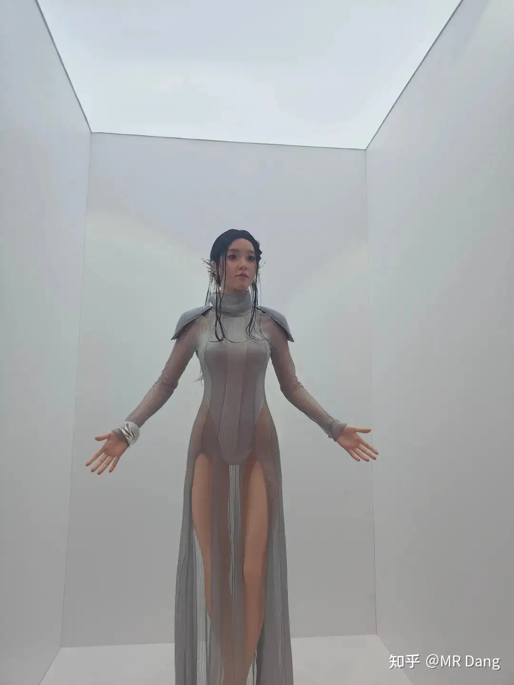
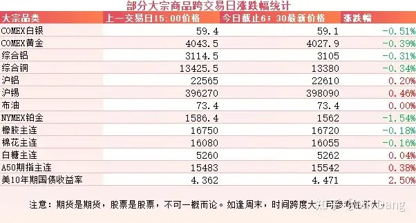
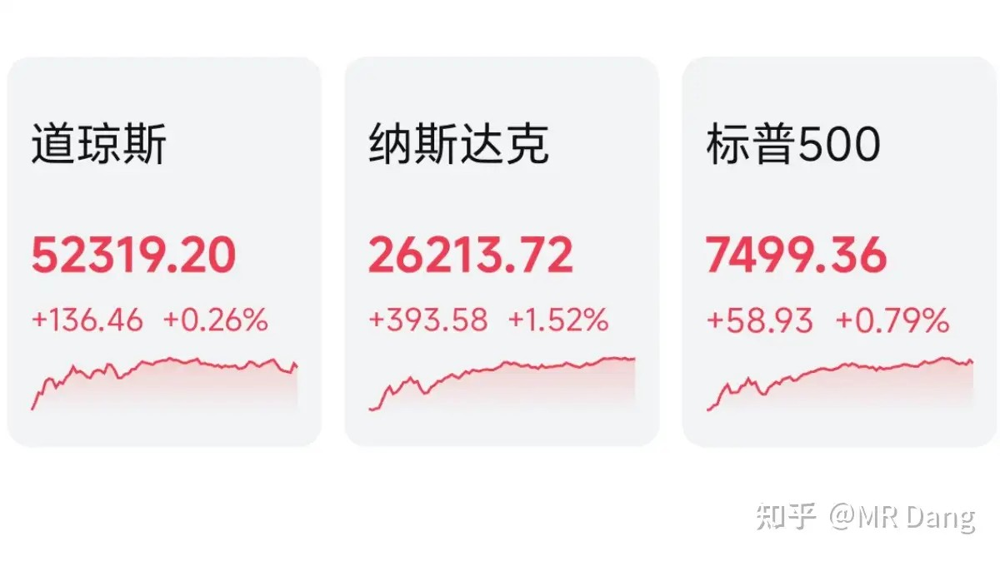

# 对于2026年7月1日A股市场行情，大家有什么预测和看法？

---

**发布时间**: 2026-07-01 07:32  |  **原文链接**: https://www.zhihu.com/question/2055246604072964457/answer/2055554480263914704  |  **点赞数**: 173 人赞同

**作者信息**: MR Dang | 独立投资人，《价值投资功法》作者，小红圈同名，无其他小号。

---

## 正文内容

昨天公布了制造业PMI：

数据不错的，50.3，和上月相比重返扩张区间，算小超预期。

优必选发布了仿真机器人：

全身的长这样：

这个卖八九十万一个。

半身的长这样，卖十几万一个。

我知道大家在想什么，没有那种功能。

公司宣称已经收到了上万台订单。

大宗商品：

大宗商品整体波动不大，互有涨跌，美十年期国债走强。

外围市场：

美三大股指收红，纳指领涨，科技股强势。

昨天个人组合净值回撤一个半，银行绿两个点，资源绿两个半，电网红一个半，消费绿一个半。

市场整体上依然是老登挨打，科技狂欢的局面，最近以来的新常态了。

怎么形容呢，现在流动性有点紧，大A就一条大裤衩，科技的屁股大，它出门的时候一个人就把裤衩卡在屁股缝里了，其他所有老登只能光屁股。

而科技不出门的时候，所有老登挤一块，那条裤衩就能兜住所有人了。

大多数时候，科技和老登只能轮流穿裤衩出来溜达，另外一个就得光屁股。

不巧的是，每次光屁股的里面都有我。

好像今天这边有点短，主要是半年盘点放那边了，明天争取长一点。

一个喜欢保护韭菜的博主，希望大家少少踩坑，多多赚钱！！！

> [!comment]- 点击展开评论
>
> | 用户 | 时间 | 内容 |
> | :--- | :--- | :--- |
> | 陈羽 |  | 老师 还能继续持有宏桥控股吗？ |
> | &nbsp;&nbsp;&nbsp;&nbsp;世界这么大 |  | 电解铝我割肉了。但我觉得它有前景。 |
> | 浪里小白马 |  | 啥时候能自己穿条裤子 |
> | 柠檬冰可乐 |  | 还是你本人么？ |
> | &nbsp;&nbsp;&nbsp;&nbsp;陈信宏啊啊啊 |  | 哈哈，加油，起码刷到经验了，证明了当前组合不够完美， |
> | &nbsp;&nbsp;&nbsp;&nbsp;MR Dang |  | 连你都信造谣的 |
> | 晃晃 |  | 老师，宏桥该怎么操作 |
> | 五人之一 |  | 没那种功能，做那么大干什么 |
> | 狄仁杰 |  | 知道大家在想什么 |
> | &nbsp;&nbsp;&nbsp;&nbsp;实名用户 |  | 这个机器人逼真吗？ |
> | 蛮王石头人 |  | 看了下近半年的成绩，持有的红利低波、恒生红利低波和自由现金流，近半年亏损了14.45%，单5月和6月就亏死了11% |
> | &nbsp;&nbsp;&nbsp;&nbsp;安静 |  | 同道中人 |
> | 凉风微凉tes |  | 宏桥怎么说啊， |
> | &nbsp;&nbsp;&nbsp;&nbsp;即建立睦邻 |  | 中东已经运出来一船铝了,如果大批量运出来,估计铝价还有下杀,矫枉可能过正 |
> | 落渊 |  | 课代表不见了 |
> | &nbsp;&nbsp;&nbsp;&nbsp;李末車 |  | 精炼？我在哪看不到这些信息？要他来复制？ |
> | &nbsp;&nbsp;&nbsp;&nbsp;我喜欢花生米 |  | 内容少了，也蛮精炼，还需要啥课代表 |
> | 惊掉 |  | 可以的话那要买俩。 |

---

*本文件从MR Dang知乎页面转载*

---

**作者**: MR Dang
**链接**: https://www.zhihu.com/question/2055246604072964457/answer/2055554480263914704
**来源**: 知乎

*著作权归作者所有。商业转载请联系作者获得授权，非商业转载请注明出处。*
