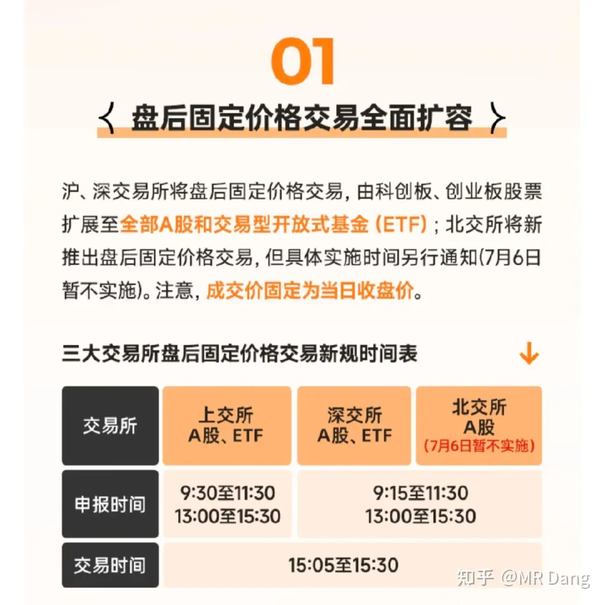
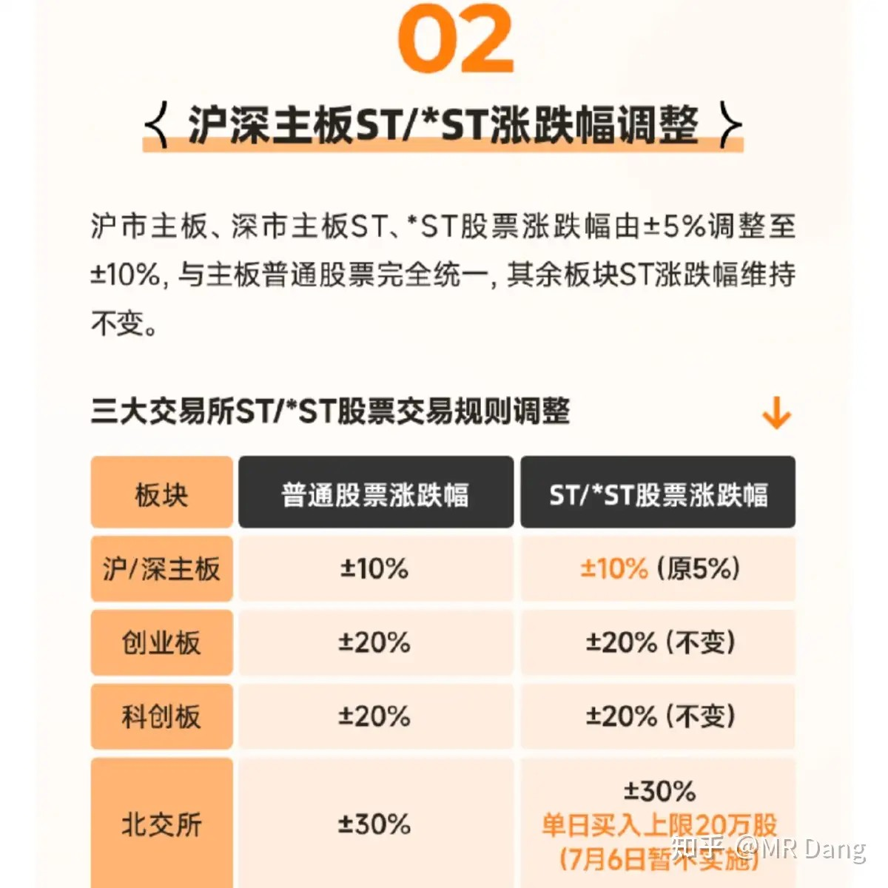
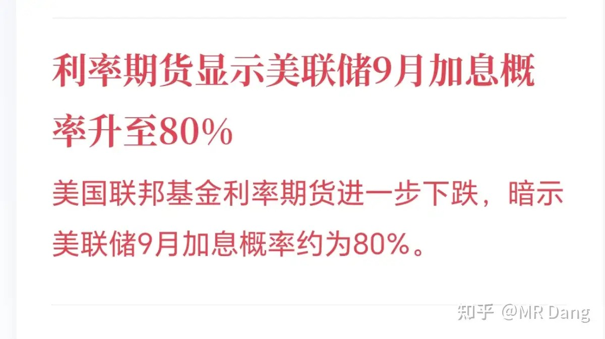
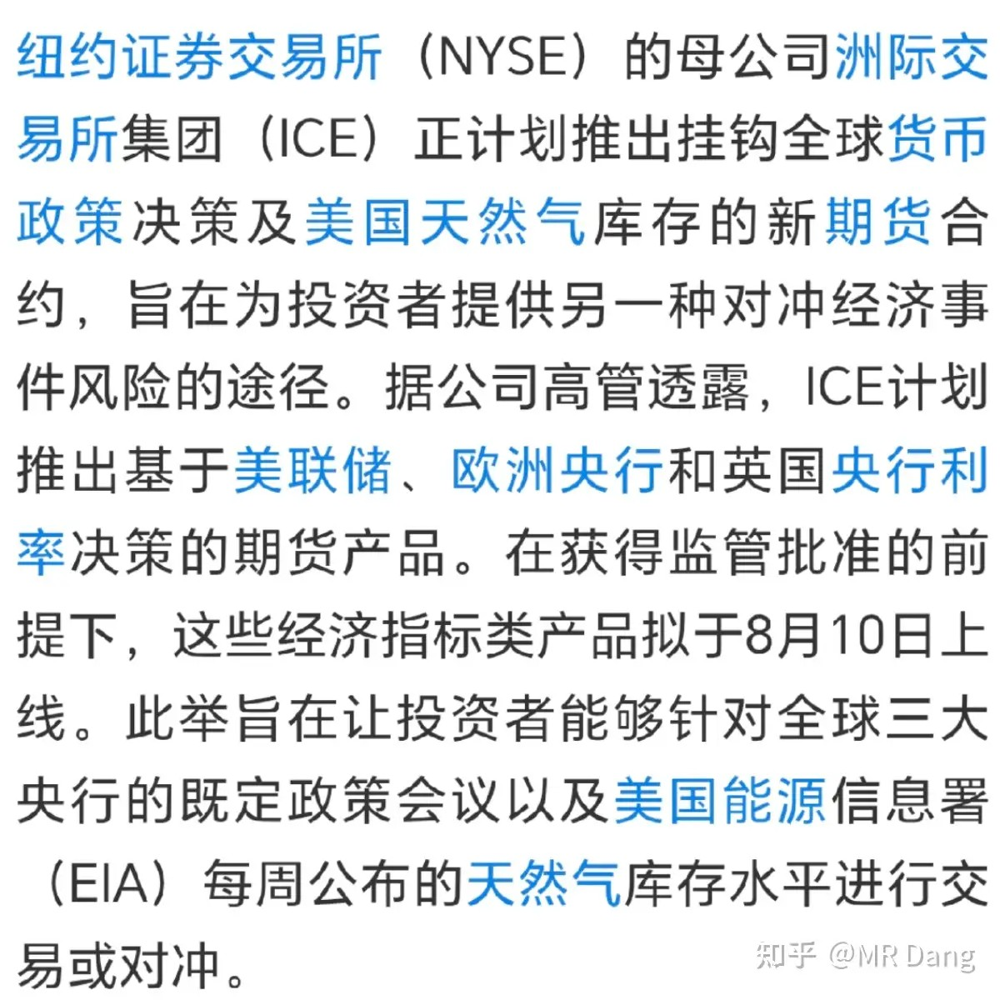
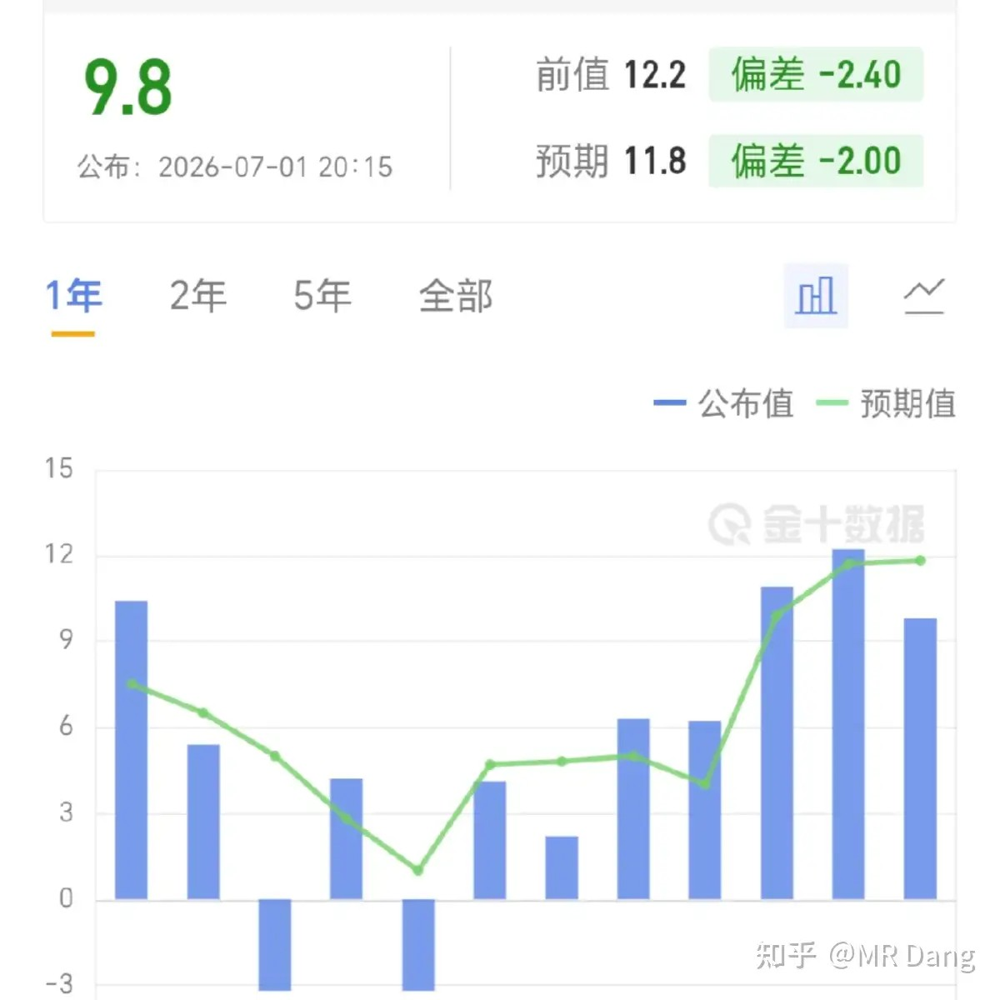
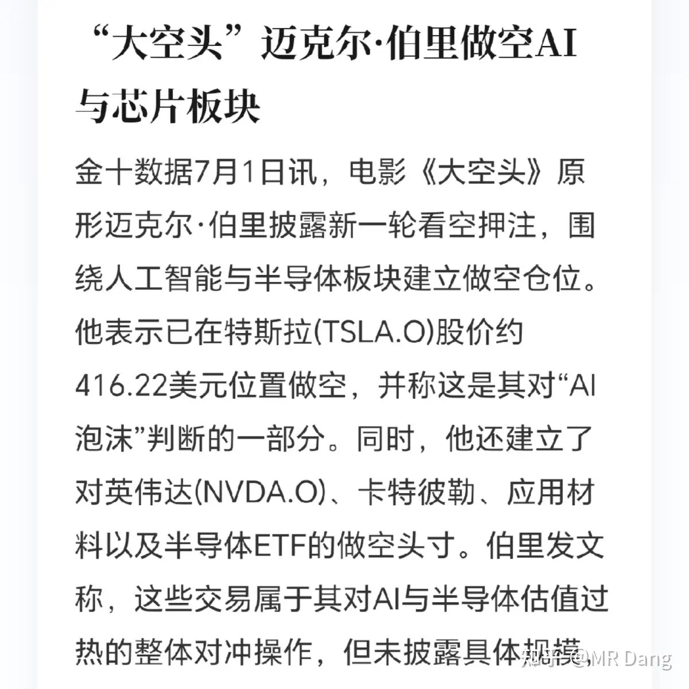
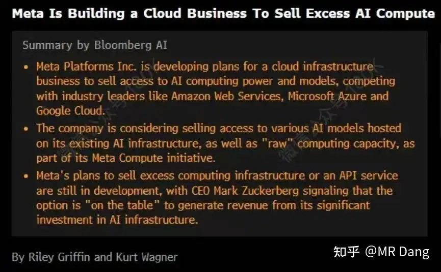
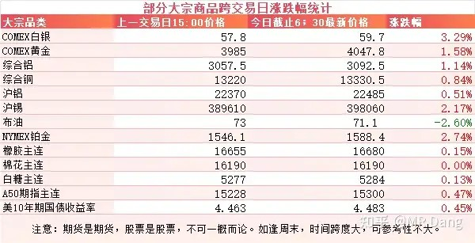
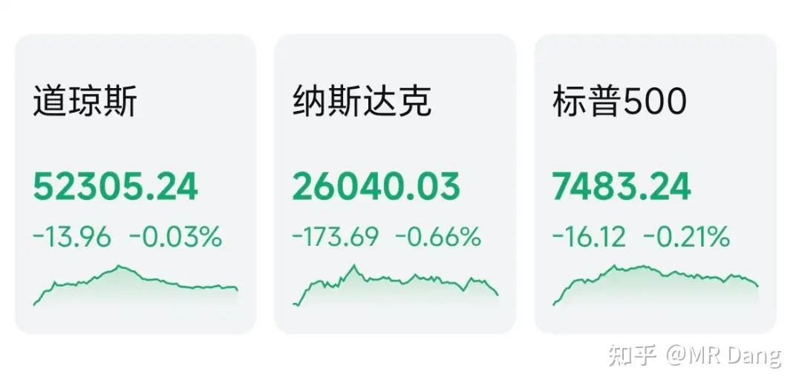

# 如何评价2026年7月2日A股行情？

---

**发布时间**: 2026-07-02 07:28  |  **原文链接**: https://www.zhihu.com/question/2055366858384187451/answer/2055915855985260428  |  **点赞数**: 138 人赞同

**作者信息**: MR Dang | 独立投资人，《价值投资功法》作者，小红圈同名，无其他小号。

---

## 正文内容

下周开始，交易规则调整：

首先是盘后固定价格交易引入主板，这个是从收盘后的五分钟开始，一直持续到三点半。

价格就按照收盘价来，不会再变。

以我在科创板的体验来说，这个功能存在感比较低，很少有用到的时候。

其次是主板的st股涨跌幅限制从5%放开到10%了。

有报道称9月加息概率80%：

今天不讨论是否会加息，而是解答背后的原理。

有没有读者好奇，这个80%是怎么算出来的呢？

大概说一下其中的弯弯绕绕。

首先这个概率不是真实概率，而是资金真金白银下注对应的概率，类似于足球的盘口。

计算原理也特别简单，用到的只有简单概率：

利率期货价格=100-9月平均利率

假设期货价格为96.275，则推测出9月平均利率为3.725%

9月公布议息决议，是在16日，相当于前面有16天，后面有14天，通过加权计算出来会议后利率为3.834%。

而现在大概是3.63%，则算出来比现在高20个基点，对应加息一次25个基点就是80%概率。

所以你说他准吧，对期货价格极为敏感，一旦期货价格有波动，这个概率就会大幅波动，波动100%都不稀奇。

你说他不准吧，又是市场真金白银交易出来的，总比其他人红口白牙说的概率要准一些。

那有没有更直观一些的办法？

还真有，下个月ICE将会上一款非常简单粗暴的期货产品，直接赌央行利率。

也就是说，如果你对你的宏观分析有信心，认为自己可以预测央行利率，那就可以直接知识变现，这个金融创新真的很有想象力了。

ADP就业不及预期：

号称小非农的ADP就业数据不及预期，这个数据是在上面那个加息概率以后出来的数据，所以80%的加息概率又变回了60%。

疲软的就业不利于加息，利好贵金属等有色板块。

大空头：

迈克尔·伯里公开做空Ai。

这哥们最封神的一战就是押中了次贷危机，给公司赚了好几倍，自己也赚了一亿绿票子。

自此以后就有了路径依赖，经常做空，比如2021年一季度做空特斯拉，结果稍微早了点，没等到三季度特斯拉暴跌，他先爆仓了。

过了两年觉得自己又行了，做空英伟达，后来。。。。。。

从他的战绩统计来说，他看方向挺准的，但是时机不太准，经常出手太早，结果往往等不到逻辑兑现，就被打爆了。

他这种天生的大空头选错了地方，个人能力真的挺厉害了，在美股那么强的市场做空，居然都能成功。

要是放在港股，那可真是如鱼得水，如虎添翼，现在指不定早就是一代宗师了。

Meta算力过剩：

现在对AI预期打的都很高，市场一听Meta要出售过剩算力，直接吓尿了。

Meta自己倒是可以增加一部分收入，股价大涨，但是其他搞算力的公司日子就不好过了。

大宗商品：

大宗商品除了原油，整体都有反弹。

昨天沃什出席了一个央行的论坛，口风挺紧，但是表达了通胀风险已经降低，被视为是偏鸽的立场。

再加上ADP数据的助攻，加息担忧有所缓解。

外围市场：

美三大股指收绿，纳指领跌，科技股回调，存储走弱，传统行业表现较好。

纳斯达克中国金龙指数表现不错，今天恒科的家人天快亮了。

昨天个人组合净值回血一个点，银行红一个多，资源微红，消费红四个，电网绿三个。

还算可以吧，对老登来说终于抢到了科技的大裤衩，可以穿着出来溜达一圈了，也算是下半年的开门红，讨个好彩头。

板块上券商保险都表现的不错，银行相对来说差点意思，主要是券商可以蹭到科技的边，现在买券商就是买科技的说法也逐渐得到了部分投资者认同。

特别是头部券商，ipo业务市占率高，是很多科技公司的战投，估值也不算高，业绩也不差。

市场总共四千多只个股上涨，还是颇有点赚钱效应的。

很多投资者欢呼雀跃，是不是风格转换了，老登的春天要来了？

这个其实通过一两天的涨跌看不出来的，之前类似的事情发生过很多次了，最后也没有个所以然。

说到底，真正喜欢科技的投资者也没有很多，只是最近一段时间赚钱效应好，所以自愿为科技站台，等什么时候没赚钱效应了，才是考验信仰的时候。

击鼓传花这游戏，玩了上千年，依然还能玩出新花样。

一个喜欢保护韭菜的博主，希望大家少少踩坑，多多赚钱！！！

> [!comment]- 点击展开评论
>
> | 用户 | 时间 | 内容 |
> | :--- | :--- | :--- |
> | 不狗了 |  | 课代表爆仓了吗，匿了 |
> | 不理不理 |  | 一月份刷到的博主觉得讲的很专业，买了铝相关的产业龙头，一路亏一路补到了-30%多割肉离场切换到科技，勉强回了点血，刚刚看中孚和南山已经跌了50%了 |
> | 颗粒状 |  | 绿桥天天扣钱？ |
> | Wien落榜大宝宝 |  | D指数已经跌到100赞60评，或是老登股加仓时机 |
> | 李哩哩 |  | 大D讲讲赛格店铺老板跳楼的事吧 |
> | 镜外视力 |  | 伪科技不死，市场不会健康。就国内那些什么芯片公司，但凡了解下就知道什么货色了 |
> | &nbsp;&nbsp;&nbsp;&nbsp;世界这么大 |  | 有些还是真有亿点技术的 |
> | 气球 |  | 啥消费啊，为什么红这么多 |
> | 酱油荷包蛋 |  | 第一 |

---

*本文件从MR Dang知乎页面转载*

---

**作者**: MR Dang
**链接**: https://www.zhihu.com/question/2055366858384187451/answer/2055915855985260428
**来源**: 知乎

*著作权归作者所有。商业转载请联系作者获得授权，非商业转载请注明出处。*
