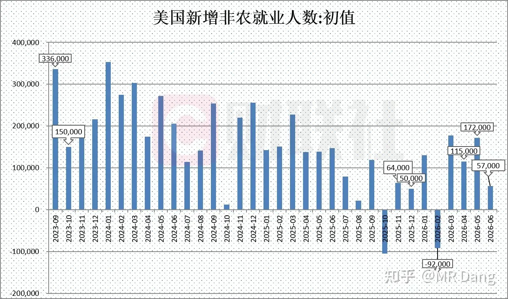
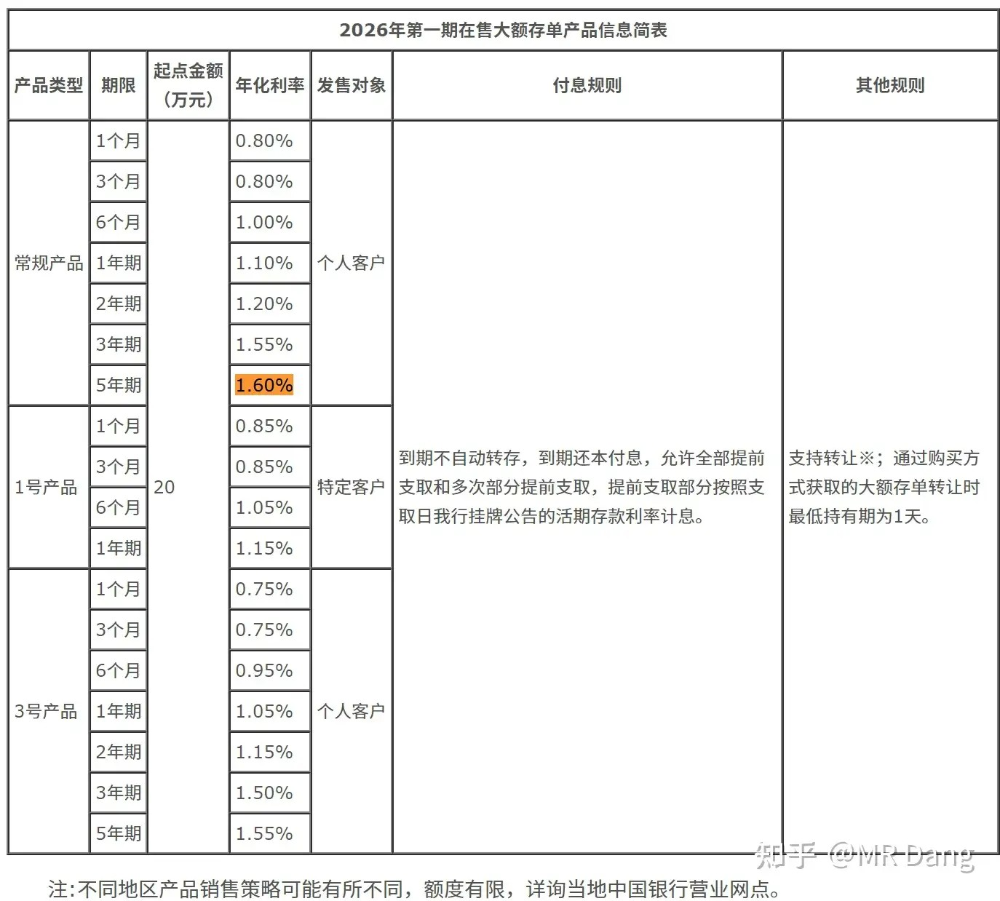
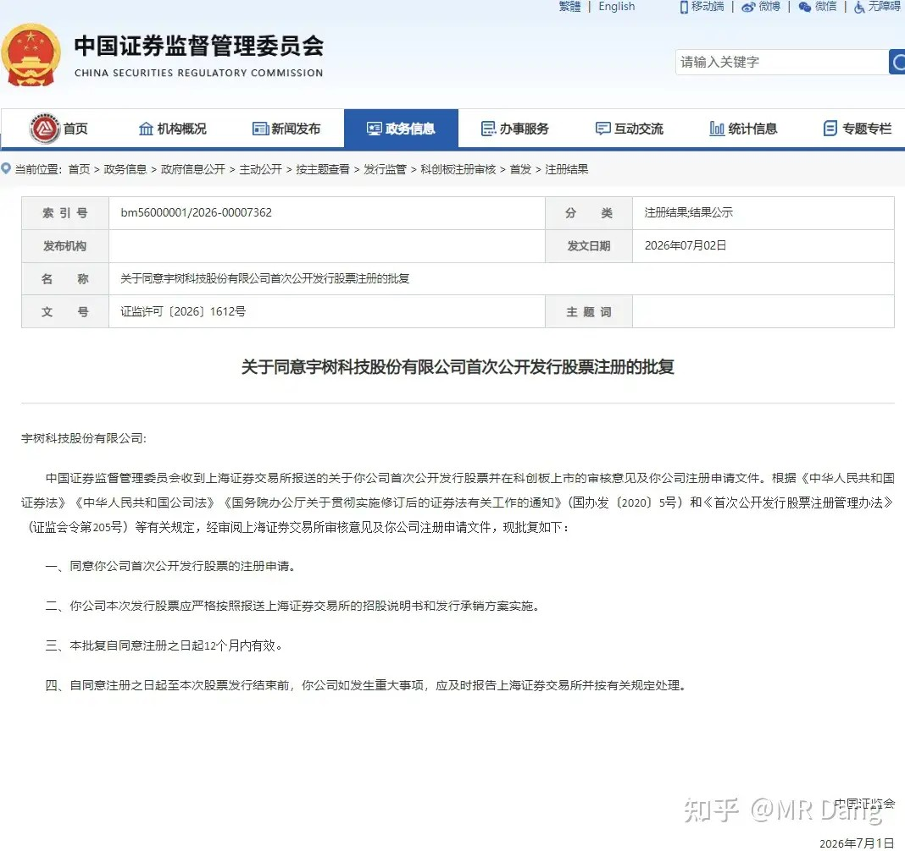
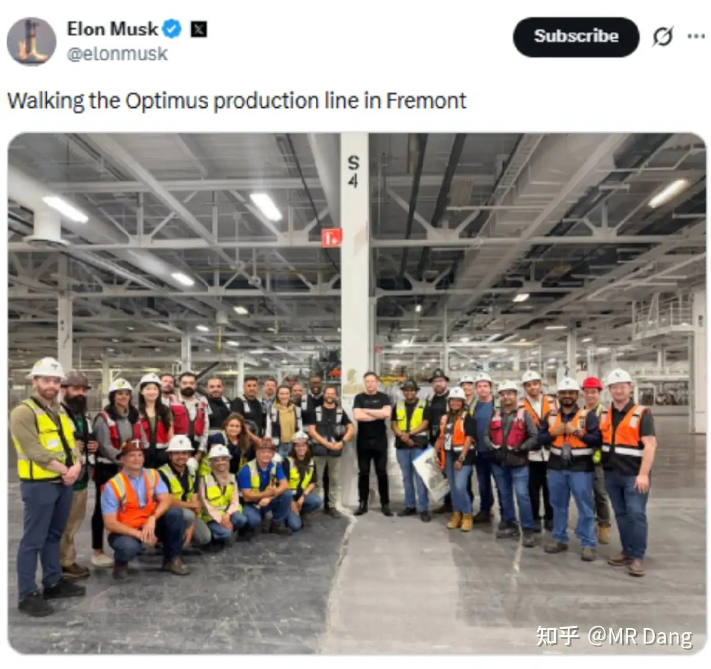
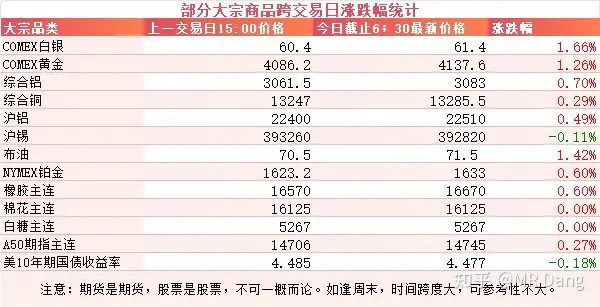
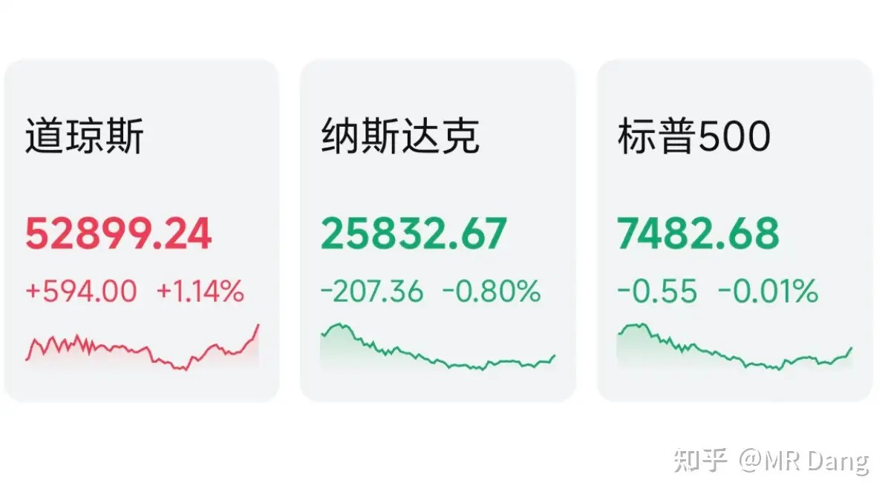

# 怎样看待2026年7月3号A股市场行情？

---

**发布时间**: 2026-07-03 07:28  |  **原文链接**: https://www.zhihu.com/question/2055737047265161338/answer/2056278216546038127  |  **点赞数**: 210 人赞同

**作者信息**: MR Dang | 独立投资人，《价值投资功法》作者，小红圈同名，无其他小号。

---

## 正文内容

今天最重要的就是西大非农数据：

5.7万的数据远低于机构预测的11.3万，几乎落在了所有主流机构预测的下限下面。

疲软的就业数据出来后，市场对加息预测从10月推迟到12月了，这个怎么算的，昨天已经科普过了。

有之前的小非农数据作为铺垫，这个大非农数据虽然在意料之外，倒也是情理之中。

4月就业数据下修3.1万，5月就业数据下修4.3万，两个月合计下修7.4万，比六月新增的都多。

换句话说，非农数据发布后，第二季度三个月加起来就业数据比之前两个月的数据都低。

另外失业率4.2%比预期的4.3%要低，也是很耐人寻味的。

就业数据下来了，为什么失业率反而降低了？

因为有70万人口退出了劳动力市场，直接不找工作了，就不纳入统计了。

时薪上涨了3.52%，说明通胀压力还在。

美联储现在比较难办，就业数据不支持加息，通胀压力又不支持降息，可能原地踏步才是最优解。

接下来的风向标就要看这个月中旬的CPI数据了。

中国银行上架五年期大额存单:

之前净息差压力大，国有大行和股份行都下架了五年期大额存单，中国银行这算是吃了个螃蟹。

不过这个利率感人啊，年化1.6%，五年加起来才8%。

前两天银行股跌的多的时候，股息率都干到7%了，吃一年股息快顶的上五年存单加起来了。

都有五年定存的决心了，还真不如银行股性价比高。

机器人板块：

国内这边是同意宇树注册，最快这个月就能上市，慢一点下个月也可以见面了。

老马那边是发了个合照，机器人生产线启动，老马画的饼是百万台级别，不过我个人保持怀疑。

今年有个上千台也很不错了，明年再搞个上万台算比较正常的速度。

植物人板块整天就是：

“啊，我要来了要来了。”

“你怎么还不来？”

“。。。已经来完了。。。”

大宗商品：

受宏观数据影响，有色品种表现不错，贵金属弹性相对更大。

A50期指有少许回暖迹象。

外围市场：

美三大指数涨跌不一，道指涨了一个多点，创历史新高，纳指回调，科技股表现不佳，存储走弱，除了科技其他板块基本都是涨的，风格转换比较明显。

昨天个人组合净值回血一个多点，银行红近两个半，资源红一个多，消费微红，电网绿四个。

下半年开局不错，两天就收复了上半年失地。

星期四确实有点说法在里面，昨天其实看着盘前情绪还可以，恒科里面的一些权重在美股表现也不错，没想到放了一个这么大的烟花。

科创50指数跌了7个多点，刚好挤进历史单日跌幅前三。

排在前面的只有去年4月7日跌了9个点，以及2020年2月3日，跌了14个点。

这也算是给新手投资者一堂风险教育课了，科技也不是无脑买就能赚钱的。

不过昨天挣钱的投资者也高兴不起来，因为只要昨天挣钱的，很多都是用挨打两个月的代价换来的。

别问我怎么知道的，头上伤口还没愈合。。。

价值投资里有一句话叫市场会奖励有耐心的投资者，这句话其实还有另一层隐含意思，就是市场会教育没耐心的投资者。

提前布局科技的，现在利润垫还很厚，回调一点不算什么，洒洒水啦。

而后面跟风买进去的现在就很尴尬了，扛也扛不住，跑又不甘心，进退维谷。

整个市场的风格出现了明显变化，老登比科技强势，小盘股比权重股强势，正好和上半年是反过来的，不知道算不算玄学。

哪怕是银行板块内部，股份行和城商行表现也比四大行更好，这也是比较少见的情况。

一个喜欢保护韭菜的博主，希望大家少少踩坑，多多赚钱！！！

> [!comment]- 点击展开评论
>
> | 用户 | 时间 | 内容 |
> | :--- | :--- | :--- |
> | 尘世中的修行 |  | 跌了这么久，跌了这么多，回暖一点点而已就收复失地了？我还差20个点才能收复失地～哪里出了问题？ |
> | 鬼大 |  | 这就收复失地了？？？我怎么还差得远的远的远 |
> | &nbsp;&nbsp;&nbsp;&nbsp;进击的缅A |  | 好好想想这是为什么？ |
> | &nbsp;&nbsp;&nbsp;&nbsp;小熊菠菜 |  | 嗯……我只能想到一种可能 |
> | &nbsp;&nbsp;&nbsp;&nbsp;Phelix |  | 套的浅呗，还能因为啥 |
> | &nbsp;&nbsp;&nbsp;&nbsp;樱桃老王子 |  | 算上学费今年属于没亏 |
> | 如来熊掌 |  | 真就全家一条裤子，谁出门谁穿 |
> | 浪里小白马 |  | 今天估计老登还是有裤衩的一天 |
> | 大明1521 |  | 还有一个消息你没有认真分析，那就是克里米亚的油价已经260卢布，相当于国内22块钱的油价了，这是否意味着电车可以大规模出口俄，特别是老欧洲加税的情况下，出口俄平替欧洲，缓解产能困难？ |
> | 在人间 |  | 昨天仅剩的科技基金竟然跌了九个多点。。。 |
> | Vijay |  | 老师，铝还有救吗，亏了30个点 |
> | &nbsp;&nbsp;&nbsp;&nbsp;一枚蒜头 | 5 小时前 | 赶紧卖 |

---

*本文件从MR Dang知乎页面转载*

---

**作者**: MR Dang
**链接**: https://www.zhihu.com/question/2055737047265161338/answer/2056278216546038127
**来源**: 知乎

*著作权归作者所有。商业转载请联系作者获得授权，非商业转载请注明出处。*
