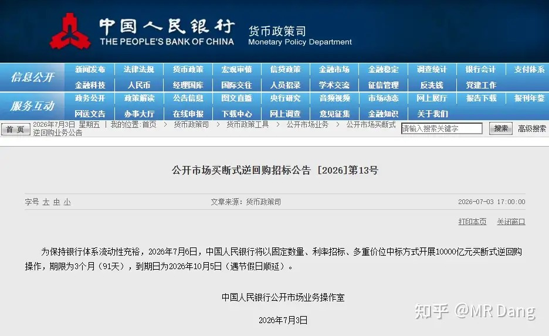
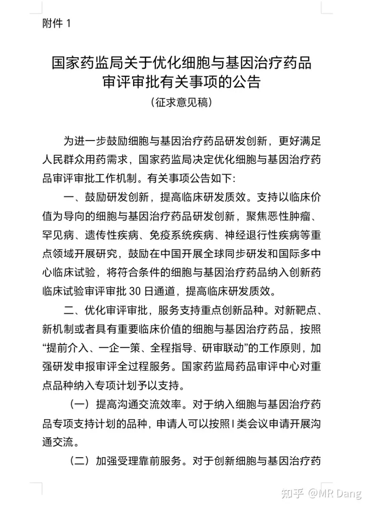
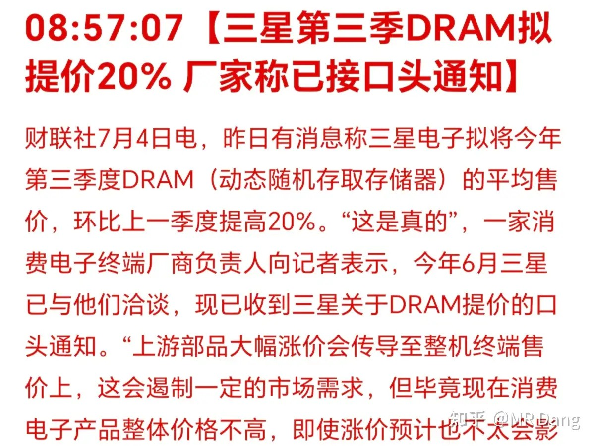
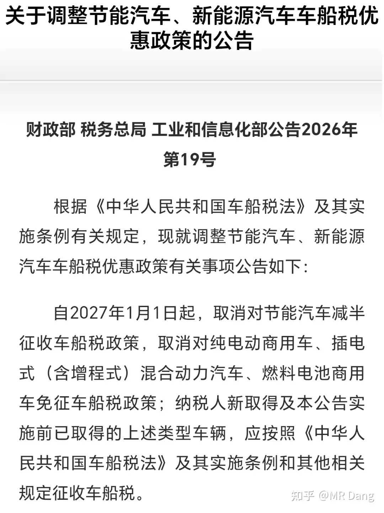
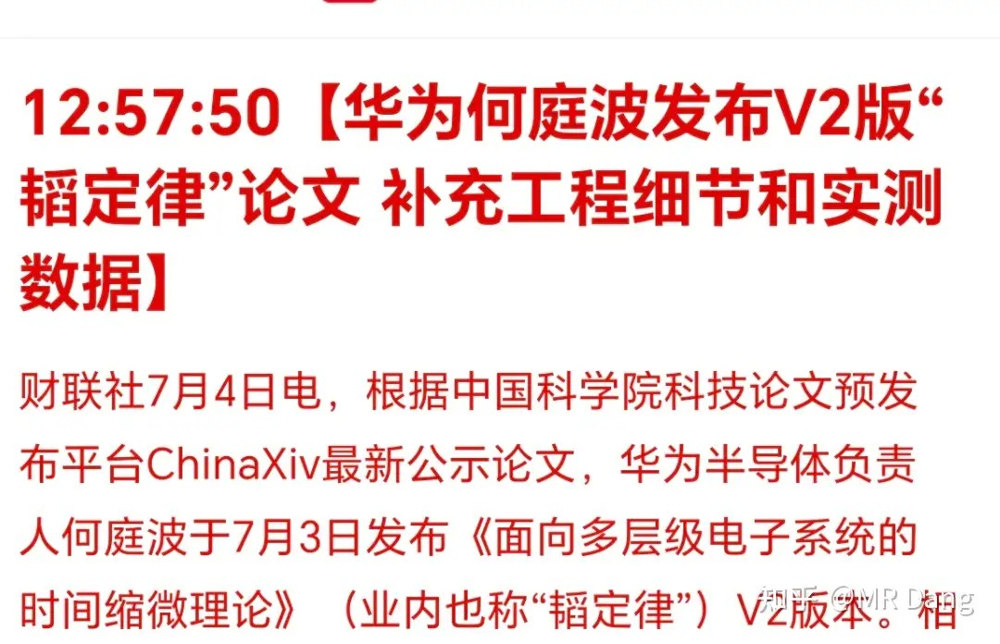
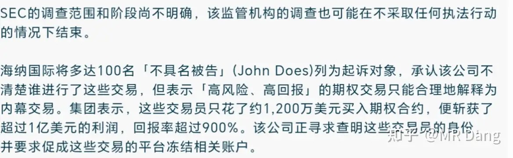
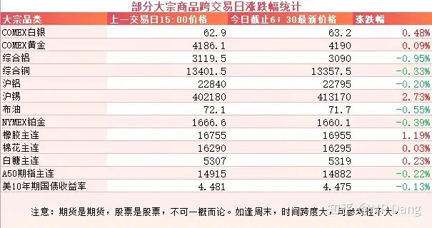

# 对2026年7月6日A股市场行情，大家有什么看法？

---

**发布时间**: 2026-07-06 07:32  |  **原文链接**: https://www.zhihu.com/question/2056296502738400841/answer/2057366256370634904  |  **点赞数**: 173 人赞同

**作者信息**: MR Dang | 独立投资人，《价值投资功法》作者，小红圈同名，无其他小号。

---

## 正文内容

先把周末发生的事情过一遍：

央行投放万亿流动性:

说万亿是为了听着唬人，其实有8000亿到期，所以净投放是2000亿。

不过即使是2000亿也能提供不少流动性了，就看大A能不能争点气了。

创新药：

有关部门发布了《关于优化细胞与基因治疗药品审评审批有关事项的公告》。

最重要的一点是大大加快了细胞与基因治疗药品的临床审批速度，开通了30日通道。

而在此之前，一般都需要半年以上，有的甚至需要一年。

对药企来说，可以大大降低时间成本，在这种分秒必争的行业里算是不小的利好了。

这一行简称CGT，其中最有名的当属CAR-T，几年前新闻报道里上百万治疗费用的特效药说的就是它。

它的原理是把T细胞从患者体内取出，做一定的改造升级后再输回患者体内，患者定向免疫能力就会大大增强，疗效显著，是未来的主流方向之一。

如果30日通道落实，最主要利好的是CGT自研企业，国内大概十来家左右，还有CGT的CXO企业，有个五六家左右。

但是这行个股风险大，如果考虑布局的话，其实创新药ETF也不错，减少了个股风险。

我个人对这行业不放心，但是老实说目前估值不高，并且利好挺多的。

DRAM涨价：

三星第三季度DRAM涨价20%。

利好存储板块，包括马上上市的国内存储龙头。

还有模组厂商，相当于存货又升值了。

车船税调整：

车船税不是购置税，和新车二手车无关，是每年都需要交的税种，一般都是和交强险一起交。

以前增程，混动，电动都是有优惠的，现在新的政策从明年起，取消了对增程和混动的优待，只保留了纯电车型的优惠。

所以受影响比较大的就是增程和混动车企，每年几百块的额外用车成本可能会影响消费者的选择倾向。

随着扶持力度的减少，车企的竞争压力还会加剧。

韬2.0：

有投资者戏称为套定律，我也看不太懂具体的细节，只是注意到V2版本和之前的最大区别就是从PPT变成了工程落地，不再是纯理论。

天眼星人被西大诉讼：

简单的说，就是上次富途和老虎的事，有开了天眼的利用期权赚了一亿绿票子，10天赚了9倍。

赚的是做市商海纳国际的钱，因为做市商并不知道内幕消息，所以就接下了这个对赌。

现在输了气不过，就把100多个天眼星人账户全部起诉了，目前正在快速推进，最新进展已经把这些账户全部冻结。

其实某些别的市场这种提前涨停或者跌停的事情并不罕见，投资者都习以为常了，没想到西大可不惯着，动真格的了。

大宗商品：

周末大宗商品价格变化不太明显，处于正常波动范围内，有色里锡的波动幅度比较大，涨了近3个点。

农产品里，橡胶有一个点的涨幅。

外围市场：

上周五美股休市。

上个交易日个人组合净值回血近一个半点，银行红大半个，资源红三个，消费红三个，电网红半个。

很舒服的一个交易日，整体持仓表现都不错。

市场风格上老登和科技经历了一天的缠斗，最后还是老登抢到了大裤衩。

盘中的时候我把最后仅剩的一点氟化工方向的比例进行了调整。

行业固然是很景气的，但是预期也兑现了不少，算了算值搏率，感觉没必要拿着了，有更多便宜的东西可以考虑。

另外周末有个教育公司，因为带颜色的评论诡异的爆火网络，被戏称为有色龙头。

一般这种看似离谱的话题可以火，背后都有资本推波助澜，有想排队搞一下想法的散户还是悠着点比较好。

本周前瞻：

1，周四发布国内CPI数据，前值1.2%，预期1.2%。

2，周四有美联储的会议纪要。

3，周四公布西大初请失业金人数。

一个喜欢保护韭菜的博主，希望大家少少踩坑，多多赚钱！！！

> [!comment]- 点击展开评论
>
> | 用户 | 时间 | 内容 |
> | :--- | :--- | :--- |
> | 四畳半主义者 |  | 现在连业绩预告都点评也没有了嘛= = |
> | &nbsp;&nbsp;&nbsp;&nbsp;青山常在 |  | 业绩是用来干嘛的？业绩好的就要涨停吗？ |
> | &nbsp;&nbsp;&nbsp;&nbsp;四畳半主义者 |  | 啊？合着投资都不需要看业绩了吗？龙头战法那要是不需要，那你多买点业绩暴雷的，祝你好运 |
> | &nbsp;&nbsp;&nbsp;&nbsp;青山常在 |  | 哥，其实我是在说大a。我买的国泰海通半年报创出新高，结果今天居然差点绿了。离谱吧，券商航母业绩打出新高度，尤其相对一季度的情况，更是堪称完美，结果今天这个走势，我真的笑了。满仓头部和中型券商，目前证券板块业绩打出新高度，今年居然是相当长的时间都是亏本，现在也就刚刚回本所以我说这个业绩和股票价格没关系吧，反正都是炒作，没几个人看业绩了 |
> | 提交 |  | 评论区人数越来越少了，是时候加仓了。0626尾盘建仓的绿桥已经拿到3%利润了，美滋滋 |
> | &nbsp;&nbsp;&nbsp;&nbsp;资本主义必将消亡 |  | 牛的 |
> | 办公室小肖 |  | 课代表怎么了 |
> | &nbsp;&nbsp;&nbsp;&nbsp;JSJSSH |  | 课代表退市了 |
> | &nbsp;&nbsp;&nbsp;&nbsp;Candy |  | 课代表在绿桥被stl |
> | flkls |  | 大佬们 易方达精选混合最近暂停购买了 这个怎么说之前每天限购 20 |
> | 小小柳生 |  | 前段时间老登股跌太多了，疯狂抄底，今天吃爽了 |
> | 两江的雨季 |  | 每年心疼那几百块钱的就别买车了 |
> | 簌簌 |  | 可否命名七月为：回本月！早！ |
> | &nbsp;&nbsp;&nbsp;&nbsp;夜色下的荣耀 |  | 纯电好啊，纯电得用铝啊 |

---

*本文件从MR Dang知乎页面转载*

---

**作者**: MR Dang
**链接**: https://www.zhihu.com/question/2056296502738400841/answer/2057366256370634904
**来源**: 知乎

*著作权归作者所有。商业转载请联系作者获得授权，非商业转载请注明出处。*
