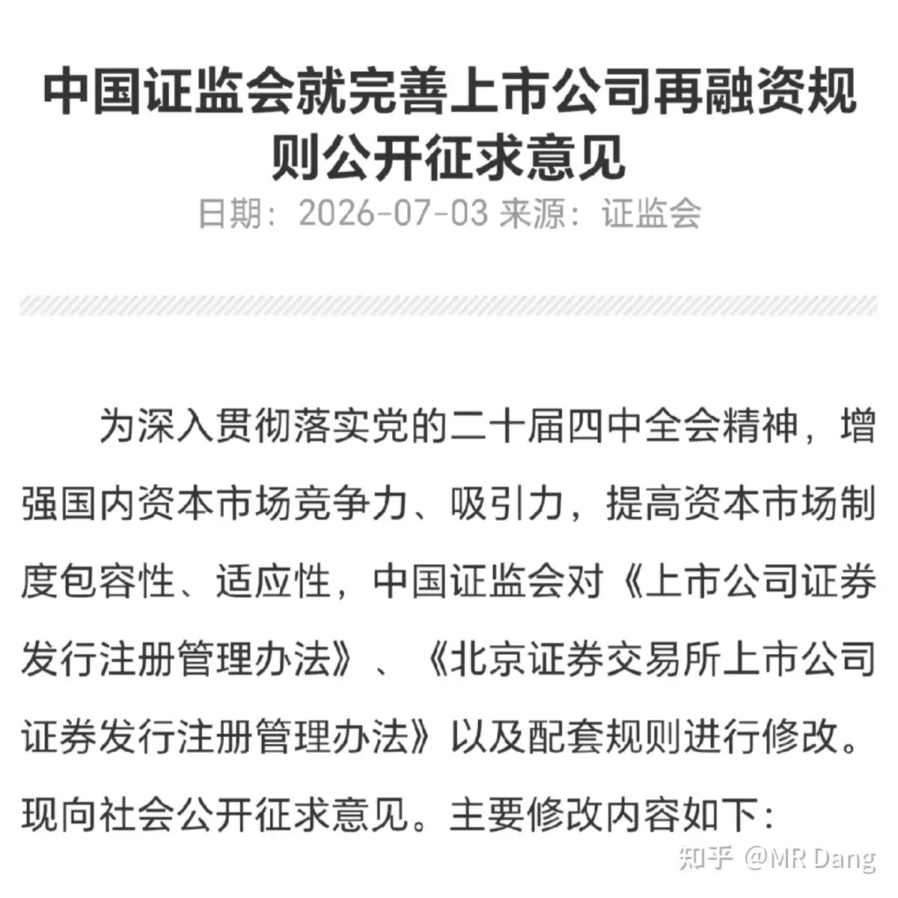
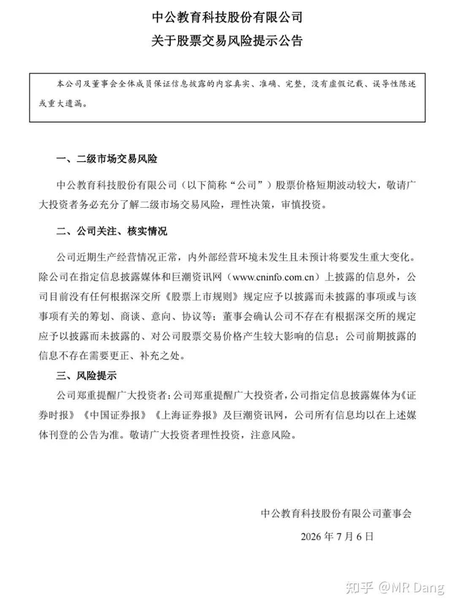
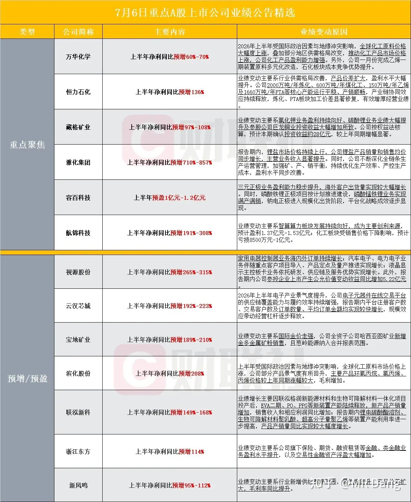
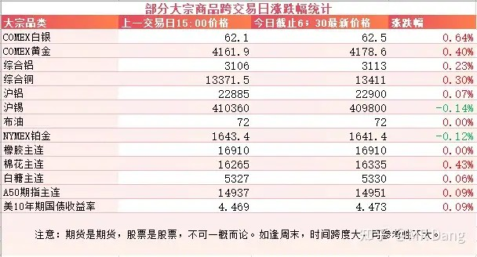
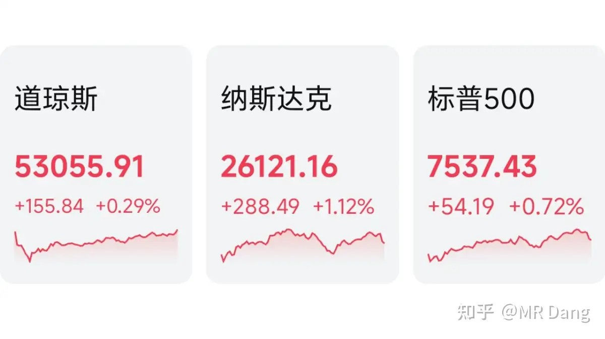

# 如何看待2026年7月7日的A股行情？

---

**发布时间**: 2026-07-07 07:36  |  **原文链接**: https://www.zhihu.com/question/2057390525431406605/answer/2057729682326415269  |  **点赞数**: 168 人赞同

**作者信息**: MR Dang | 独立投资人，《价值投资功法》作者，小红圈同名，无其他小号。

---

## 正文内容

周末还有个融资的文件，因为篇幅所限，昨天没有展开讲，今天先补上。

市场对融资还是比较敏感的，改革的地方挺多，我挑几个重点的说。

一是建立了储架发行制度，减少对市场的短时间冲击。

以前是一次注册，一次发行，公司如果要融资一百亿，一次就抽这么多血。

现在可以一次注册，多次发行，公司如果要融资一百亿，可以一次申请额度，然后根据市场情况慢慢抽血一百亿，比如一个月抽10个亿，连续抽十个月。

这个算利好。

二是小额快速融资额度翻倍，这个偏利空。

三是定增发行价以发行期首日为基准日。

这个属于被低估的利好：以前定增的时候，基准日选择比较多，机构可以合理利用规则低价拿筹码，然后二级市场高价卖出。

现在堵死了这个口子，对散户是利好，对做一级半市场套利的机构是利空。

其他还有些小的利好，比如鼓励大股东增持，减少审批手续，收紧可转债的监管，还有募集资金必须聚焦主业。

以后IPO募资一堆钱，然后转身买理财产品的乱象就很难见到了。

这些规则目前不针对个股，也不针对哪个行业，如果落地，利好利空也是长期影响，不会在短时期内显现。

属于影响不小，但是不会立竿见影的政策，特别是定增基准日的规则，对散户来说公平性大幅增加，只有被定增坑过的散户才知道这个补丁打的有多好。

机器人：

昨天一边码字，一边听旁边的挪威打巴西。

中场休息时，看到一个机器人模仿哈兰德，有点忍俊不禁。

这款机器人叫Atlas，是知名品牌波士顿动力的产品。

记得几年前看波士顿动力的液压机器人时感觉像在看科幻片，没想到几年过去，波士顿动力押错了技术路线，被卖给了现代集团，现在又东山再起。

这款机器人目前参数在国际上属于第一梯队，综合性能保守一点说可以达到世界前三的水平。

供应商包括英伟达，海力士，三星等。

当然也少不了中国供应链的影子，据说目前的占比已经在65%以上。

很多耳熟能详的A股上市公司都是它的供应链。

某教育发布风险提示：

深交所盘后也发布了公告，对个别投资者采取了暂停交易等监管措施。

难为董秘了，辟谣都不好把谣言写完整，写的含含糊糊的，大家都知道怎么回事，又只能装作不知道，挺魔幻。

不知道董秘写公告的时候绷住了没有。

部分企业业绩预告：

主要集中在化工行业比较多。

大宗商品：

有色集体表现较好，但是幅度不大，都在正常波动范围内。

其他品种振幅也不大，风平浪静的一天。

外围市场：

美三大股指收红，道指创新高，纳指领涨，科技板块表现不错。

三星发布了财报，营收和净利润都小超市场预期，一个季度营业利润89万亿韩币，大约相当于4000亿红票子左右。

昨天个人组合净值回血一个多，银行红两个点，资源红大半个点，消费红一个半，电网绿两个。

很不错了，毕竟指数表现不佳，三大股指都是绿的，上涨和待涨股票的数量比例大概是一比二，中位数大概是回撤了一个点左右。

科技又回调了，还是有点点出乎意料的，盘前利好不断，氛围热烈，还想着老登又要挨打。

我没有科技，不打算现在参与，那是因为我衡量了一下，承受不了科技回撤的风险。

但即便是我这样的老登，其实心里多半还想着大概科技还会有行情，也不太相信科技就这么简单落幕。

一个喜欢保护韭菜的博主，希望大家少少踩坑，多多赚钱！！！

> [!comment]- 点击展开评论
>
> | 用户 | 时间 | 内容 |
> | :--- | :--- | :--- |
> | 小搬砖工 |  | 除了表情包，再也不会向以前一样认真回复了 |
> | &nbsp;&nbsp;&nbsp;&nbsp;墨尔本啊 |  | 开圈子时提到过，账户会交给团队人员帮忙管理 |
> | 潭轩 |  | 老师今天似乎比平日晚了一些。如果可能的话能否聊聊有色，比如金银和铜铝？ |
> | &nbsp;&nbsp;&nbsp;&nbsp;一叶知秋亦障目 |  | 有色绕不开中公吧 |
> | &nbsp;&nbsp;&nbsp;&nbsp;潭轩 |  | 那是和西瓜有关吧 |
> | Young |  | 铝怎么看，老师 |
> | 簌簌 |  | 是谁两头挨打？是我！早安！ |
> | &nbsp;&nbsp;&nbsp;&nbsp;边看日落边发呆 |  | 也是我 |
> | 何必 |  | 我在光里 挨两周打了 |
> | 池休 | 14 小时前 | 两天收复失地，这是真股神 |
> | 池休 | 14 小时前 | 两天收复失地，全网第一人 |

---

*本文件从MR Dang知乎页面转载*

---

**作者**: MR Dang
**链接**: https://www.zhihu.com/question/2057390525431406605/answer/2057729682326415269
**来源**: 知乎

*著作权归作者所有。商业转载请联系作者获得授权，非商业转载请注明出处。*
