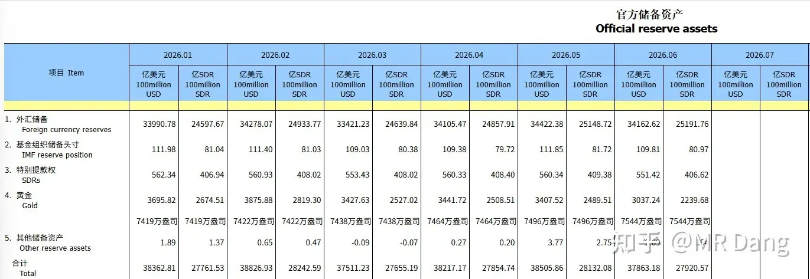
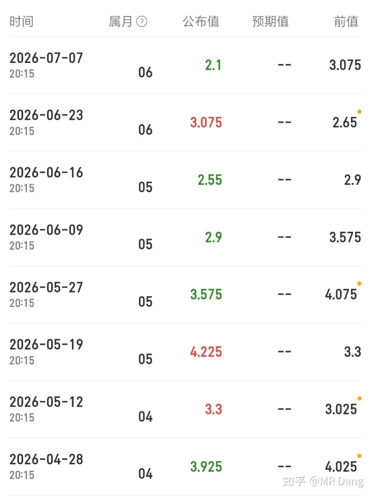
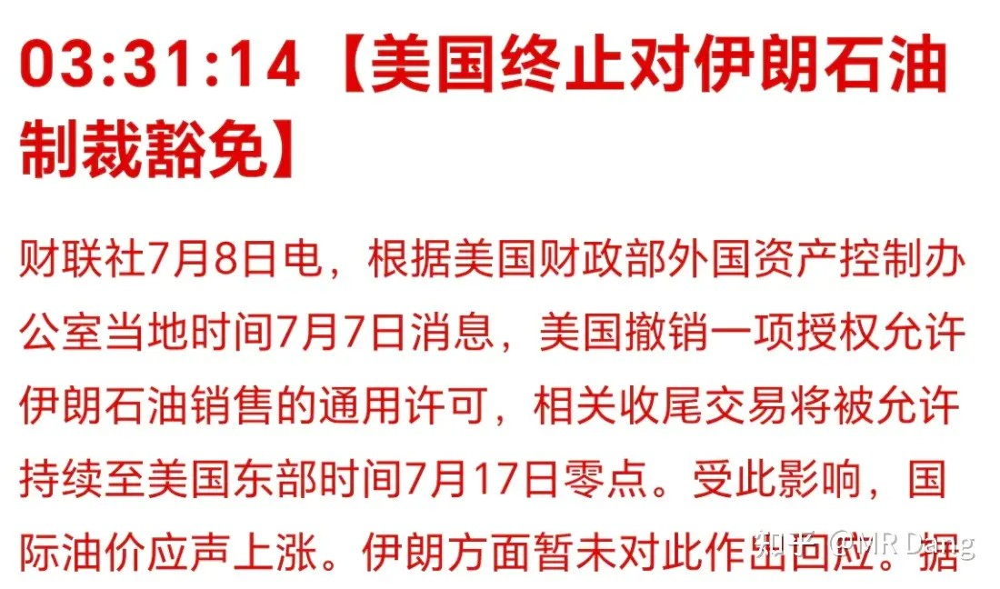
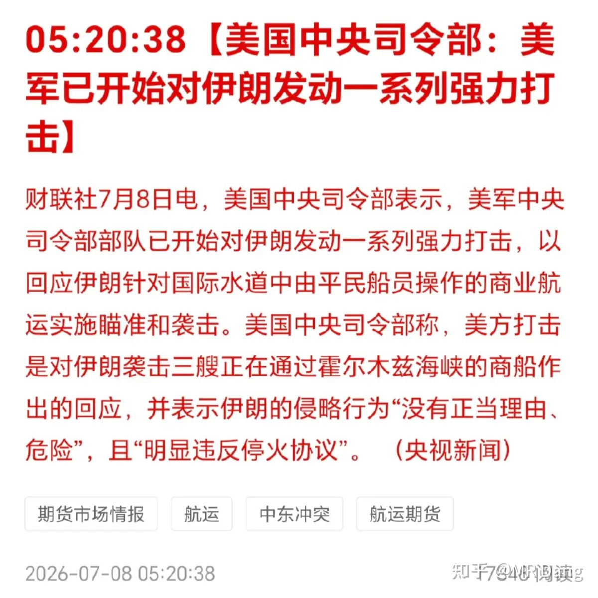
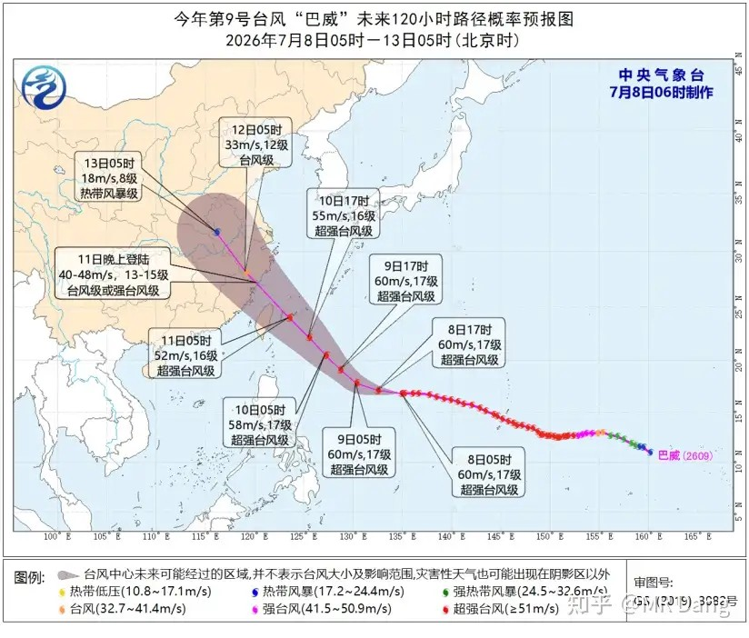
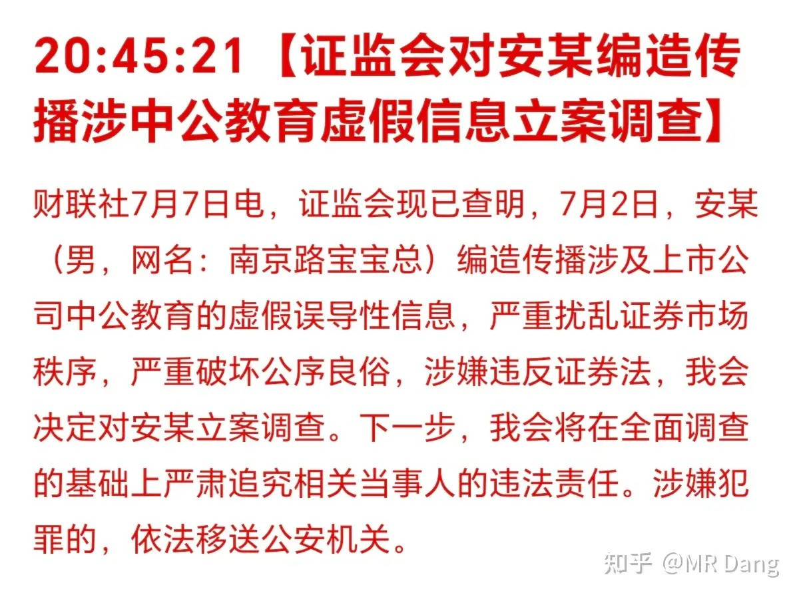
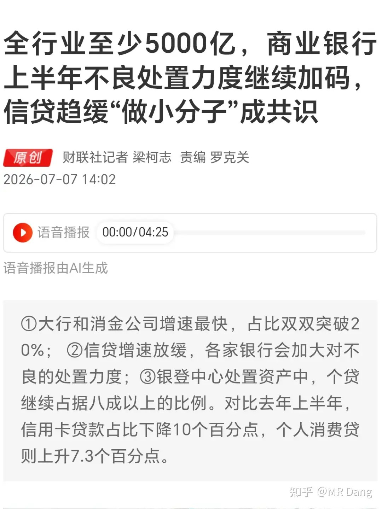
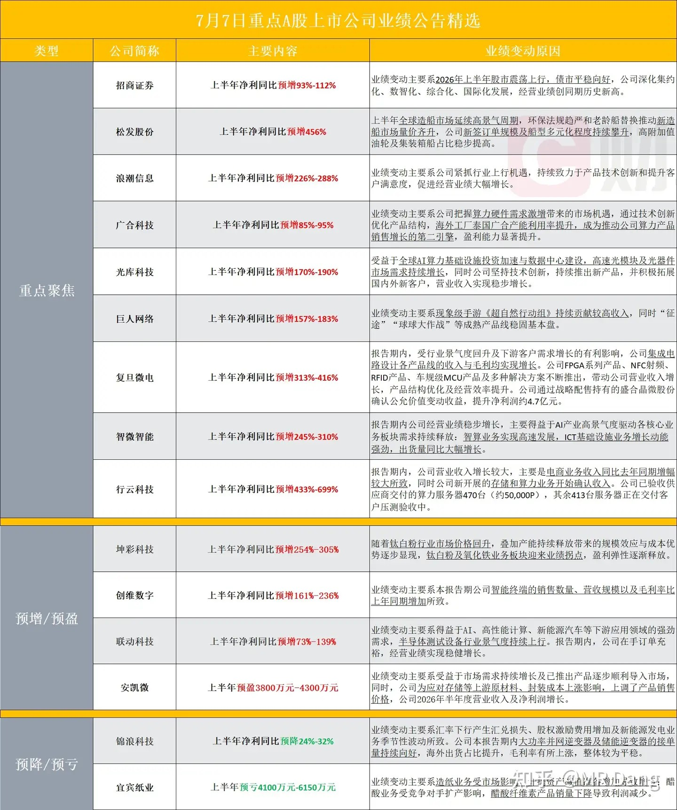
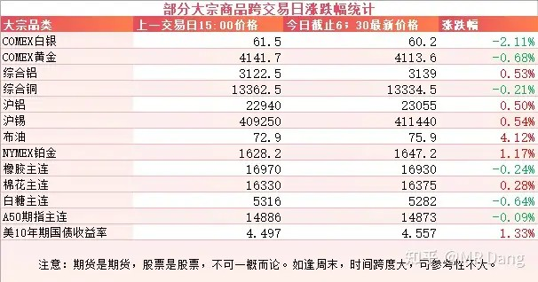
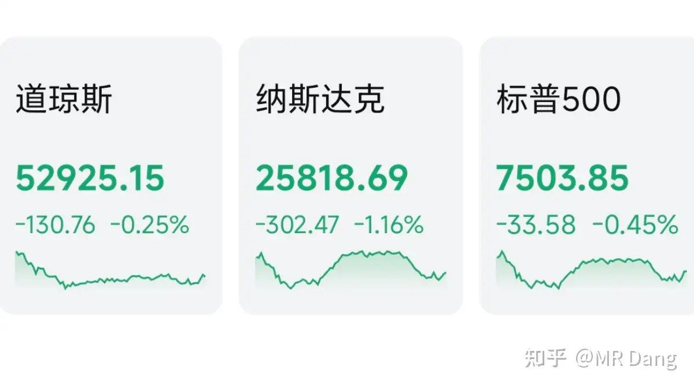

# 对2026年7月8日A股市场行情，大家有什么看法？

---

**发布时间**: 2026-07-08 07:29  |  **原文链接**: https://www.zhihu.com/question/2057749562689953976/answer/2058090433834651873  |  **点赞数**: 210 人赞同

**作者信息**: MR Dang | 独立投资人，《价值投资功法》作者，小红圈同名，无其他小号。

---

## 正文内容

头条还是给到央行买金：

6月买金48万盎司，创近期买金速度新高。

5月其实已经很猛了，买了32万盎司。

没想到6月买金速度还能往上提，一个月买了48万盎司，大超市场预期。

金价贵的时候每个月只买两三万盎司，和现在的买金速度不可同日而语。

美国ADP：

西大上周的ADP就业人数不及预期，前值3.075万人，披露数据2.1万人。

疲软的就业不利于加息。

西大恢复对伊朗石油的制裁：

原油价格受此影响上涨，贵金属价格回落。

西大又对伊朗动手了。

台风将至：

巴威大概三四天后登陆沿海地区，目前风力比较大，17级，可能登陆的时候也有13到15级。

当然咱们这里不是天气预报，大家注意人身财产安全的同时也可以研究下对金融市场的影响。

一方面是影响港口，因为登陆地区在福建浙江一带，所以一些重要的港口可能封港。

通过这些港口进出的物资可能会局部紧缺，造成化工品种的短期价格波动，主要是石化产品。

还有一些海鲜也从那边进口，未来两三周像帝王蟹之类的大概也会涨价。

另一方面是农产品，比如甘蔗之类的，7月也长的挺高的了，根也比较浅，可能扛不住台风这么吹，可能会大面积倒伏，最后也许会影响白糖的供应端。

[某教育](/stocks/002607.SZ)：

发帖的是个男的，被监管了。

之所以会出现这么魔幻的场景，一方面是猎奇心理。

另一方面也是现在市场没有热点，恰好给了这些风险偏好高的资金一个目标明确的捷径。

要是搁在一个月前科技股欣欣向荣的时候，到处都是热点，资金注意力都在别的地方，根本没空搭理。

还有个别投资者想模仿一下，甚至给自己持有的股票引流的，恐怕不是好主意，不要到头来画虎不成反类犬，被监管铁拳。

银行业：

有报道称商业银行上半年不良处置继续加码，粗略合计上半年全行业不良资产处置至少超5000亿元。

那作为对比，同口径下，2023年大概是3200亿，2024年大概是4000亿，去年大概是4800亿，所以今年这个5000亿从增速上来说不算很高。

银行对坏账的处理各有偏好，有些银行喜欢遮盖，通过各种调节，缓慢释放。

有些银行喜欢暴露，坏了就核销。

部分企业业绩预告：

大宗商品：

受伊美局势影响，原油价格重回75美元上方，贵金属回调，工业金属铝和锡表现较好。

美长债收益率重回4.55分水岭上方，这不是积极信号。

外围市场：

美三大股指收绿，纳指领跌，科技股回调。

板块上医药股等传统行业表现较好。

昨天个人组合净值回撤一个多，银行绿近半个，资源绿三个多，电网绿三个半，消费微绿。

整体市场给人的感觉非常沉闷，没有热点。

以前老登和科技还有个裤衩来回抢，谁抢到了谁出来溜达。

昨天直接没裤衩了，老登科技一起光着腚。

两市不到700只股票上涨，另外近4800只股票待涨，市场中位数跌了将近3%。

所以昨天浮亏三个点以内的投资者也无需沮丧，市场如此，如之奈何。

为什么价投不喜欢看盘，一是没时间看，二也是为了身体健康，像昨天的盘面盯着看，是容易抑郁的。

昨天看到媒体报道高善文博士去世，非常唏嘘，他是业内著名的专家学者，有很多精妙的分析，比如刘易斯拐点。

他还有一副自嘲的对联，上联是“解释过去头头是道，似乎有理”，下联是“预测未来躲躲闪闪，误差惊人”，横批“经济分析”。

事实上他的预测非常精准，这明显是谦虚的说法。

但这也从侧面说明预测未来的难度太大，即使是专家学者也感觉棘手。

所以我的策略就是放弃预测，只做应对。

一个喜欢保护韭菜的博主，希望大家少少踩坑，多多赚钱！！！

> [!comment]- 点击展开评论
>
> | 用户 | 时间 | 内容 |
> | :--- | :--- | :--- |
> | 骄阳似火 | 13 小时前 | 如大佬所愿，飞机王业绩暴增 |
> | &nbsp;&nbsp;&nbsp;&nbsp;感受世界的善意 | 11 小时前 | 一直拿着，希望如愿 |
> | &nbsp;&nbsp;&nbsp;&nbsp;子午线 | 10 小时前 | 奔着跌停去了 |
> | &nbsp;&nbsp;&nbsp;&nbsp;骄阳似火 | 9 小时前 | 我也是无语，我预期是净利润同比增长120%左右，实际同比增长263%，还以为今天稳了希望只是假摔吧 |
> | &nbsp;&nbsp;&nbsp;&nbsp;骄阳似火 | 9 小时前 | dang老师，业绩这么好今天为啥跌的这么惨，还是说应该剔除一次性收益16亿来看？属实没明白，要是半导体有这个业绩，应该一字了吧希望只是假摔吧 |
> | 鹰目婲盗 | 13 小时前 | 我昨天浮亏0.6%左右，这么说我还该开心呢 |
> | &nbsp;&nbsp;&nbsp;&nbsp;MR Dang | 13 小时前 | 很厉害了 |
> | teng110cn | 12 小时前 | 原油怎么看？ |
> | Pigeon | 6 小时前 | 继续坚定持有绿桥 |
> | &nbsp;&nbsp;&nbsp;&nbsp;资本主义必将消亡 | 2 小时前 | 我最起码也要等半年报才能死心 |
> | &nbsp;&nbsp;&nbsp;&nbsp;溪风 | 2 小时前 | 28.4进场，陆陆续续补到22，希望两年内能回本。 |
> | Wien落榜大宝宝 | 3 小时前 | D指数回暖，老登股或有一定风险 |
> | 鹿港小菇凉 | 8 小时前 | 放弃预测，只做应对，我躺平了。 |
> | &nbsp;&nbsp;&nbsp;&nbsp;大道无情 | 6 小时前 | 跌下神坛的大佬 |
> | 疯子 | 5 小时前 | 广合科技今天上去又下来，尾盘还被砸了。小仓位入了点 |
> | Nepheshel | 13 小时前 | 很早就放弃预测了 但是不知道怎么应对 来来回回就是一直没动 |

---

*本文件从MR Dang知乎页面转载*

---

**作者**: MR Dang
**链接**: https://www.zhihu.com/question/2057749562689953976/answer/2058090433834651873
**来源**: 知乎

*著作权归作者所有。商业转载请联系作者获得授权，非商业转载请注明出处。*
