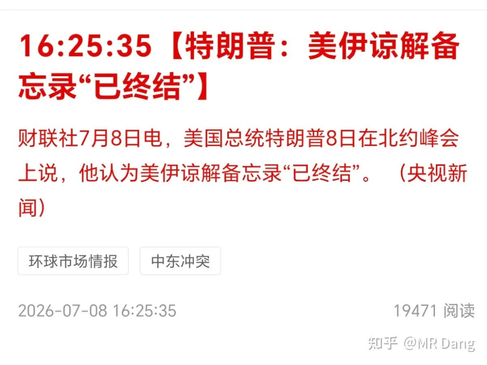
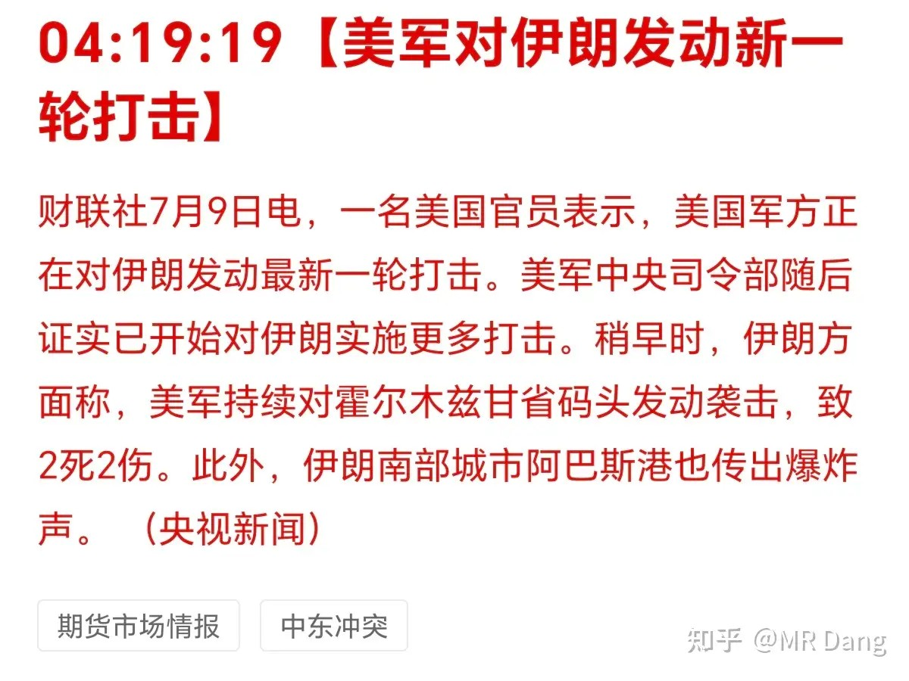
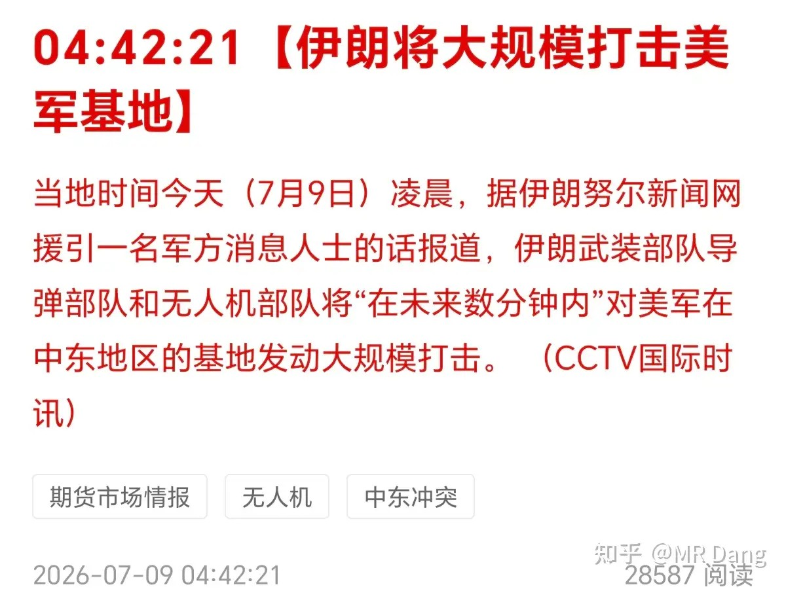
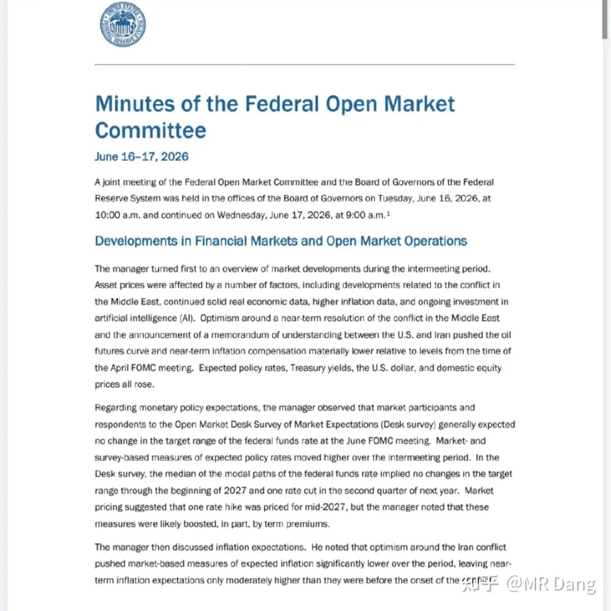
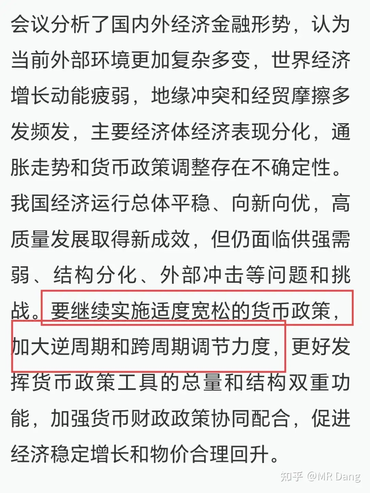
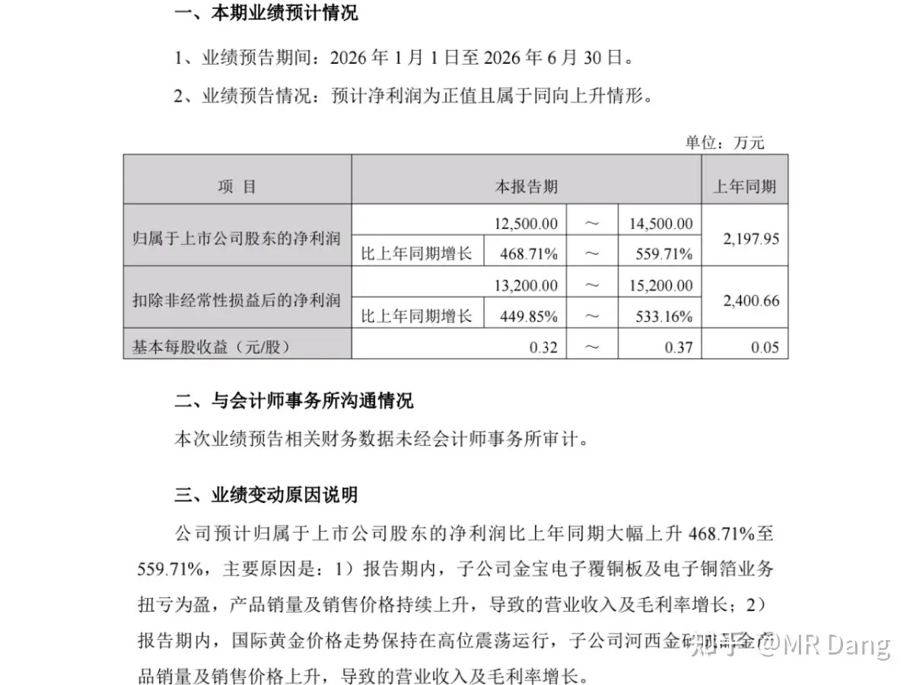
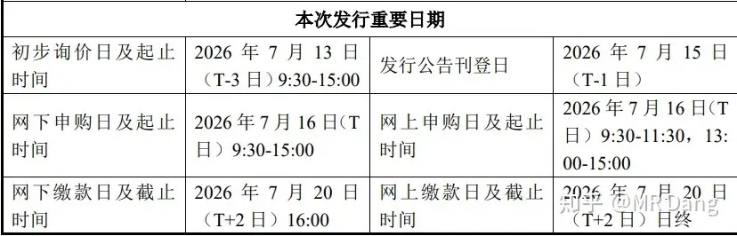
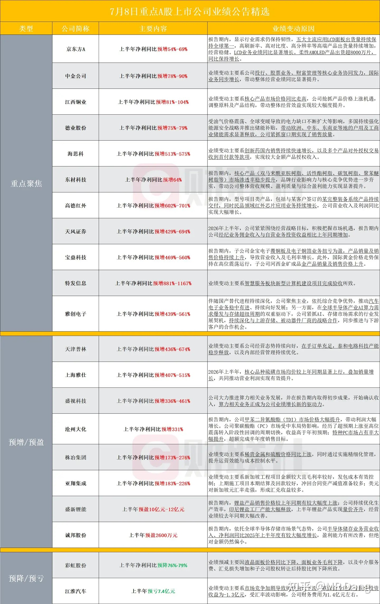
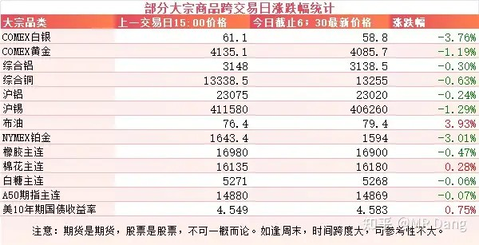
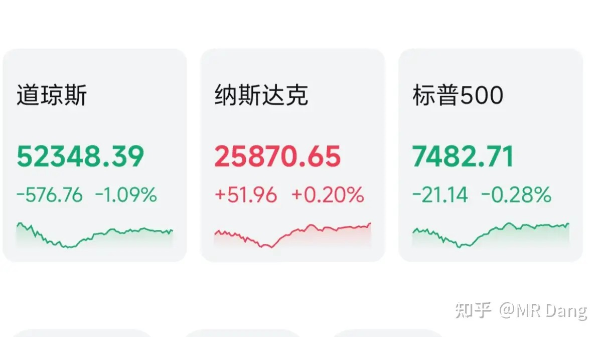

# 如何看待2026年7月9日A股市场行情？

---

**发布时间**: 2026-07-09 07:33  |  **原文链接**: https://www.zhihu.com/question/2055953904702166862/answer/2058453640260629896  |  **点赞数**: 219 人赞同

**作者信息**: MR Dang | 证券从业资格证持证人

---

## 正文内容

“终结者”懂王：

这备忘录的时效才20天就作废了。

几个小时前两边又打起来了。

事情其实挺简单的，伊朗让商船走霍尔木兹海峡的时候走他们那边，接受管理。

有些头铁的船不愿意接受管理，走的是另外一边，被伊朗攻击了。

美国以此为借口，就把伊朗炸了，矛盾就开始升级。

然后又是老剧本，原油价格上涨，通胀预期抬头，贵金属跳水。

美联储发布了最新的FOMC议息纪要：

对比决议发布会的话，有几处细节存在差异。

第一个是鹰派比当时点阵图里表现的更积极，按会议纪要的说法，当时就有官员认为6月要立即加息25个基点。

第二个是把Ai投资列为了通胀推手，之前沃什Ai降通胀的观点被彻底扔进了废纸篓里。

第三个是Ai加剧了贫富分化。

高收入家庭有股票，Ai让股市上涨，提高了高收入人群的收入。同时Ai让物价上涨，提高了低收入人群的生活成本，低收入人群已经在靠信贷续命。

而过多的低收入人群进入信贷市场，就会让私人信贷市场累积风险，这是整个金融市场的隐忧。

东大央行开会：

很多投资者不爱看这种例会，觉得没意思，都是车轱辘话，也没什么新意。

其实这种通稿需要找关键词，就像做阅读理解一样，找词眼。

昨天开会的词眼就是加大逆周期调节力度。

两层意思，一是目前正在逆周期调节。

二是未来还会加大。

逆周期什么意思，环境热的时候降温，环境冷的时候加热。

那现在属于哪种情况，不难判断吧。

再联系这个月净投放的2000亿流动性，其实就是告诉市场要稳定信心，还会提供流动性的。

某覆铜板企业发布了业绩预告：

作为这个行业率先发预告的企业之一，同比虽然看着还不错，但是算下来二季度和一季度基本持平，没啥增长。

目前的估值逼近100pe了。

当然不是针对某家企业，我是想表达目前这个赛道太拥挤了，预期打的太满了，但是业绩暂时还跟不上给的预期。

不只是覆铜板，其他科技行业也存在这样的现象，这也是我一直不敢追高科技的原因，和国外的科技企业在盈利能力方面还存在客观上的差距。

长鑫上市进展：

7月16打新，也就是下周四。

7月20缴款。

喜欢参与打新的，日子别忘了，说不定就中了呢。

部分企业业绩预告：

有几家企业业绩还蛮不错的。

大宗商品：

受美伊局势影响，原油上涨近四个点，贵金属普遍回调，黄金白银回调较多。

其他工业金属表现相对克制，铜铝都在正常波动范围内。

农产品最近一段时间以来都比较疲软。

美10年期国债收益率走高，依然在4.55分水岭上方。

外围市场：

美三大股指涨跌不一，纳指领涨，道指回调，存储板块表现较好。

昨天个人组合净值回撤半个多点，银行红半个多，资源绿近三个，电网绿三个半，消费绿一个。

电网是我持仓风格里唯一能蹭到科技概念的，最近回撤也挺大的，像个皮卡丘一样，天天放电。

这是我能接受的最大尺度了，如果有老登投资者打心眼里觉得自己是不是要配置一点高科技的行业，看着科技吃肉眼馋的不行，那我觉得可以考虑一下这个方向。

昨天市场从早晨开始就很拧巴，科技看棒子的脸色，老登看科技的脸色，反复争夺交易风格的话语权。

结果两边都没抢到红裤衩，反而让恒科扯下来戴到头上了，扬眉吐气了一把。

恒科经过这么一根大阳线，有点右侧的意思，会吸引一些右侧交易者的加入。

对大A来说，现在已经进入资本市场的中场休息时间，赚钱效应持续减弱。

1500多家上涨，另外近3800家待涨，市场中位数大约是跌了一个半点。

还是那句话，能跑赢中位数就不错了，盯着指数看只会让自己陷入无意义的内耗和自我怀疑。

最近市场业绩预告比较密集，大家会发现一个令人困惑的景象，除了特别爆炸的业绩，很多公司的短期二级市场表现和业绩预告出现了明显的割裂。

一发业绩预告，业绩炸裂，一打开k线图，高台跳水。

这种市场表现特别打击价投的信念，会产生“我要这业绩有何用”的想法。

怎么说呢，我觉得这也是检验一个市场是否完全有效的观察窗口。

从结果来看，我们的市场显然不是完全有效的。

但是反过来想，起码也不是完全无效的。

正是因为市场表现和基本面不完全一致，所以才说明有更多值得挖掘的价值洼地。

我们的市场相对对面更善于给机会。

一个喜欢保护韭菜的博主，希望大家少少踩坑，多多赚钱！！！

> [!comment]- 点击展开评论
>
> | 用户 | 时间 | 内容 |
> | :--- | :--- | :--- |
> | S先生 |  | 所以你还有铝吗？ |
> | &nbsp;&nbsp;&nbsp;&nbsp;白垩纪的鳄鱼 |  | 有的，有不到0.5层仓，之前说过最多只有5% |
> | &nbsp;&nbsp;&nbsp;&nbsp;zhi2DMNh |  | 大家伙们跌了要记得补仓 |
> | 等亿会儿就去学习 |  | 业绩虽然好，但是好得不及预期 |
> | nier |  | “一发业绩预告，业绩炸裂，一打开k线图，高台跳水”这段描述不就是宏桥吗 |
> | &nbsp;&nbsp;&nbsp;&nbsp;资本主义必将消亡 |  | 宏桥还没发业绩预告呢. |
> | &nbsp;&nbsp;&nbsp;&nbsp;nier |  | 一季报的历史就是这样，高台跳水快到膝盖了 |
> | 莫飞 |  | lll铝害亏钱了大了 |
> | 颗粒状 |  | 绿桥新低 |
> | 知乎用户 |  | 业绩预增股价跳水是因为已经涨过了吧，肯定有很多资金能提前知道业绩表现 |
> | 今晚回家吃饭 |  | 汽车这种拉撒不能碰的吧 |
> | &nbsp;&nbsp;&nbsp;&nbsp;MR Dang |  | 我不会买 |
> | &nbsp;&nbsp;&nbsp;&nbsp;joly |  | 辛苦行业，小米就是实打实的例子。 |
> | Pigeon |  | 有色又要跌 |
> | Wien落榜大宝宝 |  | 现在买银行躺平行不 |
> | Pigeon |  | 哈哈，绿桥破14了。 |

---

*本文件从MR Dang知乎页面转载*

---

**作者**: MR Dang
**链接**: https://www.zhihu.com/question/2055953904702166862/answer/2058453640260629896
**来源**: 知乎

*著作权归作者所有。商业转载请联系作者获得授权，非商业转载请注明出处。*

---

## 相关阅读

**📈 每日行情系列：**
- [[20260708-对2026年7月8日A股市场行情，大家有什么看法？|7月8日行情]] - 央行购金、台风影响与弱势市场的应对思路
- [[20260710-对2026年7月10日A股市场行情，大家有什么看法？|7月10日行情]] - CPI、储能政策与科技风格的后续变化
- [[20260713-如何评价2026年7月13日A股行情？|7月13日行情]] - 商业航天、外部局势和中报季观察

**⚔️ 功法系列：**
- [[20260516-《地阶功法卷十二》宏观数据基础分析技巧＆最新宏观研判|地阶功法卷十二]] - 用宏观数据理解通胀、需求与市场环境
- [[20251106-《天阶功法卷六》银行股投资原理详解|天阶功法卷六]] - 延伸阅读银行板块的估值与投资逻辑

**🧭 方法论：**
- [[20251022-《地阶功法卷一》投资者必须斩杀的三个妄念|投资者必须斩杀的三个妄念]] - 识别影响长期投资判断的认知偏差
- [[20251023-《地阶功法卷二》价值投资三大误区|价值投资三大误区]] - 区分真正的价值洼地与表面低估
- [[20251020-投资新手避坑指南之仓位控制|仓位控制]] - 用仓位纪律降低判断失误的代价
- [[20251029-新手投资者避坑指南之不要赌财报|不要赌财报]] - 面对业绩预告时避免押注式决策
