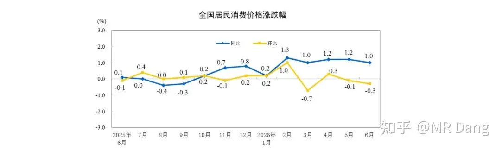
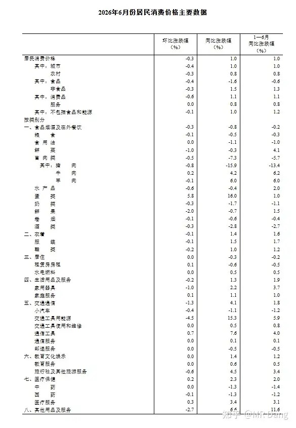
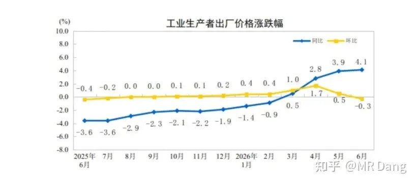
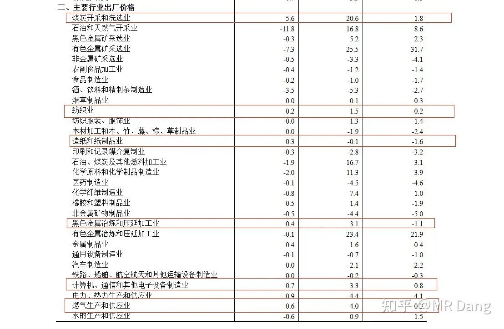
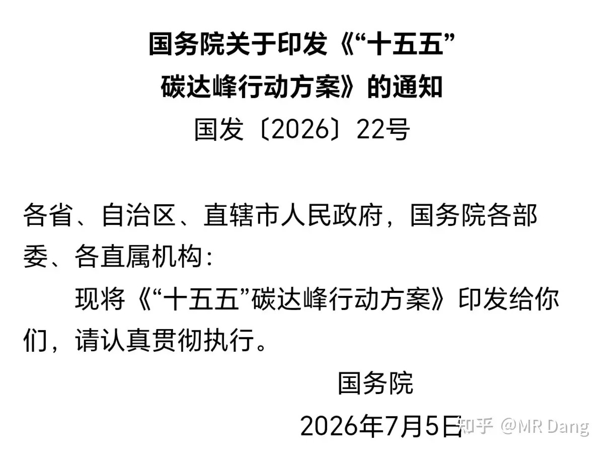
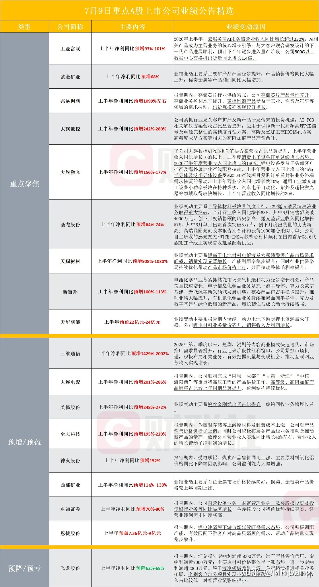
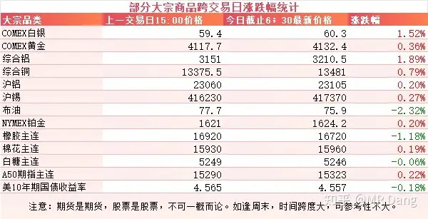
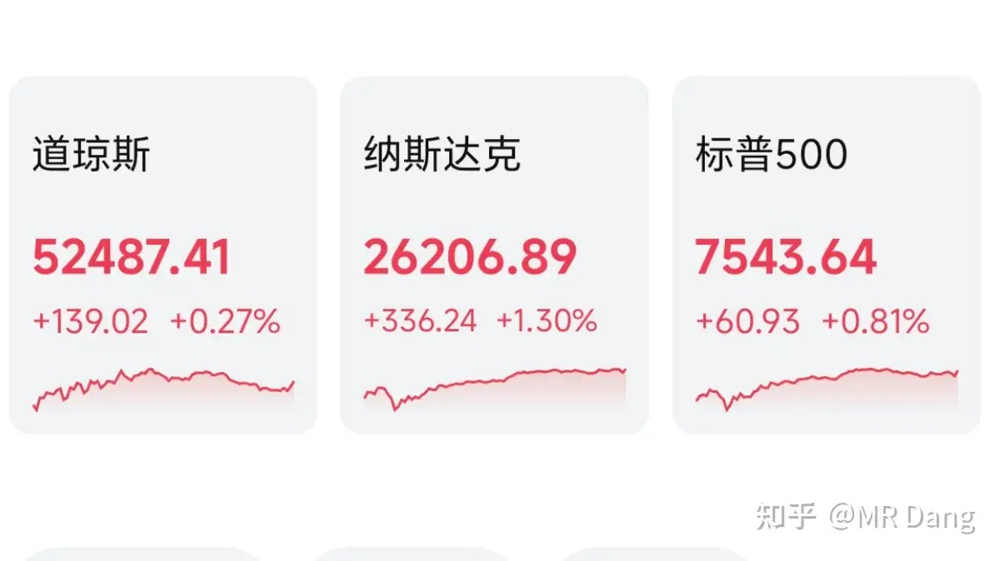

# 对2026年7月10日A股市场行情，大家有什么看法？

---

**发布时间**: 2026-07-10 07:33  |  **原文链接**: https://www.zhihu.com/question/2058473506594206055/answer/2058816177745539344  |  **点赞数**: 171 人赞同

**作者信息**: MR Dang | 证券从业资格证持证人

---

## 正文内容

从统计局数字开始说起：

CPI同比增长1.0，环比增长负0.3%.

这个数据，老实说，还不够热，比预期少了点。

分行业来看，环比增长明显的只有蛋类。

通信工具是因为内存涨价推动的手机涨价。

其他行业表现一般，没什么好挖掘的。

PPI同比增长4.1%，环比增长负0.3%。

同比数据还是理想的，就是环比数据还有进步空间。

分行业来看，煤炭比较亮眼，属于边际改善比较好的。

除此以外，纺织，造纸，黑色金属，计算机，燃气，都属于比较弱的边际改善。

亮点比CPI数据稍微多一些。

十五五碳达峰：

有关部门发布的十五五碳达峰行动方案通知。

对我个人来说，超预期的有三大点：

1，第（一）条“大力推进非化石能源开发”：加快推进新增用电量由新增清洁能源电量覆盖。

很简单的一句话，但是反复品读，新增用电量需要用清洁能源覆盖，这个力度很大了，石化能源基本到头了。

2，第一部分总体要求：稳步实现煤炭和石油消费达峰。

以前提法是煤炭达峰，这次把石油也加上了。

3，抽水蓄能装机容量达到1.6亿千瓦左右，新型储能装机容量力争达到3亿千瓦。

这个新型储能挺超预期，去年底大概是1亿千瓦，2030年要达到3亿千瓦的话，相当于每年4000万千瓦新增。

普通的储能一般是两小时的，长时的储能是四小时以上的，算平均三小时，大概是每年新增1.2亿度电容量的。

一度电成本算800，每年大概是千亿级的产业。

这块受益的主要是国内大储，和之前的提的出口国外的户储是两个不同的方向。

抽水蓄能也差不多，目标1.6亿千瓦，大概新增就是一亿千瓦，合下来每年2000万千瓦。

一千瓦抽水蓄能投资大概是6000块，所以每年差不多是1200亿，也是千亿级的产业。

抽水蓄能这个方向有两个细分投资方向，一个是抽水蓄能机组，弹性比较大，还有一个是抽水蓄能运营，弹性比较小。

部分企业业绩预告：

大宗商品：

原油价格有所回调，有色表现普遍比较好，白银和伦铝走强，沪铝重回23000。

外围市场：

美三大股指收涨，纳指领涨，科技板块比较强势。

昨天个人组合净值回撤半个多，银行绿一个，资源微红，电网红一个多，消费绿一个。

虽然亏了，不过和中午收盘的净值对比一下的话，反而觉得还算过得去。

有句话怎么说的来着，要想生活过得去，头上还得带点绿。

更毒的打都挨了，这点小伤口就无伤大雅了。

整体市场上三大股指都很红，科技涨的让人目瞪口呆。

但上涨的股数只有2400多只，待涨的有2800多只，中位数还是绿的。

市场风格就是偏好科技，权重，股价高的大票。

老登又坐回了冷板凳上。

事后有人解释昨天科技上涨的原因是高盛发布了研报《投资策略：做多中国AI价值链》，认为大A的科技股估值相对其他地区的明显偏低，所以国际资金都来抢A股的硬核科技了。

如果真能吸引外部资金，怎么看都是好事。

老外来的时候自带裤衩，科技也许就不会抢老登的了，说不定大家都能体面的出门。

一个喜欢保护韭菜的博主，希望大家少少踩坑，多多赚钱！！！

---

*本文件从MR Dang知乎页面转载*

---

**作者**: MR Dang
**链接**: https://www.zhihu.com/question/2058473506594206055/answer/2058816177745539344
**来源**: 知乎

*著作权归作者所有。商业转载请联系作者获得授权，非商业转载请注明出处。*

---

## 相关阅读

**📈 每日行情系列：**
- [[20260709-如何看待2026年7月9日A股市场行情？|7月9日行情]] - 业绩预告、市场有效性与价值洼地观察
- [[20260713-如何评价2026年7月13日A股行情？|7月13日行情]] - 商业航天、外部局势和中报季观察
- [[20260714-如何看待2026年7月14日a股行情？|7月14日行情]] - 美伊局势、市场急跌与业绩预告窗口

**⚔️ 功法系列：**
- [[20260516-《地阶功法卷十二》宏观数据基础分析技巧＆最新宏观研判|地阶功法卷十二]] - 配合 CPI、社融等数据建立宏观分析框架

**🧭 方法论：**
- [[20251022-《地阶功法卷一》投资者必须斩杀的三个妄念|投资者必须斩杀的三个妄念]] - 校正追逐市场叙事时的认知偏差
- [[20251023-《地阶功法卷二》价值投资三大误区|价值投资三大误区]] - 判断估值便宜是否真的构成机会
- [[20251020-投资新手避坑指南之仓位控制|仓位控制]] - 在风格快速切换时控制组合风险
- [[20251025-《地阶功法卷三》商业模式评估|商业模式评估]] - 从经营逻辑而非短期题材评价公司
