# 如何评价2026年7月13日A股行情？

---

**发布时间**: 2026-07-13 07:30  |  **原文链接**: https://www.zhihu.com/question/2053864654728851593/answer/2059902632513349564  |  **点赞数**: 222 人赞同

**作者信息**: MR Dang | 证券从业资格证持证人

---

## 正文内容

周末最大的热度就是长征十号乙回收成功：

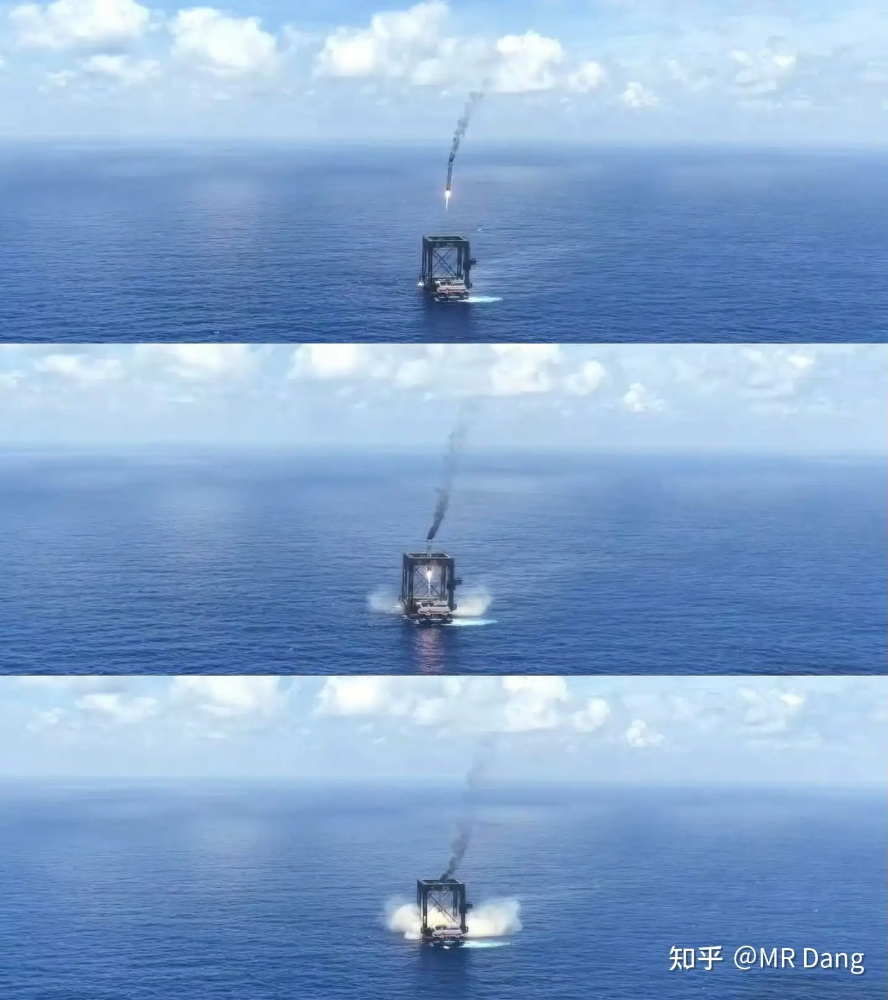

上周五传出来的消息，商业航天冲了一波，尾盘的时候又把一批投资者挂在树上了。

消息还是令人振奋的，和老马的猎鹰9号相比完全不逊色，而且因为使用了系统化的解决方案，容错度和商业落地的成本可能会更优，这么算下来差距可能小于十年了。

对投资者来说，商业航天是一个想象力很足的星辰大海，最大的缺点就是现阶段还产生不了什么实际的回报，需要足够的耐心和包容心。

也不知道是不是受到这个消息的刺激，老马的space x上个交易日没少跌，创了上市以来新低，距离发行价也不远了。

美伊局势：

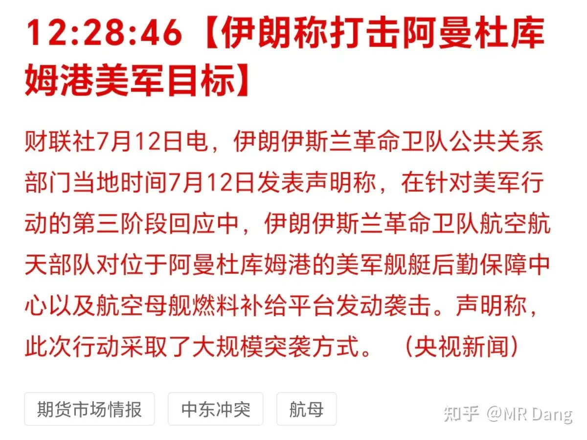

伊朗打击了位于阿曼港口的美军目标，在此之前懂王放了狠话，称上千枚导弹瞄准了伊朗。

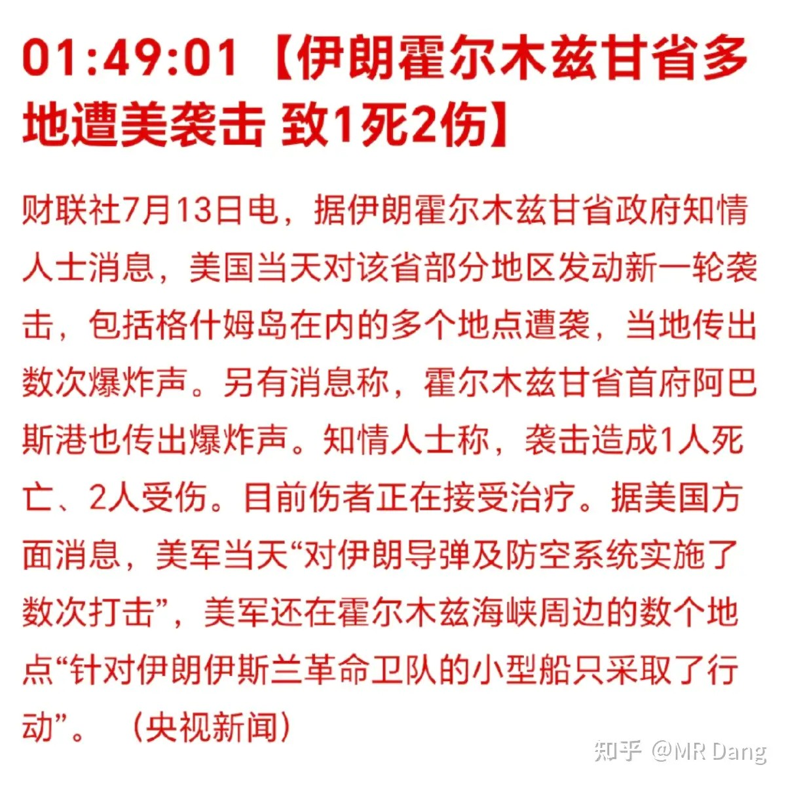

美国也对伊朗进行了袭击。

中医药十五五规划：

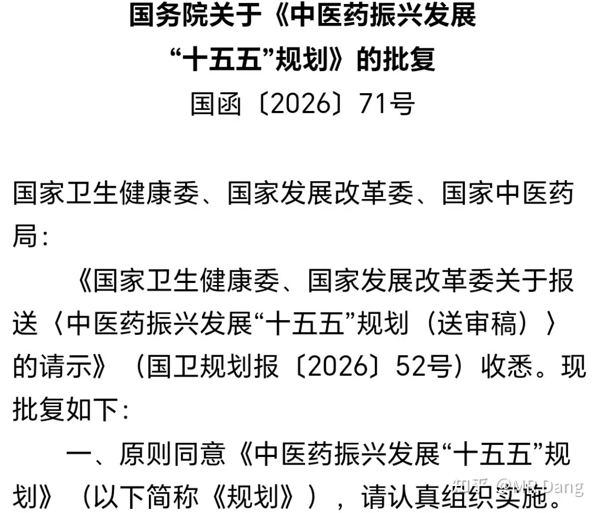

《中医药振兴发展十五五规划》获得有关部门批复。

目前详细的细则还没有公布。

外界普遍猜测主要还是围绕两点展开，一个是中医药的现代化，一个中医药走出国门。

有关部门对氦气出口管制：

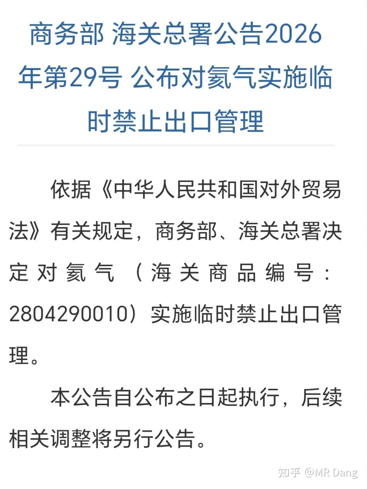

咱们国家是氦气进口国，没有什么太多的出口业务。

管制出口还是因为氦气的进口就集中在少数几个国家上，而他们的氦气供应都多多少少出了点问题。

利好部分氦气供应企业，以及和其他国家签了氦气长协的企业。

《功夫女足》热映：

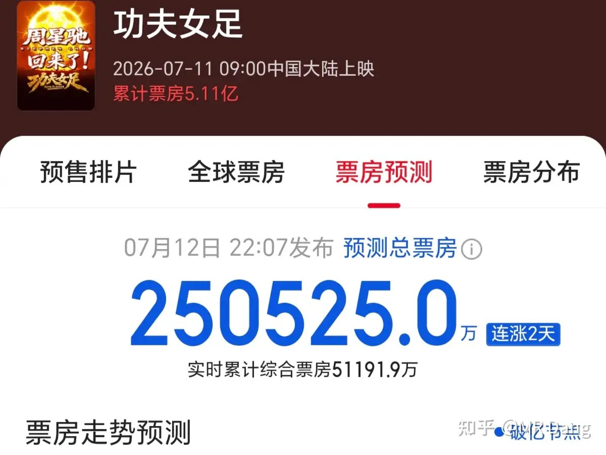

周星驰的新片，我还没看，不过看了下影评，貌似口碑比较分化，豆瓣6.6，纯粹的无厘头搞笑风格。

目前实时票房超过了5亿，预测票房大约25亿左右，算不上现象级大片，但是在整体市场下行的环境里这个成绩还可以。

有投资者肯定在找投资机会，这种电影投机一般要在上映前就埋伏，然后出各种利好的时候就该撤了，现在再去冲容易挂山顶。

我一般只埋伏春节档，其他档期的不怎么感兴趣，电影行业的基本面还是让人担心。

某猪企发布了业绩预告：

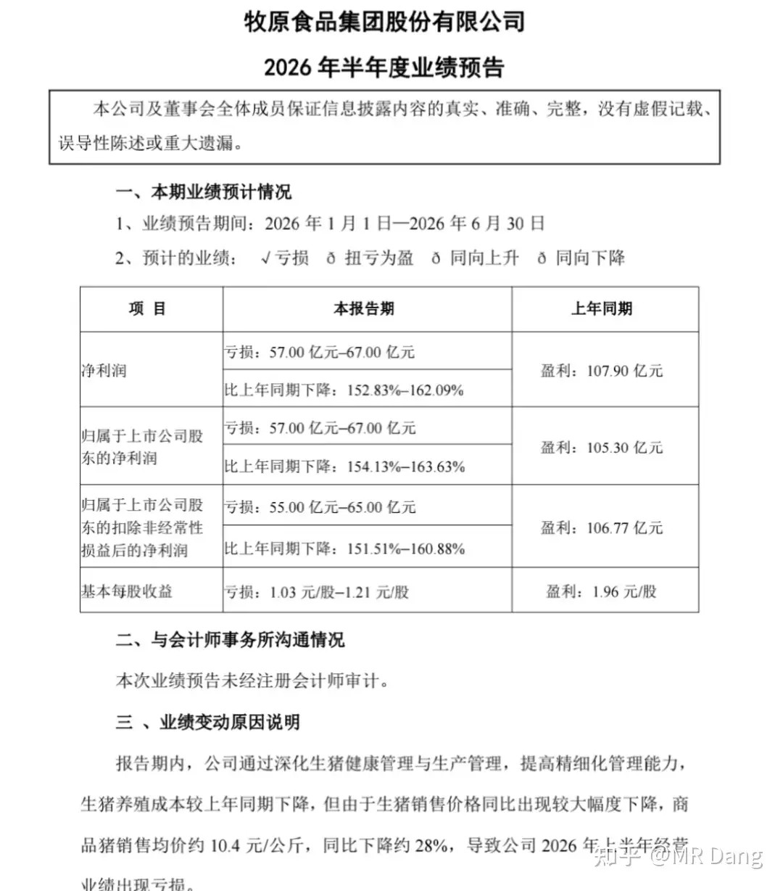

相对有色来说，养猪才是周期性更强的行业，这一旦亏起来也挺吓人的。

不过好在生猪价格已经反弹，全行业三季度也许会比二季度乐观一些。

至于更远的未来，看不太清，需求端没太好的故事讲，就看供应端去化力度了。

某车企发布了业绩预告：

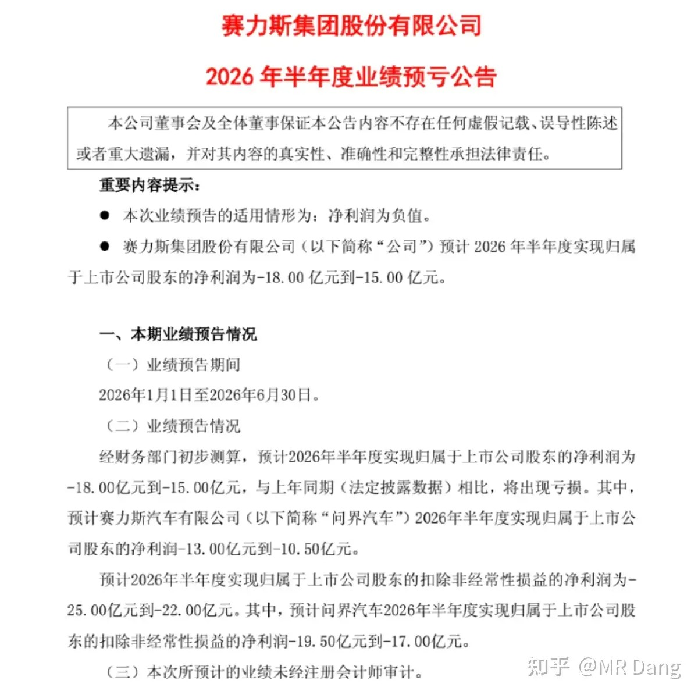

整车制造这个行业目前竞争压力很大，我去年就在说要尽量避开这个赛道。

这家企业的毛利，收入水平在业内哪怕不是遥遥领先，也是比较靠前的，当头部企业出现这种财报的时候，需要对行业保持更高的警惕性。

某酒企发布了业绩预告：

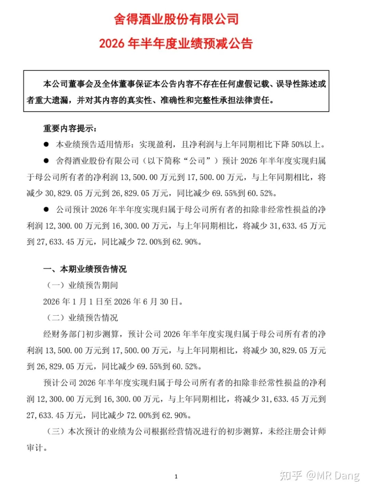

作为白酒行业第一家发布业绩预告的企业，直接给整个行业蒙上了一层阴影。

算下来第二季度直接变成亏损，公司的估值水平反而越跌越高，有点类似之前的房企。

某铝企发布了业绩预告：

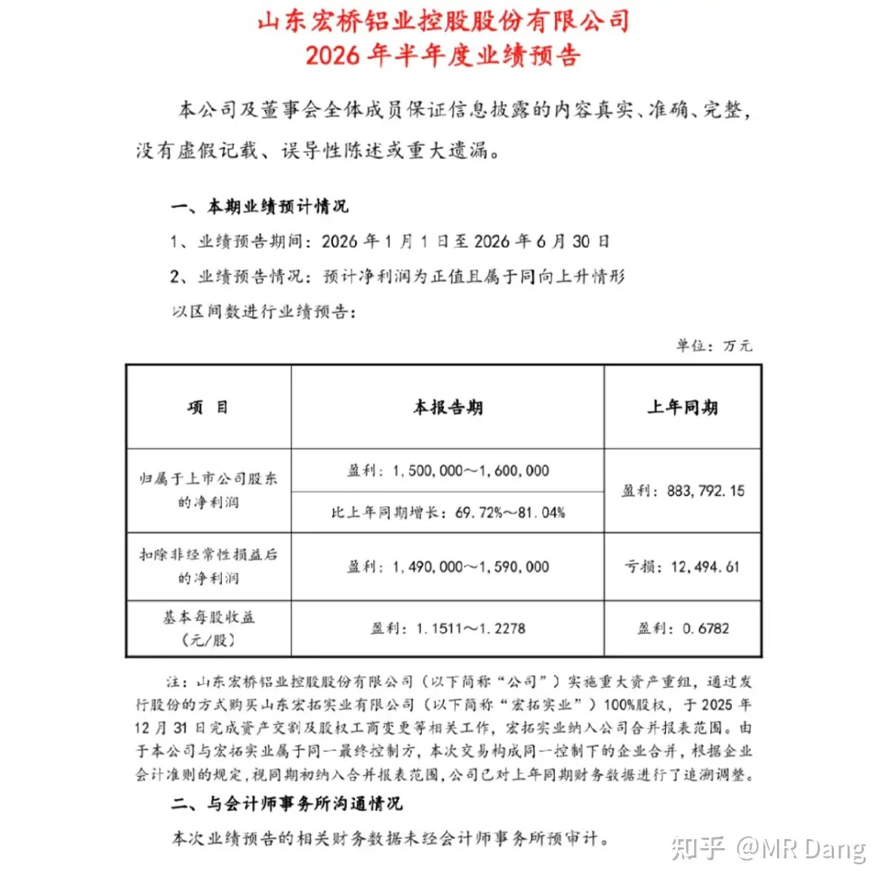

半年报取中位数155亿，减去一季度的67亿，二季度大约是88亿，环比增长30%左右。

其他发布了业绩预告的公司：

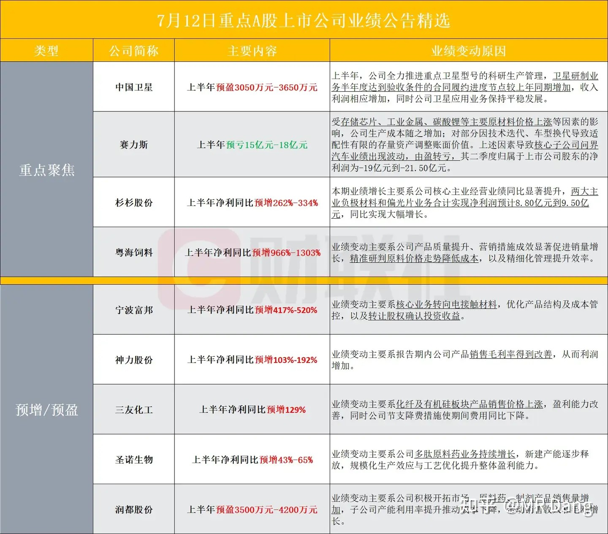

大宗商品：

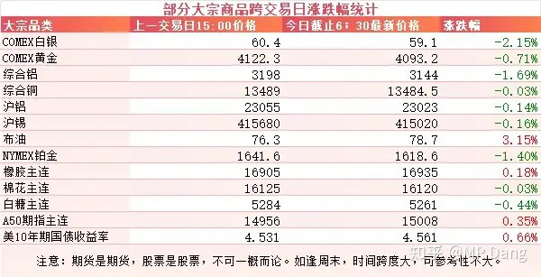

受伊美局势影响，周末期间原油有三个点的涨幅，有色集体回调。

美10年期国债收益率重回4.55分水岭上方。

外围市场：

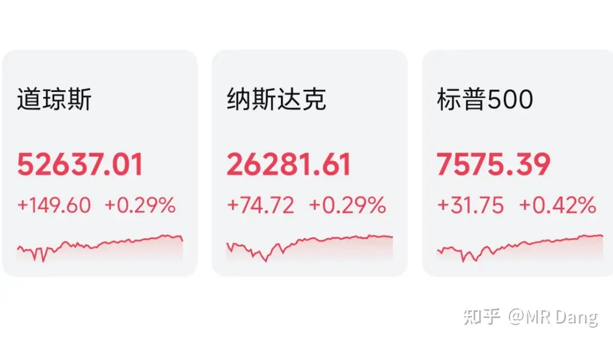

上周五美三大股指收红，涨幅差不多，也没有特别突出的板块。

上个交易日个人组合净值回血半个点，银行红大半个，资源红大半个，电网绿一个多，消费微红。

整体市场上拿的剧本和前些天完全不一样，指数没少跌。

但是具体到涨跌数量上，有3700多家上涨，只有近1700家下跌。

中位数是红的。

我自己体感还可以，看着指数跳水，自己缓慢回血的体验不算差。

商业航天的热度起来了，就把半导体的热度吸走了。

因为他们的受众可能是同一波资金，都是风险偏好高，喜欢寻找主线的。

很多老登早已经被吸成肉干了，没几两肉，反倒是锂电产业链成为了新的大血包。

锂电这个行业，信息极度不对称，而且有两把悬在头顶的达摩克利斯之剑，一把是钠电池，另一把是固态电池，每隔一段时间就会把整个行业吓一吓。

下游电车的萎靡也可能影响这个行业的景气度。

本周前瞻：

本周属于宏观数据周，发布的数据挺多的，具体的有：

1，周二发布东大贸易数据。

2，周二发布西大CPI。

3，周三发布东大GDP数据，用电数据，工业增加值，70城房价数据。

4，周四发布西大初请失业金人数。

5，周四长鑫打新。

6，沃什在明晚会有进一步的表态。

一个喜欢保护韭菜的博主，希望大家少少踩坑，多多赚钱！！！

> [!comment]- 点击展开评论
>
> | 用户 | 时间 | 内容 |
> | :--- | :--- | :--- |
> | 卷帘门门主沈二狗 |  | 中报季，各种妖魔鬼怪就要显型了，比如各种伪装成科技的组装厂 |
> | &nbsp;&nbsp;&nbsp;&nbsp;MR Dang |  | 过了中报季，市场会遗忘的 |
> | 一白先生 |  | 你猜怎么着，我周五把宏桥割了 |
> | &nbsp;&nbsp;&nbsp;&nbsp;关关雎鸠 |  | 周四刚刚加仓宏桥 |
> | 提交 |  | 绿桥今天板了，距离626我说企稳那天，底仓已经盈利7%了，绿桥加油！ |
> | &nbsp;&nbsp;&nbsp;&nbsp;三哥数签签 |  | 晕，我就是那天割肉离场的 |
> | &nbsp;&nbsp;&nbsp;&nbsp;提交 |  | 那24号说有企稳迹象，好多人骂我，26号我说我建仓了，又有好多人来嘲讽我。前两天回调了一点，又有人来笑话我。唉，做个好人真难！ |
> | &nbsp;&nbsp;&nbsp;&nbsp;三哥数签签 |  | 涨停后，短期走势怎么看，我对技术分析一窍不通 |
> | &nbsp;&nbsp;&nbsp;&nbsp;提交 |  | 先看到18吧，止盈30%，再看走势 |
> | 糖果 |  | 宏桥这是要涨停？ |
> | &nbsp;&nbsp;&nbsp;&nbsp;一只老狐狸 |  | 已经涨停了 |
> | 知乎用户0013 |  | dang大，宝丰还能拿嘛 |
> | &nbsp;&nbsp;&nbsp;&nbsp;资本主义必将消亡 |  | 我记得以前说过煤化工要瞄定股息率 |
> | &nbsp;&nbsp;&nbsp;&nbsp;秦大山 |  | GGGF拿没拿 |
> | 暴雨 |  | 不太看好本月的A股，空仓出来站了看看 |
> | 机械之道 |  | 今天的铝和银走出了独立行情啊，宏桥虽然说已经是腰斩了，但是在有补仓的情况下，筹码价格也是下来了，目前只要三个涨停，就能红了 |
> | &nbsp;&nbsp;&nbsp;&nbsp;阳光下的叼毛 |  | 一季报出的时候亏点清仓了，早盘买了点。现在看了一下，上次的亏损回来了 |
> | &nbsp;&nbsp;&nbsp;&nbsp;一只老狐狸 |  | 我要四个 |
> | IamBaymax |  | 华夏今年是什么情况，我的分红呢 |
> | &nbsp;&nbsp;&nbsp;&nbsp;不收钱发帖 |  | 能拖一天是一天 |
> | Wong Ng |  | 存储的价格已经到了影响车企利润的地步了，最终就是传导不下去只能降价。工业金属和锂高点下来已经跌了40%，下一个是存储的价格。如果相信这个价格也能传导，也应该去买诸如铝啊锂啊之类的金属。 |
> | &nbsp;&nbsp;&nbsp;&nbsp;Lyg海盗满大街jd |  | 真的吗？我三十几买的铝，听你这么说，我准备今天加仓一万投 |
> | 乐妈 |  | 打call |

---

*本文件从MR Dang知乎页面转载*

---

**作者**: MR Dang
**链接**: https://www.zhihu.com/question/2053864654728851593/answer/2059902632513349564
**来源**: 知乎

*著作权归作者所有。商业转载请联系作者获得授权，非商业转载请注明出处。*

---

## 相关阅读

**📈 每日行情系列：**
- [[20260710-对2026年7月10日A股市场行情，大家有什么看法？|7月10日行情]] - CPI、储能政策与科技风格的前情回顾
- [[20260714-如何看待2026年7月14日a股行情？|7月14日行情]] - 美伊局势、市场急跌与业绩预告窗口
- [[20260715-怎么看待2026年7月15日A股市场行情？|7月15日行情]] - 进出口数据、业绩披露与市场普涨修复

**⚔️ 功法系列：**
- [[20251106-《天阶功法卷六》银行股投资原理详解|天阶功法卷六]] - 衔接银行分红与估值的长期逻辑
- [[20251125-《天阶功法卷七》中国黄金第一家——C公司投资价值分析|天阶功法卷七]] - 延伸阅读黄金产业链公司的价值分析

**🧭 方法论：**
- [[20251020-投资新手避坑指南之仓位控制|仓位控制]] - 面对外部冲击时预留应对空间
- [[20251023-《地阶功法卷二》价值投资三大误区|价值投资三大误区]] - 避免把下跌自动等同于低估
- [[20251029-新手投资者避坑指南之不要赌财报|不要赌财报]] - 中报季尤其需要防范业绩押注
- [[20251207-《地阶功法卷七》分红的可持续性与净利润的关系|分红的可持续性]] - 结合利润质量判断高股息能否延续
