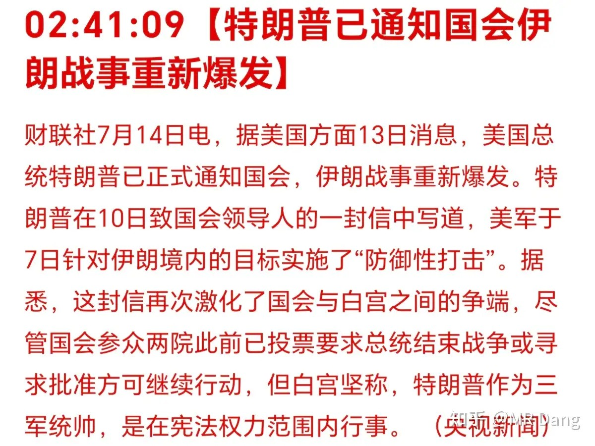
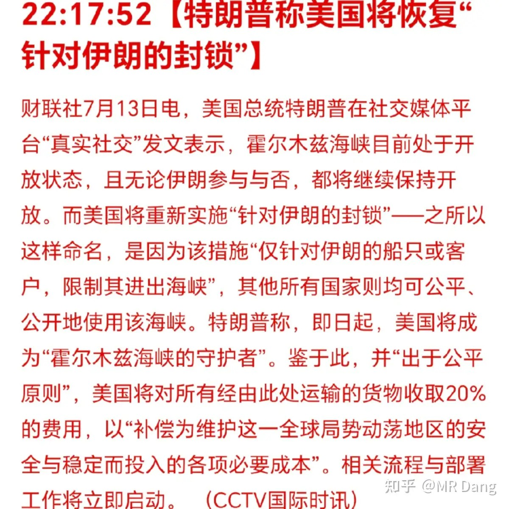
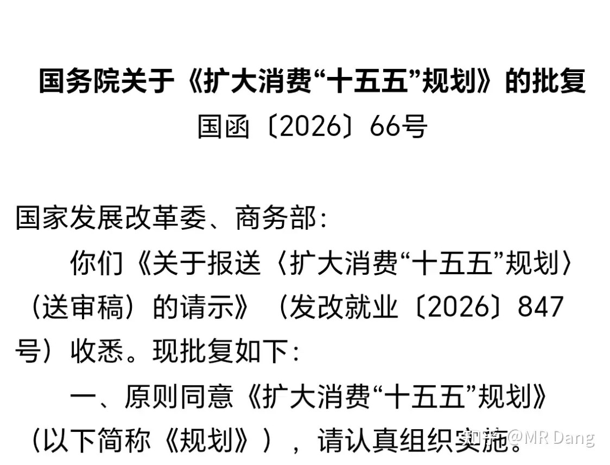
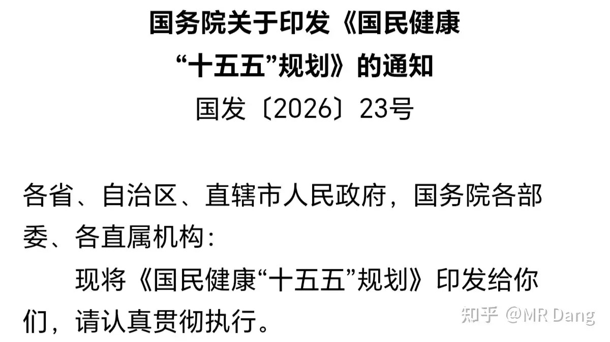
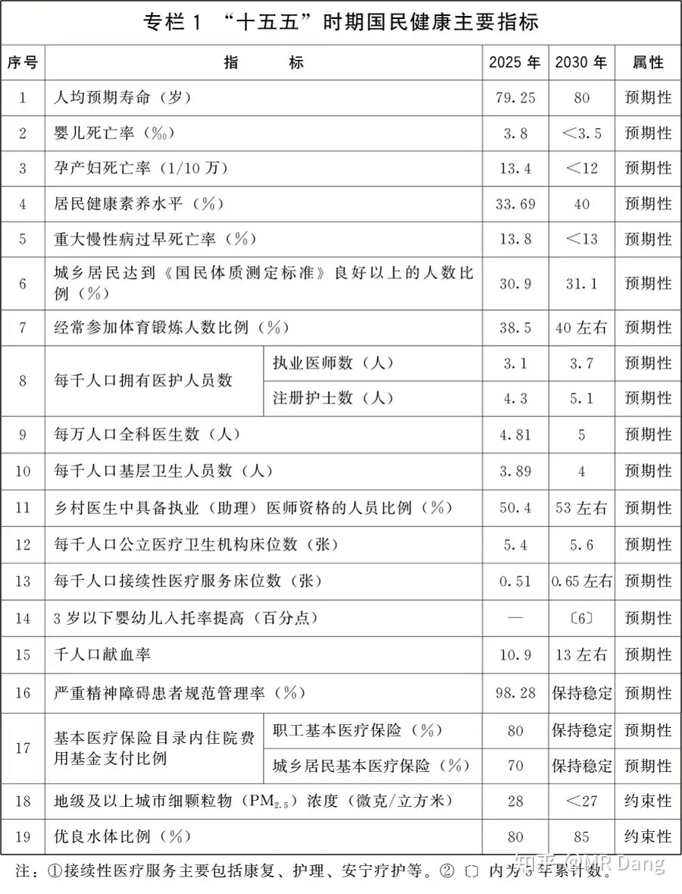
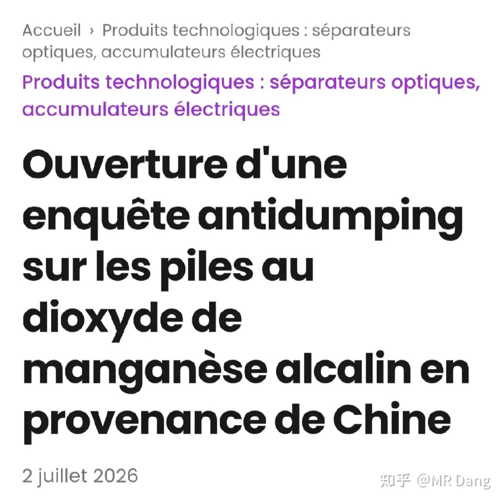
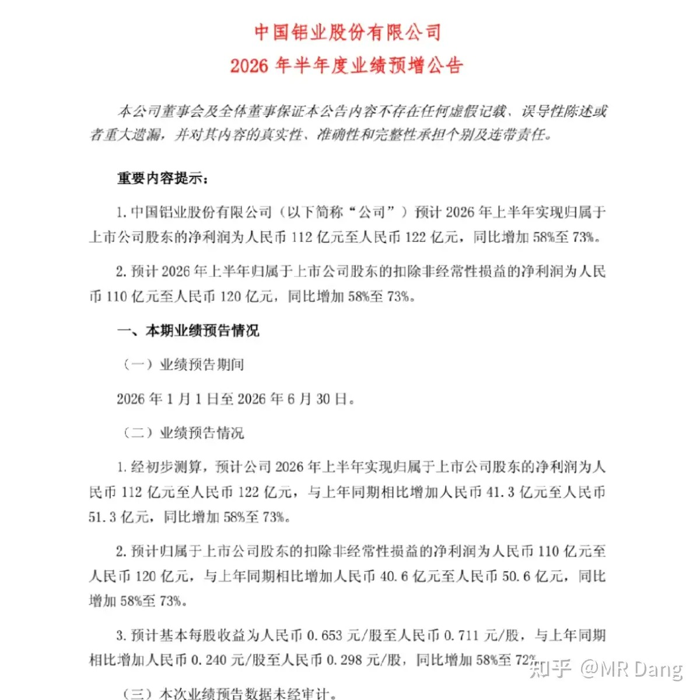
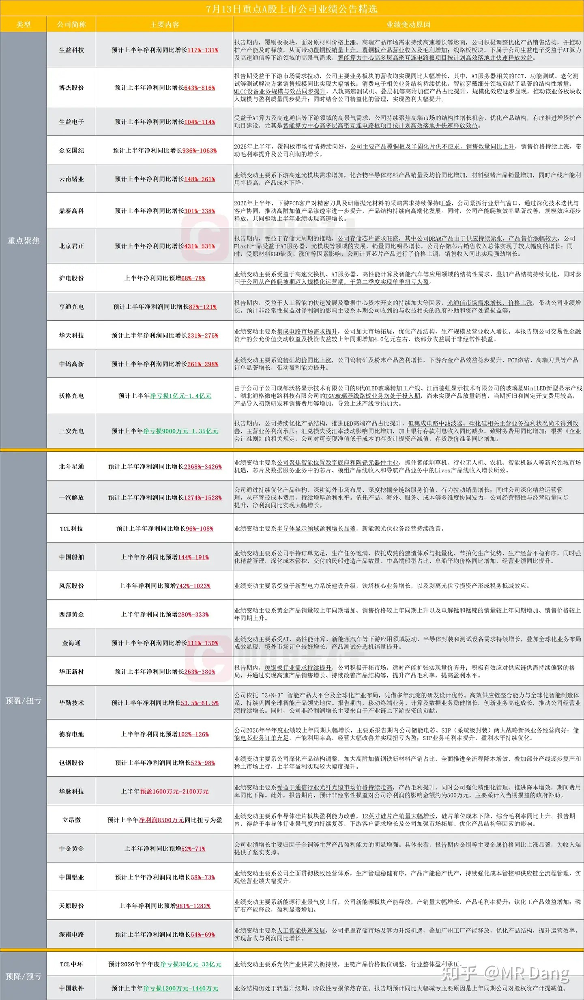
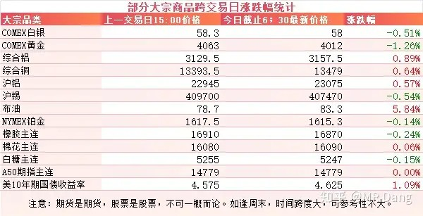
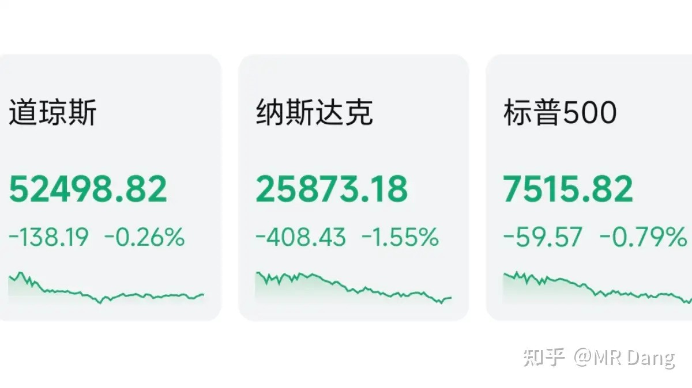

# 如何看待2026年7月14日a股行情？

---

**发布时间**: 2026-07-14 07:34  |  **原文链接**: https://www.zhihu.com/question/2059585260317364465/answer/2060265874641117555  |  **点赞数**: 204 人赞同

**作者信息**: MR Dang | 证券从业资格证持证人

---

## 正文内容

头条给到美伊局势：

懂王确认两边又打起来了。

另外懂王封锁了霍尔木兹海峡，成为了“霍尔木兹海峡的守护者”，并且开始收取20%的保护费。

我确认了下，是权威信源，不是野鸡媒体。

有关部门发布了扩大消费十五五规划：

消费现在是一个重要的议题，这次的十五五规划给目前的消费市场打了一剂强心针。

在开篇就提出了2030年的社零数据总额要到60万亿，而去年这个数据只有50.1万亿，相当于年均复合增速要到3.7%。

目前前五个月同比增速只有1.4%，五月单月甚至是负的，这么看下来每年3.7%的年复合增速已经非常积极了。

这是首次把社零数据纳入了考察范围，还是挺超预期的。

提振消费能力也有提及，比如稳定房地产市场，还有巩固资本市场。

这个确实规划的好啊，投资者如果天天股市亏钱，消费起来难免力不从心。

收入上来了，消费也算是人的天性，并不需要太大的刺激。

有关部门发布了国民健康十五五规划：

其中部分指标如下：

人均预期寿命提高到了80岁，好事。

不过最超我个人预期的并不在表格内，而是这么一段表述：**全面实施**适龄女童国家免疫规划人乳头瘤病毒（HPV）疫苗免费接种。

欧盟对东大碱性二氧化锰电池进行反倾销调查：

提起反倾销调查的公司是瓦尔塔，换过汽车电瓶的应该对这个品牌有印象。

反倾销调查的对象是一次性的碱性电池，就是平常用的五号电池和七号电池之类的。

A股上市公司有那么三四家是做这个行业的，可能短期内会受到影响，需要注意下相关风险。

[某铝企龙头](/stocks/601600.SH)：

发布了2026业绩预告，取中位数117亿，一季度是55亿，推测二季度大约是62亿，环比增长大约十几个点左右。

简单的乘以二测算全年业绩，目前估值大约为6pe左右。

其他发布业绩预告的企业：

部分科技企业其实业绩还行，同环比增速都不低，唯一的问题就是太贵了，动不动就上百PE。

大宗商品：

受伊美局势影响，原油价格大幅拉升五六个点，贵金属小幅回调，工业金属小幅上涨。

美十年期国债收益率大幅走高，市场正在对未来的利率水平进行重新定价。

外围市场：

美三大股指收绿，纳指领跌，科技板块回调，传统板块表现不错。

昨天个人组合净值回血半个多点，银行红一个多点，资源红一个多点，消费微红，电网绿五个点。

电网这玩意儿，回调起来真的比个股都刺激，可惜了，没贯彻原则，又被毒打。

在最近一段时间以来，昨天算是我个人持股体验比较好的一个交易日。

但是整体市场情绪不太好，跌的最少的上证也跌了两个多点，800多只股票上涨，另外4600多只股票待涨，市场中位数大约回调了4%以上。

也不算什么鸡汤吧，昨天亏三个点以内的都算是水平不错的投资者了，我认真的。

坏消息是上证指数要考验3900甚至3800大关。

好消息是按照惯例在这附近也许就会有神秘资金出手相助了。

今天追加一条特别提示，今天是业绩预告理论上的最后一天。

如果主板（注意我说的是主板，不含双创）的上市企业，在今天收盘后没有发布业绩预告，那可能就没达到50%的强制披露标准。

会出现两种情况，本来预期很差的公司，明天可能表现会比较好，反之，明天的表现会比较差。

也就是说，今天是买定离手的最后一个交易日，务必谨慎行事。

一个喜欢保护韭菜的博主，希望大家少少踩坑，多多赚钱！！！

> [!comment]- 点击展开评论
>
> | 用户 | 时间 | 内容 |
> | :--- | :--- | :--- |
> | 鹿港小菇凉 |  | 昨天亏三个点以内的都算是水平不错的投资者了 |
> | 若星汉天空 |  | 金融消费不是消费么，真的爱散户就把散户挂山顶 |
> | zscYHF |  | 宏桥要起飞！！ |
> | 厉飞雨 |  | 老师，早。这三个月在坚持中真的明白了：越悲观越要坚定。守正才能出奇。 |
> | 如来熊掌 |  | 大家都挨打等于没挨打 |
> | 浪里小白马 |  | 原来是我买崩科技的，早知道我就早点出手了 |
> | 法家君子 |  | 默默支持 |
> | 风雷震九州 |  | 周期右侧 5-6倍的铝企能不能买？和周期位置更左边的也是5-6倍的三星海力士比，哪个更好呢 |
> | &nbsp;&nbsp;&nbsp;&nbsp;陌上愚翁 |  | 都不好。铝价格如果能维持，这就是红利股不是周期股，如果铝价下跌那股价没有底的。存储也一样，需求量增速放慢的时候就不行了 |
> | &nbsp;&nbsp;&nbsp;&nbsp;世界这么大 |  | 我只能说前几个月不可能没有资金预期到有这个业绩，但回落至此，肯定另有原因 |
> | 风轩云冕 |  | 昨天绿桥居然涨停，全仓红了三个多点这行情真的看不懂 |
> | &nbsp;&nbsp;&nbsp;&nbsp;XXHJP |  | 宏桥居然两个涨停板了。 |
> | &nbsp;&nbsp;&nbsp;&nbsp;风轩云冕 |  | 我是真没想到能两连板，再来三个板我就回本了 |

---

*本文件从MR Dang知乎页面转载*

---

**作者**: MR Dang
**链接**: https://www.zhihu.com/question/2059585260317364465/answer/2060265874641117555
**来源**: 知乎

*著作权归作者所有。商业转载请联系作者获得授权，非商业转载请注明出处。*

---

## 相关阅读

**📈 每日行情系列：**
- [[20260713-如何评价2026年7月13日A股行情？|7月13日行情]] - 商业航天、外部局势和中报季的前一日观察
- [[20260715-怎么看待2026年7月15日A股市场行情？|7月15日行情]] - 进出口数据、业绩披露与市场普涨修复
- [[20260716-如何看待2026年7月16日A股市场行情？|7月16日行情]] - 社零、房地产数据与科技估值风险

**⚔️ 功法系列：**
- [[20260516-《地阶功法卷十二》宏观数据基础分析技巧＆最新宏观研判|地阶功法卷十二]] - 将外部局势和宏观数据放进统一框架
- [[20260404-《地阶功法卷十》手把手教你快速读懂财报|地阶功法卷十]] - 在业绩密集披露期快速识别财务信号

**🧭 方法论：**
- [[20251020-投资新手避坑指南之仓位控制|仓位控制]] - 在大幅波动中用仓位保留主动权
- [[20251022-《地阶功法卷一》投资者必须斩杀的三个妄念|投资者必须斩杀的三个妄念]] - 克服急于抄底和证明自己的冲动
- [[20251029-新手投资者避坑指南之不要赌财报|不要赌财报]] - 理解业绩预告窗口的潜在风险
- [[20251023-《地阶功法卷二》价值投资三大误区|价值投资三大误区]] - 防止把低价格误判为高价值
