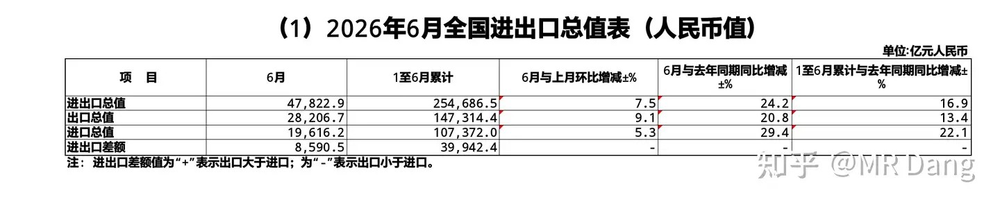
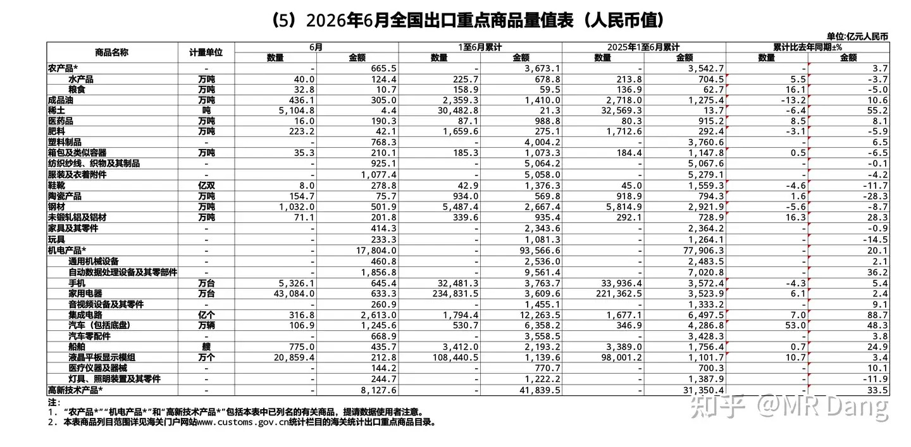
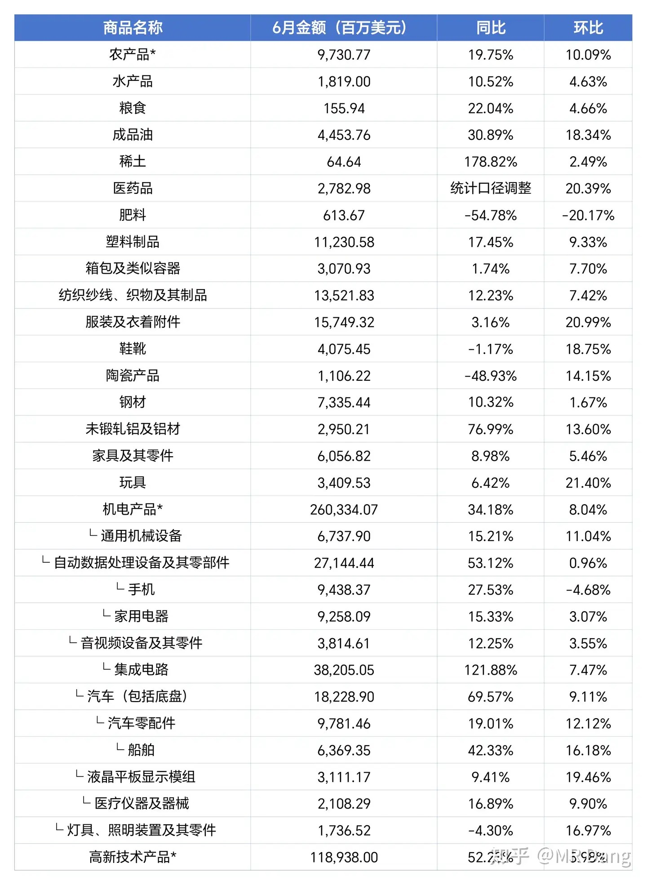
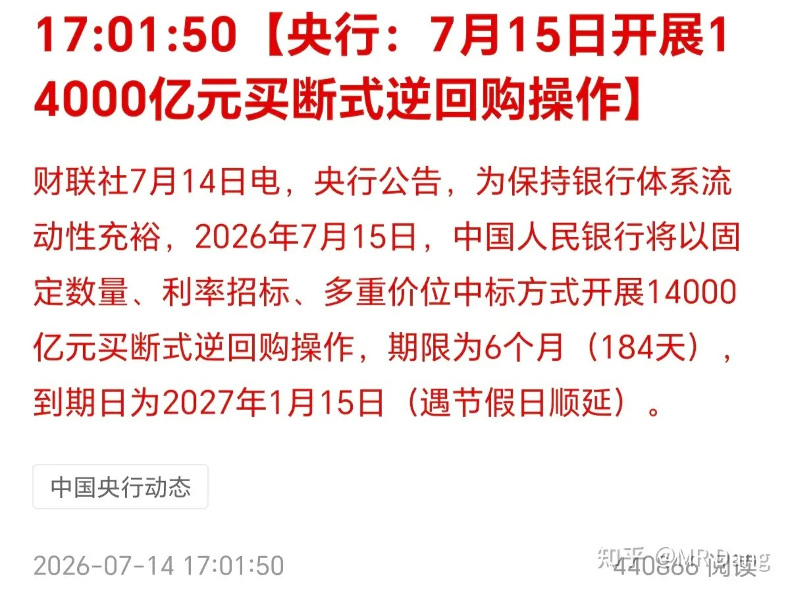
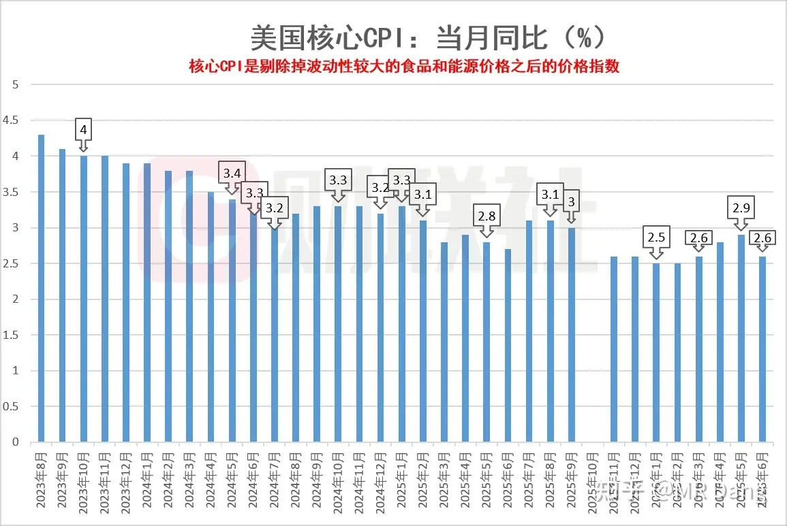
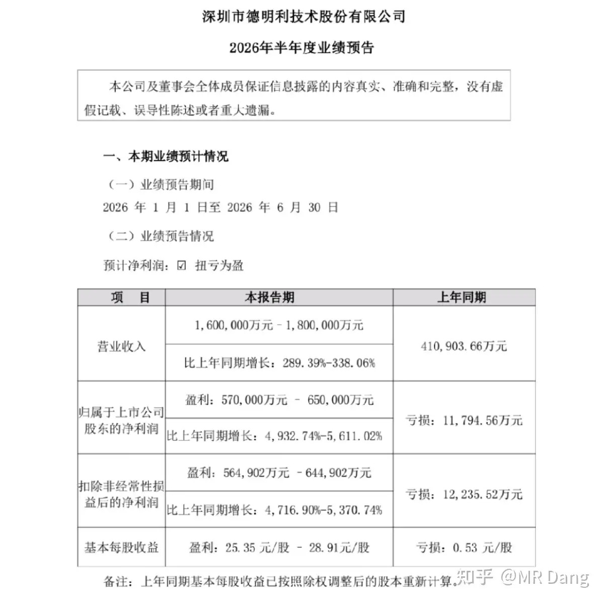
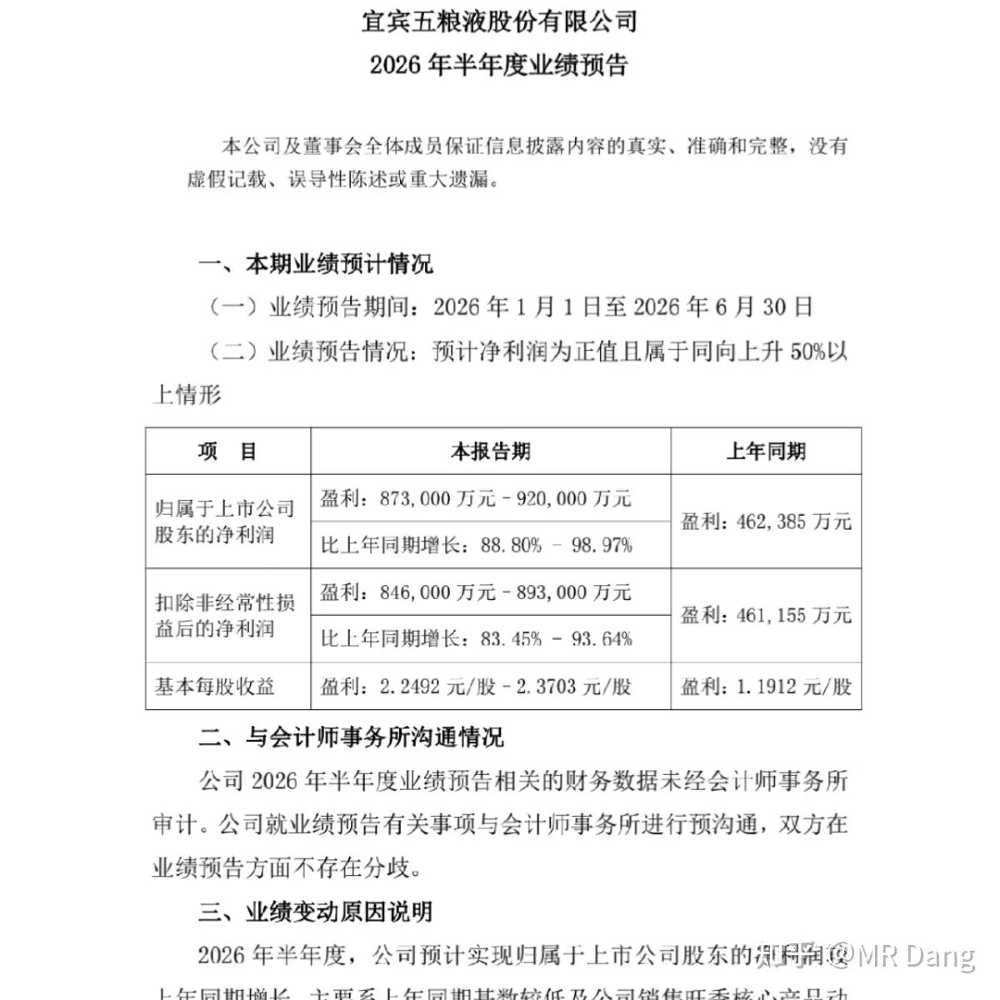
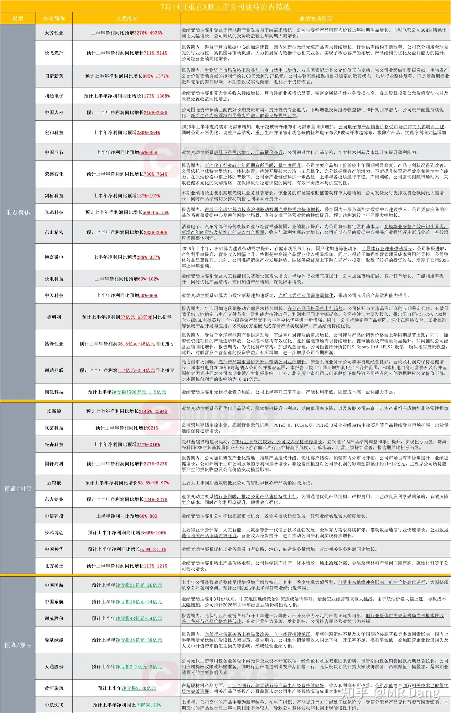
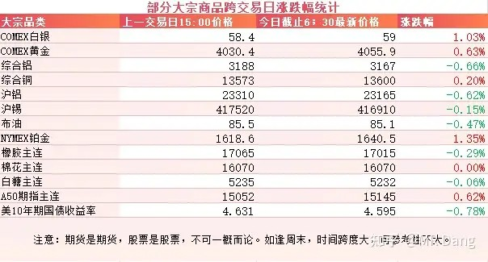
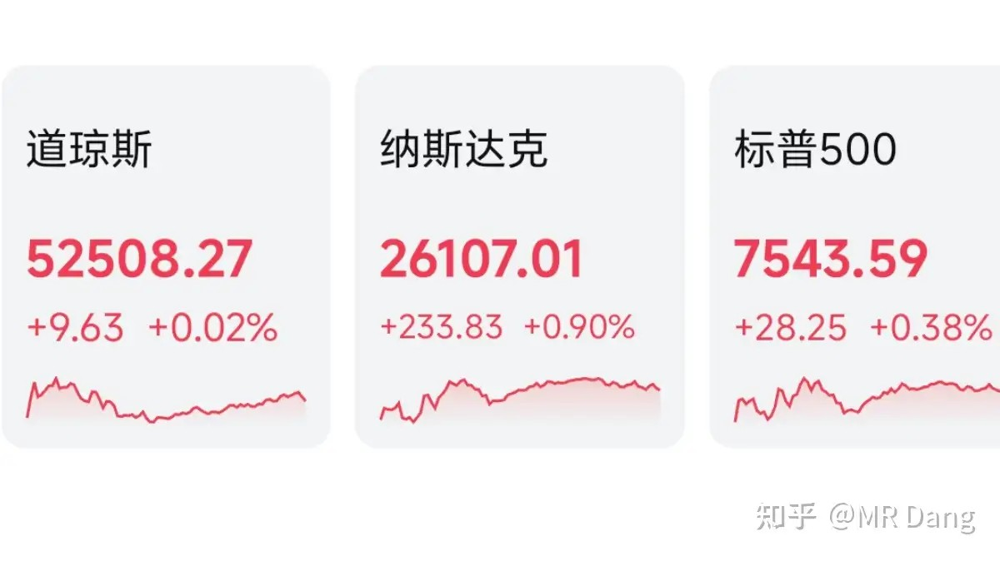

# 怎么看待2026年7月15日A股市场行情？

---

**发布时间**: 2026-07-15 07:32  |  **原文链接**: https://www.zhihu.com/question/2059962802891232824/answer/2060627680958092917  |  **点赞数**: 201 人赞同

**作者信息**: MR Dang | 证券从业资格证持证人

---

## 正文内容

每天先看统计数据：

六月的进出口数据非常漂亮，出口同比增长20.8%，进口同比增长29.4%。

环比上个月的数据，出口增长9.1%，进口增长5.3%。

这个基数上能有这个增速，充分说明我们的市场还是很有活力的。

只说二季度的话，二季度进出口13.61万亿元，同比增长18.4%，为2021年三季度以来季度同比最高增速。

稳中向好，真真的。

具体分析出口结构的话，因为半年报预告已经出了，所以六月数据没那么重要了，都在半年报里price in了，现在就是看个大概：

稍微处理一下：

6月出口环比增速比较高的有医药品，服装，鞋，玩具，液晶屏。

高新技术产品和集成电路的环比增速有放缓的趋势。

央行：

提供了足足1万4千亿流动性，减去到期的，也有四千多亿。

意料之外，情理之中。

还记得7月9日早报我拆解央行逆周期和跨周期调节的表述么，当时就说了还会提供流动性的。

没想到来的这么快，量给的这么足。

西大通胀数据：

核心CPI环比降低，又回到了2.6%。

好事，对资本市场和商品市场来说都是好消息。

神秘资金：

昨天早报提到过的，神秘资金有自己的计划。

不要喷神秘资金割韭菜，反复做差价，投资者谁不希望自己低买高卖呢？

打不过就加入呗，胳膊拧不过大腿啊。

这有点类似情绪税一样，凡是容易上头的投资者就会被收税。

涨的时候彻底疯狂，跌的时候自暴自弃，最后就会成为被反复收割的对象。

越开心越要警惕，越沮丧越要坚定。

这句话并不是什么鸡汤，而是针对这种策略的一种应对手段，bro。

[某明星模组企业](/stocks/001309.SZ)：

发布了2026半年度业绩预告，取中位数大约61亿。

一季度是33.4亿，推测二季度大概28亿左右。

环比减少，会让市场猜测是低价库存用完了的信号。

对模组这个行业来说，这也是危险信号。

事实上，模组企业的利润增速是存储价格的二阶导数。

一旦把最初的低价库存存储用完以后，如果存储保持平稳的涨价速度，模组企业的利润并不会大幅增加。

一开始的业绩兑现后，如果还想继续保持增速，需要存储价格走出加速上涨的趋势。

在商业模式上，模组厂商相对上游存储有天生的短板。

[某酒企](/stocks/000858.SZ)：

发布了2026半年度业绩预告。

这业绩给我看笑了，这么低是为了给明年再留出增长空间？

现在都不知道该信哪份年报了。

其他发布了业绩预告的企业：

大宗商品：

大宗商品整体比较平稳，正常波动的幅度都不大。

CPI数据使得美债收益率走低。

A50期指表现不错，可能预示着今天会有个比较好的开端。

外围市场：

美三大股指集体上涨，纳指领涨，存储板块走强。

昨天个人组合净值回血两个半，银行红一个，资源红6个，电网两个半，消费红五个。

持股体验相当奈斯，全线飘红。

市场也很给力，4200多只股票上涨，仅1200多只下跌，中位数涨幅也近两个点。

科技和老登终于不用为了一条裤衩争的面红耳赤了。

一个喜欢保护韭菜的博主，希望大家少少踩坑，多多赚钱！！！

> [!comment]- 点击展开评论
>
> | 用户 | 时间 | 内容 |
> | :--- | :--- | :--- |
> | 三哥数签签 |  | 这几天我把D大说的标的全部梳理了一遍，确实现在大部分处于亏损状态。但是这些公司一季报和中报看，全部没有问题，基本面经营面都非常不错。有被市场错杀的，有买贵了的，有流动性问题起不来的，但是垃圾公司一个都没有。 |
> | &nbsp;&nbsp;&nbsp;&nbsp;林林志颖 |  | 运气问题 |
> | &nbsp;&nbsp;&nbsp;&nbsp;亲爱的雪莉 |  | 都有哪些标的啊, 好久不看知乎了 |
> | &nbsp;&nbsp;&nbsp;&nbsp;墨魂 |  | 都是行业龙头再加一个一定股息率 |
> | &nbsp;&nbsp;&nbsp;&nbsp;程之 |  | 宝丰我卖早了我恰好在谷底的时候睡醒。一看下跌赶紧卖了，它又拉起来了 |
> | 浪里小白马 |  | 红桥不会又给我一个涨停吧，再来一下我可要回本了 |
> | Jonas |  | 早安，看每日分享 |
> | Dang门小弟子 |  | 宏桥快回本了，果然余钱好股即使遇到极端行情也不会慌 |
> | 安静 |  | 感觉科技和老登还是穿一条裤子出门，反正大盘跌我的就涨，大盘涨我的就跌。 |
> | 情何以堪 |  | 感觉是不是风向要变了，半导体还是主线吗 |
> | 老庄孔孟 |  | 今天不会被科技抢裤衩吧 |
> | &nbsp;&nbsp;&nbsp;&nbsp;司徒先生 |  | 领跌，也是绝绝子，不知道现在跟谁了。 |

---

*本文件从MR Dang知乎页面转载*

---

**作者**: MR Dang
**链接**: https://www.zhihu.com/question/2059962802891232824/answer/2060627680958092917
**来源**: 知乎

*著作权归作者所有。商业转载请联系作者获得授权，非商业转载请注明出处。*

---

## 相关阅读

**📈 每日行情系列：**
- [[20260714-如何看待2026年7月14日a股行情？|7月14日行情]] - 急跌背景和业绩预告最后窗口的前情
- [[20260716-如何看待2026年7月16日A股市场行情？|7月16日行情]] - 社零、房地产数据与科技估值风险
- [[20260717-怎么看待 2026 年 7 月 17 日A股市场行情？|7月17日行情]] - 海外加息、打新结果与抄底纪律

**⚔️ 功法系列：**
- [[20260404-《地阶功法卷十》手把手教你快速读懂财报|地阶功法卷十]] - 配合业绩披露快速检查企业基本面
- [[20260418-《地阶功法卷十一》如何简单快速的阅读研报|地阶功法卷十一]] - 判断研报信息与市场叙事的可信度
- [[20260516-《地阶功法卷十二》宏观数据基础分析技巧＆最新宏观研判|地阶功法卷十二]] - 用进出口和物价数据理解宏观需求

**🧭 方法论：**
- [[20251020-投资新手避坑指南之仓位控制|仓位控制]] - 极端行情后仍需保持仓位纪律
- [[20251029-新手投资者避坑指南之不要赌财报|不要赌财报]] - 避免把单次业绩披露当成确定性机会
- [[20251207-《地阶功法卷七》分红的可持续性与净利润的关系|分红的可持续性]] - 从利润质量评估分红能力
- [[20251025-《地阶功法卷三》商业模式评估|商业模式评估]] - 由经营模式判断长期竞争力
