# 如何看待2026年7月16日A股市场行情？

---

**发布时间**: 2026-07-16 07:37  |  **原文链接**: https://www.zhihu.com/question/2057841067429516249/answer/2060991508703098755  |  **点赞数**: 186 人赞同

**作者信息**: MR Dang | 证券从业资格证持证人

---

## 正文内容

还是老样子，紧跟统计局步伐：

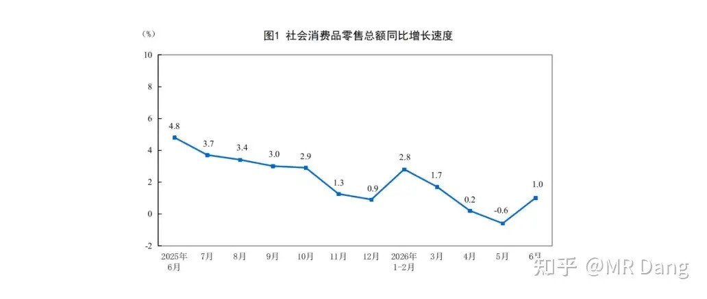

社零数据不错，同比转正了。

之前不是说了么，消费十五五里把社零列为重要指标之一了，对消费板块算是久违的利好。

分行业的话：

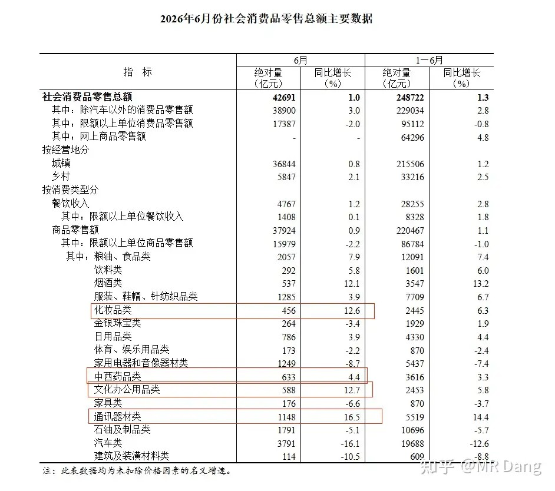

同环比来看 ，化妆品，药品，办公用品，通讯器材的数据都不错。

药品不算意外，一直以来都比较坚挺。

化妆品有点意外，口红效应？也对不上啊，经济环境还挺好的，应该不是吧。

办公用品增长也挺意外，这是因为要努力加班补仓？

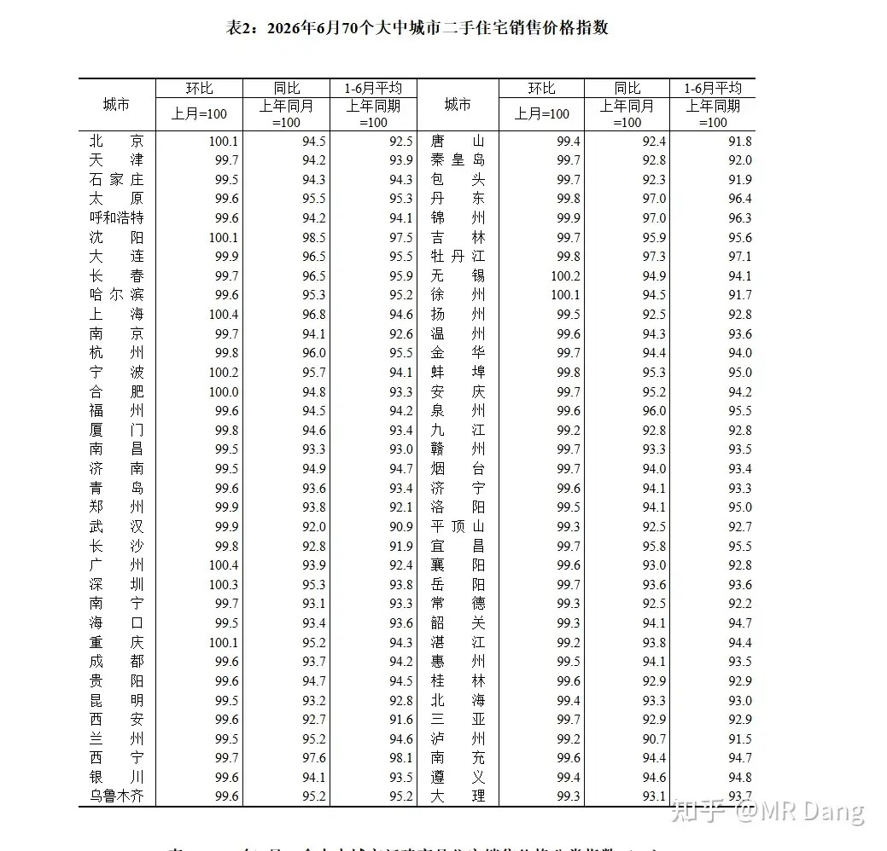

二手住宅价格指数方面，6月有10个城市环比破百，5月是13个，4月是16个，3月是17个。

结合之前的住户中长期贷款的趋势，这方面的边际改善还是不够明显。

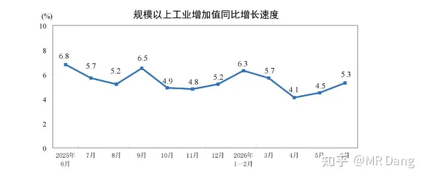

工业增加值同比增加5.3%，环比增速提高。

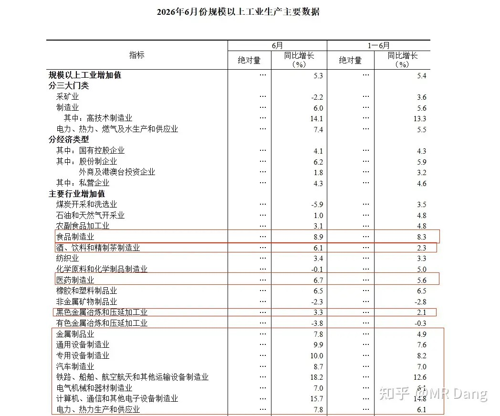

分行业看的话，同环比都改善的行业一大片，感觉各行各业都有点欣欣向荣的味道。

就连酒，食品制造都有改善了。

综合以上统计数据，我个人觉得消费行业有微弱的边际改善在里面。

整体二季度gdp增速是4.3%，考虑到消费情况和房地产市场的情况，其实这个成绩还可以。

央行：

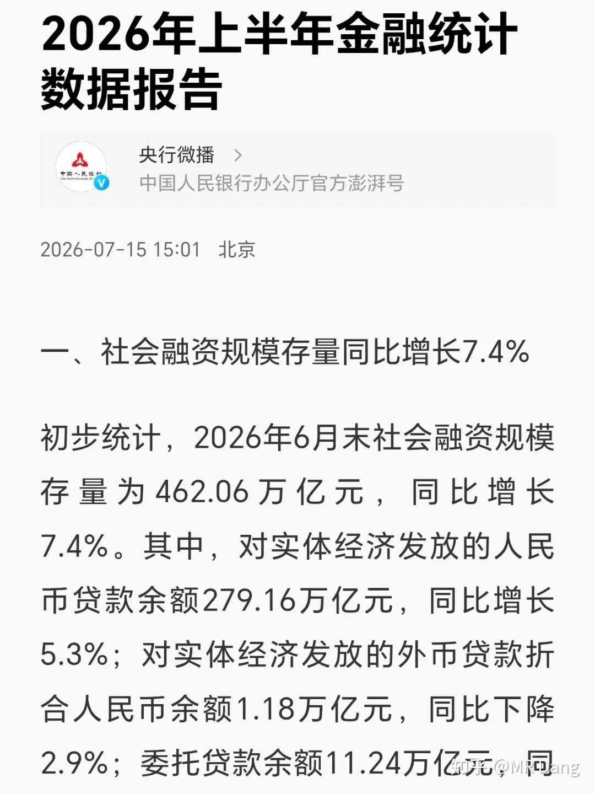

发布了《2026年上半年金融统计数据报告》，数字很多，就不一一列了，说几个最突出的。

最明显的就是老百姓上半年在积极还钱，住户贷款减少3668亿，这是很罕见的情况。

而在还的这些钱里，还的最多的是短期贷款，也就是信用卡，短期车贷，消费贷这些，减少了5881亿。

房贷半年新增只有2212亿，和以前动不动几万亿相比，也缩水了不少。

当然也有好消息，这些新增的贷款，很大一部分是6月份增加的，上个月整体增加了2600亿，其中1600多亿房贷，1000多亿消费贷。

看趋势的话，在边际改善，稳中向好的大方向没变。

积极还钱的同时老百姓还疯狂存钱，上半年住户存款增加了7.58万亿。

手机端大模型：

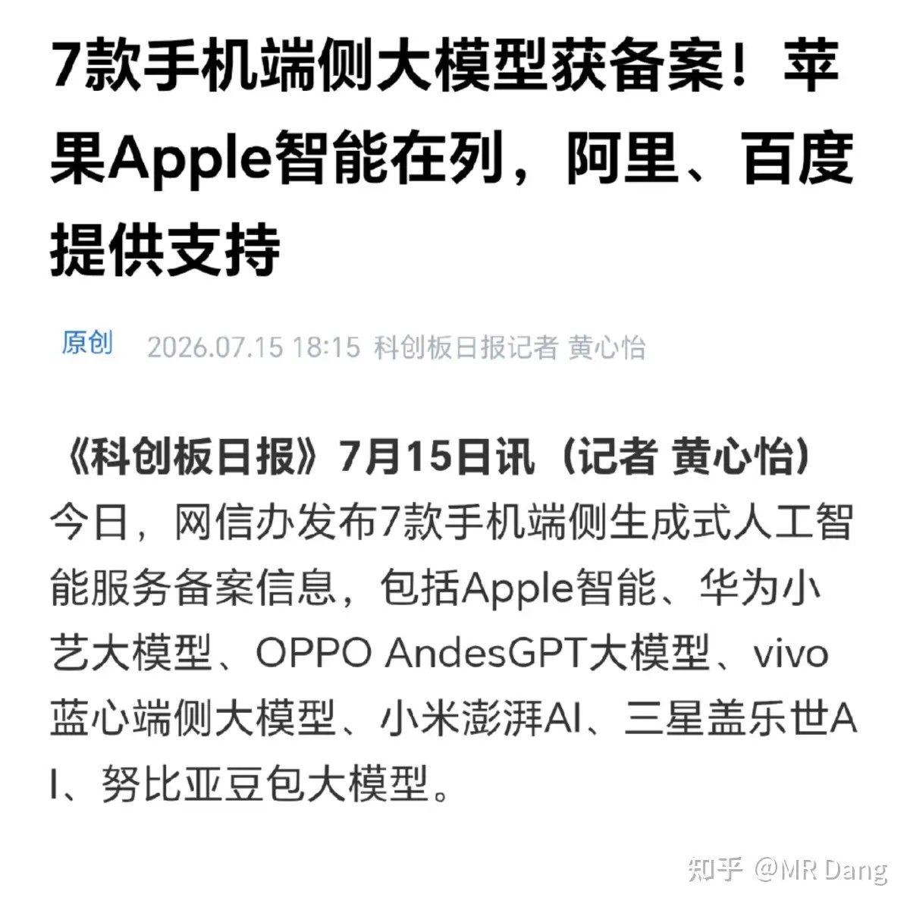

7款手机端侧Ai备案，其中苹果的由阿里千问提供。

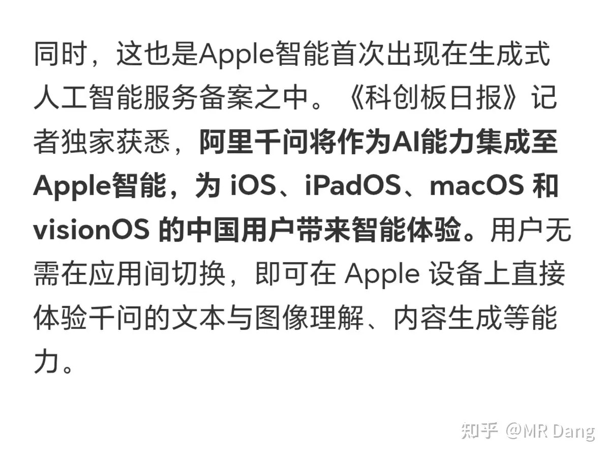

昨晚美股阿里表现还可以。

猴模块：

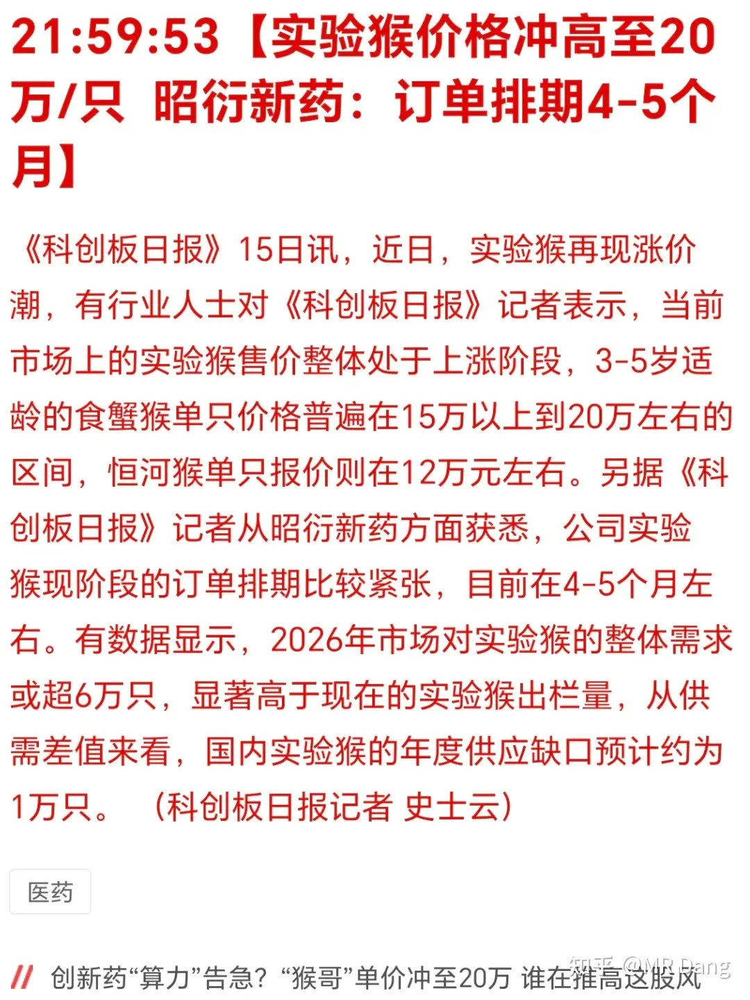

有报道称国内试验猴每年供应缺口大约一万只。

从商业模式来说，猴子和存储差不多，都是短期扩产困难的行业，因为猴子长大需要时间，投再多的钱也没办法加速这一进程。

另外猴子生育也要遵循自然规律，母猴一年就一胎，不像一窝几胎的动物一样容易扩产。

大宗商品：

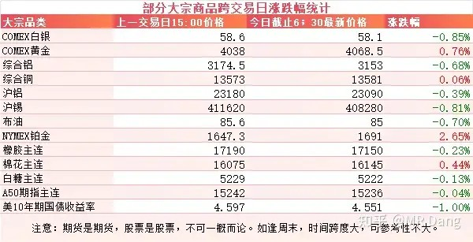

大宗商品整体变化不大，除了铂金都算在正常波动范围内。

美十年期国债收益率继续回落，又到了4.55分水岭附近。

外围市场：

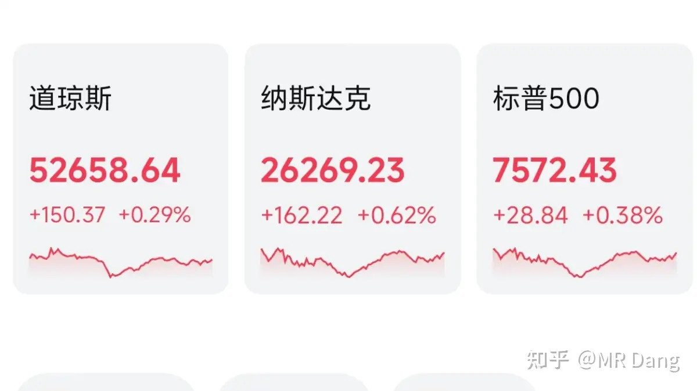

美三大股指收红，纳指领涨。涨幅比较大的板块是AI软件，存储和半导体跌幅不小。

老马的space x盘中破发，创了上市以来新低。

昨天个人组合净值回血近半个点，银行红大半个点，资源红1个点，电网绿两个，消费红半个。

赚的不多，但是体验依然拉满，除了电网被电的有点麻，其他都还好。

下半年以来已经持续跑赢指数，相较于六月份的步履维艰已经是否极泰来了。

两市有3300多只股票上涨，仅2100多只下跌，因此中位数也是上涨的，和指数有明显区别。

现在指数最大的隐忧之一是代表性不足，科技占比太高，几乎绑架了指数，掩盖了传统老登弱不可闻的呻吟声。

我举个简单的例子，纯房地产开发加商业地产为代表的A股上市公司，就是万科保利这些耳熟能详的名字，目前还剩下53家，对应市值总和五千多亿。

全部加起来大概是光模块某龙头市值的一半都不到。

已经是真正意义上的肉干了，再吸血就只剩一张皮了。

当然这不意味着老登不会继续跌，而是说靠吸老登流动性去堆市值这条路已经越来越难走了。

我在4100点上面一直说风险，谨慎，不要追高，容易挂山顶。

价值投资相对科技叙事来说，最大的优点是有丰富的挨打经验。

因为股息这东西，看得见摸得着，哪怕被打的遍体鳞伤，心中总有一口气不会坠，价值投资者是真的有信念的。

但是科技信仰就不好说了，涨的时候科技是星辰大海，稍微回调一点，骂的比谁都难听的也大有人在。

没信仰就拿不住，就会割肉，就会止损，哪怕未来五倍十倍一百倍，也和这些割肉的投资者没任何交集了。

今天不要忘了打新哦，祝各位读者都能中签！

发行价对应的估值还是挺便宜的，算是一波福利了。

一个喜欢保护韭菜的博主，希望大家少少踩坑，多多赚钱！！！

> [!comment]- 点击展开评论
>
> | 用户 | 时间 | 内容 |
> | :--- | :--- | :--- |
> | 浪里小白马 |  | 跟大家说个事，为什么现在猴子这么缺，主要是现在ADC大爆发，从DS8201开始也有几年了，抗体类的研发做毒理绕不开猴子，等后面这个赛道没那么火了也就不缺了 |
> | 桃子 |  | 看到大佬也一样在电网被电麻了就放心了 |
> | &nbsp;&nbsp;&nbsp;&nbsp;清欢 |  | 请问电网持续看好么 拿的哪支呀 |
> | Mocu1shle |  | 赚钱了，割肉的难不难受 |
> | 谁在森林迷了鹿 |  | 短期缺小猴 永远缺母猴 梭哈了 |
> | 我是一颗桃子吖 |  | 刺激 |
> | 乐妈 |  | 靠老登回血了 |

---

*本文件从MR Dang知乎页面转载*

---

**作者**: MR Dang
**链接**: https://www.zhihu.com/question/2057841067429516249/answer/2060991508703098755
**来源**: 知乎

*著作权归作者所有。商业转载请联系作者获得授权，非商业转载请注明出处。*

---

## 相关阅读

**📈 每日行情系列：**
- [[20260714-如何看待2026年7月14日a股行情？|7月14日行情]] - 市场急跌与业绩预告窗口的背景
- [[20260715-怎么看待2026年7月15日A股市场行情？|7月15日行情]] - 进出口数据、业绩披露与普涨修复
- [[20260717-怎么看待 2026 年 7 月 17 日A股市场行情？|7月17日行情]] - 海外加息、打新结果与抄底纪律

**⚔️ 功法系列：**
- [[20251106-《天阶功法卷六》银行股投资原理详解|天阶功法卷六]] - 深入理解银行股的股息与估值逻辑
- [[20251207-《地阶功法卷七》分红的可持续性与净利润的关系|地阶功法卷七]] - 检验股息背后的利润支撑

**🧭 方法论：**
- [[20251020-投资新手避坑指南之仓位控制|仓位控制]] - 用仓位约束降低波动对心态的冲击
- [[20251022-《地阶功法卷一》投资者必须斩杀的三个妄念|投资者必须斩杀的三个妄念]] - 在高估值叙事中保持独立判断
- [[20251023-《地阶功法卷二》价值投资三大误区|价值投资三大误区]] - 理解价值投资并不等于机械追求低价
- [[20251029-新手投资者避坑指南之不要赌财报|不要赌财报]] - 财报季避免以短期结果替代长期分析
