# 怎么看待 2026 年 7 月 17 日A股市场行情？

---

**发布时间**: 2026-07-17 07:28  |  **原文链接**: https://www.zhihu.com/question/2060820390327408306/answer/2061351471111731167  |  **点赞数**: 246 人赞同

**作者信息**: MR Dang | 证券从业资格证持证人

---

## 正文内容

先补一条昨天早报后的重要事情。

韩国加息：

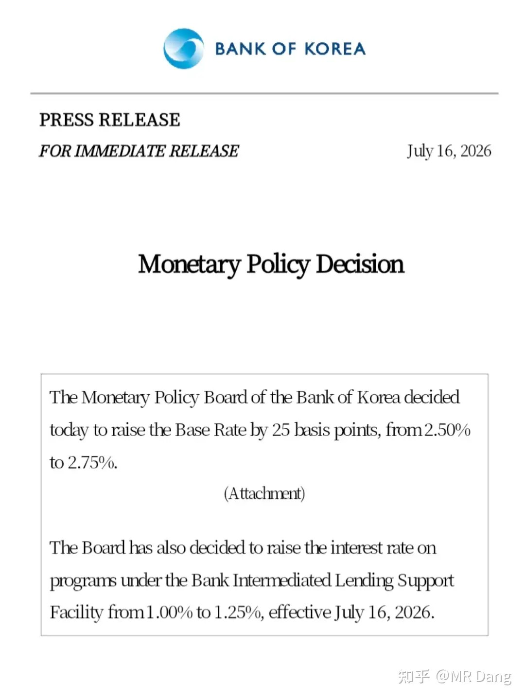

这个是昨天盘前的消息，资本市场已经计价。

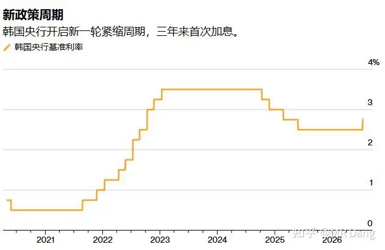

目前利率水平来到了2.75%，有机构预测最终目标是3.25%以上，还会有多次加息。

以前韩国央行加息对其他市场影响有限。

但是现在韩国股市关注度高，杠杆也高，风险很容易外溢。

全世界各地都有投资了韩国高杠杆金融产品的投资者，一旦韩国流动性收紧，会造成其他市场的流动性紧张。

韩国加息的原因除了通胀高企以外，经济增速也是底气所在。

鉴于现在韩国在科技圈的生态位，韩央行的加息更像是对科技行业的定向加息，会压制科技股的估值。

美联储雄鹰般的女人：

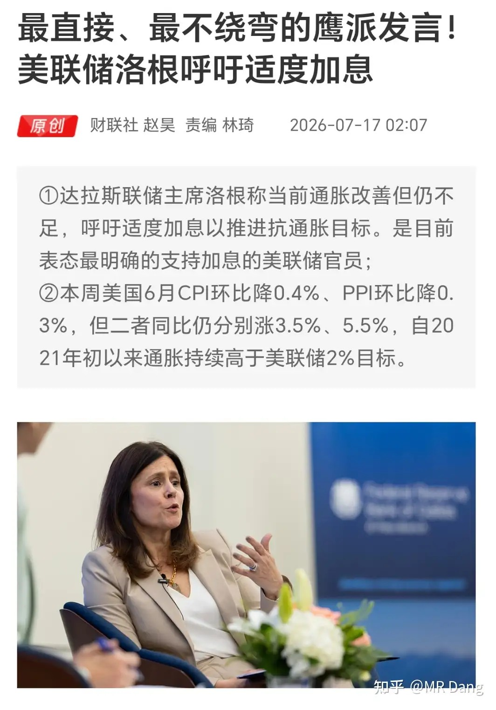

这姐们是在任票委里最鹰的一个，传统强硬鹰派，现在打直球，明确提出了加息。

她表态后，9月加息概率从40%提升到了62%左右，贵金属跳水。

猴模块：

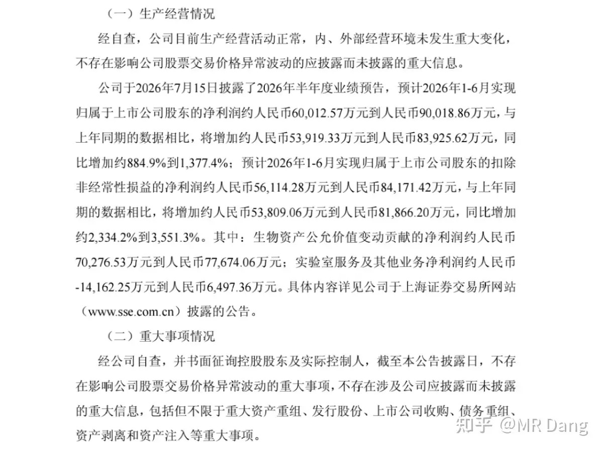

相关企业发了个异动公告，主要解释了利润增速来源于生物资产的公允价值变动。

换成大白话说，实际没赚到很多钱，但是养的猴子市场价值提高了，以后如果卖了高价，就能兑现利润。

生物资产分三大类，消耗性，生产性和公益性。

消耗性的就是拿去卖的，卖一个少一个，比如实验猴和肉猪，会计处理逻辑类似于存货。

生产性就是拿来用的，讲的是日复一日做贡献，比如奶牛和种猪，会计处理逻辑类似于固定资产。

公益性就是防护林什么的。

光伏电池被反规避：

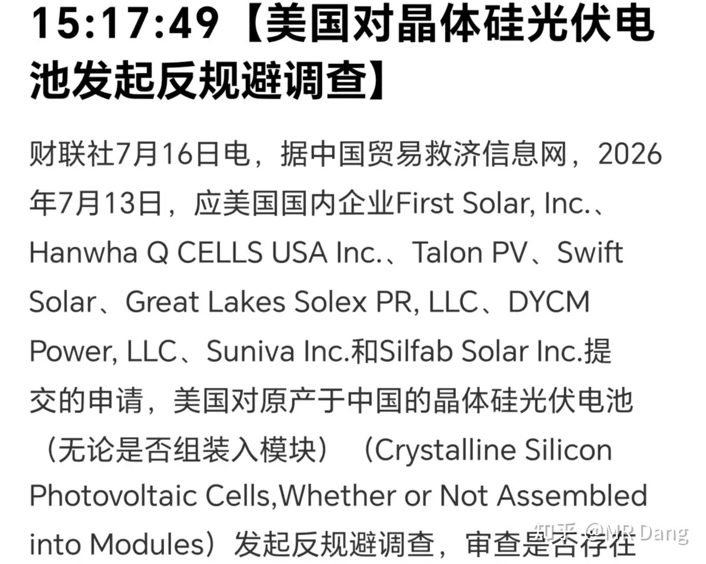

反规避的意思就是有些企业为了避免高额关税，把产品加工到99.9%完成度运到低关税的国家，然后在当地找人完成最后一步，以优惠税率出口到西大。

利空相关行业。

长鑫：

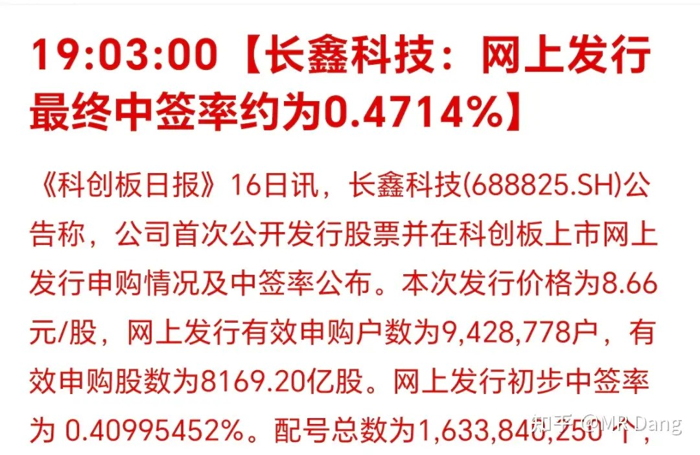

可以拿这个去测试Ai水平，问他多少市值能必中一签。

如果 Ai开始用概率论计算，那说明不够聪明。

因为中签号不是随机分布，所以不适用概率论。

而配号则是连续的，中签号最多的是看后3位或者后4位数字。

按照公布的中签率，末三位有四个中签号，这四个中签号是等距离排布的，相距离250个数字，这个250叫步长。

连续250个号码几乎是必中的，对应的市值要求是125万。

我问了几个国产Ai，答案千奇百怪，没一个算对的。

125万以上，至少中一签，运气好能中两签或者更多。

某存储接口企业被韩国搜查：

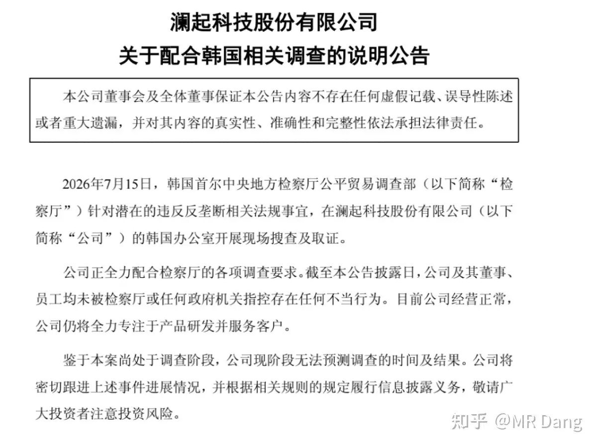

倒不是针对谁，另外两家岛国和西大的同行也被查了。

部分企业发布的业绩预告：

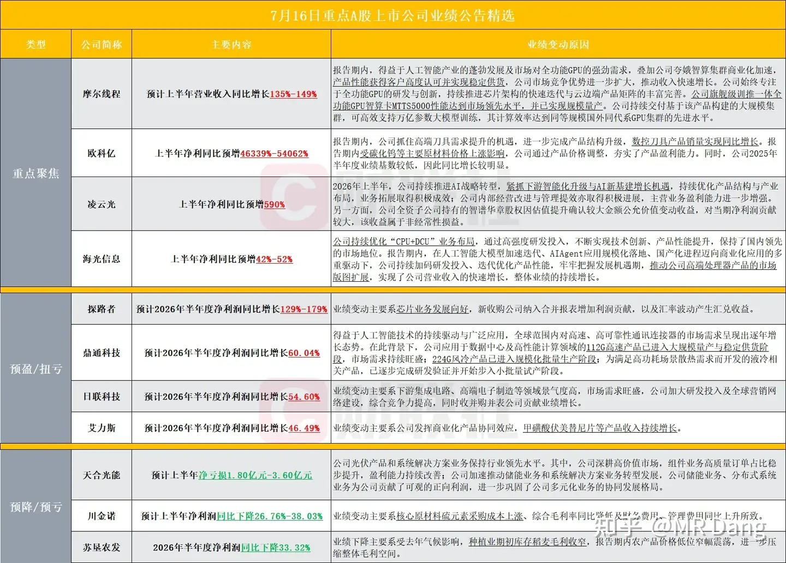

科技企业占比略高。

业绩看着不算差，倒也没有特别爆炸的，主要是估值太高了，让人预期打的比较满。

还有的企业发业绩预告只谈营收，不谈利润，也算是奇观了。

大宗商品：

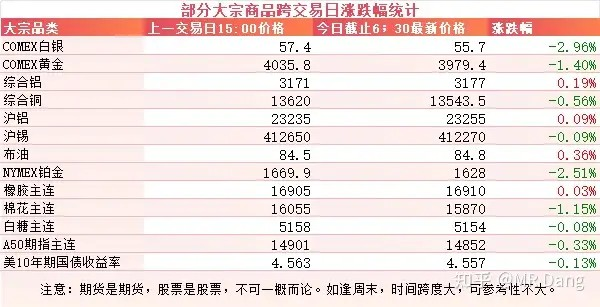

收消息面影响，贵金属回调，黄金跌破4000大关。

工业金属表现相对平稳。

外围市场：

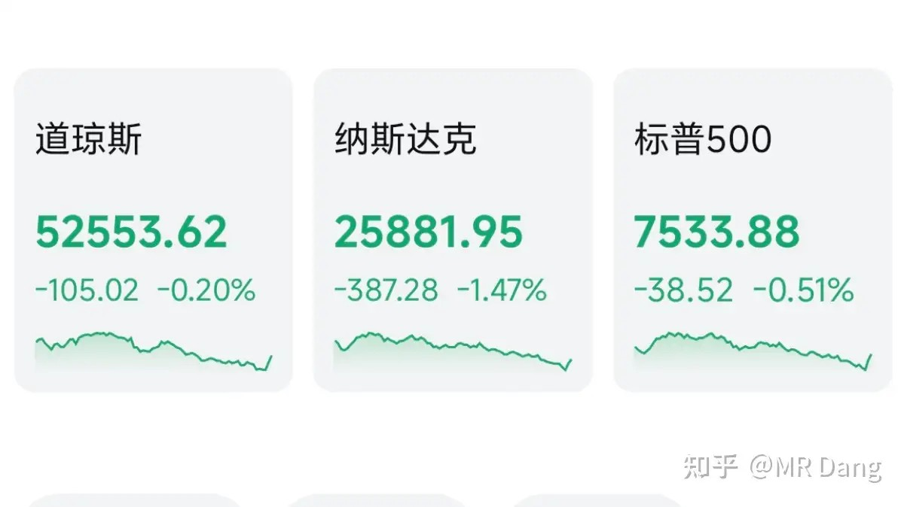

美三大股指集体回调，纳指领跌，科技板块跌了不少，半导体雪崩，存储板块回调了十个点以上，传统行业表现较好。

昨天个人组合净值回撤大半个点，银行绿大半个，资源基本打平，消费微红，电网绿三个。

只看自己的账户还没啥感觉，不过只要看一眼指数，再看账户突然也觉得眉清目秀了起来。

又把昨天是星期四这件事给遗忘了，不知道是不是错觉，感觉最近一段时间以来的星期四特别容易崩。

量化策略是不是可以考虑把黑色星期四这个因子加进去，周三收盘减一点，然后到了周五开盘买进去，感觉说不定真能提高收益率。

好吧，说笑的，我并不懂量化因子的选择标准。

昨天市场整体上涨的股票数量比下跌的略少一些，中位数也是跌的。

不过恒科倒是支棱起来了，打了个翻身仗。

现阶段要是有什么需要说的，还是以前那些车轱辘话，下落的飞刀不要接，不要老想着抄底。

特别是科技板块，不要有锚定效应，看着前面的高点在那里算自己占了多少便宜，现在市场里的便宜货并不少，多看少动，挑三拣四才是最优解。

一个喜欢保护韭菜的博主，希望大家少少踩坑，多多赚钱！！！

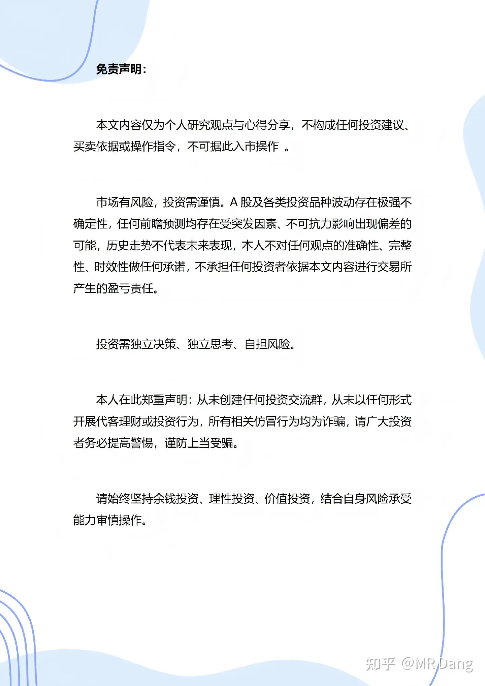

> [!comment]- 点击展开评论
>
> | 用户 | 时间 | 内容 |
> | :--- | :--- | :--- |
> | 浪里小白马 |  | 炒股没到半年，但是已经是老股民了，这个市场活下来控制好回撤真的太重要了 |
> | &nbsp;&nbsp;&nbsp;&nbsp;如来熊掌 |  | 我也活下来了，就是裤衩子被人扒了 |
> | &nbsp;&nbsp;&nbsp;&nbsp;浪里小白马 |  | 我还好，虽然还是亏的，但是几个点的回撤顺丰的话一周就回来了 |
> | 潇夏 |  | 犯天条了吗？这是见过跌幅最大的一次，太恐怖了吧。 |
> | &nbsp;&nbsp;&nbsp;&nbsp;ToxicS |  | 这才算啥，我经历过15年，那跌法才叫恐怖，连续千股跌停，大盘熔断3次。 |
> | 相象 |  | 今天这篇有水平 不骂你了 |
> | 如来熊掌 |  | 就等烂银行分红呢，结果就他能憋 |
> | 街对面的老李 |  | 其实125万也不对…智谱在提醒之后能够算对，大约500万，ChatGPT、Gemini都错了 |
> | sjj4j |  | 中签概率竟然这么高，我昨天才知道这申购规则，我其他条件都符合，但是持仓里竟然没有沪市的票没有申购资格，错失了一个亿 |
> | &nbsp;&nbsp;&nbsp;&nbsp;夏为 |  | 咱俩匀匀吧，我都是沪市没有说深市的 |
> | &nbsp;&nbsp;&nbsp;&nbsp;凌风御凡 |  | 和我一样 |
> | 鹰目婲盗 |  | 一样儿，我也回撤了半个点左右，和duang哥一起云淡风轻 |
> | calm |  | 碳酸锂怎么说，有机会吗 |
> | 安静 |  | 我还以为日韩加息，他们流动性收紧，外资会转向低估的港股，利好恒科呢 |
> | &nbsp;&nbsp;&nbsp;&nbsp;Dominic |  | 外资会存银行 |

---

*本文件从MR Dang知乎页面转载*

---

**作者**: MR Dang
**链接**: https://www.zhihu.com/question/2060820390327408306/answer/2061351471111731167
**来源**: 知乎

*著作权归作者所有。商业转载请联系作者获得授权，非商业转载请注明出处。*

---

## 相关阅读

**📈 每日行情系列：**
- [[20260714-如何看待2026年7月14日a股行情？|7月14日行情]] - 本周急跌与业绩预告窗口的背景
- [[20260715-怎么看待2026年7月15日A股市场行情？|7月15日行情]] - 进出口数据、业绩披露与市场修复
- [[20260716-如何看待2026年7月16日A股市场行情？|7月16日行情]] - 社零、房地产数据与科技估值风险

**⚔️ 功法系列：**
- [[20260516-《地阶功法卷十二》宏观数据基础分析技巧＆最新宏观研判|地阶功法卷十二]] - 将海外利率和国内数据纳入宏观研判
- [[20260314-《天阶功法卷八》永久投资组合原理详解＆新时代中国资本市场完善方案|天阶功法卷八]] - 用组合思维分散单一风格风险
- [[20260306-《地阶功法卷八》大宗分析秘要|地阶功法卷八]] - 延伸理解碳酸锂等商品的供需分析方法

**🧭 方法论：**
- [[20251020-投资新手避坑指南之仓位控制|仓位控制]] - 控制回撤并为后续机会保留余地
- [[20251022-《地阶功法卷一》投资者必须斩杀的三个妄念|投资者必须斩杀的三个妄念]] - 避免抄底冲动和锚定效应
- [[20251023-《地阶功法卷二》价值投资三大误区|价值投资三大误区]] - 在下跌中辨别价格与价值
- [[20251016-投资新手避坑指南之追热点(万粉特别奉献)|追热点避坑]] - 科技叙事活跃时更要警惕追高
