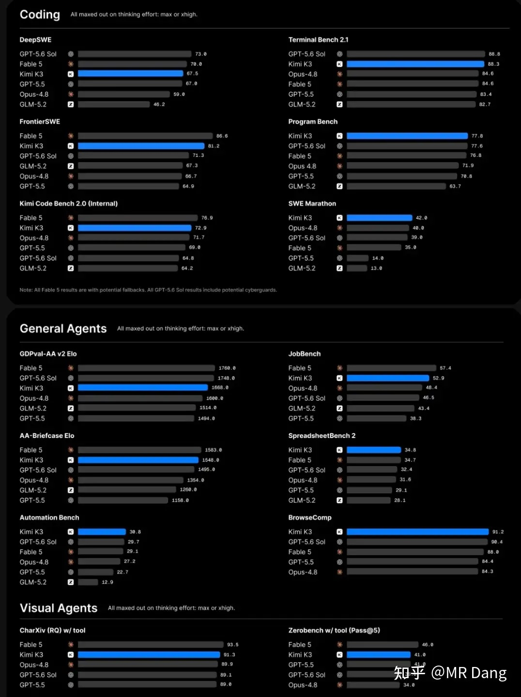
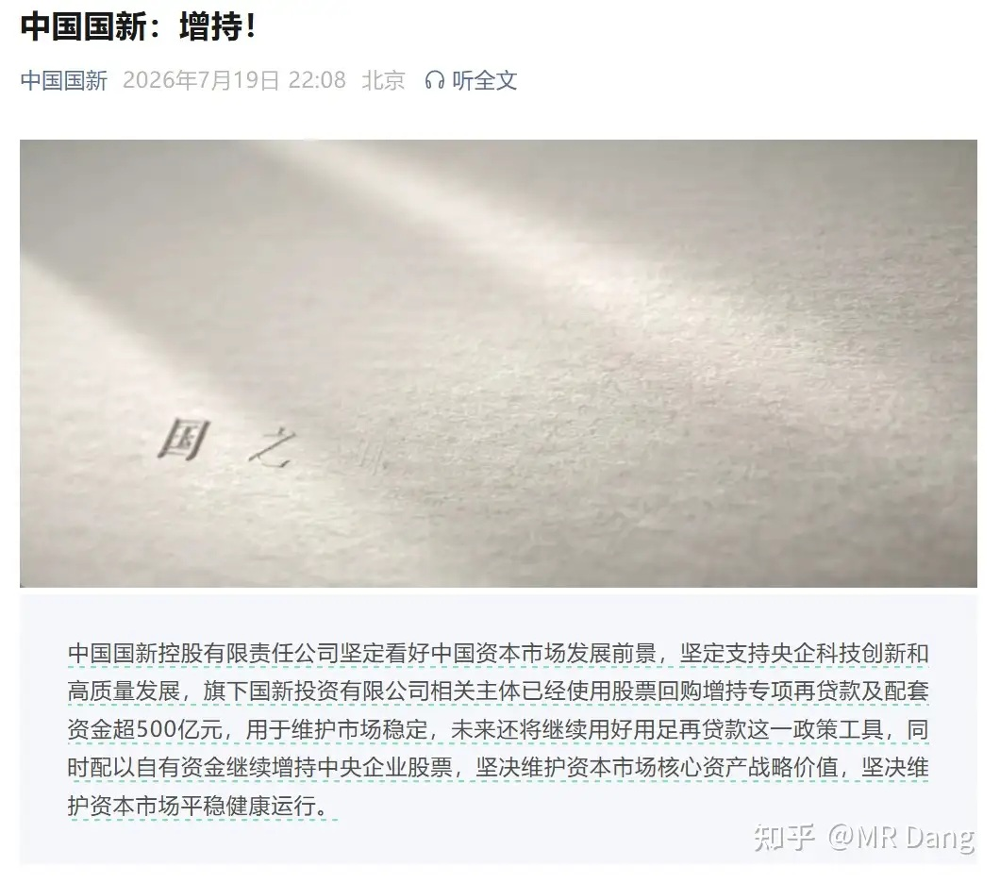
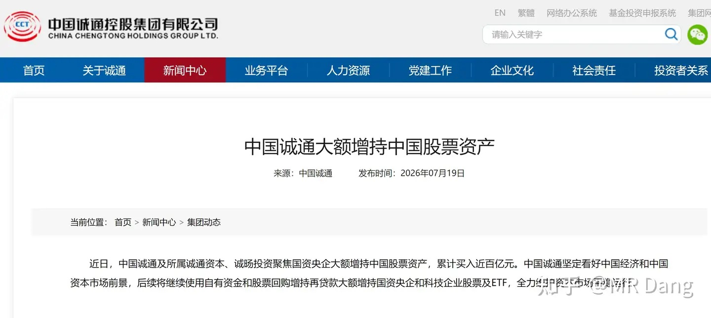
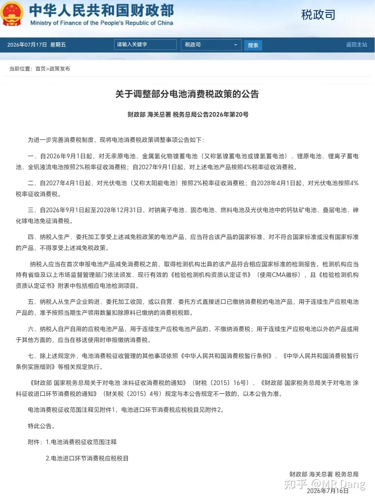
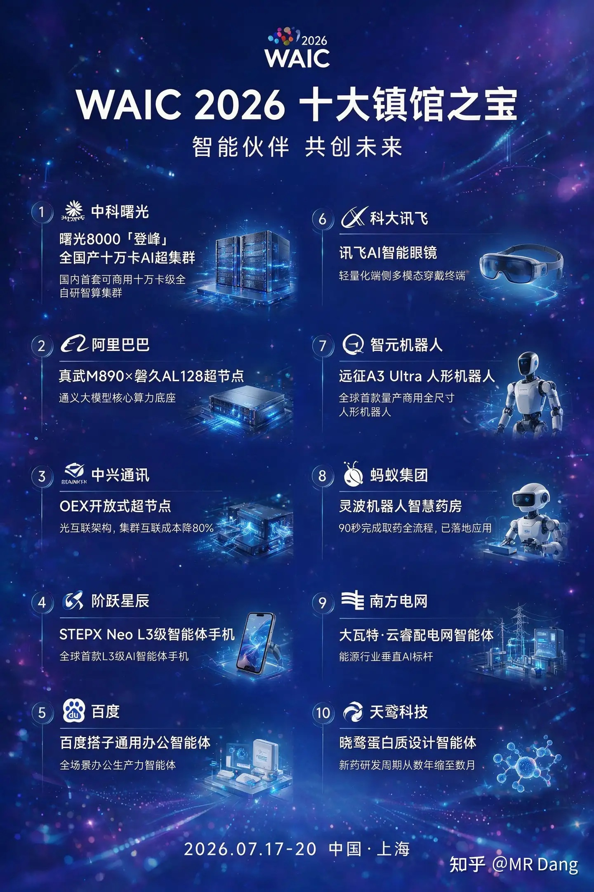
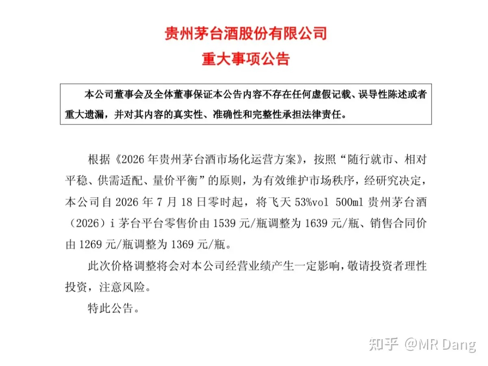
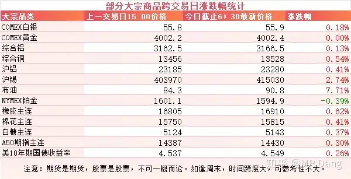
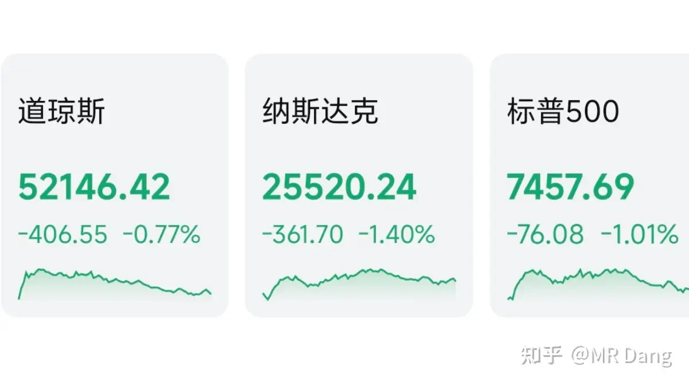
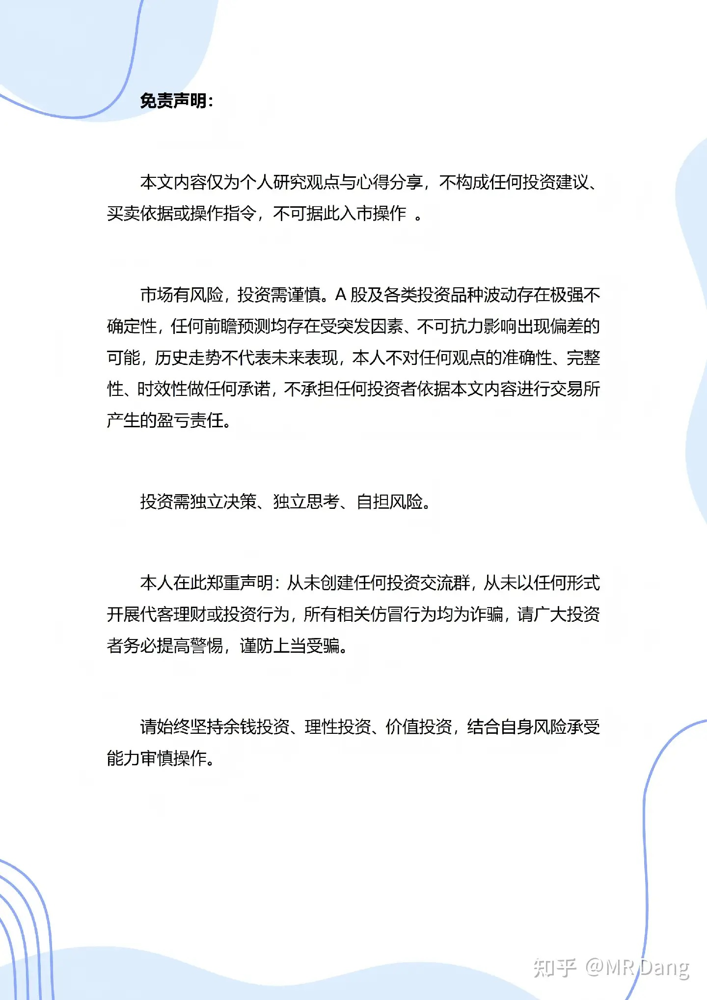

# 如何评价2026年7月20日A股市场行情？

---

**发布时间**: 2026-07-20 07:29  |  **原文链接**: https://www.zhihu.com/question/2056744672928835073/answer/2062438997570360101  |  **点赞数**: 199 人赞同

**作者信息**: MR Dang | 证券从业资格证持证人

---

## 正文内容

周末期间发酵的比较厉害的事情，还属之前发布的Kimi K3的大模型：

简单的说，就是月之暗面最新的模型不仅完全开源，而且性能媲美顶级闭源模型，比如Claude Fable5，GPT5.6 Sol。

在外媒上这款模型获得了盛赞，被称为又一次的Deepseek时刻。

当然说的是媲美，整体性能上还是有差距的，只是个别单项性能超越了一众好手。

这件事对西大的资本市场有不小的震动，当天量的资源堆砌没有取得相应的领先优势时，资本市场对这些投资是否能取得与之相配的回报产生了一丝怀疑。

Deepseek的V4也快登场了，根据目前传出的消息，相对Kimi K3，在价格上会更有优势。

---

### 维稳出手

诚通和国新是全国仅有的两家国有资本运营公司，地位特殊。

昨晚同步发表了增持公告，一个近百亿，一个500亿，增持对象主要是**央国企。**

呵护市场的态度很明确了。

---

周末期间美伊局势又有进展，两边都没太留手，互有伤亡。

现在这方面消息对资本市场的影响越来越小了，所以只是顺便提一嘴。

---

### 电池行业

本身消费税的税率不是很高，但是政策出台一般都是配套的组合拳。

之前消费税对锂电和硅光伏电池都是有免税政策的，现在只剩钠离子电池，固态电池，燃料电池和钙钛矿电池这些。

不免税的，成本压力会增加，相对免税的品种，性价比优势就会降低。

钠电池和固态电池本来就对锂电行业虎视眈眈，现在来这么一手，锂电产业链日子只会过的更艰难。

锂电行业之前表现不佳，有时候让人摸不着头脑，现在看来，还是有部分资金预测到了更远的未来。

---

### WAIC十大镇馆之宝

官方没发布海报，只公布了名单，这是我丢给Ai，让Ai做的，还像模像样的。

十大镇馆之宝，直接强关联对应的有5家相关上市企业，两家港股，三家A股。

其中曙光8000作为头牌，定位是国产算力基础设施的标准化样板，长协订单多，是某些算力中心的招标参考标准：比如他的PUE只有1.04，远低于国家的1.3红线。

另外还有一个讯飞眼镜，定位是翻译场景下的B端采购，因为可能卖的比较贵，C端需求比较有限。

---

### 飞天茅台涨价

53度500ml的就是俗称飞天茅台的那一款，一开始在i茅台是1499，后来涨到1539，现在涨到1639。

涨价的底气是因为现在市场上还有点溢价，零售终端成交价还在1700附近，散茅回收价也在1600以上。

这样一来，涨价后套利空间几乎就没了，羊毛党遭遇史诗级削弱。

经销商的日子也更难过了。

对茅台来说，好消息是进一步释放利润，坏消息是溢价空间已经被填平，以后想再这么释放利润，难度就大了。

---

### 大宗商品

受美伊局势影响，原油价格在周末期间大幅上涨，涨幅七八个点。

其他有色品种表现尚可，也多有一定涨幅。

### 外围市场

上个交易日美三大股指回调，纳指领跌，科技板块普遍表现不佳，仅油气相关的行业有比较好的表现。

---

上个交易日个人组合净值回撤一个多点，银行纳米绿，资源绿两个，消费绿两个半，电网绿四个半。

市场还是相当惨烈的，400多只股票上涨，5000多只待涨，中位数是跌了四个多点，

所以怎么说呢，亏四个以内已经算不错了，不掺任何水分的评价。

这样一来量化因子把黑色星期四加进去还是不够完善，应该把黑色星期五也加进去，一周只参与前三天，胜率说不定能再进一步提高。

好吧，这个笑话并不好笑，实在是怒其不争啊。

事已至此，个人认为也不宜过于悲观。

涨的时候不相信“慢”，跌的时候不相信“牛”，都是情绪推动的结果。

通过宽基ETF的数据和诚通国信公告来看，维护市场信心也并没有只停留在口号上。

我们的市场融资功能比其他市场要完善的多，要想发挥好这个功能，也是需要给市场注入更多的活力的。

同时还要把握不能把泡沫吹的太大，累积过高的风险。

所以最后的市场表现就是吹一吹，停一停，再吹一吹。

---

### 本周前瞻

1，今天有关部门要开会研究稳定市场。

2，今天公布东大发电数据。

3，今天公布LPR数据，很久没变过了，市场预期不变，保持在3%。

4，周四公布西大初请失业金人数。

5，本周有几家重量级的美股企业发布财报，比如谷歌，英伟达，特斯拉等。

---

今天是新股缴款日，中了签的一定要留够资金，别白忙活一场。

---

### 一个喜欢保护韭菜的博主，希望大家少少踩坑，多多赚钱！！！

> [!comment]- 点击展开评论
>
> | 用户 | 时间 | 内容 |
> | :--- | :--- | :--- |
> | 揸fit路人 |  | 黑色星期一，黑色星期二，黑色星期三，黑色星期四，黑色星期五。 |
> | &nbsp;&nbsp;&nbsp;&nbsp;糖豆 |  | 不是黑色星期一，是黑色一星期 |
> | &nbsp;&nbsp;&nbsp;&nbsp;0614具具 |  | 虽然我这个月略略亏了，但你写的把我看笑了[飙泪笑] |
> | &nbsp;&nbsp;&nbsp;&nbsp;奔雷手 |  | 工作日伤你心 周末出新闻继续暴击[doge] |
> | 南辰 |  | 锂电行业之前表现不佳，有时候让人摸不着头脑，现在看来，还是有部分资金预测到了更远的未来。  不愧是你，说话真含蓄 |
> | &nbsp;&nbsp;&nbsp;&nbsp;MR Dang |  | [感谢] |
> | &nbsp;&nbsp;&nbsp;&nbsp;正在输入 |  | 部分资金来源于散户[打招呼] |
> | YOLO |  | D大，早上好[感谢]，多了一个证劵资格从业持证人title。 |
> | &nbsp;&nbsp;&nbsp;&nbsp;MR Dang |  | [感谢] |
> | &nbsp;&nbsp;&nbsp;&nbsp;夏天 |  | 我也是刚刚看到，恭喜老师🥂🥂 |
> | 如来熊掌 |  | [感谢]我还在等老登的春天 |
> | Coldmoon |  | 希望我的一千块巨款变成亿万 |
> | 簌簌 |  | 早上漏了打卡，补一下，今天是在红利基中寻求安慰的一天[感谢] |
> | 奔跑的猴子啊 |  | 连锁药店反转了吧 |
> | &nbsp;&nbsp;&nbsp;&nbsp;陌上愚翁 |  | 都涨完一波了[捂脸] |
> | 一道闪电 |  | 锡王给机会了呀[感谢] |
> | &nbsp;&nbsp;&nbsp;&nbsp;做了一个梦 |  | 先后经历了套保减持计提又套了一个算力金属的概念跟着科技一起跌。考验信仰的时候到了 |
> | &nbsp;&nbsp;&nbsp;&nbsp;茯苓饮 |  | 期货一直高位，股价猛跌，不知道干啥 |
> | Player |  | 买了中兴通讯，被埋伏了[捂脸][捂脸] |
> | 浪里小白马 |  | 烂银行咋还不分红，我还等着分红了就加码，最近又涨上去了，真是头疼 |

---

*本文件从 MR Dang 知乎页面转载*

**作者**: MR Dang  
**链接**: https://www.zhihu.com/question/2056744672928835073/answer/2062438997570360101  
**来源**: 知乎

*著作权归作者所有。商业转载请联系作者获得授权，非商业转载请注明出处。*

---

## 相关阅读

- [[20260717-怎么看待 2026 年 7 月 17 日A股市场行情？|上一篇：怎么看待 2026 年 7 月 17 日A股市场行情？]]
- [[20260721-怎么看待2026年7月21日的A股行情？|下一篇：怎么看待2026年7月21日的A股行情？]]
