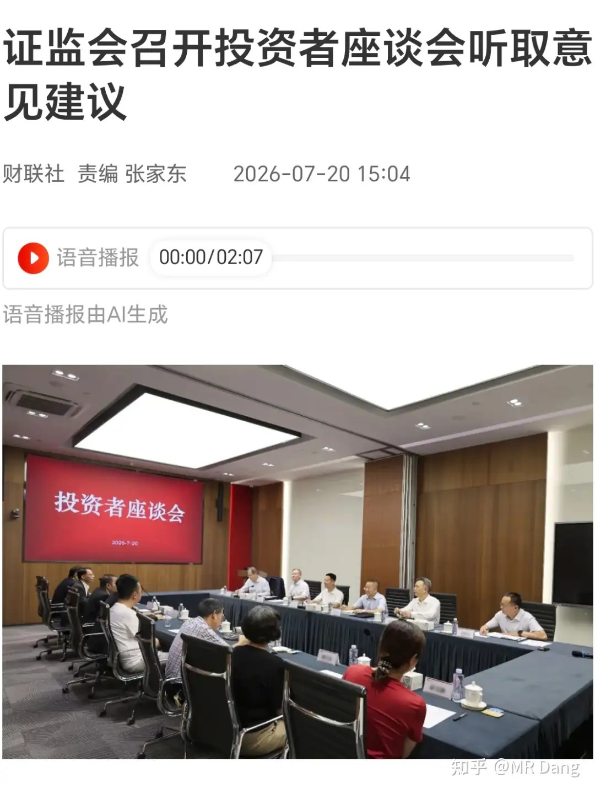
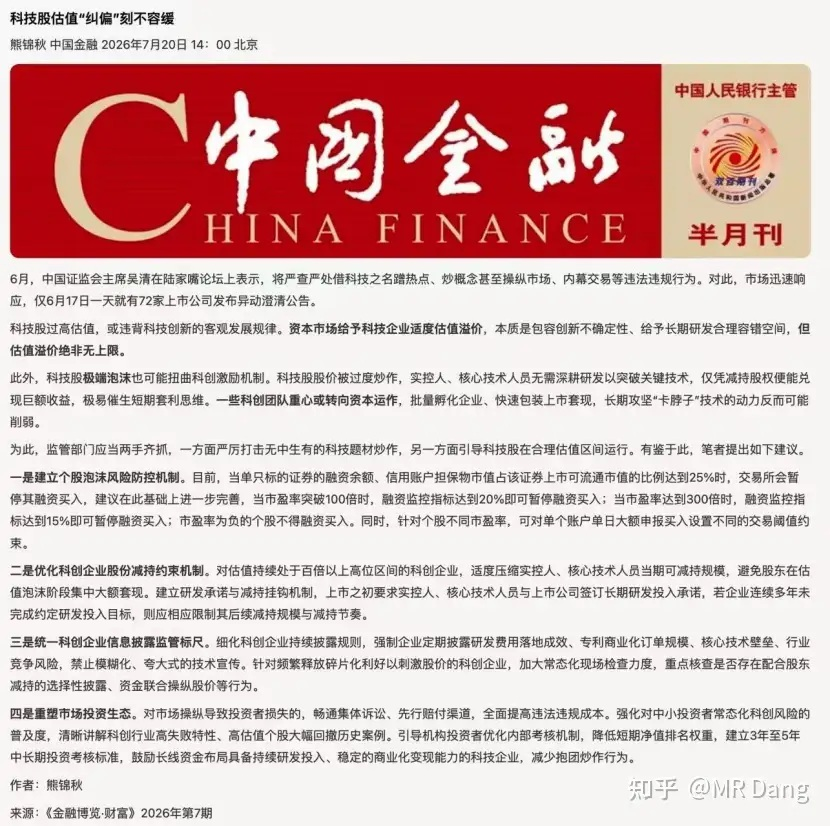
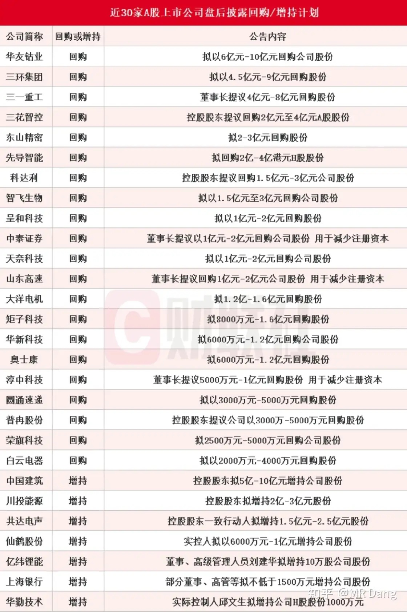
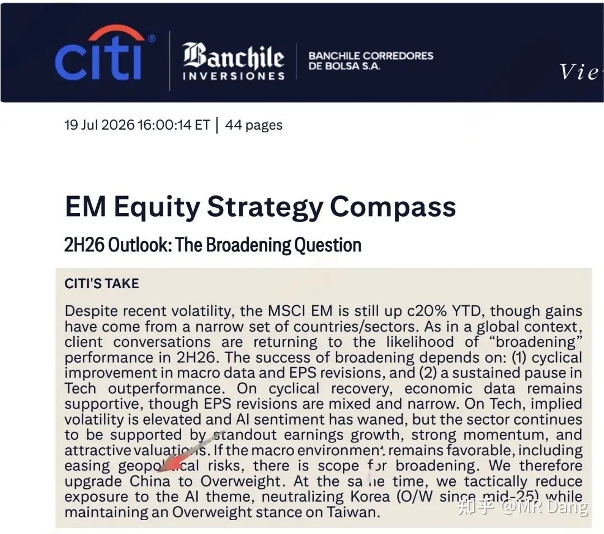
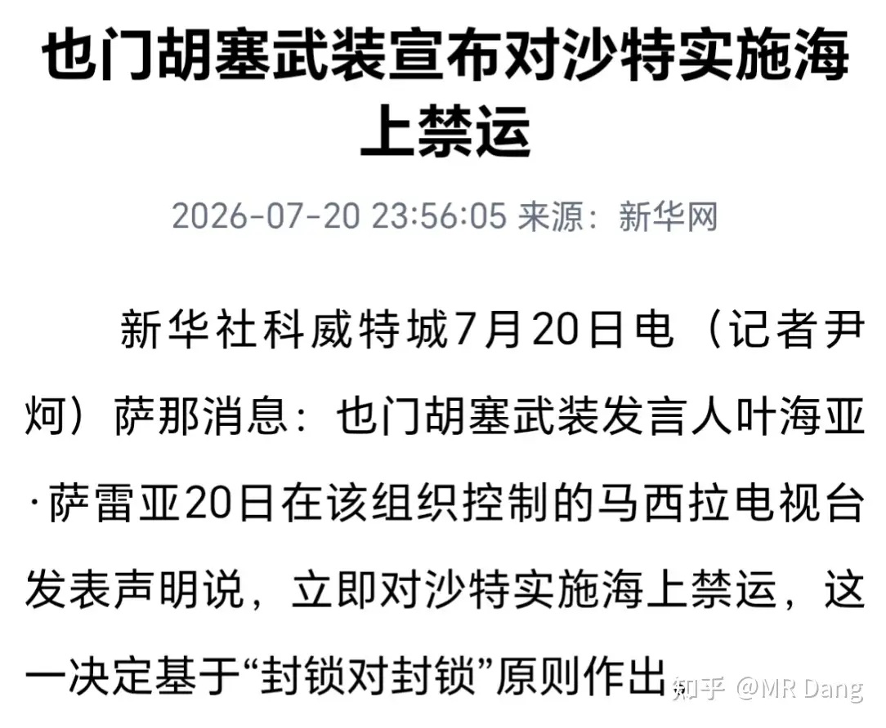
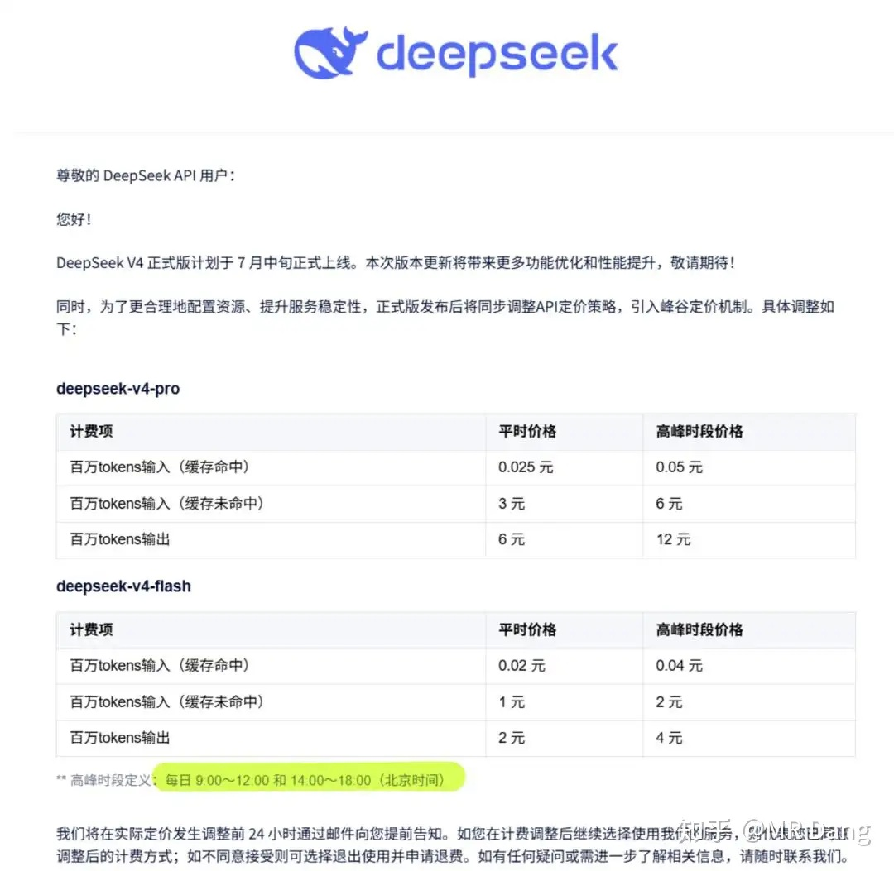
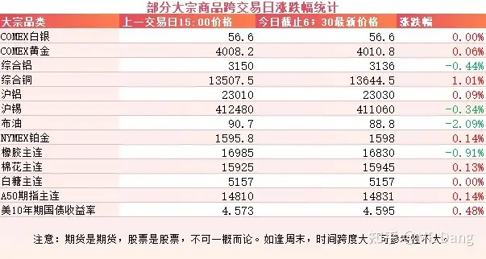
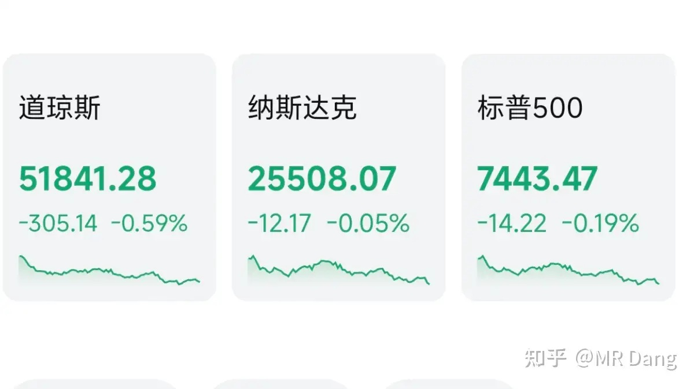

# 怎么看待2026年7月21日的A股行情？

---

**发布时间**: 2026-07-21 07:37  |  **原文链接**: https://www.zhihu.com/question/2061378912362436270/answer/2062803395371589793  |  **点赞数**: 190 人赞同

**作者信息**: MR Dang | 证券从业资格证持证人

---

## 正文内容

### 昨天开的会

相信我们的资本市场会越来越好的。

### 还有一篇来自《中国金融》的文章，在昨天传播度也比较高

---

### 部分企业公布的回购和增持计划

这么密集的增持和回购计划，希望可以给市场注入信心。

---

### 花旗最新研报

花旗发布了一份名为《新兴市场股票策略2026年下半年展望》的研报。

在研报中花旗认为韩国股市波动太大了，下调了其评级，同时认为大A市场估值水平比较低，应该超配。

---

### 也门胡赛武装宣布对沙特禁运

胡赛属于什叶派，沙特是逊尼派，两边不太对付。

自从美伊局势紧张后，沙特出口原油改走红海，到现在为止，每天有四百多万桶原油从红海经过。

胡赛对红海的掌控肯定不如伊朗对霍尔木兹那样，沙特估计也会搞护航行动，最后实际能影响多少原油的供应还需要再观察。

但是情绪上已经开始影响了，本来原油价格已经跳水，硬是被这消息又拉上来一点。

---

### Deepseek v4正式版

目前还没正式发布，但是通过邮件预告了计费规则，首次采用了峰谷定价，和电价的定价逻辑相同。

这标志着大模型API已经基础设施化，不只是单纯的追求利润，而是和电力一起嵌入我们整个社会的运行框架里。

如果这成为主流，那作为商业模式来说，一个基础设施一样的东西，是很难有超额利润的。

---

### 大宗商品

隔夜商品方面，原油价格有所回调，有色整体波动不大，铜表现略微强势。

### 外围市场

美三大股指集体回调，道指领跌，科技股表现还行，其他没什么表现太好的板块，市场热度不高。

---

昨天个人组合净值回血一个多点，银行红一个点，资源红三个，消费红一个半，电网微绿。

持仓体验很好的一个交易日，红多绿少，持续回血。

整个市场有1700多家公司上涨，另外3700多家待涨，中位数大概是回调了两个点左右。

很明显，和指数的涨跌有点不一样。

这主要是因为昨天的风格是集中在头部市值的企业里，比较偏向老登。

没经历过股灾的投资者可能不知道救市时候的一些波折，神秘资金出手的时候一般会避开小市值的企业。

一是因为对市场影响不大，二也是为了避嫌，防止利益输送，三是给自己留够腾挪空间。

没事的时候我还瞄了眼港股的科技股，大为震惊。

智谱一个月以前股价2980，目前不到900，前面的两千跌没了。

Minimax四个月以前股价1330，目前不到两百块，前面的一千跌没了还不够。

要说它们是伪科技，那还真是冤枉了，确确实实有真东西。

但是再好的科技，也要有相应的估值进行匹配，如果脱离了常识的范围，就会变得很危险。

---

### 一个喜欢保护韭菜的博主，希望大家少少踩坑，多多赚钱！！！

> [!comment]- 点击展开评论
>
> | 用户 | 时间 | 内容 |
> | :--- | :--- | :--- |
> | lion |  | 回购不注销，等于没回购 |
> | &nbsp;&nbsp;&nbsp;&nbsp;MR Dang |  | [感谢] |
> | &nbsp;&nbsp;&nbsp;&nbsp;蓬蒿人 |  | 老股民都知道回购还可以到期满随便找个借口一股不买无任何惩罚的，也就是空头支票[飙泪笑]而从发回购到期满的一年够割多少新韭菜了 |
> | 激水漂石 |  | 我这人比较简单。半月前，空仓。至今。 |
> | &nbsp;&nbsp;&nbsp;&nbsp;MR Dang |  | [感谢] |
> | 小虎新知 |  | deepseekv4不早就上了吗，怎么在博主这里感觉才刚上一样，而且峰谷定价早在七月初就预告了 |
> | &nbsp;&nbsp;&nbsp;&nbsp;谷雨 |  | 之前的是preview版本 这次说的正式版 |
> | 林泉 |  | 买了书，会说你就多说点吧，不要每天转发新闻了 |
> | &nbsp;&nbsp;&nbsp;&nbsp;药不能停 |  | 书里面都是知乎专栏的东西，不知道买书干嘛[捂脸] |
> | 夏天 |  | 老师早☕☕祝贺老师拥有新的重量级title🥳🥳 |
> | &nbsp;&nbsp;&nbsp;&nbsp;MR Dang |  | [感谢]谢谢 |
> | &nbsp;&nbsp;&nbsp;&nbsp;感受世界的善意 |  | 想知道，什么title[思考] |
> | &nbsp;&nbsp;&nbsp;&nbsp;夏天 |  | 请移步老师主页 |
> | 念玉 |  | 华夏银行啥时候分红啊[捂脸] |
> | &nbsp;&nbsp;&nbsp;&nbsp;joly |  | 已经等到姥姥家了。 |
> | &nbsp;&nbsp;&nbsp;&nbsp;羡仙 |  | 刚过去的股权登记日是哪天啊？我七月三号加仓的能拿到股息吗 |
> | &nbsp;&nbsp;&nbsp;&nbsp;念玉 |  | 25年年报的还没开始登记[捂脸] |
> | niche |  | 之前的国光股份几乎腰斩了…还能追加买入吗😭 |
> | Lion |  | 智谱今天涨39个点[思考] |
> | Sunny-deer |  | 3700家待涨[赞][赞][赞] |
> | 无为 |  | [感谢] |

---

*本文件从 MR Dang 知乎页面转载*

**作者**: MR Dang  
**链接**: https://www.zhihu.com/question/2061378912362436270/answer/2062803395371589793  
**来源**: 知乎

*著作权归作者所有。商业转载请联系作者获得授权，非商业转载请注明出处。*

---

## 相关阅读

- [[20260720-如何评价2026年7月20日A股市场行情？|上一篇：如何评价2026年7月20日A股市场行情？]]
- [[20260722-对2026 年 7 月 22 日 A股市场行情，大家有什么好的看法和建议？|下一篇：对2026 年 7 月 22 日 A股市场行情，大家有什么好的看法和建议？]]
