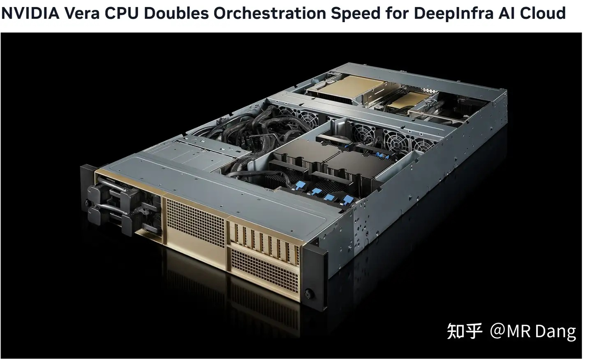
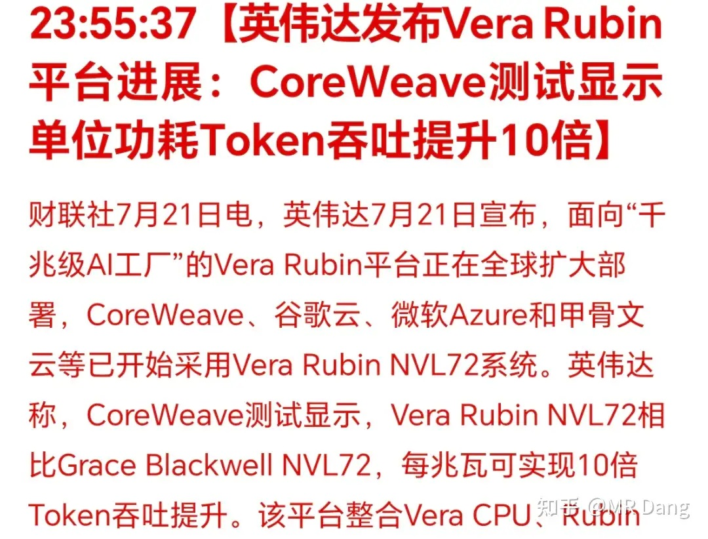
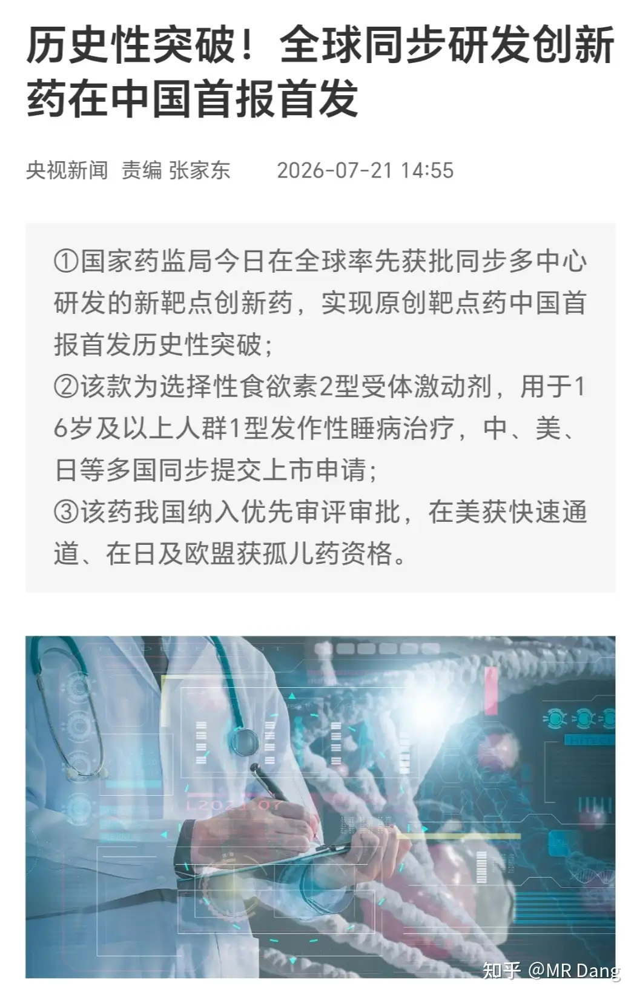
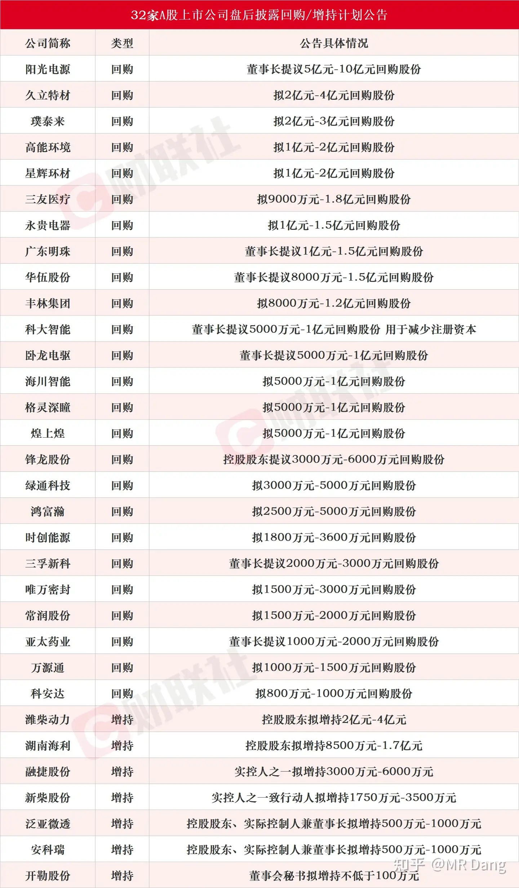
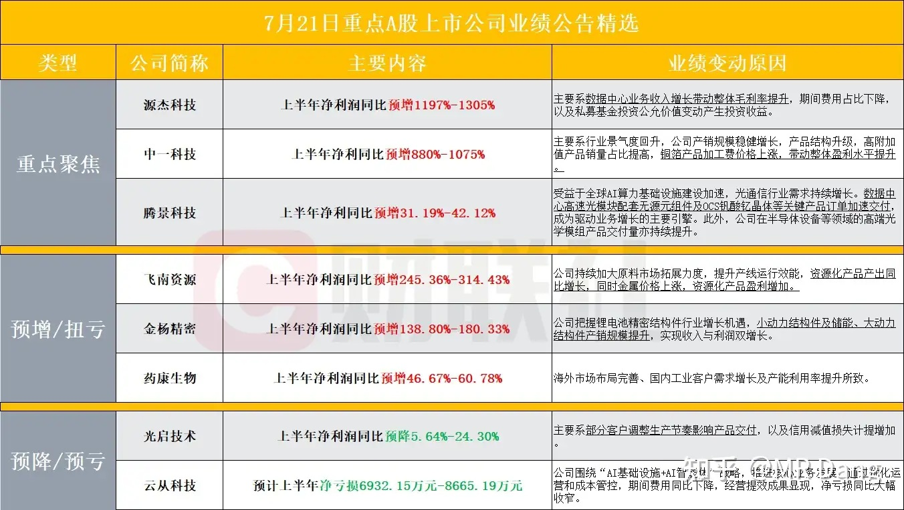
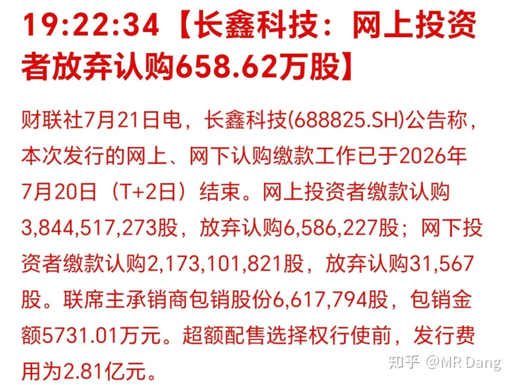
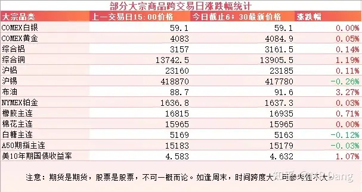
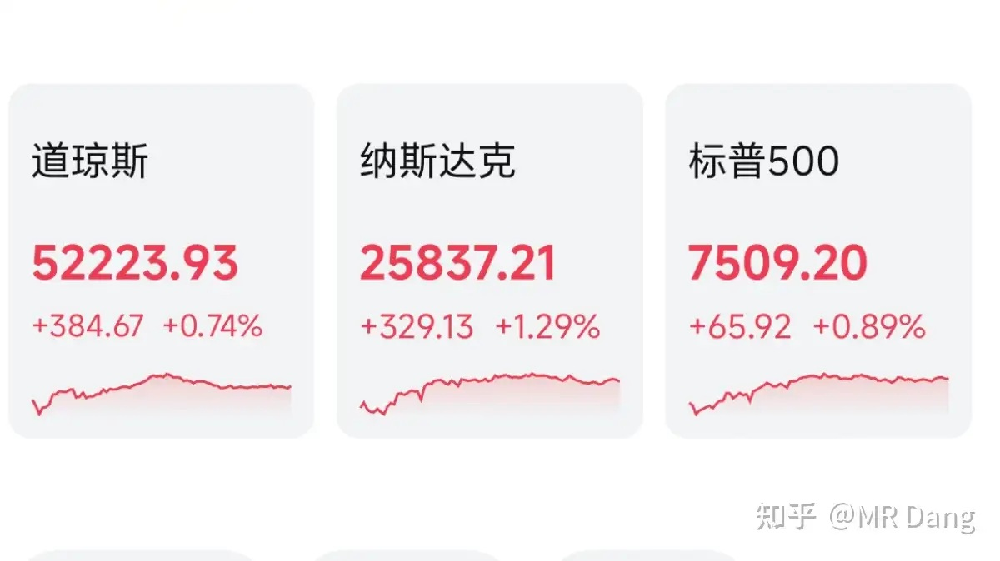
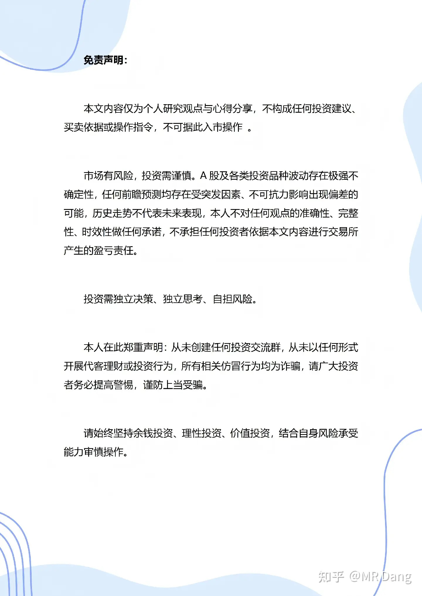

# 对2026 年 7 月 22 日 A股市场行情，大家有什么好的看法和建议？

---

**发布时间**: 2026-07-22 07:30  |  **原文链接**: https://www.zhihu.com/question/2062840874455798809/answer/2063163957913859314  |  **点赞数**: 194 人赞同

**作者信息**: MR Dang | 证券从业资格证持证人

---

## 正文内容

英伟达：

发布了下一代Ai专用Vera CPU的部分参数，称性能是其他CPU两倍多。

除了CPU，在GPU方面，英伟达自称Rubin平台相对Blackwell，单位功耗效率提升了10倍：

我后来查了下，英伟达说的十倍是整个平台，不是单指GPU，其中NVLink6互联就直接让效率翻倍。

而且是特定场景下才能达到，比如Deepseek——R1的高并发场景。

但不管怎么说，这都会让以后token的成本大幅降低。

---

### 创新药审批

这个历史性突破还真不是UC震惊部写的标题（好有年代感的梗），而是真真正正的历史性突破。

突破在哪里呢？

首报首发。

就这么简单的四个字，背后是创新药整个监督管理效率的突飞猛进。

这家企业是岛国最大的创新药企业，武田制药。像安吉优和沃克，家里有肠胃病人的应该都听说过的两款神药，就是他家的。

以前的规矩是什么？外国大药企做出来的最新药，永远先给美日欧的病人用，咱们中国病人要等3-5年，甚至更久，要么花天价代购，要么硬生生熬到进口审批完。

这次反过来了：这个药全球第一个在中国批准上市，比美日欧都快，等于咱们中国的病人，是全世界第一批能吃上这个药的人——这是历史头一回，说明咱们国家的新药审批速度，现在已经跑到全球最前面了。

其实前一段时间还有个创新药绿色通道的新闻，我也发过，没想到这么快就落地了，为效率点赞。

---

### 部分企业回购增持计划

回购和增持都是好事，稳定市场预期。

回购如果能注销，那就是锦上添花了。

---

### 部分企业业绩预告

---

### [长鑫弃购658万股](/stocks/688825.SH)

在这个市场待久了，就会发现再大的肉签总会有人弃购，让人看着眼馋。

以前主板的新股，在上市的时候，20%限制，第一次竞价，总会有人往外卖。

有时候打破脑袋都想不通，多等两分钟就能赚钱的事，为什么有人不愿意等，动动手指交个钱就能赚钱的事，为什么有人会放弃。

就像每年高考都有考生忘带准考证一样，只能感慨咱们国家幅员辽阔，人口众多了。

---

### 大宗商品

懂王称要攻击伊朗核设施，并且非常猛烈。受此影响，原油价格走强。

有色整体波动不大，铜表现相对强势。

美债收益率再度走高。

### 外围市场

美三大股指收涨，纳指领涨，存储板块走强，除了科技以外，有色和银行表现也算可以。

---

昨天个人组合净值回撤半个多点，银行绿一个半多，资源红大半个，电网红近四个，消费绿半个。

持股体验不算很差，只是把之前重复过很多次的科技暴打老登的剧本又重温了一遍。

我个人现在对科技没什么盼着回调的想法，因为有的金属莫名其妙的跟着科技走，还被叫做[算力金属](/stocks/000960.SZ)。

电网里也有两个带光的科技公司。

还有[马上要上市的存储企业](/stocks/688825.SH)。

已经尽量避开科技了，但还是多多少少沾了一些。

只是单纯的希望科技吃肉的时候不要鞭打老登取乐就行了。

昨市场上有3100多家公司上涨，另外2300多家下跌，市场中位数大约是涨了一个多点。

现在市场最大的问题是波动太大了，无论是上涨还是下跌，恨不得一天就到位。

昨天科创板涨了十个多点，从低点算起来一天振幅接近15%。

这什么概念呢？

以熔断和杠杆出名的韩股，近一年来波动最大的时候，无论涨跌，都达不到这个标准。

市场就和人一样。

人年青的时候情绪波动大，越成熟越稳重，随着阅历的增长，情绪会越来越稳定。

市场亦然，波动大是不成熟的表现，一天KTV，一天ICU的，只会让投资者认为这个市场是个大的赌场，还是不干净的那种。

但不管怎样，起码是涨了，涨了就是好事，向上波动总比向下波动强。

这几天有很多投资者都担心市场崩盘，我个人还是那句话，涨的时候多想想“慢”，谨慎一些，跌的时候多想想“牛”，要有信心，做耐心资本。

情绪化的交易只会被神秘资金来回收割。

---

### 一个喜欢保护韭菜的博主，希望大家少少踩坑，多多赚钱！！！

> [!comment]- 点击展开评论
>
> | 用户 | 时间 | 内容 |
> | :--- | :--- | :--- |
> | Knight |  | 向上波动积累风险，向下波动释放风险[思考] |
> | &nbsp;&nbsp;&nbsp;&nbsp;MR Dang |  | [感谢] |
> | 坐家大头 |  | D大，请教一个问题，您觉得个护用品这个细分可以看看吗？比如老龄化成人尿裤用的多了，可以补缺新生儿下降婴儿尿裤用得少，这样的逻辑成立吗？AI问的数据怕分析不到位[感谢] |
> | &nbsp;&nbsp;&nbsp;&nbsp;MR Dang |  | 要老人自己掏钱的生意谨慎[滑稽] |
> | &nbsp;&nbsp;&nbsp;&nbsp;坐家大头 |  | 哈哈哈哈哈明白了，感谢解惑[感谢] |
> | &nbsp;&nbsp;&nbsp;&nbsp;疯狂的哆啦 |  | 老人舍不得自己掏钱，得找他们子女愿意为他们掏钱的生意 |
> | lily |  | 去 ktv 的路上又被送回 icu 了[大哭] |
> | 逸品 |  | 科创板从低点算起来一天振幅接近15%还不能称王，我17号抄底科创芯片ETF博超跌反弹，一成仓，昨天最低-4%，反弹到6%振幅一个涨停板我刚好回本，想着应该涨不动了清仓，等回落再进，然后我就看着它从6%一路涨到15.5%，振幅20%，大肉一口也没吃着给我整自闭了[笑哭] |
> | 鲲鹏 |  | [感谢][感谢][感谢] |
> | &nbsp;&nbsp;&nbsp;&nbsp;MR Dang |  | [感谢] |
> | 木子一 |  | [感谢] |
> | 的的 |  | dang大，华夏银行要分红了，假如到分红前银行跌不下来，可以分红复投吗？ |
> | 小百 |  | [感谢][感谢][感谢] |
> | 知乎用户nAF89 |  | [感谢][感谢][感谢] |
> | &nbsp;&nbsp;&nbsp;&nbsp;MR Dang |  | [感谢] |
> | 回声 |  | 早[感谢] |
> | &nbsp;&nbsp;&nbsp;&nbsp;MR Dang |  | [感谢] |

---

*本文件从 MR Dang 知乎页面转载*

**作者**: MR Dang  
**链接**: https://www.zhihu.com/question/2062840874455798809/answer/2063163957913859314  
**来源**: 知乎

*著作权归作者所有。商业转载请联系作者获得授权，非商业转载请注明出处。*

---

## 相关阅读

- [[20260721-怎么看待2026年7月21日的A股行情？|上一篇：怎么看待2026年7月21日的A股行情？]]
- [[20260723-对于2026年7月23日A股市场行情，大家有什么预测和看法？|下一篇：对于2026年7月23日A股市场行情，大家有什么预测和看法？]]
