# 对于2026年7月23日A股市场行情，大家有什么预测和看法？

---

**发布时间**: 2026-07-23 07:31  |  **原文链接**: https://www.zhihu.com/question/2063223864709190099/answer/2063526680069776603  |  **点赞数**: 187 人赞同

**作者信息**: MR Dang | 证券从业资格证持证人

---

## 正文内容

### 头条给到体育强国十五五规划

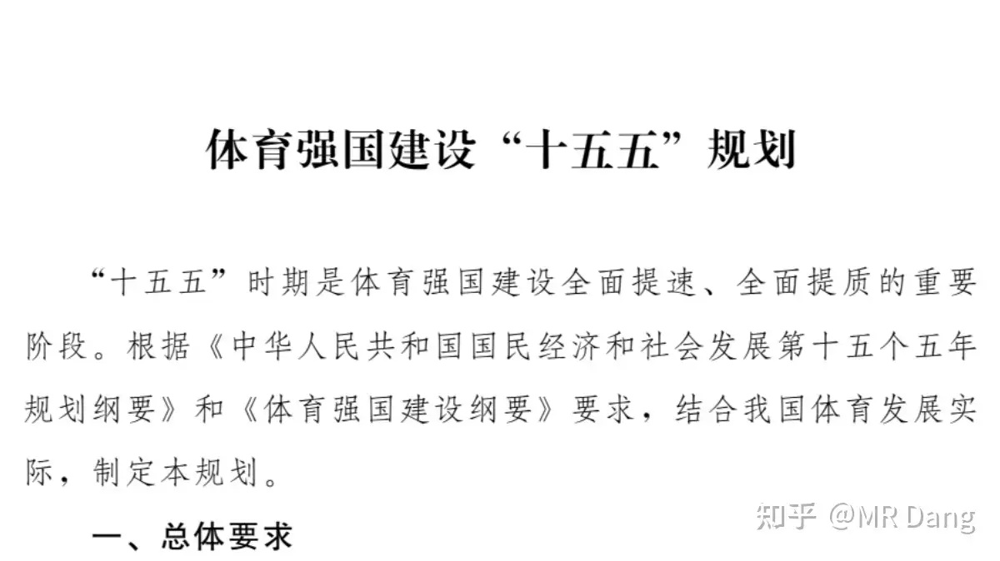

### 我看了下，有具体目标的指标以预期性的为主

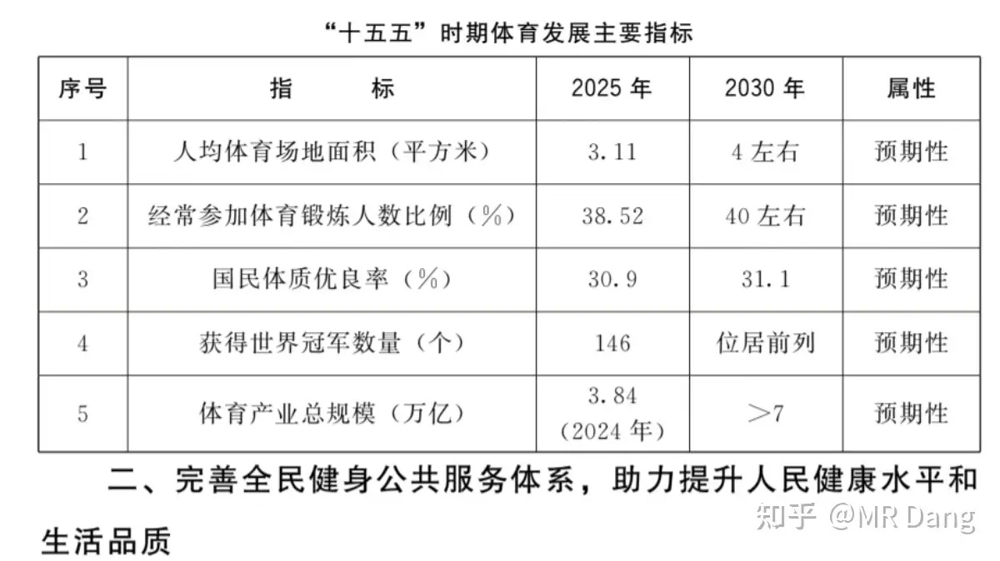

有意思的是世界冠军数量的指标给去掉了，淡化了唯金牌论的指引。

7万亿的产业总规模不算超预期，去年9月份的相关文件里就提过。

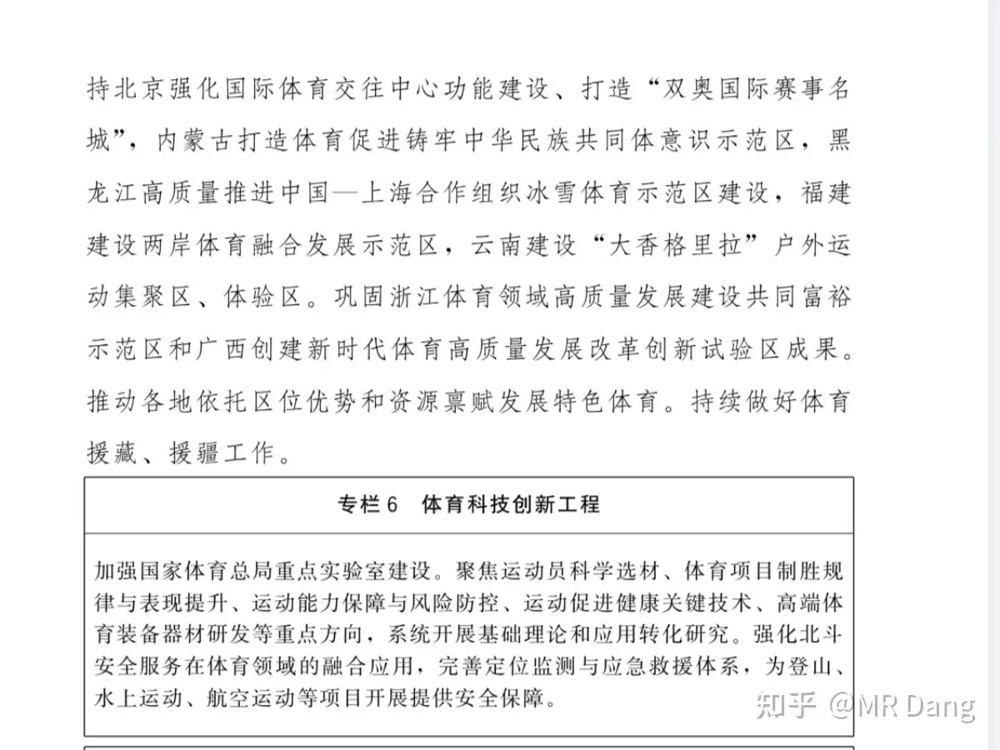

比较超预期的提出了“体育科技”的方向，以后科技行业里又多了一个官方盖章认证的分支。

这个方向目前在投资领域还是空白，也没有一个叫体育科技的概念板块。

我琢磨了下，可能会有这么几个细分方向，比如Ai+体育硬件，智慧场馆，Ai动作捕捉，Ai裁判，Ai健身设备这些。

---

### 日元汇率击穿关键点位

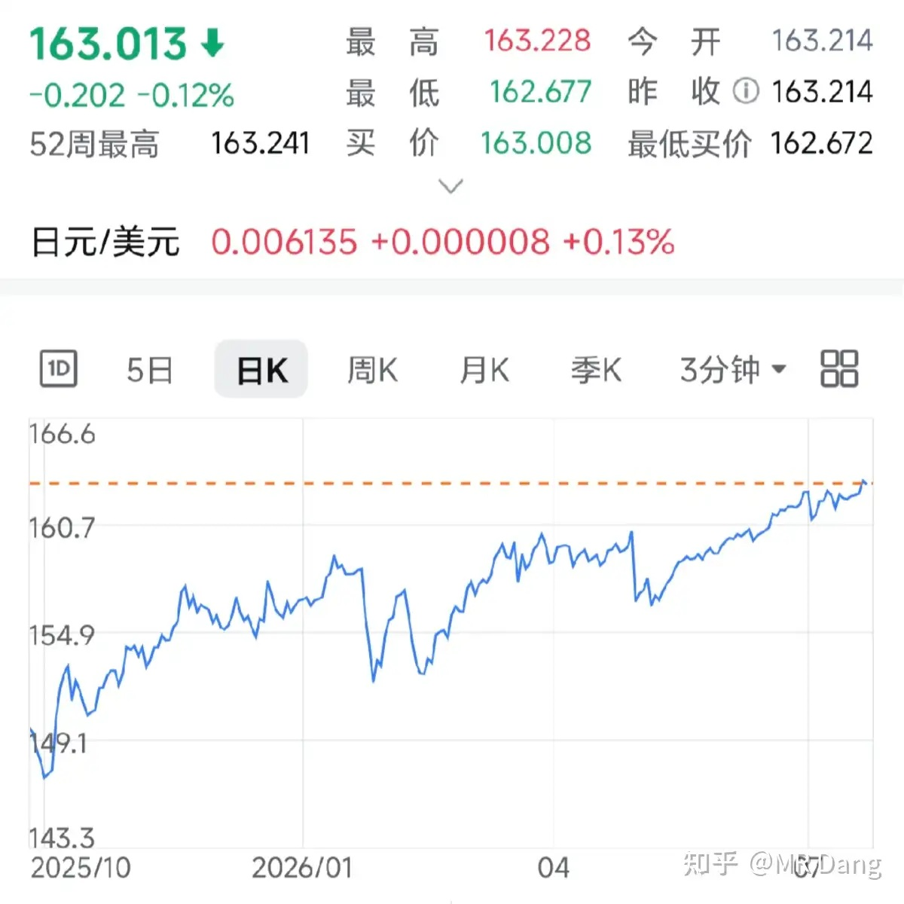

美元兑日元汇率已经突破了163，加息都没缓解日元贬值的进程。

年内贬值超过8%，这可不是股票，而是货币。

最直接的原因就是岛国是资源进口国，原油价格上涨，就要换更多的绿票子，抛售更多的日元，汇率承压。

中层原因是岛国债台高筑，债务率超过了260%，就算加息也是有限度的，再加几次自己就挺不住了。

深层原因是新的世界格局正在形成，各国分工出现变化，岛国工业市场份额正在被蚕食，在新的经济秩序里，日企地位下降，日元需求降低。

---

### 看到一张二季度的ETF统计图

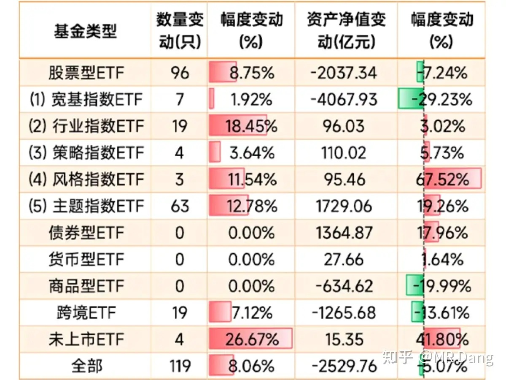

二季度宽基流出4000多亿，这个择时水平怎么说呢，游刃有余，信手拈来。

### 这是总规模方面的，还有一个结构方面的图

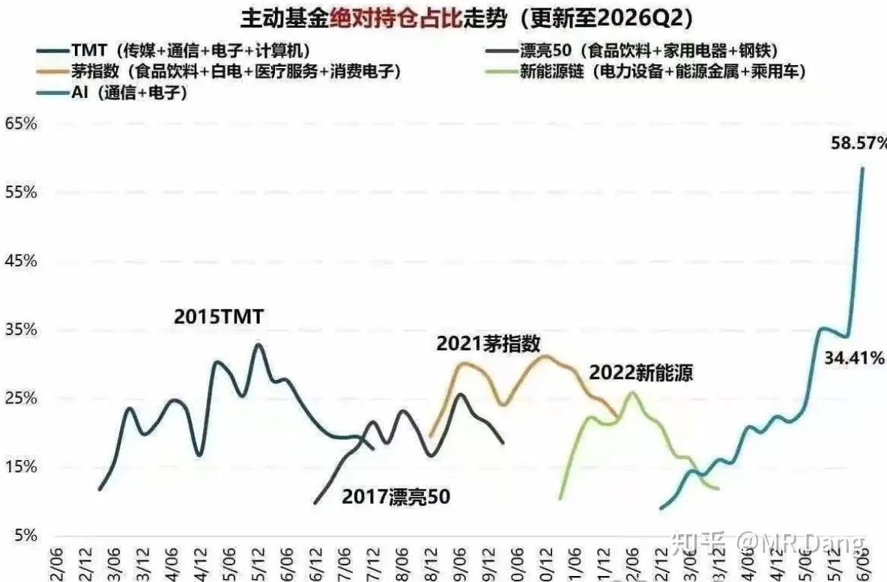

这又让我想起了前一段时间基金风格漂移的事情，很多基民可能都不知道现在自己满手的科技吧。

---

### 光模块被盗疑云

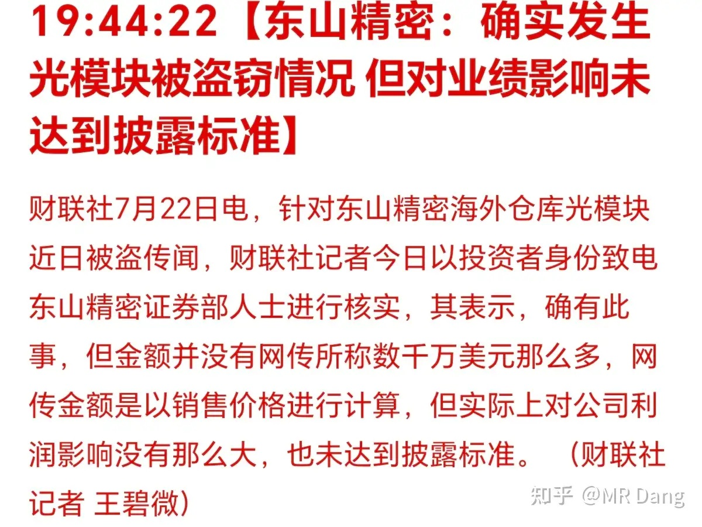

挺抽象的，堪比海底马拉松冠军扇贝，东北躲猫猫高手人参。

---

### 部分企业回购增持计划

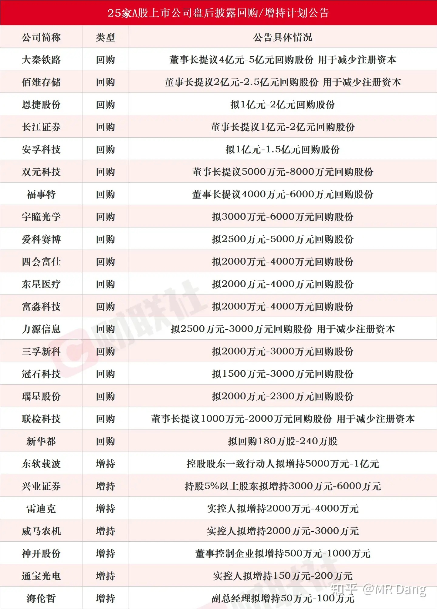

这里面有几家是回购注销的，对资本市场来说是负责的态度，值得肯定。

---

### 部分企业业绩情况

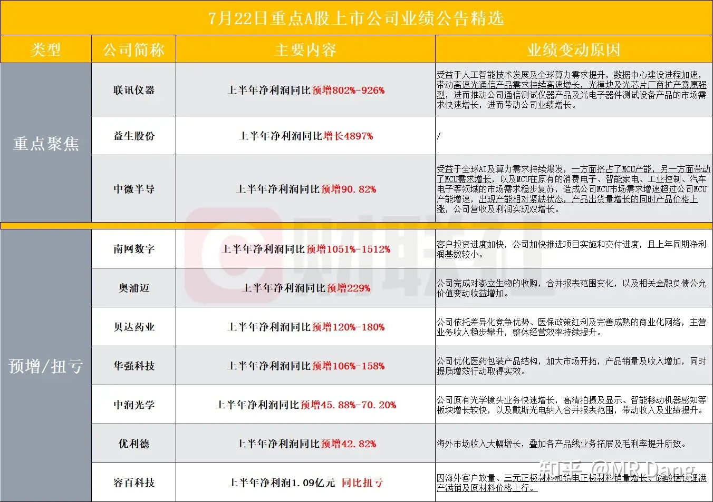

---

### 大宗商品

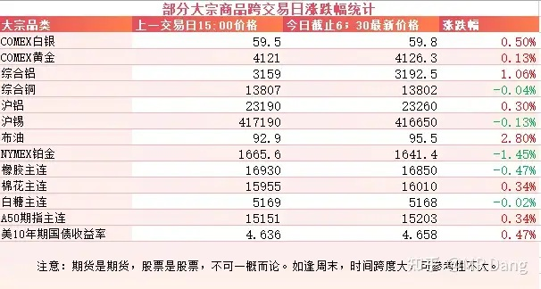

大宗商品方面，原油继续强势，站上95美元，逼近100大关。

有色正常波动。

十年期国债收益率继续走高。

最近以来黄金，债券，原油，价格同频共振，让很多投资者比较疑惑。

其实这种短期的波动，本来也没什么必然联系，一两天的交易找不出什么逻辑的。

### 外围市场

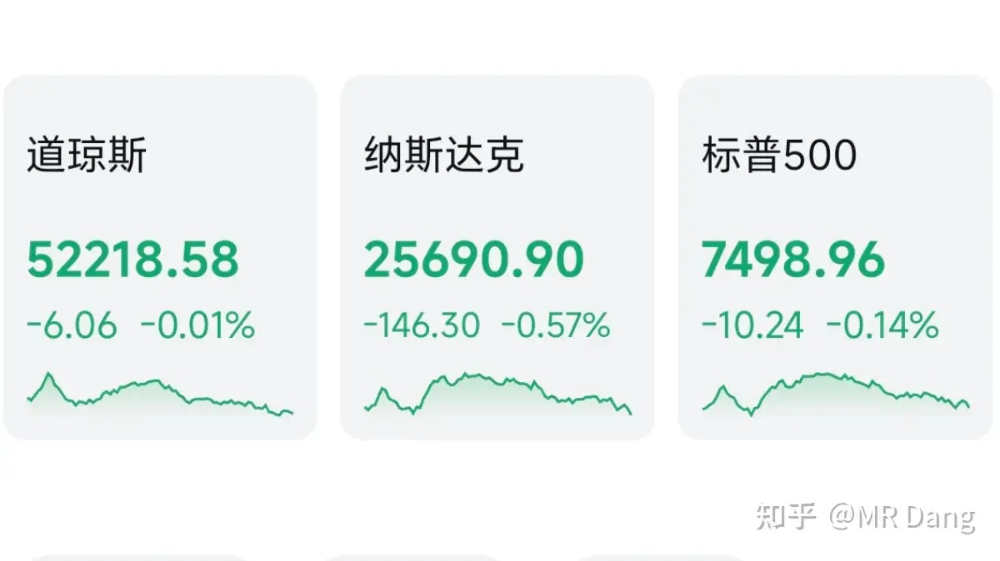

美三大股指集体回调，纳指领跌，老马的space x一路向北，又创了上市以来新低。

谷歌盘后发布了财报，营收和利润都算符合预期，不过市场最关心的是资本支出，二季度449亿美元，机构测算441亿美元，微超预期。隐忧就是自由现金流转负，未来的资本支出可能会保守。

大厂的资本支出对科技行业很关键，如果谷歌这样的公司有资本支出收缩的苗头，投资推动的科技硬件就会遇到增长瓶颈。

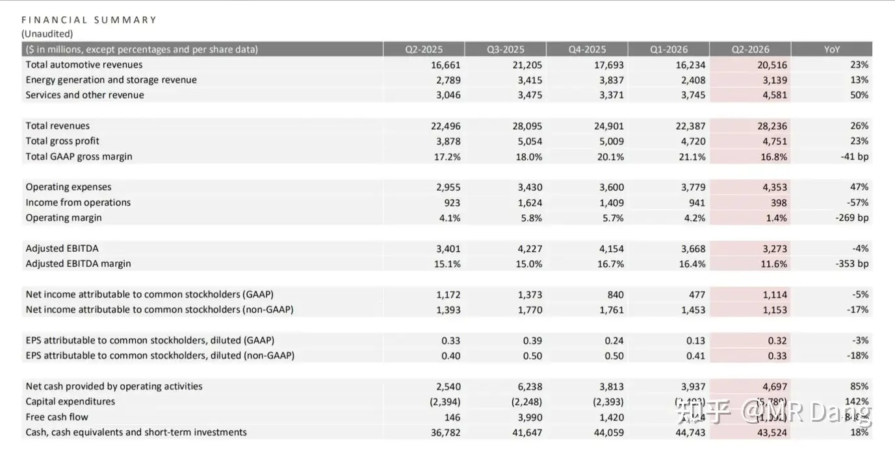

特斯拉也在盘后发布了财报，各项数据都比机构测算的好一些。

不过这两家在发布财报后，盘后交易价格有所回调，可能市场的预期还是有点高。

---

昨天个人组合净值回血一个多点，银行红近一个半，资源红四个半，电网绿两个多，消费微绿。

持股体验很好，红多绿少，又回了一小口。

市场上1500多只股票红的，另外3800余只是绿色的，中位数大概是回调1.3%左右。

今天又来到了熟悉的周四环节，盘前看不出什么特别危险的信号，但习惯性本能还是先计提一个点的公允价值变动损失吧。

预期低了，容易超预期。

---

### 一个喜欢保护韭菜的博主，希望大家少少踩坑，多多赚钱！！！

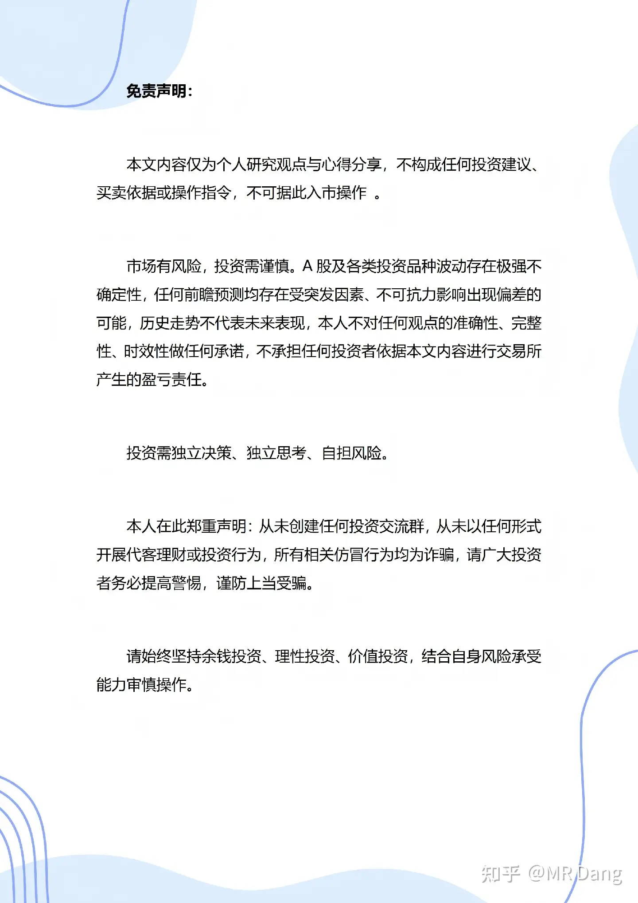

> [!comment]- 点击展开评论
>
> | 用户 | 时间 | 内容 |
> | :--- | :--- | :--- |
> | yang |  | 易方达蓝筹刚加仓的东山精密吧，这就暴雷了？精准接盘啊。 |
> | &nbsp;&nbsp;&nbsp;&nbsp;MR Dang |  | [捂脸]今年业绩很惊人 |
> | 的的 |  | 华夏银行要分红了，我看现在华夏银行挺贵的，分完红可以直接复投吗 |
> | &nbsp;&nbsp;&nbsp;&nbsp;momo |  | [笑哭]肯定等价格下来再投啊 |
> | 时间老人 |  | 13块的桥简直是捡钱 |
> | &nbsp;&nbsp;&nbsp;&nbsp;浪里小白马 |  | 当时补少了，不过也已经在盈利了，看看能不能到30 |
> | &nbsp;&nbsp;&nbsp;&nbsp;资本主义必将消亡 |  | 13块钱只出现了一天 |
> | &nbsp;&nbsp;&nbsp;&nbsp;Rola |  | 当初20的时候割了 |
> | 安静 |  | 还差一个多点回本，好累啊 |
> | &nbsp;&nbsp;&nbsp;&nbsp;MR Dang |  | [感谢] |
> | 头上有犄角 |  | [惊喜]南山我还差38个点回本 |
> | 风月 |  | 今天想给某铝做个T，结果被踢到天花板上了，也不知道能不能跌下来 |
> | 凯尔莫罕的学徒 |  | 有没有要道歉的？ |
> | 三哥数签签 |  | 某铝又涨停了 |
> | Mocu1shle |  | 孩子们，你们错怪铝叔叔了 |
> | 伊莎贝拉 |  | 哈哈，看到东山精密光模块被盗的新闻，我也想到了当年扇贝来回跑的新闻[笑哭][笑哭][笑哭] |

---

*本文件从 MR Dang 知乎页面转载*

**作者**: MR Dang  
**链接**: https://www.zhihu.com/question/2063223864709190099/answer/2063526680069776603  
**来源**: 知乎

*著作权归作者所有。商业转载请联系作者获得授权，非商业转载请注明出处。*

---

## 相关阅读

- [[20260722-对2026 年 7 月 22 日 A股市场行情，大家有什么好的看法和建议？|上一篇：对2026 年 7 月 22 日 A股市场行情，大家有什么好的看法和建议？]]
- [[20260724-如何看待2026年7月24日的A股市场行情？|下一篇：如何看待2026年7月24日的A股市场行情？]]
