# 如何看待2026年7月24日的A股市场行情？

---

**发布时间**: 2026-07-24 07:28  |  **原文链接**: https://www.zhihu.com/question/2063539783805280964/answer/2063888172224869913  |  **点赞数**: 181 人赞同

**作者信息**: MR Dang | 证券从业资格证持证人

---

## 正文内容

### 头条给到可再生能源十五五

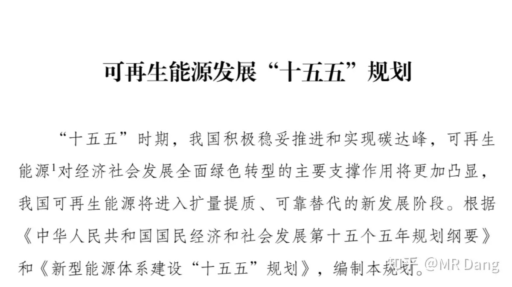

### 部分目标数据如下

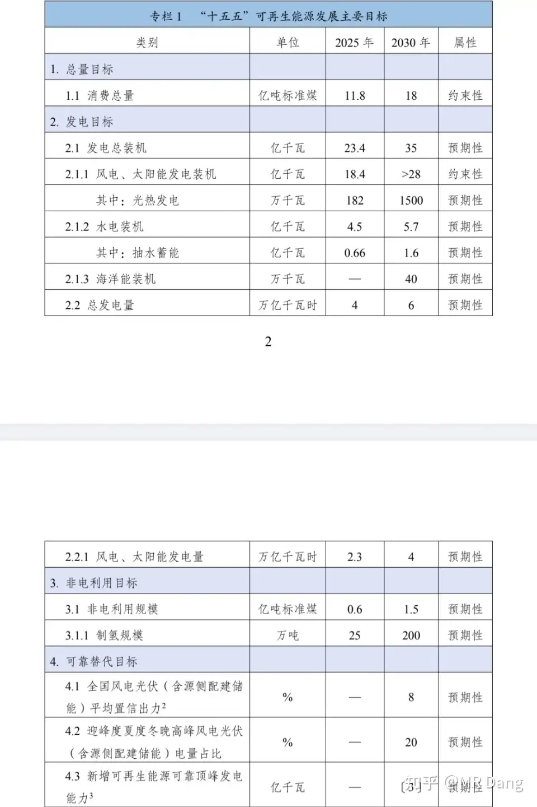

风光总装机28亿千瓦的约束性目标很超预期。

制氢规模，从25万吨直接提升到200万吨，5年翻8倍，也很有魄力。

说到氢，不得不提绿氢，就想到了某位故人。

### 还有就是海上风电

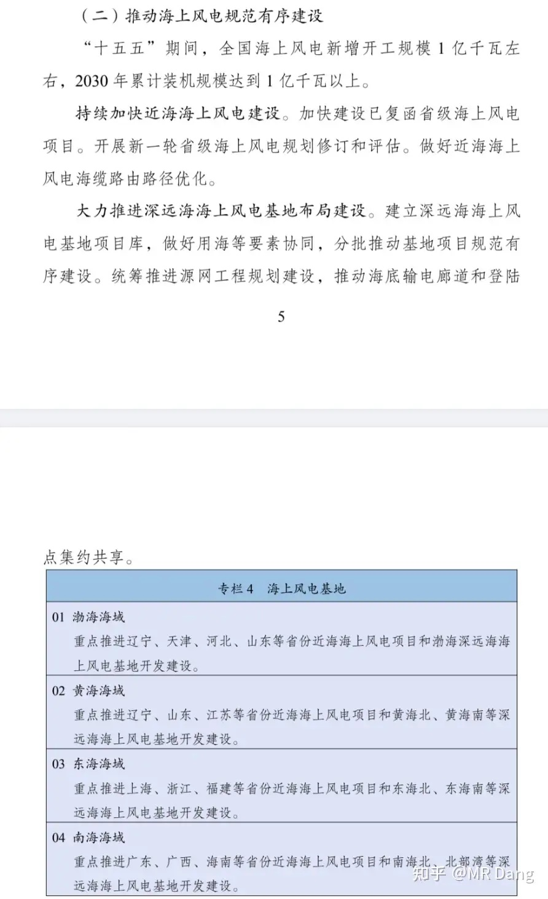

---

### 央行投放流动性

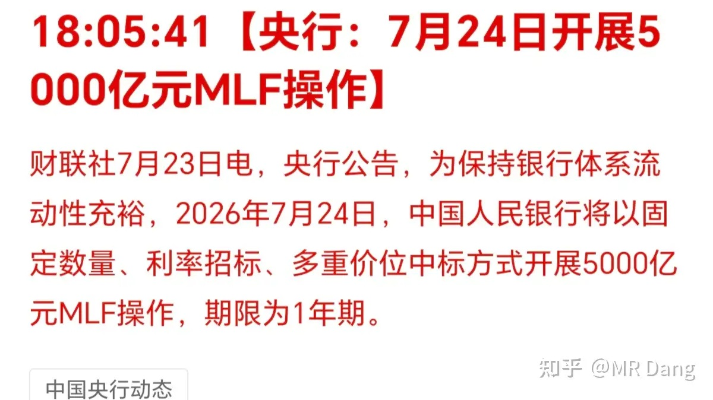

央行投放5000亿麻辣粉，到期4000亿，净投放1000亿。

除了今天投放的，这一个月一直在净投放，流动性方面是没问题的，所以我一直在说要对资本市场多一点信心，多一点耐心，会好起来的。

---

### 中美降税

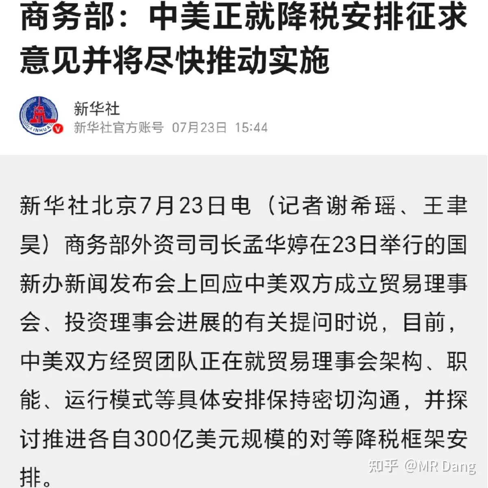

权威媒体报道中美300亿美元对等降税相关事宜。

有市场人士分析认为300亿美元主要是轻工行业，比如家具家电等。

也有分析人士认为里面可能包含储能和变压器之类的产品。

同时进口方面可能是农产品降税，利好需要进口农产品的加工企业。

具体是涉及到哪些行业，还是以官方最终公告为准。

---

### 西大加税

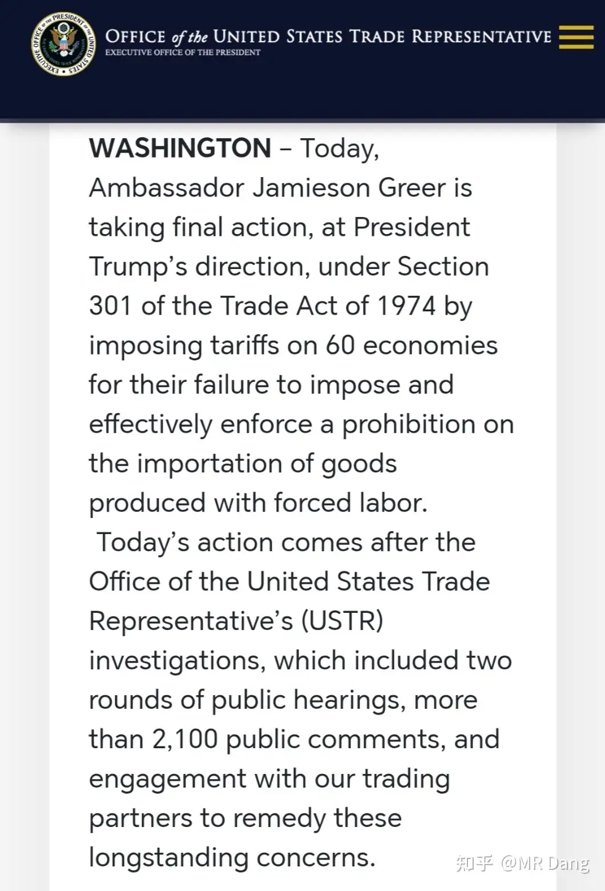

这个加税是代替之前的10%全球临时关税，从犄角旮旯里翻出来一个五十多年前的法条作为借口。

影响的话，分三类，一类是以前10%临时关税，现在按12.5%收，相当于增加了2.5%，偏利空，但是影响不大，这类产品比较多。

还有一类就是以前在10%临时关税豁免清单里，现在没有豁免了，相当于增加了12.5%关税。主要是小商品，纺织品，日用品，机电五金这些，这个利空稍微大一些。

最后一类就是以前要交10%临时关税，这次反而进了豁免清单的，相当于减少了10%关税。品类比较少，主要是贵金属，白银，铂金之类的。

---

### 西大初请失业金人数公布

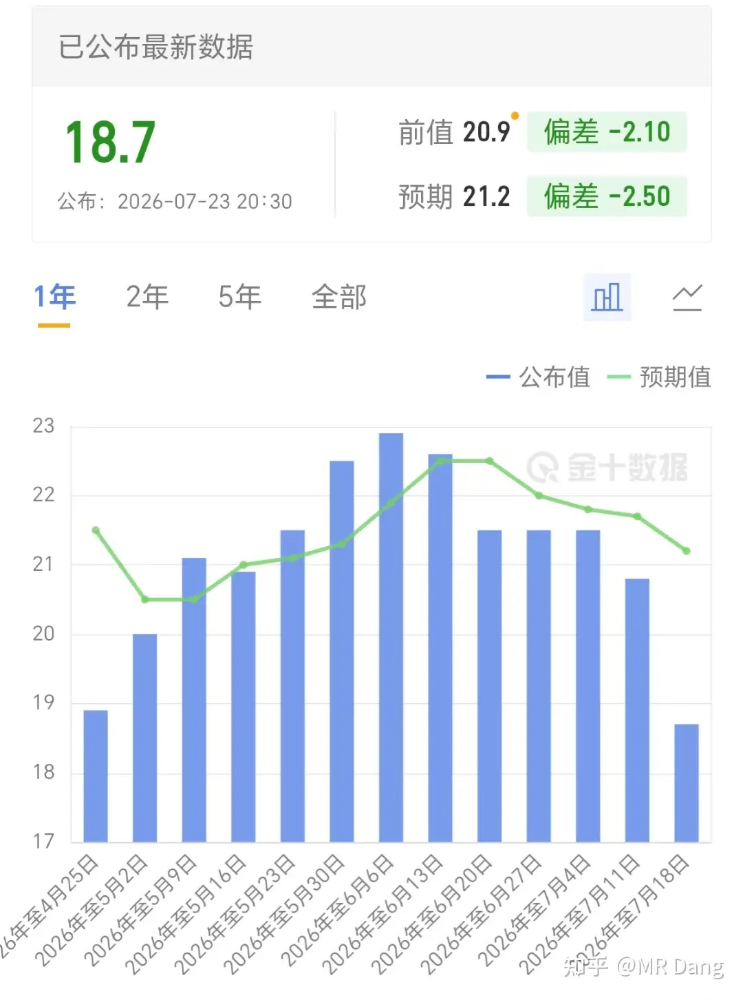

18.7万人，比预期值21.2万人少，也比前值20.9万人少，这个数据少了说明就业市场好，不利于降息。

---

### 脑机接口

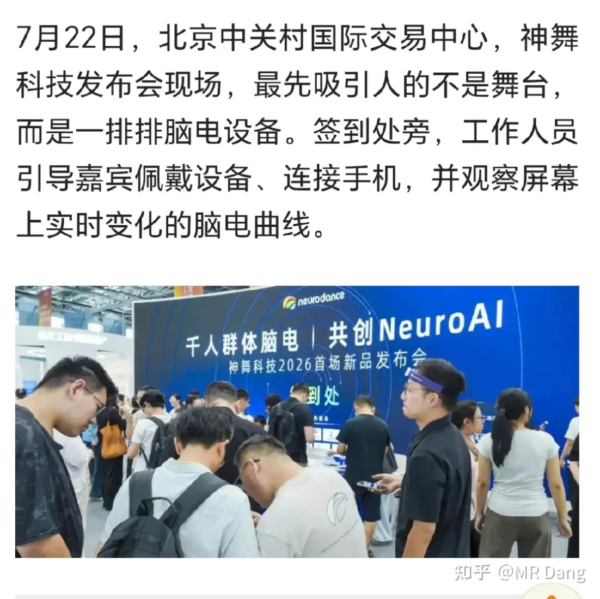

神舞科技还没上市，这是个清华的团队。他们提出了一个NeuroAI的概念，就是用硬件去采集人的脑电波数据，然后喂给Ai。

发布了两款产品ND1000和ND8，前者是大型医疗设备，几十万一台，后者是民用版，定位万元级市场。

这个行业听起来很酷炫，但是盈利模式还在探索中。

---

### 长鑫下周一上市

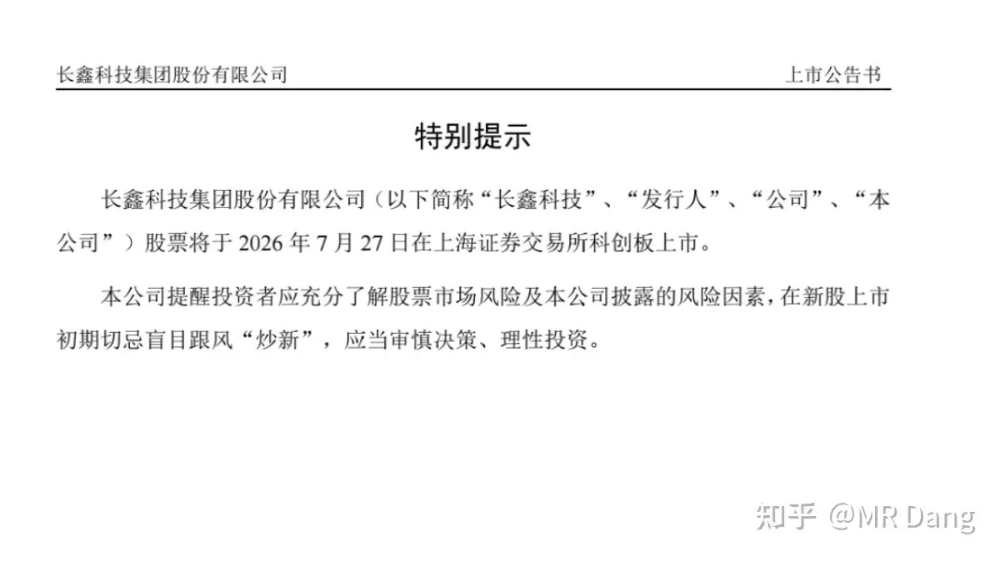

关注度太高，都能想象到前几天的波动有多大了。

---

### 部分企业回购计划

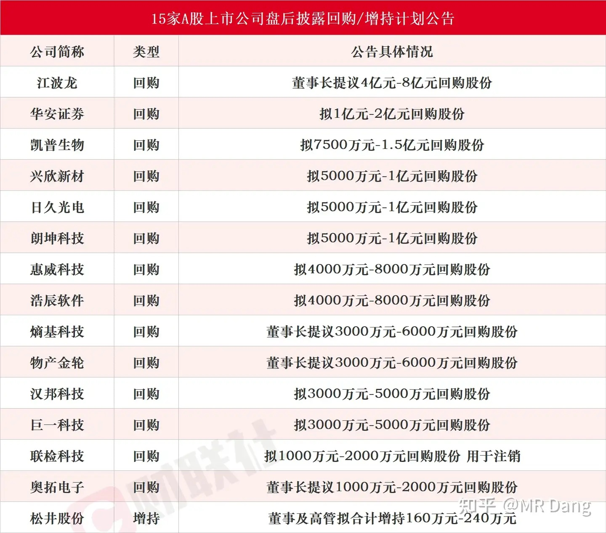

---

两位国人数学家同一天斩获菲尔兹奖，虽然之前已经有实锤的证据，不过看到官宣还是很开心，和投资没啥关系，只是单纯的表达祝贺。

---

### 大宗商品

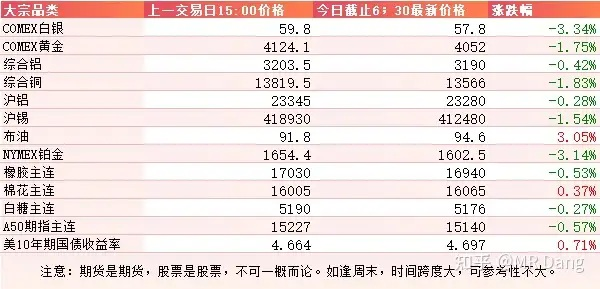

受美伊局势影响，原油继续走高，有色集体回调，贵金属承压。

美债收益率持续上涨，已经到了一个比较让市场担心的位置。

### 外围市场

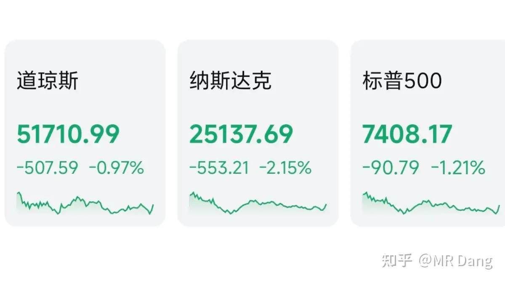

美三大股指集体回调，纳指领跌。

军工股表现比较好，医药板块也还行。

从上涨的板块来分析，这可不是什么好的信号。

英特尔盘后发了财报，大超市场预期。

---

昨天个人组合净值回血一个半多一些，银行红近半个点，电网红五个多，资源红四个半，消费纳米绿。

持股体验很好，各种红，回了好大一口血。

是我错怪星期四了，我向她道歉。

七月以来持续跑赢指数，就连电网也脱离了半导体，走出了独立行情。

有报道称电网特高压招标前三批已经结束，目前金额已经超越去年全年。

我个人觉得这算是先射箭后画靶，因为那些招标公告前几天已经公示了，这反射弧未免也太长了。

跌的时候一声不吭，稍微反弹一点就到处找原因。

真相是我们这个市场波动就是这么大，不需要理由就能大幅波动，投资A股得学会接受这个事实。

如果认识不到这点，非要为每一次的涨跌找到合理化理由，只会让自己疲惫且痛苦，还容易被别人牵着鼻子走。

整个市场4200多家上涨，1200多家下跌，中位数大约是涨了0.8%，所以只要不是特别点背，昨天应该都不差。

至于今天的话，经过多天的修复，很多投资者已经陆陆续续夺回失地了，有的投资者看到持仓涨幅挺大，有些小心思也活络了起来。

怎么说呢，越开心越要警惕，越沮丧越要坚定。

看看自己目前的状态适用哪句话，不要好了伤疤忘了疼，只看了图形就闷头冲锋。

做一点保守的心理建设，小亏当赚吧。

---

### 一个喜欢保护韭菜的博主，希望大家少少踩坑，多多赚钱！！！

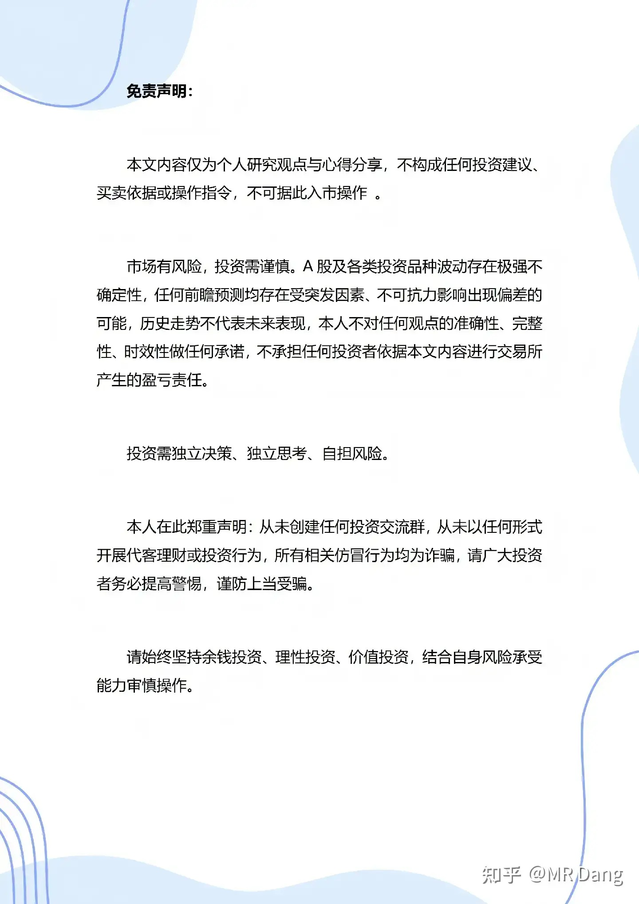

> [!comment]- 点击展开评论
>
> | 用户 | 时间 | 内容 |
> | :--- | :--- | :--- |
> | 猪猪侠2.0 |  | 七月份已跑赢指数20%[哇] |
> | &nbsp;&nbsp;&nbsp;&nbsp;MR Dang |  | [感谢] |
> | &nbsp;&nbsp;&nbsp;&nbsp;魔刀千刃 |  | 这么牛逼吗，买的啥好哥哥 |
> | &nbsp;&nbsp;&nbsp;&nbsp;近水 |  | 要是算上亏的呢 |
> | 简晚秋 |  | 海上风电？大金？ |
> | 法家君子 |  | 默默支持[机智] |
> | &nbsp;&nbsp;&nbsp;&nbsp;MR Dang |  | [感谢] |
> | 回声 |  | 早[感谢] |
> | &nbsp;&nbsp;&nbsp;&nbsp;MR Dang |  | [感谢] |
> | 鲁班的木头 |  | 我发现了，价值投资怎么看？ 正反两个投资机会怎么看？  什么都不用看，看大佬就行了，开始被骂就是还差2-3个月，骂够狠在等一个月，开始逐步夸了，那还差一个月。[大笑][大笑][大笑][大笑][大笑][大笑]。所以价值投资还差至少一个月。 他们是真价值投资的。但是往往也被骂的自闭[大笑][大笑][大笑][大笑]。 投机是产业有迷雾的时候，投资是确定性更强的时候。 |
> | 等风微 |  | jfkj？ |
> | 乐妈 |  | [感谢][感谢][感谢] |
> | &nbsp;&nbsp;&nbsp;&nbsp;MR Dang |  | [感谢] |
> | lion |  | [感谢] |
> | &nbsp;&nbsp;&nbsp;&nbsp;MR Dang |  | [感谢] |
> | 干饭闪电狼 |  | 绿桥有救了[大哭] |
> | OK莹宝 |  | 老师？请回复一下私信啊[大哭] |

---

*本文件从 MR Dang 知乎页面转载*

**作者**: MR Dang  
**链接**: https://www.zhihu.com/question/2063539783805280964/answer/2063888172224869913  
**来源**: 知乎

*著作权归作者所有。商业转载请联系作者获得授权，非商业转载请注明出处。*

---

## 相关阅读

- [[20260723-对于2026年7月23日A股市场行情，大家有什么预测和看法？|上一篇：对于2026年7月23日A股市场行情，大家有什么预测和看法？]]
- [[20260727-如何看待 2026 年 7月 27日 A 股行情？|下一篇：如何看待 2026 年 7月 27日 A 股行情？]]
