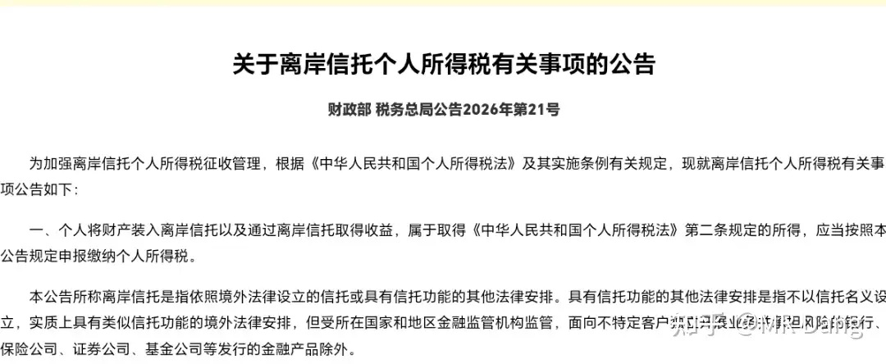
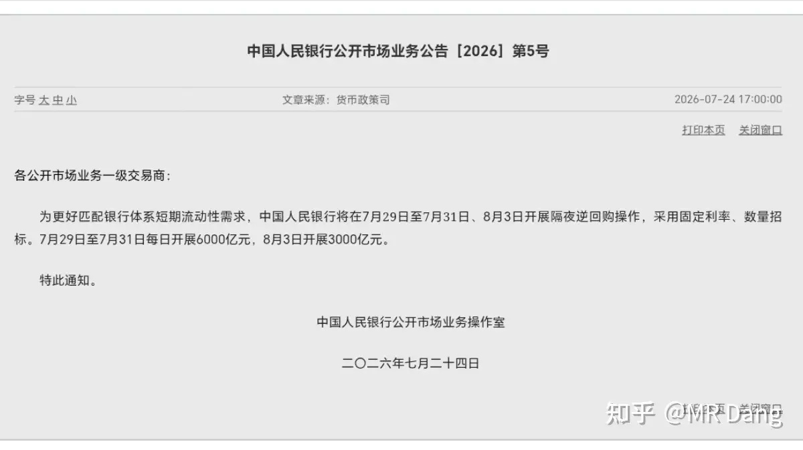
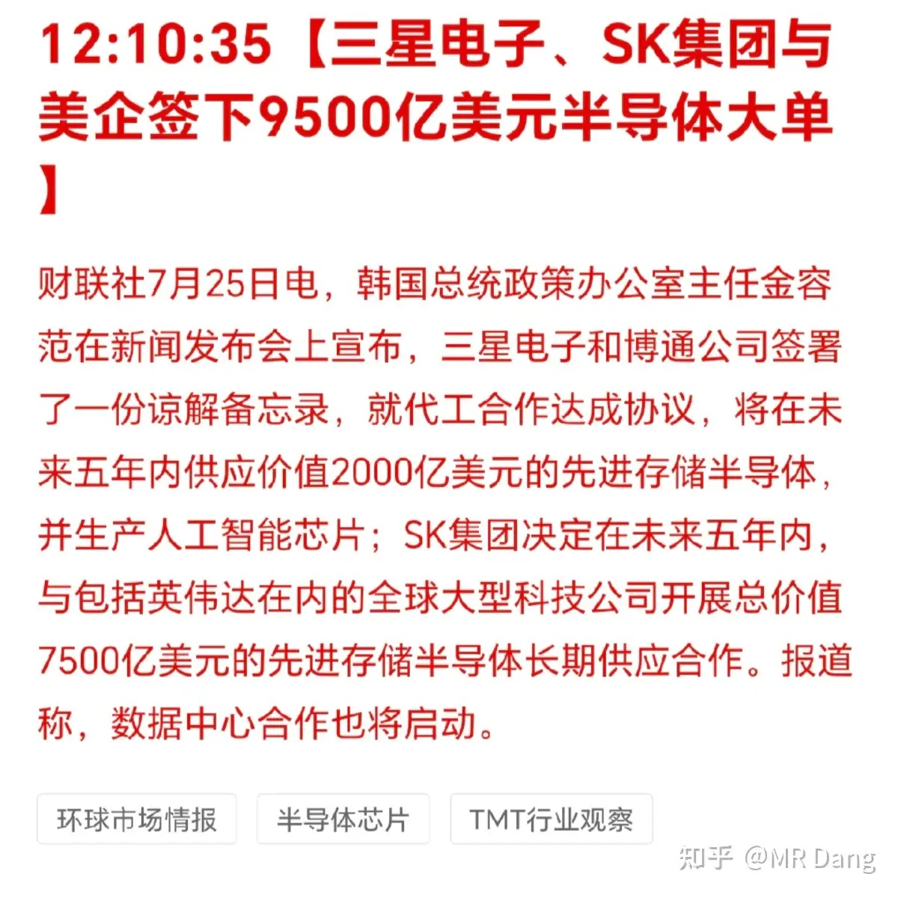
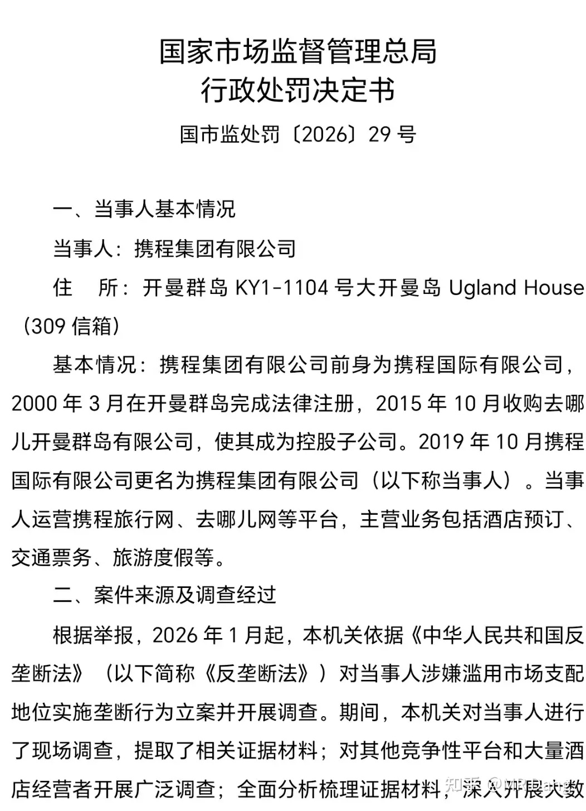
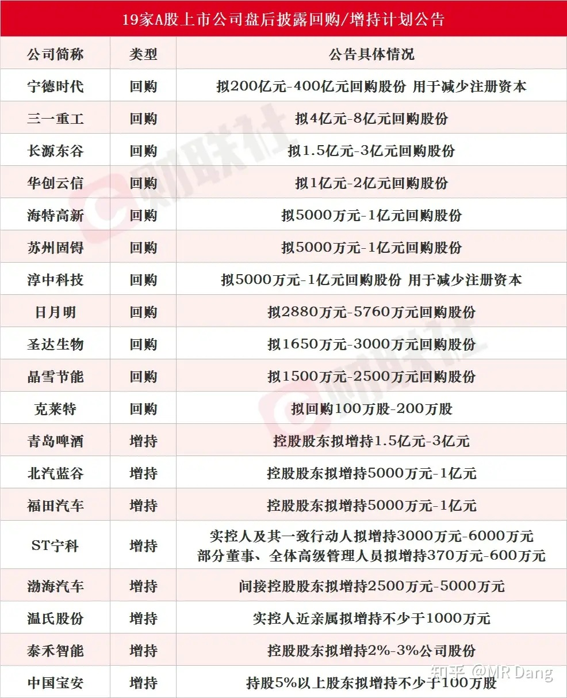
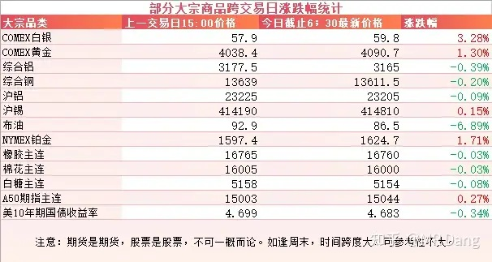
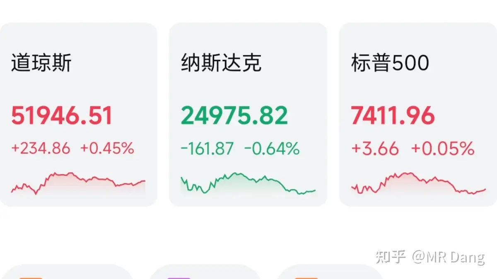
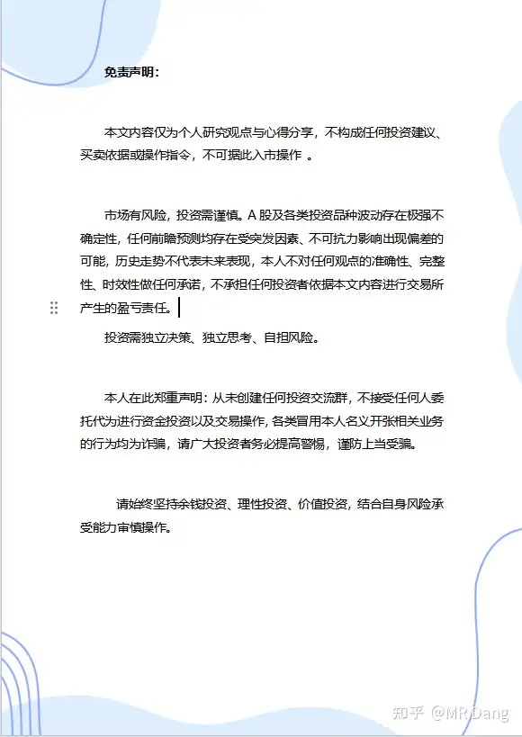

# 如何看待 2026 年 7月 27日 A 股行情？

---

**发布时间**: 2026-07-27 07:40  |  **原文链接**: https://www.zhihu.com/question/2063881612174086881/answer/2064978548432098658  |  **点赞数**: 277 人赞同

**作者信息**: MR Dang | 证券从业资格证持证人

---

## 正文内容

### 把周末发生的大事都捋一捋，首先是离岸信托补税

简单的说，就是离岸信托递延纳税的功能被取消了。

以前，如果资产被装到离岸信托里，是不用纳税的，只有后面资产从信托里出来并且转移所有权的时候才需要纳税。

可以把离岸信托看成一个资产的冰箱，放进去就相当于按下了纳税的暂停键。

现在，想卡这个BUG就卡不成了，漏洞被堵住了。

对普通人影响不大，这玩意儿低配版起步一般都500万绿票子了，和普通人没交集。

而且本来这事就不公平，富人在二次分配中获得了更多的利益，就应该承担更大的社会责任，实际税负就是应该高一点。

放到离岸信托里，使用权和所有权一点没受影响，结果反而不用纳税了，这制度设计就是有问题。

现在消费行业有压力，富人们就应该东大挣钱东大花，让货币循环起来，别天天想着往外跑。

---

### 央行预告隔夜逆回购

这个公告初看平平无奇，实则另有乾坤。

隔夜逆回购就是只放一天的水，影响相对来说不大，不能把这些钱加起来计算投了多少流动性，会闹笑话的。

但是，公告发布时间是7月24日，预告的是7月29到7月31的计划，以及8月3日的安排。

提前这么久就预告隔夜逆回购，这是头一回，开了先河。

这说明我们的预期管理也在越来越科学，特别是在月末这种敏感时间点，利率波动会减少，利率曲线会越来越平滑，好事。

---

### 半导体产业链

有报道称韩美签了9500亿美元的大单，其中三星和博通2000亿美元，海力士和英伟达7500亿美元。

产品上还是以HBM为主，合作期限是五年。性质上分别是LTA和MOU，也就是长期供应协议和谅解备忘录，并非刚性合同。

---

### 脑机接口

国外一家企业的PRIMA视网膜芯片欧洲上市，是全球首款获批商用，可用于修复老年黄斑变性（AMD）中心视力的脑机接口设备。

整套设备包括智能眼镜和植入的芯片等，眼镜拍摄画面，把红外信号传递给芯片，芯片把红外光信号转换成电信号，绕开坏死的感光细胞，直接刺激视网膜上的神经细胞，重新建立视觉。

这是脑机接口商业化的重要里程碑，虽然目前费用高达几十万美元，而且只有单色视觉，但总归是迈出了一大步。

---

### 携程被罚

一共被罚了51.79亿。

携程去年赚了300多亿，这个罚款金额不算少，但也只是一次性的负面影响。

对企业来说，影响更大的是独家房源+全网低价的商业叙事没了，核心壁垒被打破，可能会影响资本市场对它的信心。

---

### 部分企业回购计划

---

### 大宗商品

周末美伊局势又有点变化，懂王暂停了已经持续13天的袭击，还有报道有运油船经过的的时候碰触到了水雷。

原油在周末期间累计回调了接近7个点，有色里的贵金属也有相应的反弹。

美债收益率有轻微回调。

目前看着盘前消息不算太差。

### 外围市场

上周五美三大股指涨跌不一，道指上涨，纳指下跌，AI硬件回调，其他板块表现不错。

---

上个交易日个人组合净值回撤近一个半点，银行红近半个，资源绿近五个，电网绿三个半，消费绿一个半。

整个市场近5000家下跌，500多家上涨，中位数跌了2.8%，所以在体验上是很差的一天，大部分人把上周四的涨幅抹平后还得倒找钱的。

所以也不是什么安慰，如果上周四周五加起来收益能打平，其实已经做的很好了。

这有点像游戏里BOSS战开场前的威压一样，周一上场前先打出一发全屏AOE伤害，让所有玩家知道BOSS要登场了。

---

### 本周前瞻

1，今天大BOSS登场，波动肯定会很大。我个人的话，有股也有现金，做的两手准备。

我不建议普通投资者来凑热闹，次新股的波动非常大，一般人承受不住，心态会崩。

而且次新股阶段，是不能用常识去推测估值的，特别是样本代表性不足的情况下——只有7%不到的实际流通股。

今天还会公布咱们这边上半年工业企业利润统计数据。

2，周三海力士，微软，Meta，高通财报。

3，周四西大初请失业金人数，亚马逊，苹果财报。

对这类科技股，大部分没有仓位的投资者关心的是资本支出，很多科技巨头的预期都在2000亿美元以上。

4，周四美联储议息决议，我个人觉得加息概率不大，更多的可能还是保持原样，沃什搞鹰派发言进行预期管理。

5，周五公布咱们这边的PMI数据。

---

### 一个喜欢保护韭菜的博主，希望大家少少踩坑，多多赚钱！！！

> [!comment]- 点击展开评论
>
> | 用户 | 时间 | 内容 |
> | :--- | :--- | :--- |
> | zhg |  | 市值第一股要来了 |
> | &nbsp;&nbsp;&nbsp;&nbsp;MR Dang |  | [感谢] |
> | 书生 |  | 长鑫还是强[思考] |
> | &nbsp;&nbsp;&nbsp;&nbsp;MR Dang |  | [感谢] |
> | 浪里小白马 |  | [感谢][感谢] |
> | &nbsp;&nbsp;&nbsp;&nbsp;MR Dang |  | [感谢] |
> | 陈陈陈 |  | [感谢] |
> | 知乎用户渊 |  | 早上发的怎么没了 |
> | &nbsp;&nbsp;&nbsp;&nbsp;MR Dang |  | 我这里显示有，应该是被和谐了 |
> | &nbsp;&nbsp;&nbsp;&nbsp;秋白 |  | 怎么加入小红圈看？ |
> | 墨菲 |  | 今天银行给力[感谢] |
> | 秋白 |  | 今天没早报呢？ |
> | &nbsp;&nbsp;&nbsp;&nbsp;华灯初上 |  | 被撤回了 |
> | &nbsp;&nbsp;&nbsp;&nbsp;秋白 |  | 写了啥[感谢] |
> | &nbsp;&nbsp;&nbsp;&nbsp;华灯初上 |  | 说了手搓DUV，有小作文炒作劝大家别参与，就被和谐了 |
> | &nbsp;&nbsp;&nbsp;&nbsp;秋白 |  | 我去，这么搞笑，这都能和谐 |
> | 麻麻 |  | 早[爱][感谢] |
> | &nbsp;&nbsp;&nbsp;&nbsp;MR Dang |  | [感谢] |
> | 回声 |  | 早[感谢] |
> | &nbsp;&nbsp;&nbsp;&nbsp;MR Dang |  | [感谢] |

---

*本文件从 MR Dang 知乎页面转载*

**作者**: MR Dang  
**链接**: https://www.zhihu.com/question/2063881612174086881/answer/2064978548432098658  
**来源**: 知乎

*著作权归作者所有。商业转载请联系作者获得授权，非商业转载请注明出处。*

---

## 相关阅读

- [[20260724-如何看待2026年7月24日的A股市场行情？|上一篇：如何看待2026年7月24日的A股市场行情？]]
- [[20260729-如何看待 2026 年 7 月 29 日A股市场行情？|下一篇：如何看待 2026 年 7 月 29 日A股市场行情？]]
