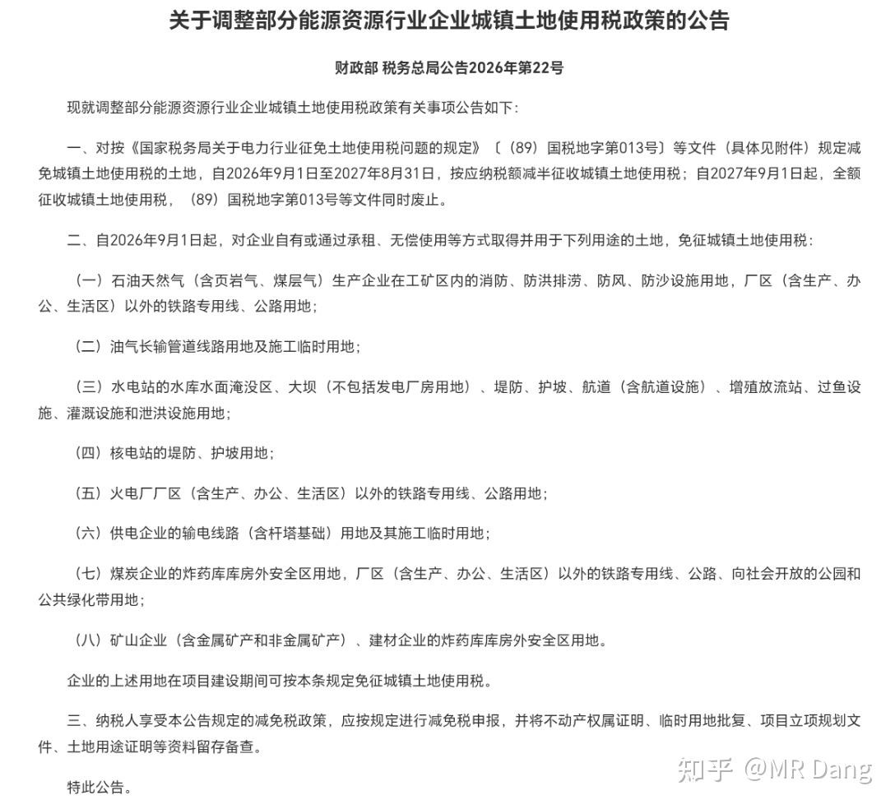
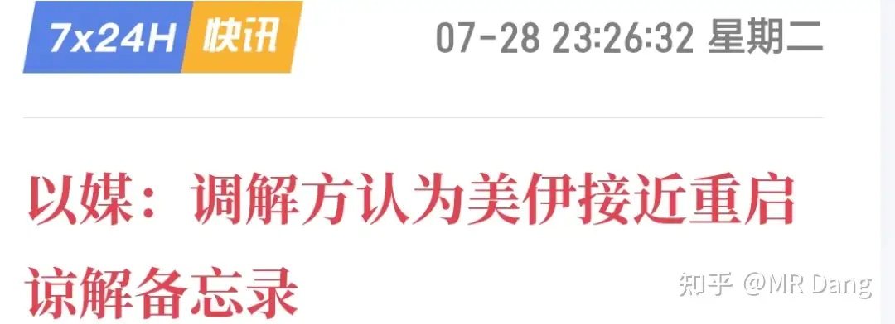
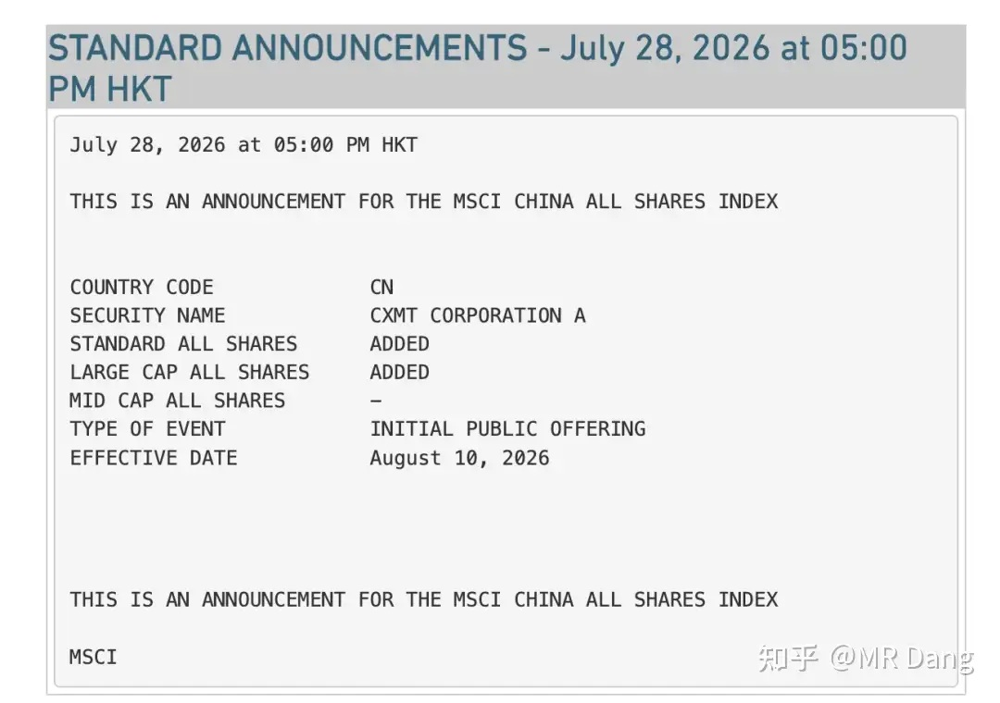
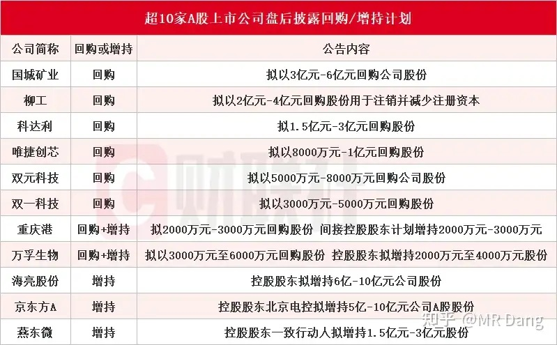
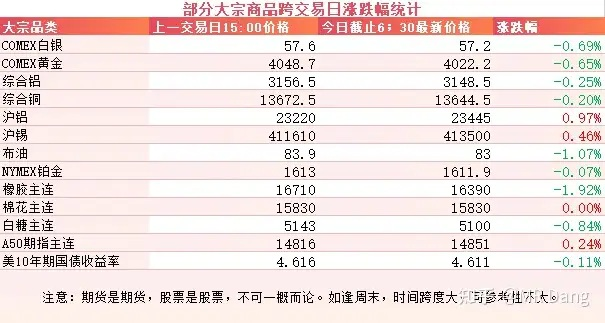
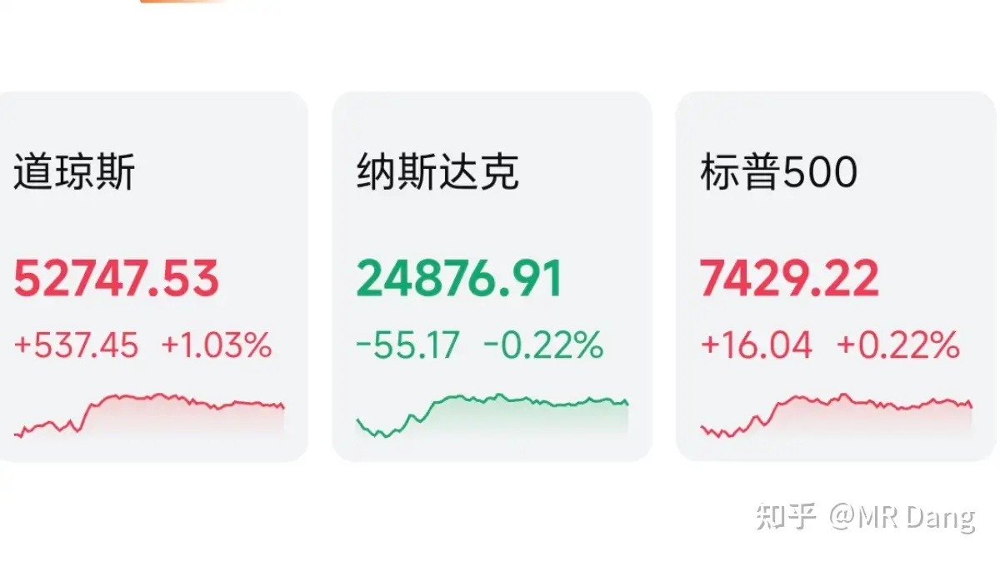
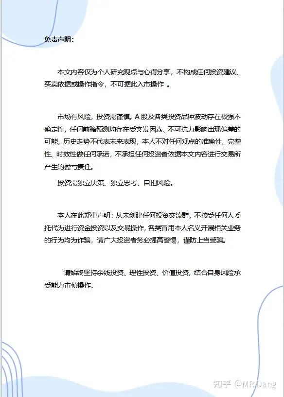

# 如何看待 2026 年 7 月 29 日A股市场行情？

---

**发布时间**: 2026-07-29 07:28  |  **原文链接**: https://www.zhihu.com/question/2065078527142237871/answer/2065700093358088971  |  **点赞数**: 215 人赞同

**作者信息**: MR Dang | 证券从业资格证持证人

---

## 正文内容

### 关注土地使用税调整

有关部门对土地使用税进行了调整。

详情请看官方公告原文。

简单的说，就是以前土地使用税大规模的免税待遇取消了，变成了更精准施策的减免。

受到影响比较大的是煤炭和铅锌矿这类企业，因为土地使用税是按照面积来的，一个300万平应税面积的矿山可能一年新增税负大概是百万级到千万级左右。

煤炭，铅锌矿的毛利比较低，占地面积又大。

而其他有色金属，比如金银也有影响，但是地上部分并不大，毛利又高，受影响有限。

铜的话，要分情况，露天开采的影响大一些，地下开采影响就小一点。

除了品种，还要看区域，西部地区的土地使用税整体偏低，东部地区就正好相反。

另外就是火电，本来利润就不太厚，上游煤炭税负成本提高，自身还有面积几百亩甚至上千亩的灰场，盈利能力可能会承压。

不过土地使用税毕竟只是一个小的税种，不会改变资源类企业的基本面，以情绪影响为主。

---

### 美伊局势

很久没看这两的舞台剧了，不过瞅着原油跳水了，就找了下原因，有媒体报道两方接近重启备忘录。

---

### 新股王被纳入明晟指数

8月10日生效，将被纳入MSCI中国全股票指数。

新股王的市值和流动性摆在这里了，以后会被纳入越来越多的指数，让更多的人享受到科技发展带来的红利。

---

### 部分企业回购/增持

---

### 大宗商品

隔夜商品方面，原油和有色整体回调。

国内的铝和伦铝罕见的出现了逆向而行的走势。

A50看着还好，美长债收益率依然在高位。

### 外围市场

美三大股指涨跌不一，道指领涨，纳指回调。

纳指看着没跌多少，不过半导体硬件可没少跌。

昨晚Ai硬件迎来两个利空消息，一个是亚马逊调整了Ai策略，收缩了部分资源，把Nova模型维持在KTLO状态，类似于“仅仅是活着”这样的情况。

另一个是康宁发布的财报，三季度指引不及市场预期，引发了市场对光纤需求的恐慌。

两个利空叠加，存储和光纤这些板块普遍回调了十个点左右，从一个月前高点算起来，基本已经打了个五折甚至四折。

和纳指相反，道指十分硬气，可口可乐创历史新高，传统行业像医疗医药表现都很不错。

---

昨天个人组合净值回血小半个点，银行红一个点，资源绿半个点，电网绿四个多，消费红近两个点。

很舒服的一个交易日，红多绿少。

有句话叫幸福都是对比出来的，看着创业板七个多点的跌幅，没被暴揍是万幸了，不敢奢求更多。

昨天还在说周一涨的有点超预期了，现在算上昨天回调的，突然就符合预期了。

风格上是典型的老登翻身，科技受难，隔壁棒子更是跌了接近11个点，两倍杠杆做多大力士的产品从高点下来把80%跌没了，不可谓不惨烈。

还算比较庆幸吧，这轮科技狂欢里，虽然没吃上大肉，好歹喝了口汤，最后在大厦崩坍前侥幸全身而退。

该说的都说了，该劝的也劝了，剩下的只能是各安天命了，有些事情，只有经历过才会刻骨铭心——比如不要接下落的飞刀。

科技股回调的时候不要轻易抄底，不要有锚定效应，这种类似的话已经重复了很多遍了。

不过事已至此，也不用太悲观。

目前的市场整体流动性还算可以，每天都是几十家企业在回购增持，挤出泡沫也是为以后更健康的市场环境做准备。

**嗯，昨天的早报没删，发了一个多小时后被系统隐藏了。**

---

### 一个喜欢保护韭菜的博主，希望大家少少踩坑，多多赚钱！！！

> [!comment]- 点击展开评论
>
> | 用户 | 时间 | 内容 |
> | :--- | :--- | :--- |
> | 潭轩 |  | 今天就没好消息，英伟达的cds大幅上涨，股市勉强翻红。海力士美股大跌，中报不及预期。就这两条估计韩国股市今天又该熔断。我们也会收到情绪影响向下。[捂脸][捂脸] |
> | &nbsp;&nbsp;&nbsp;&nbsp;MR Dang |  | [感谢] |
> | &nbsp;&nbsp;&nbsp;&nbsp;玉书 |  | 看了下盘后，上蹿下跳的，相当得劲 |
> | &nbsp;&nbsp;&nbsp;&nbsp;多多干饭 |  | 海力士利空落地了，博弈三季度了 |
> | 卡萨丁 |  | [感谢] |
> | &nbsp;&nbsp;&nbsp;&nbsp;MR Dang |  | [感谢] |
> | MoonDream |  | [感谢] |
> | &nbsp;&nbsp;&nbsp;&nbsp;MR Dang |  | [感谢] |
> | 二细刘肉面 |  | 昨天尾盘重仓两支影院票，静待花开[感谢][感谢][感谢] |
> | &nbsp;&nbsp;&nbsp;&nbsp;张不胖 |  | 你是咋知道的 |
> | &nbsp;&nbsp;&nbsp;&nbsp;二细刘肉面 |  | 不知道啊，没人说，我看他在底部了就买了点[感谢]，这不快国庆了么 |
> | &nbsp;&nbsp;&nbsp;&nbsp;张不胖 |  | 择时仙人[爱] |
> | &nbsp;&nbsp;&nbsp;&nbsp;昨天的月亮不睡 |  | 理由合理 |
> | 我爱吃草莓 |  | 在科技亏惨了 以后认真研读党老师作品 |
> | 帅小伙 |  | 老师早[感谢] |
> | &nbsp;&nbsp;&nbsp;&nbsp;MR Dang |  | [感谢] |
> | 乐妈 |  | [感谢][感谢][感谢] |
> | &nbsp;&nbsp;&nbsp;&nbsp;MR Dang |  | [感谢] |
> | Jonas |  | mark 一下[感谢] |
> | &nbsp;&nbsp;&nbsp;&nbsp;MR Dang |  | [感谢] |
> | 18一枝花 |  | [感谢] |
> | &nbsp;&nbsp;&nbsp;&nbsp;MR Dang |  | [感谢] |
> | 法家君子 |  | 默默支持[机智] |
> | &nbsp;&nbsp;&nbsp;&nbsp;MR Dang |  | [感谢][感谢] |

---

*本文件从 MR Dang 知乎页面转载*

**作者**: MR Dang  
**链接**: https://www.zhihu.com/question/2065078527142237871/answer/2065700093358088971  
**来源**: 知乎

*著作权归作者所有。商业转载请联系作者获得授权，非商业转载请注明出处。*

---

## 相关阅读

- [[20260727-如何看待 2026 年 7月 27日 A 股行情？|上一篇：如何看待 2026 年 7月 27日 A 股行情？]]
- [[20260730-如何看待 2026 年 7月 30日 A 股行情？|下一篇：如何看待 2026 年 7月 30日 A 股行情？]]
