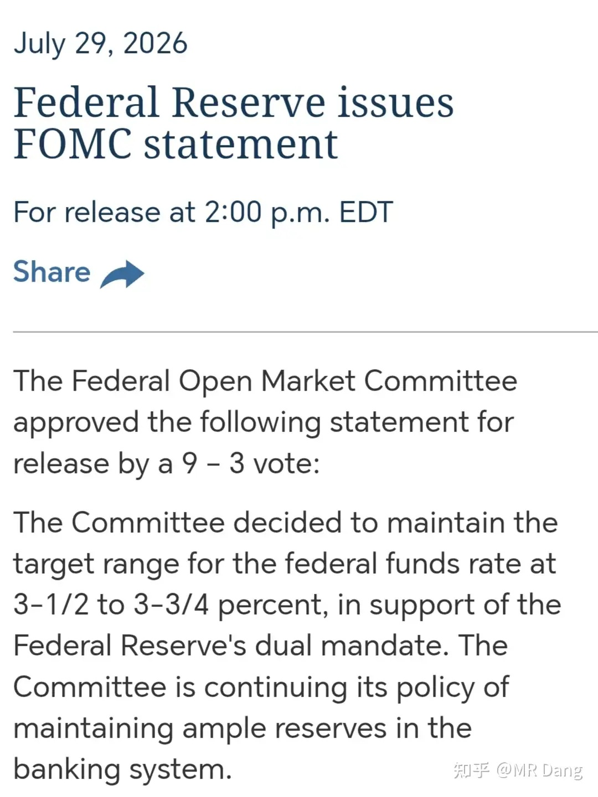
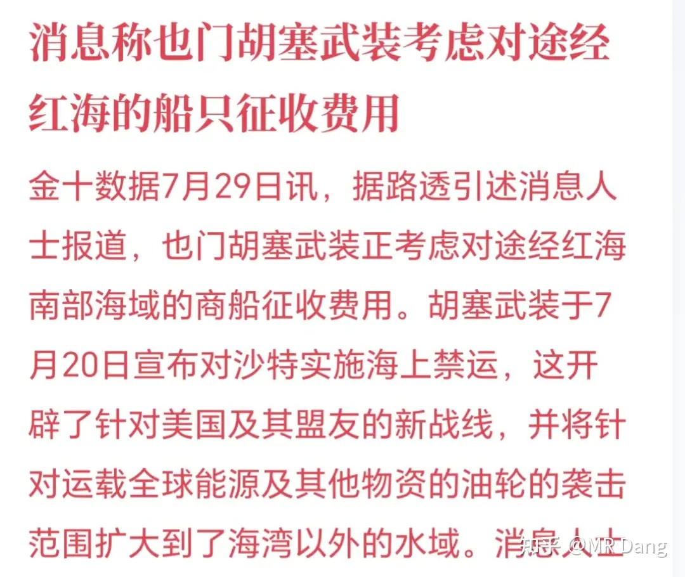
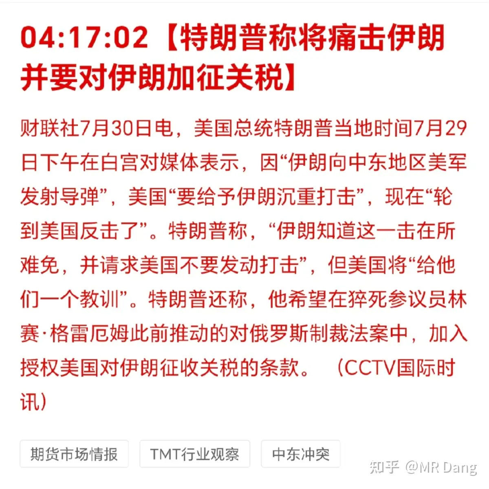
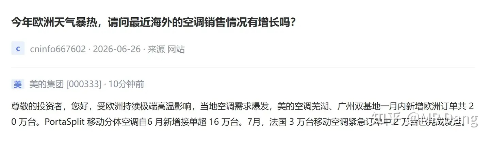
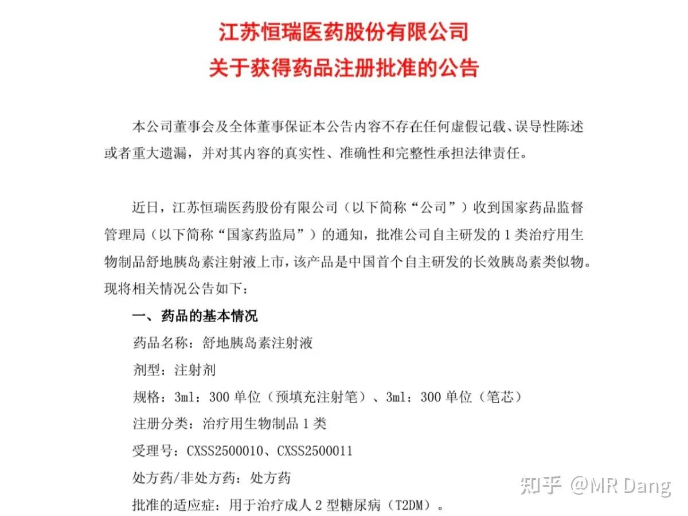
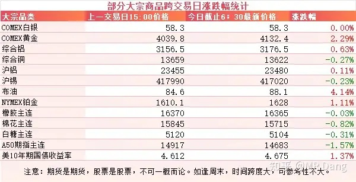
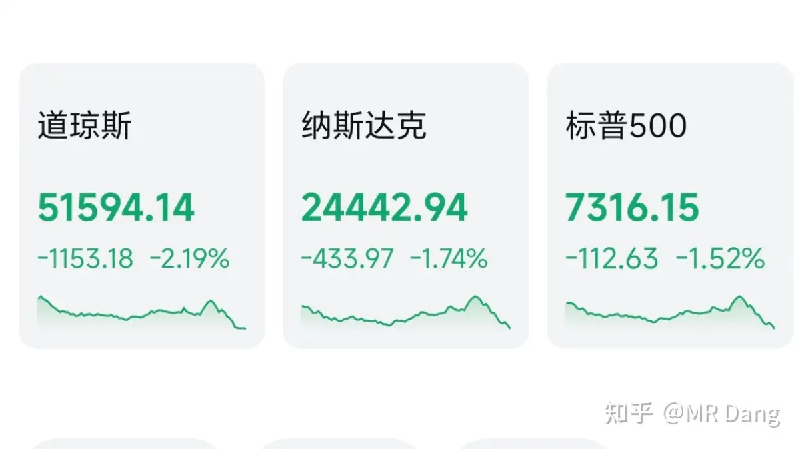

# 如何看待 2026 年 7月 30日 A 股行情？

---

**发布时间**: 2026-07-30 07:21  |  **原文链接**: https://www.zhihu.com/question/2065683377928266544/answer/2066060815988416968  |  **点赞数**: 182 人赞同

**作者信息**: MR Dang | 证券从业资格证持证人

---

## 正文内容

### 今天的头条只能是美联储议息了

基本上没什么大的幺蛾子，维持原利率水平不变符合市场预期，也符合我个人预期。

比较微妙的是上次12票全票通过，这次是9比3，多了三张反对票——他们更倾向于加息。

在后面的放狠话环节，沃什不出所料的释放了鹰派的发言。

沃什强调了通胀目标2%不动摇，并且重申了PCE这个指标的重要性。

沃什还说了句，通胀问题不可能在9周内解决。

为什么刚好是9周呢？这是从现在算起距离9月议息决议的时间跨度。

弦外之音就是基本排除了9月降息的选项，只剩下维持原有利率水平不变和加息两个选项。

---

### 美伊局势

胡赛小老弟居然也想收费了，不知道马六甲怎么想，直布罗陀怎么想。

懂王称要痛击伊朗。

---

### 某空调巨头在互动平台回复

一个月新增20万台欧洲订单，比之前测算的还乐观点，看来欧洲比东京热。

---

### 创新药

某创新药企发布公告，舒地胰岛素获得药品注册批准。

看到这名字，就想起了它的两个竞争对手，甘精胰岛素和德谷胰岛素。

前者主打性价比，后者主打疗效。

舒地胰岛素的定位可能要夹在这两者之间，怎么定价就成了关键。

---

### 大宗商品

受美伊局势影响，原油隔夜涨幅四个多点。

受美联储议息决议影响，有色整体表现尚可，黄金换了合约，同合约是上涨的，幅度没那么大。

美债收益率继续走高，已经来到了一个比较高的位置。

A50期指看着有点承压，今天拉低点心理预期吧。

### 外围市场

美三大股指集体调整，道指领跌。

美联储议息不变的消息传出来后有短暂好转，沃什表达鹰派立场后又急转直下。

行业板块上除了油气和应用软件几乎全军覆没，存储和半导体硬件还在跌。

盘后Meta和微软发布了财报，一家欢喜一家愁，Meta不及预期，微软小超预期。

资本支出方面二者都没有超预期的数据，可能会让市场再次对Ai泡沫引发警惕。

---

昨天个人组合净值回血一个半点，银行微红，资源红三个半，消费红三个，电网红一个半。

依然是体验拉满的一个交易日，无论指数涨跌，表现都很坚挺。

整个市场大概有4200多只股票上涨，仅1200多只股票下跌，中位数涨了大概也是一个半点。

至于今天的话，其实这些天回血已经回的不太真实了，在这样的基础上，只要不被暴揍，都是足以令人满意的。

何况今天还是星期四。

当然也不完全是坏事，我是说如果哈，如果正好今天手里见到回头钱了，那说不定还给了个机会也不好说。

---

### 一个喜欢保护韭菜的博主，希望大家少少踩坑，多多赚钱！！！

> [!comment]- 点击展开评论
>
> | 用户 | 时间 | 内容 |
> | :--- | :--- | :--- |
> | Dang门小弟子 |  | 宏桥已经重新盈利，至暗时刻没有放弃[感谢] |
> | &nbsp;&nbsp;&nbsp;&nbsp;zscYHF |  | 哈哈，之前很多人骂，然后冲进去科技，现在那些人还好吗 |
> | 的的 |  | 感谢dang大，每天坚持不懈传播知识，自己也开始慢慢学习金融知识，人生第一笔银行分红入账[感谢] |
> | &nbsp;&nbsp;&nbsp;&nbsp;DeepSky |  | 分红不是收益 |
> | &nbsp;&nbsp;&nbsp;&nbsp;防风邶 |  | 华夏今天分红完了，立马填权回来[惊喜] |
> | &nbsp;&nbsp;&nbsp;&nbsp;DeepSky |  | 哪支股票 |
> | 簌簌 |  | 按照打一巴掌给个甜枣的规律，今天有一丝危…早安[感谢] |
> | &nbsp;&nbsp;&nbsp;&nbsp;MR Dang |  | [感谢] |
> | 羽毛 |  | 我看了一下今年盈利8%，超过89.9%股民。前两个月这评论区真是没法看，冷嘲热讽的，我以为大家买科技赚了多少呢，结果就这[惊喜] |
> | &nbsp;&nbsp;&nbsp;&nbsp;羽毛 |  | 盈亏分析里 |
> | &nbsp;&nbsp;&nbsp;&nbsp;DeepSky |  | 这个数据在哪里看 |
> | 少年和狗 |  | [感谢] |
> | &nbsp;&nbsp;&nbsp;&nbsp;MR Dang |  | [感谢] |
> | 回声 |  | 早[感谢] |
> | &nbsp;&nbsp;&nbsp;&nbsp;MR Dang |  | [感谢] |
> | 一根葱 |  | 感谢 |
> | 陈信宏啊啊啊 |  | 早，虽然晚上了[感谢] |
> | momo |  | [酷]恭喜 烂银行差不多3个点。 |
> | 干饭闪电狼 |  | 烂银行好牛[惊喜] |

---

*本文件从 MR Dang 知乎页面转载*

**作者**: MR Dang  
**链接**: https://www.zhihu.com/question/2065683377928266544/answer/2066060815988416968  
**来源**: 知乎

*著作权归作者所有。商业转载请联系作者获得授权，非商业转载请注明出处。*

---

## 相关阅读

- [[20260729-如何看待 2026 年 7 月 29 日A股市场行情？|上一篇：如何看待 2026 年 7 月 29 日A股市场行情？]]
- [[20260731-如何看待2026年7月31日的A股市场行情？|下一篇：如何看待2026年7月31日的A股市场行情？]]
