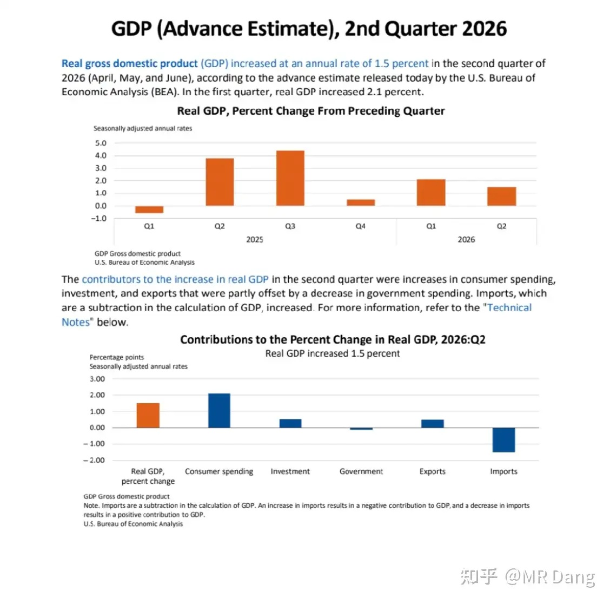
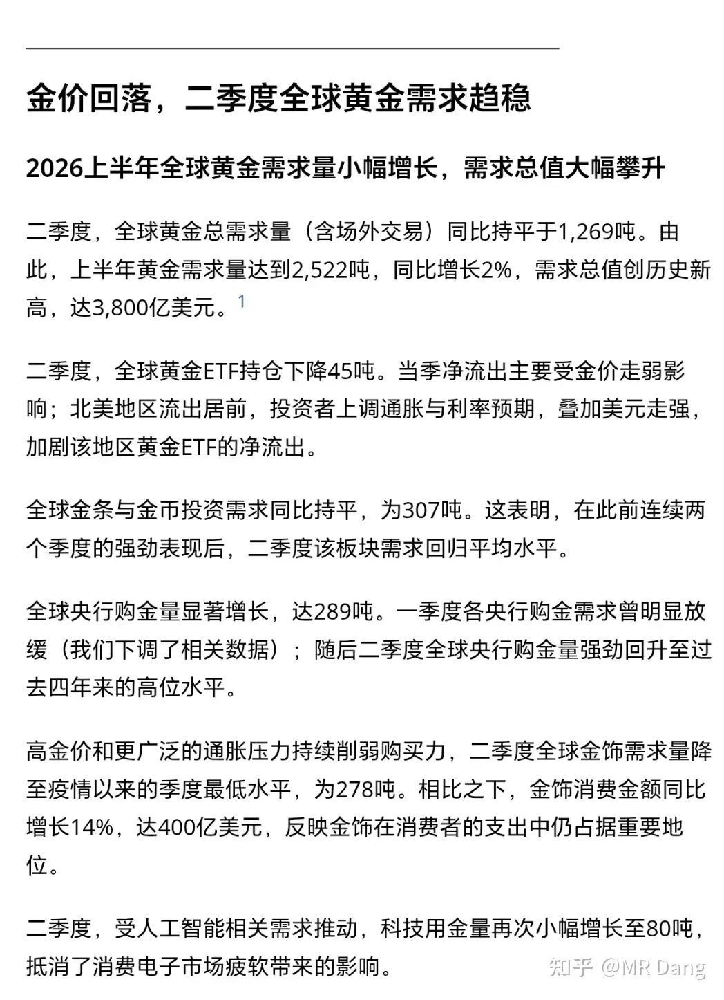
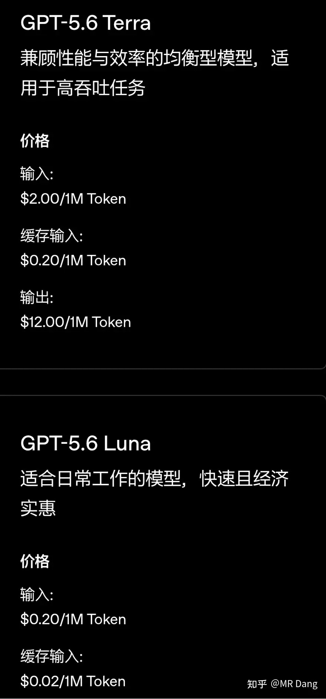
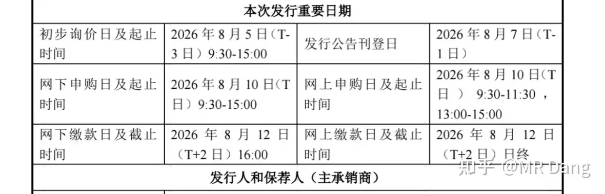
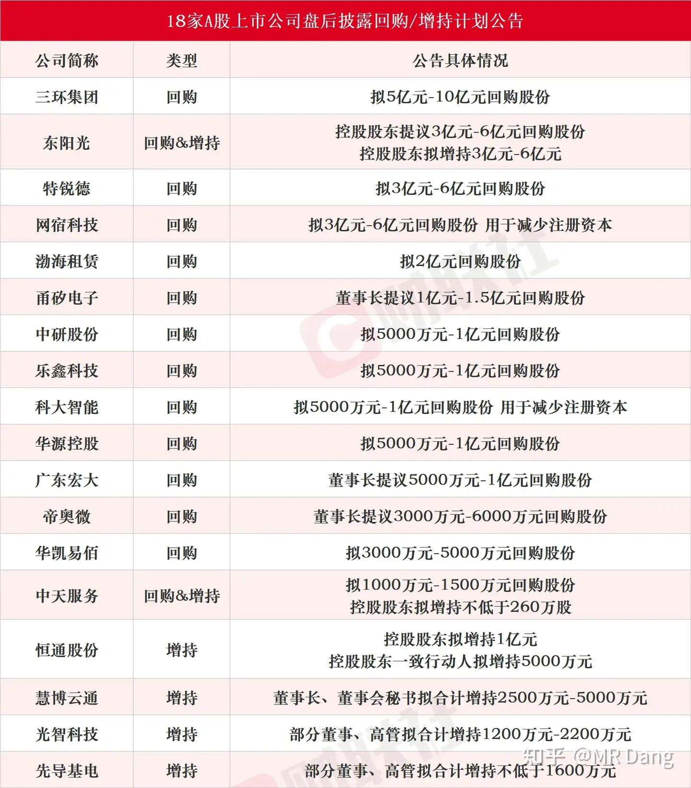
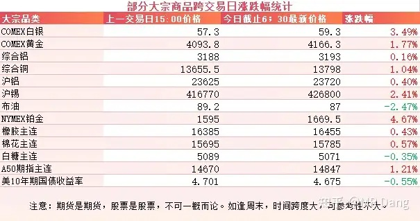
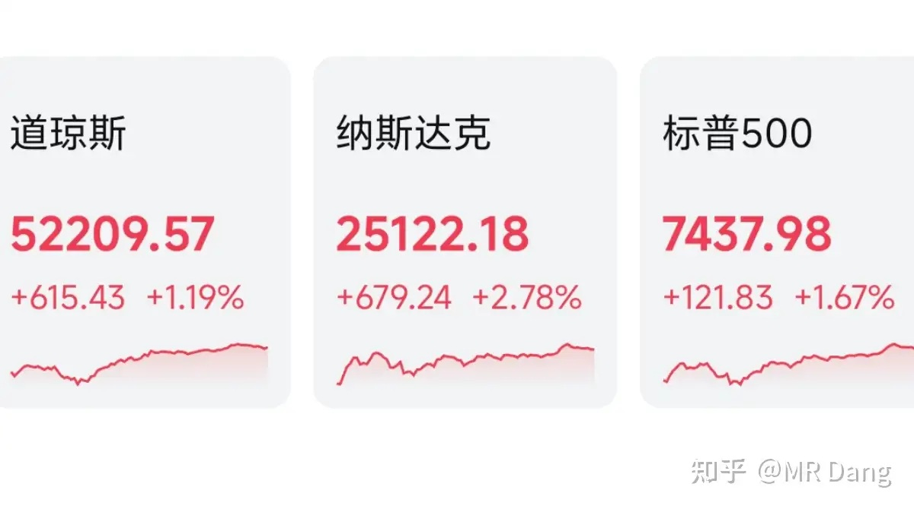

# 如何看待2026年7月31日的A股市场行情？

---

**发布时间**: 2026-07-31 07:30  |  **原文链接**: https://www.zhihu.com/question/2065897051938877847/answer/2066425414923335678  |  **点赞数**: 187 人赞同

**作者信息**: MR Dang | 证券从业资格证持证人

---

## 正文内容

对资本市场影响最大的消息是开会，这个看官方通报即可，我没解读能力。

### 除此之外就是西大GDP数据出炉

这是西大商务部发布的今年二季度GDP数据初值，1.5%的增速小于前值2.1%，也小于预期值2.1%。

疲软的GDP数据不利于加息，数据公布后，9月加息两次的概率从22%一下子降到了0，加息一次的概率变化不大，在60%左右，不加息的概率从17%增加到了37%。

这对黄金和资本市场都是很好的消息。

但是也不能高兴太早，这个只是初值，8月26日还会二次修正，9月底发布最终修正数据。

改来改去的事情并不少见。

---

### 世界黄金协会

二季度全球央行一共净购买入289吨黄金，同比增长62%，创二季度央行买金速度历史新高。

往上看几年，二季度央行净买入一般是180吨左右，在178到183吨这个范围内。

这么一比，今年二季度央行真是开足了马力囤金。

排名第一的波兰央行大概有51吨，东大央行排名第二，净买入33吨。

很多人看到波兰可能会很意外，为什么是他？

说来话长，不过地缘风险是导致波兰这么做的主要因素，他们地处前线，非常有危机意识，定下了700吨的总目标，现在还差六七十吨。

---

### GPT5.6降价

根据官网介绍， Luna版本大概降了80%左右，Terra降了20%左右。

对下游的Ai应用算利好消息，不过对上游的算力则可能恰恰相反。

---

### 宇树上市

根据公告，8月10日打新，不要忘了动动手指，不过这个中签率和存储没法比，体量差太多。

紧赶慢赶还是慢了一步，没赶到市场情绪最乐观，溢价最高的时候。

---

### 部分企业回购计划

看到几个比较熟悉的名字。

---

### 大宗商品

受宏观数据影响，有色整体走强，黄金白银等贵金属都有较大幅度的反弹，工业金属相对来说涨的比较克制。

原油有所回调。

美十年期国债也回调了一些，不过还是在高位。

A50期指似乎预示着今天可能会有个好的开端。

### 外围市场

美股反弹，纳指领涨，科技板块全面回暖，存储板块暴力反弹，普遍都有十几个点的涨幅。

自从我手里也有了存储后，看到这种消息内心变得平静了起来。

软件不错，在微软的带领下一顿猛涨。

有色板块也表现亮眼。

正如前文所说，拉胯的GDP数据，让市场对加息的担忧得到极大缓解。

亚马逊盘后发布了财报，有点超预期。

苹果也发布了财报，基本符合预期，但是看盘后交易数据，似乎市场不太满意。

---

昨天个人组合净值回血两个多点，银行红近四个点，资源红近两个，消费红一个半，电网绿两个半。

好大一口血，现在距离再创新高也不远了。

嗯，七月的持股体验真的夯爆了，我愿称之为老登的牛市。就看今天最后一个交易日能不能保住胜利果实了，还是那句话，不敢奢求太多，不暴击就是好样的。

整个市场3600多家绿色的，1700多家红色的，中位数大概是回调了1.1%这样子。

我自己的话，分红大部分都留着没怎么动，有的是耐心。少部分找了点科技属性高的资源类行业试错，离我梦开始的地方不算太遥远。

---

### 一个喜欢保护韭菜的博主，希望大家少少踩坑，多多赚钱！！！

> [!comment]- 点击展开评论
>
> | 用户 | 时间 | 内容 |
> | :--- | :--- | :--- |
> | TWH |  | 还是大佬稳，自从转入科技股，7月份-50%，把之前挣的全吐了，倒亏了不少 |
> | &nbsp;&nbsp;&nbsp;&nbsp;MR Dang |  | 你这回调的也太多了[捂脸] |
> | &nbsp;&nbsp;&nbsp;&nbsp;明心见性 |  | 你这是浮盈加仓了吧 |
> | 莫里哀A |  | 我大A谁跌跟谁，前几天跟韩大哥，昨天跟美D。今天好像都没跌，跟谁呢？迷糊中[捂脸][捂脸][捂脸] |
> | &nbsp;&nbsp;&nbsp;&nbsp;lion |  | 韩股跌跟韩哥，美股跌跟美爹，没人跌那我大A就要走独立行情了。 |
> | &nbsp;&nbsp;&nbsp;&nbsp;CCCCCCC |  | 这怎么又不算一种独立行情呢？ |
> | &nbsp;&nbsp;&nbsp;&nbsp;莫里哀A |  | 你是说我大A有骨头？ [思考] |
> | &nbsp;&nbsp;&nbsp;&nbsp;hfjvizj |  | 最近美股科技也在暴跌，昨晚才开始涨 |
> | &nbsp;&nbsp;&nbsp;&nbsp;Max233 |  | 今天独立行情[大笑] |
> | 陌上愚翁 |  | 我也没说啥呀，咋没圈子了 |
> | &nbsp;&nbsp;&nbsp;&nbsp;MR Diors |  | 擦 我也没了 |
> | &nbsp;&nbsp;&nbsp;&nbsp;疯子 |  | 找不到组织好慌张[大哭] |
> | &nbsp;&nbsp;&nbsp;&nbsp;陈信宏啊啊啊 |  | 我还以为我不小心退出了[大哭] |
> | 疯子 |  | D佬，圈子进不去了呢 |
> | 功不唐捐 |  | 圈子没了？ |
> | 煮青蛙 |  | 你们圈子也看不到了吗？我以为就我一个出问题了 |
> | &nbsp;&nbsp;&nbsp;&nbsp;疯子 |  | 找不到组织了[大哭] |
> | &nbsp;&nbsp;&nbsp;&nbsp;资本主义必将消亡 |  | 奇怪 也没违规啊最近 |
> | &nbsp;&nbsp;&nbsp;&nbsp;马什么梅 |  | d佬圈子没了[惊讶] |
> | 陶夏 |  | D大，为啥这会儿App上看不到圈子了？ |
> | &nbsp;&nbsp;&nbsp;&nbsp;陶夏 |  | 问了客服，说稍后恢复，兄弟们稍安勿躁 |
> | &nbsp;&nbsp;&nbsp;&nbsp;功不唐捐 |  | 帖子都没了 |
> | 如来熊掌 |  | [感谢]国家又提算力金属概念，拉个涨停不过分吧 |
> | &nbsp;&nbsp;&nbsp;&nbsp;MR Dang |  | [感谢] |
> | &nbsp;&nbsp;&nbsp;&nbsp;子孑孑 |  | 不可以，昨天我割了 |
> | &nbsp;&nbsp;&nbsp;&nbsp;茯苓饮 |  | 必须的[doge] |
> | &nbsp;&nbsp;&nbsp;&nbsp;忠诚的雪山守护者 |  | 进去又被套住了[捂脸] |
> | 洗洗睡吧123 |  | 应该是系统出问题了，小红圈搜索功能用不了了 |
> | xpstu |  | 宏桥今天这个定增公告怎么解读呢？ |

---

*本文件从 MR Dang 知乎页面转载*

**作者**: MR Dang  
**链接**: https://www.zhihu.com/question/2065897051938877847/answer/2066425414923335678  
**来源**: 知乎

*著作权归作者所有。商业转载请联系作者获得授权，非商业转载请注明出处。*

---

## 相关阅读

- [[20260730-如何看待 2026 年 7月 30日 A 股行情？|上一篇：如何看待 2026 年 7月 30日 A 股行情？]]
- [[20260803-如何看待2026年8月3日A股行情？|下一篇：如何看待2026年8月3日A股行情?]]
