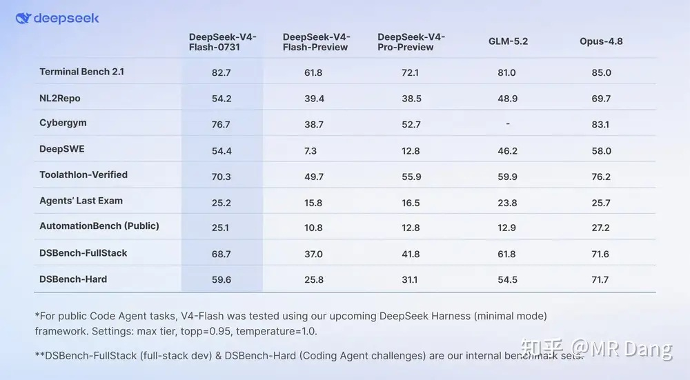
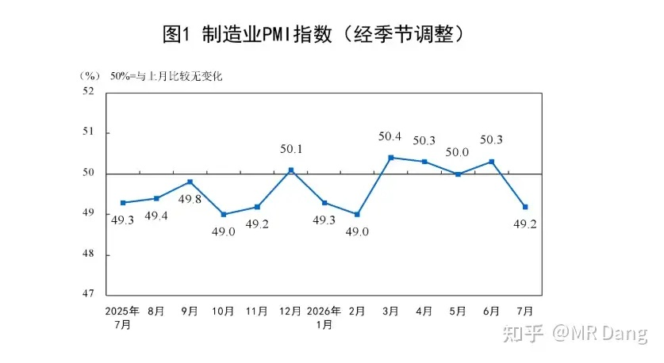
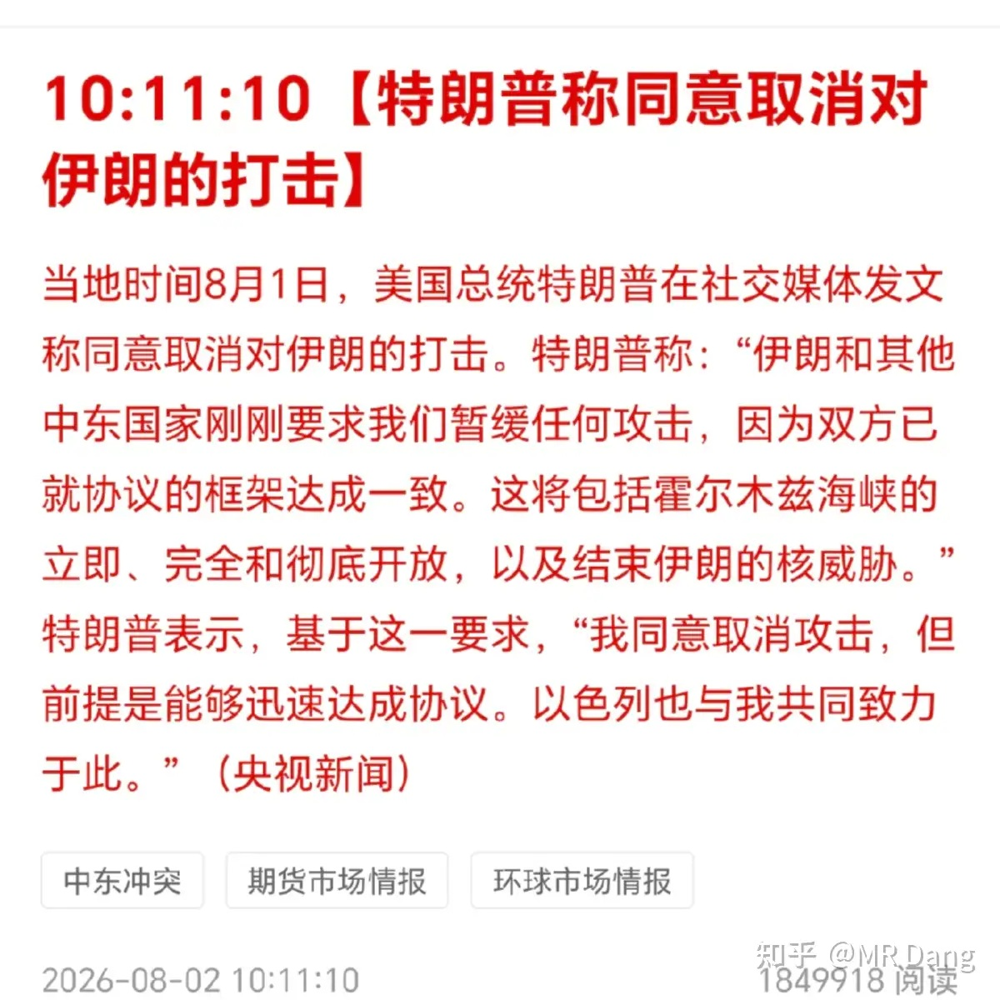
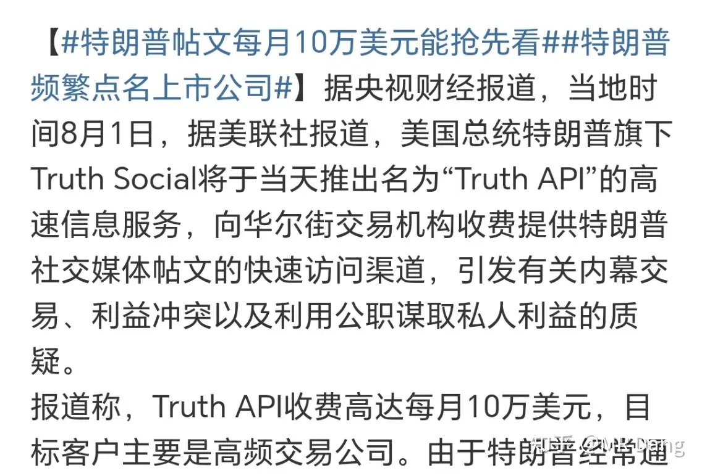
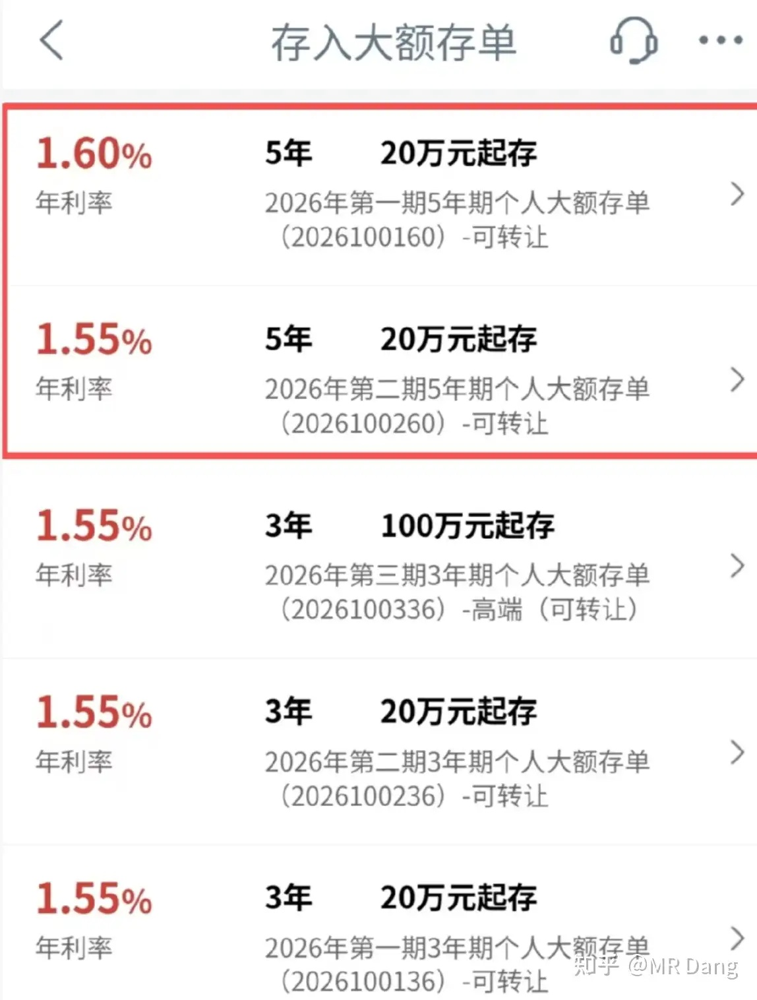
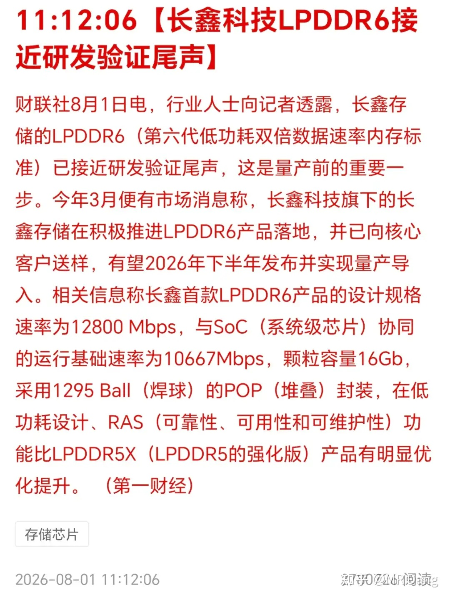
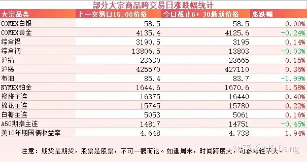
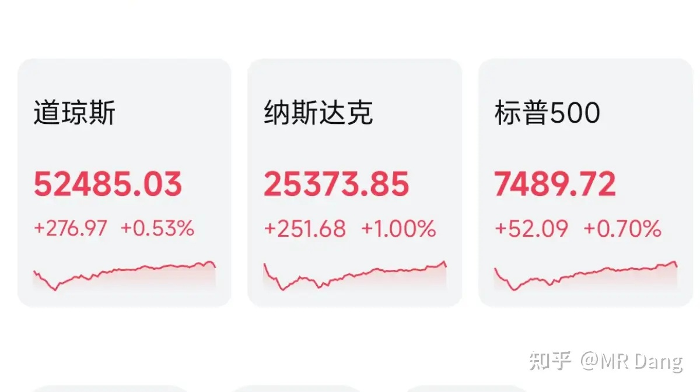

# 如何看待2026年8月3日A股行情?

---

**发布时间**: 2026-08-03 07:19  |  **原文链接**: https://www.zhihu.com/question/2065853370984829094/answer/2067509876356560280  |  **点赞数**: 224 人赞同

**作者信息**: MR Dang | 证券从业资格证持证人

---

## 正文内容

### 周末最爆的消息就是Deepseek V4 Flash正式版本

乱七八糟的参数，可能大多数投资者也看不懂，所以我就长话短说，这次发布的版本有两大特点：

1，架构创新。

引入了稀疏激活，KV Cache压缩，混合注意力，Engram静态记忆四大黑科技。

最后的效果就是对存储的需求发生了结构性的变化，对HBM的需求大幅降低，而对DDR5和SSD的需求大幅上升。

简单的解释下，HBM就是三星海力士目前在做的，比较高端，东大的股王目前还做不了。

咱们能做就是DDR5和SSD，所以这次的V4 Flash完美适配咱们的硬件基础。

2，性价比断档。

目前该版本的综合能力大概是GPT 5.6 SOL的八九成左右，但价格只有几十分之一。

在专业网站里的性能-价格象限中，V4 Flash以极低的价格提供了超高的性能，性价比独一档。

最重要的是，V4 Flash相对上个版本的进化，让大家意识到大模型不只是要堆参数，通过科学的后训练，也可以让大模型的能力得到巨大的提升。

这对Ai硬件方向的投资来说不是什么很好的消息，也不是说完全证伪了Ai硬件的投资逻辑，但是提供了另一种可能性——不堆极致的硬件，也可以有不错的表现。

---

### 统计局公布PMI数据

50以上表示环比扩张，50以下表示环比收缩。

7月制造业PMI是49.2，提示制造业可能面临一点点的压力。

---

### 美伊局势

周末经过一顿拉扯，懂王再次TACO了。

原油又成了空中飞人，这个品种和碳酸锂都太难做了，新手勿碰，老手亦然。

另有媒体报道懂王推出了面向量化机构的VIP服务，可以提前大概0.1秒看到他的帖子，收费10万美元一个月。

对普通人来说这是笔巨款，不过对量化机构来说，可能一次交易就能挣回本。

---

### 四大行大额存单

工行在四大行里最后一个推出五年期的大额存单。

20万，5年，1.6%，成为了四大行的标配。

怎么说呢，这个利率看起来不是很有诚意，也不像是来抢储户的，只是勉强维持住原有客户。

---

### 长鑫LPDDR6

我看到这个消息是有点震惊的，看了下信源，不算野生媒体，但也不是官方披露。

长鑫2023年是LPDDR5，2025年LPDDR5X，现在LPDDR6，这研发速度太惊人了。

---

### 大宗商品

周末原油走了个过山车，总的是回调了两个点左右。

有色整体波动很小，在正常波动范围内。

美债又走高了，不算太好的信号。

### 外围市场

上个交易日美股三大股指集体收红，纳指领涨。

存储板块起了个大早，赶了个晚集，开的红红的，收的绿绿的。

板块上软件类的比较强势。

---

上个交易日个人组合净值回撤小半个点，银行绿近一个点，资源微红，电网红近两个，消费绿一个半。

还行吧，不算很痛，只是和红彤彤的大盘比起来确实差了点事。

市场风格上又是重复了很多遍的科技暴打老登的剧情，只不过现在老登比较抗揍，所以就还好。

整体上七月已经是让人喜出望外的程度，所以我个人对八月的整体预期打的也不是很高，开点倒车也能接受，只要不是暴揍就好。

老登和科技不一样，没那么多故事，也没有星辰大海，大家都在按计算器算估值，涨的多了就会均值回归，这是大概率事件。

---

### 本周前瞻

1，本周二公布space x的财报。

2，周四西大公布初请失业金人数和闪迪财报。

3，周五公布西大非农数据，很重要的一个节点。

4，周五公布东大贸易数据。

5，周末公布咱们这边的CPI数据。

---

### 一个喜欢保护韭菜的博主，希望大家少少踩坑，多多赚钱！！！

> [!comment]- 点击展开评论
>
> | 用户 | 时间 | 内容 |
> | :--- | :--- | :--- |
> | Yang |  | 喜欢这段话，透彻。老登和科技不一样，没那么多故事，也没有星辰大海，大家都在按计算器算估值，涨的多了就会均值回归，这是大概率事件。 |
> | &nbsp;&nbsp;&nbsp;&nbsp;MR Dang |  | [感谢] |
> | 谶语殇劫 | 22 小时前 | 虽然论文发了Engram静态记忆，但Flash v4并没有用上它 |
> | 机械之道 |  | 跌停了，不接飞刀，等着看后续走势吧 |
> | ZCharles |  | 今天科技股可以解套一部分了 |
> | &nbsp;&nbsp;&nbsp;&nbsp;寸木水 |  | 解套，能高开吗[飙泪笑][捂脸] |
> | &nbsp;&nbsp;&nbsp;&nbsp;夏天的风 |  | 想多了[飙泪笑] |
> | &nbsp;&nbsp;&nbsp;&nbsp;菜酒多练 |  | 棒子都跌了，你懂的[doge] |
> | &nbsp;&nbsp;&nbsp;&nbsp;直男 |  | 车门已经焊死了 |
> | &nbsp;&nbsp;&nbsp;&nbsp;ZCharles | 15 小时前 | 嘿嘿， 真的焊死了， 只能，咳咳价值投资了 |
> | 东南之鲫 | 20 小时前 | 难道a股宏桥就一直要承担分红责任吗？控制率88点多，如果要继续定增，那是很可怕的事，钱大a股民出，港负责回购分红，真的狠，我估计以后还会有几轮定增，真的让人害怕 |
> | 曼吉克斯 |  | dang大 宏桥定增算利好吗 是否说明龙头看好行业未来几年发展 才敢花大钱搞固投？ |
> | &nbsp;&nbsp;&nbsp;&nbsp;机械之道 |  | 利中偏空，具体还是要看项目建设和投产情况，还有之后的有色行情。还是那句话，手里一手好牌打的稀烂（说的谁dddd），照样能在风口上飞起来。要是不景气再努力股价也上不去（猪周期） |
> | &nbsp;&nbsp;&nbsp;&nbsp;草长莺飞 |  | 很少见定增能利好的 |
> | MrLittleCold | 22 小时前 | [爱] |
> | 浪里小白马 |  | [感谢][感谢] |
> | &nbsp;&nbsp;&nbsp;&nbsp;MR Dang |  | [感谢] |
> | 陈陈陈 |  | [感谢] |
> | &nbsp;&nbsp;&nbsp;&nbsp;MR Dang |  | [感谢] |
> | edu cncc |  | [感谢][感谢][感谢] |
> | &nbsp;&nbsp;&nbsp;&nbsp;MR Dang |  | [感谢] |

---

*本文件从 MR Dang 知乎页面转载*

**作者**: MR Dang  
**链接**: https://www.zhihu.com/question/2065853370984829094/answer/2067509876356560280  
**来源**: 知乎

*著作权归作者所有。商业转载请联系作者获得授权，非商业转载请注明出处。*

---

## 相关阅读

- [[20260731-如何看待2026年7月31日的A股市场行情？|上一篇：如何看待2026年7月31日的A股市场行情？]]
- [[20260804-如何看待2026年8月4日的A股行情？|下一篇：如何看待2026年8月4日的A股行情？]]
