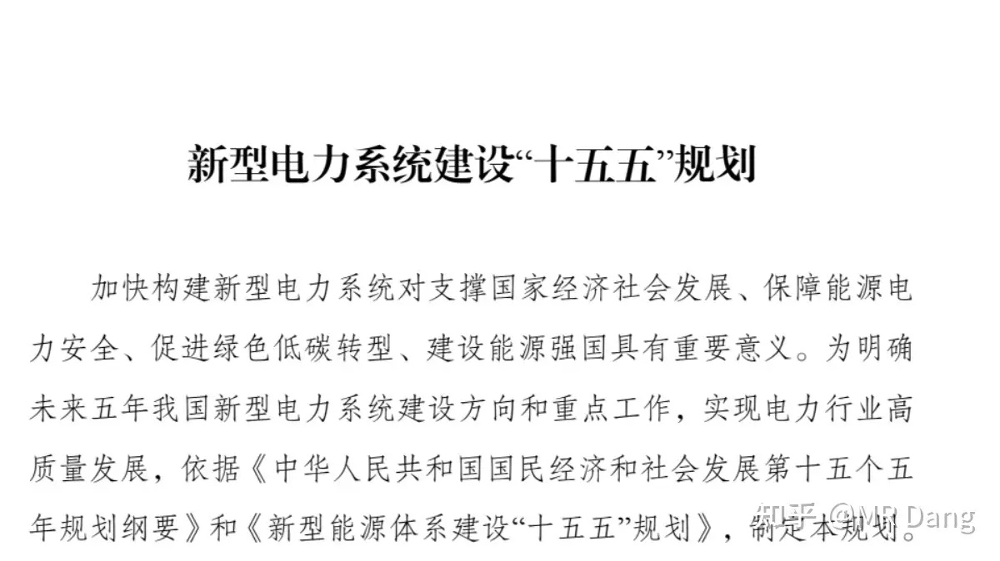
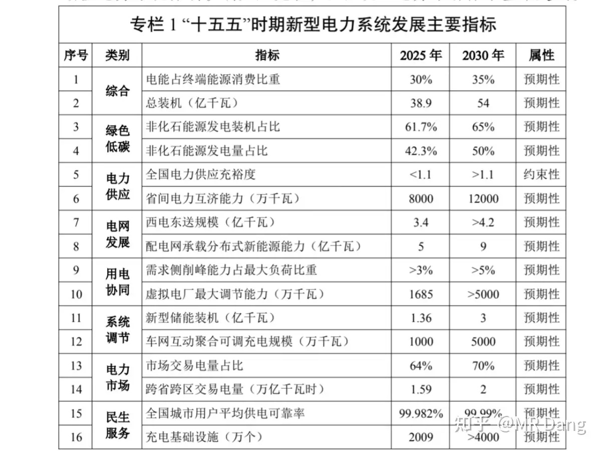
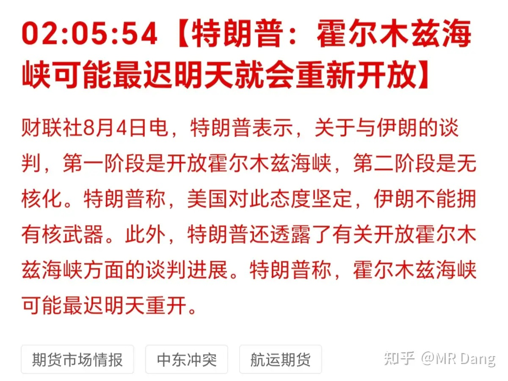
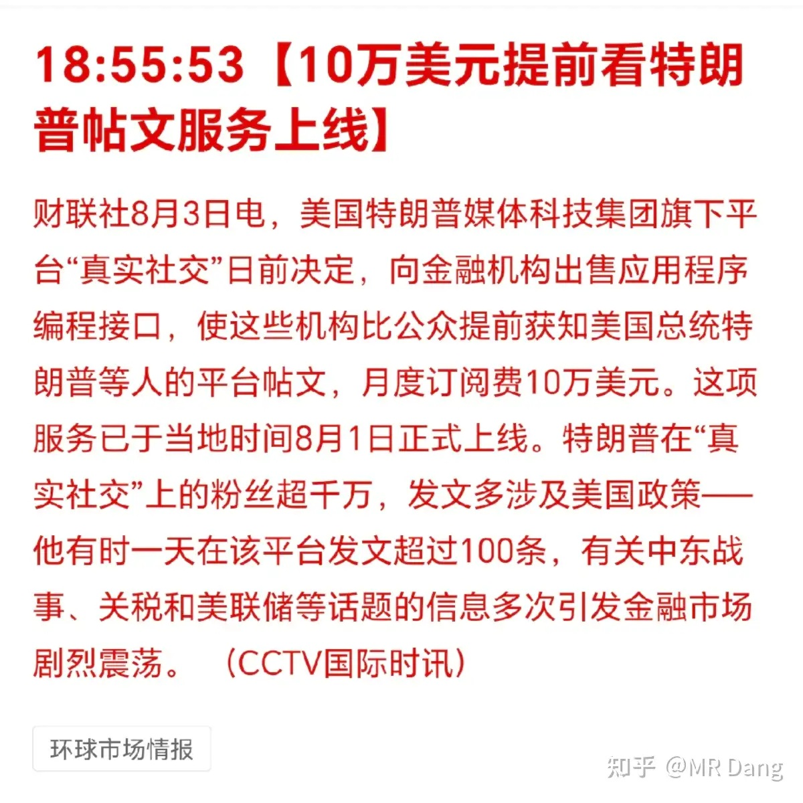
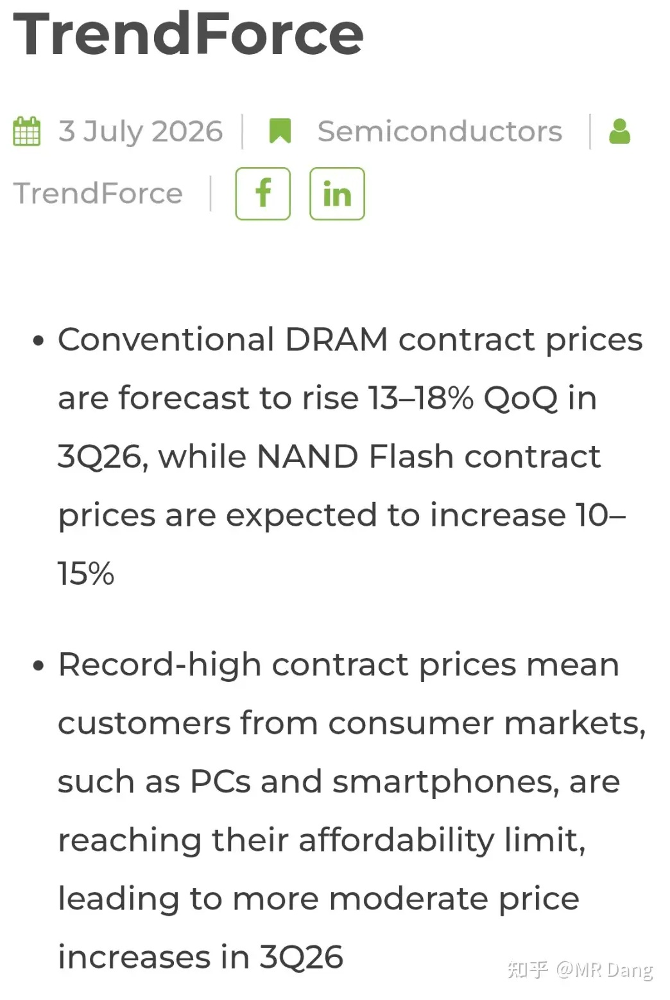
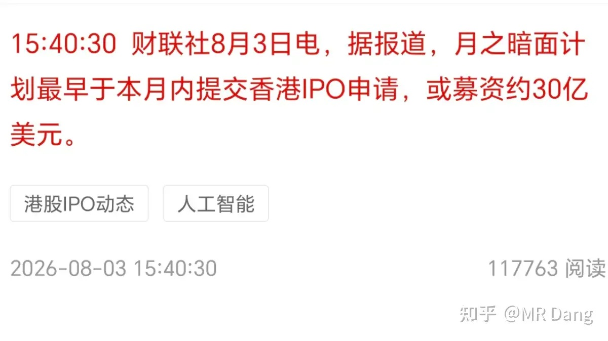
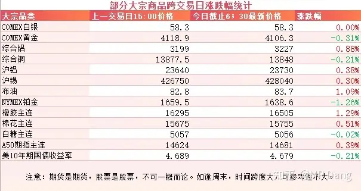
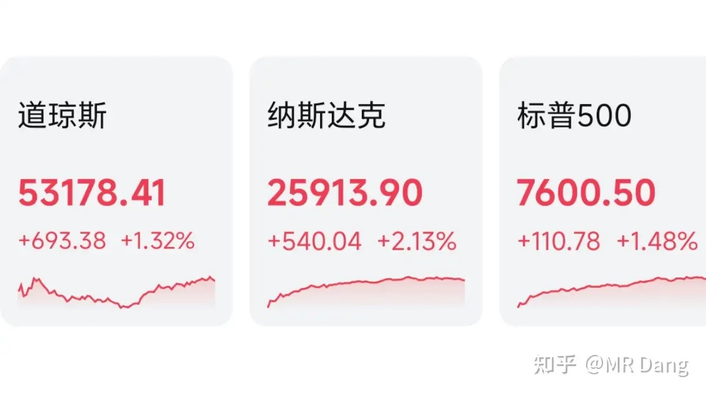
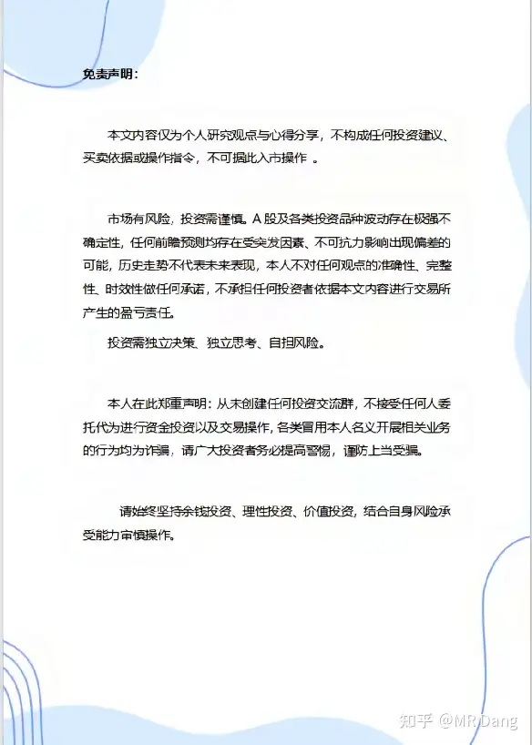

# 如何看待2026年8月4日的A股行情？

---

**发布时间**: 2026-08-04 07:17  |  **原文链接**: https://www.zhihu.com/question/2066210928601854581/answer/2067871873224986847  |  **点赞数**: 119 人赞同

**作者信息**: MR Dang | 证券从业资格证持证人

---

## 正文内容

### 从新型电力系统十五五规划说起

这可能是对投资电力方向最有指导意义的一份十五五规划。

很多读者经常问我电网行业该怎么找方向，那我非常推荐大家一定要仔细读这份规划，优先度拉到最高。

因为电网是一个To G的行业，业绩怎么样，哪个方向预期最好，一定是规划里说了算的，不要一厢情愿。

这份规划相比之前的规划，颗粒度更细，覆盖的更全面。

当然如果没时间读，我也可以整理一下大概的点，仅供参考，一定以原文为主。

我个人认为新型储能装机数据可能是比较超预期的，2025年底1.36亿千瓦，2030年预期目标3亿千瓦，增速挺高的。

除此以外，还有一个车网互动聚合可调充电规模从1000万千瓦直接增长到5000万千瓦。

最后一个大超预期的是充电基础设施，从2025年的2009万个，到2030年要增长到4000万个以上。

---

### 美伊局势

懂王称海峡可能最迟明天开。

哦，对了，昨天提的每月10万美元VIP通道，今天已经开了，懂王执行力惊人。

---

### 存储涨价

集邦咨询称，2026年第三季度，常规DRAM长协合约价预计环比上涨13%~18%，而NAND Flash合约价预计上涨10%~15%。

可能是孕妇效应吧，自从手里有了存储后，感觉哪哪都在涨价。

---

### 月之暗面IPO

最快本月内可能在港股IPO，募资30亿绿票子。

该说不说，港股的融资功能越发强大了，吸引到了各种企业赴港上市。

每次提月之暗面，总有读者吐槽它的名字太中二，我个人倒觉得挺有逼格的。

---

### 光伏产业链

最近有关部门在盐城开了个光伏行业价格合规指导会。

和以前的行业自律不一样，这次明显级别更高。

会上主要是说了低于成本价恶意倾销的事，所以昨天多晶硅期货给涨停了。

光伏产业链目前最大的问题是因为种种原因，供大于求，供应端迟迟不见起色。

如果把这个问题解决不了，中长期来看，还是会面临压力的。

---

### 大宗商品

隔夜有色波动都不大，伦铝稍强一些。

原油涨了一个点。

农产品里橡胶走强。

美长债收益率有所回调，A50期指似乎预示着今天可能会有个好的开头。

### 外围市场

美三大股指集体收涨，纳指领涨。

板块上软件类发力，存储一般，亚马逊创新高。

---

昨天个人组合净值回撤小半个，银行红大半个，电网红近两个，消费绿一个半，资源绿近四个。

还行其实，比指数强一点。

但是资源有点拉胯，主要是一些资本运作的事情引发了市场恐慌，波动有些太大了。

持有体验很差劲，呼啦啦的像过山车一样。

市场对资本运作这件事本身的态度是消极的，它会让市场对管理层的动机产生怀疑，因为信息是不对称的。

管理层越展示复杂的操作，只会越让小股东心惊，生怕一不小心就被割韭菜了。

昨天整个市场上涨的公司数量比下跌的多，中位数也是上涨的，和指数的颜色不太一样。

这就是经常说的科技绑架了指数。目前指数含科量太高了，只要持有宽基指数，就无法避免的间接持有科技，科技如果表现不佳，宽基产品也不会好到哪里去。

---

### 一个喜欢保护韭菜的博主，希望大家少少踩坑，多多赚钱！！！

> [!comment]- 点击展开评论
>
> | 用户 | 时间 | 内容 |
> | :--- | :--- | :--- |
> | 18一枝花 | 2 小时前 | [感谢] |
> | &nbsp;&nbsp;&nbsp;&nbsp;MR Dang | 2 小时前 | [感谢] |
> | 秋白 | 21 分钟前 | [感谢] |
> | 法家君子 | 2 小时前 | 默默支持[机智] |
> | &nbsp;&nbsp;&nbsp;&nbsp;MR Dang | 2 小时前 | [感谢] |
> | 簌簌 | 2 小时前 | 八月一开始，又挨打了[大哭]早安[感谢] |
> | &nbsp;&nbsp;&nbsp;&nbsp;MR Dang | 2 小时前 | [感谢] |
> | 木子一 | 2 小时前 | [感谢] |
> | &nbsp;&nbsp;&nbsp;&nbsp;MR Dang | 2 小时前 | [感谢] |
> | 夏天的风 | 2 小时前 | 月之暗面我一直用呢，据我观察，我用啥啥10年翻个5倍没问题 |
> | &nbsp;&nbsp;&nbsp;&nbsp;MR Dang | 2 小时前 | [感谢] |
> | &nbsp;&nbsp;&nbsp;&nbsp;小猫 | 1 小时前 | 你还用了啥上市的，说来听听[大笑] |
> | &nbsp;&nbsp;&nbsp;&nbsp;夏天的风 | 26 分钟前 | 马上就用你的产品 |
> | 无为 | 2 小时前 | [感谢]早 |
> | &nbsp;&nbsp;&nbsp;&nbsp;MR Dang | 2 小时前 | [感谢] |
> | 我是一颗桃子吖 | 1 小时前 | 早捏[感谢] |
> | &nbsp;&nbsp;&nbsp;&nbsp;MR Dang | 1 小时前 | [感谢]早啊 |
> | 没什么不同 | 1 小时前 | [感谢] |
> | &nbsp;&nbsp;&nbsp;&nbsp;MR Dang | 1 小时前 | [感谢] |
> | 浪里小白马 | 1 小时前 | [感谢] |
> | &nbsp;&nbsp;&nbsp;&nbsp;MR Dang | 1 小时前 | [感谢] |

---

*本文件从 MR Dang 知乎页面转载*

**作者**: MR Dang  
**链接**: https://www.zhihu.com/question/2066210928601854581/answer/2067871873224986847  
**来源**: 知乎

*著作权归作者所有。商业转载请联系作者获得授权，非商业转载请注明出处。*

---

## 相关阅读

- [[20260803-如何看待2026年8月3日A股行情？|上一篇：如何看待2026年8月3日A股行情?]]
- [[20260812-大家对2026年8月12日A股市场行情都怎么看待？|下一篇：大家对2026年8月12日A股市场行情都怎么看待？]]
