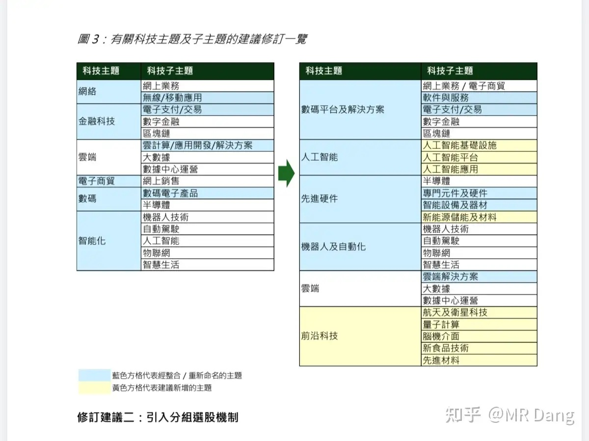
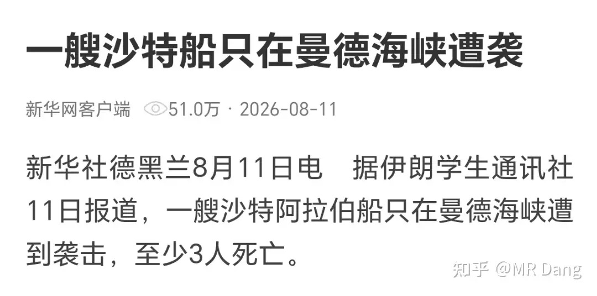
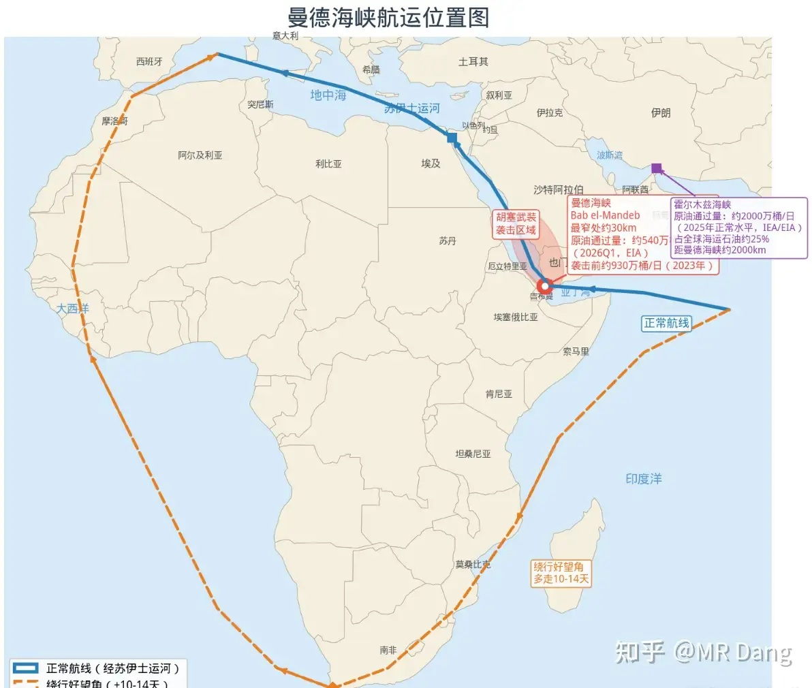
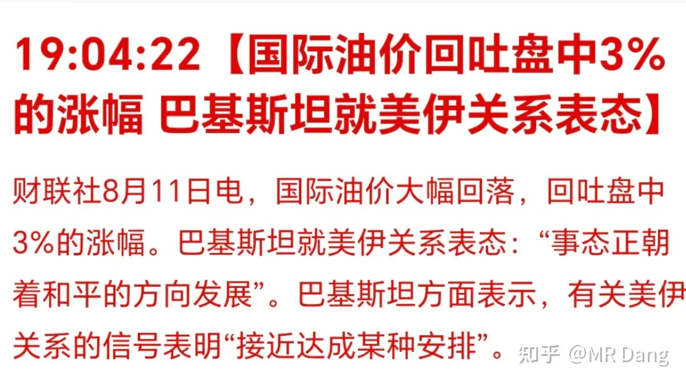
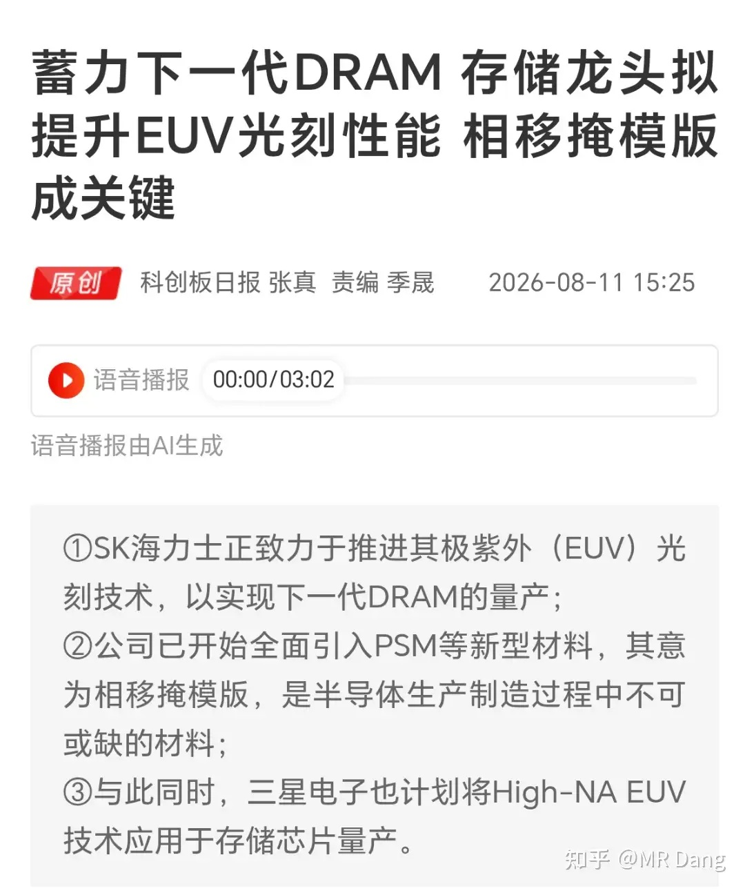
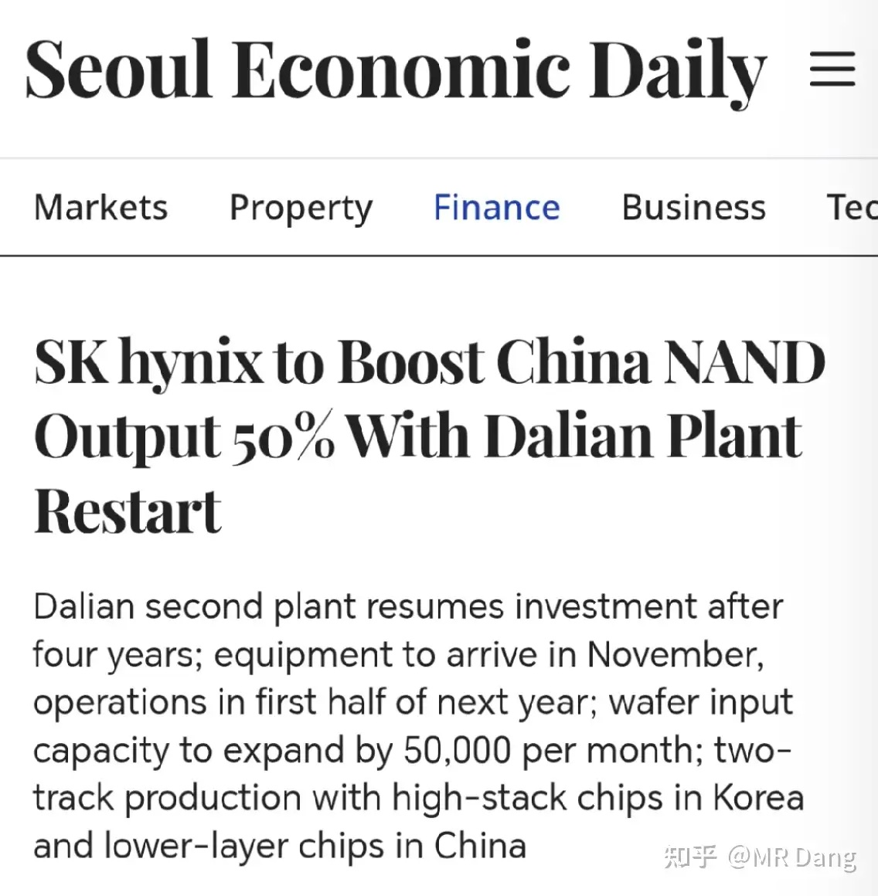
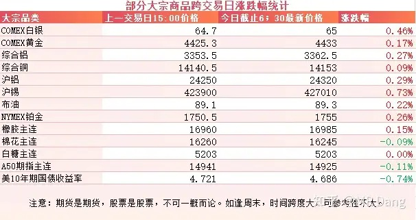
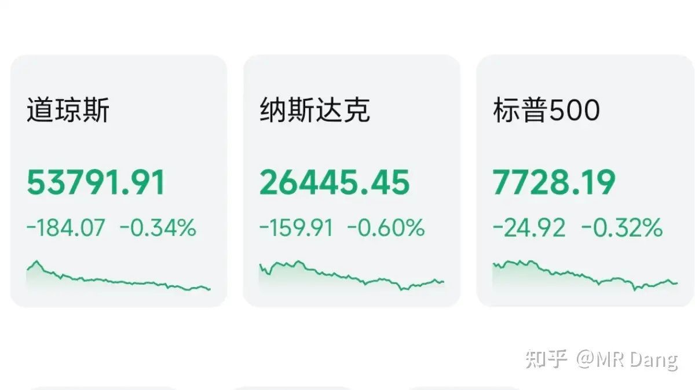

# 大家对2026年8月12日A股市场行情都怎么看待？

---

**发布时间**: 2026-08-12 07:30  |  **原文链接**: https://www.zhihu.com/question/2070437782829392398/answer/2070774192858050960  |  **点赞数**: 200 人赞同

**作者信息**: MR Dang | 证券从业资格证持证人

---

## 正文内容

### 恒科指数迎来重大调整

最近恒科发了个征求意见稿，要把指数规则进行大修。

首先是数量上扩容，成份股从30只提高到50只。

其次是结构上调整，这50家公司里有40家采用市值排名，另外10家采用增速排名。

最后就是主题变化，以前人工智能是在智能主题下的二级主题，现在升级为一级主题，并且增加了航天，量子之类的前沿科技主题。

经过这些变化后，恒科里的外卖含量会降低，硬科技属性会增加。

那么代价是什么呢？

以我对这些科技的印象，恒科加入这些主题后，大概率估值是会变得更贵的。

另外对高位就一直持有恒科的家人来说，就相当于被动止损了。

原理也很简单，新的恒科里，旧恒科含量被稀释，被硬科技替代，这部分就相当于被动的把旧恒科换成了硬科技。

是福是祸不好说，也许之前的Minimax和智谱可以作为一个参考。

---

### 美伊局势

昨天收盘后，权威媒体报道了一艘沙特船在曼德海峡遇袭的事情。

又到了学地理知识的时间，上半年的行情已经把霍尔木兹海峡的地理知识学了个透，下半年看样子得学学曼德海峡了。

大概就是图中这么个情况，曼德海峡以前高峰的时候每天过900多万桶油，后来胡赛开始闹，降低到500多万桶。

现在又出这档子事，可能还会降低一点。

从重要性来说，比不上霍尔木兹海峡。

另外还可以绕道好望角，会增加一些额外成本。

总之这事爆出来以后，油价起飞，过了几个小时巴铁那边又爆出来美伊接近达成某种安排。

大概意思是谈判在推进，但是谁给谁赔钱这事上两边还在吵，懂王说自家也有损失，要让伊朗赔钱。。。。。

---

### 学习一个新概念PSM

先提前说好，这个没有信息差，前天海力士高管在公开场合就表态了，昨天中午盘中就有消息了，收盘后开始见到大规模的报道。

PSM叫相移掩模版，是半导体先进制程里需要的铲子之一。

它的作用是什么呢？简单的说，就是让电路图更加清晰。

光刻机的工作原理就是让光在晶圆上画画。

但是随着制程越来越先进，线条越来越细，会有个难题，就是光的衍射。

光发生衍射后，光的影子会有毛边，画出来的电路就不够精准。

这个时候PSM就登场了，它可以利用光的相位差消除衍射，提升分辨率。

听不懂也没关系，反正知道这是一个高阶辅助道具，越先进越需要就行了。

---

### 海力士重启大连工厂

韩媒报道海力士要重启大连二厂，每月增加5万片产能，大连一厂目前是十万片产能，相当于在现有基础上增加50%。

大连二厂四年前就动工了，结果遇到存储下行周期，就停了，现在行业景气度高，就重启了。

根据报道，年底前搬入设备，主要做100层级的NAND。

利好利空都挺明显，利好的就是国内上游的硅片，设备，材料，封测企业，特别是本来通过海力士验证的，有合作基础的。

利空的话，因为主要做的是NAND，所以会增加NAND的供应，从而压制价格。

我想到了一些上杠杆囤货的模组厂商，中报里那么多存货，令人担忧啊。

---

### 大宗商品

盘后有色整体都在涨，但是幅度都不大。

原油因为消息面的事情，冲高回落。

美债收益率回落了一些，算是好消息了。

### 外围市场

美三大股指集体回调，纳指领跌。

行业上存储和医疗相对好一些。

---

昨天个人组合净值回撤近一个点，银行微绿，资源绿近四个，电网绿一个多，消费红半个点。

怎么说呢，槽点满满的一个交易日，开心只有前半个小时，然后一整天欣赏跳水比赛。

我经常挂在嘴边的一句话是“越开心越要警惕，越沮丧越要坚定”。昨天就是真实写照，大A会平等的惩罚每一个半场开香槟的参与者。

博主博主，你说的实在太好了，那你昨天一定精准逃顶了吧？

嗯。。哪壶不开提哪壶。。我开心得把教训给忘记了。。

事实上，十点钟的时候获奖感言都酝酿好了，然后每隔半小时改一次，就改成了现在这个样子。。。

市场没什么好说的，3700多家绿色的，1600多家红色的，中位数涨跌幅大概是-0.7%。

---

### 一个喜欢保护韭菜的博主，希望大家少少踩坑，多多赚钱！！！

> [!comment]- 点击展开评论
>
> | 用户 | 时间 | 内容 |
> | :--- | :--- | :--- |
> | 沐晨 |  | 博主博主，你说的实在太好了，那你昨天一定精准逃顶了吧？[感谢] |
> | &nbsp;&nbsp;&nbsp;&nbsp;MR Dang |  | [捂脸] |
> | 思达尔 |  | 变得更贵还能是好事嘛 |
> | &nbsp;&nbsp;&nbsp;&nbsp;MR Dang |  | [滑稽]更科技了 |
> | &nbsp;&nbsp;&nbsp;&nbsp;MR Dang |  | [感谢] |
> | &nbsp;&nbsp;&nbsp;&nbsp;安静 |  | 波动估计会更大，利于做t |
> | 今晚回家吃饭 |  | 我们是来挣钱的啊[思考]不是来学习的[酷] |
> | &nbsp;&nbsp;&nbsp;&nbsp;MR Dang |  | [感谢] |
> | 云北北 |  | 我来看看有谁中签了[大笑] |
> | &nbsp;&nbsp;&nbsp;&nbsp;MR Dang |  | [感谢] |
> | 不学习就亏钱 |  | 开盘+3000，收盘-10000[大哭] |
> | &nbsp;&nbsp;&nbsp;&nbsp;啦啦啦 |  | 你买啥了，我+1.5 |
> | 等亿会儿就去学习 |  | 这些都是只有在大A才能学到的知识啊[生气] |
> | &nbsp;&nbsp;&nbsp;&nbsp;MR Dang |  | [感谢] |
> | 等 远航的你 |  | [捂嘴][捂嘴]看到博主博主那，给我看笑了 |
> | &nbsp;&nbsp;&nbsp;&nbsp;MR Dang |  | [感谢]哈哈 |
> | 陈信宏啊啊啊 |  | 补卡[感谢] |
> | 18一枝花 |  | [感谢] |
> | &nbsp;&nbsp;&nbsp;&nbsp;MR Dang |  | [感谢] |
> | 如来熊掌 |  | [感谢] |
> | &nbsp;&nbsp;&nbsp;&nbsp;MR Dang |  | [感谢] |

---

*本文件从 MR Dang 知乎页面转载*

**作者**: MR Dang  
**链接**: https://www.zhihu.com/question/2070437782829392398/answer/2070774192858050960  
**来源**: 知乎

*著作权归作者所有。商业转载请联系作者获得授权，非商业转载请注明出处。*

---

## 相关阅读

- [[20260804-如何看待2026年8月4日的A股行情？|上一篇：如何看待2026年8月4日的A股行情？]]
- [[20260813-如何看待 2026 年 8 月 13 日 A 股市场行情？跳空高开尾盘却突发跳水，发生了什么？|下一篇：如何看待 2026 年 8 月 13 日 A 股市场行情？跳空高开尾盘却突发跳水，发生了什么？]]
