# 如何看待 2026 年 8 月 13 日 A 股市场行情？跳空高开尾盘却突发跳水，发生了什么？

---

**发布时间**: 2026-08-13 07:30  |  **原文链接**: https://www.zhihu.com/question/2067634093093818544/answer/2071136516856887200  |  **点赞数**: 275 人赞同

**作者信息**: MR Dang | 证券从业资格证持证人

---

## 正文内容

> **要点速览**
>
> - 美国 7 月 CPI 与核心 CPI 分别为 3.4% 和 2.5%，均较前值回落且符合市场预期，9 月加息押注变化不大。
> - 央行货币政策执行报告提高了稳增长与物价合理回升的重要性，并将重启的 PSL 用于补充重大项目资本金。
> - LME 铜库存连续 40 个交易日下降，上期所铜库存也在下行，但作者提醒不能把去库简单等同于库存创历史新低。
> - EGA 已重启 18% 的电解槽、计划于 2027 年一季度完成修复，供应恢复消息对铝价构成压力。
> - SpaceX 的 AI 业务展望、段永平的期权持仓变化及 DeepSeek V4 Pro 正式版也成为当日关注点。
> - A 股资源方向反弹、作者组合小幅回血；作者强调，市场正常波动未必都能找到具体理由。

### 对资本市场影响最大的西大 CPI 数据出炉了

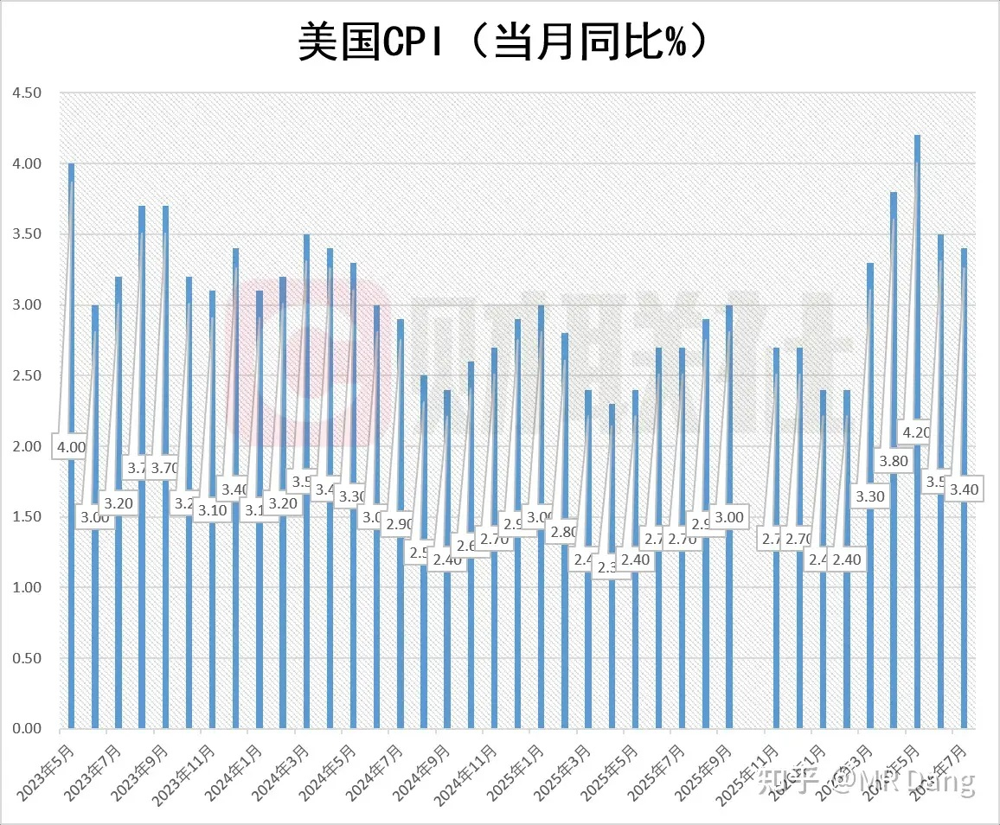

7 月 CPI 数据 3.4%，比前值 3.5% 稍微降了一点，符合市场预期，这个在周一的早报前瞻里写过了。

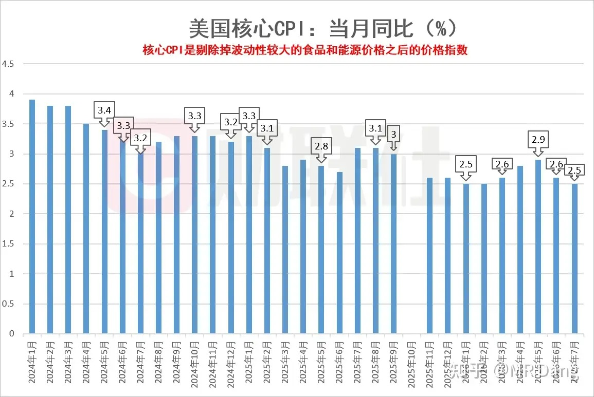

核心 CPI 数据是 2.5%，比前值 2.6% 也稍微降了一点，符合市场预期。

目前市场对9月加息的概率大概还是维持40%左右的押注，变化不大。

---

### 央行发布了货币政策执行报告

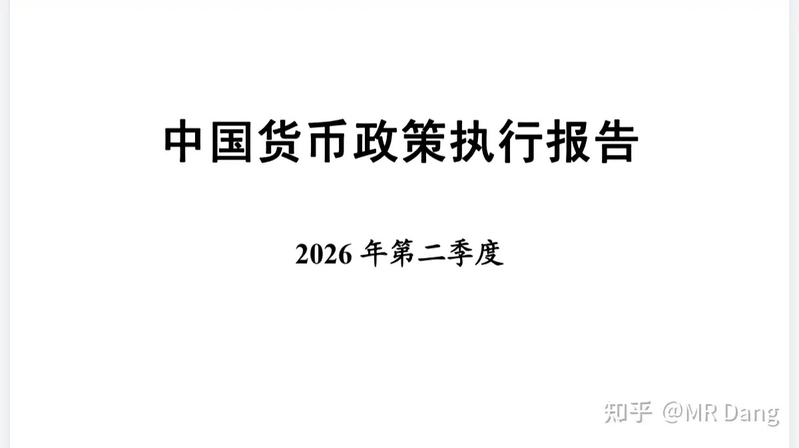

很重磅的文件，还是老样子，建议看原文，才能把握精髓。

我个人的话，看完以后觉得有两点比较超预期。

一个是把促进经济稳定增长、物价合理回升作为货币政策的重要考量。

在第五部分下阶段思路第一条。

把 CPI 的重要性拉高了一大截。

根据目前的形式，可能意味着未来的货币政策会更积极。

另一个是 PSL 重启，且用途变为补充重大项目资本金。

在第二部分第四点。

PSL 以前主要是用来做棚改的，也做过保交楼和三大工程，和房地产关系紧密。

报告里提出的是重点支持数字经济、人工智能、消费基础设施，以及交通、能源、地下管网建设改造等城市更新领域。

这和之前的表述有区别。

总的看下来，个人感觉货币政策和财政政策方面都有发力的动作，对咱们的资本市场更有信心了。

---

### LME 铜库存连续 40 天下降，创 2014 年以来最长纪录

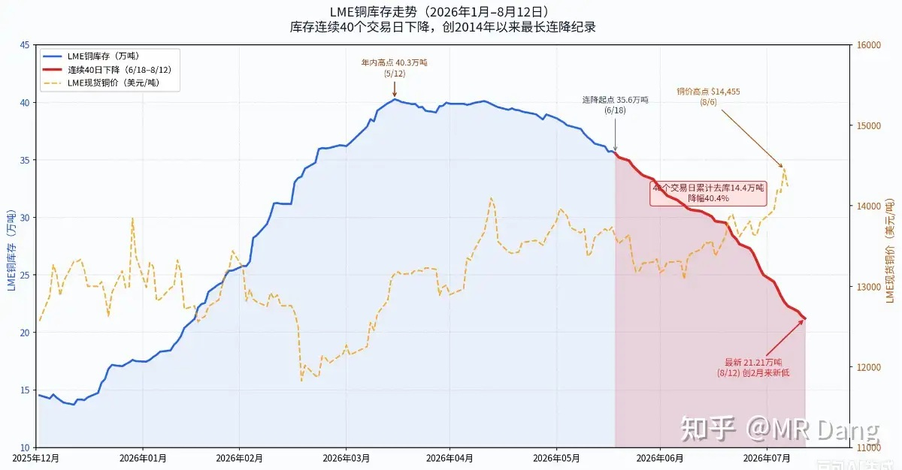

注意这里的表述，不是铜库存创新低，而是创最长记录。

意思就是连续 40 天，每天降，这个 40 天创了记录。

但是具体到库存数据，并不是历史最低，图里能很清楚的看到。

至于为什么会发生这种情况，一个很重要的点就是之前反复提及的阴极铜大搬家：美铜有溢价，利益驱动下，贸易商都在套利。

而美铜溢价的原因是关税预期，如果这个预期落空，那就有可能改变这个趋势。

### 另外有读者好奇东大的铜库存，也贴一张图

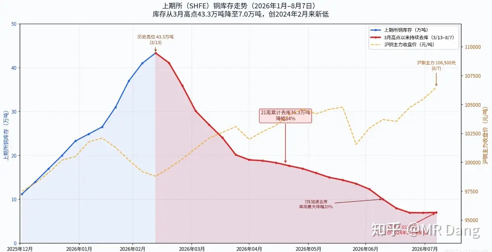

大的趋势都差不多，在往下走。

但不能简单的认为是往西大出口，东大其实是最大的铜进口国。

主要原理是进口的少了，差价没有西大那边大，抢不过西大，而用量并没有减少，所以库存就下来了。

---

### EGA 复产进度最新消息

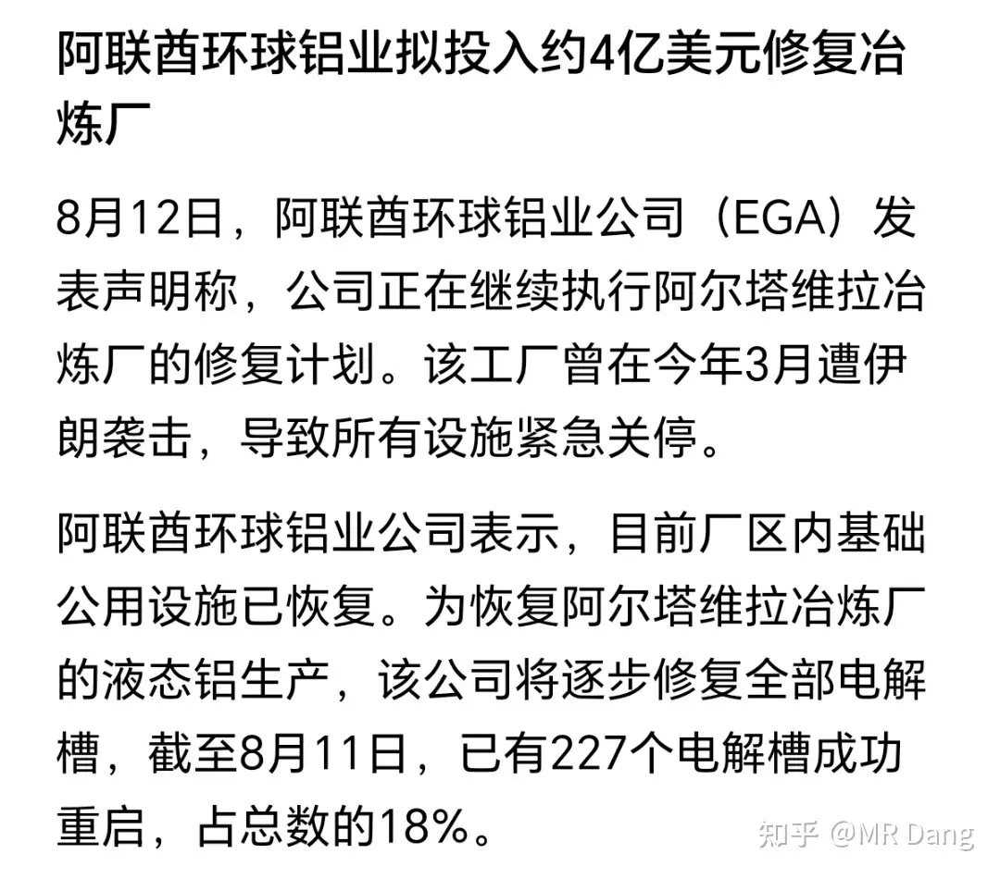

阿联酋铝业是3月遇袭的，当时市场普遍预期产能恢复需要一年左右，也就是大概2027年3月。

昨天阿联酋铝业更新了复产进度，截止目前复产18%，对应27万吨产能，全部重启一共是1262个电解槽，对应150万吨产能。

修复成本大约4亿美元，修复完成时间在2027一季度。

这种会增加供应的新闻肯定对铝价不是什么好消息，在昨天传出来后，伦铝直接跳水。

---

### 马斯克：SpaceX 的 AI 业务展望

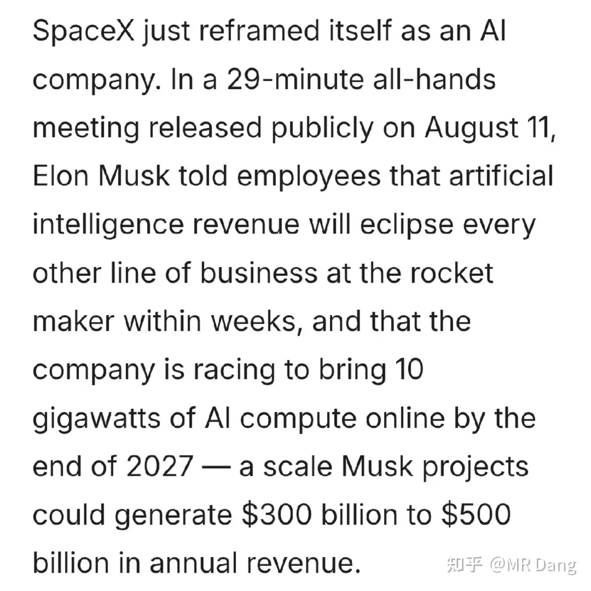

SpaceX 官方 X 账号 8 月 11 日发布的 29 分钟全员大会视频里，老马称 5 年内 SpaceX 市值里 99% 来自 AI。

额。。。。。。

---

### 段永平的[某娃娃公司](/stocks/09992.HK)仓位

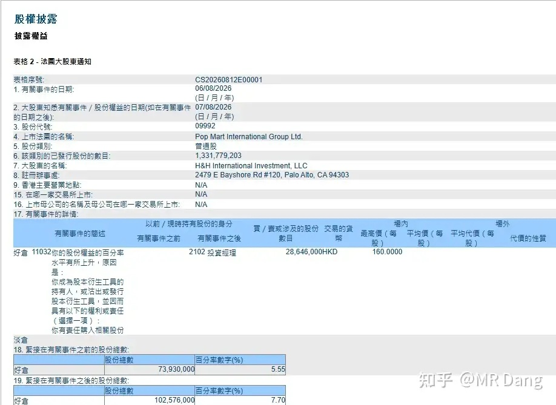

段持有[某娃娃公司](/stocks/09992.HK)的仓位又升上来了。

原因和之前仓位降下来的时候是一样的，也是期权被动行权造成的。

这 T 做的酣畅淋漓，还顺手拿了权利金。

目前这策略相当于吸取波动转化成自己的安全垫。

[这家公司](/stocks/09992.HK)的商业模式看着简单，实则复杂，在投资领域属于最难判断的类型之一，我个人看不出明显的发展路径。

---

### DeepSeek V4 Pro 正式版

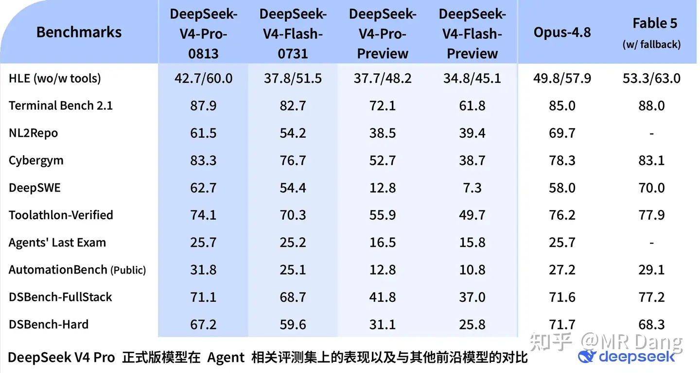

正式版进步巨大。

在终端操作，网络安全等实操任务上已追平甚至超越 Claude Opus-4.8，但在高难度知识推理和长程代码任务上与 Fable 5 仍有差距。

---

### 大宗商品

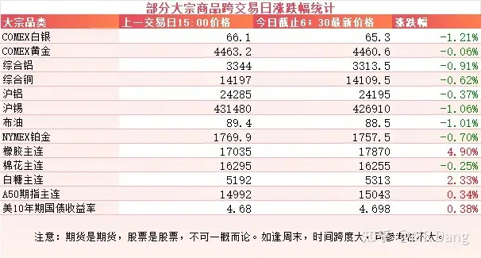

有色整体在昨日盘后有所回调，幅度不大。

原油也差不多。

农产品里橡胶和白糖是换合约了，所以看着涨了很多，其实是跌的。

### 外围市场

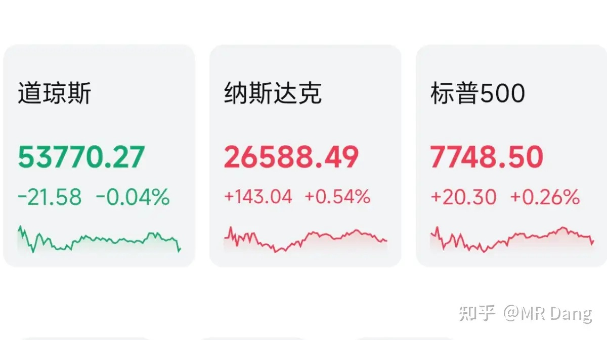

美三大股指涨跌不一，道指回调，纳指上涨。

行业上，半导体，存储，商业航天表现不错。

---

昨天个人组合净值回血小半个，银行绿大半个，资源红四个多，电网红一个多，消费绿近两个。

其实消费整个行业是不错的，只不过是我个人手里拿的这些不是那么传统的消费，所以显得有些拉胯了。

资源类挺好，也不知道为啥就突然好了。

事后可以找很多理由去合理化的解释涨跌，这也是财经博主的必修课，但是这一课，我学的不太好。

因为事实上大A的正常波动范围太大了——大到可以没有任何理由的波动十个点以上。

我知道这么说很多投资者会觉得没看点，既没有阴谋论，也没有精巧的金融博弈，就这？

是的，当你在这个市场待的越久就越会发现，真相就是这么朴实无华且枯燥乏味。

---

### 一个喜欢保护韭菜的博主，希望大家少少踩坑，多多赚钱！！！

> [!comment]- 点击展开评论
>
> | 用户 | 时间 | 内容 |
> | :--- | :--- | :--- |
> | 四岁 |  | 我的解释朴实无华，跌多了涨，涨多了跌[捂脸] |
> | &nbsp;&nbsp;&nbsp;&nbsp;MR Dang |  | [感谢] |
> | &nbsp;&nbsp;&nbsp;&nbsp;我走路带风 |  | 是的，不要管EGA的消息 |
> | Annie |  | 好像现在就只是简单一下每天的信息了 之前含金量很高的分析和指导几乎没了 |
> | &nbsp;&nbsp;&nbsp;&nbsp;啦啦啦 |  | 后边不续了 |
> | &nbsp;&nbsp;&nbsp;&nbsp;世界这么大 |  | 指导，一直都有吧。比如说原油期货（及其衍生品，lof这些）普通人不建议碰，这个很早就说了。这不，近段时间某博主就因为炒美原油亏了一大把，说再也不玩了。 |
> | &nbsp;&nbsp;&nbsp;&nbsp;SRMakise |  | 熊市瞎分析不好乘风起 |
> | 你说说你 |  | 哪里看dang的持仓啊 |
> | 明明明之 |  | 2014首次开启psl就让上亿人成为房奴，现在一看到这三个字母就心肝打颤 |
> | 眉清目秀的佐助 |  | 太魔幻了[捂脸] |
> | 网速有点慢 |  | 紫金要来了 |
> | 呷呷 |  | 分红率，波动率，含科率 |
> | 李政林 |  | 感谢分享 |
> | &nbsp;&nbsp;&nbsp;&nbsp;MR Dang |  | [感谢] |
> | 木子一 |  | [感谢] |
> | 有钱整个双眼皮 |  | 老师的电网和电力买的是啥呀[感谢] |

---

*本文件从 MR Dang 知乎页面转载*

**作者**: MR Dang  
**链接**: https://www.zhihu.com/question/2067634093093818544/answer/2071136516856887200  
**来源**: 知乎

*著作权归作者所有。商业转载请联系作者获得授权，非商业转载请注明出处。*

---

## 相关阅读

- [[20260812-大家对2026年8月12日A股市场行情都怎么看待？|上一篇：大家对2026年8月12日A股市场行情都怎么看待？]]
- [[20260814-大家对2026年8月14日A股市场行情都怎么看待？|下一篇：大家对2026年8月14日A股市场行情都怎么看待？]]
