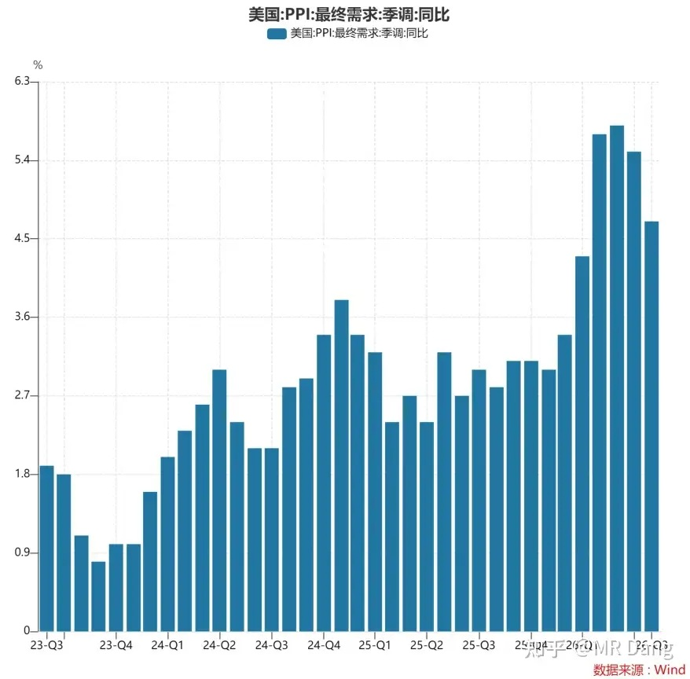
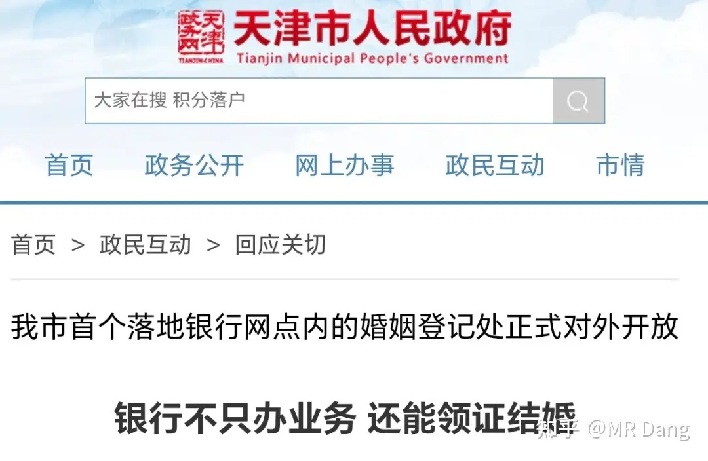
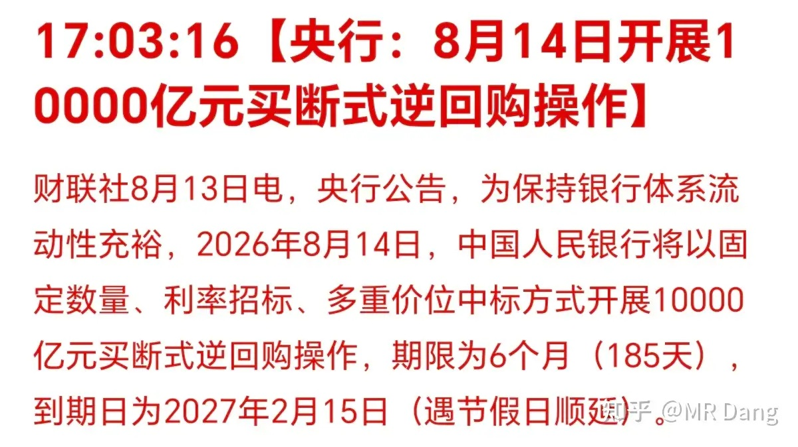
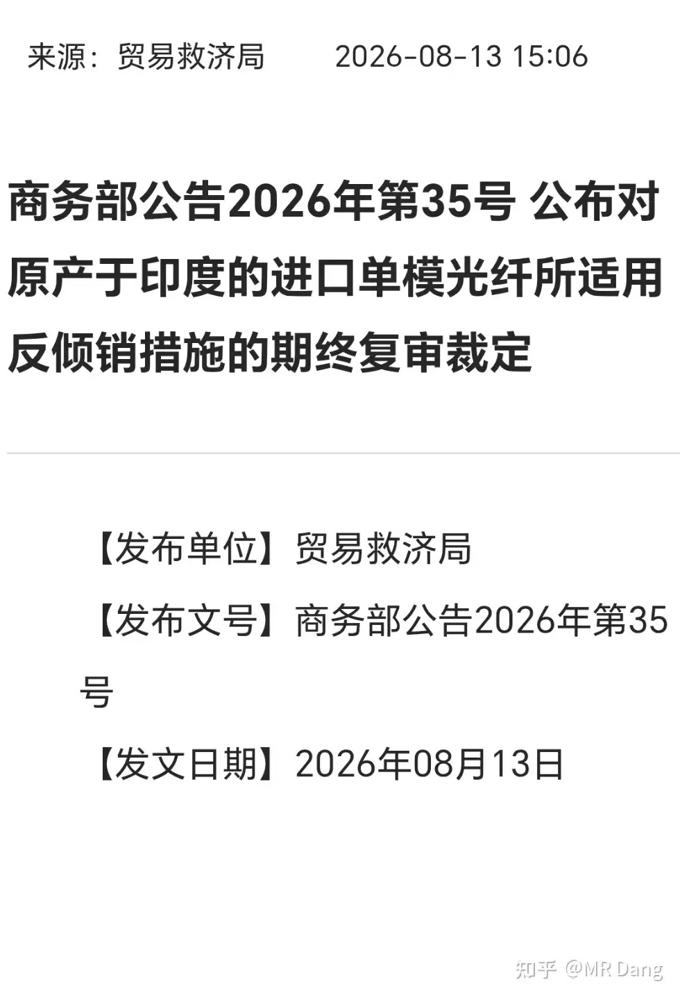
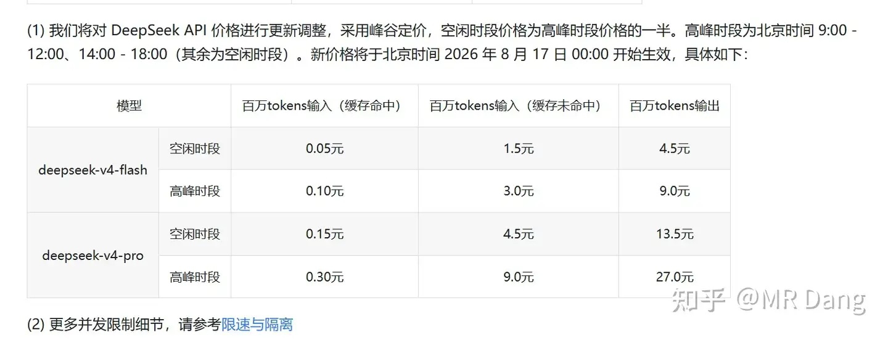
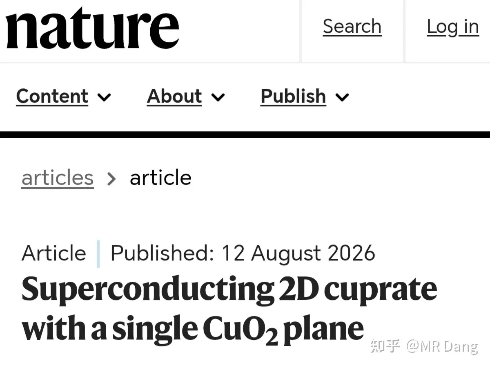
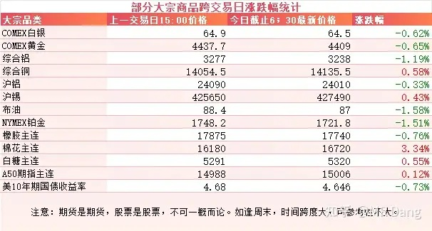
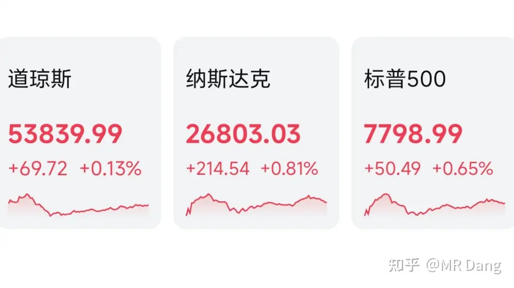

# 大家对2026年8月14日A股市场行情都怎么看待？

---

**发布时间**: 2026-08-14 07:30  |  **原文链接**: https://www.zhihu.com/question/2071164386849317295/answer/2071498868357910901  |  **点赞数**: 196 人赞同

**作者信息**: MR Dang | 证券从业资格证持证人

---

## 正文内容

> **要点速览**
>
> - 美国 7 月 PPI 同比为 4.7%，低于前值和预期，9 月加息概率由约 40% 降至约 35%。
> - 央行开展 1 万亿元买断式逆回购，但到期量相同，因此净投放为零。
> - 对印度进口单模光纤的反倾销措施属于自 2014 年起执行措施的延续，并非新的行业变量。
> - DeepSeek API 大幅调价并发布 Harness 开发者预览版，作者认为这利好算力板块。
> - 复旦团队实现单层 CuO₂ 平面的二维铜氧化物超导，为研究高温超导机制提供了更可控的环境。
> - A 股当日逾 4300 家下跌、市场中位数约跌 1.5%，作者选择等待更有吸引力的位置。

### 西大公布了 PPI 数据

7 月 PPI 同比增加 4.7%，前值 5.5%，预期 4.9%。

数据有点超预期，PPI 是 CPI 的前哨，对资本市场来说这是个好消息。

数据发布后，9月加息概率从40%左右又降低到了35%左右。

此前一直交易的年内最少加息一次的预期也有所改观。

---

### 银行领结婚证

权威信源报道了天津某银行不只办业务，还能领结婚证的新闻。

我看了下，和大家想象中的还不太一样。

不是银行开通了领结婚证的业务，而是把领结婚证的办公地点搬到了银行大厅里。

相当于银行只是提供个场所，业务上都是分开的。

银行这么做的原因其实挺好猜，一方面是现在业务都在线上办理了，线下客流少，闲置空间比较大，充分利用起来。

另一方面就是新结婚的夫妻都是银行优质客户，工资存起来，房贷扛起来，车贷背起来，保险买起来，未来前途一片光明。

当然新闻要连起来看，这个新闻和之前公布的结婚离婚数据放在一起解读的话，也能看出点别的意思来。

---

### 央行买断式逆回购

逆回购一万亿，刚好到期也是这个数，所以净投放是0。

之前还有隔夜逆回购的公告，早报里没提，反正大家以后只要看到隔夜两个字，自动过滤就行了，对资本市场影响不大，那是货币市场需要关注的事。

---

### 光纤反倾销

有关部门发布对印度光纤的反倾销文件。

可能很多站在光里的投资者看见这个新闻会比较兴奋。

但这是一个对此前执行了很久的措施的一个延续，从2014年已经开始执行，而不是什么新的变量。

印度的光纤厂商在成本上并没有优势，但是因为本土旺盛的需求，可以保持较高的国内售价，在国内赚了钱以后，以接近边际成本的价格往国外出口，这就是典型的倾销模式。

---

### DeepSeek 涨价

相比之前的定价，空闲时间段翻倍，高峰时间段涨了近四倍。

DeepSeek 现在处于一个游刃有余的商业生态位，降价可以抢市场，涨价可以要利润，可以根据需要自己去划斩杀线。

同日还发布了一个 DeepSeek Harness 开发者预览版，官方定位是可换模型的 Agent 工作台，对标 Claude Code，由一个全新成立的部门负责。

利好算力板块。

---

### 单层铜氧化物超导进展

复旦科研团队在《Nature》上发表了最新的科研成果，首次将铜氧化物的厚度从双层推进至真正的单层结构，实现了对铜氧化物超导属性的极限验证。

这里解释下超导的温度划分，零下233度以下的叫低温超导，作用机制明确，叫电声耦合。

零下233度以上的叫高温超导，作用机制不明确。

超导终极目标是室温超导，大概是27度左右。

铜氧化物的超导现象只发生在CuO₂二维平面内，所以这次的成果是很有意义的，相当于提供了一个纯净的验证高温超导作用机制的环境，变量更可控。

这种属于理论物理的突破，具体到实际应用上还有很久，但是在这么重要的领域咱们终于走到了前列，怎么看都是好事。

超导板块怎么说呢，每隔一段时间都会出个利好，然后套一批人，等下一次再出利好。

---

### 韩国央行买金

最近有报道称韩国央行重启买金，分两块进行，一块是实物黄金，一块是黄金 ETF。

韩国外汇储备里黄金占比只有1.1%，已经13年没买过黄金了。

上次买黄金的时候刚好是高点，买了就被套了，然后被国内的喷子喷破防了，就再也没买过。

---

### 大宗商品

有色跌多涨少，除了铜和锡，其他表现不佳。

原油本来跳水了，结果胡赛拿了个几万块的无人机把石化巨头的工厂袭击了，又反弹了一些。

农产品里的棉花也是换合约了，实际是跌的。

最大的好消息莫过于十年期国债收益率又回头了一些。

### 外围市场

美三大股指集体上涨，科技表现不错，软硬件都在涨，存储走强，闪迪给了一个相当好的指引。

---

昨天个人组合净值回撤一个多点，银行绿近半个点，资源绿四个，电网绿大半个，消费绿一个多。

体验比较差的一天，绿油油一片，

突然好起来的资源，又突然萎了。

如果之前编个理由强行解释为什么涨了，现在还得再编个理由解释为什么跌了。

实在解释不了的话，就只能拉出来一个什么主力，庄家之类的词糊弄过去了。

反正也没办法证伪不是？

市场表现也一般般，4300 多家绿色的，1100 多家红色的，大概是 82 开这么个比例，市场中位数是 -1.5% 左右。

所以的话，如果回撤了一个半点以内的，也不用太内耗自己，市场就这么个环境了。

现在的感觉，科技这边虽然跌了很多，依然对我个人没啥吸引力，200 倍 PE 就算腰斩再腰斩，依然还有 50 倍 PE 估值，对喜欢买老登的投资者来说还是贵。

老登虽然最近跌的让人不舒服，但是因为之前狠狠回了一口血，所以看着也没那么诱人。

静观其变吧，蹲一个更好的位置。

---

### 一个喜欢保护韭菜的博主，希望大家少少踩坑，多多赚钱！！！

> [!comment]- 点击展开评论
>
> | 用户 | 时间 | 内容 |
> | :--- | :--- | :--- |
> | 星星 |  | 早上好[感谢] 新结婚的夫妻都是银行优质客户，工资存起来，房贷扛起来，车贷背起来，保险买起来，未来前途一片光明。 |
> | &nbsp;&nbsp;&nbsp;&nbsp;MR Dang |  | [捂脸] |
> | 只想睡觉额 |  | 去年领的结婚证，那天新人只有几对，办理离婚的一堆人，气氛有点阴沉[doge] |
> | &nbsp;&nbsp;&nbsp;&nbsp;MR Dang |  | [捂脸] |
> | &nbsp;&nbsp;&nbsp;&nbsp;没心没肺的小废柴 |  | 现在都这样[感谢] |
> | &nbsp;&nbsp;&nbsp;&nbsp;尼尔雅童 |  | [捂脸]我前年领结婚证那会我都没注意到哪里是离婚的，我只记得那地儿空空如也，宣誓的地方灯没开，好像就我俩在办业务，阴森得很。。 |
> | jincsjin |  | 躺平，一动不动 |
> | &nbsp;&nbsp;&nbsp;&nbsp;MR Dang |  | [感谢] |
> | 痴茶姑娘 |  | 老师[感谢]电子布还能买吗 |
> | 知行 |  | 老师，有计划买美股么 |
> | 无枷JW |  | [哇][感谢] |
> | 吃我一记大拂尘 |  | 怪我周三进了有色，给买跌了[捂脸] |
> | 落渊 |  | 现在纸黄金适合买吗，虽然大佬说要买实物黄金[捂脸][捂脸] |
> | 金科 |  | 银行不应该是红的吗。。。 |
> | &nbsp;&nbsp;&nbsp;&nbsp;陌上愚翁 |  | 之前涨太多很多银行股息率都不到5了 |
> | 红.德仔 |  | [滑稽]白嫖打卡 |
> | &nbsp;&nbsp;&nbsp;&nbsp;MR Dang |  | [感谢] |

---

*本文件从 MR Dang 知乎页面转载*

**作者**: MR Dang  
**链接**: https://www.zhihu.com/question/2071164386849317295/answer/2071498868357910901  
**来源**: 知乎

*著作权归作者所有。商业转载请联系作者获得授权，非商业转载请注明出处。*

---

## 相关阅读

- [[20260813-如何看待 2026 年 8 月 13 日 A 股市场行情？跳空高开尾盘却突发跳水，发生了什么？|上一篇：如何看待 2026 年 8 月 13 日 A 股市场行情？跳空高开尾盘却突发跳水，发生了什么？]]
- [[20260817-如何看待2026年8月17日A股行情？|下一篇：如何看待2026年8月17日A股行情？]]
