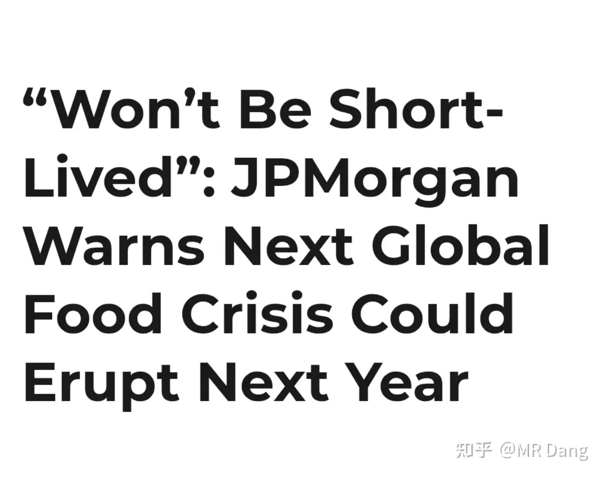
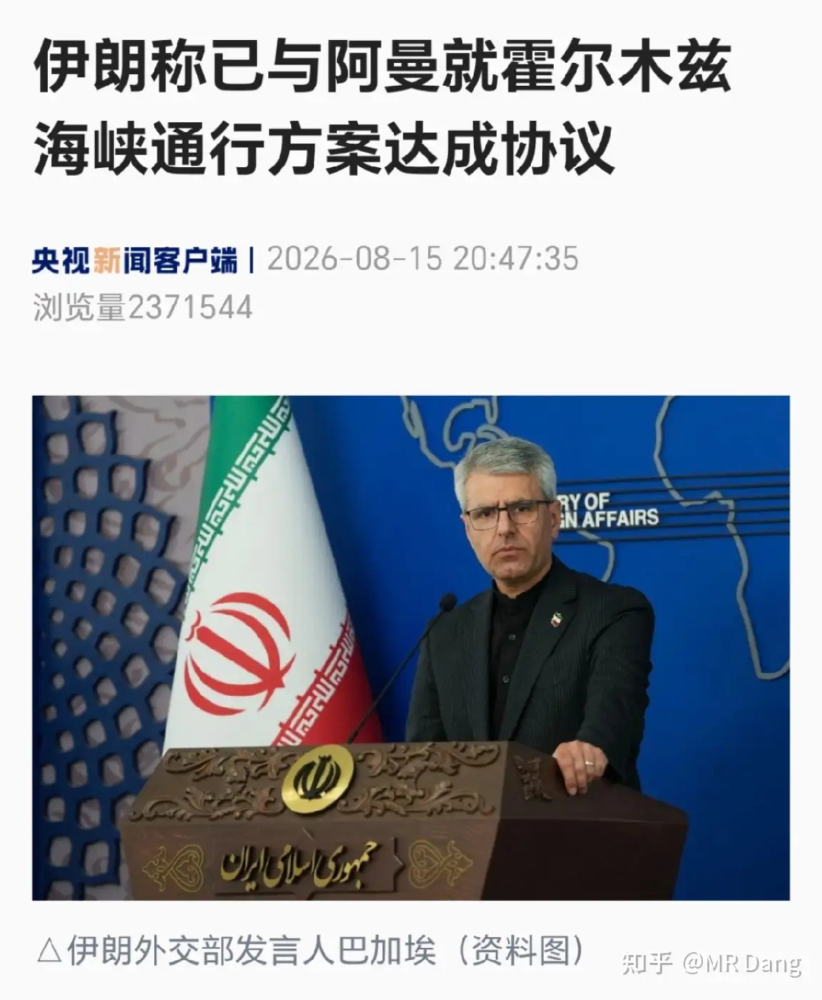
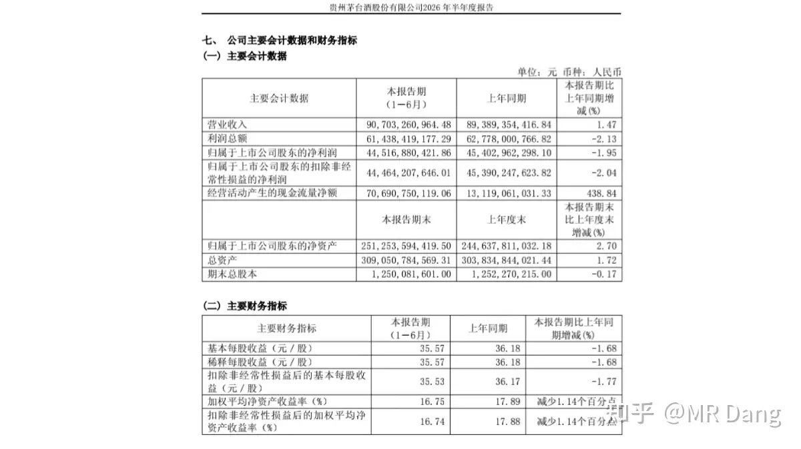
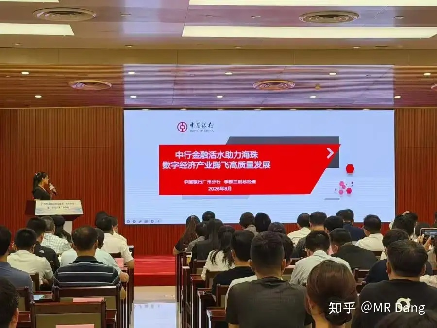
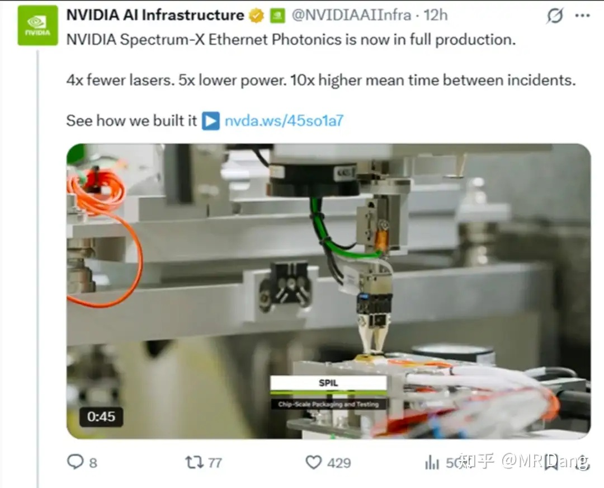
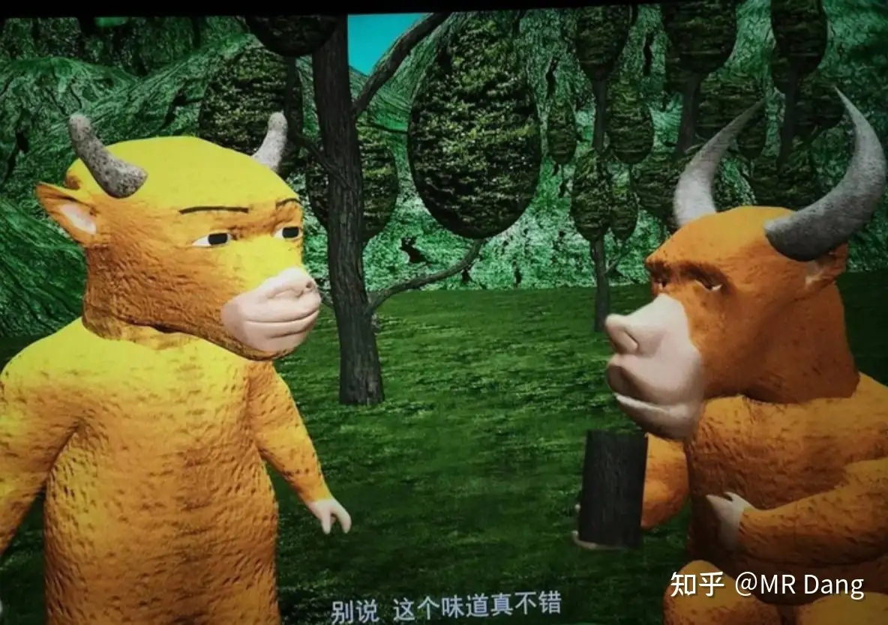
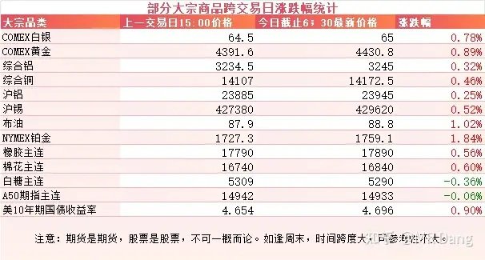
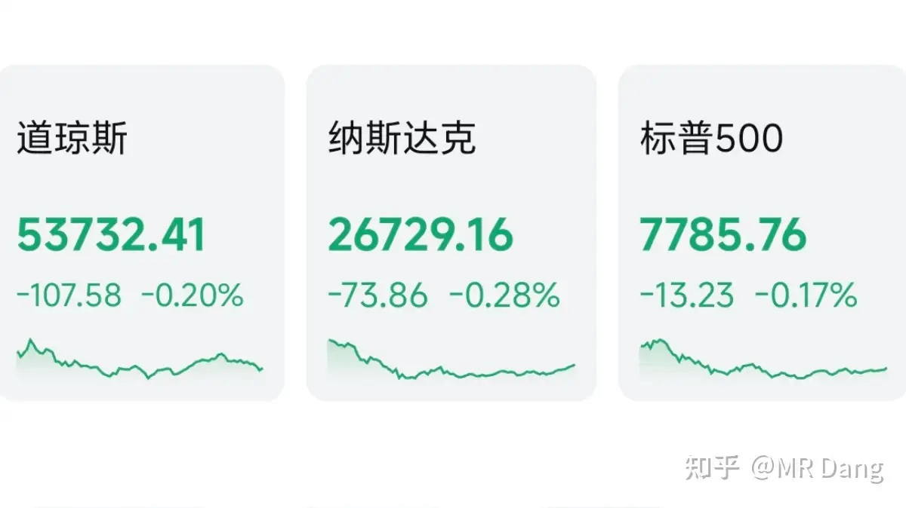
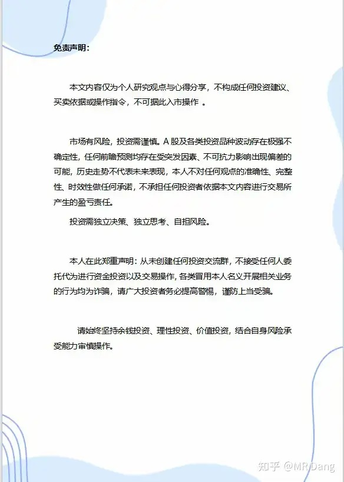

# 如何看待2026年8月17日A股行情？

---

**发布时间**: 2026-08-17 07:30  |  **原文链接**: https://www.zhihu.com/question/2071543275782198758/answer/2072586008663683595  |  **点赞数**: 212 人赞同

**作者信息**: MR Dang | 证券从业资格证持证人

---

## 正文内容

### 先把周末发生的事情简单的过一遍

小摩发了一篇研报，热度直接爆了，名字叫《粮食安全即国家安全：一场复合风暴》。

研报认为下一轮全球粮食危机正在酝酿，大概率于2027年上半年集中爆发。

全球食品CPI将因此额外上升约1.5个百分点，其中厄尔尼诺单独贡献约0.7个百分点，能源冲击使其效果翻倍。

研报认为东南亚和印度等地区受影响会比较大，包括化肥在内的物资价格会飞涨，咖啡，可可，白糖，小麦，水稻等作物的价格都会不同幅度的上涨，

同时研报认为东大是准备最为充分的国家，一直在囤积粮食、化肥、能源和工业金属，可能只会受到进口品种通胀的轻微影响。

至于为什么会发生粮食危机，研报提出了5w因素:战争（War），天气（Weather），仓储（Warehousing），水（Water），浪费（Waste）。

我个人的话，觉得研报的大体框架没问题，但是忽视了目前粮食的库存结构，可能还是有点夸张了。

至于投资的话，研报里提的方向主要是化肥，农作物。

但是要提醒一下，在东大，炒什么尿素，主粮，那就是碰高压线，不要以身试险，投资还是要讲觉悟的。

---

### 美伊局势

权威媒体报道了伊朗和阿曼已经达成协议的消息。

伊朗这边的事情，目前的状况可以总结为一句“协议归协议，海峡是海峡”，两边没有必然联系。

---

### 酱香科技

茅子发布了中报，直接把一众老登给惊出了一身汗。

二季度同比转负，连累整个上半年净利润都变成负增长了。

另外某些重要投资者也退出了十大股东。

以前有投资者说利润都被经销商赚走了，只要直销比例增加，就能释放利润。

现在直销比例确实上来了，价也提了，但是利润依然没太大起色，会让越来越多的投资者失去信心。

前一段时间某大佬不是有个对赌么，任何基金和茅子赌十年。

我当时琢磨着要是和我赌，我就等对赌开始计时后，等茅子回调一个点就梭哈茅子，必胜，哈哈。

---

### Token贷

广东省首个词元经济专项金融产品Token贷在广州海珠区发布。

算力Token贷按合同或者Token消耗核定额度，还能进一步扩大额度。

个人感觉还是噱头偏多，用不起Token的小企业可以用便宜点的，能用高价Token的应该不屑于贷款。

---

### 达子CPO交换机量产

英伟达的Spectrum-X以太网硅光交换机已进入全面量产阶段，实现了激光器数量减少4倍、功耗降低5倍、平均故障间隔时间提升10倍。

总之，就是很好很强大。

大A的某家光模块企业是参与了这个的，当然这里也没什么信息差，几乎都是明牌。

---

### 说个抽象的事

周末一部叫《牛来》的片子爆火了。

这里所谓的爆火也不过只是单日票房六百万，和那些商业大片比不了。

但是在2026年的今天，院线上还能看到画风如此朴素，甚至远不如ai随手做出来的电影，这件事本身激发观众强烈的猎奇心。

很多人都想去看看到底怎么个事，片子能有多烂。

最后就变成了这个行为艺术。

不过据一些看过的观众反应，画质虽然很烂，但是笑声不断，故事也没有很大的硬伤，因为预期打的太低太低，居然有点超预期。

这片子取名也有点意思，《牛来》对股民来说似乎还有其他的祝福在里面。

于是有些股民电影院都不进，单纯的买张电影票祈福，类似于去庙里上香。

这部片子是一对母子花了几年手搓出来的，以票房来说，他们已经成功了。

最魔幻的是大A一众牛字辈股票已经在周末蠢蠢欲动了。。。。。。这都什么脑回路。。。。。。只能说不理解但尊重了。

---

### 大宗商品

有色整体走强，工业金属和贵金属都有一些涨幅，铂的弹性比较大。

原油也有上涨。

美债收益率好长一段时间都没下来了。

### 外围市场

上个交易日美三大股指集体回调，纳指领跌，黄金和存储板块表现比较好。

---

上个交易日个人组合净值回撤半个点，银行绿大半个，资源绿半个，电网红一个多，消费绿大半个。

体验不太好，没吃到什么肉，净挨打了。

市场上2900多家公司是绿的，2400家红的，中位数也是微微绿了一些。

---

### 本周前瞻

1，今天公布统计局数据，房价，社零等。

2，周四公布西大初请失业金人数，美联储会议纪要。

周四公布咱们这边的LPR。

---

### 一个喜欢保护韭菜的博主，希望大家少少踩坑，多多赚钱！！！

> [!comment]- 点击展开评论
>
> | 用户 | 时间 | 内容 |
> | :--- | :--- | :--- |
> | Dr.长弓 |  | 各位股民别去看牛来，因为最后牛死了 |
> | &nbsp;&nbsp;&nbsp;&nbsp;MR Dang |  | [捂脸] |
> | 等 远航的你 |  | 老师这是第二次提醒粮食我们的高压 |
> | &nbsp;&nbsp;&nbsp;&nbsp;MR Dang |  | [感谢] |
> | 考拉的糖果 |  | 现在是一点倾向性的话都不说了啊[捂脸][捂脸][捂脸][捂脸] |
> | &nbsp;&nbsp;&nbsp;&nbsp;我去不早说 | 9 小时前 | 说些模棱两可的话才能继续继续维持人设啊，要是做出方向性的判断，被打脸了岂不是很尴尬[doge] |
> | KUZ |  | [感谢][感谢] |
> | 风来 |  | 大佬这么看好茅台吗？ |
> | 吴升斗 |  | 大a炒不了粮食的 |
> | 晨雾 |  | [感谢][感谢][感谢] |
> | 没什么不同 |  | [感谢] |
> | &nbsp;&nbsp;&nbsp;&nbsp;MR Dang |  | [感谢] |
> | 缥缈阿轩 |  | 烂银行现在大佬还是持有状态吗 |
> | 小卡拉米 |  | [感谢][感谢]我也要。 |
> | &nbsp;&nbsp;&nbsp;&nbsp;MR Dang |  | [感谢] |

---

*本文件从 MR Dang 知乎页面转载*

**作者**: MR Dang  
**链接**: https://www.zhihu.com/question/2071543275782198758/answer/2072586008663683595  
**来源**: 知乎

*著作权归作者所有。商业转载请联系作者获得授权，非商业转载请注明出处。*

---

## 相关阅读

- [[20260814-大家对2026年8月14日A股市场行情都怎么看待？|上一篇：大家对2026年8月14日A股市场行情都怎么看待？]]
- [[20260818-如何看待2026年8月18日A股市场行情？|下一篇：如何看待2026年8月18日A股市场行情？]]
