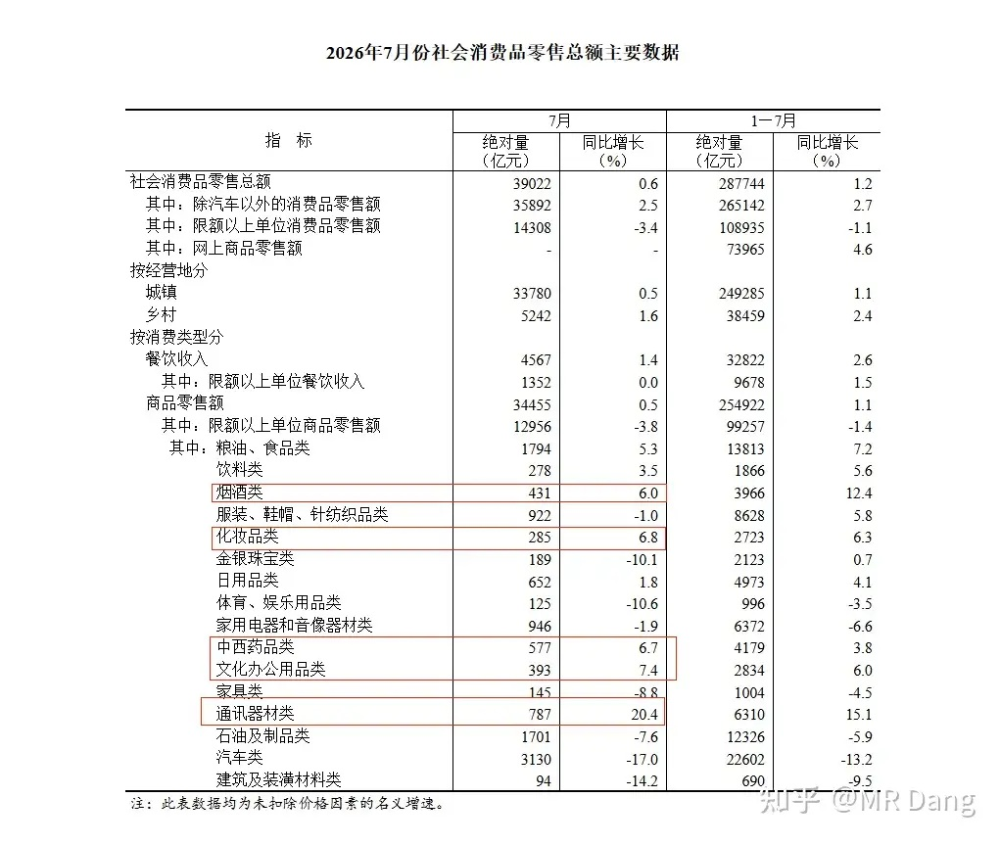
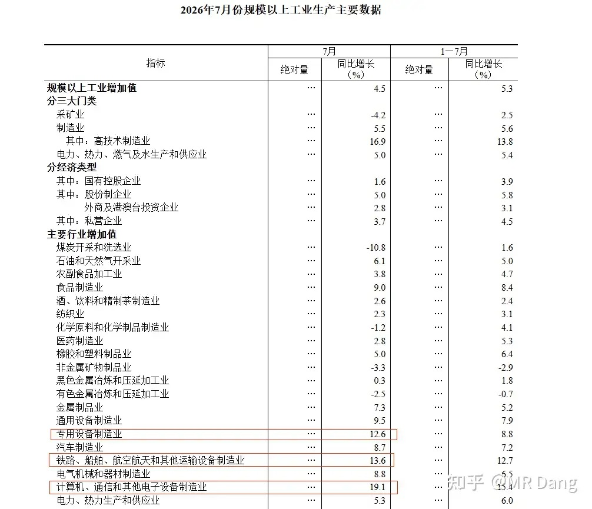
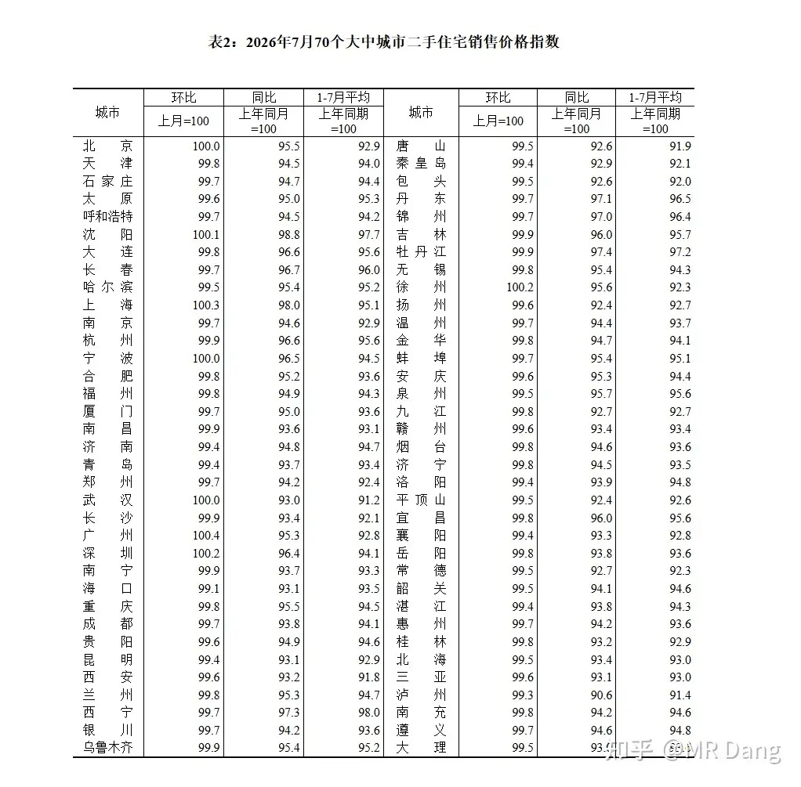
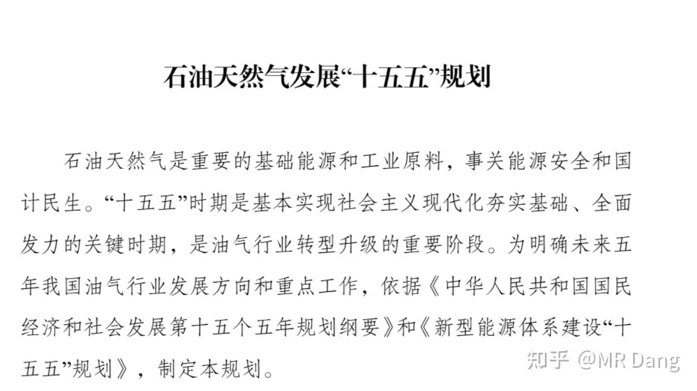
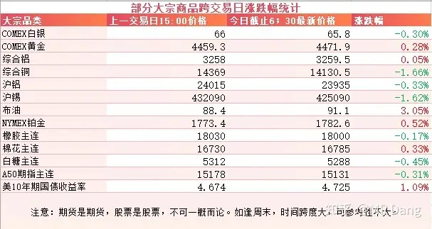
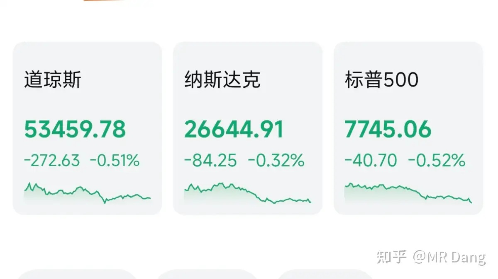

# 如何看待2026年8月18日A股市场行情？

---

**发布时间**: 2026-08-18 07:30  |  **原文链接**: https://www.zhihu.com/question/2068718066091954444/answer/2072948396311237662  |  **点赞数**: 214 人赞同

**作者信息**: MR Dang | 证券从业资格证持证人

---

## 正文内容

> **要点速览**
>
> - 7 月社零同比增长 0.6%、规模以上工业增加值同比增长 4.5%，70 个城市中二手住宅价格环比上涨的有 8 个；结合社融数据，作者概括当前经济为“供强需弱”。
> - 作者认为数据不宜简单解读为利空，需求偏弱可能推动更多财政刺激与超预期组合拳出台。
> - 油气“十五五”规划提出 CCS/CCUS 年注入二氧化碳达 1000 万吨、保持适度富余炼化产能，并新增管网两万公里。
> - 隔夜铜、锡回调，原油重回 90 美元上方，橡胶站上一万八，美债收益率高企；美股三大股指集体回调。
> - A 股普涨、个人组合净值回升后，作者计划逐步降低科技仓位、回避高估值方向，继续等待半年报全部披露后再看老登板块，并耐心等待安全边际。

统计局数据在昨天收盘后公布了，一起过一遍：

### 首先出场：社零数据

整体数据稍微有点偏弱，0.6%的同比增速说不上亮眼，同环比增速都一般。

增速超过 6% 的行业有烟酒、化妆品、药品、办公用品、通讯器材。

这五个里面，7月同比增速比前6个月表现更好的是除了烟酒的另外四个。

通讯器材已经反反复复说了，是存储成本推动的。

药品表现一直不错。

汽车的数据稍微难看了些，还有装修行业也是。

### 接着是工业增加值

相对其他几个数据，工业增加值算的上相对更好的那个。

7月同比增加4.5%，有所放缓。

增速超过 10% 的行业有专用设备、运输设备、电子设备。

这三个行业的环比数据也不错。

### 二手住宅价格指数

70个城市里，环比破百，也就是相对上个月上涨的城市有8个。

可能有些读者忘记的比较快，回忆一下数据：

3月有17个，4月有16个，5月有13个，6月有10个。

另外还有固投和一些行业的投资数据也公布了，也不是特别理想。

此前周末央行还公布了社融数据，其中新增贷款是负的3400多亿，住户端的长短期贷款都在减少。

把这些数据全部放在一起，就勾勒出了目前大的经济形势是**供强需弱**。

消费端是这样，货币端也是这样。

想要扭转这样的趋势，就需要更多的财政方面的刺激。

所以，数据不宜解读成利空，因为目前的大方向是确定的，目标也是大概率可以实现的。

时间还剩下5个月不到，越有挑战性就越有可能出超预期的组合拳，未来可期啊，Bro。

---

### 石油“十五五”规划

文件看原文，任何转述都会造成信息的缺失。

我个人的话，有这么两三点觉得超出我个人预期：

1. **CCS 和 CCUS**

原文是“二氧化碳捕集与封存/二氧化碳捕集利用与封存（CCS/CCUS）年注入二氧化碳达 1000 万吨。”

目前的情况是500多万吨左右，这五年规划直接到一千万吨，增长空间很大。

这个方向弹性最大的就是碳捕集设备，这也是个小众行业。

2. **保持适度富余炼油和石化产能，加大石油安全的产业垫层**

这个表述很新，首次提出了富余炼化产能。

新在哪里呢？

炼化产能的政策方向一直是严控增量，产能置换，也就是所谓的减量置换。

这次提出富余炼化产能就很有意思，是在减量置换的基础上，再做一个加法，既要减，还要保持富余产能。

其他提到的还有新增管网两万公里，对应的是钢管和油服行业。

---

### 大宗商品

有色整体涨跌互现，铜和锡回调超过一个点。

原油涨幅较大，重回90美元上方。

农产品里橡胶又站上了一万八。

美十年期国债收益率迟迟下不来，这是一大隐忧。

### 外围市场

美三大股指集体回调。

行业上存储、半导体、黄金、商业航天都表现不错。

---

昨天个人组合净值回血半个多点，银行微绿，资源红两个，电网红两个半，消费微红。

挺舒服的普涨行情，科技涨了不少，吃大肉，老登也没太惨，喝口汤。

《牛来》之所以能破圈成功，证券投资者是出了大力的。

昨天票房又创新高，单日八百多万，总预测票房都提升到了一个多亿。

正是因为人心思涨，所以才会有这么高的话题度，最后映射到资本市场上就形成了牛来的自我实现。

现在指数马上要破整数关了，我个人打算把比例逐渐调整，科技最近涨的太多了，有点心虚。

[存储](/stocks/688825.SH)之类的，估值比较高了，还有产业链上游的 PSM 什么的，估值也不便宜了。

我对科技的态度就是，认知能变现就变现，不嫌少，但是要尽量避免踩坑，贵的坚决回避，宁可错过，不要做错。

至于老登，依然不是很诱人，继续等半年报全部出来再看。

安全边际是蹲出来的，现在这个位置就更不着急了。

越开心越要警惕，越沮丧越要坚定。

---

### 一个喜欢保护韭菜的博主，希望大家少少踩坑，多多赚钱！！！

> [!comment]- 点击展开评论
>
> | 用户 | 时间 | 内容 |
> | :--- | :--- | :--- |
> | 法家君子 |  | 默默支持[机智] |
> | &nbsp;&nbsp;&nbsp;&nbsp;MR Dang |  | [感谢] |
> | 晨雾 |  | [感谢][感谢][感谢] |
> | &nbsp;&nbsp;&nbsp;&nbsp;MR Dang |  | [感谢] |
> | 狄仁杰 |  | [感谢][感谢] |
> | &nbsp;&nbsp;&nbsp;&nbsp;MR Dang |  | [感谢] |
> | 没什么不同 |  | [感谢] |
> | &nbsp;&nbsp;&nbsp;&nbsp;MR Dang |  | [感谢] |
> | 珍惜未来 |  | 未来可期[赞同] |
> | &nbsp;&nbsp;&nbsp;&nbsp;MR Dang |  | [感谢] |
> | 18一枝花 |  | [感谢] |
> | &nbsp;&nbsp;&nbsp;&nbsp;MR Dang |  | [感谢] |
> | 没有用户名 |  | 今天是挨打还是挨打还是挨打？ |
> | 如来熊掌 |  | [感谢] |
> | &nbsp;&nbsp;&nbsp;&nbsp;MR Dang |  | [感谢] |
> | 北齐云散人 |  | 昨天看大佬的帖子，入手了北大荒[感谢] |
> | &nbsp;&nbsp;&nbsp;&nbsp;不能说得秘密 |  | 不是红线吗[吃瓜] 短线吃个肉呗 |
> | 么么兽 |  | [感谢]早！ |
> | &nbsp;&nbsp;&nbsp;&nbsp;MR Dang |  | [感谢] |

---

*本文件从 MR Dang 知乎页面转载*

**作者**: MR Dang  
**链接**: https://www.zhihu.com/question/2068718066091954444/answer/2072948396311237662  
**来源**: 知乎

*著作权归作者所有。商业转载请联系作者获得授权，非商业转载请注明出处。*

---

## 相关阅读

- [[20260817-如何看待2026年8月17日A股行情？|上一篇：如何看待2026年8月17日A股行情？]]
- [[20260819-如何看待2026年8月19日A股市场行情？|下一篇：如何看待2026年8月19日A股市场行情？]]
