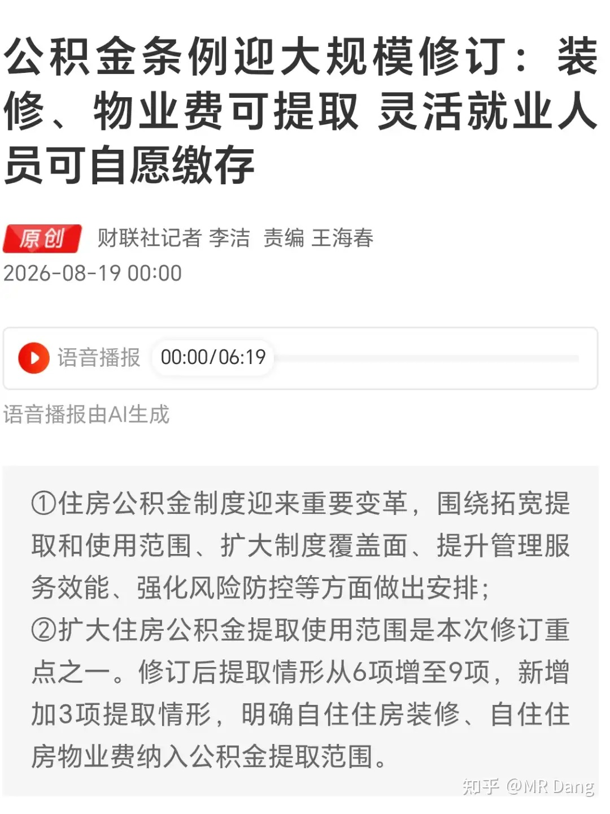
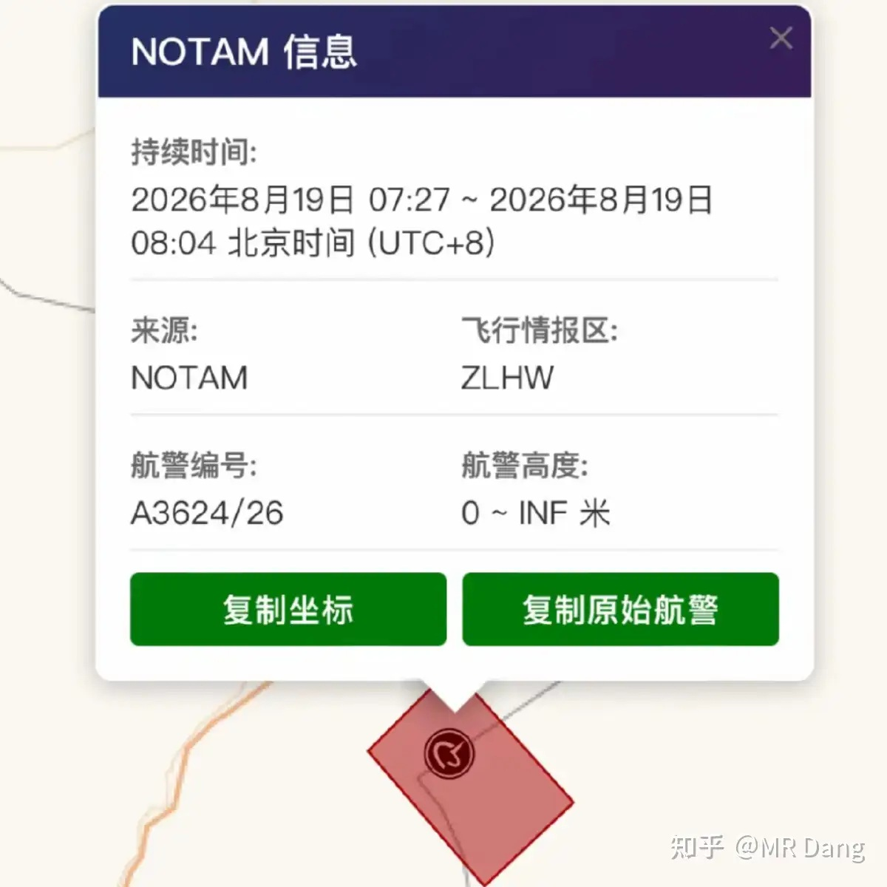
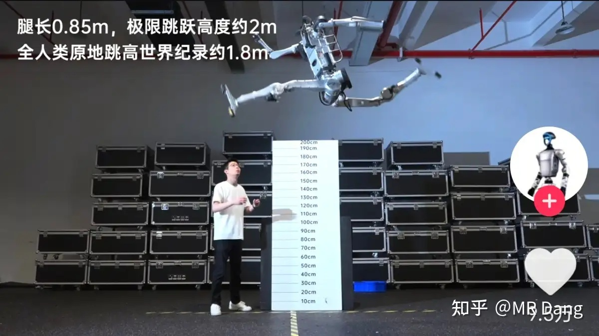
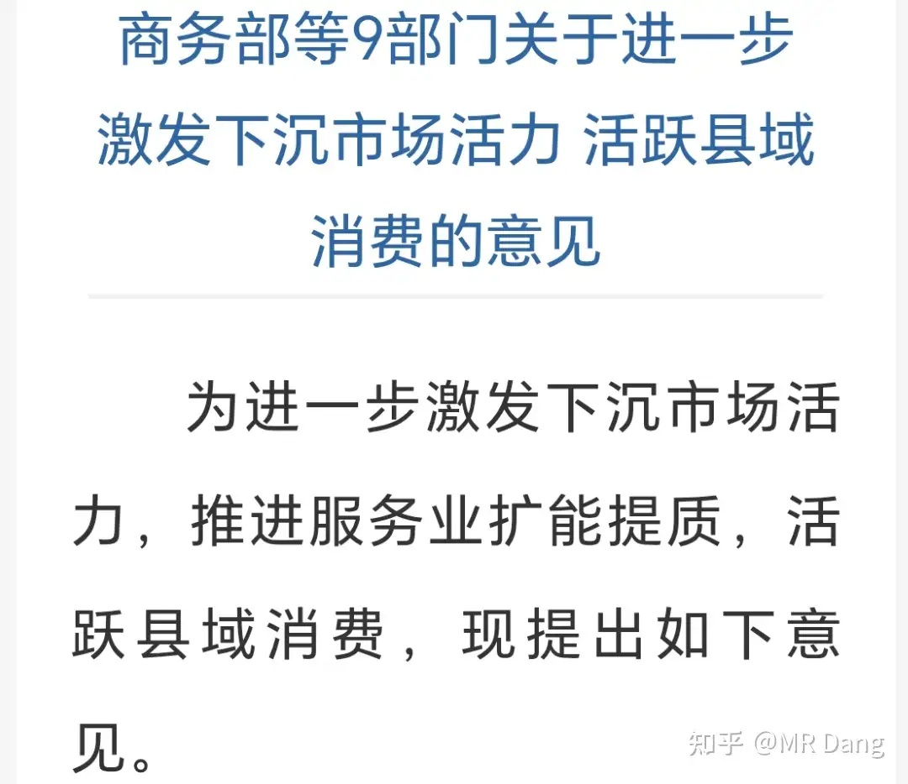
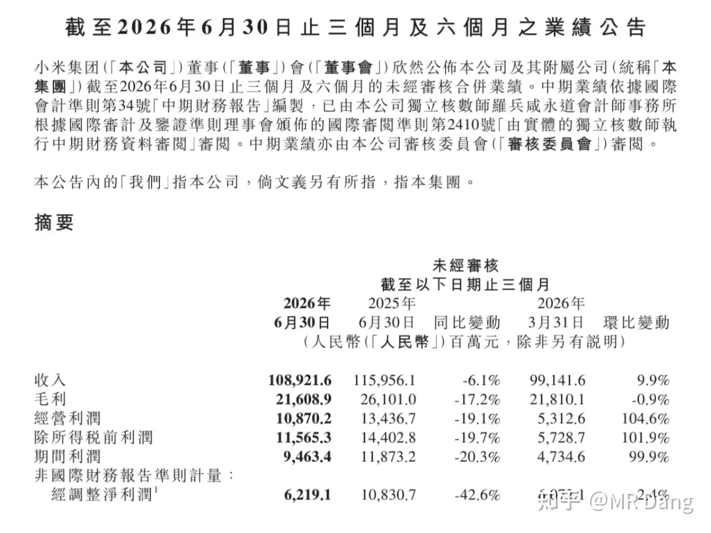
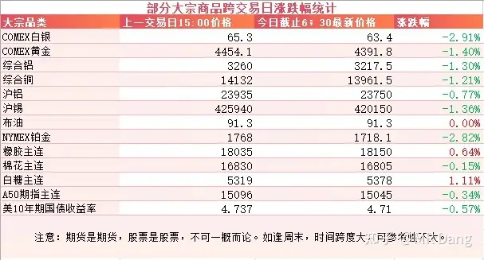
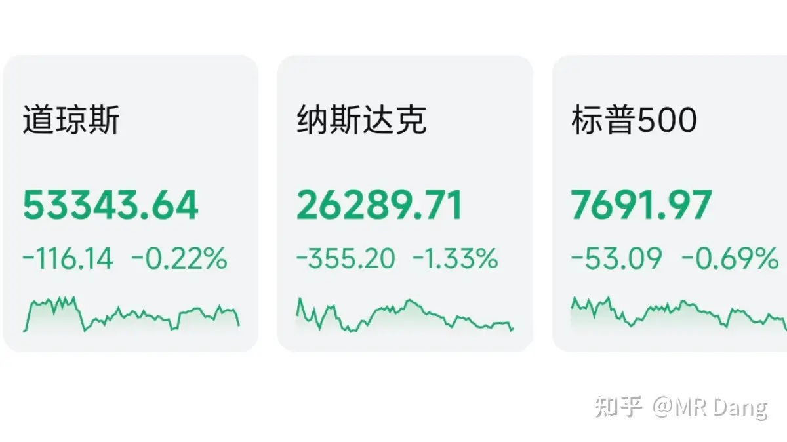

# 如何看待2026年8月19日A股市场行情？

---

**发布时间**: 2026-08-19 07:31  |  **原文链接**: https://www.zhihu.com/question/2069093631051437232/answer/2073311002897208017  |  **点赞数**: 198 人赞同

**作者信息**: MR Dang | 证券从业资格证持证人

---

## 正文内容

> **要点速览**
>
> - 公积金新规取消租房提取的收入比例门槛，并调整装修提取上限表述，物业费提取也被纳入适用范围。
> - Pro Farmer 首日巡查显示南达科他州和俄亥俄州的玉米、大豆受高温或洪水影响；印度同时传出考虑取消 100% 白糖关税的消息。
> - 酒泉当天可能执行朱雀三号遥二发射任务，宇树则发布运动特化型“超人”机器人，商业航天与机器人均有新进展。
> - 县域消费文件涉及土地、金融、审批及消费贷财政贴息，但作者认为消费的核心仍是需求和收入预期。
> - 小米半年报经营利润 108 亿，但公允价值变动和其他收入贡献较多，手机毛利率下滑、汽车下半年交付压力仍在。
> - 市场跌多涨少，作者提示农业板块追高风险，并认为在估值不低、美债收益率高企的背景下，当前风险大于机会。

### 公积金新变化

之前出过意见稿，昨天正式版出炉了。

和意见稿相比，最超预期的地方是租房提取彻底取消“房租超出家庭工资收入规定比例”门槛，租房提取门槛大幅降低。

同时装修提取删除“不超过一定额度”上限表述。

其他的比如交物业费也可以提取公积金，在意见稿里也有提及，不算超预期。

---

### 西大农作物减产

Pro Farmer 是西大一家主营农作物统计的媒体。

在最近的巡查统计中，该机构证实西大的玉米和大豆单产双双减产，其中南达科他州受高温影响，大豆结荚数降低20%，玉米单产降低14%。

俄亥俄州受洪水影响，大豆结荚数降低7%，玉米单产降低3%。

这个统计一共要持续四天，四天后给出全国的数据，以上只是第一天的数据。

---

### 印度考虑取消白糖关税

有外媒报道印度考虑取消100%的白糖关税以遏制创新高的糖价。

---

### 商业航天

根据 NOTAM 消息，今天七点半左右，在酒泉会有一次航天发射活动，可能会有直播看。

根据公开信息，极大概率是蓝箭航天的朱雀三号遥二。

遥一是去年十二月发射的，成功入轨，但回收失利。

遥二原计划8月11日发射，可惜当天窗口关闭前未能点火，任务推迟。

遥二相对于遥一，不止于入轨验证，上面可能还会有载荷。

今天的点火窗口有37分钟，希望一切顺利吧，有专业人士认为回收成功概率大概有七八十个点。

---

### 机器人

宇树今天上市，恰好前两天又发布了一台名叫超人的机器人。

原地垂直跳高大约两米，跑步最高速度 12.66 米/秒，两个数据都超越了人类的极限，所以叫超人。

为了提高运动性能，这台机器人有胳膊但是没有手，有身体但是没有头，属于运动特化型机器人。

数据挺夸张的，想象一块跑的比博尔特还快的铁疙瘩冲你跑过来，两米的围栏一跃而起，就算全身没有任何武装，也挺有压迫感的。

---

### 县域经济文件

这个消息市场已经消化了。但是我大概看了下，很多举措确实挺超预期的，比如土地、金融、审批这些方面。

金融里提出了消费贷财政贴息，这个对银行算是小利好。

消费的问题，就像我昨天早报说的，目前主要是需求的问题，是收入预期的问题，所以单纯的供给侧的手段是很难有立竿见影的效果的。

---

### 公告速递

[某手机造车厂商](/stocks/01810.HK)发布了半年报。

最大的亮点是经营利润108亿，大超预期。

不过这里主要是公允价值变动和其他收入（以补贴为主）贡献的。

剔除掉这两个的话，经营压力还是挺大的，手机毛利率从11.5%降低到8.5%，存储涨价不单让手机价格提升，降低了出货量，还把盈利水平拉下来了。

汽车定了55万辆的目标，上半年完成18.5万，给下半年留的交付压力就相对大一些。

整体来说，只看财报数字的话，有公允价值变动的加持，还是超预期的，如果看实际经营情况，还是相对一般的。

话说，低端手机和电车是两个我一直回避的行业，[这家企业](/stocks/01810.HK)占全了，但是数据还没有太难看，已经很强了。

---

### 大宗商品

美债收益率高悬，有色集体跳水。

贵金属跌的比较多，大概两三个点，工业金属稍微少一些，大概一个多点。

农产品表现比较强势。

### 外围市场

美三大股指回调，纳指领跌。

科技板块回调，存储崩了个大的，半导体也不太行。

---

昨天个人组合净值纳米绿，银行原地不动，消费红半个点，电网绿半个点，资源微绿。

市场绿多红少，大概3200多家绿色的，2100多家红色的，中位数也是下跌的。

看各大平台的热点，农业这方面热度比较高，各种二三十厘米的涨幅吸引了不少目光。

我算是全网跟进那篇粮食危机研报比较早的博主，我个人觉得事到如今反而需要冷静冷静了。

主粮和尿素的高压线坚决不碰，这两个就不提了。

但是像种业这种行业，其实很多业绩也很一般。

如果反应得快，提前埋伏进去了，那算意外之财。

如果没有提前埋伏，现在看见涨幅比较大，然后眼红了，心痒了，想参与了，那得好好掂量掂量风险了，很容易挂树上的。

农业这个板块是财务造假重灾区，这么多年了也没走出特别像样的可以持续发展的大型企业。

整体市场的话，现在这个位置不算便宜，叠加美债高悬，其他国家债券收益率飙升，在风险和机会当中选择的话，我个人觉得风险更大。

我自己个人的科技含量也已经按计划降低了。

---

### 一个喜欢保护韭菜的博主，希望大家少少踩坑，多多赚钱！！！

> [!comment]- 点击展开评论
>
> | 用户 | 时间 | 内容 |
> | :--- | :--- | :--- |
> | 长久 | 23 分钟前 | [感谢] |
> | 考拉的糖果 | 4 小时前 | 这大肉签有谁中的没有，说出来让我嫉妒一下 |
> | 红.德仔 | 9 小时前 | [滑稽] |
> | &nbsp;&nbsp;&nbsp;&nbsp;MR Dang | 9 小时前 | [感谢] |
> | 浪里小白马 | 10 小时前 | [感谢][感谢] |
> | &nbsp;&nbsp;&nbsp;&nbsp;MR Dang | 10 小时前 | [感谢] |
> | 知乎用户nAF89 | 9 小时前 | [感谢][感谢][感谢] |
> | &nbsp;&nbsp;&nbsp;&nbsp;MR Dang | 9 小时前 | [感谢] |
> | 朝来寒雨夜来风 | 6 小时前 | 公积金能直接提到证券账户就好了 |
> | &nbsp;&nbsp;&nbsp;&nbsp;王二小 | 2 小时前 | 说不定很快就可以了[飙泪笑] |
> | lion | 10 小时前 | [感谢] |
> | &nbsp;&nbsp;&nbsp;&nbsp;MR Dang | 10 小时前 | [感谢] |
> | 尾辣样嘛 | 5 小时前 | 感觉我全身反向操作，昨天加仓了消费电子和粮食[捂脸] |
> | 木子一 | 9 小时前 | [感谢] |
> | &nbsp;&nbsp;&nbsp;&nbsp;MR Dang | 9 小时前 | [感谢] |
> | 随风 | 4 小时前 | 支持 |

---

*本文件从 MR Dang 知乎页面转载*

**作者**: MR Dang  
**链接**: https://www.zhihu.com/question/2069093631051437232/answer/2073311002897208017  
**来源**: 知乎

*著作权归作者所有。商业转载请联系作者获得授权，非商业转载请注明出处。*

---

## 相关阅读

- [[20260818-如何看待2026年8月18日A股市场行情？|上一篇：如何看待2026年8月18日A股市场行情？]]
- [[20260820-大家对2026年8月20日A股市场行情都怎么看待？|下一篇：大家对2026年8月20日A股市场行情都怎么看待？]]
