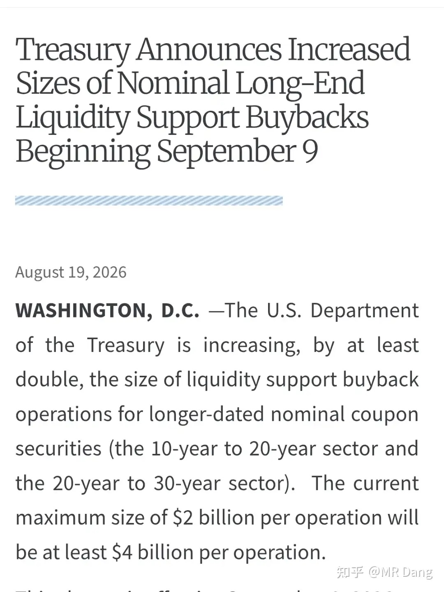
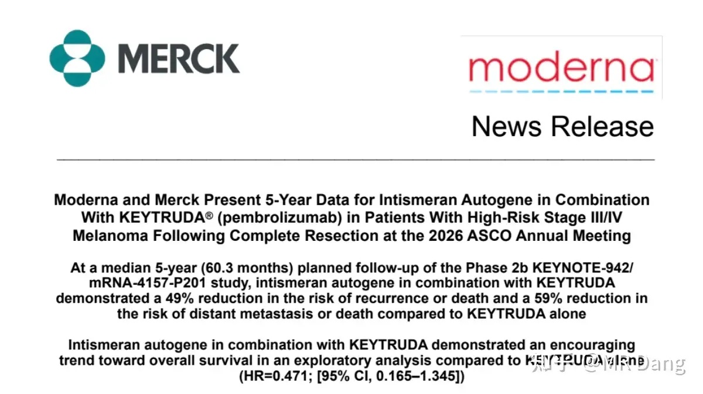
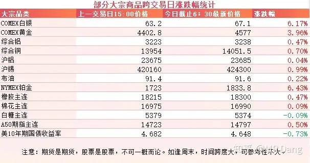
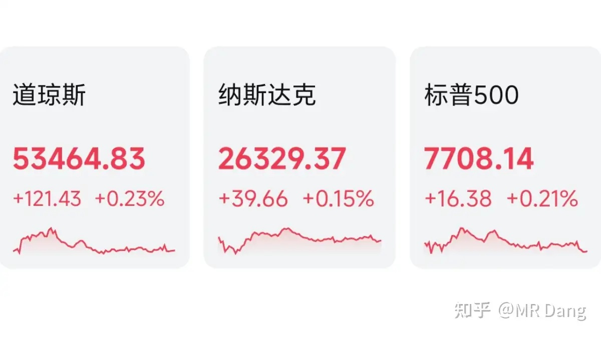

# 大家对2026年8月20日A股市场行情都怎么看待？

---

**发布时间**: 2026-08-20 07:30  |  **原文链接**: https://www.zhihu.com/question/2073329446325575726/answer/2073673175204882431  |  **点赞数**: 256 人赞同

**作者信息**: MR Dang | 证券从业资格证持证人

---

## 正文内容

> **要点速览**
>
> - 美国财政部计划至少翻倍提高长期名义息票国债的流动性支持回购规模，美债收益率随之下降，贵金属反弹。
> - 短债收益率主要反映资金松紧；长债收益率则通过未来现金流折现影响科技股估值，并可能对应复苏、通胀或供给压力三类交易逻辑。
> - Moderna 与默沙东公布个性化 mRNA 癌症疫苗联合 Keytruda 的长期随访数据，展示了 mRNA 平台向癌症治疗延伸的潜力。
> - 隔夜贵金属领涨大宗商品，美股三大指数收红，有色与生物医药相对强势。
> - 前一交易日 A 股约 400 家上涨、中位数跌近 4%，作者的个人组合净值回撤约 1 个点，并提醒投资者减少自我内耗。

### 美债回购

西大财政部计划将长期名义息票国债的流动性支持回购操作规模至少提高一倍，从每次操作最多 20 亿美元提升至至少 40 亿美元。

受此影响，美债收益率下降，贵金属反弹。

最近债市扰动，很多新手对这里的门道还不清楚。

债券说白了，给你的钱是固定的，比如每年五块钱。

当预期不好的时候，担心未来通胀更高，手里这点固定利息跑不赢，这时候债券价格就会下跌，比如从 100 跌到 95。

债券收益率反而上涨，从 5% 提高到 5.26%，类似于股价下跌导致股息率提高。

债券又分两种，一种是长债，一种是短债。

短债对资本市场的影响是最直接的，跷跷板效应比较明显。

短债收益率低说明资金面宽松，那么就会有更多的钱去买股票，资本市场表现就好。

但是有一种例外，就是岛国那种经济衰退引起的，企业赚钱预期不好，大家都躲在债市里不出来，资本市场会受影响。

长债就复杂多了，长债的本质是“未来的钱在现在值多少”。

那像科技股，现在不怎么挣钱，挣的大部分都是未来的钱。

长债收益率上升意味着未来的钱在现在不值钱了，也就是说科技股画的饼，还没吃到嘴里就已经贬值了，所以长债收益率飙升会压制科技股估值。

那长债收益率上涨对其他板块又有什么影响呢？

这得分清楚原因，主要有三种情况。

一种情况叫复苏交易，也就是说大家预期经济非常猛，企业能赚很多钱，所以未来的钱才不值钱了，所以长债收益率才飙升。

这种情况下对周期股是利好，说明经济大周期要来了。

第二种情况叫通胀失控，那就是利空了，会引起股债双杀，甚至股债汇三杀。

还有第三种情况，叫债券供给压力。

发债太多没人接，长端利率自己就往上冲，短端却不动。

这时候光杀股票估值，经济没起色，是最难受的一种情况。

这三种情况也不是三选一，有时候会混合在一起，很难区分。

以上说的都是西大。

至于东大的话，债市还是挺稳的，长端和短端收益率都比较低，所以相对来说红利更香一些。

---

### mRNA 癌症疫苗

Moderna 与默沙东联合宣布：个性化 mRNA 癌症疫苗 intismeran autogene 联合 Keytruda，在 III 期临床试验中达到主要终点和关键次要终点。

这是全球**首个**在 III 期试验中获得成功的 mRNA 癌症疫苗，标志着 mRNA 技术从传染病预防正式跨入癌症治疗领域。

很多人看到疫苗两个字，会认为这是预防用的。

但实际上它是用来治疗的，要在病人完成手术后，在取下来的肿瘤里取样，识别新抗原，定制 mRNA 疫苗，然后再打回到病人体内，免疫激活，教会免疫系统识别癌细胞，防止复发。

虽然它只针对黑色素瘤皮肤癌，只占皮肤癌总数的 1%。

但是，这也是人类挑战癌症走出的一大步。

至于投资的话，它证明了 mRNA 平台的无限可能。

学过高中生物的都知道，mRNA 可以控制蛋白质的表达，从而发挥各种神奇的功效。

利好的话，大 A 没有直接标的，但是会让投资者对 mRNA 这个赛道高看一眼。

这个赛道的三大技术壁垒是 LNP 递送系统、加帽和修饰。

mRNA 肿瘤疫苗又分个性化和现货型，Moderna 的是个性化的，国内有五六家企业有布局，上市的有三家。

还有一种是现货型的，国内有两三家企业有布局，都上市了。

咦？你问我怎么懂这个？

说来话长了，这赛道我在口罩事件前很多年就在投了。。。那个时候国内这块儿基本还是空白，和业内人士做投研的时候深入了解过。

---

### 大宗商品

受美债走弱的影响，贵金属走强，白银铂金涨了 6 个多点，黄金涨了近四个点，其他工业金属也一并走强。

A50 期指似乎预示这个周四颜色不一样。

### 外围市场

美三大股指收红，道指领涨。

上面说的 Moderna 一天涨了 176%。

行业上有色和生物医药表现强势，科技一般。

---

### A 股市场与个人组合

昨天个人组合净值回撤一个点，银行没动，消费微绿，电网绿五个，资源绿近两个半。

还好吧，有点痛苦，但是大家都不怎么样，想着还有那么多人陪着一起露出痛苦表情包，所以其实也没那么难受。

整体市场大概是五千多家待涨，四百多家上涨，中位数跌了将近四个点。

所以咯，昨天回撤四个点以内大概率已经跑赢一半的参与者了，就不要内耗自己了。

---

### 一个喜欢保护韭菜的博主，希望大家少少踩坑，多多赚钱！！！

> [!comment]- 点击展开评论
>
> | 用户 | 时间 | 内容 |
> | :--- | :--- | :--- |
> | 卡夫卡卡 |  | 党师，江湖百晓生！[感谢]百科全书！ |
> | &nbsp;&nbsp;&nbsp;&nbsp;MR Dang |  | [感谢] |
> | 倾听的喵 |  | 今天这么短小？ |
> | &nbsp;&nbsp;&nbsp;&nbsp;MR Dang |  | [感谢] |
> | zzzzmmmm |  | [哇] |
> | 浪里小白马 |  | [感谢] |
> | &nbsp;&nbsp;&nbsp;&nbsp;MR Dang |  | [感谢] |
> | 无为 |  | [感谢]早 |
> | &nbsp;&nbsp;&nbsp;&nbsp;MR Dang |  | [感谢] |
> | 彭于晏的 |  | 我是第几[酷][酷] |
> | &nbsp;&nbsp;&nbsp;&nbsp;MR Dang |  | [感谢] |
> | 茶楼欧诺情侣 |  | 支持 |
> | 晨雾 |  | [感谢][感谢][感谢] |
> | &nbsp;&nbsp;&nbsp;&nbsp;MR Dang |  | [感谢] |
> | 如来熊掌 |  | [感谢] |
> | &nbsp;&nbsp;&nbsp;&nbsp;MR Dang |  | [感谢] |
> | 卷帘门门主沈二狗 |  | 黄金又要上涨了 |
> | &nbsp;&nbsp;&nbsp;&nbsp;MR Dang |  | [感谢] |
> | &nbsp;&nbsp;&nbsp;&nbsp;如来熊掌 |  | 高位接盘的还没回本呢[大哭] |
> | &nbsp;&nbsp;&nbsp;&nbsp;joly |  | 高位买的，3900低位的时候得加仓啊，不然回本太难了 |

---

*本文件从 MR Dang 知乎页面转载*

**作者**: MR Dang  
**链接**: https://www.zhihu.com/question/2073329446325575726/answer/2073673175204882431  
**来源**: 知乎

*著作权归作者所有。商业转载请联系作者获得授权，非商业转载请注明出处。*

---

## 相关阅读

- [[20260819-如何看待2026年8月19日A股市场行情？|上一篇：如何看待2026年8月19日A股市场行情？]]
- [[20260821-如何看待2026年8月21日A股市场行情？|下一篇：如何看待2026年8月21日A股市场行情？]]
