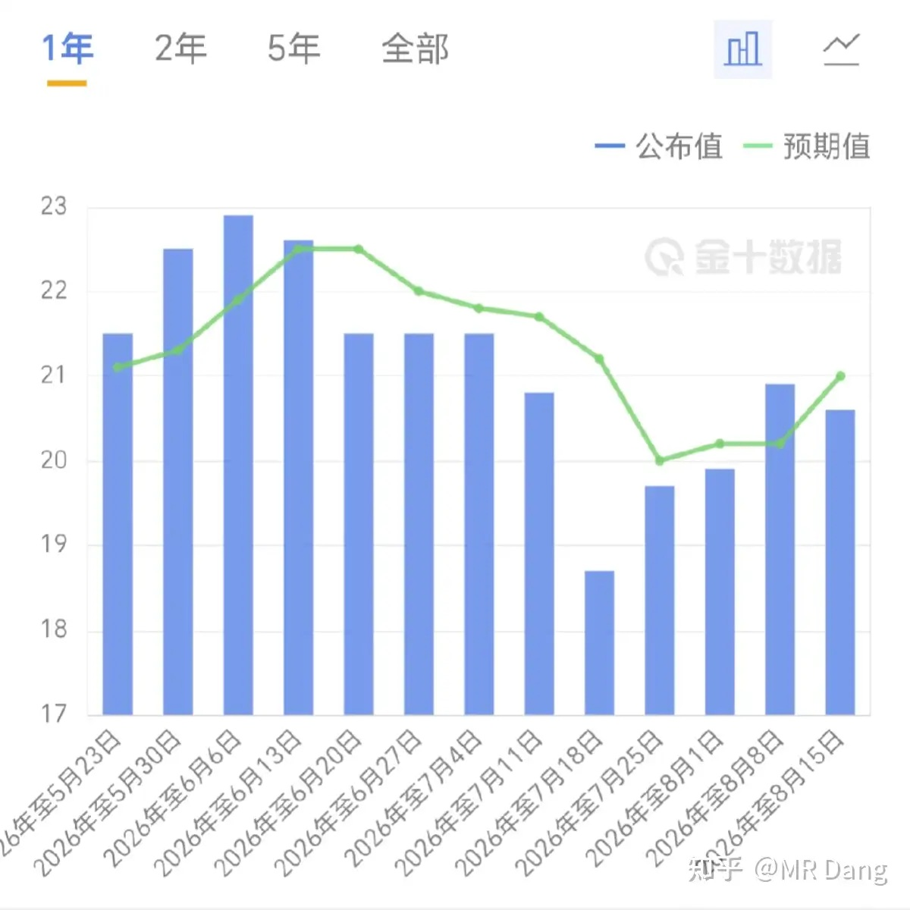
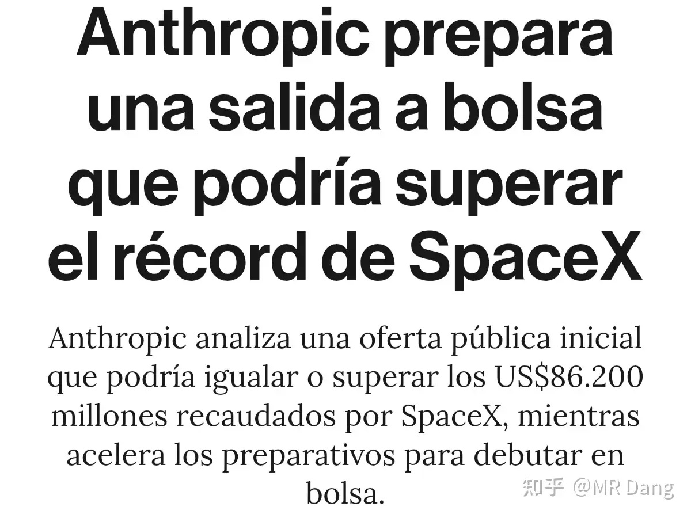
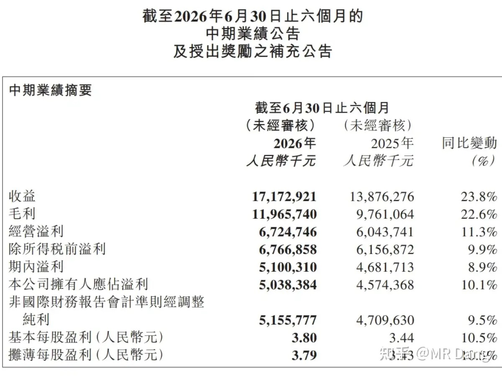
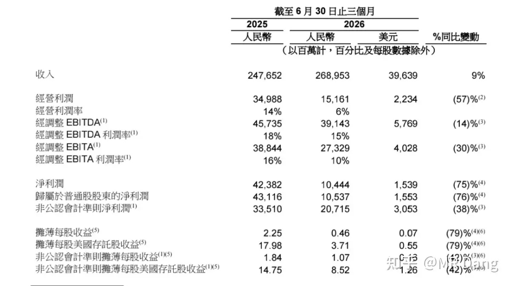
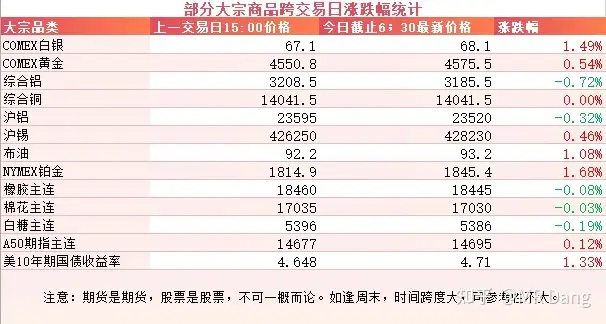
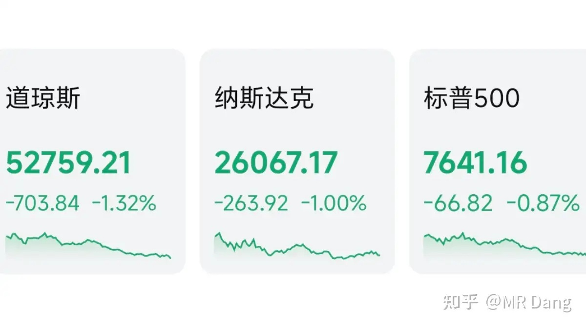
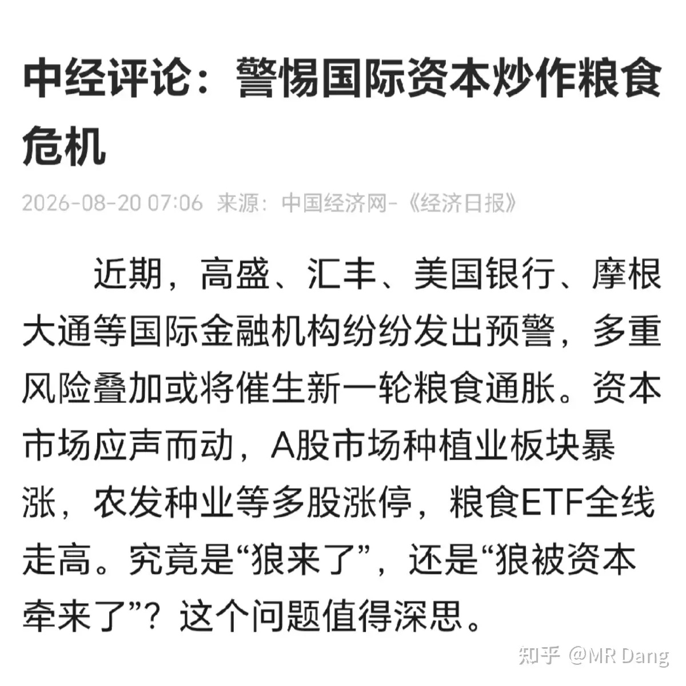

# 如何看待2026年8月21日A股市场行情？

---

**发布时间**: 2026-08-21 07:30  |  **原文链接**: https://www.zhihu.com/question/2071256215594722420/answer/2074035568061722634  |  **点赞数**: 182 人赞同

**作者信息**: MR Dang | 证券从业资格证持证人

---

## 正文内容

> **要点速览**
>
> - 美国初请失业金人数为 20.6 万，略低于 21 万的预期值。
> - 有报道称 Anthropic 正筹备上市，募资规模可能超过 SpaceX；作者认为其财务表现至少更容易支撑估值叙事。
> - 某娃娃公司业绩不及预期、需求端难以判断，作者不认同简单加回汇兑损益，并坚持“看不懂不参与”。
> - “蓝马甲”在高额 AI 资本开支下出现基本盘增长失速，但云服务收入仍显示相关投入开始获得回报。
> - 大宗商品涨跌互现、原油维持在 90 美元上方，美债收益率走高并压制科技股估值，隔夜美股三大股指回调。
> - 作者的个人组合普遍回血，但仍选择等待半年报披露，并提示粮食炒作面临较高的政策风险。

### 西大周初请失业金人数

实际公布数据 20.6 万人，比预期值 21 万人稍微少一些。

---

### Anthropic 上市

有报道称 Anthropic 快要上市，其募资规模可能将会超过 SpaceX。

从财务数据上来说的话，我个人觉得 Anthropic 肯定比 SpaceX 强多了，起码不至于上市了很久才去解释用什么业务支撑估值。

---

### 某娃娃公司

这业绩比较明显的不及预期，管理层还表示 20% 目标完不成了，但是公司更健康了。

有些投资者把汇兑损益加回去试图证明业绩还不错，我个人觉得不太科学。

这公司我确实看不懂，我一直说它的生意模式很难分析，需求端是个迷。

看不懂不参与是我的准则，所以我对它没啥想法。

很多人等着看段的笑话。

这个其实也不一定的，说不定下个季度业绩又好了，资本市场很难说的。

而且他有权利金拿，还能做差价降低成本，未必就会翻车。

---

### 蓝马甲

说个热知识，财报里的括号代表负数。

看到满屏的括号，观感上给人感觉不太好。

AI 资本开支太高了，基本盘增长失速，就像手动挡的车在换挡一样，顿挫感太明显，不是资本市场爱听的声音。

但是云服务收入这块还是不错的，说明资本开支还是见到了回头钱。

---

### 大宗商品

有色涨跌互现，贵金属表现比工业金属好，原油上涨，维持在90美元上方。

美十年期长债收益率再次抬头，又站上了 4.7%，压制科技股估值。

农产品保持高位，橡胶价格创年内新高。

### 外围市场

美三大股指收绿，道指领跌。

板块上除了黄金、存储、油气等少数行业外都不怎么样。

沃尔玛发布的财报拉了坨大的，跌了不少。

---

昨天个人组合净值回血一个多点，银行红两个多点，资源微红，电网红大半个，消费微绿。

还不错，除了极个别显眼包，大面积回血的一个交易日。

看着某些老登板块，其实是有点动心的，但是一想到半年报还没出，还是再忍忍好了，不想赌财报。

### 昨天早报发布后看到的一条新闻

这个题目，这个措辞，我还是再次提醒大家不要碰高压线，副部级的官媒不会无的放矢的。

炒作粮食，很容易被铁拳的，不要以身试险。

本身也没什么太高的投资价值，新的热点来了以后还会分散注意力，值搏率很差的一个板块了。

### 昨天还看到一张图

知道的小伙伴别透露，不知道这个新闻的猜一下这人是谁。

我当时知道他是谁的时候足足愣了半分钟，完全没认出来，努力想找到脑海中那个在广场上肆意奔跑的身影，就是对不上号。

---

### 一个喜欢保护韭菜的博主，希望大家少少踩坑，多多赚钱！！！

> [!comment]- 点击展开评论
>
> | 用户 | 时间 | 内容 |
> | :--- | :--- | :--- |
> | 套餐流量余额不足 |  | 对上了吗[感谢] |
> | &nbsp;&nbsp;&nbsp;&nbsp;july2010 | 17 小时前 | 胖了啊[哇] |
> | &nbsp;&nbsp;&nbsp;&nbsp;金大胖 |  | 人才 |
> | 知乎用户 |  | 所谓一夜白头其实是监狱里没人给他染发[发呆] |
> | &nbsp;&nbsp;&nbsp;&nbsp;MR Dang |  | [捂脸] |
> | &nbsp;&nbsp;&nbsp;&nbsp;黑子不黑 |  | 不是进去要推平头吗。他还可以搞个偏分？ |
> | &nbsp;&nbsp;&nbsp;&nbsp;知乎用户 | 3 小时前 | 说监狱其实不准确，因为他没判刑之前是看守所，看守所不用剃头 |
> | 鲲鹏 |  | 确实很震惊，人一夜白头具象化了 |
> | &nbsp;&nbsp;&nbsp;&nbsp;千寻海 |  | 其实是之前是染的 |
> | &nbsp;&nbsp;&nbsp;&nbsp;MR Dang |  | [感谢] |
> | &nbsp;&nbsp;&nbsp;&nbsp;徐深 |  | 其实精神看着还可以。 |
> | 红色高跟鞋 |  | 我就想看老灯儿的笑话，放心，早晚会看到 |
> | 山石李 |  | [感谢][感谢][感谢][感谢][感谢]大家有没有二手的《价值投资功法》，打算搞一本[感谢][感谢][感谢][感谢][感谢]电子书也行啊[感谢][感谢][感谢][感谢][感谢][感谢] |
> | &nbsp;&nbsp;&nbsp;&nbsp;山石李 | 6 小时前 | 9.9[酷][酷][酷][酷] |
> | &nbsp;&nbsp;&nbsp;&nbsp;123123123 | 15 小时前 | 我有，你要多少钱卖给你 |
> | 要填真的吗 |  | 许老板这个照片，没点开我还以为是登子 |
> | 尼尔雅童 |  | 评论居然超过一百了 |
> | Wien落榜大宝宝 |  | 某些老登板块包括某城市的啤酒吗[滑稽] |
> | 红.德仔 |  | [吃瓜] |
> | &nbsp;&nbsp;&nbsp;&nbsp;MR Dang |  | [感谢] |
> | 茯苓饮 |  | 进去的人基本全白头，里面有什么刺激吗[doge] |
> | &nbsp;&nbsp;&nbsp;&nbsp;爱美的丫 |  | 可能不需要染头发了吧 |

---

*本文件从 MR Dang 知乎页面转载*

**作者**: MR Dang  
**链接**: https://www.zhihu.com/question/2071256215594722420/answer/2074035568061722634  
**来源**: 知乎

*著作权归作者所有。商业转载请联系作者获得授权，非商业转载请注明出处。*

---

## 相关阅读

- [[20260820-大家对2026年8月20日A股市场行情都怎么看待？|上一篇：大家对2026年8月20日A股市场行情都怎么看待？]]
- [[20260824-大家对2026年8月24日A股市场行情都怎么看待？|下一篇：大家对2026年8月24日A股市场行情都怎么看待？]]
