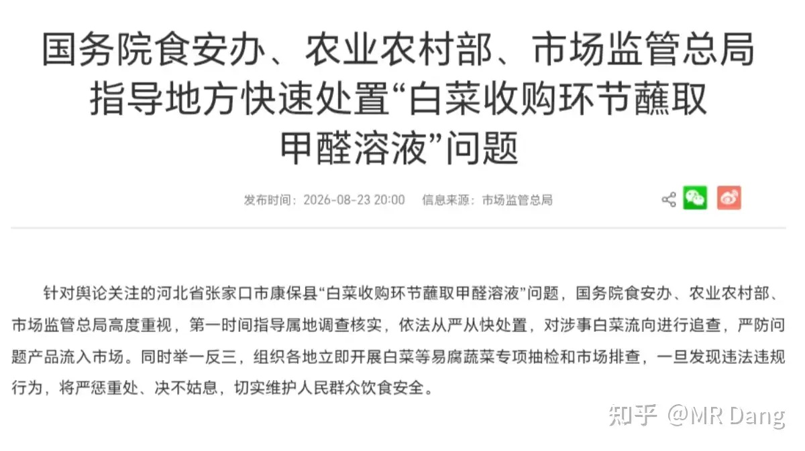
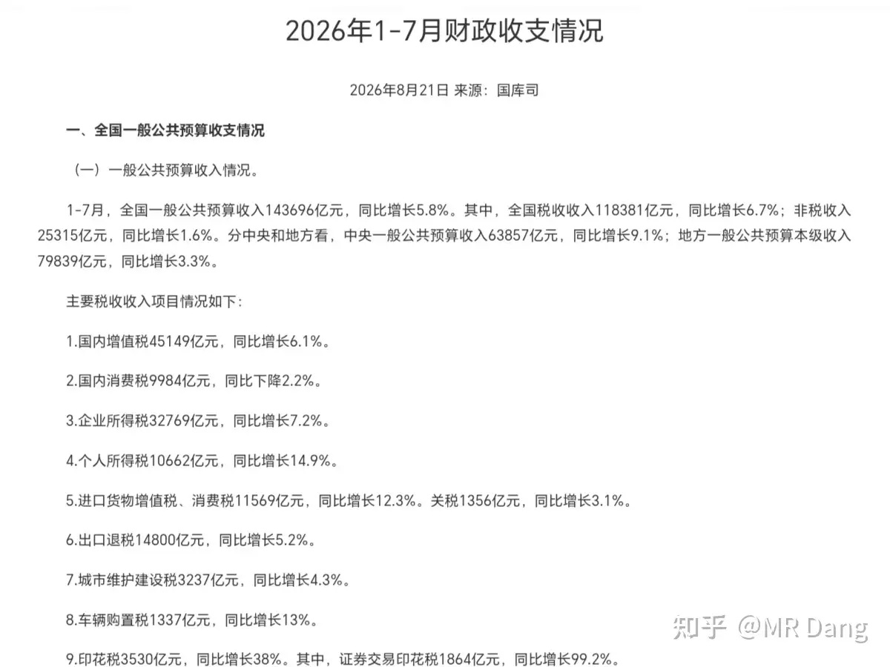
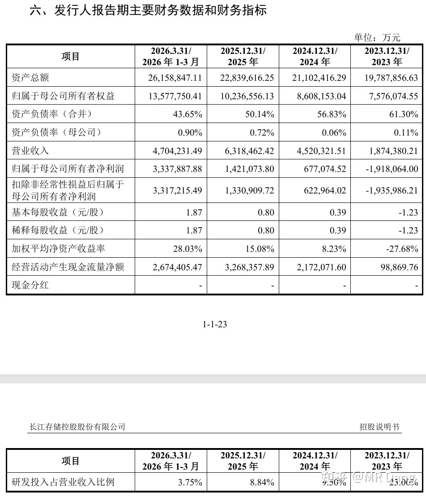
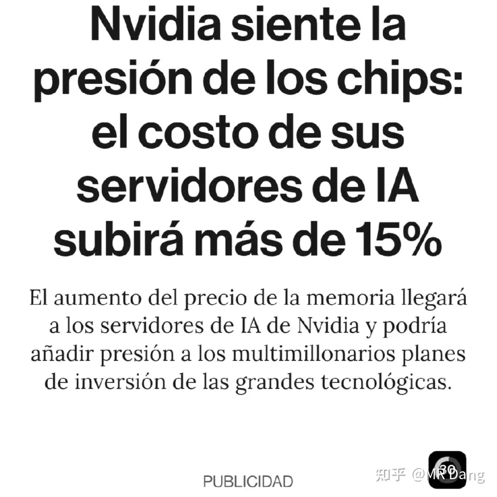
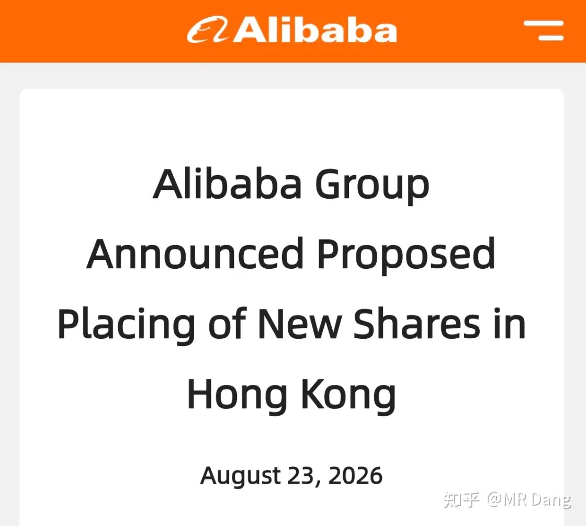
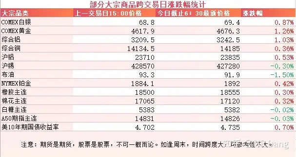
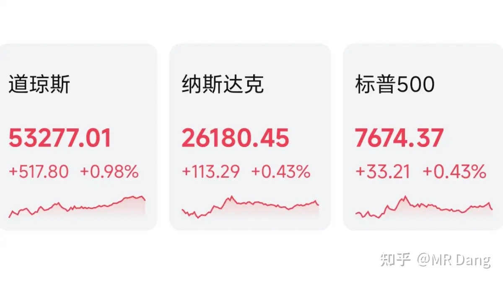

# 大家对2026年8月24日A股市场行情都怎么看待？

---

**发布时间**: 2026-08-24 07:31  |  **原文链接**: https://www.zhihu.com/question/2074073512084497338/answer/2075123027503739072  |  **点赞数**: 141 人赞同

**作者信息**: MR Dang | 证券从业资格证持证人

---

## 正文内容

> **要点速览**
>
> - 白菜甲醛事件短期或利好第三方检测，若冷链运输进一步规范化，长期需求也有望增加。
> - 前 7 个月证券交易印花税数据走强，与头部券商较好的财务表现相互印证。
> - 长江存储申报募资 330 亿元，作者提醒关注后续上市进度并提前准备打新资格与市值。
> - 英伟达新品据报涨价 15% 以上，利好英伟达、国产替代与存储板块，但可能增加下游云厂商和算力企业成本。
> - 阿里巴巴拟配售融资 800 亿港币加码 AI；本周还需关注美国 PCE、英伟达财报、初请失业金及国内工业企业利润数据。

### 周末要闻：白菜事件引发热议

以官方通报为准，我是投资者，从投资的角度看问题的话，有两个行业比较受益。

一个是第三方检测，这个可能偏向短期情绪影响，未来是否纳入常规检测，市场规模有多大，都是不确定的事情。

一个是冷链运输，这个偏长期影响。

收购白菜的奸商肯定知道甲醛的危害，为什么敢铤而走险干这事，主要是有利可图。

一车白菜走冷链，成本最少都几百块，稍微多一点就上千了，而用甲醛就几块钱。

白菜是低价农产品，对成本极度敏感，能出现这事也就不奇怪了。

如果以后都规范化，全走冷链，那这块的需求也不会少的。

---

### 印花税

有关部门发布了今年前 7 个月的印花税情况，根据前 7 个月的数据推测，7 月份单月证券印花税 315 亿，高于前 7 个月的月均水平，同比也增长 109%。

印花税和券商的业绩是有相关性的，头部券商的财务数据真挺不错。

---

### 又来一个万亿级：长江存储

长存发了招股说明书，根据里面的财务数据，长存今年一季度比长鑫都更赚钱。

这两行业估值水平差不多，所以这么看下来，股王的位置也不是很稳固。

按照目前的进度，经过几轮问询后，最快今年底就能在资本市场见面了，最晚可能也就是明年初。

打新的别错过了，虽然不是最赚钱的大肉签，但中签率肯定不会低。

股王最开始募资目标是 300 亿不到，最后实际募集了 579 亿。

长存目前申报募集金额是 330 亿，已经超过了股王的申报金额，所以中签率两边可能有的一比。

股王当时是 250 个号，也就是 125 万沪市市值必中一签。

该开权限的开权限，该准备市值的准备市值，这种好事不是每年都有的，现在都来得及。

---

### 达子涨价：英伟达新品

有报道称达子涨价 15% 以上，主要是明年初交付的新品，比如 Vera Rubin VR200 和 Grace Blackwell GB300。

利好达子，国产替代，存储板块，利空下游的云厂商和算力企业。

---

### 蓝马甲：配售融资加码 AI

蓝马甲宣布配售融资 800 亿港币，准备梭哈 AI。

前几天发布财报的时候我已经分析过了，经营处于换挡期，原有业务增速放缓，AI 太烧钱了，现在这么卷的环境下，融资也不算意外。

---

### 大宗商品

有色整体表现不错，贵金属和工业金属都有一定涨幅，黄金都逼近 4700 美元大关了。

原油有一定回调。

美债收益率又上去了，回购并没有阻止抛售。

---

### 外围市场

上个交易日美股三大股指收红，道指领涨。

板块上普涨，有色走强。

---

上个交易日个人组合净值回血半个多点，银行绿小半个，资源红近三个，电网红近一个，消费微红。

---

### 本周前瞻

1. 周三西大公布 PCE 数据。

2. 周四达子财报，这是科技板块风向标。

3. 周四西大周初请失业金人数。

4. 本周公布咱们这边前 7 个月工业企业利润数据。

---

### 一个喜欢保护韭菜的博主，希望大家少少踩坑，多多赚钱！！！

> [!comment]- 点击展开评论
>
> | 用户 | 时间 | 内容 |
> | :--- | :--- | :--- |
> | jay迷惑 | 6 小时前 | 一个月印花税315亿，一年小四千个亿诶，庄家抽的不少啊 |
> | &nbsp;&nbsp;&nbsp;&nbsp;MR Dang | 6 小时前 | [感谢] |
> | 十六 | 7 小时前 | [抱抱][抱抱][抱抱] |
> | &nbsp;&nbsp;&nbsp;&nbsp;MR Dang | 7 小时前 | [感谢] |
> | 要走多少路 | 7 小时前 | [哇][感谢][感谢][感谢] |
> | &nbsp;&nbsp;&nbsp;&nbsp;MR Dang | 7 小时前 | [感谢] |
> | 薛定谔的猫耳朵 | 7 小时前 | [哇][感谢] |
> | &nbsp;&nbsp;&nbsp;&nbsp;MR Dang | 7 小时前 | [感谢] |
> | 茶楼欧诺情侣 | 6 小时前 | [哇][感谢] |
> | &nbsp;&nbsp;&nbsp;&nbsp;MR Dang | 6 小时前 | [感谢] |
> | 两江的雨季 | 4 小时前 | 我们国家还处于社会主义初级阶段，底子薄、担子重、人均资源贫乏，如果连大白菜都搞冷链，那岂不是要卖到5元一斤，让群众们吃不起菜了 |
> | 无为 | 6 小时前 | [感谢]早 |
> | &nbsp;&nbsp;&nbsp;&nbsp;MR Dang | 6 小时前 | [感谢] |
> | 鲲鹏 | 7 小时前 | [感谢] |
> | &nbsp;&nbsp;&nbsp;&nbsp;MR Dang | 7 小时前 | [感谢] |
> | 镜外视力 | 7 小时前 | 老师好，能不能具体指导一下怎么算125万，是账户有就可以，还是必须买成股票 |
> | &nbsp;&nbsp;&nbsp;&nbsp;MR Dang | 7 小时前 | 必须是6开头的，买成股票，这个125说的是之前的，长存不一定是多少 |
> | 法家君子 | 7 小时前 | 默默支持[机智] |
> | &nbsp;&nbsp;&nbsp;&nbsp;MR Dang | 7 小时前 | [感谢] |

---

*本文件从 MR Dang 知乎页面转载*

**作者**: MR Dang  
**链接**: https://www.zhihu.com/question/2074073512084497338/answer/2075123027503739072  
**来源**: 知乎

*著作权归作者所有。商业转载请联系作者获得授权，非商业转载请注明出处。*

---

## 相关阅读

- [[20260821-如何看待2026年8月21日A股市场行情？|上一篇：如何看待2026年8月21日A股市场行情？]]
