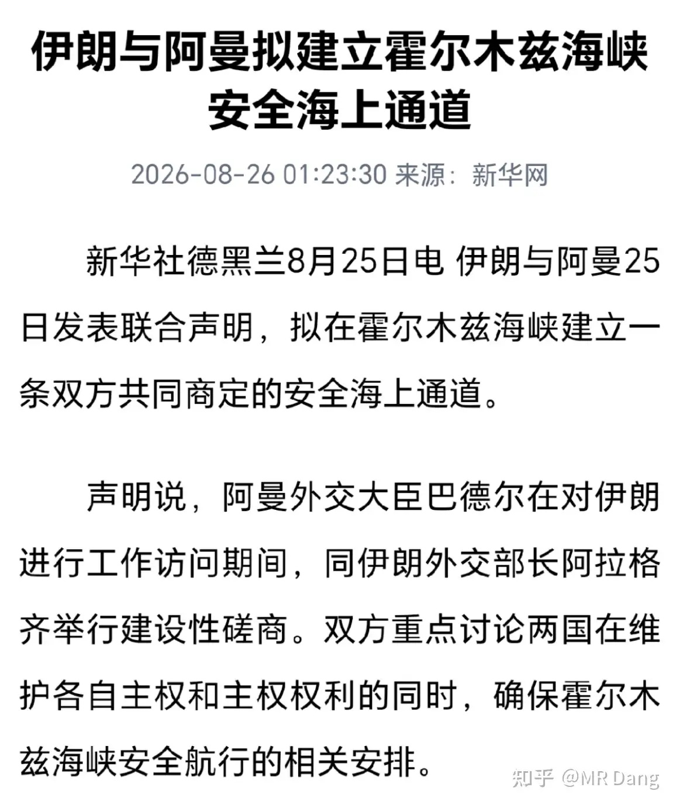
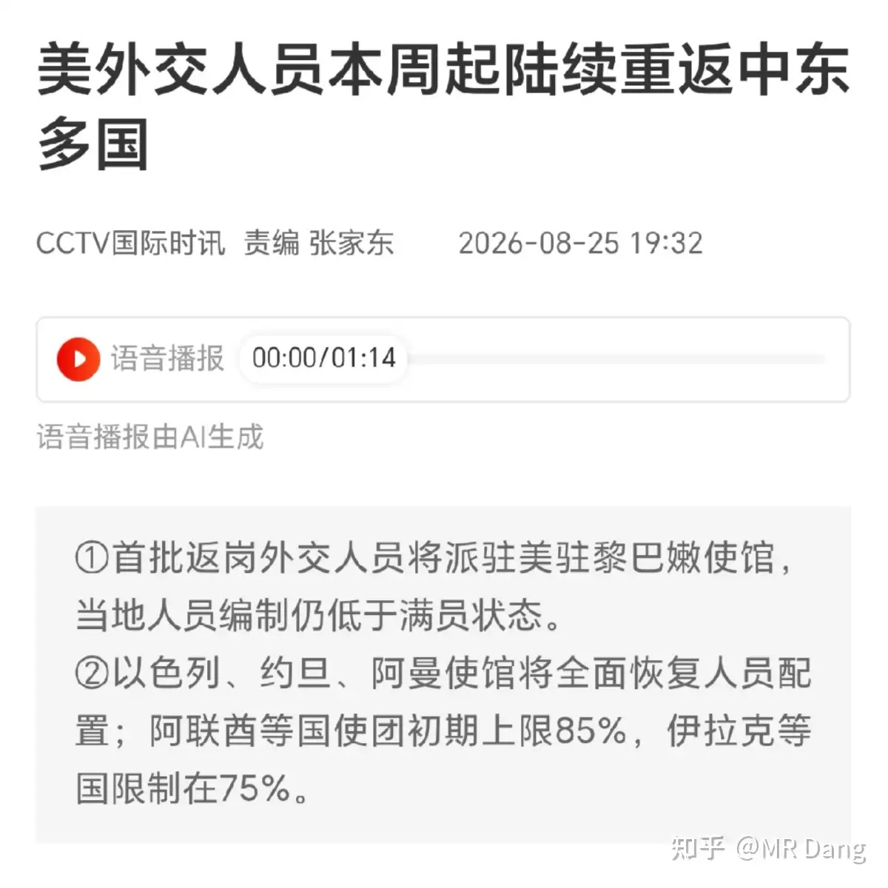
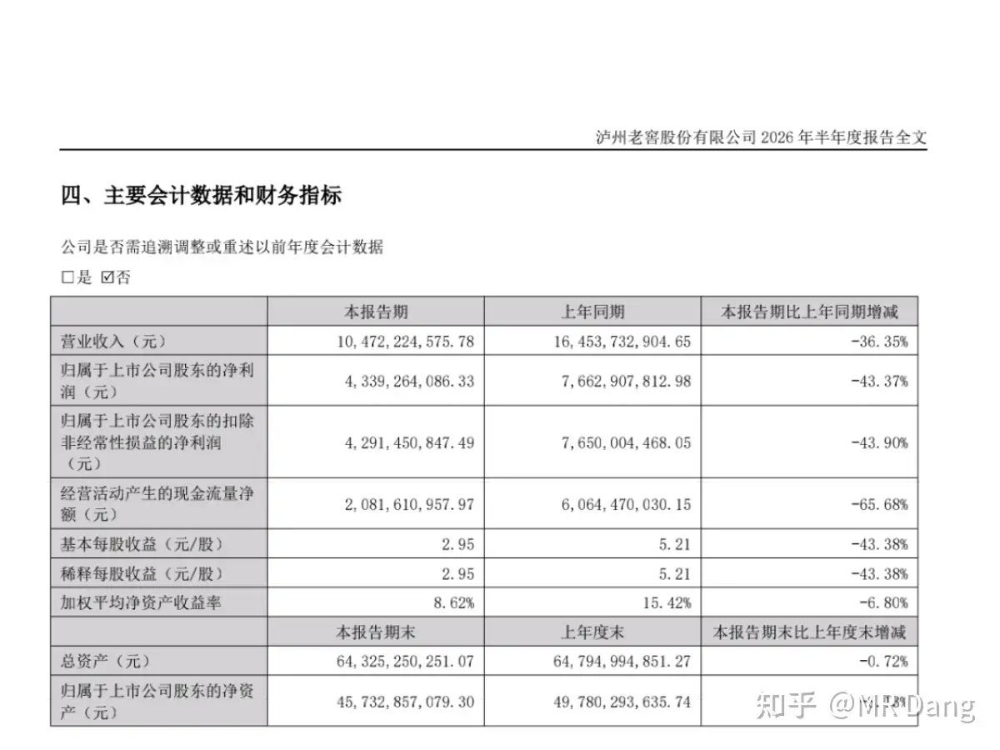
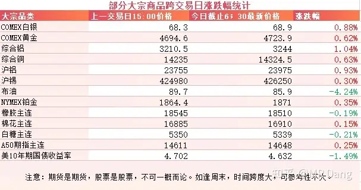
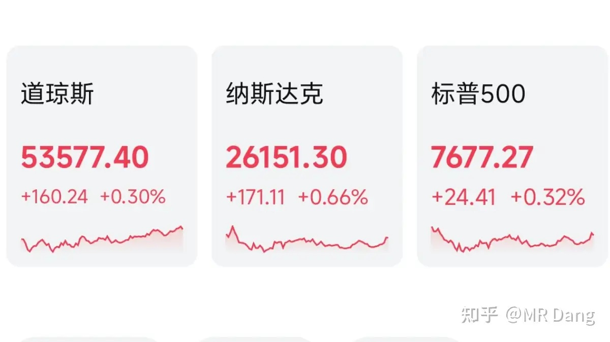

# 如何看待2026年8月26日A股市场行情？

---

**发布时间**: 2026-08-26 07:59  |  **原文链接**: https://www.zhihu.com/question/2073068141878436790/answer/2075855001554100731  |  **点赞数**: 171 人赞同

**作者信息**: MR Dang | 证券从业资格证持证人

---

## 正文内容

### 隔夜最大的新闻是伊朗和阿曼发表共同声明

权威媒体报道了伊朗和阿曼拟建立霍尔木兹海峡安全海上通道一事。

根据报道，目前给出的是临时通道+框架协议的方案，同时还有联合排雷等措施来恢复航道。

消息传出后，原油价格有较大幅度的跳水。

同时还有西大准备向此前撤离的中东地区重新派遣外交官的报道，让市场对中东局势降温有了进一步预期。

---

### 某白酒龙头企业

发布了2026上半年财报，整体不及预期，让一众投资者纷纷破防。

单算二季度，仅6.3亿净利润，同环比跌幅都达到了七八十个点。

公司面对经销商的高库存，主动砍量保价，毛利率保住了，但是销售管理费用可不会同步减少，费用刚性把利润降幅放大。

行业龙一龙二都失速的情况下，后排的龙三龙四日子也不好过了，中高端系列销量降低了42%，压力山大。

---

### 大宗商品

受美伊局势缓和预期影响，原油大幅回撤，又回到了85美元区间。

有色集体走强，金银铜铝铂锡都有不同幅度上涨。

美十年期长债收益率从高位有所下行。

### 外围市场

美三大股指集体收红，纳指领涨，科技走强。

板块上半导体和生物疫苗表现较好，此前的明星企业Moderna涨了14%。

---

昨天个人组合净值回撤大半个点，银行绿一个半，资源绿两个半，电网红近一个点，消费红两个点。

---

没啥重要的新闻，今天刚好讲一个挺难懂的会计知识，能听懂最好，听不懂也没关系，因为很多财会人也未必懂。

正好也有读者问套保的事，就大概提一嘴。

套期保值，主要有三种类型，一种叫公允价值套期，一种叫现金流量套期，还有一种叫境外经营净投资套期。

前者多见于金融行业，比如固定利率债券的利率风险套保，产生的盈亏全部计入公允价值变动损益，是进利润表的。

而第三种境外经营净投资套期主要是对境外子公司的汇率风险进行管理。

我们平时接触到的制造业，一般涉及到的就是现金流量套期。

现金流量套期，有效部分进入其他综合收益，无效部分才进入公允价值变动收益，

啥叫有效无效呢？

公司假设三个月后要生产1000吨金属锭，担心精矿价格上涨，就先去期货市场做多1000吨金属期货，比如开仓价35万吧，此时现货也是35万。

三个月后，期货涨到了40.1万，现货是40万。

期货和现货同步上涨的5万，就成功了，就叫有效部分。

那期货多出来的0.1万，就相当于没起到套保的作用，就叫无效部分。

此时平仓，并实际采购可以生产1000吨金属锭的原料，花费4亿。

这就是原材料现金成本。

但是因为做了套保，所以要调整一下，把之前做套保赚的那0.51亿里的0.5亿从成本里扣除，所以入账的时候就写3.5亿。

这和决定套保时，直接用35万的现货价格买效果是一样的，套保成功。

同时还有100万套保失败，计入公允价值变动收益。

那这三个月中间的时候，如果要出财务报表，但是原材料还没买，持有的是期货，怎么办呢？

就把期货浮盈的这部分计入“其他综合收益”，等以后真的买原材料的时候，再从原材料成本里减去就行了。

说这么多什么意思呢？

为什么金属价格涨了，毛利还少了？

因为销售的金属和财务上核算的成本不是一一对应的，有时间差。

而如果刚好销售的金属对应的成本在高点，就会吞噬毛利。

而相应的，当实际采购原材料入库的时候，就会释放报表里的“其他综合收益”，去拉低存货的成本。

而当这部分存货销售出去的时候，就会结算进利润表，毛利水平会大幅提高。

利润不是消失了，而是因为套保在时间上错配了。

从这一方面看的话，**如果一家做套保的企业，其他综合收益这个科目异常增加，那未来的业绩释放就可期了。**

---

### 一个喜欢保护韭菜的博主，希望大家少少踩坑，多多赚钱！！！

> [!comment]- 点击展开评论
>
> | 用户 | 时间 | 内容 |
> | :--- | :--- | :--- |
> | masculine |  | 多讲讲最后部分的类似内容，爱听[赞同][感谢] |
> | &nbsp;&nbsp;&nbsp;&nbsp;MR Dang |  | [感谢] |
> | &nbsp;&nbsp;&nbsp;&nbsp;GAO尛森 |  | [大哭]当年注会学套期学的死去活来，今天又回想起了那种被支配的恐惧 |
> | 飞扬 |  | 没事，原油低于70，董王会再次出手 |
> | &nbsp;&nbsp;&nbsp;&nbsp;MR Dang |  | [感谢] |
> | lion |  | [感谢] |
> | &nbsp;&nbsp;&nbsp;&nbsp;MR Dang |  | [感谢] |
> | 红.德仔 |  | 最后的有点烧脑[滑稽]今天安排时间搞懂它[滑稽]虽然后面会忘了[滑稽][滑稽] |
> | &nbsp;&nbsp;&nbsp;&nbsp;MR Dang |  | [感谢] |
> | 顾越 |  | [感谢] |
> | &nbsp;&nbsp;&nbsp;&nbsp;MR Dang |  | [感谢] |
> | 一帆 |  | 今天后面一段可以吸收[感谢][感谢] |
> | 茯苓饮 |  | 最后分析的这个知识分析的是哪个公司的财报啊，让我去学习研究下[感谢] |
> | 守常 |  | [感谢] |
> | &nbsp;&nbsp;&nbsp;&nbsp;MR Dang |  | [感谢] |
> | 墨衣擒香 |  | 注会套期会计那一章我都是死记硬背一些基础的东西应付选择题，没学透[捂脸] |
> | zzzzmmmm |  | [感谢] |

---

*本文件从 MR Dang 知乎页面转载*

**作者**: MR Dang  
**链接**: https://www.zhihu.com/question/2073068141878436790/answer/2075855001554100731  
**来源**: 知乎

*著作权归作者所有。商业转载请联系作者获得授权，非商业转载请注明出处。*

---

## 相关阅读

- [[20260824-大家对2026年8月24日A股市场行情都怎么看待？|上一篇：大家对2026年8月24日A股市场行情都怎么看待？]]
- [[20260827-如何看待2026年8月27日A股股市行情？|下一篇：如何看待2026年8月27日A股股市行情？]]
