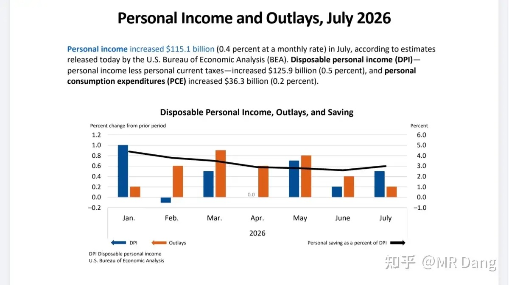
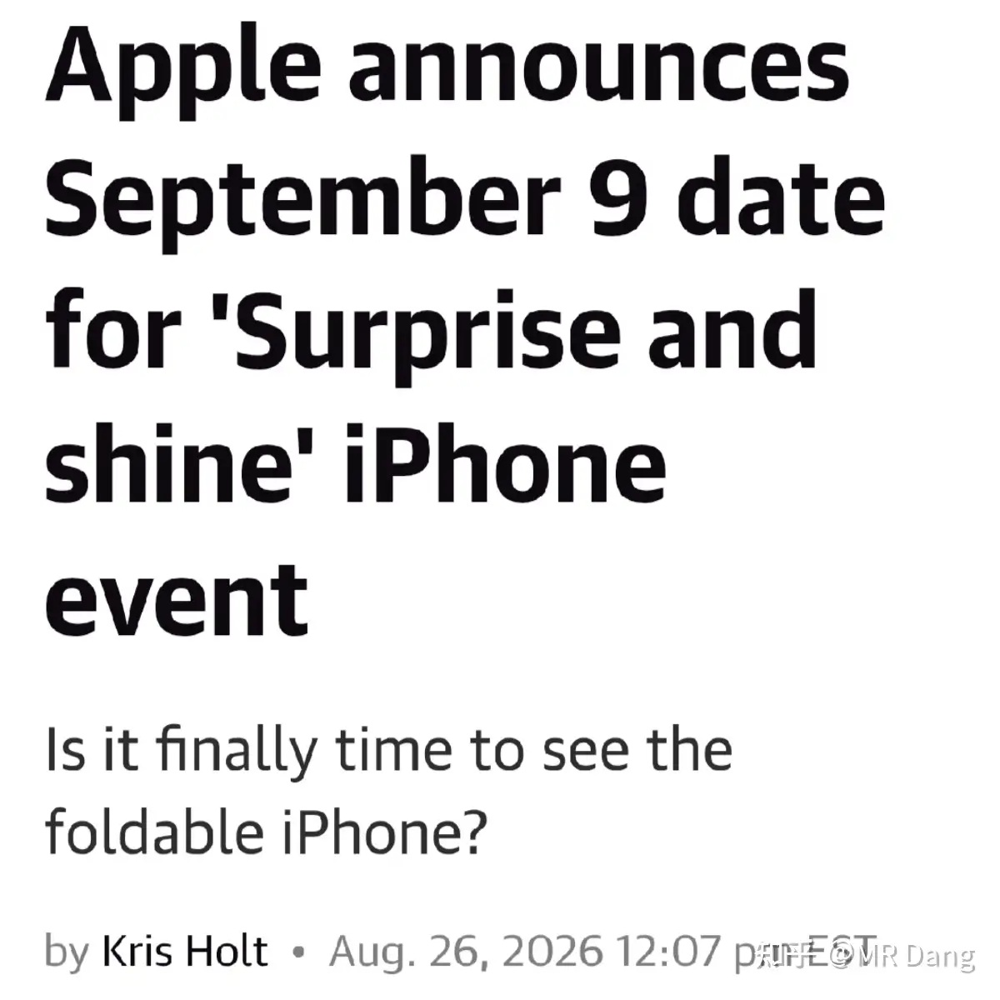
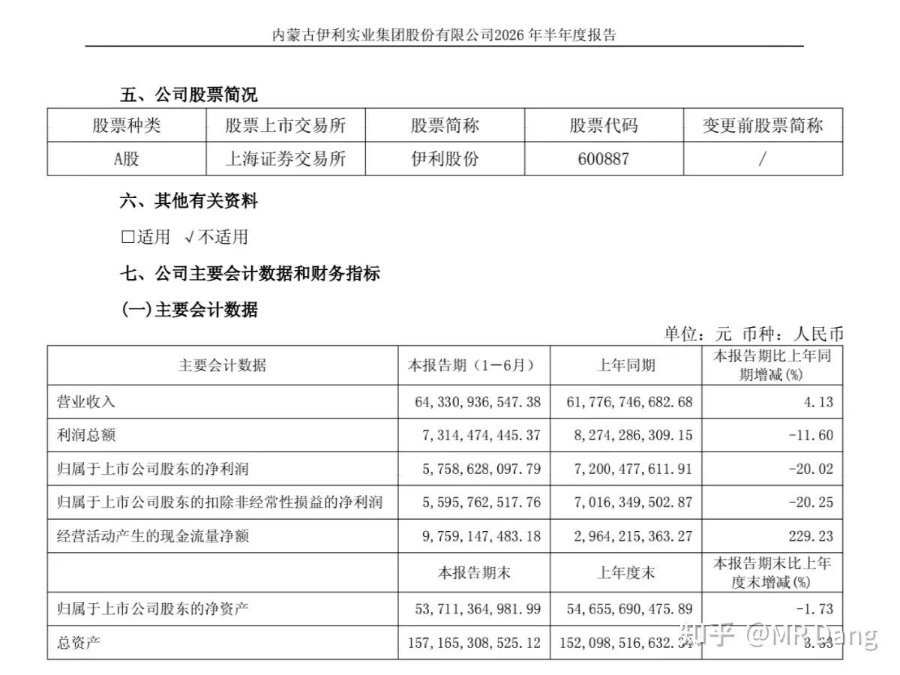
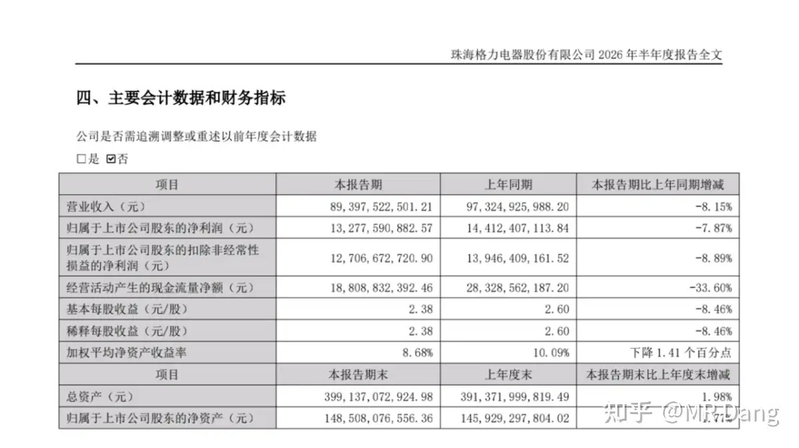
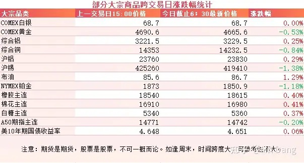
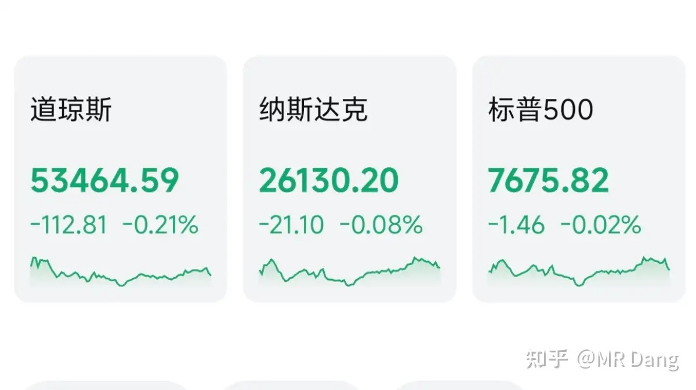
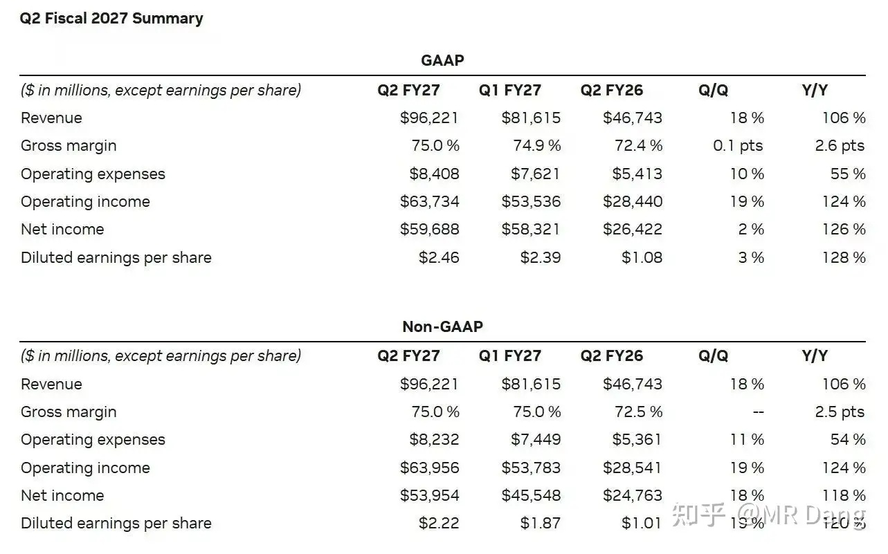

# 如何看待2026年8月27日A股股市行情？

---

**发布时间**: 2026-08-27 07:30  |  **原文链接**: https://www.zhihu.com/question/2075612699208193532/answer/2076209962842329657  |  **点赞数**: 163 人赞同

**作者信息**: MR Dang | 证券从业资格证持证人

---

## 正文内容

### 西大发布了7月PCE数据

整体PCE增长3.7%，高于预期的3.6%，环比增速0.2%，高于预期的0.1%，服务通胀是比较重要的一个推手。

剔除能源后，核心PCE同比增长3.3%，环比增长0.2%，都符合市场预期。

同时公布的个人消费支出增速不到0.1%，显示出西大的消费数据也不太好。

如果和通胀数据放在一起看，怎么感觉有点滞胀的味道了。

数据出炉后，9月加息概率从36%提升到了42%，美债收益率上行，这也是市场对这一数据的投票。

---

### 苹果发布会

苹果向媒体发了邀请函，定在9月9开新品发布会，咱们这边大概是9月10日凌晨。

有业内人士猜测可能会发布苹果的首款折叠屏手机。

---

### 某牛奶企业

发布了2026年中报，营收微增4%左右，归母净利润下跌20%。

看着似乎不太行，不过核心净利润其实增长的，大概有10%左右，三大主业都保持增长，距离市场预期并不远。

导致归母净利润同比下跌的原因是公司计提了资产减值损失24.5亿，其中之前收购澳优的商誉计提了15.5亿，存货计提了9亿。

另外还有就是今年乳企的集体补税，所得税费用这块也是同比大幅提高的，有7个亿左右的影响。

好消息是大部分商誉都陆陆续续计提了。

坏消息是还有6个亿的商誉不知道什么时候打算计提。

整体看下来，不是特别差的一份财报，里子看上去比面子更好一些。

---

### 某空调企业

发布了2026半年报，看着也是惨兮兮，其实拆解一下的话还不错。

在上半年消费承压，国补退潮，原材料铜和制冷剂双双涨价的大环境下，毛利率居然还能往上走，挺超预期。

另外看着营收下降了，主要是出口数据不佳，内销其实是正增长的，在行业整体萎缩的情况下提升了市占率。

中报没有分红也不算令人意外，去年是三季报出的。

---

### 大宗商品

受PCE数据影响，黄金等贵金属有少许回调。

工业金属里铝强铜弱，但是铜整体是在历史新高附近。

原油有少许反弹。

农产品表现不错，非洲那边最近受天气影响挺大，西非涝，东非旱。

萨赫勒地区降雨不稳，对棉花产量有一定影响。

美债变化不大，A50期指看着也一般。

才想起来今天是周四，那不奇怪了。

### 外围市场

美三大股指集体回调，道指领跌。

科技板块稍好。

盘后达子出了财报，各项主要指标都超出了此前市场预期，指引给的也不错，管理层给出了2028年收入增长70%的预期。

---

昨天个人组合净值回血半个多点，银行微红，资源红近两个半，消费绿一个，电网红大半个。

还不错，普涨行情，体验可以。

最近市场对股份行不太信任，投资者也担心自己手里的股份行二季报暴雷。

我个人的话，其实配置银行板块的最大作用就是提供稳定的现金流，对二级市场表现其实不是很上心。

但有的投资者可能还是比较在意的。

怎么说呢，不要玩自己输不起的游戏。

国有大行更稳当，城商行更有弹性，有一些地区的城商行也不错。

现在很多股份行财报还没出，回避潜在的短期风险还来得及，不要等到时候财报都出了再去纠结。

银行的财报比较特殊，业绩情况非常依赖管理层的态度，想财务洗澡随时可以洗，作为投资者是很难提前预测的。

---

### 一个喜欢保护韭菜的博主，希望大家少少踩坑，多多赚钱！！！

> [!comment]- 点击展开评论
>
> | 用户 | 时间 | 内容 |
> | :--- | :--- | :--- |
> | 张知 |  | 评论区怎么都是表情 没有问题的吗？ |
> | &nbsp;&nbsp;&nbsp;&nbsp;MR Dang |  | 哈哈 |
> | 薛定谔的猫耳朵 |  | [感谢] |
> | &nbsp;&nbsp;&nbsp;&nbsp;MR Dang |  | [感谢] |
> | 乐妈 |  | [感谢][感谢][感谢] |
> | 秦始皇摸电门 |  | [哇][感谢][感谢][感谢] |
> | &nbsp;&nbsp;&nbsp;&nbsp;MR Dang |  | [感谢] |
> | yzhd |  | [感谢][感谢][感谢] |
> | &nbsp;&nbsp;&nbsp;&nbsp;MR Dang |  | [感谢] |
> | 知乎用户nAF89 |  | [感谢][感谢][感谢] |
> | &nbsp;&nbsp;&nbsp;&nbsp;MR Dang |  | [感谢] |
> | 木子一 |  | [感谢] |
> | &nbsp;&nbsp;&nbsp;&nbsp;MR Dang |  | [感谢] |
> | 如来熊掌 |  | [感谢] |
> | &nbsp;&nbsp;&nbsp;&nbsp;MR Dang |  | [感谢] |
> | 霹雳蝴蝶 |  | 老师早上好[感谢] |
> | &nbsp;&nbsp;&nbsp;&nbsp;MR Dang |  | [感谢] |
> | 温暖 |  | [感谢] |
> | &nbsp;&nbsp;&nbsp;&nbsp;MR Dang |  | [感谢] |

---

*本文件从 MR Dang 知乎页面转载*

**作者**: MR Dang  
**链接**: https://www.zhihu.com/question/2075612699208193532/answer/2076209962842329657  
**来源**: 知乎

*著作权归作者所有。商业转载请联系作者获得授权，非商业转载请注明出处。*

---

## 相关阅读

- [[20260826-如何看待2026年8月26日A股市场行情？|上一篇：如何看待2026年8月26日A股市场行情？]]
- [[20260828-如何看待2026年8月28日A股市场行情？|下一篇：如何看待2026年8月28日A股市场行情？]]
