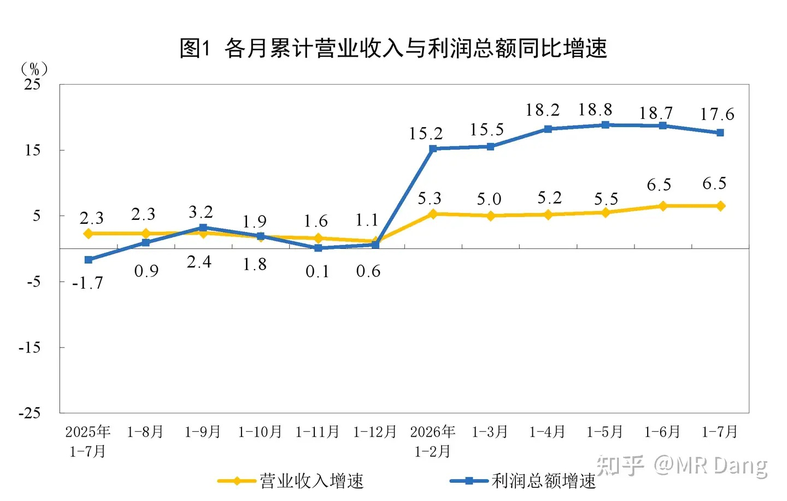
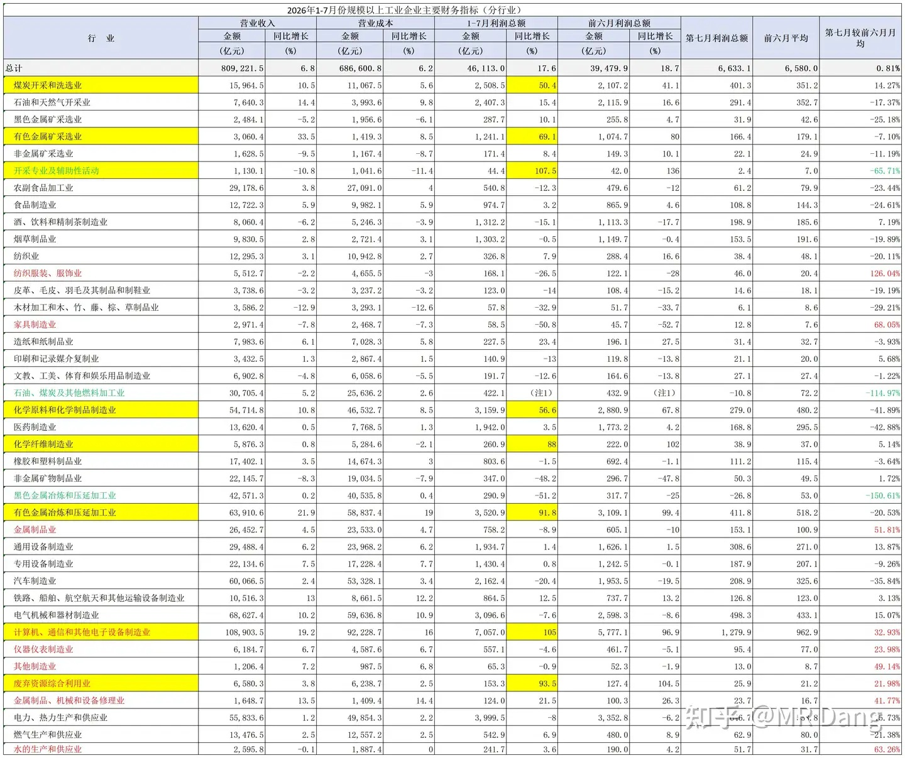
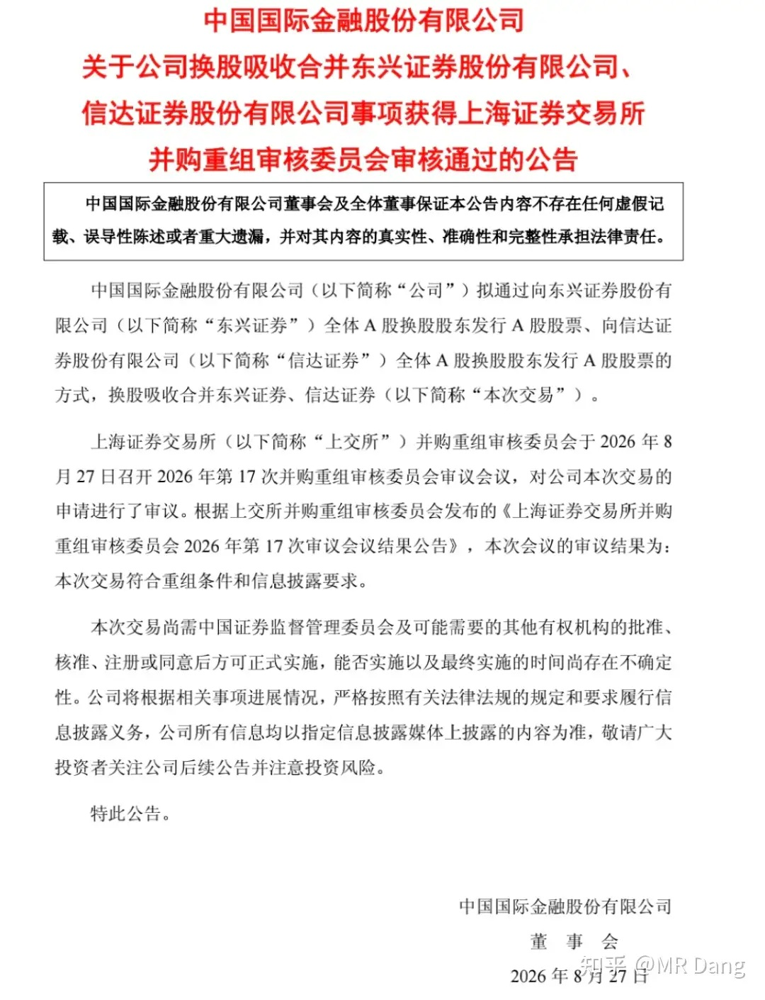
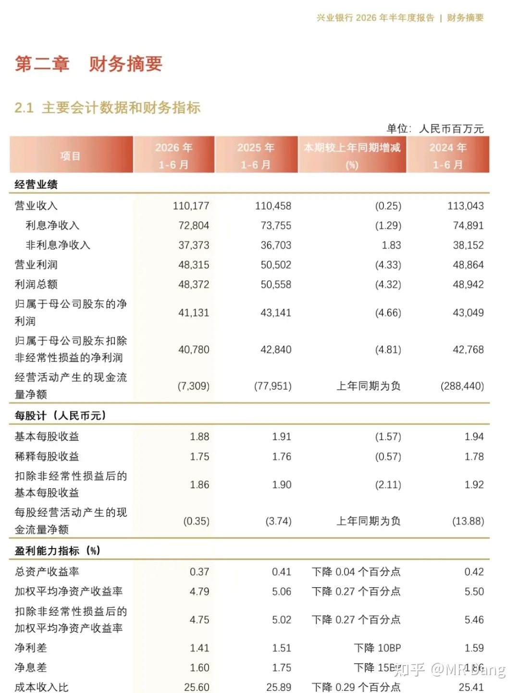
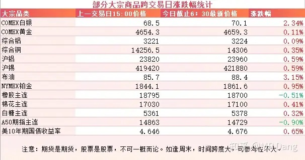
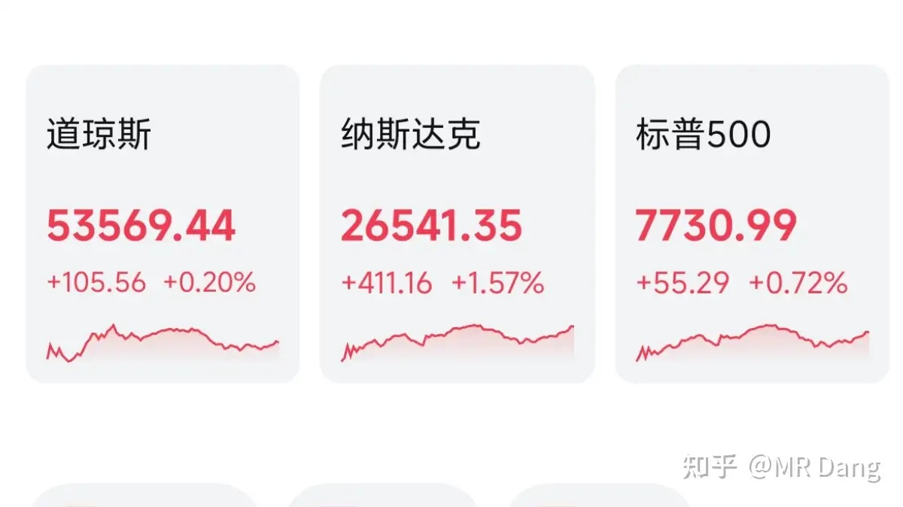

# 如何看待2026年8月28日A股市场行情？

---

**发布时间**: 2026-08-28 07:30  |  **原文链接**: https://www.zhihu.com/question/2073791946406081875/answer/2076572416072012928  |  **点赞数**: 200 人赞同

**作者信息**: MR Dang | 证券从业资格证持证人

---

## 正文内容

### 昨天统计局公布了工业企业利润数据

整体数据看上去不是很超预期，前7个月利润总额增速比上半年放缓。

分行业数据如上，这是我自己稍微加工了一下。

红字表示环比上半年月均数据增速20%以上的行业，黄底表示前7个月增速50%以上的行业。

黄底红字就是景气度最高的行业，同环比都在改善，只有两个，电子设备制造业和废弃资源综合利用业。

前者就是半导体之类的，不再赘述。

后者的话，在统计局分类口径里主要包含两个细分行业，分别是金属资源加工，非金属资源加工。

这两个里面金属资源加工是大头，行业特点是营收高，毛利低，典型的就是废钢和再生铝。

废钢都是小型地方企业，再生铝的话有那么两三家上市公司，不太多。

然后还有就是表格里黑色金属的利润很难看，原料里的焦炭暴涨，钢材价格下滑，两头堵，提示钢企承压。

---

### 券商合并

目前走到了交易所审核通过的流程，接下来就是报监管部门注册，大概得一个月左右，然后就是发布实施公告和换股交割，也得一个月左右。

如果一切顺利，最快可能10月底就差不多落地了。

如果多几轮补充问询，那估计就得11月甚至年底了。

时间进度越接近落地，中间的价差就会越收敛。

---

### 某股份银行

发布了2026上半年财务报告，营收下降0.25%，归母净利润下滑4.66%，上半年比去年减少了20亿净利润，主要是多计提了25亿坏账。

一季度是增长的，所以算下来二季度单季净利下滑超过10%。

但是不能简单的就认为是业绩暴雷，银行不全看净利润，还要拆解一番的。

我们先看净息差：净息差一季度末是1.62%，半年报是1.6%，没稳住。。。

问题不大，银行也不全看净息差，我们再来看拨备覆盖率: 年初是228.41%，半年报是225.67%，下降了。。。

嗯，问题不大，拨备也不是万能的，银行主要是用来吃息的，我们来看半年报的分红。。。。。。“另行公布”。。。

我再想想。。。。嗯，往好的地方想的话，今年计提了，明年基数低，说不定就有增速了。

银行是这样的，长期来看这个行业是增长的，所以一时的承压并不是天塌了，这个行业的韧性还是可以的。

---

### 大宗商品

看着都还不错，隔夜多多少少都涨了些，主要是白银和原油涨的稍微多一些，其他是氛围组。

棉花逼近三年以来的新高。

A50期指是换合约导致的，实际上是红的。

美长债收益率依然在相对高位。

### 外围市场

美三大股指集体上涨，纳指领涨，科技股表现不错，软件硬件都在涨。

---

昨天个人组合净值回撤一个点，银行绿两个多，资源红一个多点，电网红半个多，消费绿一个。

被按在地上殴打，刚开盘就光屁股了，裸奔了一整天。

达子是全球科技股的领头羊，号召力确实强，财报一出，老登都得随份子钱。

有个小细节是，市场在盘后交易的时候，看到达子发的财报，虽然所有数据都小超预期，但是股价不为所动，一直是绿的。

直到听到2028年营收增长指引70%，气氛一下就热烈了起来。

科技股现在就是这样的，对吃到肚子里的饼毫不在意，对画的饼锱铢必较。没有预期的科技股是就像没有分红的老登，支愣不起来。

---

有个孙割的大瓜在昨晚发酵，看到叫妈妈那段笑死我了，文笔真不错，可读性极强，喜欢吃瓜的建议看原文哈哈。

我作为投资者学到的是孙割的投资素养非常高，谈恋爱基本面分析的非常扎实，40多页的背调一丝不苟，这是交易的基础。

在仓位管理上也进退有度，先是小仓位试水，后来被要求上大仓位的时候，衡量了一下基本面，觉得不值，就没上头，很有纪律。

财务管理的水平也很高，对超出正常经营过程的重大关联方交易保持高度警惕。

择时能力也很强，做多失败就反手杠杆做空，尽量挽回损失。

---

### 一个喜欢保护韭菜的博主，希望大家少少踩坑，多多赚钱！！！

> [!comment]- 点击展开评论
>
> | 用户 | 时间 | 内容 |
> | :--- | :--- | :--- |
> | 第二个号 |  | 对孙割的分析一本正经又十分搞笑[doge] |
> | &nbsp;&nbsp;&nbsp;&nbsp;MR Dang |  | [感谢] |
> | &nbsp;&nbsp;&nbsp;&nbsp;尼尔雅童 |  | 只看到剪指甲那里，太假太癫看不下去[捂脸] |
> | 夜战都市 |  | 差银行为啥计提这么多[捂脸]。坏账爆了嘛。再入什么价位比较值博啊 |
> | 活着 |  | 其他也就算了，中报不发不分红无法理解 |
> | &nbsp;&nbsp;&nbsp;&nbsp;MR Dang |  | [感谢] |
> | Amanda |  | 对孙的投资总结精辟 |
> | &nbsp;&nbsp;&nbsp;&nbsp;MR Dang |  | [感谢] |
> | &nbsp;&nbsp;&nbsp;&nbsp;没什么不同 |  | [感谢] |
> | &nbsp;&nbsp;&nbsp;&nbsp;键来 |  | [感谢] |
> | 我喜欢花生米 |  | 今天不特意刷，找不到帖子，还好我有经验了 |
> | &nbsp;&nbsp;&nbsp;&nbsp;MR Dang |  | [感谢] |
> | 茶楼欧诺情侣 |  | [哇][感谢] |
> | 陈陈陈 |  | [感谢] |
> | 狄仁杰 |  | [感谢][感谢] |
> | &nbsp;&nbsp;&nbsp;&nbsp;MR Dang |  | [感谢] |
> | gfhk |  | [哇]早 |
> | &nbsp;&nbsp;&nbsp;&nbsp;MR Dang |  | [感谢] |
> | 回声 |  | 早[感谢] |
> | &nbsp;&nbsp;&nbsp;&nbsp;MR Dang |  | [感谢] |

---

*本文件从 MR Dang 知乎页面转载*

**作者**: MR Dang  
**链接**: https://www.zhihu.com/question/2073791946406081875/answer/2076572416072012928  
**来源**: 知乎

*著作权归作者所有。商业转载请联系作者获得授权，非商业转载请注明出处。*

---

## 相关阅读

- [[20260827-如何看待2026年8月27日A股股市行情？|上一篇：如何看待2026年8月27日A股股市行情？]]
- [[20260831-如何看待2026年8月31日A股行情走势？|下一篇：如何看待2026年8月31日A股行情走势？]]
