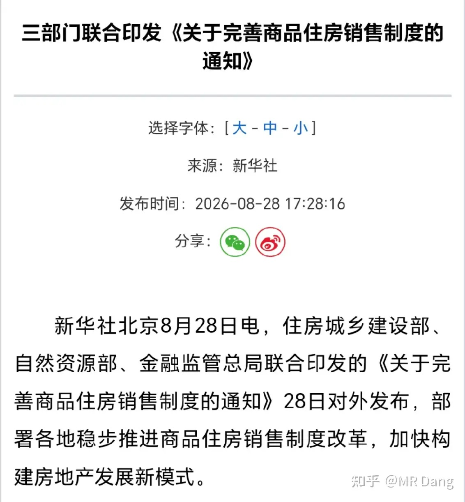
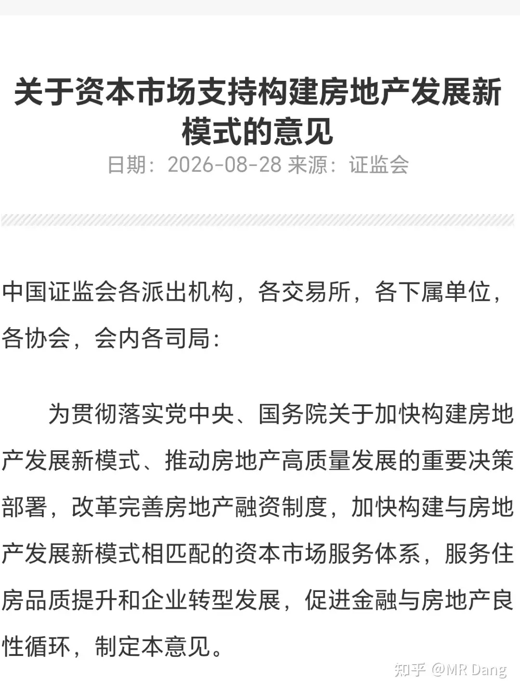
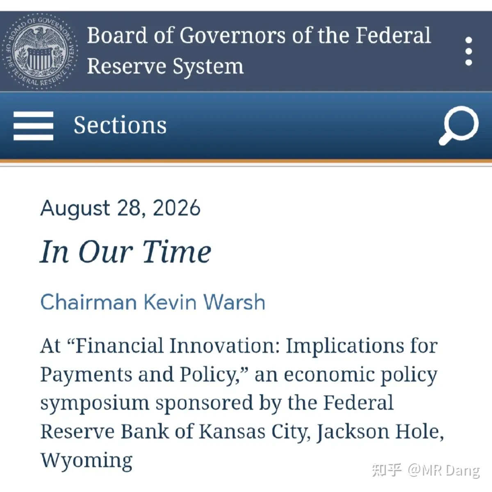
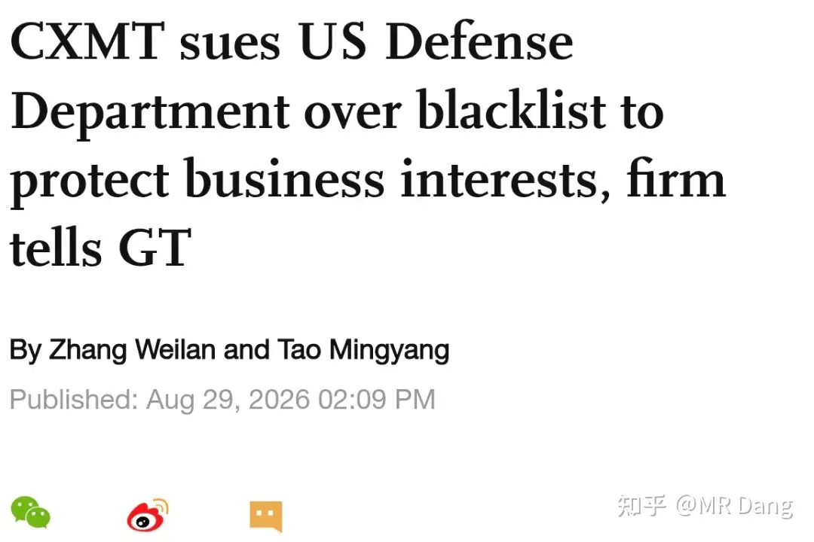
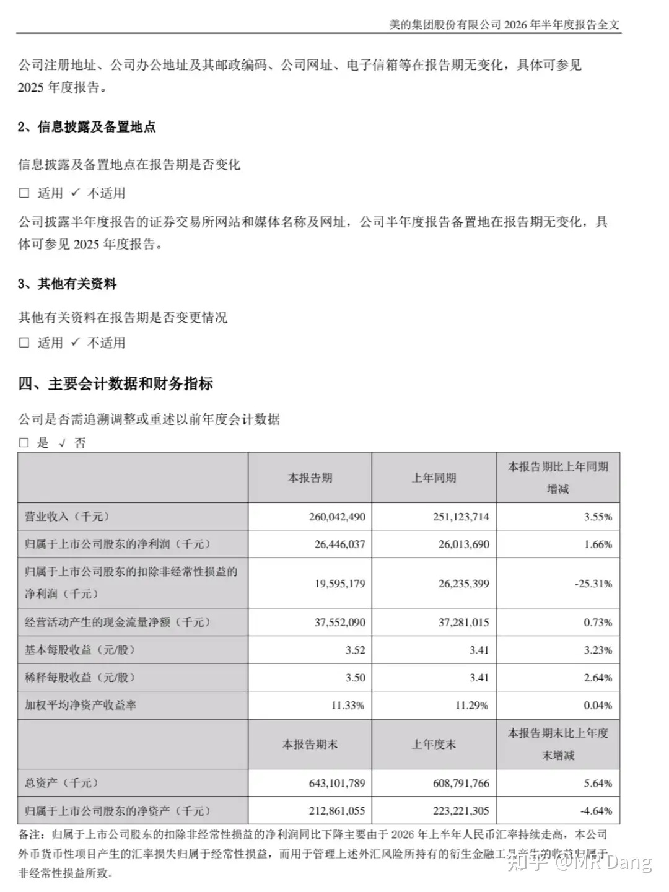
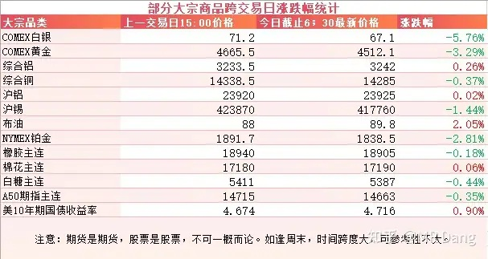
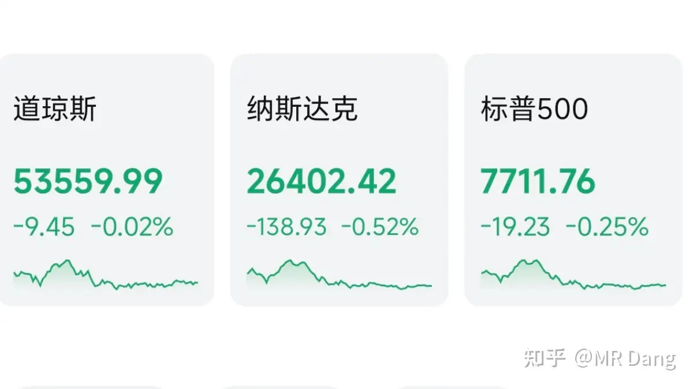

# 如何看待2026年8月31日A股行情走势？

---

**发布时间**: 2026-08-31 07:30  |  **原文链接**: https://www.zhihu.com/question/2076567019219170183/answer/2077659421187088681  |  **点赞数**: 190 人赞同

**作者信息**: MR Dang | 证券从业资格证持证人

---

## 正文内容

### 这个周末好热闹，全都是大事，咱们一起过一遍

有关部门发布了《关于完善商品住房销售制度的通知》，和这个通知一起发布的文件还有《商品住房开发贷款管理办法》。

这个看原文才能理解到位，以文件为准。

我个人看了下，主要是两点比较超预期，一个是房贷从30年放宽到40年。

这个其实还是偏向加杠杆的策略，基本和大家的工作年限重叠了。

对银行是个小利好，多多少少能刺激点需求。

还有一个是现房销售的推行，虽然给了新房新办法老房老办法的缓冲地带，但是未来房企的集中度将会大幅提升。

现房销售对自有资金的要求很高，高周转高杠杆那套玩法宣告结束。

### 所以相关部门也配套了另一个文件

这个文件主要是用来给房企补血的，现房销售需要的资金压力太大，可以通过资本市场回回血，定向增发之类的。

嗯，这个口子很多年没开了，这对房企是很可观的利好。

三箭齐发，对于行业规范和长远发展是好事，对银行和房企都算利好，特别是大型央企，受益更明显。

但是这里有个点，对原有股东未必就一定是好事，增发可是会摊薄权益的。

房企的历史波动都很大，现在又碰到这种政策刺激，可以预见今天的波动不会小的。

从理性角度分析，这是减少了未来的供应，所以利好现有的二手房，利好存量市场，在座的各位都算受益者。

---

### 美联储沃什

在上周五沃什发表了9月中旬货币议息前的最后一次演讲，题目是“我们的时代”。

在这场演讲中，他25次提及“通胀”，并表示PCE是美联储最关注的指标。

相当偏鹰的一次表态，演讲前9月加息概率是35%左右，演讲后直接升到了60%。

---

### 大A股王把西大送上了被告席

据媒体报道，被告的是西大国防部。

股王还发了一份挺不错的半年报以及LPDDR6量产的消息，都引起了市场的关注。

---

### 家电龙头

发布了2026半年报，扣非看着有点惨兮兮，不过拆解一下，内销和出口都是增长的，汇兑损益拉低了扣非净利润，但是管理层通过金融工具赚回来一些，这部分是非经常性损益。

大环境这样了，国补退潮加消费承压，这份半年报个人觉得还是可以的。

---

### 大宗商品

金银杀手讲话后，贵金属金银铂直线跳水。

工业金属铜铝还好，没怎么受影响。

农产品在相对高位震荡。

美债收益率又上去了。

A50期指看着有点悬。

### 外围市场

上个交易日美三大股指集体回调，纳指领跌，科技板块走弱。

---

上个交易日个人组合净值回撤小半个点，银行绿一个，电网绿一个，资源纳米红，消费红两个多点。

今天要是没意外的话，一顿打估计少不了。

银行的半年报里子其实还行，利息净收入和非息净收入都是两位数的增长。

问题大的业务主要是1370多亿的信用卡业务和2000多亿的经营贷消费贷，计提的太狠了，导致归母净利的数据过于难看。

另外派息政策要等年报才能知道，这个预期管理做的不好。

我个人没有更近一步的想法，留待年报观察派息政策。

---

### 本周前瞻

1，今天公布咱们这边的制造业PMI数据。

2，周三公布西大的ADP就业数据。

3，周四西大周初请失业金人数。

4，周五西大非农就业人数。

---

### 一个喜欢保护韭菜的博主，希望大家少少踩坑，多多赚钱！！！

> [!comment]- 点击展开评论
>
> | 用户 | 时间 | 内容 |
> | :--- | :--- | :--- |
> | Wien落榜大宝宝 |  | 烂银行高盛给了6-的价格，卖出评级，早上应该逃一波，还是等情绪到位了加仓开赌？业绩真太难看了，主要是扣了那么多利润以后拨备覆盖率才微涨一丢丢，还是在150%以下，同时坏账大幅恶化，给人一种雷还远没爆完的感觉，叠加不分红，市场这一波情绪杀应该免不了了。过去最亮眼的高股息率还能卖个稳定现金流的预期，现在不分红，马上要变成高股息陷阱了[大哭] |
> | LukyNine |  | 8月的最后一天，烂银行给了我当头一棒[笑哭] |
> | 霹雳蝴蝶 |  | 老师早[感谢]...今天烂银行麻了[大哭] |
> | &nbsp;&nbsp;&nbsp;&nbsp;MR Dang |  | [感谢] |
> | 王子晋 |  | 银行今天太刺激了 |
> | &nbsp;&nbsp;&nbsp;&nbsp;MR Dang |  | [感谢] |
> | OK莹宝 |  | 跟着买银行还能跌五六个点[大哭] |
> | 墨魂 |  | 银行都能跌成这样[捂脸]还好我好坏都有[酷] |
> | 咔咔咯咯 |  | [感谢] |
> | &nbsp;&nbsp;&nbsp;&nbsp;MR Dang |  | [感谢] |
> | 路江直树 |  | “：减少了未来的供应，所以利好现有的二手房，利好存量市场，”难道不是新房对二手的冲击更大吗 |
> | 夕雾Zero |  | dang大，房地产政策出台后，还是之前的观点，非必要不购房吗？ |
> | &nbsp;&nbsp;&nbsp;&nbsp;MR Dang |  | 是 |
> | 知乎用户nAF89 |  | [感谢][感谢][感谢] |
> | &nbsp;&nbsp;&nbsp;&nbsp;MR Dang |  | [感谢] |

---

*本文件从 MR Dang 知乎页面转载*

**作者**: MR Dang  
**链接**: https://www.zhihu.com/question/2076567019219170183/answer/2077659421187088681  
**来源**: 知乎

*著作权归作者所有。商业转载请联系作者获得授权，非商业转载请注明出处。*

---

## 相关阅读

- [[20260828-如何看待2026年8月28日A股市场行情？|上一篇：如何看待2026年8月28日A股市场行情？]]
- [[20260901-如何看待2026年9月1日A股行情？|下一篇：如何看待2026年9月1日A股行情？]]
