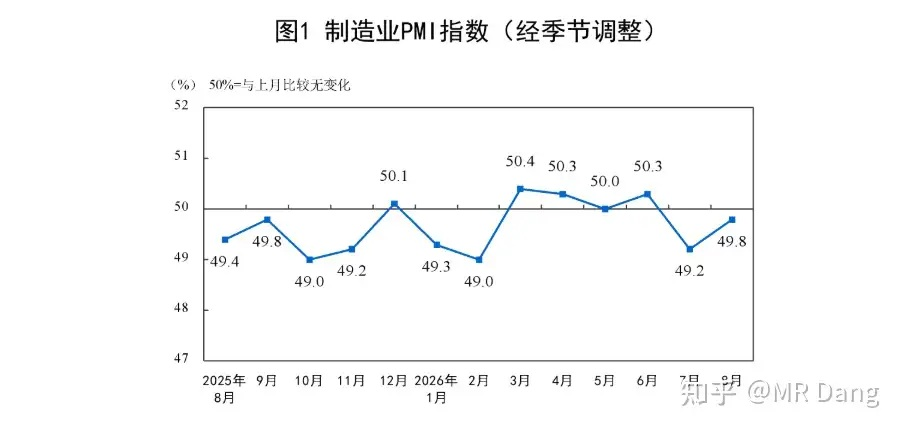
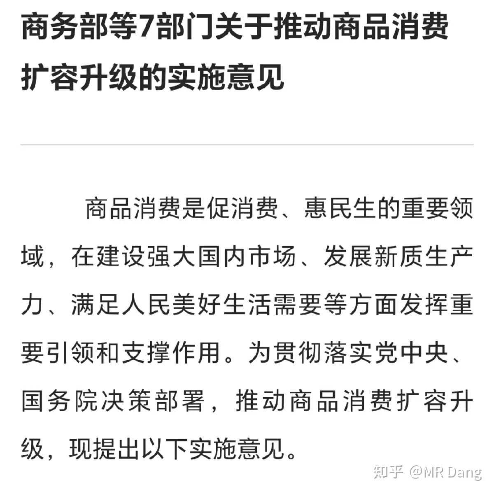
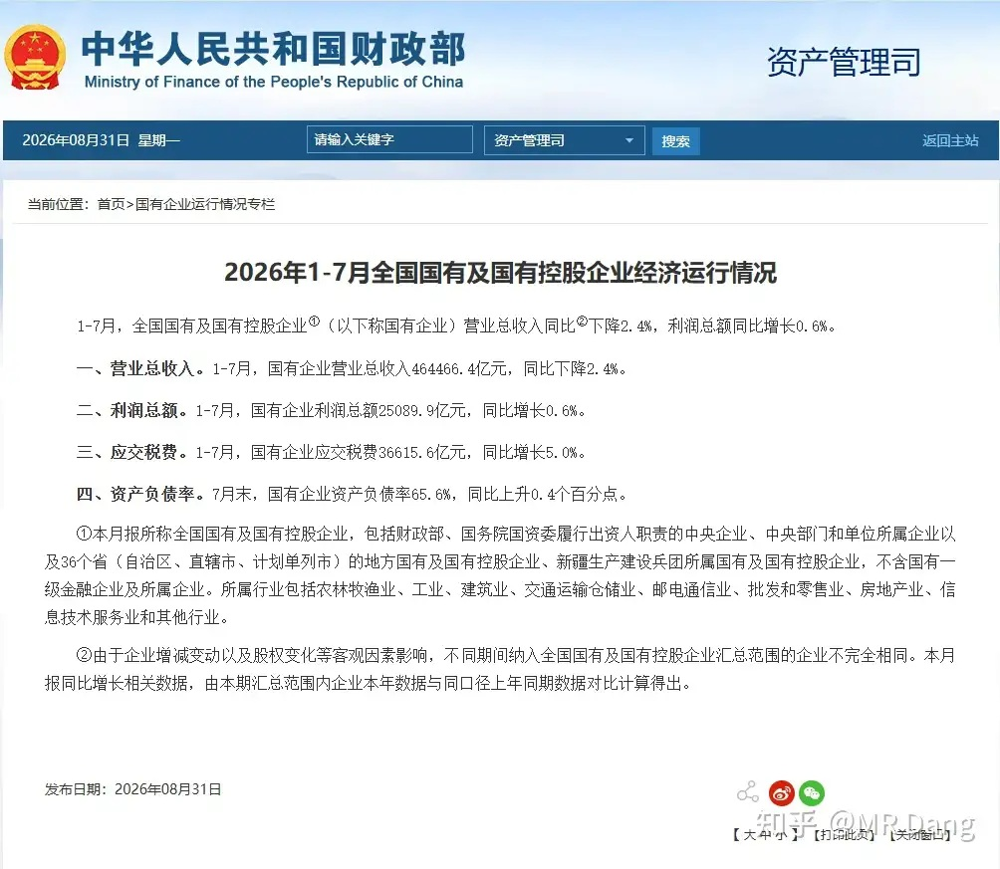
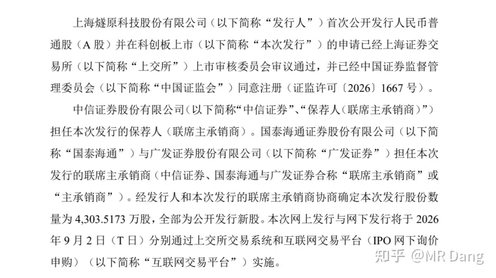
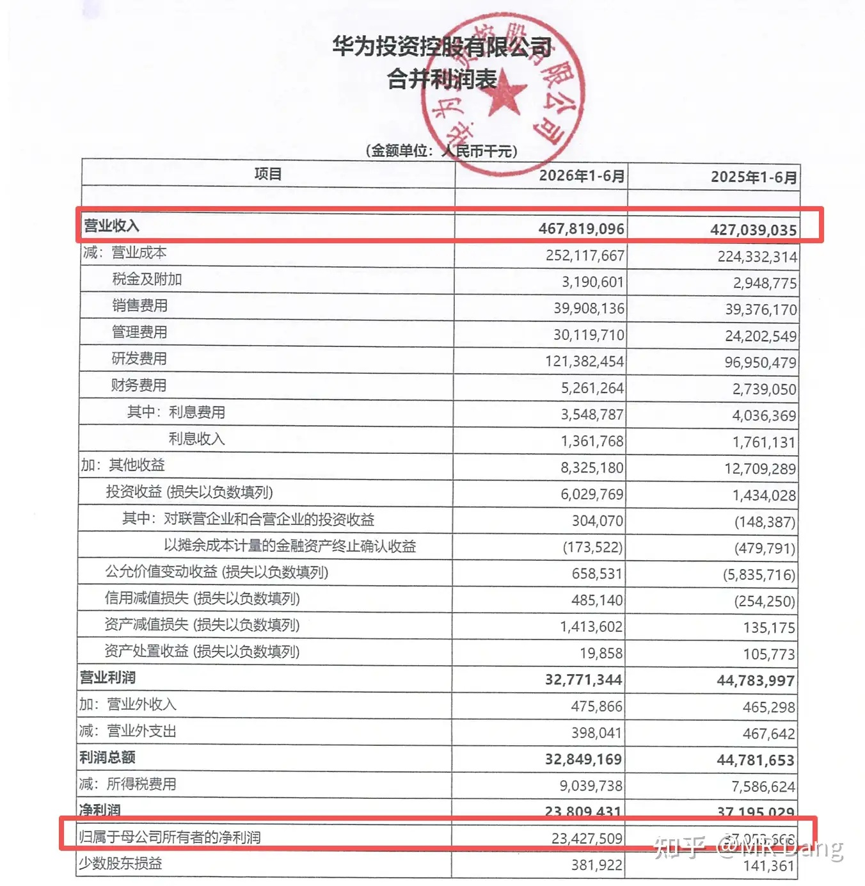
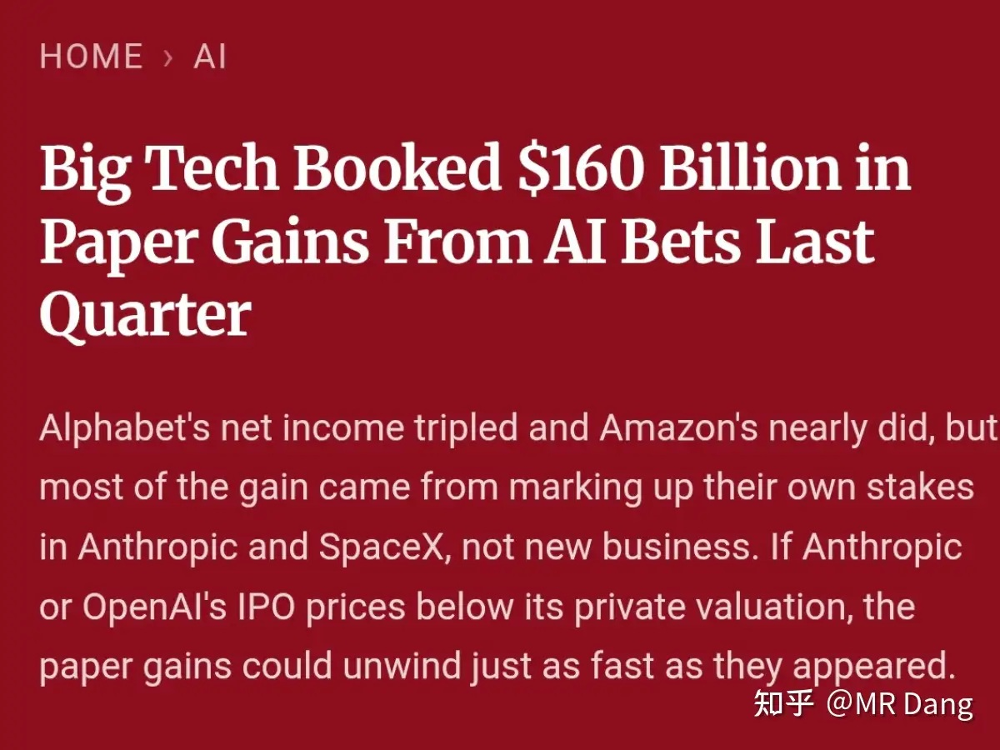
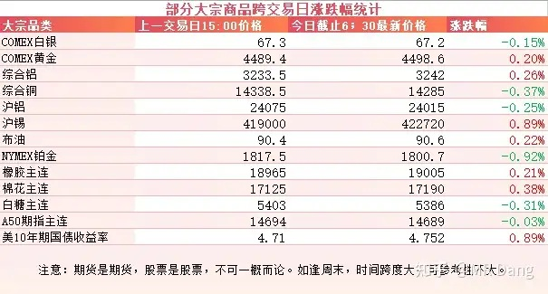
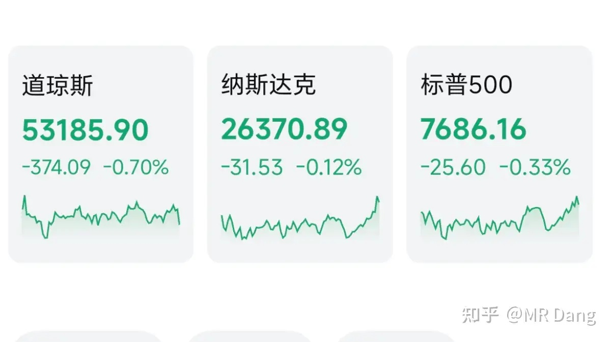
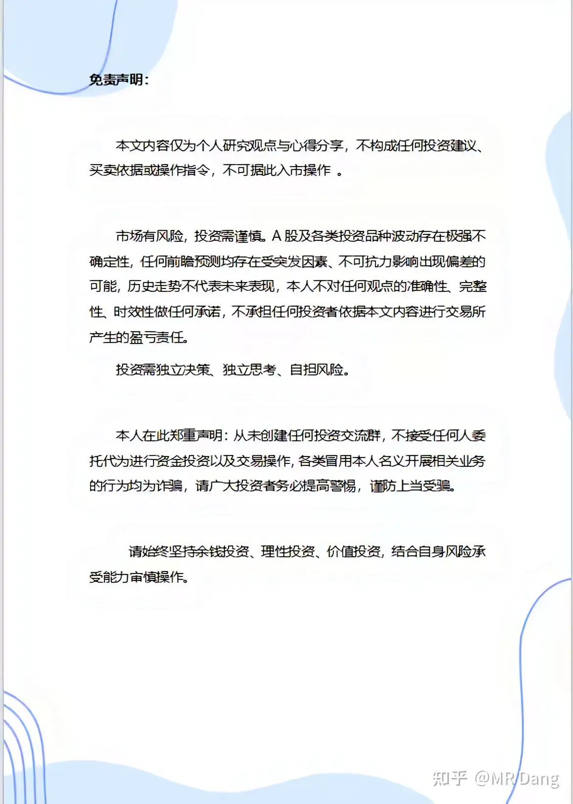

# 如何看待2026年9月1日A股行情？

---

**发布时间**: 2026-09-01 07:30  |  **原文链接**: https://www.zhihu.com/question/2077294461487530057/answer/2078021802064987938  |  **点赞数**: 162 人赞同

**作者信息**: MR Dang | 证券从业资格证持证人

---

## 正文内容

### 统计局发布了制造业PMI数据

49.8%，依然处于50%枯荣线以下，但是环比上个月有所增长。

结构上的话新订单指数是最大亮点，重回50.6的扩张区间，这是最大的好消息了，说明需求还在。

原材料购进价格指数56.6，提示成本压力很大，中游加工环节利润承压。

---

### 有关部门发了一个促销费的文件

总量上提了一个到2030年社零60万亿的目标，这个不算什么新增表述，之前也有过。

这种整合性的文件里一般很难找到增量信息，不过翻了很多遍以后，还是犄角旮旯里找到了“培育世界级茶饮品牌”这样一个比较细的点，这是首次提出。

其他的基本都是之前发布过的内容。

---

### 有关部门发布了前七个月的国企纳税数据

利润总额增长了0.6%，应交税费增长了5%，比例上不太同步。

不知道投资者有没有发现，自从今年以来，有关税务的风险已经成为投资决策时需要优先考虑的风险之一了。

我个人已经大大小小吃了好几次亏了。

其实对就业方向也有启示，现在税务筹划方面的就业环境还不错。

---

### 打新

又来了一个疑似大肉签，明天开始申购，发行价142.18，科创板的。

---

### 菊花厂发布了财报

研发力度真的强，不愧是西大认证过的，半年1213亿，营收的四分之一拿去做研发了。

所以这种公司看利润，算PE没什么用，只要想释放利润，研发投入稍微节省一些就能释放出天量的利润。

大A想找一个能完全对标的企业还找不到，这要是上市了，也了不得。

---

### AI产业链的纸面富贵

FT发了一个重磅调查，表示在跟踪资金流向后发现Ai产业链里有大量的纸面富贵。

具体的链条可以简单的归纳成：A投资B ，B购买A的服务，A的营收数据增加，B的估值上涨，再带动A的财报投资利润增加。

最后在没有任何现金流入的情况下，达成了1600亿美元的纸面富贵。

---

### 大宗商品

原油昨天白天涨了一波，因为美伊又有点小摩擦，而且沙特提高了售价，收盘后倒是没啥变化。

有色整体变化不大，在小范围内波动，锡稍微强一点。

农产品高位震荡，橡胶突破了1万9。

美债收益率看着有点吓人，十年期都4.75了，资本市场真的不怕么。

### 外围市场

美三大股指集体回调，道指领跌。

板块上表现比较好的有存储，油气和造车。

---

昨天个人组合净值回撤近三个点，银行绿近5个点，资源绿两个，消费微绿，电网绿半个。

八月的最后一天挨了一击重拳，整个八月也把七月的盈利吐回去大半。

这里本来敲了很多字来吐槽管理层，最后都删了，因为人在无语的时候真的很无语。

点开业绩发布会，看着一堆堆的车轱辘话，感觉又浪费了五分钟。

突然看到一个问题，大概是问逾期是怎么突然冒出来的，是新增的还是原来的。

管理层回复是“前期已经识别的风险”。

正琢磨这话里话外的意思呢，再一刷新，嘿，不见了。

好吧，那可能是我眼花了。

虽然挨了一击重拳，但是我个人对这个行业有信心，哪怕是排名最后的那几个。

因为这种事情不是第一次发生了，主动出清后基本都会回到正轨。

之前出的房贷政策，总的来说对银行是利好，多了十年的期限，不良率会降低。

但是也有不好的一方面，如果申请延期的话，短时间内每期还款额就会减少，相当于短期内的营收增速会放缓，换来的是长期更健康的资产负债表。

市场一合计，这买卖还不错，所以昨天银行业整体表现可以。

---

### 一个喜欢保护韭菜的博主，希望大家少少踩坑，多多赚钱！！！

> [!comment]- 点击展开评论
>
> | 用户 | 时间 | 内容 |
> | :--- | :--- | :--- |
> | Steven今天回本了 |  | 第一次看到回撤这么多[酷]银行也能暴雷也是活久见 |
> | &nbsp;&nbsp;&nbsp;&nbsp;MR Dang |  | [感谢] |
> | 八卓 |  | 反而北京银行涨了五个点 |
> | &nbsp;&nbsp;&nbsp;&nbsp;执念太深岂能如愿 |  | 邮政也不差 |
> | &nbsp;&nbsp;&nbsp;&nbsp;Abcdefg |  | 银行不上不下，不过当早上开盘银行涨，就知道这一天玩了，再也不打开软件， |
> | 我是一颗桃子吖 |  | 早[感谢] |
> | &nbsp;&nbsp;&nbsp;&nbsp;MR Dang |  | [感谢]早啊 |
> | JUZISHU |  | 之前看到说华为研发一部分是用来利益输送，真的假的？ |
> | &nbsp;&nbsp;&nbsp;&nbsp;带着一股痞子气 |  | 营销费也包在里面[飙泪笑] |
> | &nbsp;&nbsp;&nbsp;&nbsp;莱菔子 |  | 研发人际关系也是研发[酷] |
> | 未完待续 |  | [感谢] |
> | 大千世界的尘埃 |  | [哇] |
> | &nbsp;&nbsp;&nbsp;&nbsp;MR Dang |  | [感谢] |
> | 鲲鹏 |  | [感谢] |
> | &nbsp;&nbsp;&nbsp;&nbsp;MR Dang |  | [感谢] |
> | jincsjin |  | [感谢] |
> | &nbsp;&nbsp;&nbsp;&nbsp;MR Dang |  | [感谢] |
> | 薛定谔的猫耳朵 |  | [感谢] |
> | &nbsp;&nbsp;&nbsp;&nbsp;MR Dang |  | [感谢] |
> | 18一枝花 |  | [感谢] |
> | &nbsp;&nbsp;&nbsp;&nbsp;MR Dang |  | [感谢] |

---

*本文件从 MR Dang 知乎页面转载*

**作者**: MR Dang  
**链接**: https://www.zhihu.com/question/2077294461487530057/answer/2078021802064987938  
**来源**: 知乎

*著作权归作者所有。商业转载请联系作者获得授权，非商业转载请注明出处。*

---

## 相关阅读

- [[20260831-如何看待2026年8月31日A股行情走势？|上一篇：如何看待2026年8月31日A股行情走势？]]
- [[20260902-大家对2026年9月2日A股市场行情都怎么看待？|下一篇：大家对2026年9月2日A股市场行情都怎么看待？]]
